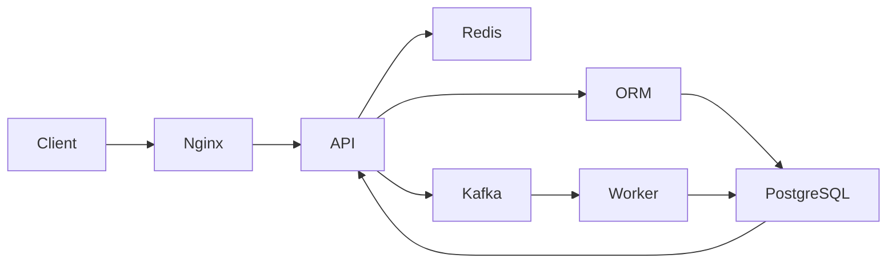
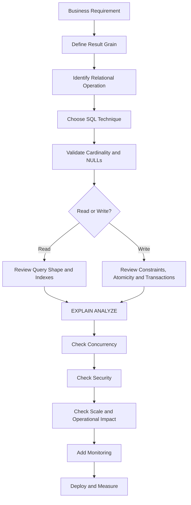

# README

## Overview

This folder is a practical decision guide for choosing the right SQL technique for common backend engineering problems.

SQL provides many constructs that can solve similar-looking requirements:

- `JOIN`
- `EXISTS`
- `IN`
- Subqueries
- CTEs
- `GROUP BY`
- `HAVING`
- Window functions
- `LAG` / `LEAD`
- `ROW_NUMBER` / `RANK` / `DENSE_RANK`
- `UNION` / `UNION ALL`
- `CASE` / `COALESCE`
- Views
- Temporary tables
- Transactions
- Constraints
- Indexes
- Offset and keyset pagination

The goal of this folder is not to memorize syntax. It is to develop the ability to answer:

> **What SQL technique most directly expresses the business requirement while preserving correctness, concurrency safety, performance, and operational reliability?**

The central decision process is:

```text
Business Requirement
        ↓
Define Result Grain
        ↓
Identify Relational Operation
        ↓
Choose SQL Technique
        ↓
Validate Cardinality + NULL Semantics
        ↓
Consider Concurrency
        ↓
Consider Indexes + Scale
        ↓
Inspect Execution Plan
        ↓
Validate Operational Behavior
```

## Navigation

| # | Section | Layer | Description |
|---|---|---|---|
| 01 | [SQL Patterns and Decision Guides](./README.md) | Applied SQL | Choosing the right SQL technique for common backend engineering decisions |
| 02 | [01- JOIN vs Subquery vs EXISTS](./01-%20JOIN%20vs%20Subquery%20vs%20EXISTS.md) | Applied SQL | Choosing between JOIN, correlated subquery, and EXISTS for filtering and lookup |
| 03 | [02- CTE vs Subquery vs Temporary Table](./02-%20CTE%20vs%20Subquery%20vs%20Temporary%20Table.md) | Applied SQL | Selecting the right intermediate result strategy |
| 04 | [03- GROUP BY vs Window Function](./03-%20GROUP%20BY%20vs%20Window%20Function.md) | Applied SQL | When to aggregate and when to use a window function |
| 05 | [04- UNION vs UNION ALL](./04-%20UNION%20vs%20UNION%20ALL.md) | Applied SQL | Understanding deduplication cost and when each is appropriate |
| 06 | [05- WHERE vs HAVING](./05-%20WHERE%20vs%20HAVING.md) | Applied SQL | Filtering before and after aggregation |
| 07 | [06- CASE vs COALESCE](./06-%20CASE%20vs%20COALESCE.md) | Applied SQL | Conditional value selection and NULL substitution |
| 08 | [07- EXISTS vs IN](./07-%20EXISTS%20vs%20IN.md) | Applied SQL | Membership testing and NULL behavior differences |
| 09 | [08- ROW_NUMBER vs RANK vs DENSE_RANK](./08-%20ROW_NUMBER%20vs%20RANK%20vs%20DENSE_RANK.md) | Applied SQL | Choosing the right ranking function for the business requirement |
| 10 | [09- LAG vs LEAD](./09-%20LAG%20vs%20LEAD.md) | Applied SQL | Accessing previous and next row values in ordered sets |
| 11 | [10- View vs CTE](./10-%20View%20vs%20CTE.md) | Applied SQL | Reusable query logic: persistent views vs inline CTEs |
| 12 | [11- View vs Temporary Table](./11-%20View%20vs%20Temporary%20Table.md) | Applied SQL | When to materialize intermediate results vs use a view |
| 13 | [12- Stored Procedure vs Application Logic](./12-%20Stored%20Procedure%20vs%20Application%20Logic.md) | Applied SQL | Where business logic belongs in a backend system |
| 14 | [13- Offset vs Keyset Pagination](./13-%20Offset%20vs%20Keyset%20Pagination.md) | Applied SQL | Pagination strategy trade-offs at scale |
| 15 | [14- NULL vs Empty String](./14-%20NULL%20vs%20Empty%20String.md) | Applied SQL | Semantic distinction and storage decisions for absent values |
| 16 | [15- Normalization vs Denormalization](./15-%20Normalization%20vs%20Denormalization.md) | Applied SQL | Schema design trade-offs for integrity and read performance |
| 17 | [16- Index vs No Index](./16-%20Index%20vs%20No%20Index.md) | Applied SQL | When indexing helps, hurts, or is unnecessary |
| 18 | [17- Composite Index Column Order](./17-%20Composite%20Index%20Column%20Order.md) | Applied SQL | Designing composite indexes around actual query access patterns |
| 19 | [18- Transaction vs No Transaction](./18-%20Transaction%20vs%20No%20Transaction.md) | Applied SQL | When explicit transactions are required vs unnecessary overhead |
| 20 | [19- Choosing the Right SQL Technique](./19-%20Choosing%20the%20Right%20SQL%20Technique.md) | Applied SQL | A systematic framework for SQL technique selection |
| 21 | [20- SQL Decision Making Checklist](./20-%20SQL%20Decision%20Making%20Checklist.md) | Applied SQL | Production checklist for reviewing SQL technique choices |

---

## Folder Scope

The documents in this folder focus on **SQL patterns and engineering decisions** rather than isolated syntax references.

They answer questions such as:

- Should I use `JOIN` or `EXISTS`?
- Should this query use a CTE or subquery?
- Should I use `GROUP BY` or a window function?
- Should I use `UNION` or `UNION ALL`?
- Should this condition go in `WHERE` or `HAVING`?
- Should I use `CASE` or `COALESCE`?
- Should I use `EXISTS` or `IN`?
- Which ranking function should I use?
- Should I use a view or temporary table?
- Should a write use a transaction?
- Should pagination use offset or keyset?
- Should I add an index?
- What composite index column order should I choose?
- How should I make the final SQL decision in production?

---

## Recommended Reading Order

The folder progresses from individual SQL choices toward a general decision-making framework.

| File | Topic | Primary Decision |
|---|---|---|
| `01- JOIN vs Subquery vs EXISTS.md` | Combining related data | `JOIN` vs subquery vs existence |
| `02- CTE vs Subquery vs Temporary Table.md` | Intermediate query structures | Query-local vs materialized intermediate data |
| `03- GROUP BY vs Window Function.md` | Aggregation | Collapse rows vs preserve rows |
| `04- UNION vs UNION ALL.md` | Set combination | Deduplicate vs preserve all rows |
| `05- WHERE vs HAVING.md` | Filtering | Row-level vs group-level filtering |
| `06- CASE vs COALESCE.md` | Expressions | Conditional logic vs NULL fallback |
| `07- EXISTS vs IN.md` | Set/existence filtering | Existence vs membership |
| `08- ROW_NUMBER vs RANK vs DENSE_RANK.md` | Ranking | Unique positions vs tied rankings |
| `09- LAG vs LEAD.md` | Sequential analysis | Previous vs next row |
| `10- View vs CTE.md` | Query abstraction | Persistent vs query-local logic |
| `11- View vs Temporary Table.md` | Materialization | Persistent abstraction vs session-local data |
| `12- Stored Procedure vs Application Logic.md` | Logic placement | Database logic vs application logic |
| `13- Offset vs Keyset Pagination.md` | Pagination | Offset vs cursor-based navigation |
| `14- NULL vs Empty String.md` | Missing-value semantics | `NULL` vs empty value |
| `15- Normalization vs Denormalization.md` | Data modeling | Consistency vs read optimization |
| `16- Index vs No Index.md` | Access paths | Indexed vs non-indexed access |
| `17- Composite Index Column Order.md` | Index design | Choosing composite index order |
| `18- Transaction vs No Transaction.md` | Transaction boundaries | Atomicity vs independent operations |
| `19- Choosing the Right SQL Technique.md` | Technique selection | Matching SQL constructs to requirements |
| `20- SQL Decision Making Checklist.md` | Production review | End-to-end SQL decision process |

---

## Core Mental Model

The most useful SQL mental model is:

```text
Requirement
    ↓
What operation is actually required?
    ↓
┌──────────────────────────────────────┐
│ Filter?                              │
│ Join?                                │
│ Existence?                           │
│ Aggregate?                           │
│ Analyze rows?                        │
│ Combine result sets?                 │
│ Transform values?                   │
│ Modify state?                        │
│ Enforce invariant?                  │
│ Optimize access?                    │
└──────────────────────────────────────┘
    ↓
Select the corresponding SQL construct
```

For example:

```text
"Does this customer have any paid orders?"
        ↓
Existence
        ↓
EXISTS
```

while:

```text
"Return each paid order with customer email."
        ↓
Combine related rows
        ↓
JOIN
```

and:

```text
"Return total revenue per customer."
        ↓
Collapse rows into groups
        ↓
GROUP BY
```

and:

```text
"Return every order plus that customer's total revenue."
        ↓
Preserve rows + calculate group context
        ↓
Window function
```

---

## Result Grain Comes First

Before writing non-trivial SQL, define the result grain.

Examples:

```text
One row per customer
One row per order
One row per order item
One row per customer per month
One row per product
One row per customer containing latest order
```

This is particularly important for joins and aggregations.

Consider:

```text
customers
    ↓ 1:N
orders
```

Joining these tables changes the result from:

```text
one row per customer
```

to potentially:

```text
one row per order
```

If the original customer grain must be preserved, `EXISTS`, aggregation, or another explicit strategy may be more appropriate.

---

## Technique Selection Matrix

| Requirement | Starting Technique |
|---|---|
| Filter rows | `WHERE` |
| Check related-row existence | `EXISTS` |
| Exclude related rows | `NOT EXISTS` |
| Match against a set | `IN` |
| Retrieve related columns | `JOIN` |
| Collapse rows into groups | `GROUP BY` |
| Filter aggregate results | `HAVING` |
| Preserve rows while calculating context | Window function |
| Compare previous row | `LAG` |
| Compare next row | `LEAD` |
| Assign unique row positions | `ROW_NUMBER` |
| Rank with gaps after ties | `RANK` |
| Rank without gaps after ties | `DENSE_RANK` |
| Combine result sets | `UNION` / `UNION ALL` |
| Conditional transformation | `CASE` |
| NULL fallback | `COALESCE` |
| Query-local decomposition | CTE |
| Persistent query abstraction | View |
| Session-local intermediate data | Temporary table |
| Database-centric reusable operation | Stored procedure/function |
| Multiple writes as one unit | Transaction |
| Enforce uniqueness | Unique constraint/index |
| Atomic conditional state change | Conditional `UPDATE` |
| Improve access path | Index |
| Large ordered pagination | Keyset pagination |

---

## JOIN Decision

Use `JOIN` when related data is required.

```sql
SELECT
    o.id,
    o.total_amount,
    c.email
FROM orders AS o
JOIN customers AS c
    ON c.id = o.customer_id
WHERE o.status = 'paid';
```

Before using a join:

- [ ] Do I need columns from the related table?
- [ ] What is the relationship cardinality?
- [ ] Can the join multiply rows?
- [ ] Is the join type correct?
- [ ] Is the result grain correct?
- [ ] Are join predicates indexed appropriately?

If the requirement is only:

```text
"Does a matching row exist?"
```

consider `EXISTS`.

---

## EXISTS Decision

Use `EXISTS` for existence semantics.

```sql
SELECT c.id
FROM customers AS c
WHERE EXISTS (
    SELECT 1
    FROM orders AS o
    WHERE o.customer_id = c.id
      AND o.status = 'paid'
);
```

The important distinction is semantic:

```text
JOIN
→ Return matching related rows

EXISTS
→ Determine whether a matching row exists
```

Do not assume `EXISTS` is always faster than alternatives. PostgreSQL can transform equivalent queries into different semi-join strategies depending on the query and data.

---

## IN Decision

Use `IN` when membership in a set is the natural requirement.

```sql
SELECT id
FROM orders
WHERE customer_id IN (
    SELECT id
    FROM customers
    WHERE country_code = 'IN'
);
```

For exclusion, carefully consider NULL behavior:

```sql
NOT EXISTS (...)
```

is often safer than:

```sql
NOT IN (...)
```

when NULLs may be present.

---

## GROUP BY Decision

Use `GROUP BY` when rows should collapse into groups.

```sql
SELECT
    customer_id,
    SUM(total_amount) AS revenue
FROM orders
WHERE status = 'paid'
GROUP BY customer_id;
```

Use it when the desired grain is:

```text
one row per group
```

Do not use `GROUP BY` when the original rows must remain visible.

---

## Window Function Decision

Use window functions when calculations need group or row context while preserving the original rows.

```sql
SELECT
    id,
    customer_id,
    total_amount,
    SUM(total_amount) OVER (
        PARTITION BY customer_id
    ) AS customer_revenue
FROM orders;
```

Mental model:

```text
GROUP BY
many rows → fewer rows

Window function
many rows → same rows + additional context
```

---

## WHERE vs HAVING

Use:

```sql
WHERE
```

for row-level predicates.

Use:

```sql
HAVING
```

for group-level aggregate predicates.

Example:

```sql
SELECT
    customer_id,
    SUM(total_amount) AS revenue
FROM orders
WHERE status = 'paid'
GROUP BY customer_id
HAVING SUM(total_amount) >= 10000;
```

Do not move predicates into `HAVING` simply because aggregation exists.

---

## CASE vs COALESCE

Use `CASE` for conditional logic:

```sql
CASE
    WHEN total_amount >= 1000 THEN 'high'
    WHEN total_amount >= 500 THEN 'medium'
    ELSE 'low'
END
```

Use `COALESCE` for NULL fallback:

```sql
COALESCE(display_name, email)
```

Important distinction:

```text
CASE
→ Evaluate conditions

COALESCE
→ Return first non-NULL expression
```

Remember:

```sql
COALESCE('', 'fallback')
```

returns the empty string because it is not NULL.

---

## CTE vs Subquery vs Temporary Table

Think in terms of scope and materialization:

```text
Subquery
    ↓
Local derived expression

CTE
    ↓
Named query-local relation

Temporary table
    ↓
Session-local materialized relation
```

In PostgreSQL, eligible CTEs may be inlined. Do not assume a CTE is always a performance boundary.

Temporary tables can be useful for large intermediate datasets, repeated access, or cases where indexing/analyzing the intermediate data is beneficial.

---

## View vs CTE

Use a CTE when the structure belongs to one query:

```sql
WITH recent_orders AS (
    ...
)
SELECT ...
```

Use a view when the abstraction should persist:

```sql
CREATE VIEW customer_order_summary AS
SELECT ...
```

A normal view stores the query definition rather than a cached result.

---

## View vs Temporary Table

Use a view for:

```text
Persistent database-level abstraction
```

Use a temporary table for:

```text
Session-local materialized data
```

A temporary table can have indexes and statistics, but it is not durable application state.

Connection pooling and transaction pooling must be considered when application code depends on session-local objects.

---

## Stored Procedure vs Application Logic

Put logic close to the database when it is primarily:

- Set-based.
- Data-intensive.
- Transactional.
- Database-centric.

Keep logic in the application when it requires:

- External APIs.
- Kafka.
- Redis.
- Celery.
- Cross-service orchestration.
- Complex domain workflows.

The architectural distinction is:

```text
Database-local consistency
        ↓
Database

Cross-system workflow
        ↓
Application/service layer
```

Database constraints should still enforce database-level invariants.

---

## Transaction Decision

Use a transaction when multiple operations must commit or roll back together.

```sql
BEGIN;

UPDATE accounts
SET balance = balance - 100
WHERE id = $1;

UPDATE accounts
SET balance = balance + 100
WHERE id = $2;

COMMIT;
```

Do not automatically wrap:

```text
entire HTTP request
+
external API calls
+
long computations
```

inside a database transaction.

Transactions should be short and aligned with the required consistency boundary.

---

## Atomic SQL vs Transaction

Sometimes one atomic statement is better than several statements inside a transaction.

For inventory:

```sql
UPDATE inventory
SET available_quantity = available_quantity - $1
WHERE product_id = $2
  AND available_quantity >= $1
RETURNING product_id, available_quantity;
```

This can eliminate a race-prone:

```text
SELECT
    ↓
Application check
    ↓
UPDATE
```

flow.

The decision is not:

```text
transaction OR atomic SQL
```

It can be:

```text
transaction
+
atomic SQL
+
constraint
```

when the business operation requires all three.

---

## Pagination Decision

Offset pagination:

```sql
SELECT
    id,
    created_at
FROM orders
ORDER BY created_at DESC, id DESC
LIMIT 50
OFFSET 50000;
```

is simple but can become inefficient for large offsets.

Keyset pagination:

```sql
SELECT
    id,
    created_at
FROM orders
WHERE (created_at, id) < ($1, $2)
ORDER BY created_at DESC, id DESC
LIMIT 50;
```

is often more scalable for large ordered datasets.

For keyset pagination, ordering must be deterministic and the cursor fields should align with an appropriate index.

---

## NULL Decision

Always determine whether:

```text
NULL
```

means:

- Unknown.
- Not provided.
- Not applicable.
- Not yet calculated.
- Missing relationship.

Do not treat NULL as equivalent to:

```text
''
0
false
```

without explicit business semantics.

Use:

```sql
IS NULL
```

rather than:

```sql
= NULL
```

---

## Normalization vs Denormalization

Normalization is generally preferred when:

- Data consistency is important.
- Updates are frequent.
- Duplication should be minimized.
- Relationships are naturally relational.

Denormalization can be appropriate when:

- Read performance is critical.
- Derived data is expensive to calculate.
- The workload is read-heavy.
- Staleness is acceptable.
- Synchronization is explicitly designed.

Typical architecture:

```text
Normalized source of truth
        ↓
Derived read model/cache
        ↓
Fast application reads
```

Do not denormalize merely because a query is inconvenient. First evaluate indexes, query shape, aggregation, caching, and workload characteristics.

---

## Index Decision

An index is an access path, not a guarantee.

Before adding one:

- [ ] Which query needs it?
- [ ] What predicate does it support?
- [ ] Is the column selective?
- [ ] Does ordering matter?
- [ ] Is a composite index needed?
- [ ] Would a partial index be better?
- [ ] What write/storage cost will it introduce?
- [ ] Does another index already cover the workload?

Validate with:

```sql
EXPLAIN (ANALYZE, BUFFERS)
SELECT ...;
```

---

## Composite Index Decision

A useful starting heuristic is:

```text
Equality predicates
        ↓
Range predicates
        ↓
Ordering / tie-breakers
```

For:

```sql
WHERE tenant_id = $1
  AND status = $2
ORDER BY created_at DESC, id DESC
```

a candidate index might be:

```sql
CREATE INDEX orders_tenant_status_created_id_idx
ON orders (
    tenant_id,
    status,
    created_at DESC,
    id DESC
);
```

This is a workload-driven design decision, not an absolute rule.

Consider:

- Query frequency.
- Data distribution.
- Tenant skew.
- Selectivity.
- Ordering.
- Alternative query patterns.
- Write cost.

---

## Constraint Decision

Use database constraints to enforce database invariants.

Examples:

```text
PRIMARY KEY
UNIQUE
FOREIGN KEY
CHECK
NOT NULL
```

For uniqueness:

```sql
CREATE UNIQUE INDEX users_email_unique
ON users (email);
```

Application validation can provide useful feedback, but it should not replace a database constraint when concurrent writers can violate the invariant.

---

## SQL and Backend Architecture

SQL decisions exist inside a larger request/data flow:



A SQL decision can affect the entire architecture.

Examples:

```text
Poor query
    ↓
High database CPU
    ↓
Higher API latency
    ↓
More concurrent requests
    ↓
Connection pool pressure
    ↓
System-wide degradation
```

A database problem is often also an application architecture problem.

---

## ORM Decision Making

Frameworks such as Django and SQLAlchemy do not eliminate SQL reasoning.

The effective flow remains:

```text
Python
    ↓
ORM
    ↓
Generated SQL
    ↓
PostgreSQL Planner
    ↓
Execution
```

For Django:

```python
customers = Customer.objects.filter(
    orders__status="paid",
).distinct()
```

may be valid, but `distinct()` should not be added blindly.

If the actual requirement is existence, Django's `Exists` expression may communicate the intent more directly:

```python
from django.db.models import Exists, OuterRef

paid_orders = Order.objects.filter(
    customer_id=OuterRef("pk"),
    status="paid",
)

customers = Customer.objects.annotate(
    has_paid_order=Exists(paid_orders),
)
```

The ORM should be reviewed at the SQL level for performance-sensitive paths.

---

## Security Decision Checklist

Every production SQL operation should answer:

```text
Who is allowed to access this data?
Which tenant owns it?
Which columns are necessary?
Can input alter SQL structure?
Which database role executes it?
```

Use parameterized queries:

```python
cursor.execute(
    """
    SELECT id, email
    FROM customers
    WHERE tenant_id = %s
      AND id = %s
    """,
    (tenant_id, customer_id),
)
```

Do not rely on:

```text
Application filtering after unrestricted SELECT
```

for sensitive tenant boundaries.

---

## Concurrency Decision Checklist

For every write, ask:

```text
What happens if two requests execute this simultaneously?
```

Consider:

- Unique constraints.
- Atomic updates.
- Transactions.
- Row locks.
- Isolation levels.
- Deadlocks.
- Serialization failures.
- Idempotency.
- Retry behavior.

Example:

```sql
UPDATE inventory
SET available_quantity = available_quantity - 1
WHERE product_id = $1
  AND available_quantity > 0
RETURNING product_id;
```

The affected-row result can determine whether the reservation succeeded.

---

## Production Performance Checklist

Before shipping an important query:

- [ ] Result set is appropriately bounded.
- [ ] Only required columns are selected.
- [ ] Filters are appropriate.
- [ ] JOIN cardinality is understood.
- [ ] Aggregation does not double-count.
- [ ] Pagination is appropriate.
- [ ] Indexes support the workload.
- [ ] Statistics are adequate.
- [ ] Execution plan has been inspected.
- [ ] Production-scale behavior has been considered.

Use:

```sql
EXPLAIN (ANALYZE, BUFFERS)
SELECT ...;
```

Do not optimize SQL based solely on how elegant the syntax appears.

---

## Reliability Checklist

For important database operations:

- [ ] Failure behavior is known.
- [ ] Transactions roll back correctly.
- [ ] Deadlocks are handled.
- [ ] Serialization failures can be retried where appropriate.
- [ ] Retry operations are idempotent.
- [ ] Unknown commit outcomes are considered.
- [ ] External side effects are not assumed to be transactional.
- [ ] Durable state is distinguishable from cache state.
- [ ] Recovery procedures exist.

A database transaction does not automatically undo:

```text
HTTP request
email
Kafka event
Redis write
payment-provider call
```

performed outside the database.

---

## Large Data Operation Checklist

For large updates, deletes, and backfills:

```text
Estimate
    ↓
Test
    ↓
Batch
    ↓
Throttle
    ↓
Observe
    ↓
Resume safely
```

Check:

- [ ] Number of affected rows.
- [ ] WAL generation.
- [ ] Lock duration.
- [ ] Replica lag.
- [ ] Dead tuples and bloat.
- [ ] Index maintenance.
- [ ] Connection usage.
- [ ] Durable progress.
- [ ] Retry/idempotency behavior.

Do not automatically put millions of rows into one transaction.

---

## Read Replica Checklist

If a query can execute against a replica:

- [ ] Is stale data acceptable?
- [ ] Does the endpoint require read-your-writes?
- [ ] Could replica lag affect the response?
- [ ] Is the query routed correctly?
- [ ] Is replica lag monitored?

Example:

```text
POST /orders
    ↓
Primary commits
    ↓
GET /orders/123
    ↓
Replica has not replayed the change
    ↓
Order appears missing
```

This is a distributed consistency issue, not simply a SQL query problem.

---

## Redis Decision Checklist

Before adding Redis:

- [ ] Is the SQL query already correctly optimized?
- [ ] Is the result expensive enough to cache?
- [ ] Is stale data acceptable?
- [ ] How will invalidation work?
- [ ] What happens on cache eviction?
- [ ] Is PostgreSQL still the source of truth?
- [ ] Could stale data violate security or business rules?

Caching should complement a correct database design rather than hide a poor one.

---

## Kafka Decision Checklist

For database-to-event workflows:

- [ ] Must database state and event intent commit together?
- [ ] Is a transactional outbox appropriate?
- [ ] Can consumers receive duplicate events?
- [ ] Are consumers idempotent?
- [ ] What happens if Kafka is unavailable?
- [ ] How are failed events retried?
- [ ] Is ordering important?

A PostgreSQL transaction does not automatically include Kafka.

A common architecture is:

```text
PostgreSQL transaction
    ↓
Business data + outbox event
    ↓
COMMIT
    ↓
Publisher
    ↓
Kafka
```

---

## Monitoring Checklist

For production SQL workloads, monitor:

| Signal | Why |
|---|---|
| Query latency | Detect slow queries |
| Query frequency | Identify hot paths |
| Database CPU | Detect compute pressure |
| Database I/O | Detect storage pressure |
| Rows returned | Detect unexpected growth |
| Lock waits | Detect contention |
| Deadlocks | Detect concurrency problems |
| Transaction duration | Detect long-running transactions |
| Connection usage | Detect pool/database pressure |
| Replica lag | Detect replication impact |
| WAL generation | Detect write pressure |
| Error rate | Detect query/application failures |

Application-level metrics should connect database behavior back to endpoints, jobs, and services.

---

## Production SQL Review Flow

Use this process for significant SQL changes:



---

## Quick SQL Decision Tree

```text
What are you trying to do?
│
├── Filter rows
│   └── WHERE
│
├── Check whether related data exists
│   └── EXISTS / NOT EXISTS
│
├── Match values against a set
│   └── IN
│
├── Retrieve related columns
│   └── JOIN
│
├── Produce one row per group
│   └── GROUP BY
│
├── Keep rows and add group/row context
│   └── Window function
│
├── Compare previous/next row
│   └── LAG / LEAD
│
├── Rank rows
│   └── ROW_NUMBER / RANK / DENSE_RANK
│
├── Combine result sets
│   └── UNION / UNION ALL
│
├── Apply conditional logic
│   └── CASE
│
├── Replace NULL with fallback
│   └── COALESCE
│
├── Structure one complex query
│   └── CTE
│
├── Persist reusable query logic
│   └── View
│
├── Reuse materialized intermediate data
│   └── Temporary table
│
├── Make multiple writes atomic
│   └── Transaction
│
├── Enforce an invariant
│   └── Constraint / unique index
│
├── Perform conditional state transition
│   └── Atomic UPDATE / INSERT
│
└── Improve data access
    └── Index
```

---

## Common Anti-Patterns

### Choosing Syntax Before Semantics

```text
"I know JOIN, so I'll use JOIN."
```

Instead:

```text
"What relational operation does the requirement represent?"
```

### Using DISTINCT to Hide Join Multiplication

Fix the underlying cardinality problem.

### Assuming EXISTS Is Always Faster

Execution depends on the query, data distribution, indexes, and planner decisions.

### Assuming CTE Means Materialization

PostgreSQL can inline eligible CTEs.

### Using Transactions for External Work

A database transaction cannot automatically roll back external side effects.

### Treating ORM Code as SQL-Free

ORM abstractions still produce SQL and execution plans.

### Adding Indexes Without Measuring

Indexes introduce storage and write-maintenance costs.

### Using Application Validation as the Only Invariant

Concurrent requests can bypass application-level checks.

### Using OFFSET for Massive Datasets

Consider keyset pagination when the access pattern supports it.

### Ignoring NULL Semantics

Especially dangerous with:

```text
NOT IN
LEFT JOIN
aggregates
CASE
COALESCE
```

---

## Senior-Level SQL Principles

### Prefer Semantics Over Syntax

Choose the construct that communicates intent.

```text
Existence → EXISTS
Membership → IN
Combination → JOIN
Aggregation → GROUP BY
Row context → Window function
```

### Prefer Set-Based Operations

Let the database operate on sets instead of repeatedly fetching and modifying individual rows in application code.

### Prefer Declarative Constraints

If the database can enforce an invariant, let it enforce it.

### Keep Transactions Focused

A transaction should protect the required consistency boundary and remain short enough for the workload.

### Validate With Evidence

Use:

```sql
EXPLAIN (ANALYZE, BUFFERS)
```

and production metrics rather than relying on theoretical assumptions.

### Design for Concurrency

Ask what happens when multiple requests execute simultaneously.

### Design for Scale

Consider:

```text
10× data
10× traffic
10× concurrency
```

rather than optimizing only today's dataset.

### Keep Distributed Boundaries Explicit

PostgreSQL, Redis, Kafka, external APIs, and application memory have different consistency models.

Do not pretend they share one transaction boundary.

---

## Practical SQL Review Questions

When reviewing a query, ask:

```text
Correctness
    What business requirement does this implement?
    What does one output row represent?

Cardinality
    Can this JOIN multiply rows?
    Is DISTINCT hiding a problem?

NULL
    What happens when a value is NULL?
    Are NOT IN semantics safe?

Performance
    How many rows are scanned?
    What does EXPLAIN ANALYZE show?
    Is an index appropriate?

Concurrency
    What happens if two requests execute simultaneously?
    Is a constraint, lock, atomic write, or transaction required?

Transactions
    What must commit together?
    How long will the transaction remain open?

Security
    Is authorization enforced?
    Is tenant isolation preserved?
    Are values parameterized?

Scalability
    What happens at production data volume?
    What happens under high concurrency?

Operations
    How will latency and failures be monitored?
    What happens during replica lag or failover?

Reliability
    Can the operation be retried?
    Is retrying idempotent?
    What if commit outcome is uncertain?
```

---

## Folder Usage

These documents should be used together with the broader SQL engineering material.

A practical learning path is:

```text
SQL Fundamentals
    ↓
Joins and Filtering
    ↓
Aggregation
    ↓
Subqueries and CTEs
    ↓
Window Functions
    ↓
Transactions and Concurrency
    ↓
Indexes and Query Optimization
    ↓
Pagination
    ↓
Production SQL Patterns
    ↓
Decision Making
```

The objective is to move from:

```text
"I know SQL syntax."
```

to:

```text
"I can choose, justify, implement, measure, and operate the correct SQL solution."
```

---

## Key Takeaways

- **SQL decision-making starts with business semantics and result grain, not with choosing a familiar SQL keyword.**
- **The correct technique must preserve correctness under NULLs, cardinality, concurrency, and production data volume.**
- **Constraints, atomic SQL, transactions, indexes, and query techniques solve different problems and should be combined deliberately rather than treated as interchangeable tools.**
- **Execution plans and production metrics are the final authority for performance decisions; SQL folklore is not a substitute for measurement.**
- **Senior SQL engineering means choosing the simplest correct technique while accounting for security, scalability, reliability, distributed-system boundaries, and operational behavior.**