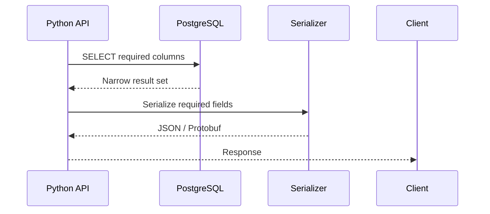

# 01- SELECT Star Problems

## Overview

`SELECT *` is convenient during exploration, debugging, and ad hoc SQL work, but it is often a poor default for production queries.

The problem is not that `SELECT *` is inherently incorrect. The problem is that it creates an **implicit dependency on the current table schema**:

```sql
SELECT *
FROM customers;
```

The query does not specify which columns the application actually needs.

As schemas evolve, this can cause:

- Unnecessary database I/O.
- Larger network responses.
- More application memory usage.
- Higher serialization/deserialization cost.
- Wider ORM objects.
- Accidental exposure of sensitive columns.
- Fragile API behavior.
- Less effective covering/index-only access patterns.
- Harder query review and maintenance.

A production query should generally make its required data explicit:

```sql
SELECT
    id,
    email,
    display_name
FROM customers;
```

The core principle is:

> **Select the smallest set of columns required by the operation, especially on application-facing and high-frequency queries.**

---

## What `SELECT *` Means

The `*` wildcard means:

```sql
SELECT *
FROM customers;
```

returns all columns visible from the referenced relation.

For a table:

```text
customers
├── id
├── email
├── display_name
├── phone_number
├── address
├── date_of_birth
├── created_at
└── updated_at
```

the query requests every column.

It is equivalent in intent to explicitly selecting all columns:

```sql
SELECT
    id,
    email,
    display_name,
    phone_number,
    address,
    date_of_birth,
    created_at,
    updated_at
FROM customers;
```

The important difference is that the explicit version documents the intended contract.

---

## Why `SELECT *` Exists

The wildcard is useful because it provides concise access to all columns.

Legitimate use cases include:

- Interactive database exploration.
- Debugging.
- Temporary investigation.
- Small ad hoc queries.
- Data inspection.
- Some internal administrative workflows.

For example:

```sql
SELECT *
FROM orders
WHERE id = 1001;
```

can be perfectly reasonable while investigating a production issue.

The problem arises when the same pattern becomes the default for:

- REST APIs.
- gRPC services.
- ORM queries.
- Frequently executed queries.
- Background workers.
- Large exports.
- Reporting pipelines.
- Security-sensitive tables.

---

## Explicit Column Selection

Prefer:

```sql
SELECT
    id,
    email,
    display_name
FROM customers
WHERE id = $1;
```

over:

```sql
SELECT *
FROM customers
WHERE id = $1;
```

The explicit query communicates:

```text
This operation requires:
    id
    email
    display_name
```

That information is valuable to:

- Developers.
- Reviewers.
- Database engineers.
- API maintainers.
- Security reviewers.
- Query optimizers.
- Future maintainers.

---

## The Main Problems With SELECT *

### Unnecessary Data Retrieval

Suppose a table contains:

```text
id
email
display_name
profile_json
preferences_json
avatar_blob
created_at
updated_at
```

but the endpoint only needs:

```text
id
email
display_name
```

`SELECT *` requests all columns.

If `profile_json` and `preferences_json` are large, the unnecessary data can become significant.

The data flow becomes:

```text
PostgreSQL
    ↓
Read row
    ↓
Build result
    ↓
Network transfer
    ↓
Python
    ↓
Deserialize
    ↓
Application object
    ↓
Serialize API response
```

Selecting only required columns reduces work across this path.

---

## Network Cost

Consider:

```sql
SELECT *
FROM customers
WHERE tenant_id = $1;
```

If the table contains large JSON or text columns, every matching row may carry those values across the database connection.

An explicit query:

```sql
SELECT
    id,
    email,
    display_name
FROM customers
WHERE tenant_id = $1;
```

can substantially reduce the result size.

This matters particularly for:

- High-volume APIs.
- Large list endpoints.
- Cross-region database connections.
- Read replicas.
- Background exports.
- Microservices with many network hops.

---

## Application Memory

A database query is not the end of the data path.

A Python application may receive the result and construct:

```text
database row
    ↓
driver object
    ↓
ORM model/object
    ↓
serializer
    ↓
JSON representation
```

Selecting unnecessary columns can increase:

- Python heap usage.
- Object construction cost.
- Garbage collection pressure.
- Serializer work.
- Response size.

This becomes important when retrieving thousands of rows.

---

## API Response Size

Consider:

```python
customers = Customer.objects.all()
```

If the endpoint serializes every field, a small list API can accidentally expose much more data than intended.

A safer design explicitly defines the response contract.

For SQL:

```sql
SELECT
    id,
    email,
    display_name
FROM customers
WHERE status = 'active'
ORDER BY id
LIMIT 100;
```

The API then returns only the fields required by its contract.

---

## Security and Data Exposure

`SELECT *` can accidentally expose newly added sensitive columns.

Suppose the original table contains:

```text
id
email
display_name
```

and later a migration adds:

```text
internal_notes
```

An existing:

```sql
SELECT *
FROM customers;
```

now retrieves `internal_notes`.

If the application serializes the result dynamically, this can become a security or privacy issue.

Explicit selection:

```sql
SELECT
    id,
    email,
    display_name
FROM customers;
```

does not automatically begin retrieving newly added columns.

This creates a safer data-access boundary.

---

## Schema Evolution

One of the most important problems with `SELECT *` is its relationship with schema changes.

Suppose an application expects:

```text
column 1 → id
column 2 → email
column 3 → display_name
```

and uses positional result handling.

Adding a column can change the returned shape.

Even when the application uses column names, additional fields can still affect:

- Serialization.
- API output.
- ORM behavior.
- Data exports.
- Mapping code.
- Tests.
- Memory usage.

Explicit projection makes the dependency visible.

---

## SELECT * and API Contracts

An API should generally expose an intentional schema.

Avoid designs where:

```text
Database schema
      ↓
SELECT *
      ↓
ORM object
      ↓
JSON serializer
      ↓
Public API
```

because this couples the API contract directly to the database table.

Prefer:

```text
Database schema
      ↓
Explicit SQL/ORM projection
      ↓
Application DTO/serializer
      ↓
Public API contract
```

This separates internal storage from external representation.

---

## SELECT * and JOINs

`SELECT *` becomes particularly problematic with joins.

Consider:

```sql
SELECT *
FROM orders AS o
JOIN customers AS c
    ON c.id = o.customer_id;
```

The result can contain:

```text
orders.id
orders.created_at
orders.customer_id
...

customers.id
customers.email
customers.created_at
...
```

This can retrieve many unnecessary columns and creates ambiguity around duplicate column names such as:

```text
id
created_at
updated_at
```

Prefer:

```sql
SELECT
    o.id AS order_id,
    o.created_at,
    o.total_amount,
    c.id AS customer_id,
    c.email
FROM orders AS o
JOIN customers AS c
    ON c.id = o.customer_id;
```

This makes the result contract explicit.

---

## `table.*` Is Not a Complete Solution

Sometimes developers replace:

```sql
SELECT *
```

with:

```sql
SELECT o.*
```

This is useful when a query needs every column from one table while joining other tables.

For example:

```sql
SELECT
    o.*,
    c.email
FROM orders AS o
JOIN customers AS c
    ON c.id = o.customer_id;
```

is clearer than:

```sql
SELECT *
FROM orders AS o
JOIN customers AS c
    ON c.id = o.customer_id;
```

because it avoids retrieving every column from `customers`.

However, `o.*` still creates an implicit dependency on every current and future column in `orders`.

For stable production interfaces, explicit columns are generally preferable.

---

## Query Projection

The selected columns are often called the query's **projection**.

For example:

```sql
SELECT
    id,
    email,
    display_name
FROM customers;
```

projects the relation onto those columns.

A useful mental model is:

```text
Table
  ↓
Filter rows
  ↓
Join if necessary
  ↓
Project required columns
  ↓
Return result
```

Good SQL design intentionally controls both:

```text
which rows
```

and:

```text
which columns
```

---

## SELECT * and Index-Only Access

Explicit column selection can sometimes help PostgreSQL use index-only access.

Consider:

```sql
SELECT
    id,
    email
FROM customers
WHERE email = $1;
```

with an appropriate index:

```sql
CREATE INDEX customers_email_idx
ON customers (email);
```

Depending on the table's visibility map and index definition, PostgreSQL may be able to satisfy the query efficiently without fetching every table column.

Compare that with:

```sql
SELECT *
FROM customers
WHERE email = $1;
```

If the table contains columns not available from the index, PostgreSQL generally needs to access the heap/table pages to retrieve them.

The important point is:

> **Selecting fewer columns can create more opportunities for narrow access paths, but it does not guarantee an index-only scan.**

Always validate with:

```sql
EXPLAIN (ANALYZE, BUFFERS)
SELECT
    id,
    email
FROM customers
WHERE email = $1;
```

---

## Covering Index Considerations

Suppose an API requires:

```sql
SELECT
    id,
    email,
    display_name
FROM customers
WHERE tenant_id = $1
ORDER BY id
LIMIT 100;
```

A workload-specific index might use:

```sql
CREATE INDEX customers_tenant_id_idx
ON customers (tenant_id, id)
INCLUDE (email, display_name);
```

Whether this is beneficial depends on:

- Query frequency.
- Table size.
- Data distribution.
- Update frequency.
- Index size.
- Visibility map state.
- Actual execution plans.

Do not create covering indexes merely because a query does not use `SELECT *`.

---

## SELECT * and Storage Engine Behavior

`SELECT *` does not necessarily mean the database reads every physical byte of every row in the same way for every storage engine or plan.

The database optimizer still determines:

- Access path.
- Join strategy.
- Filtering.
- Projection.
- Table/index access.

However, requesting more columns generally means more data must eventually be produced and transferred.

The practical distinction is:

```text
Query asks for unnecessary columns
        ↓
More result data
        ↓
Potentially more page access
        ↓
More network traffic
        ↓
More application processing
```

The exact cost depends on schema, storage layout, data types, indexes, compression, cache state, and execution plan.

---

## Large Columns Are Especially Important

Avoid retrieving large columns unless they are actually required.

Examples:

```text
TEXT
JSONB
BYTEA
large metadata
document contents
serialized payloads
```

Suppose:

```sql
SELECT *
FROM documents
WHERE customer_id = $1;
```

retrieves:

```text
id
customer_id
title
metadata
document_body
created_at
```

If the endpoint only needs:

```sql
SELECT
    id,
    title,
    created_at
FROM documents
WHERE customer_id = $1;
```

the difference can be substantial.

This is especially important for list endpoints.

---

## List Endpoint Example

Bad:

```sql
SELECT *
FROM orders
WHERE customer_id = $1
ORDER BY created_at DESC
LIMIT 50;
```

Better:

```sql
SELECT
    id,
    status,
    total_amount,
    created_at
FROM orders
WHERE customer_id = $1
ORDER BY created_at DESC, id DESC
LIMIT 50;
```

The second query clearly defines the API's required data.

It also avoids accidentally retrieving:

```text
internal_metadata
payment_payload
shipping_address
audit_details
large JSON fields
```

if those are not required.

---

## Detail Endpoint Example

A detail endpoint may legitimately require many columns:

```sql
SELECT
    id,
    customer_id,
    status,
    total_amount,
    currency,
    shipping_address,
    billing_address,
    created_at,
    updated_at
FROM orders
WHERE id = $1;
```

The correct rule is not:

> Never select many columns.

The rule is:

> **Select all columns that the operation actually requires, but make that requirement explicit.**

---

## SELECT * in Administrative Queries

`SELECT *` can be completely reasonable for:

```sql
SELECT *
FROM pg_stat_activity;
```

during troubleshooting.

Similarly:

```sql
SELECT *
FROM customers
WHERE id = 1001;
```

can be useful during development.

The concern is primarily about making `SELECT *` a default pattern in long-lived application queries.

---

## SELECT * in Exploratory SQL

Interactive investigation is different from production application SQL.

For example:

```sql
SELECT *
FROM orders
ORDER BY created_at DESC
LIMIT 20;
```

is useful when learning the schema or investigating a production incident.

Once the query becomes:

- Application code.
- A view.
- A scheduled report.
- A frequently executed query.
- A stable data-access function.

replace it with an intentional projection where practical.

---

## SELECT * in ETL and Data Pipelines

ETL workflows require more careful judgment.

A data export may intentionally need every current column:

```sql
SELECT *
FROM events;
```

However, even in data pipelines, explicit schemas are often safer.

For example:

```sql
SELECT
    event_id,
    event_type,
    customer_id,
    occurred_at,
    payload
FROM events;
```

This prevents a schema migration from silently changing the pipeline's output schema.

For intentionally schema-on-read workflows, `SELECT *` can still be appropriate if schema evolution is explicitly supported.

The decision depends on whether the downstream consumer expects:

```text
current table shape
```

or:

```text
stable data contract
```

---

## SELECT * in Data Exports

Be particularly careful with exports.

Suppose an export originally contains:

```text
id
email
created_at
```

A later schema migration adds:

```text
internal_risk_score
```

A `SELECT *` export can start including the new column without the export code changing.

That can cause:

- Contract breakage.
- Accidental sensitive-data distribution.
- Larger files.
- Downstream parser failures.
- Compliance problems.

Explicit export schemas are generally safer.

---

## SELECT * and ORM Usage

The same anti-pattern appears through ORMs.

Django:

```python
customers = Customer.objects.all()
```

normally retrieves model fields needed to construct full model instances.

If only a few fields are needed, use:

```python
customers = Customer.objects.values(
    "id",
    "email",
    "display_name",
)
```

or:

```python
customers = Customer.objects.only(
    "id",
    "email",
    "display_name",
)
```

These approaches have different ORM behavior and trade-offs.

`values()` returns dictionaries rather than full model instances.

`only()` defers unspecified fields, which can trigger additional queries if deferred fields are later accessed.

For high-throughput read paths, understand the generated SQL and object behavior rather than assuming `only()` automatically makes everything faster.

---

## Django Serializer Considerations

Avoid a pipeline such as:

```python
Customer.objects.all()
```

followed by:

```text
serializer exposes every model field
```

Instead, define an intentional API representation.

For example:

```python
from rest_framework import serializers


class CustomerListSerializer(serializers.ModelSerializer):
    class Meta:
        model = Customer
        fields = (
            "id",
            "email",
            "display_name",
        )
```

The API contract should not automatically inherit every database column.

---

## SQLAlchemy Considerations

With SQLAlchemy, explicitly select required columns:

```python
from sqlalchemy import select

stmt = select(
    Customer.id,
    Customer.email,
    Customer.display_name,
).where(
    Customer.tenant_id == tenant_id,
)
```

This can avoid constructing full ORM entities when the endpoint only needs a projection.

For high-volume paths, compare:

```text
ORM entity loading
```

with:

```text
column projection
```

based on actual application requirements.

---

## FastAPI Response Models

FastAPI response models can help define the API contract:

```python
from pydantic import BaseModel


class CustomerResponse(BaseModel):
    id: int
    email: str
    display_name: str
```

The database query should ideally align with the response model:

```text
Database projection
        ↓
Application model/DTO
        ↓
Pydantic response model
        ↓
JSON response
```

This avoids treating the database table as the public API schema.

---

## gRPC Considerations

The same principle applies to gRPC.

A protobuf message may require:

```text
customer_id
email
display_name
```

There is little reason for the database layer to retrieve unrelated large fields solely because they exist in the table.

The data flow should be intentional:

```text
gRPC request
    ↓
Service logic
    ↓
SQL projection
    ↓
Required columns
    ↓
Protobuf response
```

---

## Microservices and SELECT *

`SELECT *` can create hidden coupling between:

```text
Database schema
        ↓
Service implementation
```

In a microservice environment, schema changes may happen frequently.

Explicit projections make service dependencies clearer:

```text
orders service
    ↓
requires:
    order_id
    status
    total_amount
```

rather than:

```text
orders service
    ↓
depends on every column in orders
```

This becomes increasingly important when multiple teams maintain the schema and application independently.

---

## Schema Evolution Example

Initial schema:

```sql
CREATE TABLE customers (
    id bigint PRIMARY KEY,
    email text NOT NULL,
    display_name text NOT NULL
);
```

Application:

```sql
SELECT *
FROM customers;
```

Later migration:

```sql
ALTER TABLE customers
ADD COLUMN internal_notes text;
```

The query's result shape has now changed without modifying the query.

With:

```sql
SELECT
    id,
    email,
    display_name
FROM customers;
```

the application dependency remains explicit and stable.

---

## Production Query Review

When reviewing:

```sql
SELECT *
FROM orders
WHERE tenant_id = $1;
```

ask:

### Data Requirement

- [ ] Does the caller really need every column?
- [ ] Which columns are actually consumed?

### Performance

- [ ] Are large columns being retrieved?
- [ ] Is the result set large?
- [ ] Is this query executed frequently?
- [ ] Could a narrower projection reduce network or memory usage?
- [ ] Could a narrow index satisfy the query more efficiently?

### Security

- [ ] Could future columns contain sensitive information?
- [ ] Could this result reach an external API?
- [ ] Could an ORM serializer expose additional fields?

### Maintainability

- [ ] Is the query's data dependency obvious?
- [ ] Would schema changes unintentionally alter the result contract?
- [ ] Is the query part of a stable interface?

---

## When SELECT * Is Acceptable

`SELECT *` is not forbidden.

It can be appropriate for:

| Scenario | `SELECT *` |
|---|---|
| Interactive schema exploration | Usually fine |
| Temporary debugging | Usually fine |
| Local investigation | Usually fine |
| Small one-off administrative query | Often fine |
| Stable production API query | Usually avoid |
| High-frequency endpoint | Avoid |
| Large list query | Avoid |
| Sensitive data path | Avoid |
| Public export | Usually avoid |
| Long-lived ETL contract | Usually avoid |
| Internal query intentionally requiring every column | Potentially acceptable |

The correct standard is:

> **Use `SELECT *` deliberately, not automatically.**

---

## Performance Validation

Do not assume replacing `SELECT *` always produces a measurable speedup.

For a narrow query:

```sql
SELECT
    id,
    email
FROM customers
WHERE tenant_id = $1;
```

compare it with:

```sql
SELECT *
FROM customers
WHERE tenant_id = $1;
```

using:

```sql
EXPLAIN (ANALYZE, BUFFERS)
SELECT
    id,
    email
FROM customers
WHERE tenant_id = $1;
```

Measure:

- Execution time.
- Rows returned.
- Buffers.
- Scan type.
- Network payload where observable.
- Application serialization time.
- Application memory usage.

The performance benefit is workload-dependent.

---

## Query Plan Example

A query can use an index for filtering while still fetching full table rows:

```text
Index Scan
    ↓
Heap/Table Fetch
    ↓
Return all columns
```

A narrower projection may allow a different access path:

```text
Index
    ↓
Return required columns
```

Whether PostgreSQL chooses an index-only scan depends on more than projection:

- Index contents.
- Visibility map.
- Table maintenance.
- Query predicates.
- Cost estimates.
- Data distribution.

Therefore:

```text
SELECT fewer columns
```

is a useful design principle, not a guarantee of a particular execution plan.

---

## Network and Serialization Benchmarking

For high-volume APIs, inspect the complete path:



Compare this with:

```text
SELECT *
    ↓
Large result
    ↓
Large Python objects
    ↓
Large serialization workload
    ↓
Large response
```

The database query is only one part of the performance path.

---

## Large Result Sets

Even an explicit projection can be dangerous if the query returns too many rows.

Bad:

```sql
SELECT
    id,
    email
FROM customers;
```

if the API can return millions of customers.

Better:

```sql
SELECT
    id,
    email
FROM customers
ORDER BY id
LIMIT 100;
```

and for large-scale navigation, use appropriate keyset pagination when the access pattern supports it.

The anti-pattern is not only:

```text
too many columns
```

but also:

```text
too many rows
```

---

## SELECT * and Pagination

Avoid:

```sql
SELECT *
FROM orders
ORDER BY created_at DESC
LIMIT 50
OFFSET 500000;
```

This combines two potential problems:

- Wide rows.
- Large offset.

A production query might instead use:

```sql
SELECT
    id,
    status,
    total_amount,
    created_at
FROM orders
WHERE (created_at, id) < ($1, $2)
ORDER BY created_at DESC, id DESC
LIMIT 50;
```

This addresses both projection and pagination concerns.

---

## SELECT * and Caching

Retrieving unnecessary columns can also increase cache pressure.

If an application stores database results in Redis:

```text
PostgreSQL
    ↓
SELECT *
    ↓
Large Python object
    ↓
Serialize
    ↓
Redis
```

the cached value becomes larger than necessary.

Prefer caching only the data required by the consumer.

This reduces:

- Redis memory usage.
- Network traffic.
- Serialization cost.
- Cache eviction pressure.

---

## SELECT * and Read Replicas

Wide queries can increase replica read workload.

A query such as:

```sql
SELECT *
FROM events
WHERE customer_id = $1;
```

can transfer substantial data from the replica to the application.

For read-heavy workloads, explicit projections can reduce application-facing network traffic and processing.

This does not necessarily reduce all database-side work, so execution plans and workload metrics remain important.

---

## SELECT * and AWS Cost

In cloud environments, unnecessary data movement can increase resource consumption across:

```text
Application
Database
Network
Cache
Logging
Monitoring
```

Examples include:

- Larger database result sets.
- Larger API responses.
- More cross-AZ network traffic.
- Larger Redis values.
- Larger exported files.
- Higher application CPU.

The cost impact is usually indirect, but high-volume workloads can make small inefficiencies significant.

---

## Reliability Considerations

Explicit projections reduce accidental behavior changes caused by schema evolution.

A migration such as:

```sql
ALTER TABLE orders
ADD COLUMN internal_metadata jsonb;
```

should not unexpectedly change an API response simply because an old query uses:

```sql
SELECT *
FROM orders;
```

Stable projections make schema changes more predictable.

---

## Security Considerations

Treat `SELECT *` as a potential **data exposure risk** when query results cross a trust boundary.

Especially avoid it when the result feeds:

- Public REST APIs.
- gRPC responses.
- WebSocket messages.
- External integrations.
- Customer exports.
- Logs.
- Analytics pipelines.
- Cached objects shared across tenants.

Use explicit projections and explicit serializers.

For multi-tenant queries, also enforce tenant boundaries:

```sql
SELECT
    id,
    status,
    total_amount
FROM orders
WHERE tenant_id = $1
  AND id = $2;
```

Projection does not replace authorization, but it limits unnecessary data exposure.

---

## Common Mistakes

### Using SELECT * Everywhere

Convenient during development, but it creates unnecessary dependencies and data transfer.

### Assuming SELECT * Is Always Slow

It is not inherently slow.

The cost depends on:

- Number of rows.
- Row width.
- Data types.
- Storage layout.
- Indexes.
- Network transfer.
- Application processing.

### Replacing SELECT * Without Measuring

Explicit projection is generally good design, but performance improvements should still be validated.

### Using SELECT * With JOIN

This can retrieve every column from every table and create duplicate/ambiguous column names.

### Returning Database Rows Directly From APIs

This couples the public API contract to the database schema.

### Forgetting Large Columns

A few large JSON/TEXT/BLOB-like fields can dominate query and serialization cost.

### Assuming ORM `.only()` Has No Trade-offs

Deferred ORM fields can trigger additional queries when later accessed.

### Selecting Many Columns "Just in Case"

This often turns into permanent unnecessary data retrieval.

### Using SELECT * in Exports

Schema changes can silently modify export contents.

### Using SELECT * With Large Result Sets

Even a narrow table can produce a massive response if millions of rows are returned.

---

## Senior-Level Review Principles

A senior engineer should distinguish between:

```text
SELECT * is syntactically valid
```

and:

```text
SELECT * is an appropriate production design
```

The correct review questions are:

```text
What data does the caller actually need?
        ↓
Can we project only those columns?
        ↓
Are any columns large or sensitive?
        ↓
Can schema evolution change this contract?
        ↓
Can a narrower projection improve the access path?
        ↓
What is the total row count?
        ↓
What does EXPLAIN show?
```

The goal is not to eliminate every wildcard.

The goal is to eliminate **unintentional data dependencies**.

---

## Production Checklist

Before shipping a production query, check:

### Query Design

- [ ] Are all selected columns actually required?
- [ ] Is `SELECT *` necessary?
- [ ] If using `table.*`, is every column from that table genuinely required?
- [ ] Are joined-table columns explicitly selected?
- [ ] Are column aliases used where names can become ambiguous?

### Performance

- [ ] Are large columns excluded when unnecessary?
- [ ] Is the result set bounded?
- [ ] Is pagination appropriate?
- [ ] Is the query high frequency?
- [ ] Could a narrow projection improve index-only access?
- [ ] Has `EXPLAIN (ANALYZE, BUFFERS)` been reviewed?

### Security

- [ ] Could future schema changes expose sensitive columns?
- [ ] Is the result crossing a trust boundary?
- [ ] Are tenant restrictions enforced?
- [ ] Is the API response explicitly defined?

### Maintainability

- [ ] Is the query's data dependency obvious?
- [ ] Will schema evolution change its result shape?
- [ ] Does the query represent a stable contract?
- [ ] Are ORM projections aligned with application requirements?

---

## Recommended Pattern

For production application queries, prefer:

```sql
SELECT
    id,
    status,
    total_amount,
    created_at
FROM orders
WHERE tenant_id = $1
  AND status = $2
ORDER BY created_at DESC, id DESC
LIMIT 50;
```

over:

```sql
SELECT *
FROM orders
WHERE tenant_id = $1
  AND status = $2
ORDER BY created_at DESC
LIMIT 50;
```

The explicit version communicates:

```text
Required data
    ↓
Query contract
    ↓
API/application contract
```

It also gives future engineers a clear signal when a new column is added:

> "If this endpoint needs the new column, add it deliberately."

---

## Practical Rule of Thumb

Use:

```sql
SELECT *
```

when you are intentionally saying:

> "I need every column currently defined by this relation."

Use:

```sql
SELECT
    column_a,
    column_b,
    column_c
```

when you are saying:

> "This operation depends on these specific fields."

For long-lived backend code, the second statement is usually the better default.

---

## Key Takeaways

- **`SELECT *` is not inherently incorrect, but it creates an implicit dependency on the table's entire current and future schema.**
- **Production queries should generally select only the columns actually required, reducing unnecessary data transfer, application memory, serialization work, and accidental exposure.**
- **Explicit projections are especially important for APIs, microservices, exports, joins, large result sets, sensitive data, and long-lived application queries.**
- **Selecting fewer columns can enable narrower access paths and sometimes index-only scans, but performance claims should be validated with `EXPLAIN (ANALYZE, BUFFERS)` and application-level measurements.**
- **Treat `SELECT *` as a deliberate choice for exploration or genuinely full-row operations, not as the default production query pattern.**