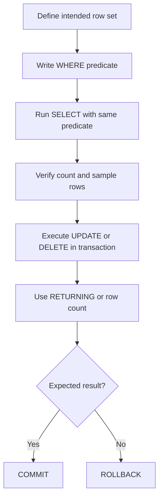

# 02- Missing WHERE Conditions

## Overview

A missing or incorrect `WHERE` condition is one of the most dangerous SQL mistakes because it can transform a targeted operation into a full-table operation.

The risk is especially high for:

- `UPDATE`
- `DELETE`
- Large `SELECT` queries
- Multi-tenant applications
- Background jobs
- Administrative scripts
- Data migrations
- Batch processing

Consider:

```sql
UPDATE customers
SET status = 'inactive';
```

The statement is valid SQL. It updates **every row** in the table.

The intended query may have been:

```sql
UPDATE customers
SET status = 'inactive'
WHERE id = $1;
```

The important engineering principle is:

> **For destructive or state-changing SQL, the absence of a `WHERE` clause should be treated as a deliberate high-risk operation, never as an accidental omission.**

A correct `WHERE` clause is also about more than syntax. It must identify the correct **row set**, respect tenant boundaries, account for soft deletion, and behave correctly under concurrency.

---

## What a WHERE Condition Does

`WHERE` restricts the rows considered by a query.

For example:

```sql
SELECT
    id,
    email
FROM customers
WHERE status = 'active';
```

Only rows satisfying:

```text
status = 'active'
```

are returned.

For a modification:

```sql
UPDATE customers
SET status = 'inactive'
WHERE last_login_at < $1;
```

only matching rows are modified.

For deletion:

```sql
DELETE FROM sessions
WHERE expires_at < now();
```

only expired sessions are deleted.

---

## Missing WHERE in SELECT

A missing `WHERE` on a `SELECT` usually does not corrupt data, but it can still cause serious operational problems.

Example:

```sql
SELECT
    id,
    email,
    profile
FROM customers;
```

If the table contains 100 million rows, the query attempts to produce the entire result set.

Potential consequences include:

- High database CPU.
- Large disk reads.
- Large network transfer.
- Application memory exhaustion.
- Long-running queries.
- Connection pool exhaustion.
- API timeouts.
- Replica pressure.
- Increased cloud infrastructure costs.

A missing `WHERE` in a `SELECT` is therefore still a production anti-pattern when the caller expects a bounded result.

---

## Missing WHERE in UPDATE

This is significantly more dangerous.

Intended:

```sql
UPDATE orders
SET status = 'cancelled'
WHERE id = $1;
```

Accidental:

```sql
UPDATE orders
SET status = 'cancelled';
```

The second statement modifies every order.

If the table contains millions of rows, this can generate substantial:

- WAL.
- Lock activity.
- Replication traffic.
- Dead tuples.
- Vacuum work.
- Replica lag.
- Application-level inconsistency.

The SQL engine cannot infer the intended scope.

---

## Missing WHERE in DELETE

The most severe form is often:

```sql
DELETE FROM customers;
```

This is valid SQL and deletes every row from the table.

Compare:

```sql
DELETE FROM customers
WHERE id = $1;
```

The database executes exactly what was requested.

There is no built-in semantic distinction between:

```text
developer accidentally omitted WHERE
```

and:

```text
administrator intentionally deleted everything
```

Database safety mechanisms such as permissions, transactions, foreign keys, backups, and operational controls are therefore important.

---

## DELETE Without WHERE vs TRUNCATE

These operations are different:

```sql
DELETE FROM customers;
```

and:

```sql
TRUNCATE TABLE customers;
```

Both can remove all rows, but they have different semantics and operational characteristics.

| Operation | WHERE supported | Typical purpose |
|---|---:|---|
| `DELETE` | Yes | Remove selected rows |
| `DELETE` without `WHERE` | No filtering | Remove all rows |
| `TRUNCATE` | No | Explicitly empty table |

If the intent is to empty an entire table, `TRUNCATE` makes that intent more explicit.

Never use:

```sql
DELETE FROM table_name;
```

as a casual substitute for a targeted delete.

---

## Why Missing WHERE Happens

Common causes include:

- Forgetting the predicate.
- Incorrect variable handling.
- Dynamic SQL construction.
- Copying an existing query and modifying it incorrectly.
- ORM filters being omitted.
- Optional filters being interpreted incorrectly.
- Bulk job logic using an empty filter.
- Incorrect request validation.
- Confusing `SELECT` and `UPDATE` versions of a query.
- Testing directly against production.
- Inadequate review of migration scripts.

The underlying problem is usually not SQL syntax.

It is **failure to make the intended row set explicit and verifiable**.

---

## WHERE Conditions and Result Grain

A `WHERE` clause should be evaluated in terms of the expected row set.

Suppose the application intends:

```text
exactly one customer
```

but executes:

```sql
SELECT *
FROM customers
WHERE email = $1;
```

If email is not unique, the query may return multiple rows.

The condition exists, but it is not sufficiently selective.

This is an important distinction:

> **Having a WHERE clause does not guarantee that the query is safely scoped.**

A production engineer asks:

```text
What rows should this operation affect?
How many rows should it affect?
What guarantees that?
```

---

## Missing WHERE vs Incorrect WHERE

There are two related but different failures.

### Missing WHERE

```sql
UPDATE accounts
SET status = 'disabled';
```

Every row is affected.

### Incorrect WHERE

```sql
UPDATE accounts
SET status = 'disabled'
WHERE status = 'active';
```

This may affect many rows when the intended operation was:

```sql
UPDATE accounts
SET status = 'disabled'
WHERE id = $1;
```

The second mistake can be harder to detect because the query appears properly scoped.

---

## Use Primary Keys for Targeted Operations

When an operation targets one known entity, prefer its primary key:

```sql
UPDATE customers
SET email = $1
WHERE id = $2;
```

instead of relying on a non-unique attribute:

```sql
UPDATE customers
SET email = $1
WHERE name = $2;
```

Primary keys provide an explicit identity boundary.

If another attribute is supposed to uniquely identify the row, enforce that assumption with a unique constraint.

```sql
ALTER TABLE customers
ADD CONSTRAINT customers_email_unique
UNIQUE (email);
```

The database constraint is stronger than relying on application assumptions.

---

## Multi-Tenant Applications

Missing tenant predicates are a particularly dangerous form of incomplete filtering.

Suppose an application uses:

```text
tenant_id
customer_id
```

A dangerous query is:

```sql
SELECT
    id,
    email
FROM customers
WHERE id = $1;
```

If IDs are not globally unique or tenant isolation is required independently of ID, the query may access another tenant's data.

Prefer:

```sql
SELECT
    id,
    email
FROM customers
WHERE tenant_id = $1
  AND id = $2;
```

For updates:

```sql
UPDATE customers
SET display_name = $1
WHERE tenant_id = $2
  AND id = $3;
```

For deletes:

```sql
DELETE FROM customers
WHERE tenant_id = $1
  AND id = $2;
```

Tenant scoping should be treated as part of the authorization boundary, not as an optional filter.

---

## Soft Deletes

Suppose the table uses:

```sql
deleted_at timestamptz
```

A normal query may need:

```sql
SELECT
    id,
    email
FROM customers
WHERE tenant_id = $1
  AND deleted_at IS NULL;
```

For an update:

```sql
UPDATE customers
SET display_name = $1
WHERE tenant_id = $2
  AND id = $3
  AND deleted_at IS NULL;
```

Without the soft-delete condition, application code may accidentally modify logically deleted records.

The exact policy depends on the operation. Administrative restore workflows, for example, may intentionally target deleted rows.

---

## WHERE and NULL

SQL's three-valued logic matters when constructing predicates.

This does not match `NULL`:

```sql
WHERE deleted_at = NULL
```

Use:

```sql
WHERE deleted_at IS NULL
```

Similarly:

```sql
WHERE deleted_at IS NOT NULL
```

matches rows containing a value.

An incorrect NULL predicate can make a query appear to have "no matching rows," which can lead developers to remove or weaken filtering incorrectly.

---

## WHERE With Optional Filters

Application code often builds queries based on optional request parameters.

Consider:

```python
query = """
    SELECT id, email
    FROM customers
    WHERE tenant_id = %s
"""
```

The tenant condition should remain mandatory.

Optional filters can then be added:

```python
conditions = ["tenant_id = %s"]
params = [tenant_id]

if status is not None:
    conditions.append("status = %s")
    params.append(status)

query = f"""
    SELECT id, email
    FROM customers
    WHERE {' AND '.join(conditions)}
"""
```

The important design principle is:

> **Mandatory safety predicates should not depend on optional request parameters.**

Never construct:

```python
conditions = []

if tenant_id is not None:
    conditions.append("tenant_id = %s")
```

if `tenant_id` is required for authorization.

An absent tenant ID should fail validation rather than silently produce an unscoped query.

---

## Parameterized Queries

Filtering should use parameters rather than string interpolation.

Unsafe:

```python
query = f"""
    UPDATE customers
    SET status = '{status}'
    WHERE id = {customer_id}
"""
```

Prefer parameterized SQL:

```python
query = """
    UPDATE customers
    SET status = %s
    WHERE id = %s
"""

cursor.execute(query, (status, customer_id))
```

Parameterization primarily protects SQL structure from injection.

It does not guarantee that the `WHERE` clause is logically correct.

This query is parameterized but still dangerous:

```sql
UPDATE customers
SET status = $1;
```

Parameterization and correct filtering solve different problems.

---

## UPDATE and Row Count Verification

For critical updates, inspect the affected row count.

Example:

```python
cursor.execute(
    """
    UPDATE customers
    SET status = %s
    WHERE tenant_id = %s
      AND id = %s
    """,
    (status, tenant_id, customer_id),
)

if cursor.rowcount != 1:
    raise RuntimeError("Expected exactly one customer to be updated")
```

This catches cases where:

- The row does not exist.
- The row belongs to another tenant.
- The row was already deleted.
- The predicate is incorrect.
- The application has stale state.

For operations where zero rows is valid, handle that explicitly rather than assuming one row was changed.

---

## Defensive UPDATE Pattern

For sensitive state transitions, combine identity and expected state.

Instead of:

```sql
UPDATE payments
SET status = 'captured'
WHERE id = $1;
```

consider:

```sql
UPDATE payments
SET status = 'captured'
WHERE id = $1
  AND status = 'authorized';
```

This provides an atomic conditional transition.

The application can then verify:

```text
affected rows = 1
```

If it is zero, the expected state was not present.

This is often safer than:

```text
SELECT status
UPDATE status
```

because the read and write are otherwise separated by a concurrency window.

---

## Conditional DELETE

Similarly:

```sql
DELETE FROM sessions
WHERE id = $1
  AND user_id = $2;
```

is stronger than:

```sql
DELETE FROM sessions
WHERE id = $1;
```

when ownership is part of the authorization rule.

The database operation itself enforces the intended scope.

---

## SELECT Before UPDATE Is Not Always Enough

A common pattern is:

```sql
SELECT id
FROM orders
WHERE id = $1;
```

followed later by:

```sql
UPDATE orders
SET status = 'cancelled'
WHERE id = $1;
```

The second query must still contain the complete safety conditions.

The first query does not "protect" the second query.

Under concurrency, the row may change between statements.

Prefer an atomic operation when possible:

```sql
UPDATE orders
SET status = 'cancelled'
WHERE id = $1
  AND status = 'pending';
```

Then inspect the affected row count.

---

## WHERE and Transactions

For high-risk modifications, transactions provide a recovery boundary.

Example:

```sql
BEGIN;

UPDATE orders
SET status = 'cancelled'
WHERE customer_id = $1
  AND status = 'pending';

-- Verify affected rows before committing.

ROLLBACK;
```

During development or a controlled operational task, the transaction can be inspected before committing:

```sql
BEGIN;

UPDATE orders
SET status = 'cancelled'
WHERE customer_id = 1001
  AND status = 'pending'
RETURNING id, status;

-- Inspect the returned rows.

ROLLBACK;
```

If the result is correct:

```sql
COMMIT;
```

A transaction is not a replacement for a correct `WHERE` clause. It is an additional safety mechanism.

---

## RETURNING as a Safety Tool

PostgreSQL supports:

```sql
UPDATE customers
SET status = 'inactive'
WHERE tenant_id = $1
  AND id = $2
RETURNING id, status;
```

This allows the application to inspect exactly which row was changed.

For deletion:

```sql
DELETE FROM sessions
WHERE user_id = $1
  AND expires_at < now()
RETURNING id;
```

This is useful for:

- Auditing.
- Affected-row validation.
- Event generation.
- Debugging.
- Application decisions.

---

## Safe Production Workflow for UPDATE/DELETE

For a high-risk operation:



The important principle is to validate the predicate **before** applying the mutation.

---

## Preview Before Modification

Suppose the intended operation is:

```sql
UPDATE customers
SET status = 'inactive'
WHERE last_login_at < $1;
```

First run:

```sql
SELECT
    id,
    status,
    last_login_at
FROM customers
WHERE last_login_at < $1
ORDER BY id;
```

Then inspect:

```sql
SELECT count(*)
FROM customers
WHERE last_login_at < $1;
```

Only after validating the row set should the modification be performed.

---

## `UPDATE ... RETURNING` for Production Jobs

A batch job can combine filtering and state transition:

```sql
UPDATE jobs
SET status = 'processing',
    started_at = now()
WHERE id = $1
  AND status = 'queued'
RETURNING id, status, started_at;
```

If no row is returned, another worker may already have claimed the job.

This pattern is useful for:

- Work queues.
- State machines.
- Idempotent workers.
- Concurrent processing.

It avoids relying on an application-level check followed by a separate update.

---

## Batch Operations

A background worker might need to process a bounded number of records.

Avoid unbounded operations such as:

```sql
UPDATE events
SET processed = true
WHERE processed = false;
```

if the table contains millions of pending records and the operation is expected to run incrementally.

A controlled batch strategy may use a CTE:

```sql
WITH batch AS (
    SELECT id
    FROM events
    WHERE processed = false
    ORDER BY id
    LIMIT 1000
)
UPDATE events AS e
SET processed = true
FROM batch
WHERE e.id = batch.id
RETURNING e.id;
```

The exact design depends on concurrency requirements and workload characteristics.

---

## Missing WHERE in Data Migrations

Migration scripts are particularly sensitive.

Dangerous:

```sql
UPDATE customers
SET normalized_email = lower(email);
```

This may intentionally be a full-table migration, but it should be treated as a deliberate large operation.

A targeted migration might instead use:

```sql
UPDATE customers
SET normalized_email = lower(email)
WHERE normalized_email IS NULL;
```

This has two advantages:

- It limits work.
- It makes the migration restartable.

For large tables, batch the operation rather than assuming a single massive transaction is safe.

---

## Full-Table Operations Can Be Intentional

A senior engineer should not blindly reject every statement without `WHERE`.

These can be legitimate:

```sql
UPDATE configuration
SET version = version + 1;
```

or:

```sql
DELETE FROM temporary_staging_data;
```

The question is whether the full-table scope is intentional.

A useful distinction is:

| Query | Interpretation |
|---|---|
| `SELECT * FROM table` | Potentially unbounded read |
| `UPDATE table SET ...` | Full-table mutation |
| `DELETE FROM table` | Full-table deletion |
| `TRUNCATE table` | Explicit table reset |
| `UPDATE table SET ... WHERE ...` | Targeted mutation |
| `DELETE FROM table WHERE ...` | Targeted deletion |

Intent should be obvious from code review and operational context.

---

## PostgreSQL Safeguards

PostgreSQL does not provide a universal "you forgot WHERE" protection for `UPDATE` or `DELETE`.

Useful safeguards include:

### Permissions

Application users should have only the permissions they require.

A service account that cannot modify unrelated tables limits blast radius.

### Transactions

Use transactions for operations where validation and rollback are important.

### Foreign Keys

Foreign keys prevent certain classes of inconsistent deletion or updates.

### Constraints

Constraints can prevent invalid state even if a broad operation occurs.

### Row-Level Security

RLS can add database-enforced tenant or row access policies where appropriate.

### Operational Controls

Use:

- Staging environments.
- Migration review.
- CI checks.
- Database change review.
- Backups and point-in-time recovery.

No single mechanism should be treated as sufficient.

---

## ORM-Specific Risks

The same mistake occurs through ORMs.

Django:

```python
Customer.objects.filter(id=customer_id).update(
    status="inactive"
)
```

is scoped.

But:

```python
Customer.objects.update(
    status="inactive"
)
```

updates every row.

Likewise:

```python
Customer.objects.filter(
    tenant_id=tenant_id,
    id=customer_id,
).delete()
```

is scoped, while:

```python
Customer.objects.all().delete()
```

is intentionally destructive.

ORM abstractions do not eliminate the underlying SQL risk.

---

## Django Defensive Patterns

For critical updates:

```python
updated = (
    Customer.objects
    .filter(
        tenant_id=tenant_id,
        id=customer_id,
        status="active",
    )
    .update(status="inactive")
)

if updated != 1:
    raise RuntimeError("Customer was not updated exactly once")
```

This creates an atomic condition:

```text
tenant
+ identity
+ expected state
→ update
```

For critical business operations, combine this with appropriate transaction boundaries and database constraints.

---

## FastAPI Request Validation

An API should validate required scope before executing SQL.

For example, a service should not accept:

```text
tenant_id = null
```

and interpret that as:

```text
all tenants
```

A safer design is:

```text
HTTP request
    ↓
Authentication
    ↓
Authorization
    ↓
Validate tenant/context
    ↓
Build mandatory WHERE predicates
    ↓
Execute parameterized SQL
```

Missing security context should normally cause the request to fail rather than broaden the query.

---

## Dynamic SQL

Dynamic query builders are particularly vulnerable to accidentally removing predicates.

For example:

```python
conditions = []

if customer_id:
    conditions.append("customer_id = %s")
```

If `customer_id` is missing, the resulting query may become:

```sql
DELETE FROM orders;
```

A safer approach is to distinguish:

```text
mandatory conditions
```

from:

```text
optional conditions
```

and reject requests that lack mandatory scope.

---

## Security Boundary

A `WHERE` condition can be part of authorization.

For example:

```sql
UPDATE documents
SET title = $1
WHERE tenant_id = $2
  AND id = $3;
```

The predicate says:

```text
Only modify document X
inside tenant Y.
```

If the tenant condition is omitted:

```sql
UPDATE documents
SET title = $1
WHERE id = $2;
```

the application may accidentally cross a tenant boundary.

For highly sensitive systems, combine application authorization with database-level controls such as RLS where appropriate.

---

## Performance Implications

A missing `WHERE` can cause the database to process dramatically more rows than intended.

For:

```sql
SELECT *
FROM orders;
```

the optimizer may reasonably choose:

```text
Sequential Scan
```

because the query requests every row.

For:

```sql
SELECT
    id,
    status
FROM orders
WHERE customer_id = $1;
```

an appropriate index may allow a selective access path.

A `WHERE` clause therefore affects both correctness and performance.

However:

> **Adding a WHERE clause does not automatically make a query fast.**

A poorly selective predicate can still require scanning a large portion of the table.

---

## Indexes and WHERE Conditions

Suppose:

```sql
SELECT
    id,
    status
FROM orders
WHERE customer_id = $1;
```

and:

```sql
CREATE INDEX orders_customer_id_idx
ON orders (customer_id);
```

The index may make the predicate efficient.

But index usefulness depends on:

- Selectivity.
- Table size.
- Data distribution.
- Statistics.
- Query cost.
- Returned columns.
- Ordering.
- Query frequency.

Validate with:

```sql
EXPLAIN (ANALYZE, BUFFERS)
SELECT
    id,
    status
FROM orders
WHERE customer_id = $1;
```

---

## Monitoring for Unbounded Queries

Production systems should monitor for unexpectedly large operations.

Useful PostgreSQL signals include:

- Query duration.
- Rows returned.
- Rows affected.
- Buffer usage.
- Lock duration.
- WAL generation.
- Replica lag.
- Active connections.

Application telemetry should also capture:

```text
endpoint
query operation
tenant/context
rows affected
duration
```

without logging sensitive values.

An unexpectedly high affected-row count can be an important anomaly signal.

---

## Connection Pool Impact

A long-running unbounded query can hold a database connection for an extended period.

Suppose an API has a pool of:

```text
20 connections
```

and several requests execute expensive unbounded queries.

Eventually:

```text
Requests
   ↓
All pool connections busy
   ↓
New requests wait
   ↓
API latency increases
   ↓
Timeouts increase
```

This can become a cascading failure.

Connection pool sizing should therefore be considered together with query behavior.

---

## Kubernetes and Microservices

A missing filter in one service can affect the entire platform.

Example:

```text
API Pod
   ↓
Unbounded UPDATE
   ↓
PostgreSQL CPU / locks / WAL increase
   ↓
Replica lag
   ↓
Read latency increases
   ↓
Other services experience failures
```

Kubernetes can restart the offending pod, but restarting does not necessarily stop a database operation already running.

Application-level protections and database operational controls are required.

---

## High Availability and Replication

Large accidental writes can create:

- Increased WAL generation.
- Replica replay pressure.
- Replica lag.
- Longer recovery time.
- Increased storage consumption.

An accidental full-table update may be especially expensive because PostgreSQL can generate substantial WAL and dead tuples.

High availability protects against infrastructure failure; it does not prevent logically incorrect SQL.

---

## Disaster Recovery

If an accidental update or delete occurs, recovery options depend on:

- Whether the transaction was committed.
- Backups.
- WAL retention.
- Point-in-time recovery configuration.
- Replication architecture.
- Audit/event history.
- Application-level recovery mechanisms.

A read replica is **not** a backup from logical corruption.

If the primary executes:

```sql
DELETE FROM customers;
```

the deletion can be replicated to the standby.

Therefore:

> **Replication improves availability; backups and PITR provide recovery from many logical mistakes.**

---

## Deployment and CI/CD Safeguards

High-risk SQL should be reviewed during CI/CD.

Useful practices include:

- Migration review.
- Static SQL analysis.
- Integration tests.
- Staging execution.
- Migration dry runs where supported.
- Explicit approval for destructive changes.
- Database backups before high-risk migrations.
- Monitoring during deployment.

For critical data migrations, require engineers to document:

```text
Expected row count
Expected affected tables
Rollback strategy
Performance impact
Monitoring plan
Recovery strategy
```

---

## Common Mistakes and Prevention

| Mistake | Risk | Prevention |
|---|---|---|
| `UPDATE` without `WHERE` | Full-table mutation | Require explicit scope |
| `DELETE` without `WHERE` | Full-table deletion | Preview and transact |
| Missing tenant filter | Cross-tenant access | Mandatory tenant predicate/RLS |
| Optional filter becomes empty | Unbounded query | Validate mandatory scope |
| Wrong predicate | Incorrect rows affected | Preview + row-count checks |
| `= NULL` | Unexpected no-match | Use `IS NULL` |
| Relying on a prior SELECT | Race condition | Use atomic conditional SQL |
| ORM `.update()` without filter | Full-table update | Require `.filter()` |
| Bulk delete without bounds | Large destructive operation | Batch and verify |
| No affected-row verification | Silent logical failure | Check row count/`RETURNING` |

---

## Production Safety Checklist

### Before SELECT

- [ ] Is the result expected to be bounded?
- [ ] Is a filter required?
- [ ] Could the query return millions of rows?
- [ ] Is pagination required?
- [ ] Are tenant boundaries included?

### Before UPDATE

- [ ] What exact rows should change?
- [ ] Is the predicate explicit?
- [ ] Is the affected row count known?
- [ ] Is a tenant/ownership condition required?
- [ ] Is the current state part of the condition?
- [ ] Can `RETURNING` validate the result?
- [ ] Should the operation run inside a transaction?

### Before DELETE

- [ ] Is deletion truly required?
- [ ] Is the predicate correct?
- [ ] Is the expected row count known?
- [ ] Have the matching rows been previewed?
- [ ] Is the operation reversible?
- [ ] Are backups/PITR available?
- [ ] Should deletion be batched?

### Before Production Deployment

- [ ] Has the SQL been reviewed?
- [ ] Has it been tested against realistic data?
- [ ] Has the expected row count been measured?
- [ ] Is monitoring in place?
- [ ] Is rollback/recovery understood?
- [ ] Could replica lag or WAL growth become significant?

---

## Interview Traps

### "Does every UPDATE need a WHERE?"

No.

A full-table update can be intentional.

The better answer is:

> A targeted update should have an explicit predicate. A missing predicate on a state-changing query is high risk unless full-table modification is explicitly intended and operationally controlled.

### "Does a WHERE clause make a query safe?"

No.

This can still affect millions of rows:

```sql
UPDATE customers
SET status = 'inactive'
WHERE country = 'US';
```

Safety depends on whether the predicate matches the intended row set.

### "Does an index guarantee a fast WHERE query?"

No.

The optimizer may still choose a sequential scan when the predicate is not selective or the table is small.

### "Can a transaction prevent accidental DELETE?"

A transaction can make an accidental change reversible before commit, but it does not prevent the mistake.

### "Is SELECT before UPDATE safer?"

Not necessarily.

A separate read can introduce a race condition. An atomic conditional update is often stronger.

---

## Senior Decision Framework

Before executing any production mutation, answer four questions:

### Identity

```text
Which rows are allowed to change?
```

### Scope

```text
What mandatory boundaries apply?
```

Examples:

```text
tenant_id
user_id
account_id
status
deleted_at
```

### Cardinality

```text
How many rows should change?
```

Possible expectations:

```text
0
exactly 1
1–1000
all rows
```

### Recovery

```text
What happens if the result is wrong?
```

Possible controls:

```text
transaction rollback
backup/PITR
audit history
event log
soft delete
reconciliation
```

This turns a simple SQL review into an operational safety decision.

---

## Safe Mutation Pattern

A robust application mutation often follows:

```text
Request
   ↓
Authentication
   ↓
Authorization
   ↓
Validate required scope
   ↓
Build mandatory predicates
   ↓
Execute parameterized SQL
   ↓
Check affected rows
   ↓
Commit transaction
   ↓
Emit event / update cache if required
```

For a state transition:

```sql
UPDATE orders
SET status = 'cancelled',
    updated_at = now()
WHERE tenant_id = $1
  AND id = $2
  AND status = 'pending'
RETURNING id, status;
```

This is substantially safer than:

```sql
UPDATE orders
SET status = 'cancelled';
```

because the mutation contains:

- Tenant boundary.
- Entity identity.
- Expected state.
- Explicit result validation.

---

## Key Takeaways

- **A missing `WHERE` on `UPDATE` or `DELETE` can turn a targeted operation into a full-table mutation, while a missing filter on `SELECT` can create an unbounded read.**
- **A `WHERE` clause is not enough by itself; the predicate must define the correct row set, including tenant, ownership, soft-delete, and expected-state boundaries where applicable.**
- **For critical mutations, combine explicit predicates with transactions, affected-row checks, `RETURNING`, and atomic conditional updates.**
- **Application ORMs and dynamic query builders can produce the same risks as handwritten SQL, so mandatory filtering should be enforced by design rather than relying on developer discipline alone.**
- **High availability and replication do not protect against logical SQL mistakes; backups, PITR, validation, monitoring, and controlled deployment processes are essential safeguards.**