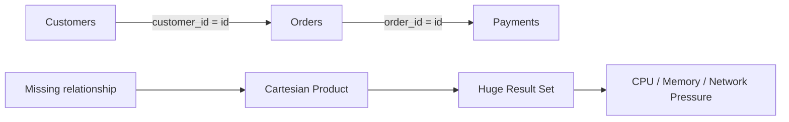

# 03- Accidental Cartesian Products

## Overview

An accidental Cartesian product occurs when a query combines rows from two or more relations without correctly defining how those rows should be related.

The simplest form is:

```sql
SELECT
    c.id,
    c.email,
    o.id AS order_id
FROM customers AS c
CROSS JOIN orders AS o;
```

If there are:

```text
10,000 customers
100,000 orders
```

the theoretical result contains:

```text
10,000 × 100,000 = 1,000,000,000 rows
```

This can create severe:

- Query latency.
- CPU consumption.
- Memory pressure.
- Disk spill.
- Network traffic.
- Application memory usage.
- Connection pool exhaustion.
- Database instability.

A more common accidental form occurs when a developer writes multiple tables in `FROM` but forgets the relationship:

```sql
SELECT
    c.id,
    o.id
FROM customers AS c,
     orders AS o;
```

This is effectively a Cartesian product.

The core principle is:

> **Every multi-table query should have an intentional relationship between its row sources, unless a Cartesian product is explicitly required.**

---

## What Is a Cartesian Product?

A Cartesian product combines every row from one relation with every row from another relation.

Given:

```text
A = {A1, A2, A3}

B = {B1, B2}
```

the Cartesian product is:

```text
A1 B1
A1 B2
A2 B1
A2 B2
A3 B1
A3 B2
```

The number of output rows is:

```text
|A| × |B|
```

For three relations:

```text
|A| × |B| × |C|
```

The multiplication can become enormous very quickly.

---

## Why Cartesian Products Exist

Cartesian products are legitimate relational operations.

SQL explicitly supports them:

```sql
SELECT *
FROM products
CROSS JOIN currencies;
```

This can be useful when every combination is genuinely required.

For example, generating a matrix of:

```text
products × supported currencies
```

may be intentional.

The anti-pattern is not `CROSS JOIN` itself.

The anti-pattern is:

> **Producing a Cartesian product accidentally when the business relationship should have been represented by a join predicate.**

---

## Explicit CROSS JOIN

A deliberate Cartesian product should normally use explicit syntax:

```sql
SELECT
    p.id AS product_id,
    c.code AS currency
FROM products AS p
CROSS JOIN currencies AS c;
```

This communicates intent to reviewers.

Compare:

```sql
FROM products AS p,
     currencies AS c
```

The latter is syntactically valid but less explicit and easier to misunderstand.

For intentional Cartesian products, prefer:

```sql
CROSS JOIN
```

---

## Accidental Cartesian Product

Consider:

```sql
SELECT
    c.id,
    c.email,
    o.id AS order_id
FROM customers AS c,
     orders AS o
WHERE c.id = 1001;
```

The query filters the customer but does not relate `orders` to that customer.

The result contains:

```text
selected customer
    ×
every order
```

The intended query is probably:

```sql
SELECT
    c.id,
    c.email,
    o.id AS order_id
FROM customers AS c
JOIN orders AS o
    ON o.customer_id = c.id
WHERE c.id = 1001;
```

The difference is the relationship:

```sql
o.customer_id = c.id
```

---

## Missing JOIN Predicate

The most common cause is a missing `ON` condition.

Incorrect:

```sql
SELECT
    o.id,
    c.email
FROM orders AS o
JOIN customers AS c;
```

For a regular `JOIN`, a join condition is normally required unless the query explicitly uses a form where the join condition is supplied elsewhere.

The intended query is:

```sql
SELECT
    o.id,
    c.email
FROM orders AS o
JOIN customers AS c
    ON c.id = o.customer_id;
```

The `ON` condition defines the relationship between the rows.

---

## Multiple Tables Make the Risk Larger

Consider:

```sql
SELECT *
FROM customers AS c
JOIN orders AS o
    ON o.customer_id = c.id
JOIN payments AS p
    ON p.order_id = o.id;
```

This is correctly related if the relationships are:

```text
customers
    ↓
orders
    ↓
payments
```

But if the payment relationship is accidentally omitted:

```sql
SELECT *
FROM customers AS c
JOIN orders AS o
    ON o.customer_id = c.id
JOIN payments AS p;
```

the payment table can multiply the result.

The row flow becomes:

```text
customers
    ↓
orders
    ↓
orders × every payment
```

The resulting query can become catastrophically large.

---

## Visualizing the Failure



The critical point is that every additional unconnected relation can multiply the existing result.

---

## Row Explosion

Suppose:

| Table | Rows |
|---|---:|
| customers | 100,000 |
| orders | 1,000,000 |
| payments | 1,200,000 |

A correctly related query may return approximately the number of actual relationships.

An accidental product between customers and orders could theoretically produce:

```text
100,000 × 1,000,000
= 100,000,000,000 rows
```

That is 100 billion candidate combinations before considering additional filtering.

A database may never actually materialize all those rows because the optimizer can transform or short-circuit parts of a query depending on predicates and plan shape.

Nevertheless, an incorrect relational condition can create an enormous intermediate workload.

---

## Why the Database Cannot Infer Your Intent

Suppose the schema contains:

```text
customers.id
orders.customer_id
```

The database may know that a foreign key exists, but SQL semantics do not mean:

```sql
FROM customers, orders
```

automatically becomes:

```sql
FROM customers
JOIN orders
    ON orders.customer_id = customers.id
```

The query must express the relationship.

Even when foreign keys exist, SQL does not automatically insert missing join predicates.

---

## Foreign Keys Do Not Prevent Cartesian Products

A foreign key:

```sql
ALTER TABLE orders
ADD CONSTRAINT orders_customer_fk
FOREIGN KEY (customer_id)
REFERENCES customers(id);
```

enforces referential integrity.

It does not automatically change:

```sql
SELECT *
FROM customers, orders;
```

into a relational join.

The constraint tells the database:

```text
orders.customer_id must reference customers.id
```

It does not tell every query which relationship to use.

---

## Implicit Join Syntax

Older SQL commonly uses:

```sql
SELECT
    c.id,
    o.id
FROM customers AS c,
     orders AS o
WHERE o.customer_id = c.id;
```

This can produce a correct result.

However, explicit join syntax is generally clearer:

```sql
SELECT
    c.id,
    o.id
FROM customers AS c
JOIN orders AS o
    ON o.customer_id = c.id;
```

The relationship is visible where the table relationship is declared.

This makes missing predicates easier to detect during code review.

---

## INNER JOIN vs CROSS JOIN

Compare:

```sql
SELECT *
FROM customers AS c
JOIN orders AS o
    ON o.customer_id = c.id;
```

with:

```sql
SELECT *
FROM customers AS c
CROSS JOIN orders AS o;
```

The first returns related customer-order pairs.

The second returns every customer-order combination.

| Query | Relationship | Result behavior |
|---|---|---|
| `JOIN ... ON` | Explicit relationship | Matching pairs |
| `LEFT JOIN ... ON` | Explicit relationship | All left rows + matches |
| `CROSS JOIN` | None | Every combination |
| `FROM a, b` | Implicit Cartesian product | Every combination unless filtered |

---

## WHERE Does Not Always Rescue a Bad Join

Consider:

```sql
SELECT
    c.id,
    o.id
FROM customers AS c,
     orders AS o
WHERE c.id = 1001
  AND o.status = 'pending';
```

This still produces:

```text
one customer
×
every pending order
```

It does not establish:

```text
customer → customer's orders
```

The correct relationship is:

```sql
SELECT
    c.id,
    o.id
FROM customers AS c
JOIN orders AS o
    ON o.customer_id = c.id
WHERE c.id = 1001
  AND o.status = 'pending';
```

Filtering individual tables is not the same as relating those tables.

---

## Cartesian Product vs JOIN Multiplication

Not every unexpectedly large result is a literal Cartesian product.

A normal join can also produce multiple rows per parent.

Suppose:

```text
customers
    1 customer

orders
    10 orders
```

A join produces:

```text
1 customer × 10 related orders = 10 rows
```

This is expected.

The problem occurs when the relationship is missing or the query joins independent one-to-many relations incorrectly.

---

## The Multiple One-to-Many Trap

Consider:

```text
customers
    ├── orders
    └── support_tickets
```

Suppose one customer has:

```text
3 orders
4 support tickets
```

This query:

```sql
SELECT
    c.id,
    o.id AS order_id,
    t.id AS ticket_id
FROM customers AS c
JOIN orders AS o
    ON o.customer_id = c.id
JOIN support_tickets AS t
    ON t.customer_id = c.id
WHERE c.id = $1;
```

can produce:

```text
3 × 4 = 12 rows
```

This is not necessarily a Cartesian product in SQL syntax, because both joins have predicates.

However, the independent one-to-many relationships create a **multiplicative result**.

This is a major source of incorrect aggregation.

---

## Aggregation Double Counting

Consider:

```sql
SELECT
    c.id,
    SUM(o.total_amount) AS revenue,
    COUNT(t.id) AS ticket_count
FROM customers AS c
LEFT JOIN orders AS o
    ON o.customer_id = c.id
LEFT JOIN support_tickets AS t
    ON t.customer_id = c.id
GROUP BY c.id;
```

If a customer has:

```text
3 orders
4 tickets
```

the intermediate join can contain:

```text
12 rows
```

Each order may appear four times.

The resulting:

```sql
SUM(o.total_amount)
```

can be four times larger than the true order total.

This is a join cardinality problem even though every join has an `ON` predicate.

---

## Safer Aggregation Pattern

Aggregate each one-to-many relation independently:

```sql
WITH order_totals AS (
    SELECT
        customer_id,
        SUM(total_amount) AS revenue
    FROM orders
    GROUP BY customer_id
),
ticket_totals AS (
    SELECT
        customer_id,
        COUNT(*) AS ticket_count
    FROM support_tickets
    GROUP BY customer_id
)
SELECT
    c.id,
    COALESCE(o.revenue, 0) AS revenue,
    COALESCE(t.ticket_count, 0) AS ticket_count
FROM customers AS c
LEFT JOIN order_totals AS o
    ON o.customer_id = c.id
LEFT JOIN ticket_totals AS t
    ON t.customer_id = c.id;
```

This prevents independent one-to-many relations from multiplying each other before aggregation.

---

## Use EXISTS When You Need Existence

Sometimes the query does not actually need rows from the related table.

Bad pattern:

```sql
SELECT DISTINCT
    c.id,
    c.email
FROM customers AS c
JOIN orders AS o
    ON o.customer_id = c.id
WHERE o.status = 'pending';
```

If the requirement is:

> Find customers who have at least one pending order.

prefer:

```sql
SELECT
    c.id,
    c.email
FROM customers AS c
WHERE EXISTS (
    SELECT 1
    FROM orders AS o
    WHERE o.customer_id = c.id
      AND o.status = 'pending'
);
```

This expresses the business requirement directly.

It also avoids generating multiple customer rows that later require `DISTINCT`.

The optimizer may transform equivalent queries into semi-join plans, so do not assume `EXISTS` is always faster. The key advantage is semantic clarity.

---

## JOIN vs EXISTS

| Requirement | Preferred pattern |
|---|---|
| Need columns from both tables | `JOIN` |
| Need to test whether related rows exist | `EXISTS` |
| Need rows without matching children | `NOT EXISTS` / `LEFT JOIN ... IS NULL` depending semantics |
| Need every combination intentionally | `CROSS JOIN` |
| Need aggregated child data | Pre-aggregate or carefully join |
| Need independent one-to-many aggregates | Aggregate separately |

---

## NOT EXISTS and Cartesian Risks

For exclusion:

```sql
SELECT
    c.id
FROM customers AS c
WHERE NOT EXISTS (
    SELECT 1
    FROM orders AS o
    WHERE o.customer_id = c.id
);
```

This asks:

```text
Does no related order exist?
```

It does not generate customer-order combinations for later filtering.

This is often clearer than joining and attempting to eliminate duplicates.

---

## JOIN Conditions and Business Identity

A join predicate should represent an actual relationship.

Good:

```sql
JOIN orders AS o
    ON o.customer_id = c.id
```

Potentially suspicious:

```sql
JOIN orders AS o
    ON o.status = c.status
```

The second query may be syntactically valid but can create many unrelated combinations.

A senior engineer asks:

> **What business relationship does this predicate represent?**

Correct SQL is not merely syntactically valid SQL.

---

## Joining on Non-Unique Columns

Consider:

```sql
JOIN customers AS c
    ON c.email = o.customer_email
```

If `customers.email` is not unique, one order may match multiple customers.

The result can multiply unexpectedly.

If email is supposed to identify exactly one customer, enforce that property:

```sql
ALTER TABLE customers
ADD CONSTRAINT customers_email_unique
UNIQUE (email);
```

Then the join's cardinality assumption becomes database-enforced.

---

## Join Cardinality

Before joining two tables, estimate:

```text
one-to-one
one-to-many
many-to-one
many-to-many
```

Example:

```text
customer 1 ──── N orders
order    1 ──── N order_items
```

A query joining:

```text
customer → orders → order_items
```

naturally produces one row per order item.

That may be correct.

If the application expects:

```text
one row per customer
```

the query must aggregate or otherwise reshape the result.

Understanding result grain is the best defense against accidental row multiplication.

---

## Many-to-Many Relationships

Many-to-many relationships are especially prone to multiplication.

Suppose:

```text
students
courses
student_courses
```

The correct relationship is:

```sql
SELECT
    s.id,
    c.id
FROM students AS s
JOIN student_courses AS sc
    ON sc.student_id = s.id
JOIN courses AS c
    ON c.id = sc.course_id;
```

Joining students directly to courses:

```sql
SELECT
    s.id,
    c.id
FROM students AS s
CROSS JOIN courses AS c;
```

produces every possible enrollment combination, including combinations that do not exist.

---

## Accidental Product in Reporting Queries

Reporting queries are especially vulnerable because they often combine:

- Customers.
- Orders.
- Payments.
- Products.
- Shipments.
- Promotions.

A query can look reasonable while producing incorrect aggregates because independent relationships multiply.

Before writing the query, define:

```text
Expected result grain:
one row per customer
```

Then design each join around that grain.

---

## Result Grain as a Safety Check

For every multi-table query, explicitly state:

```text
One row represents ______.
```

For example:

```text
One row represents one order.
```

Then inspect every join.

If:

```text
orders → order_items
```

is added, the result grain changes to:

```text
one row per order item
```

unless the child relation is aggregated.

This simple mental model catches many accidental Cartesian and multiplication problems.

---

## Query Plan Detection

An unexpected Cartesian product can often be identified from an execution plan.

Run:

```sql
EXPLAIN (ANALYZE, BUFFERS)
SELECT
    c.id,
    o.id
FROM customers AS c,
     orders AS o
WHERE c.id = $1;
```

Look for plan nodes such as:

```text
Nested Loop
```

or:

```text
Nested Loop
  -> ...
  -> ...
```

A nested loop is not itself evidence of a Cartesian product.

The important question is whether the inner side is constrained by a join relationship.

For example:

```text
Nested Loop
  Join Filter: ...
```

or a plan involving:

```text
Materialize
```

may indicate a large repeated inner relation.

Always inspect:

- Estimated rows.
- Actual rows.
- Join conditions.
- Rows removed by filters.
- Buffers.
- Execution time.

---

## Estimated vs Actual Rows

A major warning sign is a large discrepancy:

```text
estimated rows: 100
actual rows:    10,000,000
```

Large estimation errors can indicate:

- Missing statistics.
- Correlated predicates.
- Incorrect cardinality assumptions.
- Data skew.
- Complex joins.
- Poor query formulation.

The query may be logically wrong even before performance becomes the obvious symptom.

---

## Predicate Placement

Consider:

```sql
SELECT
    c.id,
    o.id
FROM customers AS c
JOIN orders AS o
    ON o.customer_id = c.id
WHERE o.status = 'pending';
```

The relationship is explicit.

An equivalent inner-join formulation can move some predicates into `ON`:

```sql
SELECT
    c.id,
    o.id
FROM customers AS c
JOIN orders AS o
    ON o.customer_id = c.id
   AND o.status = 'pending';
```

For an inner join, these are generally equivalent in relational semantics.

For outer joins, predicate placement can change the result.

Do not move predicates mechanically when working with `LEFT JOIN` or other outer joins.

---

## LEFT JOIN Pitfall

Suppose the requirement is:

> Return all customers and their pending orders.

This:

```sql
SELECT
    c.id,
    o.id
FROM customers AS c
LEFT JOIN orders AS o
    ON o.customer_id = c.id
   AND o.status = 'pending';
```

preserves customers with no pending orders.

But:

```sql
SELECT
    c.id,
    o.id
FROM customers AS c
LEFT JOIN orders AS o
    ON o.customer_id = c.id
WHERE o.status = 'pending';
```

effectively removes rows where `o` is NULL, changing the outer join behavior.

This is not a Cartesian product, but misunderstanding join semantics can create similar "too many/too few rows" incidents.

---

## Security Implications

An accidental Cartesian product can become a data exposure problem.

Consider a multi-tenant system:

```sql
SELECT
    c.tenant_id,
    c.id,
    o.id
FROM customers AS c
JOIN orders AS o
    ON o.customer_id = c.id;
```

If the schema relationships are globally correct, this may be safe.

But if tenant boundaries are part of the application's authorization model, explicit tenant conditions may be required:

```sql
SELECT
    c.id,
    o.id
FROM customers AS c
JOIN orders AS o
    ON o.customer_id = c.id
   AND o.tenant_id = c.tenant_id
WHERE c.tenant_id = $1;
```

The exact predicate depends on the data model and constraints.

The key principle is:

> **Do not rely on accidental query shape to enforce authorization boundaries.**

---

## Performance Impact

An accidental Cartesian product can affect nearly every database resource.

| Resource | Potential impact |
|---|---|
| CPU | Join processing and expression evaluation |
| Memory | Hash tables, sorting, materialization |
| Disk | Temporary-file spills |
| Network | Huge result transfer |
| Connections | Long-running queries occupy sessions |
| WAL | Large downstream mutations if used in DML |
| Replicas | Increased read load or replication consequences |
| Application | Deserialization and memory pressure |
| Cache | Larger working set and eviction pressure |

A single bad query can therefore become a system-level incident.

---

## Application Memory Impact

Suppose a FastAPI endpoint executes:

```sql
SELECT
    c.id,
    o.id
FROM customers AS c
JOIN orders AS o
    ON o.customer_id = c.id;
```

If the query unexpectedly returns millions of rows, the application may:

```text
PostgreSQL
    ↓
Millions of rows
    ↓
Python driver
    ↓
Python objects
    ↓
Pydantic serialization
    ↓
JSON response
```

The application can fail even if PostgreSQL remains healthy.

Avoid loading unbounded result sets into application memory.

---

## Streaming Does Not Fix Logical Explosion

A developer may try to mitigate a huge result with streaming.

Streaming can reduce application memory usage:

```text
database
    ↓
small batch
    ↓
application
    ↓
process
```

but it does not make the underlying result logically correct.

If the query should return:

```text
10,000 rows
```

but returns:

```text
100 million rows
```

streaming merely processes the wrong result more gradually.

Fix the relational logic first.

---

## Pagination Does Not Fix a Cartesian Product

Similarly:

```sql
SELECT
    c.id,
    o.id
FROM customers AS c,
     orders AS o
LIMIT 100;
```

does not make the query logically correct.

It only returns the first 100 rows of an incorrect relation.

Pagination is useful for controlling result delivery, not for fixing a missing relationship.

---

## Redis and Caching

Caching a bad query result can amplify the problem.

A service might execute:

```text
PostgreSQL
    ↓
Huge accidental join
    ↓
Serialize result
    ↓
Redis
```

This can consume large amounts of Redis memory and create expensive cache traffic.

Cache only correctly scoped, intentionally shaped data.

---

## Kafka and Event Pipelines

Cartesian products can also occur in event-processing queries.

Suppose an analytics job joins:

```text
events
customers
campaigns
```

without properly relating all three.

The resulting data can produce:

- Duplicate events.
- Inflated metrics.
- Duplicate downstream messages.
- Incorrect attribution.
- Excessive Kafka traffic.

If the query feeds an event pipeline, validate result cardinality before publishing events.

---

## Celery and Background Jobs

Background jobs can hide query problems because they are not directly tied to an HTTP request.

For example:

```python
def export_orders():
    rows = fetch_orders_with_customers()
    write_csv(rows)
```

If `fetch_orders_with_customers()` accidentally creates a Cartesian product, the worker may:

- Consume large memory.
- Run for hours.
- Hold database connections.
- Fill temporary storage.
- Produce enormous files.
- Retry and repeat the workload.

Batching and monitoring help, but query correctness must come first.

---

## Preventing Cartesian Products in Code Review

For every query involving multiple tables, review:

### Relationship

```text
How is each table related to the previous relation?
```

### Cardinality

```text
What is the relationship type?
1:1
1:N
N:1
N:N
```

### Result Grain

```text
What does one output row represent?
```

### Expected Count

```text
Approximately how many rows should this return?
```

### Constraints

```text
Does the schema enforce the uniqueness assumptions?
```

### Plan

```text
Does EXPLAIN show the expected join strategy and cardinality?
```

---

## Safer Query Construction

Prefer explicit joins:

```sql
SELECT
    o.id,
    c.email
FROM orders AS o
JOIN customers AS c
    ON c.id = o.customer_id
WHERE o.status = $1;
```

Avoid implicit table lists:

```sql
SELECT
    o.id,
    c.email
FROM orders AS o,
     customers AS c
WHERE o.status = $1;
```

Even when a `WHERE` condition is later added, explicit join syntax makes the intended relationship much easier to review.

---

## Django ORM

Django can also generate joins implicitly.

For example:

```python
orders = (
    Order.objects
    .select_related("customer")
    .filter(status="pending")
)
```

This expresses the relationship through the model definition.

Be careful with multiple one-to-many relationships:

```python
Customer.objects.annotate(
    order_count=Count("orders"),
    ticket_count=Count("support_tickets"),
)
```

Depending on the generated query, independent joins can multiply rows before aggregation.

Use techniques such as:

```python
Count("orders", distinct=True)
```

when appropriate, or pre-aggregate data / use separate subqueries when the metric semantics require it.

Do not add `distinct=True` blindly. It may hide a query-shape problem or alter aggregation semantics.

---

## SQLAlchemy

SQLAlchemy makes joins explicit when written deliberately:

```python
stmt = (
    select(Order.id, Customer.email)
    .join(Customer, Customer.id == Order.customer_id)
    .where(Order.status == "pending")
)
```

For complex queries, inspect the generated SQL rather than assuming the ORM expresses the intended relationship.

---

## Testing Cardinality

Production query tests should verify more than whether SQL executes.

For a query expected to return:

```text
one row per order
```

test that:

```text
number of distinct order IDs
=
number of returned rows
```

For example, integration tests can assert that the query does not duplicate an entity unexpectedly.

This is particularly important for reporting and aggregation queries.

---

## Data Quality Constraints

Schema constraints can reduce ambiguity.

Examples:

```sql
PRIMARY KEY
UNIQUE
FOREIGN KEY
NOT NULL
```

If the relationship is supposed to be one-to-one, encode that property.

For example:

```sql
CREATE TABLE customer_profiles (
    customer_id bigint PRIMARY KEY
        REFERENCES customers(id),
    profile_data jsonb NOT NULL
);
```

The primary key on `customer_id` guarantees at most one profile per customer.

This makes join cardinality predictable.

---

## Production Troubleshooting

When a query suddenly returns too many rows:

1. Stop downstream processing if necessary.
2. Capture the exact SQL and parameters safely.
3. Identify the expected result grain.
4. Count each base relation.
5. Execute each join incrementally.
6. Inspect actual row counts after each join.
7. Check join predicates.
8. Check uniqueness assumptions.
9. Review `EXPLAIN (ANALYZE, BUFFERS)`.
10. Check for recent schema/data changes.
11. Validate aggregates independently.
12. Add regression tests before re-enabling the workload.

A useful debugging technique is to build the query incrementally:

```sql
SELECT count(*)
FROM customers;
```

then:

```sql
SELECT count(*)
FROM customers AS c
JOIN orders AS o
    ON o.customer_id = c.id;
```

then add the next relation:

```sql
SELECT count(*)
FROM customers AS c
JOIN orders AS o
    ON o.customer_id = c.id
JOIN payments AS p
    ON p.order_id = o.id;
```

The step where cardinality unexpectedly explodes often identifies the problematic relationship.

---

## Production Checklist

### Query Design

- [ ] Is every table intentionally included?
- [ ] Is every relationship explicitly represented?
- [ ] Is `CROSS JOIN` intentional?
- [ ] Are implicit comma joins avoided?
- [ ] Are join predicates based on correct business keys?

### Cardinality

- [ ] What does one result row represent?
- [ ] What is the expected relationship cardinality?
- [ ] Can either side contain duplicates?
- [ ] Are uniqueness assumptions enforced by constraints?
- [ ] Are multiple one-to-many relations being joined together?

### Performance

- [ ] Is the estimated row count reasonable?
- [ ] Is the actual row count reasonable?
- [ ] Are large intermediate relations being created?
- [ ] Are sorts or hash operations spilling to disk?
- [ ] Is the result bounded where appropriate?

### Security

- [ ] Are tenant boundaries explicit?
- [ ] Are ownership conditions enforced?
- [ ] Could unrelated tenant data enter the result?
- [ ] Is the result sent to an external API or system?

### Application

- [ ] Does the ORM generate the intended SQL?
- [ ] Is the result loaded into memory safely?
- [ ] Are serializers expecting the actual result grain?
- [ ] Are duplicate entities tested?

---

## Common Mistakes

### Forgetting the JOIN Predicate

```sql
FROM customers, orders
```

instead of:

```sql
FROM customers
JOIN orders
    ON orders.customer_id = customers.id
```

### Assuming a Foreign Key Automatically Joins Tables

Foreign keys enforce integrity but do not modify query semantics.

### Joining on a Non-Unique Field

This can turn an expected one-to-one relationship into one-to-many.

### Joining Multiple One-to-Many Tables

Even correctly written joins can multiply rows:

```text
orders × support_tickets
```

for each customer.

### Fixing Duplicates With DISTINCT

`DISTINCT` can hide the symptom without fixing incorrect join cardinality.

### Using LIMIT as a Safety Mechanism

`LIMIT` controls returned rows but does not correct the underlying relationship.

### Assuming Nested Loop Means Cartesian Product

A nested loop is a legitimate join strategy. Inspect its join condition and row counts.

### Relying on ORM Abstractions

ORM-generated SQL can still contain unintended joins and cardinality problems.

### Ignoring Expected Row Count

A query returning 10 million rows when 10,000 were expected is a correctness signal, not merely a performance problem.

---

## Interview Traps

### "Is CROSS JOIN always bad?"

No.

A Cartesian product is a legitimate relational operation when every combination is required.

### "Does a missing JOIN condition always create a Cartesian product?"

If the query combines relations without a relationship predicate, the semantics can produce a Cartesian product or equivalent unrestricted combination. The optimizer may represent the execution differently, but the logical result is still based on unrestricted combinations.

### "Can an INNER JOIN multiply rows?"

Yes.

If one parent matches many child rows, multiple output rows are expected.

### "Can a query have JOIN predicates and still have row multiplication?"

Yes.

Independent one-to-many joins can multiply each other even when every join is syntactically correct.

### "Does DISTINCT fix a Cartesian product?"

Usually not.

It may remove identical output rows, but it does not restore the intended relational relationship and may be expensive or semantically incorrect.

### "Does an index prevent Cartesian products?"

No.

Indexes can improve execution of joins and filters, but they do not fix incorrect SQL semantics.

---

## Senior Mental Model

When reviewing a multi-table query, think in this order:

```text
1. What is the expected result grain?
            ↓
2. Which tables are required?
            ↓
3. How is each table related?
            ↓
4. What is the cardinality of each relationship?
            ↓
5. Can any relation multiply another unexpectedly?
            ↓
6. Are uniqueness assumptions enforced?
            ↓
7. What does the execution plan estimate?
            ↓
8. What does the execution plan actually produce?
```

This is more reliable than simply checking whether every `JOIN` has an `ON` clause.

A senior engineer does not only ask:

> "Is the SQL valid?"

They ask:

> "Does the relational shape of this query match the business meaning?"

---

## Practical Rule

For application SQL:

```sql
FROM table_a
JOIN table_b
    ON ...
JOIN table_c
    ON ...
```

should make every relationship obvious.

For intentional Cartesian products:

```sql
FROM table_a
CROSS JOIN table_b
```

should make the lack of a relationship explicit.

For every multi-table query, know:

```text
Expected rows
Expected grain
Expected cardinality
Expected relationships
```

before relying on the query in production.

---

## Key Takeaways

- **An accidental Cartesian product occurs when unrelated rows are combined without an intentional relationship, potentially multiplying result size catastrophically.**
- **Use explicit `JOIN ... ON` syntax for relational joins and explicit `CROSS JOIN` when every combination is genuinely required.**
- **Correct join predicates are not enough by themselves; multiple one-to-many relationships can still multiply rows and produce incorrect aggregates.**
- **Always reason about result grain, relationship cardinality, uniqueness constraints, and expected row counts before optimizing a multi-table query.**
- **`DISTINCT`, `LIMIT`, streaming, and indexes can mitigate symptoms or costs but cannot repair an incorrect relational relationship.**