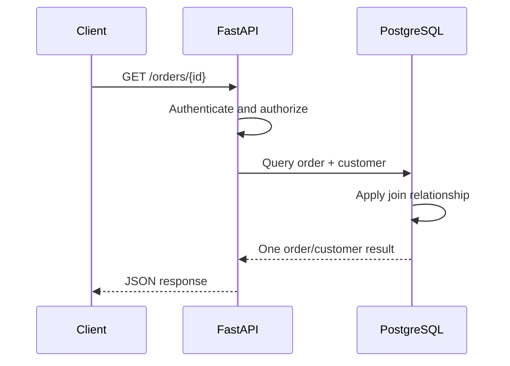

# 04- Incorrect JOIN Conditions

## Overview

An incorrect `JOIN` condition is one of the most common causes of SQL queries returning the wrong data while still executing successfully.

The SQL engine generally cannot determine whether a join expresses the intended business relationship. A query can be syntactically valid, return rows, use indexes, and even appear fast while producing incorrect results.

Consider:

```sql
SELECT
    o.id,
    c.email
FROM orders AS o
JOIN customers AS c
    ON c.id = o.id;
```

The query is valid SQL, but the relationship is probably wrong. The intended relationship is usually:

```sql
ON c.id = o.customer_id
```

An incorrect join can cause:

- Missing rows.
- Duplicate rows.
- Incorrect aggregates.
- Cross-tenant data exposure.
- Incorrect authorization decisions.
- Wrong API responses.
- Incorrect reports.
- Data corruption when used with `UPDATE` or `DELETE`.
- Severe performance problems from unexpected row multiplication.

The core principle is:

> **A JOIN condition must represent the actual relationship between the participating rows, not merely a syntactically valid comparison.**

---

## What a JOIN Condition Does

A join combines rows from multiple relations according to a relationship predicate.

For example:

```sql
SELECT
    o.id,
    o.total_amount,
    c.email
FROM orders AS o
JOIN customers AS c
    ON c.id = o.customer_id;
```

The condition:

```sql
c.id = o.customer_id
```

means:

```text
customer.id
    corresponds to
order.customer_id
```

For every order, PostgreSQL finds the customer rows satisfying that relationship.

The `JOIN` condition therefore defines the logical relationship between the two row sets.

---

## Why Incorrect JOIN Conditions Are Dangerous

SQL validates syntax and data types, not business intent.

These are all potentially valid:

```sql
ON c.id = o.customer_id
```

```sql
ON c.email = o.customer_email
```

```sql
ON c.status = o.status
```

```sql
ON c.created_at = o.created_at
```

The database cannot know which one represents the application's intended relationship.

A senior engineer therefore evaluates a join in terms of:

```text
Business relationship
        ↓
Schema relationship
        ↓
Cardinality
        ↓
Join predicate
        ↓
Expected result grain
```

---

## Correct Join Based on a Foreign Key

Suppose the schema is:

```sql
CREATE TABLE customers (
    id bigint PRIMARY KEY,
    email text NOT NULL
);

CREATE TABLE orders (
    id bigint PRIMARY KEY,
    customer_id bigint NOT NULL REFERENCES customers(id),
    total_amount numeric(12, 2) NOT NULL
);
```

The natural relationship is:

```sql
SELECT
    o.id,
    c.email,
    o.total_amount
FROM orders AS o
JOIN customers AS c
    ON c.id = o.customer_id;
```

The foreign key provides a strong indication of the intended relationship.

It does not automatically create the join, but it gives engineers a database-enforced relationship to use.

---

## Joining the Wrong Columns

A common mistake is joining primary keys directly:

```sql
JOIN customers AS c
    ON c.id = o.id
```

when the actual foreign key is:

```text
orders.customer_id → customers.id
```

The query may return some rows, making the mistake difficult to detect.

For example:

```text
customers
id
---
1
2
3

orders
id | customer_id
---+------------
1  | 3
2  | 1
3  | 3
```

Incorrect:

```sql
ON customers.id = orders.id
```

produces:

```text
customer 1 → order 1
customer 2 → order 2
customer 3 → order 3
```

But the actual relationships are:

```text
customer 3 → order 1
customer 1 → order 2
customer 3 → order 3
```

The query executes successfully while returning incorrect business data.

---

## Result Grain

Before writing a join, define:

> **What does one output row represent?**

For example:

```text
One row = one order
```

Then:

```sql
SELECT
    o.id,
    c.email
FROM orders AS o
JOIN customers AS c
    ON c.id = o.customer_id;
```

preserves one row per order if the customer relationship is many-to-one and `customers.id` is unique.

If the join is written against a non-unique field:

```sql
ON c.email = o.customer_email
```

one order may match multiple customers.

The result grain can unexpectedly become:

```text
one row = one order/customer match
```

rather than:

```text
one row = one order
```

This is a critical distinction.

---

## Join Cardinality

Understand the expected relationship before joining.

| Relationship | Typical result behavior |
|---|---|
| One-to-one | Usually one matching row |
| Many-to-one | Multiple left rows can match one right row |
| One-to-many | One left row can produce many output rows |
| Many-to-many | Many combinations can be produced |
| No relationship | Cartesian product |

For example:

```text
Customer 1 ──── N Orders
Order    1 ──── N Order Items
```

Joining:

```sql
customers
    JOIN orders
    JOIN order_items
```

naturally produces one row per order item.

That is correct if the query needs order-item grain.

It is incorrect if the API expects one row per customer.

---

## Joining on Non-Unique Columns

Consider:

```sql
SELECT
    o.id,
    c.id
FROM orders AS o
JOIN customers AS c
    ON c.email = o.customer_email;
```

If multiple customers have the same email, one order can match multiple customers.

If email is intended to be unique, enforce that assumption:

```sql
ALTER TABLE customers
ADD CONSTRAINT customers_email_unique
UNIQUE (email);
```

Then the database guarantees the intended cardinality.

This is an important senior-level principle:

> **When query correctness depends on uniqueness, enforce that uniqueness in the schema where possible.**

---

## Joining on Names

Avoid relationships such as:

```sql
ON c.name = o.customer_name
```

unless the data model explicitly defines names as stable unique identifiers.

Names are typically:

- Non-unique.
- Mutable.
- Case-sensitive or collation-dependent.
- Vulnerable to normalization differences.

Prefer stable identifiers:

```sql
ON c.id = o.customer_id
```

---

## Joining on Mutable Business Attributes

Consider:

```sql
ON c.email = o.email
```

Even if email is currently unique, it can change.

A durable relational design generally uses an immutable or stable identifier:

```sql
ON c.id = o.customer_id
```

Business attributes can still be useful for lookup and reporting, but should not replace proper relational identity without a deliberate data-model decision.

---

## Composite Join Conditions

Some relationships require multiple columns.

For example, a system may identify records by:

```text
tenant_id + external_id
```

The join should reflect the complete key:

```sql
SELECT
    o.id,
    e.id
FROM orders AS o
JOIN external_orders AS e
    ON e.tenant_id = o.tenant_id
   AND e.external_id = o.external_id;
```

Joining only on:

```sql
ON e.external_id = o.external_id
```

may incorrectly match records belonging to different tenants.

---

## Multi-Tenant JOINs

Tenant boundaries are especially important.

Suppose:

```text
customers
tenant_id
id

orders
tenant_id
customer_id
```

A safer join can explicitly preserve the tenant relationship:

```sql
SELECT
    o.id,
    c.email
FROM orders AS o
JOIN customers AS c
    ON c.tenant_id = o.tenant_id
   AND c.id = o.customer_id
WHERE o.tenant_id = $1;
```

Whether both predicates are necessary depends on the schema constraints and whether IDs are globally unique, but explicitly modeling tenant relationships can provide a stronger defense against accidental cross-tenant matches.

For security-sensitive systems, database-level controls such as Row-Level Security may provide an additional boundary.

---

## Missing Part of a Composite Key

Suppose a table has a composite unique constraint:

```sql
UNIQUE (tenant_id, external_id)
```

The correct relationship may be:

```sql
ON a.tenant_id = b.tenant_id
AND a.external_id = b.external_id
```

An incorrect join:

```sql
ON a.external_id = b.external_id
```

can match multiple rows across tenants.

This is one of the most subtle join errors because each individual predicate looks reasonable.

The problem is that the complete key was not used.

---

## JOIN Conditions and NULL

Consider:

```sql
SELECT
    o.id,
    c.email
FROM orders AS o
LEFT JOIN customers AS c
    ON c.id = o.customer_id;
```

If:

```text
o.customer_id IS NULL
```

the customer does not match and the customer columns become NULL.

This may be correct.

However, developers sometimes accidentally turn an outer join into an effective inner join by adding a condition in `WHERE`:

```sql
SELECT
    o.id,
    c.email
FROM orders AS o
LEFT JOIN customers AS c
    ON c.id = o.customer_id
WHERE c.status = 'active';
```

Rows without a matching customer are removed because:

```text
c.status
```

is NULL.

If the requirement is to preserve all orders while only joining active customers, the condition can instead be:

```sql
SELECT
    o.id,
    c.email
FROM orders AS o
LEFT JOIN customers AS c
    ON c.id = o.customer_id
   AND c.status = 'active';
```

Predicate placement is part of join correctness.

---

## INNER JOIN vs LEFT JOIN

Choosing the wrong join type is another form of incorrect join logic.

Suppose the requirement is:

> Return every customer, including customers with no orders.

Incorrect:

```sql
SELECT
    c.id,
    o.id AS order_id
FROM customers AS c
JOIN orders AS o
    ON o.customer_id = c.id;
```

This excludes customers without orders.

Correct:

```sql
SELECT
    c.id,
    o.id AS order_id
FROM customers AS c
LEFT JOIN orders AS o
    ON o.customer_id = c.id;
```

The relationship may be correct while the join type is wrong.

Both need to be reviewed.

---

## JOIN Conditions vs WHERE Conditions

For an inner join, these can often be equivalent:

```sql
SELECT
    c.id,
    o.id
FROM customers AS c
JOIN orders AS o
    ON o.customer_id = c.id
   AND o.status = 'pending';
```

and:

```sql
SELECT
    c.id,
    o.id
FROM customers AS c
JOIN orders AS o
    ON o.customer_id = c.id
WHERE o.status = 'pending';
```

For outer joins, moving predicates between `ON` and `WHERE` can change the result.

Therefore:

> **Do not treat `ON` and `WHERE` as interchangeable in queries involving outer joins.**

---

## Joining Independent One-to-Many Relations

Suppose:

```text
Customer
 ├── Orders
 └── Support Tickets
```

A query can contain correct join predicates:

```sql
SELECT
    c.id,
    o.id AS order_id,
    t.id AS ticket_id
FROM customers AS c
LEFT JOIN orders AS o
    ON o.customer_id = c.id
LEFT JOIN support_tickets AS t
    ON t.customer_id = c.id;
```

Yet if a customer has:

```text
3 orders
4 tickets
```

the result can contain:

```text
3 × 4 = 12 rows
```

This is not a missing join condition. It is a cardinality problem caused by combining independent one-to-many relationships.

It often leads to incorrect aggregates.

---

## Incorrect Aggregation After JOIN

Consider:

```sql
SELECT
    c.id,
    SUM(o.total_amount) AS revenue,
    COUNT(t.id) AS ticket_count
FROM customers AS c
LEFT JOIN orders AS o
    ON o.customer_id = c.id
LEFT JOIN support_tickets AS t
    ON t.customer_id = c.id
GROUP BY c.id;
```

If there are:

```text
3 orders
4 tickets
```

the join can contain 12 rows.

Each order may appear four times.

Therefore:

```sql
SUM(o.total_amount)
```

can be inflated.

The fix is to understand the required grain and aggregate independent relationships separately.

---

## Pre-Aggregation Pattern

A safer approach is:

```sql
WITH order_totals AS (
    SELECT
        customer_id,
        SUM(total_amount) AS revenue
    FROM orders
    GROUP BY customer_id
),
ticket_totals AS (
    SELECT
        customer_id,
        COUNT(*) AS ticket_count
    FROM support_tickets
    GROUP BY customer_id
)
SELECT
    c.id,
    COALESCE(o.revenue, 0) AS revenue,
    COALESCE(t.ticket_count, 0) AS ticket_count
FROM customers AS c
LEFT JOIN order_totals AS o
    ON o.customer_id = c.id
LEFT JOIN ticket_totals AS t
    ON t.customer_id = c.id;
```

Each child relation is reduced to:

```text
one row per customer
```

before joining.

This preserves the intended result grain.

---

## Many-to-Many Relationships

Many-to-many relationships require a junction table.

Suppose:

```text
students
courses
student_courses
```

The correct query is:

```sql
SELECT
    s.id AS student_id,
    c.id AS course_id
FROM students AS s
JOIN student_courses AS sc
    ON sc.student_id = s.id
JOIN courses AS c
    ON c.id = sc.course_id;
```

Joining students directly to courses:

```sql
FROM students AS s
CROSS JOIN courses AS c
```

creates combinations that do not necessarily represent actual enrollments.

The junction table contains the relationship.

---

## Joining the Wrong Version of a Relationship

Production schemas often contain:

```text
current_customer_id
original_customer_id
billing_customer_id
shipping_customer_id
```

Choosing the wrong foreign key can produce valid but incorrect results.

For example:

```sql
JOIN customers AS c
    ON c.id = o.billing_customer_id
```

when the report requires:

```sql
JOIN customers AS c
    ON c.id = o.shipping_customer_id
```

The SQL is valid.

The data is wrong.

This is why query correctness requires understanding business semantics, not just database structure.

---

## Self-Joins

Self-joins are particularly vulnerable to incorrect predicates.

Suppose employees contain:

```text
id
manager_id
name
```

Correct:

```sql
SELECT
    e.name AS employee,
    m.name AS manager
FROM employees AS e
LEFT JOIN employees AS m
    ON m.id = e.manager_id;
```

Incorrect:

```sql
ON m.id = e.id
```

This simply joins each employee to itself.

Aliases are essential for making self-join relationships clear.

---

## Date-Based JOIN Conditions

Joining on timestamps is often dangerous.

For example:

```sql
JOIN payments AS p
    ON p.created_at = o.created_at
```

Exact timestamps rarely represent a stable business relationship.

A timestamp can be:

- Different by milliseconds.
- Generated by different services.
- Rounded differently.
- Stored with different precision.

Prefer a stable identifier:

```sql
ON p.order_id = o.id
```

If a temporal relationship is genuinely required, define the time semantics explicitly.

---

## Range Joins

Some business relationships are intentionally range-based.

For example:

```sql
SELECT
    o.id,
    t.tax_rate
FROM orders AS o
JOIN tax_rates AS t
    ON o.country_code = t.country_code
   AND o.ordered_at >= t.valid_from
   AND o.ordered_at < t.valid_to;
```

This is a legitimate non-equality join.

However, range joins require careful attention to:

- Overlapping ranges.
- Missing ranges.
- Boundary conditions.
- Time zones.
- Duplicate matches.

If multiple tax-rate records overlap, one order can match multiple rates.

The schema should enforce non-overlap where the business model requires it.

---

## Slowly Changing Dimensions

Analytics systems may intentionally join facts to historical dimension versions:

```sql
JOIN customer_versions AS cv
    ON cv.customer_id = o.customer_id
   AND o.created_at >= cv.valid_from
   AND o.created_at < cv.valid_to
```

This is a valid temporal relationship.

But it demonstrates why "join on primary key" is not a universal rule.

The correct predicate depends on the data model.

The engineering requirement is:

> **The join condition must encode the actual relationship and its cardinality rules.**

---

## JOIN and EXISTS

Sometimes a join is used when only existence is required.

For example:

```sql
SELECT DISTINCT
    c.id
FROM customers AS c
JOIN orders AS o
    ON o.customer_id = c.id
WHERE o.status = 'pending';
```

If the requirement is:

> Find customers who have at least one pending order.

prefer:

```sql
SELECT
    c.id
FROM customers AS c
WHERE EXISTS (
    SELECT 1
    FROM orders AS o
    WHERE o.customer_id = c.id
      AND o.status = 'pending'
);
```

This avoids generating duplicate customer rows merely to eliminate them with `DISTINCT`.

The optimizer may transform both forms into similar plans, so the primary advantage is often clearer semantics.

---

## JOIN and NOT EXISTS

For exclusion:

```sql
SELECT
    c.id
FROM customers AS c
WHERE NOT EXISTS (
    SELECT 1
    FROM orders AS o
    WHERE o.customer_id = c.id
);
```

This directly expresses:

```text
customer has no orders
```

It can be preferable to complicated outer joins when the requirement is fundamentally an existence test.

---

## Incorrect JOIN and DISTINCT

A common response to duplicate rows is:

```sql
SELECT DISTINCT
    c.id,
    c.email
FROM customers AS c
JOIN orders AS o
    ON o.customer_id = c.id;
```

`DISTINCT` may produce the desired final shape, but it does not prove the join is correct.

If the query should only ask:

```text
Does an order exist?
```

then `EXISTS` may better express the requirement.

If the query genuinely needs order information, duplicate rows may be expected.

Do not use `DISTINCT` as a generic repair mechanism.

---

## Performance Implications

An incorrect join can be both logically and operationally expensive.

Potential symptoms include:

```text
unexpected row multiplication
        ↓
larger intermediate relations
        ↓
larger joins
        ↓
hash/sort memory growth
        ↓
temporary disk spills
        ↓
higher CPU and I/O
        ↓
longer query duration
```

The optimizer can choose different strategies:

- Nested Loop.
- Hash Join.
- Merge Join.

The presence of a particular join algorithm does not by itself indicate an incorrect join.

The important question is whether the logical relationship and actual cardinality are correct.

---

## Indexes and Join Conditions

Suppose:

```sql
SELECT
    o.id,
    c.email
FROM orders AS o
JOIN customers AS c
    ON c.id = o.customer_id
WHERE o.customer_id = $1;
```

Useful indexes may include:

```sql
CREATE INDEX orders_customer_id_idx
ON orders (customer_id);
```

`customers.id` is normally already indexed through the primary key.

However, indexes do not fix incorrect joins.

This query:

```sql
ON c.id = o.id
```

can still use indexes efficiently while returning the wrong business data.

> **Performance does not prove correctness.**

---

## EXPLAIN for Join Debugging

Use:

```sql
EXPLAIN (ANALYZE, BUFFERS)
SELECT
    o.id,
    c.email
FROM orders AS o
JOIN customers AS c
    ON c.id = o.customer_id
WHERE o.customer_id = $1;
```

Inspect:

- Join type.
- Join condition.
- Estimated rows.
- Actual rows.
- Rows removed by filters.
- Buffer usage.
- Sort/hash operations.
- Execution time.

A large estimated-vs-actual row discrepancy can indicate incorrect assumptions about cardinality or stale statistics.

---

## Incremental Join Debugging

When a query returns unexpected rows, build it incrementally.

Start with:

```sql
SELECT count(*)
FROM orders;
```

Then:

```sql
SELECT count(*)
FROM orders AS o
JOIN customers AS c
    ON c.id = o.customer_id;
```

Then inspect duplicates:

```sql
SELECT
    o.id,
    COUNT(*) AS matches
FROM orders AS o
JOIN customers AS c
    ON c.id = o.customer_id
GROUP BY o.id
HAVING COUNT(*) > 1;
```

If orders are expected to have exactly one customer, any returned rows deserve investigation.

This technique isolates where cardinality changes unexpectedly.

---

## Detecting Unexpected Multiplication

For a query expected to return one row per order:

```sql
SELECT
    COUNT(*) AS result_rows,
    COUNT(DISTINCT o.id) AS distinct_orders
FROM orders AS o
JOIN customers AS c
    ON c.id = o.customer_id;
```

If:

```text
result_rows > distinct_orders
```

the join has produced duplicate order rows.

That may be legitimate if another relationship is one-to-many, but it should be intentional.

---

## Schema Constraints as Join Safety

Constraints can make join behavior more predictable.

Useful constraints include:

```sql
PRIMARY KEY
UNIQUE
FOREIGN KEY
NOT NULL
```

For example:

```sql
CREATE TABLE customer_profiles (
    customer_id bigint PRIMARY KEY
        REFERENCES customers(id),
    profile_data jsonb NOT NULL
);
```

This guarantees at most one profile per customer.

A join:

```sql
JOIN customer_profiles AS cp
    ON cp.customer_id = c.id
```

therefore has predictable cardinality.

---

## Security Considerations

Incorrect joins can expose data across authorization boundaries.

For example:

```sql
SELECT
    o.id,
    c.email
FROM orders AS o
JOIN customers AS c
    ON c.external_id = o.external_id;
```

If `external_id` is only unique within a tenant, this can accidentally match another tenant's customer.

Prefer:

```sql
SELECT
    o.id,
    c.email
FROM orders AS o
JOIN customers AS c
    ON c.tenant_id = o.tenant_id
   AND c.external_id = o.external_id
WHERE o.tenant_id = $1;
```

Where appropriate, combine application-level tenant checks with database-level protections such as RLS.

Never assume that an incorrect join is "just a data-quality issue." It can become an authorization failure.

---

## UPDATE and DELETE With JOINs

Incorrect joins become more dangerous when used in data modification.

For example:

```sql
UPDATE orders AS o
SET customer_status = c.status
FROM customers AS c
WHERE c.id = o.customer_id;
```

This depends on the `FROM` relationship being correct.

An incorrect condition can update the wrong rows.

Before executing a large modification:

```sql
SELECT
    o.id,
    o.customer_id,
    c.id AS matched_customer_id,
    c.status
FROM orders AS o
JOIN customers AS c
    ON c.id = o.customer_id
WHERE ...;
```

Validate the relationship first.

Then execute the mutation inside an appropriate transaction.

---

## ORM Considerations

ORMs reduce SQL boilerplate but do not eliminate join mistakes.

Django:

```python
orders = (
    Order.objects
    .select_related("customer")
    .filter(status="pending")
)
```

This uses the model relationship.

But complex ORM expressions can still create unexpected joins.

For example:

```python
Customer.objects.filter(
    orders__status="pending"
)
```

may produce multiple customer rows at the SQL level depending on the query and projection.

When correctness matters:

- Inspect generated SQL.
- Understand relationship cardinality.
- Check whether `distinct()` changes semantics.
- Verify aggregation behavior.

Do not assume ORM syntax automatically guarantees correct relational logic.

---

## SQLAlchemy Considerations

With SQLAlchemy:

```python
stmt = (
    select(Order.id, Customer.email)
    .join(Customer, Customer.id == Order.customer_id)
    .where(Order.status == "pending")
)
```

The join condition is explicit.

For complex queries, inspect generated SQL and execution plans rather than reasoning only from Python syntax.

The ORM is an abstraction over SQL, not a replacement for SQL knowledge.

---

## API and Microservice Example

Suppose a FastAPI endpoint returns:

```text
order_id
customer_email
total_amount
```

The service might execute:

```sql
SELECT
    o.id AS order_id,
    c.email AS customer_email,
    o.total_amount
FROM orders AS o
JOIN customers AS c
    ON c.id = o.customer_id
WHERE o.tenant_id = $1
  AND o.id = $2;
```

The request lifecycle is:



An incorrect join can therefore propagate directly into an API response.

---

## Background Jobs

Celery jobs often execute reporting or synchronization queries.

For example:

```text
Celery
   ↓
PostgreSQL JOIN
   ↓
Export / Kafka / downstream API
```

If the join condition is incorrect:

```text
wrong rows
   ↓
wrong report
   ↓
wrong downstream data
```

The asynchronous nature of the job can make the problem harder to notice.

For critical jobs, validate:

- Expected row counts.
- Uniqueness.
- Sample relationships.
- Aggregates.
- Schema constraints.

---

## Kafka and Data Pipelines

Incorrect joins in event processing can produce duplicate downstream events.

Suppose:

```text
orders
customers
```

are joined to enrich an event:

```sql
SELECT
    o.id,
    c.segment
FROM orders AS o
JOIN customers AS c
    ON c.id = o.customer_id;
```

If the join is not one-to-one as expected, the same order may be emitted multiple times.

This can create:

- Duplicate Kafka messages.
- Incorrect analytics.
- Duplicate downstream processing.
- Inflated metrics.

Idempotency helps downstream consumers, but it does not replace fixing the query.

---

## Production Troubleshooting

When a join returns unexpected results:

1. Define the expected result grain.
2. Identify the intended relationship.
3. Inspect primary and foreign keys.
4. Check uniqueness constraints.
5. Run each table independently.
6. Add joins incrementally.
7. Count rows after each join.
8. Check duplicate matches.
9. Verify `ON` predicates.
10. Check `ON` vs `WHERE` placement.
11. Inspect `EXPLAIN (ANALYZE, BUFFERS)`.
12. Test representative edge cases.
13. Add a regression test.

Useful diagnostic query:

```sql
SELECT
    o.id,
    COUNT(c.id) AS matching_customers
FROM orders AS o
LEFT JOIN customers AS c
    ON c.id = o.customer_id
GROUP BY o.id
HAVING COUNT(c.id) > 1;
```

If `customers.id` is unique, multiple matches should not occur.

---

## Production Checklist

### Relationship

- [ ] What business relationship does the join represent?
- [ ] Is the correct foreign key being used?
- [ ] Is the complete composite key included?
- [ ] Are mutable attributes being used as identifiers unnecessarily?

### Cardinality

- [ ] Is the relationship one-to-one, one-to-many, or many-to-many?
- [ ] Can either side contain duplicates?
- [ ] Is uniqueness enforced by a constraint?
- [ ] What does one output row represent?

### Join Type

- [ ] Should this be `INNER JOIN`?
- [ ] Should unmatched left rows be preserved with `LEFT JOIN`?
- [ ] Is `CROSS JOIN` actually intentional?

### Predicates

- [ ] Are tenant boundaries included where required?
- [ ] Are ownership conditions correct?
- [ ] Are NULL semantics understood?
- [ ] Is predicate placement correct for outer joins?

### Performance

- [ ] Are estimated and actual row counts reasonable?
- [ ] Is the join producing unexpected row multiplication?
- [ ] Are hash/sort operations spilling?
- [ ] Are appropriate indexes available?
- [ ] Has the execution plan been reviewed?

### Application

- [ ] Does the ORM generate the intended join?
- [ ] Is `DISTINCT` hiding a deeper cardinality problem?
- [ ] Are aggregates correct?
- [ ] Are duplicate entities tested?

---

## Common Mistakes

### Joining Primary Keys Instead of Foreign Keys

```sql
ON c.id = o.id
```

when the actual relationship is:

```sql
ON c.id = o.customer_id
```

### Joining on Names

```sql
ON c.name = o.customer_name
```

creates unstable and potentially non-unique relationships.

### Joining on Mutable Attributes

Email, phone numbers, and external labels can change.

### Omitting Part of a Composite Key

Matching only:

```sql
external_id
```

when the actual identity is:

```text
tenant_id + external_id
```

can cause cross-tenant matches.

### Using the Wrong Join Type

An `INNER JOIN` can accidentally remove rows that a `LEFT JOIN` should preserve.

### Moving Predicates From ON to WHERE

This can change `LEFT JOIN` semantics.

### Using DISTINCT to Hide Duplicates

`DISTINCT` may hide an incorrect relationship instead of fixing it.

### Joining Multiple One-to-Many Relations

Correct predicates can still produce multiplicative rows.

### Assuming Index Usage Means Correctness

A query can have an excellent execution plan and return completely wrong business data.

### Trusting ORM Abstractions

Generated SQL still has relational semantics and cardinality.

---

## Interview Traps

### "If a JOIN has an ON clause, is it correct?"

No.

The predicate can be logically wrong:

```sql
ON c.id = o.id
```

instead of:

```sql
ON c.id = o.customer_id
```

### "Can a correct JOIN return duplicate rows?"

Yes.

One-to-many and many-to-many relationships naturally produce multiple rows.

### "Does DISTINCT fix incorrect joins?"

No.

It may remove duplicate output rows but does not prove that the underlying relationship is correct.

### "Can INNER JOIN and LEFT JOIN return different results with the same ON condition?"

Yes.

`INNER JOIN` removes unmatched left rows, while `LEFT JOIN` preserves them.

### "Can moving a condition from ON to WHERE change the result?"

Yes, especially with outer joins.

### "Does a foreign key automatically make a JOIN correct?"

No.

It provides a schema relationship, but the query still has to reference it correctly.

### "Does an index guarantee a correct join?"

No.

Indexes affect access paths, not business semantics.

---

## Senior Join Review Framework

For every non-trivial join, reason through:

```text
Business relationship
        ↓
Primary key / foreign key
        ↓
Complete join predicate
        ↓
Expected cardinality
        ↓
Expected result grain
        ↓
Predicate placement
        ↓
Expected row count
        ↓
Execution plan
```

A useful review question is:

> **If I had to explain why every returned row belongs in this result, could I do so from the JOIN conditions alone?**

If the answer is unclear, the query needs further analysis.

---

## Practical Rule

Prefer:

```sql
SELECT
    o.id,
    c.email
FROM orders AS o
JOIN customers AS c
    ON c.id = o.customer_id;
```

over joins based on inferred or unstable attributes:

```sql
ON c.email = o.customer_email
```

When a relationship requires multiple attributes:

```sql
ON a.tenant_id = b.tenant_id
AND a.external_id = b.external_id
```

When the requirement is only existence:

```sql
WHERE EXISTS (...)
```

When independent one-to-many relationships must be combined, pre-aggregate them to the required grain before joining.

The goal is not merely to write syntactically valid joins.

The goal is to make:

```text
relationship
cardinality
result grain
security boundary
```

explicit and correct.

---

## Key Takeaways

- **A JOIN can be syntactically valid, efficient, and completely wrong if its condition does not represent the actual business relationship.**
- **Use primary keys, foreign keys, and complete composite keys to establish stable relationships, and enforce uniqueness assumptions with database constraints where appropriate.**
- **Always reason about join cardinality and result grain; multiple one-to-many relationships can multiply rows and corrupt aggregates even when every JOIN has a valid predicate.**
- **Predicate placement and join type matter: `INNER JOIN`, `LEFT JOIN`, `ON`, and `WHERE` can produce materially different results, especially with NULLs and outer joins.**
- **Treat join correctness as a data-integrity and security concern, not merely a query-performance concern; validate row counts, relationships, and execution plans in production-critical queries.**