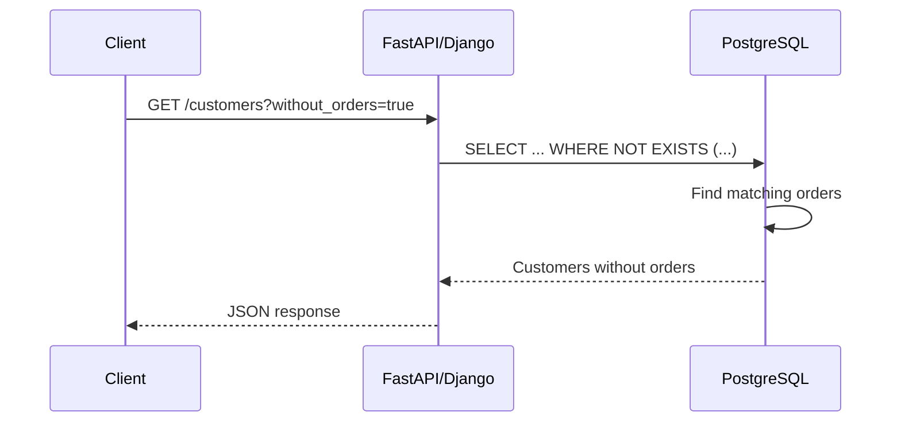

# 07- NOT IN and NULL Problems

## Overview

`NOT IN` is a compact SQL operator for excluding values from a set, but it has a critical interaction with `NULL`.

The core problem is:

```sql
value NOT IN (1, 2, NULL)
```

This does not behave like:

```text
value is different from 1, 2, and NULL
```

Because SQL uses three-valued logic, the presence of `NULL` can cause the predicate to evaluate to `UNKNOWN`. A `WHERE` clause returns only rows for which the predicate is `TRUE`.

This makes `NOT IN` a common source of production bugs, particularly when:

- A subquery returns nullable values.
- Legacy data contains unexpected NULLs.
- Foreign-key-like columns are nullable.
- Exclusion logic is used for authorization.
- Batch processing selects unprocessed records.
- Data synchronization compares two datasets.
- A query works in development but fails with real production data.

The practical rule is:

> **If the exclusion set can contain NULL, prefer `NOT EXISTS` unless you explicitly need `NOT IN` semantics and have proven the NULL behavior is safe.**

---

## The Basic NOT IN Problem

Consider:

```sql
SELECT *
FROM customers
WHERE id NOT IN (1, 2, 3);
```

This means:

```text
id is not 1
AND
id is not 2
AND
id is not 3
```

For ordinary non-NULL values, this is straightforward.

The problem begins when the list contains NULL:

```sql
SELECT *
FROM customers
WHERE id NOT IN (1, 2, NULL);
```

Conceptually, this becomes:

```sql
id <> 1
AND id <> 2
AND id <> NULL
```

The final comparison:

```sql
id <> NULL
```

evaluates to:

```text
UNKNOWN
```

Therefore the complete expression can become:

```text
TRUE AND TRUE AND UNKNOWN
```

which is:

```text
UNKNOWN
```

The row is not returned.

---

## Why NULL Changes the Result

SQL has three logical states:

```text
TRUE
FALSE
UNKNOWN
```

Normal comparisons involving NULL produce `UNKNOWN`.

For example:

| Expression | Result |
|---|---|
| `5 <> 1` | `TRUE` |
| `5 <> 5` | `FALSE` |
| `5 <> NULL` | `UNKNOWN` |
| `NULL <> 5` | `UNKNOWN` |
| `NULL <> NULL` | `UNKNOWN` |

Therefore:

```sql
5 NOT IN (1, 2, NULL)
```

behaves conceptually like:

```sql
5 <> 1
AND 5 <> 2
AND 5 <> NULL
```

which becomes:

```text
TRUE
AND TRUE
AND UNKNOWN
```

and therefore:

```text
UNKNOWN
```

A `WHERE` clause does not return rows for `UNKNOWN`.

---

## The NOT IN Subquery Trap

The most dangerous form is usually not a literal list.

It is a subquery:

```sql
SELECT *
FROM customers AS c
WHERE c.id NOT IN (
    SELECT o.customer_id
    FROM orders AS o
);
```

At first glance, this appears to mean:

```text
Return customers that have never placed an order.
```

But suppose `orders.customer_id` contains:

```text
1
2
NULL
```

The query effectively becomes:

```sql
c.id NOT IN (1, 2, NULL)
```

The NULL can cause the predicate to become UNKNOWN for otherwise eligible customer IDs.

The result can be dramatically different from what the developer intended.

---

## NOT IN vs NOT EXISTS

The safer relational expression is:

```sql
SELECT *
FROM customers AS c
WHERE NOT EXISTS (
    SELECT 1
    FROM orders AS o
    WHERE o.customer_id = c.id
);
```

This asks:

> Does there not exist an order whose customer ID matches this customer?

The subquery's unrelated NULL values do not poison the result.

### Comparison

| Requirement | `NOT IN` | `NOT EXISTS` |
|---|---|---|
| Exclude values from a set | Good | Good |
| Nullable exclusion values | Dangerous | Safe |
| Correlated relationship | Awkward | Natural |
| Express "no matching row" | Less direct | Very direct |
| NULL behavior | Three-valued logic trap | Explicit row existence |
| Typical relational exclusion | Sometimes appropriate | Usually preferred |

---

## How NOT EXISTS Avoids the Problem

Consider:

```sql
SELECT *
FROM customers AS c
WHERE NOT EXISTS (
    SELECT 1
    FROM orders AS o
    WHERE o.customer_id = c.id
);
```

For each customer, the database evaluates whether a matching order exists.

If an order has:

```text
customer_id = NULL
```

the condition:

```sql
o.customer_id = c.id
```

does not match that customer.

The NULL order is simply not an existence match.

There is no equivalent operation of:

```text
customer_id <> NULL
```

that can poison the outer predicate.

---

## NOT IN With a Guaranteed Non-NULL Column

`NOT IN` is not inherently incorrect.

Suppose:

```sql
CREATE TABLE orders (
    id bigint PRIMARY KEY,
    customer_id bigint NOT NULL
);
```

The database guarantees that:

```text
orders.customer_id
```

cannot be NULL.

Then:

```sql
SELECT *
FROM customers AS c
WHERE c.id NOT IN (
    SELECT o.customer_id
    FROM orders AS o
);
```

does not have the specific nullable-subquery problem.

However, `NOT EXISTS` may still communicate the business intent more clearly:

```sql
SELECT *
FROM customers AS c
WHERE NOT EXISTS (
    SELECT 1
    FROM orders AS o
    WHERE o.customer_id = c.id
);
```

The choice should be based on semantics, schema guarantees, and execution behavior rather than an unconditional rule that one operator is always faster.

---

## Filtering NULL From the Subquery

If `NOT IN` is required, explicitly remove NULL:

```sql
SELECT *
FROM customers AS c
WHERE c.id NOT IN (
    SELECT o.customer_id
    FROM orders AS o
    WHERE o.customer_id IS NOT NULL
);
```

This removes the specific NULL trap.

However, it is important to ask why the column is nullable in the first place.

If:

```text
orders.customer_id
```

should never be NULL, the stronger solution may be a schema constraint:

```sql
ALTER TABLE orders
ALTER COLUMN customer_id SET NOT NULL;
```

The best fix is often to enforce the data invariant rather than repeatedly compensating for invalid or ambiguous data in queries.

---

## NOT IN and an Outer NULL

There is another NULL problem:

```sql
SELECT *
FROM customers
WHERE id NOT IN (1, 2, 3);
```

What happens if:

```text
id = NULL
```

?

The expression becomes conceptually:

```text
NULL <> 1
AND NULL <> 2
AND NULL <> 3
```

Each comparison is `UNKNOWN`.

Therefore the row is not returned.

This is usually desirable if NULL means "unknown ID", but it should be understood explicitly.

If the requirement is:

```text
Include rows whose ID is NULL as well as IDs outside the exclusion set
```

then the predicate must say so:

```sql
WHERE id IS NULL
   OR id NOT IN (1, 2, 3);
```

---

## NOT EXISTS and an Outer NULL

Consider:

```sql
SELECT *
FROM customers AS c
WHERE NOT EXISTS (
    SELECT 1
    FROM blocked_customers AS b
    WHERE b.customer_id = c.id
);
```

If:

```text
c.id IS NULL
```

the equality condition:

```sql
b.customer_id = c.id
```

does not match.

Therefore the subquery finds no matching row and `NOT EXISTS` evaluates to `TRUE`.

This is an important semantic difference from:

```sql
c.id NOT IN (...)
```

when the outer value itself is NULL.

Whether this is correct depends on the data model.

If a customer ID must never be NULL, enforce:

```sql
NOT NULL
```

rather than relying on query behavior.

---

## NOT IN Is Conceptually an AND

A useful mental model is:

```sql
x NOT IN (a, b, c)
```

as approximately:

```sql
x <> a
AND x <> b
AND x <> c
```

Therefore:

```sql
x NOT IN (a, b, NULL)
```

contains:

```sql
x <> NULL
```

which evaluates to `UNKNOWN`.

This explains the behavior without memorizing a special exception.

---

## IN vs NOT IN

`IN` and `NOT IN` are not symmetric when NULL is involved.

Consider:

```sql
x IN (1, 2, NULL)
```

For:

```text
x = 1
```

the result is `TRUE`.

For:

```text
x = 3
```

the result is `UNKNOWN`, because there is no TRUE comparison but one comparison with NULL.

For:

```text
x = NULL
```

the result is also `UNKNOWN`.

With `NOT IN`, that UNKNOWN directly prevents the row from being selected.

This is why NULL bugs are particularly painful with exclusion queries.

---

## Truth Table

For a simplified comparison:

| Predicate | Result |
|---|---|
| `TRUE AND TRUE` | `TRUE` |
| `TRUE AND FALSE` | `FALSE` |
| `TRUE AND UNKNOWN` | `UNKNOWN` |
| `FALSE AND UNKNOWN` | `FALSE` |
| `UNKNOWN AND UNKNOWN` | `UNKNOWN` |
| `TRUE OR UNKNOWN` | `TRUE` |
| `FALSE OR UNKNOWN` | `UNKNOWN` |
| `NOT UNKNOWN` | `UNKNOWN` |

The key consequence is:

```text
UNKNOWN is not the same thing as FALSE.
```

This distinction is essential when debugging `NOT IN`.

---

## Practical Example: Customers Without Orders

### Risky

```sql
SELECT
    c.id,
    c.email
FROM customers AS c
WHERE c.id NOT IN (
    SELECT o.customer_id
    FROM orders AS o
);
```

### Preferred

```sql
SELECT
    c.id,
    c.email
FROM customers AS c
WHERE NOT EXISTS (
    SELECT 1
    FROM orders AS o
    WHERE o.customer_id = c.id
);
```

The second query directly expresses the business rule:

```text
Return customers for whom no order exists.
```

---

## Practical Example: Users Without Active Subscriptions

Suppose:

```text
users
subscriptions
```

and a user can have multiple subscription records.

A robust query is:

```sql
SELECT
    u.id,
    u.email
FROM users AS u
WHERE NOT EXISTS (
    SELECT 1
    FROM subscriptions AS s
    WHERE s.user_id = u.id
      AND s.status = 'active'
);
```

This is preferable to constructing a potentially nullable exclusion set:

```sql
WHERE u.id NOT IN (
    SELECT s.user_id
    FROM subscriptions AS s
    WHERE s.status = 'active'
);
```

The existence query naturally represents the relationship.

---

## Practical Example: Excluding Blocked Accounts

For an API endpoint:

```sql
SELECT
    u.id,
    u.email
FROM users AS u
WHERE u.tenant_id = $1
  AND NOT EXISTS (
      SELECT 1
      FROM blocked_users AS b
      WHERE b.tenant_id = u.tenant_id
        AND b.user_id = u.id
  );
```

Notice that the tenant boundary is inside the exclusion relationship.

For multi-tenant systems, do not write:

```sql
WHERE NOT EXISTS (
    SELECT 1
    FROM blocked_users AS b
    WHERE b.user_id = u.id
);
```

unless `user_id` is globally unique and that is guaranteed by the data model.

Authorization and tenant isolation should be explicit.

---

## Security Implications

A NULL-related exclusion bug can become a security problem when exclusion controls access.

For example:

```sql
SELECT *
FROM documents AS d
WHERE d.id NOT IN (
    SELECT revoked_document_id
    FROM revoked_access
    WHERE user_id = $1
);
```

If `revoked_document_id` can contain NULL, the query may produce unexpected results.

Authorization queries should:

- Avoid ambiguous NULL semantics.
- Prefer explicit `EXISTS` / `NOT EXISTS` relationships.
- Include tenant boundaries where applicable.
- Use parameterized values.
- Have tests for NULL and missing relationships.
- Be backed by appropriate constraints.

Do not assume a logically compact query is automatically safe authorization logic.

---

## Performance Considerations

`NOT EXISTS` is not automatically faster than `NOT IN`.

Modern PostgreSQL can transform semantically suitable queries into efficient anti-join plans.

Possible plan shapes include:

```text
Nested Loop Anti Join
Hash Anti Join
Merge Anti Join
```

The important question is whether the query expresses the correct semantics and whether the resulting plan is efficient.

Inspect production-sensitive queries with:

```sql
EXPLAIN (ANALYZE, BUFFERS)
SELECT
    c.id
FROM customers AS c
WHERE NOT EXISTS (
    SELECT 1
    FROM orders AS o
    WHERE o.customer_id = c.id
);
```

Do not optimize based solely on the SQL keyword.

---

## Indexing for NOT EXISTS

For:

```sql
SELECT *
FROM customers AS c
WHERE NOT EXISTS (
    SELECT 1
    FROM orders AS o
    WHERE o.customer_id = c.id
);
```

an index on:

```sql
orders(customer_id)
```

can be important.

For example:

```sql
CREATE INDEX orders_customer_id_idx
ON orders (customer_id);
```

The exact index should be based on the complete workload.

If the query also filters by tenant:

```sql
WHERE o.tenant_id = c.tenant_id
  AND o.customer_id = c.id
```

a composite index may be more appropriate:

```sql
CREATE INDEX orders_tenant_customer_idx
ON orders (tenant_id, customer_id);
```

Validate with an execution plan rather than assuming an index is useful.

---

## Large Literal NOT IN Lists

Application code sometimes generates:

```sql
WHERE id NOT IN (...)
```

with thousands of values.

This can create:

- Large SQL statements.
- Increased parsing/planning work.
- Network overhead.
- Parameter-count limitations depending on the driver.
- Difficult query observability.
- Poor maintainability.

For large exclusion sets, consider representing the values as a relational input:

```sql
WITH excluded_ids(id) AS (
    VALUES
        ($1),
        ($2),
        ($3)
)
SELECT c.*
FROM customers AS c
WHERE NOT EXISTS (
    SELECT 1
    FROM excluded_ids AS e
    WHERE e.id = c.id
);
```

For very large datasets, a temporary or staging table can be more appropriate.

The correct approach depends on data volume, query frequency, transaction scope, and PostgreSQL workload.

---

## NOT IN With Application-Generated Lists

Python code such as:

```python
excluded_ids = get_excluded_ids()
```

should not construct SQL through string interpolation.

Avoid:

```python
query = f"""
SELECT *
FROM customers
WHERE id NOT IN ({",".join(map(str, excluded_ids))})
"""
```

This is difficult to maintain and can create security and operational problems if values are not handled correctly.

Use parameterized queries or ORM mechanisms.

For example, Django:

```python
Customer.objects.exclude(id__in=excluded_ids)
```

The ORM handles parameterization, but developers still need to understand the SQL semantics, especially if the exclusion values originate from nullable database columns.

---

## Django and NULL Semantics

Django provides:

```python
Customer.objects.filter(email__isnull=True)
```

for NULL checks.

For exclusion:

```python
Customer.objects.exclude(id__in=excluded_ids)
```

may be appropriate when `excluded_ids` is a known application-side collection.

For database relationships, prefer expressing the relationship directly where possible.

For example, using `Exists`:

```python
from django.db.models import Exists, OuterRef

orders = Order.objects.filter(customer_id=OuterRef("pk"))

customers_without_orders = (
    Customer.objects
    .annotate(has_order=Exists(orders))
    .filter(has_order=False)
)
```

This expresses:

```text
customers for whom no matching order exists
```

without constructing a potentially problematic exclusion set.

---

## SQLAlchemy and NOT EXISTS

SQLAlchemy can express existence semantics directly.

Conceptually:

```python
from sqlalchemy import exists, select

stmt = select(Customer).where(
    ~exists(
        select(1).where(Order.customer_id == Customer.id)
    )
)
```

This is often preferable for relationship-based exclusion.

The important engineering principle is the same regardless of ORM:

> Express relational existence requirements as relational existence operations.

---

## Data Quality and Constraints

If a column should never be NULL, do not depend on query authors remembering to filter NULL forever.

Use:

```sql
ALTER TABLE orders
ALTER COLUMN customer_id SET NOT NULL;
```

If a relationship is mandatory, also consider a foreign key:

```sql
ALTER TABLE orders
ADD CONSTRAINT orders_customer_id_fk
FOREIGN KEY (customer_id)
REFERENCES customers(id);
```

Constraints move correctness into the database.

This reduces the number of queries that need defensive NULL handling.

---

## When NOT IN Is Appropriate

`NOT IN` can be a good choice when:

- The exclusion set is small.
- The values are application-controlled.
- NULL cannot occur.
- The semantics are clearly set-based.
- The query is easy to read.
- The execution plan is acceptable.

Example:

```sql
SELECT *
FROM users
WHERE status NOT IN ('suspended', 'deleted');
```

If `status` itself is nullable, remember that NULL rows will not satisfy the predicate.

If the requirement is to include NULL statuses:

```sql
WHERE status IS NULL
   OR status NOT IN ('suspended', 'deleted');
```

---

## When NOT EXISTS Is Preferable

Prefer `NOT EXISTS` when:

- The exclusion source is a database relation.
- The source column can be NULL.
- The requirement is "there is no matching row."
- The relationship includes multiple predicates.
- Multi-tenant boundaries are involved.
- The exclusion is part of authorization.
- The subquery is naturally correlated.

Example:

```sql
SELECT *
FROM accounts AS a
WHERE NOT EXISTS (
    SELECT 1
    FROM account_events AS e
    WHERE e.account_id = a.id
      AND e.event_type = 'deactivated'
);
```

The SQL closely matches the business requirement.

---

## NOT IN vs LEFT JOIN

Another common pattern is:

```sql
SELECT c.*
FROM customers AS c
LEFT JOIN orders AS o
    ON o.customer_id = c.id
WHERE o.id IS NULL;
```

This can find customers with no orders.

It is valid when the join semantics are carefully designed.

However, `NOT EXISTS` is often clearer when the only requirement is existence:

```sql
SELECT c.*
FROM customers AS c
WHERE NOT EXISTS (
    SELECT 1
    FROM orders AS o
    WHERE o.customer_id = c.id
);
```

Do not choose a `LEFT JOIN` simply because it appears equivalent. Consider row multiplication, additional selected columns, grouping, and the actual execution plan.

---

## Anti-Join Mental Model

`NOT EXISTS` is naturally understood as an anti-join:

```text
customers
     │
     │ exclude if matching order exists
     ▼
orders
```

Conceptually:

```text
Customer
   │
   ├── matching order exists → exclude
   │
   └── no matching order      → keep
```

This is exactly the requirement behind many queries that developers incorrectly implement with `NOT IN`.

---

## Request Lifecycle in a Backend API

A typical API request might look like:



The important boundary is that the API should express the business rule clearly.

If the database relationship is:

```text
Customer → Order
```

then:

```sql
NOT EXISTS
```

often maps more naturally to:

```text
Customer has no Order
```

than a manually constructed `NOT IN` list.

---

## Production Pitfalls

### Assuming a Subquery Cannot Return NULL

A column may be nullable today or become nullable later because of:

- Schema changes.
- Data migrations.
- Legacy records.
- ETL imports.
- Incorrect application writes.
- Partial data cleanup.

A query relying on:

```sql
NOT IN (subquery)
```

can silently change behavior when NULL enters the data.

### Fix

Either enforce:

```sql
NOT NULL
```

or use:

```sql
NOT EXISTS
```

when existence semantics are appropriate.

---

### Using NOT IN for Authorization

Example:

```sql
WHERE resource_id NOT IN (
    SELECT revoked_resource_id
    FROM revoked_access
)
```

is dangerous when the exclusion relation contains NULL.

### Fix

Use explicit existence logic:

```sql
WHERE NOT EXISTS (
    SELECT 1
    FROM revoked_access AS r
    WHERE r.revoked_resource_id = resource.id
);
```

and include the correct user and tenant boundaries.

---

### Adding DISTINCT to Hide the Problem

Developers sometimes attempt:

```sql
SELECT DISTINCT ...
```

after seeing incorrect results.

`DISTINCT` does not fix NULL semantics.

It removes duplicate result rows.

It does not turn:

```text
UNKNOWN
```

into:

```text
TRUE
```

Fix the predicate itself.

---

### Adding COALESCE Without Understanding Semantics

This:

```sql
WHERE id NOT IN (
    SELECT COALESCE(customer_id, -1)
    FROM orders
)
```

may technically avoid NULL but introduces an artificial sentinel.

This is dangerous if:

```text
-1
```

has meaning now or in the future.

Do not use arbitrary sentinel values as a substitute for proper relational semantics unless the data model explicitly defines them.

---

## Troubleshooting Workflow

When `NOT IN` unexpectedly returns zero or too few rows:

1. Run the subquery independently.
2. Check whether it returns NULL.
3. Check whether the outer value can be NULL.
4. Replace the query temporarily with `NOT EXISTS`.
5. Compare the result sets.
6. Inspect the table constraints.
7. Check whether a recent migration changed nullability.
8. Inspect ORM-generated SQL.
9. Check execution plans for large datasets.
10. Add regression tests for NULL values.

For example:

```sql
SELECT
    COUNT(*) AS total,
    COUNT(customer_id) AS non_null_customer_ids,
    COUNT(*) - COUNT(customer_id) AS null_customer_ids
FROM orders;
```

If:

```text
null_customer_ids > 0
```

the `NOT IN` query deserves immediate scrutiny.

---

## Testing Strategy

For exclusion queries, test at least these cases:

| Case | Expected |
|---|---|
| No exclusion rows | All eligible rows |
| Matching exclusion row | Matching row excluded |
| Non-matching exclusion rows | Row retained |
| Exclusion set contains NULL | Behavior explicitly defined |
| Outer value is NULL | Behavior explicitly defined |
| Multiple matching rows | Row excluded once |
| Multiple tenants | No cross-tenant exclusion |
| Soft-deleted rows | Correct inclusion/exclusion |
| Empty exclusion set | Correct full result |

A regression test for the NULL trap should deliberately include:

```text
customer_id = NULL
```

in the exclusion relation.

This prevents a future migration from silently reintroducing the bug.

---

## Reliability and Concurrency

`NOT EXISTS` determines whether a matching row exists at the time the query evaluates.

It does not by itself guarantee that another transaction cannot create the row immediately afterward.

For example:

```sql
SELECT *
FROM customers AS c
WHERE NOT EXISTS (
    SELECT 1
    FROM orders AS o
    WHERE o.customer_id = c.id
);
```

does not enforce:

```text
A customer can never have an order.
```

If the business requirement is a concurrency invariant, use the appropriate database mechanism:

- Unique constraints.
- Foreign keys.
- Transactions.
- Appropriate locks.
- Serializable isolation where justified.
- Atomic conditional statements.

Do not confuse an exclusion query with an integrity constraint.

---

## Monitoring

For important production queries, monitor:

- Query latency.
- Rows returned.
- Rows scanned.
- Buffer reads.
- CPU time.
- Query frequency.
- Plan changes.
- Index usage.
- Database load.

Useful PostgreSQL diagnostics include:

```sql
EXPLAIN (ANALYZE, BUFFERS)
SELECT ...
```

and, where available:

```sql
SELECT
    query,
    calls,
    mean_exec_time,
    rows
FROM pg_stat_statements
ORDER BY mean_exec_time DESC
LIMIT 20;
```

A NULL-related correctness problem and a performance problem should be investigated separately.

First establish that the query is semantically correct.

Then optimize its execution.

---

## Senior Decision Framework

Before writing an exclusion query, ask:

```text
What am I actually expressing?
        │
        ├── "Value is outside a small known set"
        │       └── NOT IN may be appropriate
        │
        └── "No related row exists"
                └── NOT EXISTS is usually clearer
```

Then ask:

```text
Can any compared value be NULL?
        │
        ├── Yes
        │    └── Prefer NOT EXISTS or explicitly handle NULL
        │
        └── No
             └── NOT IN can be safe
```

Finally:

```text
Is this enforcing an invariant?
        │
        ├── Yes → use constraints/transactions/locking as appropriate
        └── No  → use the query that best expresses the read requirement
```

This prevents optimization and syntax preferences from replacing actual requirement analysis.

---

## Decision Matrix

| Scenario | Recommended approach |
|---|---|
| Small fixed non-NULL list | `NOT IN` |
| Small list may contain NULL | Clean NULLs or use explicit NULL logic |
| Nullable subquery | `NOT EXISTS` |
| "No matching child row" | `NOT EXISTS` |
| Authorization exclusion | Usually `NOT EXISTS` |
| Multi-tenant exclusion | `NOT EXISTS` with tenant predicate |
| Nullable outer value | Define semantics explicitly |
| Large exclusion dataset | Relational input / staging table / `NOT EXISTS` |
| Enforce impossible NULL | `NOT NULL` constraint |
| Enforce uniqueness | Unique constraint/index |
| Enforce concurrency invariant | Constraint/transaction/locking |

---

## Common Mistakes

### Mistake: Treating NULL as a Value

```sql
WHERE id NOT IN (1, 2, NULL);
```

**Why it fails:** NULL is unknown, not a value that can be compared with `<>`.

**Fix:** Remove NULL from the set or use `NOT EXISTS`.

---

### Mistake: Assuming NOT IN and NOT EXISTS Are Always Equivalent

They can produce different results when NULL is involved.

**Fix:** Analyze NULLability before treating them as interchangeable.

---

### Mistake: Ignoring Schema Nullability

A query may be correct under today's data assumptions but fail after a schema change.

**Fix:** Use database constraints to make assumptions explicit.

---

### Mistake: Using COALESCE With Arbitrary Sentinels

```sql
COALESCE(customer_id, -1)
```

can create hidden semantic coupling.

**Fix:** Prefer relational predicates and explicit NULL handling.

---

### Mistake: Assuming NOT EXISTS Prevents Concurrent Inserts

It does not.

**Fix:** Use constraints or appropriate transactional mechanisms for invariants.

---

## Interview Traps

**Why can `NOT IN` return zero rows when the subquery contains NULL?**

Because `NOT IN` is logically equivalent to a series of `<>` comparisons combined with `AND`. A comparison against NULL produces `UNKNOWN`, and `TRUE AND UNKNOWN` is `UNKNOWN`. `WHERE` keeps only `TRUE`.

**Is `NOT EXISTS` always faster than `NOT IN`?**

No. PostgreSQL can transform equivalent queries into anti-join plans. Correct semantics and the execution plan matter more than the keyword.

**What is the safest alternative to a nullable `NOT IN` subquery?**

Usually:

```sql
NOT EXISTS (
    SELECT 1
    ...
)
```

when the requirement is that no matching row exists.

**Can `NOT IN` itself be used safely?**

Yes, if the compared set is guaranteed to contain no NULL and the semantics are appropriate.

**Does `NOT EXISTS` match NULL to NULL?**

No. A normal equality predicate inside it does not match NULL to NULL:

```sql
a.value = b.value
```

If NULL-to-NULL matching is required in PostgreSQL, use:

```sql
a.value IS NOT DISTINCT FROM b.value
```

**Does `NOT EXISTS` enforce a business rule?**

No. It answers a query at a particular database state. Constraints and transactional mechanisms enforce invariants.

## Key Takeaways

- **`NOT IN` is vulnerable to NULL because its comparisons use SQL's three-valued logic; a NULL in the exclusion set can turn an otherwise expected result into `UNKNOWN`.**
- **For relational exclusion such as "customers with no orders," prefer `NOT EXISTS`, especially when the source column is nullable or the relationship has additional predicates.**
- **`NOT IN` is safe when the exclusion set is provably non-NULL and its set-based semantics are appropriate; enforce important assumptions with database constraints rather than relying only on query logic.**
- **NULL handling must be tested at both the outer value and exclusion-set level, particularly for authorization, multi-tenancy, soft deletes, synchronization, and production data migrations.**
- **Do not assume `NOT EXISTS` is automatically faster or that it enforces concurrency invariants; validate execution plans and use constraints, transactions, or locking when correctness depends on concurrent writes.**