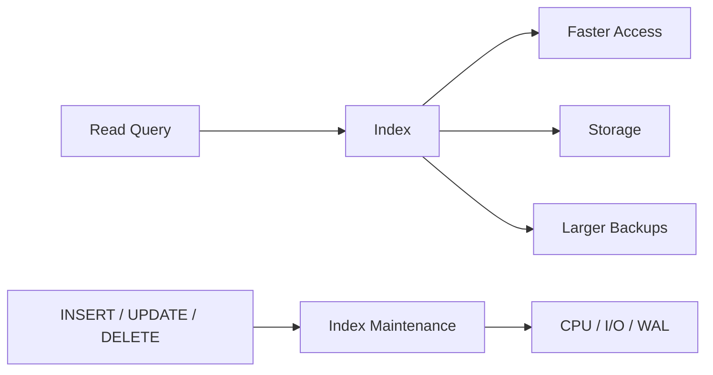
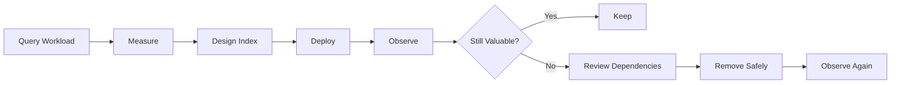

# 10- Over-Indexing

## Overview

Over-indexing occurs when a database has more indexes than the workload justifies.

Indexes are essential for efficient reads, but every index also creates cost:

- Additional storage.
- Additional write I/O.
- Additional WAL generation.
- More CPU during `INSERT`, `UPDATE`, and `DELETE`.
- More vacuum and maintenance work.
- Larger backups.
- Longer index creation and maintenance operations.
- More complex schema management.
- More opportunities for redundant or ineffective indexes.

The anti-pattern is not:

```text
"Having many indexes is always bad."
```

The real problem is:

```text
Indexes whose read benefit does not justify their total operational cost.
```

For example:

```sql
CREATE INDEX orders_customer_id_idx
ON orders (customer_id);

CREATE INDEX orders_status_idx
ON orders (status);

CREATE INDEX orders_created_at_idx
ON orders (created_at);

CREATE INDEX orders_customer_status_idx
ON orders (customer_id, status);

CREATE INDEX orders_customer_status_created_at_idx
ON orders (customer_id, status, created_at);
```

Some of these may be justified. Others may overlap heavily or provide little additional value.

Senior database engineering requires designing indexes from **actual query patterns, cardinality, write workload, and operational requirements**, not from the rule "index every frequently filtered column."

---

## What an Index Provides

An index is an additional data structure that provides an alternative access path to table data.

Without an appropriate index, PostgreSQL may use:

```text
Seq Scan
    ↓
inspect many/all table rows
```

With an appropriate index:

```text
Index Scan
    ↓
locate qualifying keys
    ↓
fetch required rows
```

For selective queries against large tables, this can dramatically reduce work.

But the index itself must be maintained.

---

## The Cost of an Index

Every additional index creates a trade-off.



The same index that improves a read query can increase the cost of every relevant write.

This is why indexing is a workload optimization problem rather than a simple "more indexes = faster database" problem.

---

## Why Over-Indexing Happens

Common causes include:

- Adding an index for every new query.
- Automatically indexing every foreign key.
- Creating single-column indexes without checking existing composite indexes.
- Adding indexes to fix isolated incidents without later review.
- Creating indexes for speculative future queries.
- ORM migrations accumulating indexes over time.
- Copying indexes from another environment or service.
- Creating multiple indexes with overlapping prefixes.
- Adding an index without checking whether the optimizer actually uses it.

A typical progression is:

```text
Application grows
      ↓
New endpoint
      ↓
Slow query
      ↓
Add index
      ↓
Another endpoint
      ↓
Add another index
      ↓
More workloads
      ↓
Redundant indexes accumulate
```

The database eventually becomes read-optimized at the expense of write performance and operational simplicity.

---

## Index Count Is Not the Correct Metric

There is no universal rule such as:

```text
"Never have more than 10 indexes."
```

A table with:

```text
5 indexes
```

can be over-indexed.

A table with:

```text
30 indexes
```

may be justified in a read-heavy analytical workload.

Evaluate:

- Table size.
- Query frequency.
- Query latency requirements.
- Selectivity.
- Write volume.
- Update patterns.
- Index size.
- Index usage.
- Index overlap.
- Maintenance cost.
- Availability requirements.

The correct question is:

> **Does this index provide enough workload value to justify its ongoing cost?**

---

## Single-Column Indexes

Consider:

```sql
CREATE INDEX orders_customer_id_idx
ON orders (customer_id);

CREATE INDEX orders_status_idx
ON orders (status);

CREATE INDEX orders_created_at_idx
ON orders (created_at);
```

Each index may be useful independently.

But if the dominant query is:

```sql
SELECT *
FROM orders
WHERE customer_id = $1
  AND status = $2
ORDER BY created_at DESC
LIMIT 50;
```

a composite index may provide a better access path:

```sql
CREATE INDEX orders_customer_status_created_idx
ON orders (
    customer_id,
    status,
    created_at DESC
);
```

This does not automatically mean the three original indexes should be removed.

Other queries may depend on them.

Index design must consider the complete workload.

---

## Composite Indexes and Redundancy

Suppose a table has:

```sql
CREATE INDEX orders_customer_idx
ON orders (customer_id);

CREATE INDEX orders_customer_status_idx
ON orders (customer_id, status);
```

The second index has:

```text
customer_id
status
```

while the first has:

```text
customer_id
```

Because of PostgreSQL B-tree left-prefix behavior, the composite index can often support queries filtering on `customer_id` alone.

This makes the single-column index a candidate for review.

However, do not automatically drop it.

Consider:

- Query plans.
- Index size.
- Index-only scan possibilities.
- Different ordering requirements.
- Planner choices.
- Write cost.
- Production query frequency.

---

## Leftmost Prefix

For:

```sql
CREATE INDEX orders_customer_status_idx
ON orders (customer_id, status);
```

the index is naturally ordered by:

```text
customer_id
status
```

It is well suited to predicates involving:

```sql
WHERE customer_id = $1
```

and:

```sql
WHERE customer_id = $1
  AND status = $2
```

It is not equivalent to having:

```sql
INDEX(status)
```

for queries that only filter on `status`.

This is why column order matters when determining whether indexes overlap.

---

## Redundant Does Not Mean Identical

Consider:

```sql
CREATE INDEX orders_customer_idx
ON orders (customer_id);

CREATE INDEX orders_customer_status_idx
ON orders (customer_id, status);
```

The first may be partially redundant for some workloads.

But the two indexes are not physically identical.

The single-column index is:

- Smaller.
- Potentially cheaper to maintain.
- Potentially better for some index-only access.
- Potentially preferable for certain queries.

The composite index:

- Supports additional predicates.
- May support ordering.
- Contains more information.
- Costs more to maintain.

Index review requires workload evidence.

---

## Index Usage Statistics

PostgreSQL provides statistics that can help identify indexes worth reviewing.

For example:

```sql
SELECT
    schemaname,
    relname AS table_name,
    indexrelname AS index_name,
    idx_scan,
    idx_tup_read,
    idx_tup_fetch
FROM pg_stat_user_indexes
ORDER BY idx_scan ASC;
```

An index with very low `idx_scan` may be a candidate for investigation.

But:

> **Low usage does not automatically mean an index is useless.**

An index may support:

- Rare administrative operations.
- Disaster recovery procedures.
- Critical but infrequent APIs.
- Unique constraints.
- Foreign-key enforcement.
- Operational workflows.
- Queries that have not run during the statistics window.

Usage statistics are evidence, not an automatic deletion command.

---

## Indexes Supporting Constraints

Some indexes exist because they enforce correctness rather than optimize queries.

For example:

```sql
CREATE UNIQUE INDEX users_email_unique_idx
ON users (email);
```

The index may support a uniqueness constraint.

Do not remove it simply because:

```text
idx_scan = 0
```

The index may be essential for data integrity.

Before removing any index, determine whether it is associated with:

- `PRIMARY KEY`.
- `UNIQUE` constraint.
- Exclusion constraint.
- Other schema-level guarantees.

Correctness indexes are fundamentally different from optional performance indexes.

---

## Finding Index Definitions

Inspect indexes with:

```sql
SELECT
    schemaname,
    tablename,
    indexname,
    indexdef
FROM pg_indexes
WHERE schemaname = 'public'
ORDER BY tablename, indexname;
```

For a specific table:

```sql
SELECT
    indexname,
    indexdef
FROM pg_indexes
WHERE tablename = 'orders';
```

This is useful during index reviews and migration cleanup.

---

## Index Size Matters

Indexes can consume substantial storage.

Inspect relation sizes:

```sql
SELECT
    indexrelname AS index_name,
    pg_size_pretty(pg_relation_size(indexrelid)) AS index_size
FROM pg_stat_user_indexes
WHERE relname = 'orders'
ORDER BY pg_relation_size(indexrelid) DESC;
```

For large production tables, redundant indexes can consume gigabytes or more.

Storage cost also affects:

- Backups.
- Restore duration.
- Cache efficiency.
- Vacuum work.
- Replica storage.
- Infrastructure cost.

---

## Cache Pressure

PostgreSQL keeps frequently accessed data and index pages in memory through its shared buffer/cache mechanisms and the operating system's filesystem cache.

Additional indexes increase the total working set.

Suppose:

```text
Table = 500 GB
Indexes = 300 GB
```

Adding another large index increases the amount of data competing for cache.

A query may become slower not because its own index is bad, but because unnecessary indexes consume memory that could otherwise hold useful table or index pages.

This is one reason over-indexing can hurt read performance indirectly.

---

## Write Amplification

Consider:

```sql
INSERT INTO orders (...)
VALUES (...);
```

The database must maintain every applicable index.

Conceptually:

```text
INSERT
  ├── heap/table write
  ├── index A update
  ├── index B update
  ├── index C update
  ├── index D update
  └── WAL generation
```

If a table has many indexes, a high-throughput insert workload can become increasingly expensive.

This is particularly relevant for:

- Event ingestion.
- Logging systems.
- Kafka consumers.
- Metrics storage.
- High-volume transactional systems.

---

## UPDATE Cost

Updates can be even more expensive when indexed columns change.

For:

```sql
UPDATE orders
SET status = 'completed'
WHERE id = $1;
```

an index on:

```sql
status
```

may require index maintenance.

If the update changes several indexed columns, multiple indexes may need maintenance.

Even updates that appear logically simple can therefore create significant write amplification.

---

## HOT Updates

PostgreSQL can sometimes perform a Heap-Only Tuple (HOT) update when the updated columns do not require modifying indexes and there is sufficient space on the relevant page.

Over-indexing can reduce the opportunities for HOT updates because more columns may be indexed.

This can increase:

- Index maintenance.
- Heap churn.
- Vacuum work.
- Storage pressure.

Therefore, excessive indexing can affect more than direct index-update cost.

---

## DELETE Cost

Deleting a row also affects indexes.

For:

```sql
DELETE FROM orders
WHERE id = $1;
```

PostgreSQL must account for index entries associated with the deleted row.

A table with many indexes therefore makes high-volume deletes more expensive.

This matters for:

- Data retention jobs.
- GDPR deletion workflows.
- Cleanup jobs.
- Archival processes.
- Large batch deletes.

---

## WAL and Replication

Index maintenance contributes to WAL generation.

More indexes can therefore increase the amount of information that must be replicated.

In a streaming replication architecture:

```text
Primary
   ↓
WAL
   ↓
Replica
```

more write amplification can contribute to:

- Higher WAL volume.
- Increased replication bandwidth.
- Replica lag.
- Larger recovery workload.

Indexes do not simply affect local storage.

They can affect the entire HA topology.

---

## Backups and Disaster Recovery

Larger indexes increase storage requirements and can influence backup and restore operations.

Consider:

```text
Primary
   ├── table
   ├── index A
   ├── index B
   ├── index C
   └── index D
```

A redundant index may provide little business value while increasing the amount of database state that must be maintained operationally.

For production databases, evaluate indexes as part of:

- Backup size.
- Restore time.
- Replica provisioning.
- Disaster recovery capacity.
- Storage scaling.

---

## Read-Heavy vs Write-Heavy Workloads

The correct index strategy depends heavily on workload.

### Read-heavy system

Additional indexes may be justified when:

- Queries are latency-sensitive.
- Reads dominate writes.
- Tables are large.
- Queries are selective.
- Indexes materially reduce I/O.

### Write-heavy system

Be more conservative when:

- Inserts are frequent.
- Updates are frequent.
- Events are continuously ingested.
- Indexes are large.
- Most indexes have low usage.

A Kafka-backed ingestion service, for example, may need far fewer indexes than a transactional customer-facing database serving many different read patterns.

---

## Selectivity Matters

An index is most useful when it can efficiently narrow the candidate rows.

Suppose:

```sql
SELECT *
FROM orders
WHERE status = 'completed';
```

If:

```text
95% of orders are completed
```

an index on:

```sql
status
```

may provide limited benefit.

The optimizer may prefer a sequential scan.

This does not mean the index is automatically useless.

Other queries might use:

```sql
WHERE status = 'failed'
```

if that value is highly selective.

Data distribution matters.

---

## Skewed Data

Consider:

```text
status
------
completed   99%
pending      0.5%
failed       0.5%
```

An index on `status` may be particularly valuable for:

```sql
WHERE status = 'failed';
```

but less valuable for:

```sql
WHERE status = 'completed';
```

PostgreSQL's planner uses statistics to estimate this distribution.

Index design should therefore consider actual workload and data skew.

---

## Partial Indexes

A partial index can sometimes provide better value than a broad index.

For example:

```sql
CREATE INDEX orders_pending_idx
ON orders (created_at)
WHERE status = 'pending';
```

This index contains only pending orders.

It can be substantially smaller than:

```sql
CREATE INDEX orders_status_created_idx
ON orders (status, created_at);
```

when pending rows represent a small portion of the table.

Partial indexes are particularly useful for:

- Active rows.
- Pending jobs.
- Unprocessed records.
- Soft-delete models.
- Operational queues.

---

## Partial Index Example

A Celery worker may query:

```sql
SELECT id
FROM tasks
WHERE status = 'pending'
ORDER BY created_at
LIMIT 100;
```

A targeted index could be:

```sql
CREATE INDEX tasks_pending_created_idx
ON tasks (created_at, id)
WHERE status = 'pending';
```

This can support the active workload without indexing every historical task.

The index should still be validated with the actual query plan.

---

## Covering Indexes and INCLUDE

PostgreSQL supports included columns:

```sql
CREATE INDEX orders_customer_created_idx
ON orders (customer_id, created_at DESC)
INCLUDE (status, total_amount);
```

This can help certain index-only scans without making the included columns part of the index's search/order key.

However, `INCLUDE` columns still increase index size and write cost.

Do not use `INCLUDE` as a free way to store arbitrary columns in every index.

---

## Over-Indexing Through INCLUDE

This is potentially excessive:

```sql
CREATE INDEX orders_customer_covering_idx
ON orders (customer_id)
INCLUDE (
    status,
    total_amount,
    created_at,
    shipping_address,
    billing_address,
    notes
);
```

The index may become very large.

If the table receives frequent writes, the maintenance cost can outweigh the benefit.

Covering indexes should be designed around a specific latency-sensitive query or small family of queries.

---

## Composite Index Explosion

A common anti-pattern is creating every permutation:

```text
(customer_id)
(status)
(created_at)
(customer_id, status)
(customer_id, created_at)
(status, created_at)
(customer_id, status, created_at)
(status, customer_id, created_at)
...
```

This creates an index explosion.

Instead:

1. Identify actual query patterns.
2. Identify equality predicates.
3. Identify range predicates.
4. Identify ordering requirements.
5. Identify high-value API paths.
6. Consolidate where practical.
7. Measure before and after.

The goal is a small set of high-value access paths, not every possible column combination.

---

## ORM-Driven Over-Indexing

Django models can declare indexes:

```python
class Order(models.Model):
    customer_id = models.BigIntegerField()
    status = models.CharField(max_length=32)

    class Meta:
        indexes = [
            models.Index(fields=["customer_id"]),
            models.Index(fields=["status"]),
        ]
```

This is convenient, but ORM configuration does not replace workload analysis.

Before adding:

```python
models.Index(fields=["customer_id"])
```

check whether an existing index such as:

```text
(customer_id, status)
```

already serves the important query patterns.

Schema migrations should be reviewed as database changes, not just application configuration.

---

## Django Migration Example

Adding:

```python
class Meta:
    indexes = [
        models.Index(fields=["customer_id", "status"]),
    ]
```

creates a database-level index.

Before deploying, review:

- Existing indexes.
- Table size.
- Write rate.
- Query frequency.
- Migration behavior.
- Index build duration.
- Lock impact.
- Replica effects.

Do not allow ORM migrations to accumulate indexes without periodic schema review.

---

## FastAPI Does Not Change Index Economics

Whether SQL is generated by:

- Django ORM.
- SQLAlchemy.
- asyncpg.
- psycopg.
- Raw SQL.

the database still pays the same index maintenance cost.

The application framework changes how queries are generated, not the underlying storage economics.

Senior backend engineers should therefore inspect generated SQL and database plans rather than treating indexing as an ORM-only concern.

---

## N+1 Queries and Indexing

A common mistake is attempting to solve N+1 problems by adding indexes.

For example:

```text
1 query for users
+
1000 queries for orders
```

may still be slow even if:

```text
orders(user_id)
```

is perfectly indexed.

An index can make each query cheaper, but it does not remove the excessive query count.

Fix the N+1 access pattern through:

- `select_related`.
- `prefetch_related`.
- Explicit joins.
- Batched queries.
- Appropriate data loading.

Then optimize the resulting SQL.

---

## Indexing Does Not Replace Query Optimization

Suppose:

```sql
SELECT *
FROM orders
WHERE customer_id = $1;
```

is slow.

Adding:

```sql
CREATE INDEX orders_customer_idx
ON orders (customer_id);
```

may help.

But if the real query is:

```sql
SELECT *
FROM orders
JOIN customers ...
JOIN payments ...
JOIN shipments ...
WHERE ...
```

the bottleneck may be:

- Join cardinality.
- Sorting.
- Aggregation.
- Incorrect predicates.
- Row explosion.
- Poor pagination.
- Large result sets.

Do not treat indexes as the universal solution to SQL performance problems.

---

## Indexes and Pagination

For large APIs, keyset pagination can align naturally with indexes.

For example:

```sql
SELECT
    id,
    created_at,
    total_amount
FROM orders
WHERE customer_id = $1
  AND (created_at, id) < ($2, $3)
ORDER BY created_at DESC, id DESC
LIMIT 50;
```

A corresponding index might be:

```sql
CREATE INDEX orders_customer_created_id_idx
ON orders (
    customer_id,
    created_at DESC,
    id DESC
);
```

This can be far more scalable than using:

```sql
OFFSET 1000000
```

The index is valuable because it matches the access pattern.

---

## Indexes and JOINs

For:

```sql
SELECT ...
FROM orders AS o
JOIN customers AS c
    ON c.id = o.customer_id;
```

an index on the relevant join key can be useful depending on the chosen plan.

However, primary keys already have indexes in normal PostgreSQL designs.

Do not blindly add another index to a primary key column.

Always inspect existing indexes first.

---

## Foreign Keys and Indexes

A foreign key does not automatically mean an index exists on the referencing column in PostgreSQL.

For example:

```sql
orders.customer_id
```

may benefit from:

```sql
CREATE INDEX orders_customer_id_idx
ON orders (customer_id);
```

for:

- Parent-child lookups.
- Joins.
- Deletes/updates of referenced parent rows.
- Application queries.

However, whether the index is needed depends on workload and schema behavior.

This is different from indexing every foreign key without analysis.

---

## Indexes and DELETE/UPDATE of Referenced Rows

Consider:

```sql
DELETE FROM customers
WHERE id = $1;
```

If child rows reference:

```text
orders.customer_id
```

an index on the referencing column can be important for efficiently checking related rows, particularly for large child tables.

This is a correctness/operational consideration beyond ordinary application reads.

Foreign-key indexing should therefore be evaluated from the complete relationship workload.

---

## Index-Only Scans

An index can sometimes satisfy a query without fetching the full table row.

For example:

```sql
SELECT customer_id
FROM orders
WHERE customer_id = $1;
```

may benefit from an index containing the required data.

But index-only scans depend on more than the index definition, including PostgreSQL visibility information.

Therefore:

```text
"Index contains the columns"
```

does not guarantee:

```text
"Index-only scan will always occur."
```

Validate with `EXPLAIN`.

---

## Statistics and Planner Decisions

PostgreSQL chooses between available access paths based on estimated cost.

Possible choices include:

```text
Seq Scan
Index Scan
Index Only Scan
Bitmap Heap Scan
Bitmap Index Scan
```

An index may exist but not be used because:

- The predicate is not selective.
- The table is small.
- The table is already cached.
- Statistics are stale.
- Another plan is cheaper.
- The query expression does not match the index.
- Correlation/data distribution favors another access path.

Do not delete an index simply because one query used a sequential scan.

---

## Finding Potentially Redundant Indexes

A basic review can start with:

```sql
SELECT
    schemaname,
    relname AS table_name,
    indexrelname AS index_name,
    idx_scan,
    pg_size_pretty(pg_relation_size(indexrelid)) AS index_size
FROM pg_stat_user_indexes
ORDER BY pg_relation_size(indexrelid) DESC;
```

Then compare definitions:

```sql
SELECT
    schemaname,
    tablename,
    indexname,
    indexdef
FROM pg_indexes
WHERE tablename = 'orders'
ORDER BY indexname;
```

Look for:

- Same column set.
- Same leading columns.
- Same predicates.
- Same expressions.
- Similar covering columns.
- Multiple indexes created for historical query versions.

Automated tools can help identify candidates, but final removal should be based on workload and dependency analysis.

---

## Safe Index Removal

Never immediately execute:

```sql
DROP INDEX orders_customer_idx;
```

because an index looks unused.

First:

1. Identify the index definition.
2. Check whether it supports a constraint.
3. Review usage statistics.
4. Search application queries.
5. Review scheduled jobs.
6. Review reporting/operational queries.
7. Check statistics collection window.
8. Check replica or failover workloads.
9. Measure the candidate's size.
10. Consider a staged removal.

In PostgreSQL, dropping an index also requires appropriate locking.

For a production environment, consider:

```sql
DROP INDEX CONCURRENTLY orders_customer_idx;
```

when appropriate.

`DROP INDEX CONCURRENTLY` has restrictions and cannot run inside a transaction block.

---

## Safe Index Lifecycle

A disciplined lifecycle looks like:



Indexes should be treated as managed production assets rather than permanent configuration.

---

## Production Index Review

A periodic review should examine:

### Correctness

- Does the index support a constraint?
- Does a foreign-key workflow depend on it?
- Is it required by a unique rule?

### Performance

- Which queries use it?
- How often?
- How much latency does it save?
- Is the query latency-sensitive?

### Cost

- How large is the index?
- How much write traffic does it receive?
- Does it increase WAL?
- Does it affect vacuum?
- Does it affect backups?

### Redundancy

- Does another index provide the same access path?
- Is it covered by a composite index?
- Is it a historical leftover?

---

## High Availability Considerations

In a primary/replica architecture, every additional index exists on the relevant database copies.

Over-indexing can therefore increase:

- Replica storage.
- Initial replica build time.
- Backup storage.
- Restore time.
- Maintenance workload.

A large index build can also create substantial I/O pressure.

For critical production indexes:

```sql
CREATE INDEX CONCURRENTLY ...
```

can reduce blocking of ordinary writes, but it does not make index creation free.

Plan index operations around:

- Traffic.
- CPU.
- I/O.
- Replica lag.
- Maintenance windows.
- Storage capacity.

---

## AWS and Cost Considerations

In AWS-managed PostgreSQL environments, excessive indexes can increase:

- Database storage consumption.
- I/O usage.
- Instance CPU requirements.
- Replica storage.
- Backup storage.
- Operational maintenance time.

For workloads using services such as Amazon RDS or Aurora PostgreSQL, the exact cost model depends on the service configuration.

The engineering principle remains:

```text
Unnecessary index
    ↓
storage + write amplification
    ↓
higher infrastructure and operational cost
```

Index cleanup can therefore be a cost optimization as well as a performance optimization.

---

## Security Considerations

Indexes are not normally an authorization mechanism.

Do not attempt to use:

```text
"Only indexed rows are accessible"
```

as a security model.

Authorization should be enforced through:

- SQL predicates.
- Application authorization.
- PostgreSQL roles.
- Row-level security where appropriate.
- Constraints for integrity.

Indexes only optimize access to data that the query is already authorized to retrieve.

---

## Reliability Considerations

Indexes can become operational dependencies.

A failed index creation can leave an unexpected database object state, especially with concurrent operations.

For example, inspect invalid indexes with:

```sql
SELECT
    indexrelid::regclass AS index_name,
    indisvalid,
    indisready
FROM pg_index
WHERE NOT indisvalid
   OR NOT indisready;
```

Include index deployment and cleanup in:

- CI/CD migration testing.
- Database observability.
- Incident runbooks.
- Backup/restore testing.

---

## Common Over-Indexing Anti-Patterns

| Anti-pattern | Why it happens | Better approach |
|---|---|---|
| Index every filter column | "Indexes make queries faster" | Index important access paths |
| Create every composite permutation | Speculative optimization | Design from real queries |
| Keep redundant single-column indexes | Historical accumulation | Review overlap and workload |
| Add index for every slow query | Fastest immediate fix | Diagnose the actual bottleneck |
| Index low-selectivity columns blindly | Poor filtering value | Consider workload and partial indexes |
| Overuse `INCLUDE` | Attempts to eliminate table reads | Cover only valuable queries |
| Ignore write cost | Focus only on reads | Measure write amplification |
| Drop low-use index immediately | Misread statistics | Check constraints and query windows |
| Add Redis instead of fixing indexing | Avoid database tuning | Fix access path first |
| Let ORM migrations accumulate indexes | Schema drift | Periodically audit indexes |

---

## Common Mistakes

### Mistake: Indexing Every Column

A table like:

```text
users
-----
id
email
name
status
country
city
phone
created_at
updated_at
```

does not automatically need an index on every column.

Each index has a cost.

### Better

Index based on:

- Query patterns.
- Cardinality.
- Selectivity.
- Ordering.
- Join patterns.
- Constraints.

---

### Mistake: Assuming More Indexes Always Improve Reads

More indexes can increase cache pressure and write overhead.

The optimizer still chooses one plan.

An unused index provides no benefit to a query while still consuming resources.

---

### Mistake: Dropping an Index Solely Because `idx_scan = 0`

The statistics may not cover the relevant workload.

The index may also support a constraint or a rare critical operation.

Review dependencies first.

---

### Mistake: Creating a Composite Index for Every Endpoint

Endpoints change.

A database schema containing one index for every historical query pattern becomes difficult to maintain.

Group indexes around stable access patterns rather than individual implementation details.

---

### Mistake: Ignoring Writes

For:

```text
10 reads / second
10,000 writes / second
```

an additional index may be a poor trade-off even if it improves one read query.

Always consider the workload balance.

---

## Troubleshooting Workflow

When database writes become unexpectedly expensive:

1. Check the number of indexes on the affected table.
2. Inspect index sizes.
3. Check recent schema migrations.
4. Look for newly added indexes.
5. Review write-heavy queries.
6. Check WAL generation.
7. Check CPU and I/O.
8. Review HOT update behavior where relevant.
9. Compare index usage statistics.
10. Identify redundant indexes.
11. Test candidate removals carefully.
12. Monitor after cleanup.

When reads are slow despite many indexes:

1. Inspect the actual query.
2. Run `EXPLAIN (ANALYZE, BUFFERS)`.
3. Check whether the expected index is usable.
4. Check selectivity.
5. Check estimated versus actual rows.
6. Check for join/aggregation/sort bottlenecks.
7. Check whether the result set itself is too large.
8. Review composite index ordering.
9. Remove irrelevant assumptions.
10. Optimize based on measured workload.

---

## Practical Example

Suppose:

```text
orders
------
100 million rows
```

and the table has:

```sql
CREATE INDEX orders_customer_idx
ON orders (customer_id);

CREATE INDEX orders_status_idx
ON orders (status);

CREATE INDEX orders_created_idx
ON orders (created_at);

CREATE INDEX orders_customer_status_idx
ON orders (customer_id, status);

CREATE INDEX orders_customer_status_created_idx
ON orders (customer_id, status, created_at);
```

The team should not immediately drop:

```text
orders_customer_idx
orders_status_idx
orders_created_idx
```

Instead, inspect actual queries.

Suppose the dominant API query is:

```sql
SELECT
    id,
    created_at,
    total_amount
FROM orders
WHERE customer_id = $1
  AND status = $2
ORDER BY created_at DESC
LIMIT 50;
```

The composite index:

```sql
CREATE INDEX orders_customer_status_created_idx
ON orders (
    customer_id,
    status,
    created_at DESC
);
```

may be the primary access path for this workload.

Then determine whether the other indexes support independent high-value queries.

---

## Senior Indexing Strategy

Think of indexes as a portfolio of access paths:

```text
Business workload
       ↓
Query patterns
       ↓
Required access paths
       ↓
Indexes
       ↓
Read benefit
       ↕
Write/storage/maintenance cost
```

Every index should have a reason to exist.

That reason may be:

```text
performance
correctness
referential integrity
specialized workload
```

The reason should be discoverable by another engineer.

A useful schema-review question is:

> **If we removed this index, which important workload or invariant would become worse?**

If nobody can answer that question, the index deserves investigation.

---

## Production Checklist

### Before Adding an Index

- [ ] Identify the exact slow query.
- [ ] Run `EXPLAIN (ANALYZE, BUFFERS)`.
- [ ] Check existing indexes.
- [ ] Check selectivity.
- [ ] Check table size.
- [ ] Check write volume.
- [ ] Check whether an existing composite index already helps.
- [ ] Consider a partial or expression index where appropriate.
- [ ] Estimate storage and maintenance cost.

### After Adding an Index

- [ ] Verify the query plan.
- [ ] Measure latency.
- [ ] Monitor CPU and I/O.
- [ ] Monitor write latency.
- [ ] Monitor WAL and replica lag.
- [ ] Monitor index usage.
- [ ] Check index size.
- [ ] Document the workload it supports.

### During Index Cleanup

- [ ] Verify the index is not constraint-backed.
- [ ] Review usage statistics.
- [ ] Review application queries.
- [ ] Check scheduled jobs and reports.
- [ ] Consider statistics collection windows.
- [ ] Use a safe removal strategy.
- [ ] Monitor after removal.

---

## Decision Matrix

| Situation | Recommendation |
|---|---|
| Highly selective frequent query | Index likely justified |
| Rare administrative query | Avoid specialized index unless operationally important |
| Unique constraint | Keep required index |
| Low-selectivity column | Validate workload before indexing |
| Existing composite index covers query | Review redundant single-column index |
| Write-heavy table | Be conservative |
| Read-heavy table | More indexes may be justified |
| Small table | Sequential scan may be optimal |
| Active subset is small | Consider partial index |
| Query transforms a column | Consider expression index |
| Large covering index | Validate `INCLUDE` benefit carefully |
| Unknown index purpose | Investigate before removal |
| Unused index with no dependency | Candidate for controlled removal |

---

## Interview Traps

### Is having many indexes always bad?

No.

The correct number depends on workload, table size, read/write ratio, constraints, and operational requirements.

### Why do indexes slow down writes?

Because inserts, updates, and deletes may need to maintain multiple index structures, increasing CPU, I/O, WAL, and storage overhead.

### Can a composite index make a single-column index redundant?

Sometimes.

For example:

```text
(customer_id, status)
```

can often support queries using the leading:

```text
customer_id
```

column.

But the indexes are not necessarily interchangeable for every workload.

### Does PostgreSQL automatically use every available index?

No.

The optimizer chooses an access path based on estimated cost.

### Does `idx_scan = 0` prove an index is useless?

No.

It may support constraints, rare queries, failover workflows, or a workload not represented in the statistics window.

### Is a foreign-key index always required?

No.

But indexes on referencing columns are often valuable for joins and efficient enforcement-related operations, especially on large child tables.

### Can adding indexes improve a write-heavy system?

Usually the purpose is read performance, but an index may be necessary for correctness or to make critical reads feasible.

The trade-off must be measured.

### What is a better response to a slow query: add an index or optimize the query?

First understand the query and execution plan.

The correct fix may be:

- Better SQL.
- Better cardinality.
- Better pagination.
- A different index.
- A partial index.
- Schema redesign.
- Query batching.
- Or no index at all.

## Key Takeaways

- **Over-indexing means maintaining more indexes than the workload and correctness requirements justify; the cost includes storage, write amplification, WAL, cache pressure, vacuum work, backups, and replication.**
- **Design indexes from real query patterns and access paths, not from a rule to index every filtered, sorted, or foreign-key column; existing composite indexes may already make other indexes unnecessary.**
- **Index usage statistics are evidence, not automatic deletion instructions; verify constraints, rare workloads, query windows, dependencies, and production behavior before removing an index.**
- **For high-write systems, partial indexes, carefully designed composite indexes, and minimal covering indexes can provide targeted read performance without unnecessarily increasing write cost.**
- **Treat indexes as lifecycle-managed production assets: measure with `EXPLAIN`, deploy safely, monitor read/write impact, review redundancy periodically, and remove only when the operational and correctness implications are understood.**