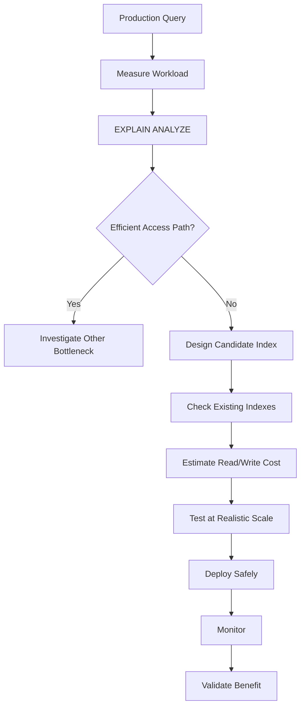

# 11- Under-Indexing

## Overview

Under-indexing occurs when important production queries lack an appropriate index or when the existing indexes do not match the workload.

The result is usually unnecessary database work:

```text
API request
    ↓
SQL query
    ↓
large sequential scan / inefficient join / expensive sort
    ↓
high CPU and I/O
    ↓
higher latency
    ↓
connection pool pressure
```

Under-indexing is especially dangerous as data grows. A query that is acceptable against 100,000 rows can become a production incident against 100 million rows.

However, the solution is not to index every column. The goal is to provide efficient access paths for important workloads while keeping index maintenance cost reasonable.

A senior engineer should think about indexing in terms of:

- Query patterns.
- Result cardinality.
- Selectivity.
- Join paths.
- Ordering.
- Pagination.
- Write workload.
- Data distribution.
- Concurrency.
- Operational cost.

---

## What Under-Indexing Looks Like

Typical symptoms include:

- Large sequential scans on large tables.
- High database CPU.
- High disk I/O.
- Increasing query latency as data grows.
- Expensive joins.
- Large sorts.
- Slow pagination.
- Lock durations increasing because transactions execute expensive queries.
- Database connection pools becoming saturated.
- Read replicas falling behind under heavy workload.
- Queries becoming progressively slower after data growth.

A typical problematic plan might contain:

```text
Seq Scan on orders
  Rows Removed by Filter: 49,900,000
```

for a query expected to return only a few rows.

That is a strong signal that an appropriate access path may be missing.

---

## Why Indexes Matter

Suppose:

```sql
SELECT *
FROM orders
WHERE customer_id = $1;
```

and:

```text
orders = 100 million rows
```

Without a suitable index, PostgreSQL may need to inspect a large portion of the table.

With:

```sql
CREATE INDEX orders_customer_id_idx
ON orders (customer_id);
```

the database can potentially locate matching rows through the index.

Conceptually:

```text
Without index:

100M rows
   ↓
scan
   ↓
evaluate customer_id
   ↓
return matching rows


With index:

customer_id index
   ↓
locate matching keys
   ↓
fetch matching rows
```

The improvement becomes increasingly important as the table grows and the predicate is selective.

---

## The Important Qualification

An index is an **access path**, not a command to the optimizer.

PostgreSQL may still choose:

```text
Seq Scan
```

even when an index exists.

Possible reasons include:

- The table is small.
- The predicate matches a large percentage of rows.
- The index is not selective.
- Statistics indicate another plan is cheaper.
- The query expression does not match the index.
- The result requires substantial additional work.
- The table/index is already cached.
- A different index provides a better plan.

Therefore:

> **Missing index is a hypothesis; `EXPLAIN (ANALYZE, BUFFERS)` provides evidence.**

---

## Selectivity

Selectivity describes how effectively a predicate narrows the candidate rows.

Consider:

```sql
WHERE id = $1
```

on a primary key.

Usually:

```text
1 row / 100M rows
```

This is highly selective.

Now consider:

```sql
WHERE status = 'completed'
```

where:

```text
95% of rows = completed
```

This predicate is much less selective.

An index is generally more attractive for highly selective predicates.

But selectivity is not the only consideration. Ordering, joins, index-only scans, partial indexes, and workload frequency also matter.

---

## Query Frequency Matters

A missing index on a query executed once per month may not matter.

A missing index on a query executed:

```text
20,000 times / second
```

can be catastrophic.

Consider:

```text
Query A:
50 ms × 1 request/minute

Query B:
50 ms × 20,000 requests/second
```

The second query consumes vastly more database resources.

Prioritize indexing based on workload impact, not simply query complexity.

---

## Finding Slow Queries

PostgreSQL deployments commonly use:

- `pg_stat_statements`.
- Application APM.
- Database monitoring.
- Slow-query logs.
- Query execution plans.

If `pg_stat_statements` is available, a workload review might begin with:

```sql
SELECT
    calls,
    total_exec_time,
    mean_exec_time,
    rows,
    query
FROM pg_stat_statements
ORDER BY total_exec_time DESC
LIMIT 20;
```

High total execution time can identify queries that deserve investigation.

A query with moderate latency but millions of calls may be more important than a single extremely slow administrative query.

---

## EXPLAIN and EXPLAIN ANALYZE

Use:

```sql
EXPLAIN (ANALYZE, BUFFERS)
SELECT *
FROM orders
WHERE customer_id = 42;
```

Inspect:

- Access method.
- Estimated rows.
- Actual rows.
- Shared buffer hits.
- Shared buffer reads.
- Execution time.
- Sorts.
- Join strategy.
- Rows removed by filters.

Typical access methods include:

```text
Seq Scan
Index Scan
Index Only Scan
Bitmap Index Scan
Bitmap Heap Scan
```

The goal is not:

```text
"Make every query use an index."
```

The goal is:

```text
"Make important queries use an efficient plan."
```

---

## Sequential Scan Is Not Automatically Bad

This query:

```sql
SELECT *
FROM orders
WHERE status = 'completed';
```

may legitimately use:

```text
Seq Scan
```

if most rows are completed.

An index would require PostgreSQL to find many matching index entries and potentially fetch a large portion of the table.

A sequential scan can be cheaper.

Therefore:

```text
Seq Scan
≠
Missing Index
```

Always evaluate:

```text
table size
+
selectivity
+
query frequency
+
actual cost
```

---

## Under-Indexing and Data Growth

A major production problem is indexing based on current data volume rather than expected growth.

Suppose:

```text
Year 1:
1 million orders
```

and:

```text
Year 5:
500 million orders
```

A query that was previously acceptable:

```sql
SELECT *
FROM orders
WHERE external_reference = $1;
```

may become unacceptable if `external_reference` lacks an appropriate index.

This is why performance testing should consider future scale rather than only today's dataset.

---

## Equality Lookups

A common high-value access pattern is:

```sql
WHERE external_reference = $1
```

If the value is expected to identify one order:

```sql
CREATE UNIQUE INDEX orders_external_reference_idx
ON orders (external_reference);
```

This provides both:

- Efficient lookup.
- Data integrity.

Whenever a business identifier is supposed to be unique, consider whether a unique constraint is more appropriate than a plain performance index.

---

## Foreign-Key Lookups

Suppose:

```sql
CREATE TABLE orders (
    id bigint PRIMARY KEY,
    customer_id bigint NOT NULL REFERENCES customers(id)
);
```

Queries such as:

```sql
SELECT *
FROM orders
WHERE customer_id = $1;
```

may require:

```sql
CREATE INDEX orders_customer_id_idx
ON orders (customer_id);
```

PostgreSQL does not automatically create an index on every foreign-key referencing column.

Such an index can also be important when deleting or updating referenced parent rows because PostgreSQL may need to check referencing rows efficiently.

---

## JOIN Performance

Consider:

```sql
SELECT
    o.id,
    o.total_amount
FROM customers AS c
JOIN orders AS o
    ON o.customer_id = c.id
WHERE c.id = $1;
```

If the database needs to locate orders for one customer, an index on:

```sql
orders(customer_id)
```

can provide an efficient access path.

But the exact plan depends on:

- Table sizes.
- Statistics.
- Join cardinality.
- Selectivity.
- Available indexes.

Never infer the final join strategy from SQL syntax alone.

---

## Composite Indexes

Suppose the workload frequently executes:

```sql
SELECT *
FROM orders
WHERE customer_id = $1
  AND status = $2;
```

A composite index may be more appropriate:

```sql
CREATE INDEX orders_customer_status_idx
ON orders (customer_id, status);
```

The order matters.

The index:

```text
(customer_id, status)
```

is naturally organized first by:

```text
customer_id
```

then:

```text
status
```

This can support queries involving the leading column and combinations of the indexed columns.

---

## Equality, Range, and Ordering

Consider:

```sql
SELECT
    id,
    created_at,
    total_amount
FROM orders
WHERE customer_id = $1
  AND status = $2
ORDER BY created_at DESC
LIMIT 50;
```

A potentially useful index is:

```sql
CREATE INDEX orders_customer_status_created_idx
ON orders (
    customer_id,
    status,
    created_at DESC
);
```

The index aligns with:

```text
customer_id equality
        ↓
status equality
        ↓
created_at ordering
        ↓
LIMIT
```

This can avoid unnecessary scanning and sorting for the target access pattern.

Index column order should be derived from the actual workload rather than memorized as a universal formula.

---

## Range Queries

For:

```sql
SELECT *
FROM orders
WHERE created_at >= $1
  AND created_at < $2;
```

an index on:

```sql
CREATE INDEX orders_created_at_idx
ON orders (created_at);
```

can provide an efficient range access path when the range is sufficiently selective.

This pattern is generally preferable to transforming the indexed timestamp:

```sql
WHERE created_at::date = $1
```

when a timestamp range can express the same requirement.

---

## ORDER BY Without an Appropriate Index

Consider:

```sql
SELECT
    id,
    created_at,
    total_amount
FROM orders
WHERE customer_id = $1
ORDER BY created_at DESC
LIMIT 50;
```

An index on:

```sql
(customer_id, created_at DESC)
```

may allow PostgreSQL to retrieve the required rows in the desired order.

Without a suitable ordering path, PostgreSQL may need to:

```text
find rows
   ↓
sort rows
   ↓
return first 50
```

For large candidate sets, the sort can become expensive.

---

## LIMIT Does Not Always Make a Query Cheap

Consider:

```sql
SELECT *
FROM orders
WHERE status = 'pending'
ORDER BY created_at
LIMIT 20;
```

The `LIMIT` is small, but without an efficient access path PostgreSQL may still need to examine and sort many rows to determine which 20 are the earliest.

A targeted index such as:

```sql
CREATE INDEX orders_pending_created_idx
ON orders (created_at, id)
WHERE status = 'pending';
```

may provide a much better access path when pending rows are a small subset.

---

## Pagination

Offset pagination becomes increasingly expensive:

```sql
SELECT *
FROM orders
ORDER BY created_at DESC
LIMIT 50
OFFSET 1000000;
```

The database may still need to process and discard a large number of rows.

Keyset pagination can align better with an index:

```sql
SELECT
    id,
    created_at,
    total_amount
FROM orders
WHERE (created_at, id) < ($1, $2)
ORDER BY created_at DESC, id DESC
LIMIT 50;
```

with:

```sql
CREATE INDEX orders_created_id_idx
ON orders (created_at DESC, id DESC);
```

For large APIs, query shape and index design should be considered together.

---

## Partial Indexes

Under-indexing does not always mean adding a full-table index.

Suppose:

```text
orders = 500 million
pending = 1 million
```

and the workload repeatedly processes pending orders.

Instead of:

```sql
CREATE INDEX orders_status_created_idx
ON orders (status, created_at);
```

a partial index may be more targeted:

```sql
CREATE INDEX orders_pending_created_idx
ON orders (created_at, id)
WHERE status = 'pending';
```

This can reduce index size and maintenance cost while directly supporting the workload.

---

## Soft Deletes

Applications commonly use:

```sql
deleted_at
```

for soft deletion.

A query might be:

```sql
SELECT *
FROM users
WHERE deleted_at IS NULL
  AND email = $1;
```

A broad index on:

```sql
email
```

may already be sufficient.

But if active rows represent a specific and important workload, a partial index can be considered:

```sql
CREATE UNIQUE INDEX users_active_email_idx
ON users (email)
WHERE deleted_at IS NULL;
```

This can also encode an important business rule:

```text
Only active users must have unique email addresses.
```

The exact constraint semantics should be deliberate.

---

## Multi-Tenant Systems

Consider:

```sql
SELECT *
FROM orders
WHERE tenant_id = $1
  AND customer_id = $2
  AND status = $3;
```

A multi-tenant workload often benefits from indexes that reflect tenant boundaries:

```sql
CREATE INDEX orders_tenant_customer_status_idx
ON orders (tenant_id, customer_id, status);
```

Whether `tenant_id` should lead the index depends on:

- Tenant isolation strategy.
- Query patterns.
- Tenant size distribution.
- Skew.
- Other predicates.
- Partitioning strategy.

Do not blindly put `tenant_id` first in every index.

But in many shared-schema SaaS systems, tenant-aware access paths are important.

---

## Large Tenant Skew

Suppose:

```text
Tenant A = 60% of all rows
Tenant B = 0.01%
Tenant C = 0.01%
...
```

An index beginning with:

```text
tenant_id
```

may behave differently across tenants.

The planner's estimates and data distribution matter.

For very large tenants, a query may still touch substantial data even with a tenant-aware index.

At higher scale, consider whether:

- Partitioning.
- Tenant-specific data placement.
- Archival.
- Dedicated databases.
- Sharding.

are appropriate.

Indexing is not a substitute for an architecture that cannot support the data volume.

---

## Indexing OR Predicates

Consider:

```sql
SELECT *
FROM users
WHERE email = $1
   OR phone = $2;
```

Separate indexes may be useful:

```sql
CREATE INDEX users_email_idx
ON users (email);

CREATE INDEX users_phone_idx
ON users (phone);
```

PostgreSQL may combine indexes through bitmap strategies depending on cost.

But a query using `OR` can also become expensive depending on selectivity and result size.

Do not assume one composite index:

```text
(email, phone)
```

is automatically equivalent to two independent indexes for this query.

---

## Indexing NULL Predicates

Queries such as:

```sql
WHERE processed_at IS NULL
```

can be important in job-processing systems.

If only a small portion of rows are unprocessed, a partial index may be appropriate:

```sql
CREATE INDEX jobs_unprocessed_idx
ON jobs (created_at, id)
WHERE processed_at IS NULL;
```

This can support queue-like workloads more efficiently than indexing the entire table.

---

## Queue Workloads

A Celery-style database-backed queue may use:

```sql
SELECT id
FROM jobs
WHERE status = 'pending'
ORDER BY created_at, id
LIMIT 100;
```

A suitable partial index:

```sql
CREATE INDEX jobs_pending_created_idx
ON jobs (created_at, id)
WHERE status = 'pending';
```

can make finding pending work much cheaper.

For concurrent workers, the complete design may also use:

```sql
FOR UPDATE SKIP LOCKED
```

with careful transaction boundaries.

Indexing helps locate work; it does not by itself solve concurrency correctness.

---

## Aggregate Queries

Indexes can sometimes help aggregation indirectly by reducing the input rows.

For example:

```sql
SELECT
    customer_id,
    SUM(total_amount)
FROM orders
WHERE created_at >= $1
GROUP BY customer_id;
```

An index on:

```sql
created_at
```

may help when the date range is selective.

An index on:

```sql
(customer_id, created_at)
```

may support other workload shapes.

Do not assume that an index automatically makes `GROUP BY` fast.

Aggregation still has costs:

- Hash aggregation.
- Sorting.
- Memory.
- CPU.
- Large intermediate result sets.

---

## Window Functions

Consider:

```sql
SELECT
    id,
    customer_id,
    created_at,
    ROW_NUMBER() OVER (
        PARTITION BY customer_id
        ORDER BY created_at DESC
    ) AS rn
FROM orders;
```

A potentially useful index may align with:

```text
customer_id
created_at
```

but PostgreSQL may still need to perform additional work.

Window functions are not simply "index lookups."

Use:

```sql
EXPLAIN (ANALYZE, BUFFERS)
```

to determine whether an index materially improves the plan.

---

## Functions on Indexed Columns

Under-indexing can also occur when an index exists but does not match the query expression.

For example:

```sql
CREATE INDEX users_email_idx
ON users (email);
```

and:

```sql
WHERE LOWER(email) = $1;
```

The ordinary index is not necessarily an efficient match for the transformed expression.

Possible solutions include:

```sql
CREATE INDEX users_lower_email_idx
ON users (LOWER(email));
```

or redesigning the stored representation/query.

The important principle is:

> **An index must match the access pattern, not merely the existence of the underlying column.**

---

## Type Mismatches

Avoid unnecessarily transforming indexed columns:

```sql
WHERE customer_id::text = $1;
```

when the intended comparison is numeric.

Prefer:

```sql
WHERE customer_id = $1::bigint;
```

or, better, pass a correctly typed application parameter.

Type mismatches can affect index usability, correctness, and query planning.

---

## Index-Only Scans

Sometimes under-indexing can cause unnecessary table access.

For example:

```sql
SELECT customer_id, created_at
FROM orders
WHERE customer_id = $1;
```

An appropriately designed index may allow an index-only scan under suitable visibility conditions.

For example:

```sql
CREATE INDEX orders_customer_created_idx
ON orders (customer_id, created_at);
```

However, the presence of the index does not guarantee:

```text
Index Only Scan
```

PostgreSQL's visibility map and query plan matter.

---

## Covering Indexes

PostgreSQL supports included columns:

```sql
CREATE INDEX orders_customer_created_idx
ON orders (customer_id, created_at DESC)
INCLUDE (status, total_amount);
```

This can support queries that need those values without making them part of the index's search/order keys.

However:

```text
covering index
```

does not mean:

```text
free extra columns
```

Included columns increase index size and write maintenance.

Use them for measured, important workloads.

---

## Under-Indexing and Connection Pools

A slow query consumes a database connection for longer.

Consider:

```text
20 database connections
        ↓
20 expensive queries
        ↓
connections occupied
        ↓
new requests wait
        ↓
API latency increases
```

The application may report:

```text
"Database pool exhausted"
```

even though the root cause is a missing or inefficient database access path.

Do not solve every pool saturation problem by increasing pool size.

First investigate query latency and database resource consumption.

---

## Under-Indexing and Concurrency

Expensive queries can increase lock duration indirectly.

For example:

```text
Transaction begins
    ↓
expensive query
    ↓
application performs update
    ↓
transaction commits
```

The longer transaction duration may mean locks are held longer.

This can create:

```text
slow query
   ↓
longer transaction
   ↓
more lock contention
   ↓
more waiting
   ↓
higher latency
```

Index optimization can therefore improve concurrency indirectly.

---

## Under-Indexing and Deadlocks

Indexes do not prevent deadlocks.

However, expensive queries can extend transaction duration and increase the time during which locks are held.

A database with poor access paths can therefore amplify an existing concurrency problem.

The solution to a deadlock remains:

- Consistent lock ordering.
- Short transactions.
- Appropriate isolation.
- Correct retry handling.
- Concurrency-aware application design.

Do not claim that "adding an index fixes deadlocks."

---

## Read Replicas

Read-heavy systems commonly use:

```text
Application
    ↓
Primary ─────→ Read Replicas
```

Under-indexed read queries may consume significant resources on replicas.

A read replica can scale read capacity, but it does not make an inefficient query efficient.

If the same expensive query executes across several replicas, the workload may simply be distributed rather than eliminated.

Optimize the access path first.

---

## High Availability

In PostgreSQL HA architectures, indexes exist on primary and replicas.

A missing index can therefore affect:

- Primary performance.
- Replica performance.
- Failover capacity.
- Recovery time.
- Application latency after failover.

A replica should not be considered healthy simply because replication is caught up.

It must also have sufficient capacity to execute the production read workload after promotion.

---

## AWS Considerations

On AWS PostgreSQL deployments such as RDS or Aurora, under-indexing can manifest as:

- High CPU.
- High read I/O.
- Increased database latency.
- Increased connection usage.
- Poor replica performance.
- Increased instance sizing requirements.

Metrics such as:

- CPU utilization.
- Read IOPS.
- Database connections.
- Read latency.
- Replica lag.

can help identify database pressure.

However, infrastructure metrics should lead to query investigation, not replace it.

---

## Security and Availability

An under-indexed endpoint can become an availability risk.

Consider:

```text
Public API
    ↓
user-controlled search
    ↓
unindexed query
    ↓
large scan
    ↓
high database CPU
```

An attacker does not necessarily need SQL injection to cause database resource exhaustion.

Mitigations include:

- Appropriate indexing.
- Pagination.
- Query limits.
- Rate limiting.
- Authentication where appropriate.
- Query timeouts.
- Input validation.
- Search-specific architecture for high-volume workloads.

Indexing is one component of defensive database design.

---

## Search Workloads

Do not assume a normal B-tree index solves every search problem.

For:

```sql
WHERE name LIKE '%john%'
```

a normal B-tree index generally cannot efficiently support an arbitrary leading-wildcard search.

Depending on requirements, alternatives may include:

- PostgreSQL trigram indexes.
- Full-text search.
- Dedicated search infrastructure.
- Search-specific denormalization.

For example, PostgreSQL's `pg_trgm` extension can support trigram-based similarity and pattern-search workloads.

The correct index type depends on the operator and access pattern.

---

## JSONB Workloads

Consider:

```sql
SELECT *
FROM events
WHERE payload @> '{"type": "payment"}';
```

A GIN index may be appropriate:

```sql
CREATE INDEX events_payload_gin_idx
ON events
USING GIN (payload);
```

For:

```sql
WHERE payload->>'customer_id' = $1
```

a targeted expression index may be more appropriate:

```sql
CREATE INDEX events_customer_id_idx
ON events ((payload->>'customer_id'));
```

Under-indexing must therefore be analyzed at the operator/expression level, not merely at the column level.

---

## Partitioning Is Not Indexing

Partitioning can reduce the amount of data considered by a query through partition pruning.

For example:

```text
orders
 ├── orders_2026_07
 ├── orders_2026_08
 └── orders_2026_09
```

A query restricted to September may avoid scanning older partitions.

But partitioning does not eliminate the need for appropriate indexes inside partitions.

Use:

```text
partitioning
+
appropriate indexes
```

when the workload requires both data pruning and efficient access within the selected partitions.

---

## When Not to Add an Index

Do not automatically add an index when:

- The table is tiny.
- The query is rarely executed.
- The predicate returns most rows.
- The workload is already fast.
- The query is dominated by external I/O.
- The bottleneck is application-side processing.
- The index would create excessive write overhead.
- Another index already supports the access path.

The objective is not maximum index count.

---

## Index Cost vs Query Benefit

A useful mental model is:

```text
Index value =
    query frequency
  × latency/resource savings
  × business importance

Index cost =
    storage
  + write amplification
  + WAL
  + maintenance
  + cache pressure
  + operational complexity
```

An index is justified when its long-term value exceeds its cost.

This is not a literal database formula, but it is a useful engineering decision framework.

---

## Monitoring for Under-Indexing

Monitor:

### Query Metrics

- P50 latency.
- P95 latency.
- P99 latency.
- Calls per second.
- Total execution time.
- Rows returned.
- Rows examined.

### Database Metrics

- CPU.
- Read IOPS.
- Buffer reads.
- Cache hit ratio.
- Active connections.
- Lock waits.
- Temporary file usage.
- Replica lag.

### Query Plan Indicators

Look for:

- Large sequential scans.
- High rows removed by filter.
- Large sorts.
- Bad row estimates.
- Expensive nested loops.
- Repeated scans of large relations.
- Excessive heap fetches.

Monitoring should identify workloads requiring investigation, not automatically generate indexes.

---

## Production Indexing Workflow

A disciplined process looks like:



This avoids both extremes:

```text
No indexes
```

and:

```text
Index everything
```

---

## Index Deployment

For a large PostgreSQL table:

```sql
CREATE INDEX CONCURRENTLY orders_customer_status_idx
ON orders (customer_id, status);
```

Concurrent index creation can reduce blocking of normal writes.

However, it:

- Takes longer.
- Uses additional resources.
- Has transaction restrictions.
- Requires operational planning.
- Can leave an invalid index if creation fails.

Do not treat `CREATE INDEX CONCURRENTLY` as risk-free.

---

## Migration Considerations

Index creation should be treated as a production database change.

Before deployment:

- Check table size.
- Check write rate.
- Check storage headroom.
- Check replica capacity.
- Estimate build duration.
- Test migration behavior.
- Ensure migration tooling handles transaction restrictions.
- Schedule around operational risk.

After deployment:

```sql
EXPLAIN (ANALYZE, BUFFERS)
...
```

should be used to confirm that the intended workload actually benefits.

---

## Indexes and CI/CD

ORM migrations make index creation easy to commit:

```python
class Meta:
    indexes = [
        models.Index(
            fields=["customer_id", "status"],
            name="orders_customer_status_idx",
        ),
    ]
```

But production database engineering requires more than committing the migration.

The deployment pipeline should consider:

```text
Code change
   ↓
Migration
   ↓
Index build
   ↓
Production query plan
   ↓
Runtime metrics
```

Schema migrations should be reviewed alongside the queries that motivated them.

---

## Reliability and Disaster Recovery

An under-indexed database may require larger database instances simply to handle inefficient workloads.

That can increase infrastructure cost and reduce operational efficiency.

Appropriate indexing can:

- Reduce CPU.
- Reduce I/O.
- Lower latency.
- Improve connection utilization.
- Increase headroom during traffic spikes.

But indexes are not a substitute for:

- Backups.
- Point-in-time recovery.
- Replication.
- Failover.
- Capacity planning.

A performant database still requires a complete HA/DR strategy.

---

## Common Mistakes

### Mistake: Adding an Index Without Checking the Plan

Do not assume:

```sql
CREATE INDEX ...
```

automatically fixes the problem.

Run:

```sql
EXPLAIN (ANALYZE, BUFFERS)
```

before and after.

---

### Mistake: Indexing Every WHERE Column

A query like:

```sql
WHERE customer_id = $1
  AND status = $2
  AND country = $3
  AND created_at >= $4
```

does not necessarily require:

```text
index(customer_id)
index(status)
index(country)
index(created_at)
index(customer_id,status)
index(customer_id,country)
...
```

Analyze actual workload patterns.

---

### Mistake: Ignoring ORDER BY

An index may need to support both filtering and ordering.

For:

```sql
WHERE customer_id = $1
ORDER BY created_at DESC
LIMIT 50
```

the useful index may be:

```sql
(customer_id, created_at DESC)
```

rather than:

```sql
(customer_id)
```

---

### Mistake: Ignoring Pagination

An endpoint can appear fast with:

```text
page 1
```

and become extremely slow with:

```text
page 10,000
```

Index design should consider the pagination strategy.

---

### Mistake: Assuming a Foreign Key Has an Index

PostgreSQL does not automatically create an index on the referencing column just because a foreign key exists.

Review child-table access patterns explicitly.

---

### Mistake: Solving Everything With More Hardware

Scaling:

```text
4 CPU → 16 CPU
```

may temporarily hide an inefficient query.

If the query scans hundreds of millions of rows unnecessarily, a better access path may provide a much more durable improvement.

---

### Mistake: Using Redis as a Substitute for Database Indexing

Caching may reduce repeated database queries, but it introduces:

- Staleness.
- Invalidation.
- Additional infrastructure.
- Failure modes.

Fix the database access path when the database is the source of truth and the query is fundamental to correctness.

---

## Troubleshooting Checklist

When a query appears under-indexed:

- [ ] Identify the exact production query.
- [ ] Measure frequency and latency.
- [ ] Run `EXPLAIN (ANALYZE, BUFFERS)`.
- [ ] Check table size.
- [ ] Check estimated vs actual rows.
- [ ] Check existing indexes.
- [ ] Check selectivity.
- [ ] Check joins.
- [ ] Check sorting.
- [ ] Check pagination.
- [ ] Check functions/casts on indexed columns.
- [ ] Check whether a partial index is appropriate.
- [ ] Check write volume.
- [ ] Estimate index storage.
- [ ] Test at production-like scale.
- [ ] Deploy safely.
- [ ] Verify the new plan.
- [ ] Monitor database and application metrics.

---

## Senior Decision Framework

When deciding whether a missing index should be added, ask:

### Workload

- How frequently does the query execute?
- Is it latency-sensitive?
- Is it customer-facing?
- Is it part of a critical background workflow?

### Data

- How large is the table?
- How selective is the predicate?
- How skewed is the data?
- How quickly is the table growing?

### Access Path

- Is filtering the primary operation?
- Is ordering required?
- Is pagination involved?
- Is it a join?
- Is it an aggregate?
- Is it a window query?
- Is a function applied to the column?

### Cost

- How large will the index be?
- What is the write rate?
- What is the update rate?
- What is the WAL impact?
- What is the replication impact?

### Operations

- Can the index be deployed safely?
- Is `CREATE INDEX CONCURRENTLY` appropriate?
- Is there enough storage?
- What happens during failover?
- How will the benefit be monitored?

---

## Decision Matrix

| Workload | Likely approach |
|---|---|
| Highly selective equality lookup | B-tree index |
| Unique business identifier | Unique index/constraint |
| Foreign-key child lookup | Index referencing column when workload requires it |
| Equality + equality | Composite index based on workload |
| Equality + range | Composite index with deliberate column order |
| Filtering + ordering | Composite index aligned with access pattern |
| Active subset only | Partial index |
| Large offset pagination | Prefer keyset pagination + aligned index |
| Prefix search | B-tree strategy depending on pattern/collation |
| Leading-wildcard search | Trigram/full-text/search system depending on requirement |
| JSONB containment | GIN where appropriate |
| Specific JSON scalar lookup | Expression index or dedicated column |
| Function-based lookup | Expression index or query/data redesign |
| Large historical table | Consider partitioning in addition to indexes |
| Low-selectivity predicate | Validate plan before adding index |
| Tiny table | Sequential scan may be optimal |
| Write-heavy workload | Add only high-value indexes |

---

## Interview Traps

### Does every slow query indicate a missing index?

No.

The problem may be:

- Bad SQL.
- Incorrect join cardinality.
- Large result sets.
- Poor pagination.
- Aggregation.
- Sorting.
- Stale statistics.
- Lock contention.
- Connection saturation.
- Application-side processing.

### Is a sequential scan evidence of under-indexing?

No.

Sequential scans can be optimal for small tables or low-selectivity queries.

### Should every foreign key have an index?

Not automatically, but indexes on referencing columns are often valuable for child lookups and referential actions on large tables.

### Does an index always make a query faster?

No.

Indexes have overhead and may be slower than sequential access for queries returning many rows.

### Why might a query with `LIMIT 10` still be slow?

The database may need to scan or sort many candidate rows before determining the correct 10 rows.

An index aligned with filtering and ordering can sometimes eliminate that work.

### Is one index per column better than a composite index?

Not necessarily.

The correct choice depends on the query workload and access patterns.

### Can Redis solve under-indexing?

It can reduce repeated database access for cacheable workloads, but it does not replace correct database indexing.

### What is the best evidence that an index is needed?

A production-important query with measured resource consumption and an execution plan showing an inefficient access path that a candidate index can materially improve.

## Key Takeaways

- **Under-indexing causes important queries to perform unnecessary scans, joins, sorts, or heap work; the impact becomes more severe as data volume and request concurrency grow.**
- **Index decisions should be driven by real workload evidence: query frequency, selectivity, result cardinality, ordering, joins, pagination, and data growth—not simply by the presence of a `WHERE` clause.**
- **`EXPLAIN (ANALYZE, BUFFERS)` is the primary tool for validating whether an access path is actually inefficient and whether a candidate index improves it.**
- **Composite, partial, expression, and covering indexes can provide targeted access paths, but their storage, write, WAL, replication, and maintenance costs must be evaluated.**
- **Treat under-indexing as a production performance and reliability concern: optimize important access paths, deploy indexes safely, and validate their impact through both query plans and application/database metrics.**