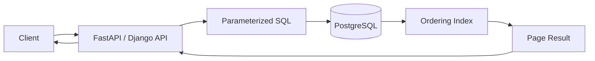
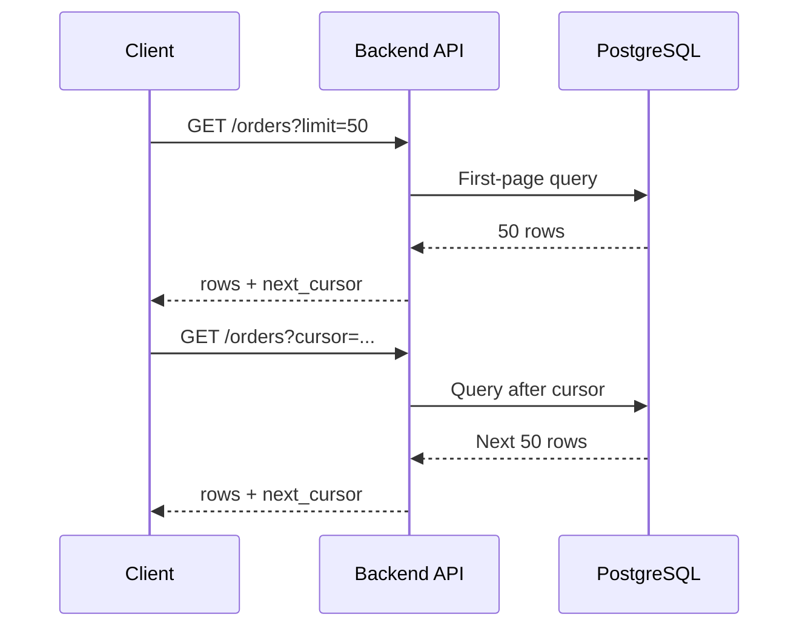

# 12- OFFSET Pagination at Scale

## Overview

OFFSET pagination is a simple way to divide a large ordered result set into pages:

```sql
SELECT
    id,
    created_at,
    total_amount
FROM orders
ORDER BY created_at DESC
LIMIT 50
OFFSET 1000;
```

The database returns 50 rows after skipping the first 1,000 rows.

This works well for small datasets and low page numbers. At scale, however, large offsets can become expensive because the database generally still has to locate, process, and discard the preceding rows before returning the requested page.

The problem becomes more significant when:

- Tables contain millions or billions of rows.
- Users can navigate to deep pages.
- APIs receive arbitrary page numbers.
- Queries include joins or expensive filtering.
- Multiple users request deep pages concurrently.
- The ordering column is not supported by an appropriate index.

A senior backend engineer should evaluate pagination as a combination of:

```text
Pagination strategy
+
Query shape
+
Index design
+
Data consistency
+
API contract
+
Workload characteristics
```

---

## What OFFSET Pagination Is

The basic pattern is:

```sql
SELECT *
FROM orders
ORDER BY created_at DESC
LIMIT 50
OFFSET 1000;
```

The semantics are:

```text
OFFSET 1000
    ↓
skip first 1,000 matching rows

LIMIT 50
    ↓
return next 50 rows
```

For page-based APIs:

```text
page_size = 50

page 1 → OFFSET 0
page 2 → OFFSET 50
page 3 → OFFSET 100
page 4 → OFFSET 150
...
page 10000 → OFFSET 499950
```

The SQL remains simple, which is one reason OFFSET pagination is widely used.

---

## Why OFFSET Exists

OFFSET provides a convenient abstraction for user interfaces that think in terms of pages:

```text
Page 1
Page 2
Page 3
...
Page 100
```

It works naturally with:

- Administrative dashboards.
- Reporting interfaces.
- Internal tools.
- Small datasets.
- Search results where deep pagination is uncommon.

It is also easy to implement in Django, SQLAlchemy, and other ORM systems.

---

## Basic Backend Example

A FastAPI endpoint might expose:

```text
GET /orders?page=3&page_size=50
```

The application translates this to:

```text
offset = (page - 1) × page_size
```

For:

```text
page = 3
page_size = 50
```

the query becomes conceptually:

```sql
LIMIT 50
OFFSET 100
```

A Django-style implementation might use:

```python
from django.core.paginator import Paginator

orders = Order.objects.order_by("-created_at", "-id")

paginator = Paginator(orders, per_page=50)
page = paginator.get_page(page_number)
```

The ORM abstraction is convenient, but it does not remove the underlying database cost.

---

## How PostgreSQL Processes a Deep OFFSET

Consider:

```sql
SELECT
    id,
    created_at
FROM orders
ORDER BY created_at DESC, id DESC
LIMIT 50
OFFSET 500000;
```

Conceptually, the database must identify the ordered result set and advance through the first 500,000 qualifying rows before returning the next 50.

With a suitable index, this may be much cheaper than scanning the entire table, but the database still has to advance through the offset portion.

Conceptually:

```text
Index / execution plan
        ↓
row 1
row 2
row 3
...
row 500000   ← skipped
row 500001
...
row 500050    ← returned
```

The key problem is:

> `LIMIT` reduces the number of rows returned, but a large `OFFSET` does not eliminate the work required to reach those rows.

---

## Why Large OFFSET Becomes Expensive

Consider:

```sql
LIMIT 50 OFFSET 10;
```

Only a small number of rows need to be skipped.

Now compare:

```sql
LIMIT 50 OFFSET 10_000_000;
```

The database may need to process a very large number of rows before it can return the requested 50.

As the offset grows:

```text
Page depth ↑
     ↓
Rows traversed ↑
     ↓
Database work ↑
     ↓
Latency ↑
     ↓
CPU / I/O pressure ↑
```

The exact complexity depends on the query and execution plan, so OFFSET should not be described as universally equivalent to a full table scan.

---

## Indexes Help, But Do Not Eliminate OFFSET Cost

Consider:

```sql
CREATE INDEX orders_created_id_idx
ON orders (created_at DESC, id DESC);
```

and:

```sql
SELECT
    id,
    created_at,
    total_amount
FROM orders
ORDER BY created_at DESC, id DESC
LIMIT 50
OFFSET 500000;
```

The index can provide the requested ordering efficiently.

However, PostgreSQL may still need to walk through approximately 500,000 index entries before producing the requested 50 rows.

Therefore:

```text
Good index
    ≠
zero-cost deep OFFSET
```

The index changes the cost of finding and ordering rows, but OFFSET still represents skipped work.

---

## OFFSET vs Keyset Pagination

The fundamental alternative is keyset pagination, also called cursor pagination or seek pagination.

### OFFSET

```sql
SELECT *
FROM orders
ORDER BY created_at DESC, id DESC
LIMIT 50
OFFSET 500000;
```

### Keyset

```sql
SELECT *
FROM orders
WHERE (created_at, id) < ($1, $2)
ORDER BY created_at DESC, id DESC
LIMIT 50;
```

The keyset query tells PostgreSQL where to continue rather than asking it to count through all previous rows.

Conceptually:

```text
OFFSET:

start
 ↓
skip 500,000 rows
 ↓
return 50


Keyset:

cursor
 ↓
seek to cursor position
 ↓
return next 50
```

For large datasets and deep pagination, this distinction is significant.

---

## A Production Pagination Architecture



With OFFSET:

```text
Client
  ↓
page=10000
  ↓
API
  ↓
LIMIT 50 OFFSET 499950
  ↓
PostgreSQL traverses preceding rows
  ↓
returns page
```

With keyset pagination:

```text
Client
  ↓
cursor=(created_at,id)
  ↓
API
  ↓
WHERE ordering_key < cursor
  ↓
PostgreSQL seeks through index
  ↓
returns next page
```

---

## Deterministic Ordering Is Mandatory

Pagination requires a stable ordering.

Avoid:

```sql
ORDER BY created_at DESC
```

when `created_at` is not unique.

Multiple rows can have the same timestamp.

Prefer:

```sql
ORDER BY created_at DESC, id DESC;
```

where `id` provides a deterministic tie-breaker.

The ordering used by the pagination strategy must be consistent with the index and cursor semantics.

---

## Why the Tie-Breaker Matters

Suppose:

```text
id | created_at
---+-------------------
10 | 2026-09-05 10:00
11 | 2026-09-05 10:00
12 | 2026-09-05 09:59
```

Ordering only by:

```sql
ORDER BY created_at DESC
```

does not fully define the relative ordering of IDs 10 and 11.

A stable ordering:

```sql
ORDER BY created_at DESC, id DESC;
```

creates:

```text
11
10
12
```

This is especially important for keyset cursors because the cursor must identify an exact position in the ordered sequence.

---

## Correct Keyset Query

For descending order:

```sql
SELECT
    id,
    created_at,
    total_amount
FROM orders
WHERE (created_at, id) < ($1, $2)
ORDER BY created_at DESC, id DESC
LIMIT 50;
```

Index:

```sql
CREATE INDEX orders_created_id_idx
ON orders (created_at DESC, id DESC);
```

The cursor contains:

```text
created_at
id
```

from the last row returned by the previous page.

---

## Cursor Flow



The client does not need to understand the underlying database ordering.

---

## Cursor Design

A cursor should normally contain the values required to resume the ordered query.

For:

```sql
ORDER BY created_at DESC, id DESC
```

the cursor could represent:

```json
{
  "created_at": "2026-09-05T10:15:30Z",
  "id": 981234
}
```

Production APIs commonly encode and protect this representation.

A cursor may be:

- Base64-encoded.
- Signed.
- Opaque.
- Versioned.

Base64 alone is not encryption.

If cursor contents expose sensitive information, do not assume encoding provides confidentiality.

---

## Opaque Cursor Example

A response might look like:

```json
{
  "items": [
    {
      "id": 981235,
      "total_amount": "125.00"
    }
  ],
  "next_cursor": "eyJ2IjoxLCJjcmVhdGVkX2F0Ijoi... "
}
```

The client only needs to send:

```text
GET /orders?cursor=...
```

The server owns the cursor format.

This allows the implementation to evolve without making database-specific details part of the public API contract.

---

## Cursor Integrity

If clients can modify cursor values, they may attempt:

```text
cursor manipulation
    ↓
unexpected query position
    ↓
data probing / invalid requests
```

For sensitive APIs, consider signing cursors.

A signed cursor can protect against modification:

```text
payload + signature
```

The server verifies the signature before using the decoded values.

This protects integrity, not necessarily confidentiality.

---

## Page Size Limits

Never blindly trust:

```text
?page_size=1000000
```

A production API should enforce a maximum:

```python
page_size = min(requested_page_size, 100)
```

Typical API policy:

```text
default page size = 50
maximum page size = 100
```

The exact values should be based on workload and response size.

Pagination protects the database only when both page size and query execution are controlled.

---

## OFFSET Page Size and Deep Pages

There are two independent variables:

```text
page size
+
page depth
```

For:

```text
LIMIT 50 OFFSET 5,000,000
```

the result is small but the offset is enormous.

For:

```text
LIMIT 100,000 OFFSET 0
```

the offset is cheap but the result itself may be expensive.

Production pagination should control both.

---

## API Rate Limiting

Pagination endpoints can be abused through repeated deep-page requests:

```text
/page=10000
/page=10001
/page=10002
...
```

Even without SQL injection, an expensive query can become a resource-exhaustion vector.

Use appropriate:

- Authentication.
- Authorization.
- Rate limiting.
- Maximum page size.
- Maximum page depth where appropriate.
- Query timeouts.
- Request budgets.

---

## When OFFSET Is Appropriate

OFFSET is often reasonable for:

| Scenario | OFFSET suitability |
|---|---|
| Small table | Good |
| Internal admin UI | Often good |
| Low page numbers | Good |
| Reporting interface | Often good |
| Search with shallow pagination | Often good |
| Arbitrary page navigation | Convenient |
| Millions of rows | Requires validation |
| Deep pagination | Poor fit |
| Infinite scrolling | Usually poor fit |
| High-throughput API | Often prefer keyset |
| Mobile feed | Usually prefer cursor |
| Event stream | Usually prefer cursor |

OFFSET is not inherently an anti-pattern.

The anti-pattern is using it blindly at large scale.

---

## When OFFSET Is Particularly Problematic

Be cautious when:

- Users can request arbitrary page numbers.
- Data contains millions of rows.
- Queries are executed frequently.
- Results are ordered by a large dataset.
- Multiple joins are involved.
- Deep pagination is common.
- The endpoint is latency-sensitive.
- The database is already CPU/I/O constrained.

---

## OFFSET and Joins

Consider:

```sql
SELECT
    o.id,
    c.email,
    o.total_amount
FROM orders AS o
JOIN customers AS c
    ON c.id = o.customer_id
ORDER BY o.created_at DESC, o.id DESC
LIMIT 50
OFFSET 500000;
```

The cost is not simply:

```text
500000 rows
```

The execution plan may involve:

- Scanning orders.
- Joining customers.
- Sorting.
- Processing skipped rows.
- Fetching columns.
- Materializing intermediate results.

Deep OFFSET can therefore amplify the cost of already-complex queries.

---

## Paginate the Correct Entity

A common mistake is applying pagination after a join that changes row cardinality.

For example:

```text
orders
  ↓
order_items
```

One order can have many items.

A naive query may produce:

```text
order 1 → item 1
order 1 → item 2
order 1 → item 3
```

Pagination then operates on joined rows rather than logical orders.

If the API represents orders, pagination should preserve the order-level grain.

Possible strategies include:

- Paginating orders first.
- Aggregating items.
- Using separate queries.
- Using appropriate joins and result shaping.

Always define the pagination grain before optimizing the SQL.

---

## OFFSET with DISTINCT

Consider:

```sql
SELECT DISTINCT o.id
FROM orders AS o
JOIN order_items AS oi
    ON oi.order_id = o.id
ORDER BY o.id DESC
LIMIT 50
OFFSET 100000;
```

The database may need to perform duplicate elimination before it can determine the requested page.

This can be expensive.

If the query's purpose is existence rather than row multiplication, consider whether `EXISTS` is a better formulation.

Pagination should not hide an underlying cardinality problem.

---

## OFFSET with GROUP BY

Consider:

```sql
SELECT
    customer_id,
    SUM(total_amount) AS revenue
FROM orders
GROUP BY customer_id
ORDER BY revenue DESC
LIMIT 50
OFFSET 100000;
```

The database may need to:

```text
scan orders
    ↓
aggregate
    ↓
sort/group result
    ↓
skip 100,000 groups
    ↓
return 50
```

Keyset pagination is more complicated for computed orderings like:

```sql
ORDER BY revenue DESC
```

because the cursor needs a deterministic representation of the ordering.

This is one reason cursor pagination is not automatically a drop-in replacement for every OFFSET query.

---

## Pagination by Computed Values

Suppose:

```sql
ORDER BY total_amount DESC, id DESC
```

where `total_amount` is stored.

A cursor can contain:

```text
(total_amount, id)
```

But if the ordering is:

```sql
ORDER BY SUM(order_items.price) DESC
```

the cursor requires the computed aggregate value and deterministic tie-breaker.

The query architecture may need to change.

At scale, consider whether a precomputed read model or materialized representation is appropriate.

---

## Consistency Problems With OFFSET

OFFSET pagination can produce surprising results when rows are inserted or deleted between requests.

Suppose page 1 returns:

```text
A
B
C
D
E
```

Then a new row `X` appears at the beginning.

A request for:

```text
OFFSET 5
```

may now return:

```text
E
F
G
H
I
```

depending on ordering.

Rows can therefore appear on multiple pages or be skipped.

---

## Deletions Cause Similar Problems

Suppose:

```text
A B C D E F G H
```

Page 1:

```text
A B C D
```

Then `B` is deleted.

Page 2:

```sql
OFFSET 4
```

now starts from a different position:

```text
F G H
```

`E` may be skipped.

This is a fundamental weakness of position-based pagination over mutable datasets.

---

## Keyset Stability

Keyset pagination also operates over changing data, but it identifies a position by values rather than by the number of rows skipped.

For example:

```sql
WHERE (created_at, id) < ($cursor_created_at, $cursor_id)
```

New rows inserted before the cursor do not shift the cursor's position.

This makes keyset pagination particularly suitable for:

- Feeds.
- Event timelines.
- Audit logs.
- High-volume APIs.
- Continuously changing datasets.

It does not automatically provide a repeatable snapshot across all pages.

---

## Snapshot Consistency

Neither ordinary OFFSET nor ordinary keyset pagination guarantees that all pages represent one immutable database snapshot.

If a client requires a consistent snapshot across a long-running export, a different architecture may be necessary.

Possible approaches include:

- Transactional snapshot.
- Export job.
- Materialized result.
- Versioned dataset.
- Dedicated reporting database.

Holding one database transaction open across many HTTP requests is generally a poor design because it can create long-lived snapshots and resource pressure.

---

## Counting Total Pages

OFFSET pagination often encourages:

```sql
SELECT COUNT(*)
FROM orders;
```

followed by:

```text
total_pages = ceil(total_rows / page_size)
```

For large datasets, exact counts can themselves become expensive depending on the query and database state.

Do not automatically run an expensive exact `COUNT(*)` on every paginated API request.

Alternatives include:

- Returning `has_next`.
- Returning `next_cursor`.
- Approximate counts where acceptable.
- Cached counts.
- Separate reporting queries.

---

## `COUNT(*)` and Filtered Results

This query:

```sql
SELECT COUNT(*)
FROM orders
WHERE status = 'pending';
```

may require substantial work.

If the UI only needs:

```text
"Are there more results?"
```

then fetching:

```text
page_size + 1
```

rows can be cheaper than calculating an exact count.

For example:

```sql
SELECT
    id,
    created_at
FROM orders
WHERE status = $1
ORDER BY created_at DESC, id DESC
LIMIT 51;
```

The application returns the first 50 and uses the extra row to determine:

```text
has_next = true
```

---

## Django Considerations

Django's pagination abstractions are convenient:

```python
queryset = (
    Order.objects
    .filter(customer_id=customer_id)
    .order_by("-created_at", "-id")
)
```

But:

```python
queryset[offset:offset + page_size]
```

maps conceptually to SQL using:

```sql
LIMIT ...
OFFSET ...
```

The ORM does not change the underlying database pagination strategy.

For high-volume endpoints, explicitly consider cursor/keyset pagination rather than assuming the ORM's paginator is scalable.

---

## FastAPI Considerations

A typical OFFSET endpoint:

```text
GET /orders?page=100&page_size=50
```

should validate:

```text
page >= 1
page_size >= 1
page_size <= MAX_PAGE_SIZE
```

The backend should also consider whether:

```text
page=100000
```

should be allowed at all.

For large APIs, a cursor-based contract can be more appropriate:

```text
GET /orders?limit=50
GET /orders?cursor=<opaque-token>
```

---

## REST API Design

### OFFSET-style API

```http
GET /orders?page=3&page_size=50
```

Response:

```json
{
  "items": [],
  "page": 3,
  "page_size": 50,
  "total": 125430
}
```

### Cursor-style API

```http
GET /orders?limit=50
```

Response:

```json
{
  "items": [],
  "next_cursor": "opaque-token",
  "has_next": true
}
```

Cursor-based APIs avoid exposing database offsets as the primary navigation mechanism.

---

## gRPC Considerations

The same distinction applies to gRPC APIs.

An RPC might use:

```protobuf
message ListOrdersRequest {
  int32 page_size = 1;
  int64 page_number = 2;
}
```

for OFFSET semantics.

A cursor-oriented API might instead use:

```protobuf
message ListOrdersRequest {
  int32 page_size = 1;
  string page_token = 2;
}
```

A page token is conceptually similar to an opaque cursor.

The database strategy should be chosen before defining the API contract.

---

## Keyset Pagination With Composite Keys

For:

```sql
ORDER BY created_at DESC, id DESC
```

the continuation condition is:

```sql
WHERE (created_at, id) < ($1, $2)
```

For ascending order:

```sql
WHERE (created_at, id) > ($1, $2)
ORDER BY created_at ASC, id ASC
```

The comparison direction must match the intended ordering.

A deterministic tie-breaker is required.

---

## Handling NULL Ordering

If an ordering column can be NULL:

```sql
ORDER BY published_at DESC NULLS LAST, id DESC;
```

the cursor logic becomes more complex.

The pagination implementation must reproduce PostgreSQL's ordering semantics exactly.

For production APIs, a non-null ordering column is often easier to reason about.

For example:

```sql
published_at timestamptz NOT NULL
```

where the business model permits it.

---

## Index Alignment

For:

```sql
WHERE tenant_id = $1
  AND (created_at, id) < ($2, $3)
ORDER BY created_at DESC, id DESC
LIMIT 50;
```

a candidate index may be:

```sql
CREATE INDEX orders_tenant_created_id_idx
ON orders (
    tenant_id,
    created_at DESC,
    id DESC
);
```

The index supports:

```text
tenant filter
    ↓
cursor position
    ↓
ordering
    ↓
LIMIT
```

This pattern is particularly common in multi-tenant APIs.

---

## Production Example

Suppose:

```text
orders = 250 million
```

API:

```text
GET /orders?customer_id=...&page=...
```

The product requirement says users can browse orders but rarely need a specific page number.

An OFFSET implementation:

```sql
SELECT
    id,
    created_at,
    total_amount
FROM orders
WHERE customer_id = $1
ORDER BY created_at DESC, id DESC
LIMIT 50
OFFSET $2;
```

can become expensive for deep pages.

A cursor design:

```sql
SELECT
    id,
    created_at,
    total_amount
FROM orders
WHERE customer_id = $1
  AND (created_at, id) < ($2, $3)
ORDER BY created_at DESC, id DESC
LIMIT 50;
```

with:

```sql
CREATE INDEX orders_customer_created_id_idx
ON orders (
    customer_id,
    created_at DESC,
    id DESC
);
```

better matches the access pattern.

---

## Migration From OFFSET to Cursor

A production migration does not necessarily require an immediate breaking change.

A common approach:

```text
Existing API
    ↓
OFFSET pagination
    ↓
Introduce cursor support
    ↓
Clients migrate
    ↓
Measure usage
    ↓
Deprecate deep OFFSET
    ↓
Remove if appropriate
```

For example:

```text
GET /orders?page=3&page_size=50
```

can continue working while:

```text
GET /orders?cursor=...&limit=50
```

is introduced.

This is particularly useful for public APIs with multiple consumers.

---

## Testing Pagination

Test more than page 1.

Include:

- Empty result.
- One row.
- Exactly page-size rows.
- More than page-size rows.
- Deep pages.
- Duplicate ordering values.
- Concurrent inserts.
- Concurrent deletes.
- Soft deletes.
- Multiple tenants.
- Permission filtering.
- NULL ordering where applicable.
- Maximum page size.
- Invalid cursor.
- Tampered cursor.
- Expired cursor if cursors have an expiration policy.

For cursor pagination, verify that:

```text
page N + cursor
```

does not duplicate or skip rows under the expected consistency model.

---

## Performance Testing

Do not benchmark only:

```text
page 1
```

Test:

```text
page 1
page 10
page 100
page 1,000
page 10,000
```

Measure:

- P50 latency.
- P95 latency.
- P99 latency.
- CPU.
- Buffer reads.
- Disk I/O.
- Rows processed.
- Connection usage.

For cursor pagination, test repeated traversal through many pages.

The important question is:

> Does latency remain reasonably stable as the client moves deeper into the dataset?

---

## Monitoring

Monitor pagination endpoints separately where possible.

Useful metrics:

```text
pagination_requests_total
pagination_latency_seconds
pagination_page_size
pagination_offset
pagination_cursor_usage
database_query_duration
database_rows_processed
```

A particularly useful metric is the distribution of requested offsets:

```text
P50 OFFSET
P95 OFFSET
P99 OFFSET
```

If the P99 offset is enormous, the API may be a strong candidate for cursor pagination.

---

## Security Considerations

Pagination parameters are user-controlled input.

Validate:

```text
page
page_size
offset
cursor
```

Use parameterized queries:

```sql
LIMIT $1
OFFSET $2
```

where supported by the database driver.

Do not concatenate user input into SQL.

Also ensure pagination does not bypass authorization:

```sql
WHERE tenant_id = $1
  AND ...
```

Authorization filters must be part of the query's relational logic rather than applied only after retrieving rows.

---

## Reliability Considerations

Pagination should remain functional during:

- Traffic spikes.
- Database failover.
- Replica lag.
- Rolling application deployments.
- Data growth.

For read replicas, ensure that pagination semantics are acceptable with replica lag.

A newly created row may not yet be visible on the replica while an earlier page was read from the primary.

Do not promise stronger consistency than the architecture provides.

---

## Redis and Cached Pagination

Redis can cache frequently requested first pages:

```text
GET /products?page=1
        ↓
Redis
        ↓
PostgreSQL on cache miss
```

This can be effective for highly repeated queries.

However, caching deep OFFSET pages is often less attractive because:

- There may be many unique page keys.
- Cache hit rates may be low.
- Data changes invalidate many pages.
- Memory usage can grow.

Cursor-based feeds may still benefit from caching, but cache design should follow actual access patterns.

---

## Kafka and Event Streams

Kafka consumers naturally process data using ordered positions such as offsets.

However, Kafka offsets and SQL pagination offsets are different concepts.

Kafka:

```text
partition → offset
```

SQL:

```text
result set → OFFSET
```

Do not assume that a Kafka offset can be directly exposed as a database pagination cursor.

If an API exposes events backed by Kafka-derived data, define pagination semantics around the API's data model and ordering requirements.

---

## Large Exports

OFFSET pagination is often a poor mechanism for exporting millions of rows.

Avoid:

```text
HTTP request
    ↓
page 1
page 2
...
page 100000
```

for large exports.

Prefer a background workflow:

```text
API request
    ↓
Celery/job queue
    ↓
database extraction
    ↓
chunked processing
    ↓
S3/object storage
    ↓
download link
```

For large exports, keyset/chunked traversal can be used to process rows efficiently.

---

## Cost Considerations

Deep OFFSET queries consume database resources even though the API may return only a small response.

The hidden cost includes:

- CPU.
- Buffer activity.
- Disk I/O.
- Database connections held longer.
- Replica capacity.
- Increased instance requirements.
- Potential cache disruption.

At AWS scale, eliminating unnecessary database work can sometimes delay or avoid vertical database scaling.

---

## Common Mistakes

### Mistake: Assuming LIMIT Makes Deep OFFSET Cheap

```sql
LIMIT 20 OFFSET 5000000
```

still has to reach the requested position.

### Mistake: Using OFFSET for Infinite Scroll

Infinite-scroll interfaces usually do not need arbitrary page numbers.

Cursor/keyset pagination is often a better fit.

### Mistake: Ordering Without a Tie-Breaker

Avoid:

```sql
ORDER BY created_at DESC;
```

when timestamps are not unique.

Prefer:

```sql
ORDER BY created_at DESC, id DESC;
```

### Mistake: Returning Unlimited Page Sizes

Never allow:

```text
?page_size=10000000
```

without explicit capacity justification.

### Mistake: Running COUNT(*) on Every Request

Exact total counts can be expensive.

Return `has_next` or use another strategy when the UI does not require an exact total.

### Mistake: Assuming Keyset Pagination Solves Everything

Keyset pagination is excellent for ordered traversal but is less convenient when users need arbitrary page jumps.

### Mistake: Paginating After a Cardinality-Expanding JOIN

If an order joins to many order items, the database may paginate joined rows rather than logical orders.

Define the result grain first.

---

## OFFSET vs Keyset Decision Matrix

| Requirement | OFFSET | Keyset |
|---|---:|---:|
| Simple page numbers | Excellent | Poor |
| Jump directly to page 100 | Excellent | Poor |
| Small dataset | Excellent | Good |
| Deep pagination | Poor | Excellent |
| Infinite scroll | Poor | Excellent |
| Stable traversal of changing data | Weak | Better |
| Constant deep-page performance | Poor | Better |
| Simple API contract | Excellent | Moderate |
| Complex computed ordering | Easier | More complex |
| Exact total pages | Convenient | Usually separate concern |
| High-volume feed | Poor fit | Excellent |
| Large exports | Poor fit | Better |

---

## Senior Engineering Decision Framework

Choose OFFSET when:

- Page numbers are a real product requirement.
- Dataset size is manageable.
- Deep pagination is rare.
- Query latency remains acceptable.
- The simplicity of the API has meaningful value.

Choose keyset pagination when:

- Data is large.
- Deep traversal is common.
- The endpoint is high-throughput.
- Users consume results sequentially.
- The dataset changes frequently.
- Stable traversal matters.
- The ordering can be represented by deterministic cursor fields.

Use a different architecture when:

- The requirement is a massive export.
- The query is analytical.
- Arbitrary historical snapshots are required.
- Search semantics exceed relational indexing capabilities.

---

## Production Checklist

- [ ] Define the logical result grain.
- [ ] Define deterministic ordering.
- [ ] Add a unique tie-breaker.
- [ ] Evaluate table size and growth.
- [ ] Measure deep-page latency.
- [ ] Inspect `EXPLAIN (ANALYZE, BUFFERS)`.
- [ ] Align indexes with filtering and ordering.
- [ ] Bound page size.
- [ ] Validate page and offset parameters.
- [ ] Protect cursor integrity if using cursors.
- [ ] Include authorization predicates in SQL.
- [ ] Test concurrent inserts and deletes.
- [ ] Monitor P95/P99 pagination latency.
- [ ] Monitor deep-offset usage.
- [ ] Avoid unnecessary exact counts.
- [ ] Consider keyset pagination for large/high-volume datasets.
- [ ] Use background jobs for large exports.
- [ ] Validate behavior with read replicas.
- [ ] Document consistency semantics.

## Interview Traps

### Why does OFFSET become slower at large values?

Because the database generally still has to advance through the skipped qualifying rows before returning the requested page.

### Does an index completely solve OFFSET performance?

No. An index can make locating and ordering rows much more efficient, but a deep OFFSET can still require traversing many index entries.

### Why is keyset pagination faster for deep pages?

It uses the previous page's ordering values as a starting position, allowing the database to seek toward the next rows rather than repeatedly skipping an increasing number of rows.

### Why is `ORDER BY created_at` insufficient for robust pagination?

Because timestamps may not be unique. A deterministic tie-breaker such as `id` provides a total ordering.

### Is keyset pagination always better?

No. OFFSET is often simpler and is useful when arbitrary page navigation is required or datasets are small.

### Can pagination guarantee no duplicates during concurrent writes?

Not by itself. The consistency model, ordering, transaction boundaries, and data mutation behavior all matter.

### Why can `COUNT(*)` become a pagination bottleneck?

An exact count over a large filtered dataset can require substantial database work and may be unnecessary if the API only needs to know whether another page exists.

## Key Takeaways

- **OFFSET pagination is simple and appropriate for small datasets, shallow pages, and interfaces that genuinely require arbitrary page numbers.**
- **Large OFFSET values can become expensive because the database generally must traverse the skipped rows before returning the requested page; indexes reduce access cost but do not eliminate this work.**
- **Keyset pagination uses deterministic ordering values as a cursor, making it a better fit for large datasets, deep traversal, high-throughput APIs, and continuously changing feeds.**
- **Production pagination requires deterministic ordering, bounded page sizes, authorization-aware queries, appropriate indexes, and explicit consistency semantics.**
- **Treat pagination as a database access-pattern decision: use OFFSET when its simplicity and page-jump semantics are valuable, and use keyset or background export workflows when scale makes positional pagination inefficient.**