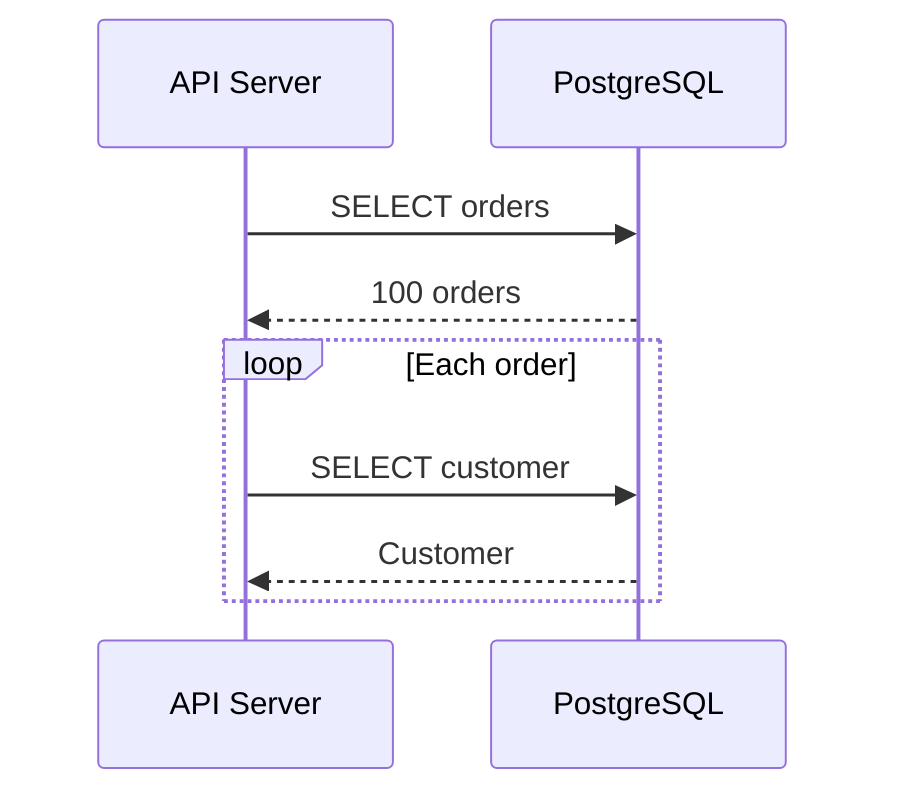
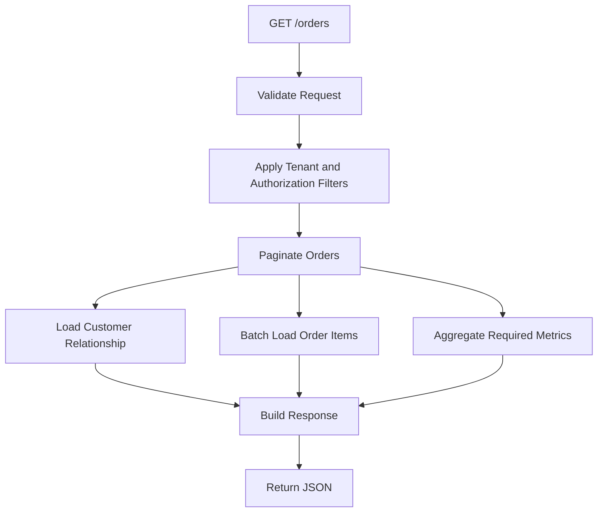

# 13- N Plus One Queries

## Overview

The **N+1 query problem** occurs when an application executes one query to load a collection of parent records and then executes an additional query for each parent record to load related data.

A typical pattern is:

```text
1 query → load N orders
N queries → load customer/items/details for each order

Total = N + 1 queries
```

For example:

```python
orders = Order.objects.all()

for order in orders:
    print(order.customer.email)
```

If 100 orders are returned and `customer` is not already loaded, the application may execute:

```text
1 query for orders
100 queries for customers

Total = 101 queries
```

The code looks simple, but the database workload scales with the number of rows returned.

N+1 is particularly dangerous in production APIs because a query that works well with 10 records can become extremely expensive when a page contains hundreds or thousands of records.

The core principle is:

> **Design the database access pattern around the complete data required by the request rather than around individual objects processed in application loops.**

---

## What Is the N+1 Query Problem?

Consider an API that returns orders and their customers.

The application first executes:

```sql
SELECT
    id,
    customer_id,
    total_amount
FROM orders
ORDER BY created_at DESC
LIMIT 100;
```

Then, while serializing each order:

```python
for order in orders:
    customer = get_customer(order.customer_id)
```

the application may execute:

```sql
SELECT *
FROM customers
WHERE id = 101;
```

then:

```sql
SELECT *
FROM customers
WHERE id = 102;
```

and so on.

The resulting flow is:



The database receives:

```text
1 + N queries
```

instead of one or a small number of set-based queries.

---

## Why N+1 Is a Problem

The primary problem is not simply the number of SQL statements.

Every database round trip has overhead:

```text
Application
    ↓
connection pool
    ↓
database network processing
    ↓
query parsing/planning/execution
    ↓
result transfer
    ↓
application
```

Repeated N times, this overhead becomes significant.

N+1 can increase:

- Database CPU.
- Network traffic.
- Query parsing/planning overhead.
- Connection utilization.
- Application latency.
- Database connection pool pressure.
- Lock duration for transactional workflows.
- Replica workload.
- Cloud database cost.

---

## The Scaling Problem

Suppose:

```text
Page size = 20
```

Then:

```text
1 + 20 = 21 queries
```

This may appear harmless.

Now:

```text
Page size = 100
```

becomes:

```text
1 + 100 = 101 queries
```

At:

```text
Page size = 500
```

it becomes:

```text
1 + 500 = 501 queries
```

And if several related objects are accessed:

```text
1 orders query
+ 100 customer queries
+ 100 shipping queries
+ 100 payment queries
```

the request can generate hundreds of SQL statements.

---

## N+1 Is Usually a Data-Access Design Problem

The underlying application code often has this structure:

```python
parents = load_parents()

for parent in parents:
    related = load_related(parent)
```

The database is being used as though it were an object lookup service.

Relational databases are optimized for set-based operations:

```sql
SELECT ...
FROM parents
JOIN related ...
WHERE ...
```

or:

```sql
SELECT ...
FROM related
WHERE parent_id IN (...);
```

The application should generally request the required set of data rather than repeatedly asking for one record at a time.

---

## N+1 in Django

Django makes N+1 particularly easy to introduce through ORM relationships.

Consider:

```python
orders = Order.objects.all()

for order in orders:
    print(order.customer.email)
```

If `customer` is a foreign key and has not been loaded, Django may issue one query for the orders and another query per customer.

A typical query pattern becomes:

```text
SELECT ... FROM orders;

SELECT ... FROM customers WHERE id = 1;
SELECT ... FROM customers WHERE id = 2;
SELECT ... FROM customers WHERE id = 3;
...
```

---

## `select_related()`

For foreign-key and one-to-one relationships, Django provides:

```python
orders = (
    Order.objects
    .select_related("customer")
    .all()
)
```

This allows Django to retrieve the related customer through a SQL join.

Conceptually:

```sql
SELECT
    orders.*,
    customers.*
FROM orders
JOIN customers
    ON customers.id = orders.customer_id;
```

The application can then access:

```python
for order in orders:
    print(order.customer.email)
```

without triggering a separate customer query for each order.

---

## `select_related()` vs `prefetch_related()`

The distinction is important.

| Relationship | Typical Django strategy |
|---|---|
| Foreign key | `select_related()` |
| One-to-one | `select_related()` |
| Reverse foreign key | `prefetch_related()` |
| Many-to-many | `prefetch_related()` |
| Large related collection | Usually `prefetch_related()` with careful filtering |

`select_related()` generally uses SQL joins.

`prefetch_related()` generally performs additional queries and combines the results in Python.

The goal is not necessarily one SQL query.

The goal is:

> **Avoid one query per parent row.**

---

## `prefetch_related()`

Consider:

```python
orders = (
    Order.objects
    .prefetch_related("items")
)
```

Instead of:

```text
1 order query
+
1 item query per order
```

Django can generally perform:

```text
1 query for orders
1 query for all relevant items
```

Conceptually:

```sql
SELECT *
FROM orders
WHERE ...;
```

followed by something similar to:

```sql
SELECT *
FROM order_items
WHERE order_id IN (...);
```

The ORM then associates the items with their respective orders in application memory.

---

## Why a JOIN Is Not Always the Correct Solution

Consider:

```text
orders
  ↓
order_items
```

One order may have 100 items.

A SQL join can produce:

```text
Order 1 + Item 1
Order 1 + Item 2
Order 1 + Item 3
...
```

The parent row is repeated for every child.

This can significantly increase the result-set size.

For collection relationships, a separate prefetch query can sometimes be more efficient and easier to control than a large join.

Therefore:

```text
N+1
≠
"Always replace everything with JOIN"
```

Instead:

```text
Choose the appropriate set-based loading strategy.
```

---

## FastAPI and SQLAlchemy

The same problem exists when using SQLAlchemy.

A model relationship accessed lazily inside a loop can cause repeated database queries.

For example, an application might unintentionally do:

```python
orders = session.query(Order).all()

for order in orders:
    print(order.customer.email)
```

Depending on relationship configuration, accessing `order.customer` can trigger additional queries.

Modern SQLAlchemy applications should explicitly choose relationship-loading behavior rather than relying on accidental lazy loading.

For example:

```python
from sqlalchemy import select
from sqlalchemy.orm import joinedload

stmt = (
    select(Order)
    .options(joinedload(Order.customer))
)

orders = session.scalars(stmt).all()
```

For collection relationships, `selectinload()` is often useful:

```python
from sqlalchemy import select
from sqlalchemy.orm import selectinload

stmt = (
    select(Order)
    .options(selectinload(Order.items))
)

orders = session.scalars(stmt).unique().all()
```

The exact loading strategy should be chosen based on relationship cardinality and expected result size.

---

## JOIN vs Batched Loading

There are several ways to eliminate N+1.

### Strategy A: JOIN

```text
Parent + single related object
```

Good for:

- Foreign keys.
- One-to-one relationships.
- Small related data.

### Strategy B: Batched `IN`

```text
Load parents
     ↓
Collect IDs
     ↓
SELECT related WHERE parent_id IN (...)
```

Good for:

- One-to-many.
- Many-to-many.
- Collection relationships.

### Strategy C: Aggregated SQL

Sometimes the API only needs a summary:

```sql
SELECT
    o.id,
    COUNT(oi.id) AS item_count
FROM orders AS o
LEFT JOIN order_items AS oi
    ON oi.order_id = o.id
GROUP BY o.id;
```

This avoids transferring all child records when the application only needs a count.

---

## Do Not Fetch Data You Do Not Need

Suppose an API only returns:

```json
{
  "order_id": 123,
  "item_count": 7
}
```

Fetching every item:

```text
Order
  ├── Item 1
  ├── Item 2
  ├── ...
  └── Item 7
```

may be unnecessary.

A better query may use:

```sql
SELECT
    o.id,
    COUNT(oi.id) AS item_count
FROM orders AS o
LEFT JOIN order_items AS oi
    ON oi.order_id = o.id
GROUP BY o.id;
```

The best N+1 optimization is sometimes to avoid loading the related entities entirely.

---

## Serializer-Driven N+1

N+1 problems frequently hide inside API serialization.

Consider:

```python
class OrderSerializer(serializers.ModelSerializer):
    customer_name = serializers.CharField(
        source="customer.name"
    )

    class Meta:
        model = Order
        fields = ["id", "total_amount", "customer_name"]
```

The view may look efficient:

```python
orders = Order.objects.all()
```

but serialization accesses:

```text
order.customer.name
```

for every row.

The correct optimization belongs in the queryset:

```python
orders = (
    Order.objects
    .select_related("customer")
)
```

A serializer should not silently determine database access behavior.

---

## Hidden N+1 in Properties and Methods

N+1 can also hide inside:

```python
@property
def customer_name(self):
    return self.customer.name
```

or:

```python
def get_item_count(self):
    return self.items.count()
```

When called inside a loop:

```python
for order in orders:
    response.append({
        "id": order.id,
        "item_count": order.get_item_count(),
    })
```

the method may execute one query per order.

The abstraction hides the SQL, but the database still pays the cost.

---

## N+1 Through `.count()`

Consider:

```python
for order in orders:
    count = order.items.count()
```

This can produce:

```text
1 query for orders
+
N COUNT queries
```

Instead, if the API needs counts for every order, consider annotating:

```python
from django.db.models import Count

orders = (
    Order.objects
    .annotate(item_count=Count("items"))
)
```

Then:

```python
for order in orders:
    print(order.item_count)
```

The database performs the aggregation as a set-based operation.

---

## N+1 Through `.exists()`

This pattern can also be problematic:

```python
for order in orders:
    if order.items.exists():
        ...
```

Potentially:

```text
1 parent query
+
N existence queries
```

If existence is needed for every parent, consider a query that computes it for the complete set.

For example, PostgreSQL can express existence using aggregation or correlated logic depending on the desired result.

The important principle remains:

```text
Do not repeatedly ask the database the same structural question
for each parent row when the result can be computed for the set.
```

---

## N+1 With Permissions

Authorization logic can accidentally create N+1.

For example:

```python
for document in documents:
    if user_can_access(user, document):
        ...
```

where:

```python
def user_can_access(user, document):
    return Permission.objects.filter(
        user=user,
        document=document,
    ).exists()
```

This can result in one permission query per document.

Authorization should preferably be expressed in the database query itself:

```python
documents = (
    Document.objects
    .filter(
        permissions__user=request.user
    )
    .distinct()
)
```

The exact query depends on the authorization model.

Security checks should not be removed merely to eliminate N+1.

---

## Multi-Tenant N+1

In a shared-schema application, every query must preserve tenant boundaries.

A problematic pattern:

```python
for order in orders:
    customer = Customer.objects.get(id=order.customer_id)
```

can be both:

- N+1.
- A potential tenant-isolation risk if tenant constraints are not consistently applied.

Prefer:

```text
tenant filter
+
set-based relationship loading
```

For example:

```python
orders = (
    Order.objects
    .filter(tenant_id=request.tenant_id)
    .select_related("customer")
)
```

Performance optimization must never bypass authorization or tenant isolation.

---

## N+1 and PostgreSQL

PostgreSQL is optimized for set-oriented relational operations.

Instead of:

```text
SELECT customer WHERE id=1
SELECT customer WHERE id=2
SELECT customer WHERE id=3
...
```

prefer operations such as:

```sql
SELECT *
FROM customers
WHERE id IN (1, 2, 3);
```

or:

```sql
SELECT
    o.id,
    c.email
FROM orders AS o
JOIN customers AS c
    ON c.id = o.customer_id;
```

The database can then optimize the complete operation using:

- Indexes.
- Join algorithms.
- Hashing.
- Sorting.
- Bitmap scans.
- Parallel execution where applicable.

---

## N+1 and Query Planning

N+1 can be expensive even when every individual query is fast.

Suppose each query takes:

```text
1 ms
```

Then:

```text
1 + 100 queries ≈ 101 query executions
```

The actual request latency can be higher due to:

- Network round trips.
- Connection scheduling.
- Query execution.
- Serialization.
- Application processing.

The important metric is therefore not only:

```text
individual query latency
```

but also:

```text
queries per request
```

---

## Query Count Is a Useful Metric

For API endpoints, track:

```text
queries per request
```

For example:

```text
GET /orders

Before:
queries/request = 101

After:
queries/request = 2
```

This is a meaningful performance improvement even if the individual SQL statements were already fast.

APM systems can help identify endpoints with unusually high database query counts.

---

## Detecting N+1 in Django

During development and testing, Django provides query inspection tools.

For example:

```python
from django.test import TestCase

class OrderApiTests(TestCase):
    def test_order_list_query_count(self):
        with self.assertNumQueries(2):
            response = self.client.get("/api/orders/")
            self.assertEqual(response.status_code, 200)
```

The exact expected count depends on the implementation.

The important idea is to turn query-count assumptions into automated tests for critical endpoints.

---

## Development Profiling

Useful tools include:

- Django Debug Toolbar.
- Django query logging.
- APM database tracing.
- PostgreSQL `pg_stat_statements`.
- SQLAlchemy engine logging.
- Application request metrics.

During investigation, inspect:

```text
request
  ↓
SQL statements
  ↓
number of queries
  ↓
query duration
  ↓
execution plans
```

Do not optimize from query count alone.

One poorly written query can be more expensive than several efficient queries.

---

## Production Detection

A production incident may look like:

```text
API latency ↑
    ↓
database CPU ↑
    ↓
queries/request ↑
    ↓
same SQL statement repeated hundreds of times
```

For example:

```text
GET /api/orders
    1 orders query
    500 customer queries
    500 item queries
```

The database may receive:

```text
1001 queries/request
```

This can overwhelm the connection pool under concurrent traffic.

---

## Connection Pool Amplification

Suppose:

```text
100 concurrent API requests
```

and each request generates:

```text
101 database queries
```

The database may need to process:

```text
10,100 query executions
```

for that request batch.

Even if the database pool limits simultaneous connections, those connections remain occupied while the application performs repeated database work.

This can create:

```text
N+1
  ↓
longer request duration
  ↓
connections occupied longer
  ↓
pool queue grows
  ↓
API latency increases
```

---

## N+1 and Microservices

N+1 can also occur across service boundaries.

Consider:

```text
Order Service
    ↓
100 orders
    ↓
100 calls to Customer Service
```

This is effectively a distributed N+1 problem.

The cost is potentially much worse:

```text
Application
    ↓
Network
    ↓
Service discovery / load balancing
    ↓
Customer service
    ↓
Database
```

Each call may involve:

- HTTP/gRPC overhead.
- Serialization.
- Authentication.
- Network latency.
- Service CPU.
- Database access.

Avoid architectures where one API response requires one synchronous remote call per entity.

---

## Distributed Batch APIs

Instead of:

```text
GET /customers/1
GET /customers/2
GET /customers/3
...
```

a service may expose a batch operation:

```text
POST /customers/batch
```

with:

```json
{
  "ids": [1, 2, 3, 4]
}
```

The service can then perform one set-based database query.

For gRPC, a batch RPC can provide similar semantics.

This is especially useful when service boundaries make database joins impossible.

---

## GraphQL and N+1

GraphQL APIs are particularly susceptible because resolvers can independently load related objects.

Conceptually:

```text
Query
 ├── Order resolver
 │     ├── Customer resolver
 │     ├── Customer resolver
 │     └── Customer resolver
```

A common solution is batching and caching with a DataLoader-style pattern.

The principle is:

```text
collect requested IDs
      ↓
batch database/service request
      ↓
map results back to individual fields
```

This preserves the flexible API while avoiding per-object database calls.

---

## Redis and N+1

Redis can sometimes reduce database load:

```text
for order in orders:
    customer = redis.get(...)
```

But replacing SQL N+1 with Redis N+1 does not necessarily solve the architectural problem.

You may still have:

```text
N network calls
```

and now also have:

- Cache misses.
- Stale data.
- Cache invalidation.
- Redis connection pressure.

Batch Redis operations can help, but set-based database loading is often preferable when the data naturally belongs to the relational query.

---

## Kafka and N+1

N+1 patterns can also appear in event consumers.

For example:

```text
Kafka event
    ↓
lookup customer
lookup order
lookup account
lookup configuration
...
```

for every event.

If events arrive at high throughput, this can create a large database workload.

Possible solutions include:

- Batch processing.
- Local read models.
- Cached reference data.
- Kafka-derived state.
- Bulk SQL operations.

The correct approach depends on freshness and consistency requirements.

---

## Celery and Background Jobs

A Celery task processing 100,000 records can amplify N+1 dramatically.

Bad pattern:

```python
for order in orders:
    customer = Customer.objects.get(id=order.customer_id)
    process(order, customer)
```

A batch-oriented worker can instead:

```text
fetch a bounded batch
    ↓
load related data efficiently
    ↓
process batch
    ↓
commit/checkpoint
    ↓
next batch
```

This reduces query overhead and keeps memory bounded.

---

## N+1 and Large Batch Jobs

Avoid loading millions of objects into memory merely to eliminate N+1.

The correct architecture is usually:

```text
bounded batch
+
set-based related loading
+
bounded memory
+
checkpointing
```

For example:

```text
5,000 orders
    ↓
1 order query
1 related-customer query
    ↓
process
    ↓
next 5,000
```

The exact batch size should be measured and tuned.

---

## When Multiple Queries Are Better

Eliminating N+1 does not mean forcing everything into one enormous SQL query.

For example:

```text
1 query for orders
1 query for customers
1 query for items
```

may be better than:

```text
1 massive JOIN producing millions of repeated rows
```

The target is:

```text
small number of efficient, set-based operations
```

not:

```text
exactly one SQL statement
```

---

## N+1 vs Cartesian Explosion

A common overcorrection is joining multiple collection relationships:

```text
orders
  ├── items
  └── payments
```

A naive join can create:

```text
items × payments
```

rows per order.

For example:

```text
10 items × 5 payments = 50 joined rows
```

for one logical order.

The query count may be:

```text
1
```

but the amount of database work and transferred data may be much larger.

Therefore:

> **Query count is a diagnostic signal, not the complete performance metric.**

---

## Data Shape Matters

Before choosing a loading strategy, understand:

```text
Parent cardinality
×
Related cardinality
×
Selected columns
×
Request concurrency
```

For example:

| Relationship | Parent rows | Related rows | Typical strategy |
|---|---:|---:|---|
| Order → Customer | 100 | 100 | Join |
| Order → Items | 100 | 5,000 | Batched prefetch |
| Order → Item count | 100 | 5,000 | Aggregate |
| Order → Payments | 100 | 1,000 | Batched loading |
| Order → Large documents | 100 | Large payload | Avoid eager loading |

---

## Avoiding N+1 at the API Boundary

A useful architecture is:

```text
HTTP request
    ↓
View / endpoint
    ↓
Query specification
    ↓
Set-based database access
    ↓
Domain/service layer
    ↓
Serializer
    ↓
HTTP response
```

The serializer should consume already-loaded data rather than deciding to query the database repeatedly.

For critical endpoints, define explicitly:

```text
which relationships are required
which fields are required
which aggregations are required
```

---

## Field Selection

N+1 optimization should also consider column volume.

Instead of:

```sql
SELECT *
FROM customers;
```

select only required fields:

```sql
SELECT
    id,
    email,
    display_name
FROM customers
WHERE id IN (...);
```

In Django:

```python
orders = (
    Order.objects
    .select_related("customer")
    .only(
        "id",
        "total_amount",
        "customer__id",
        "customer__email",
        "customer__display_name",
    )
)
```

Use field restrictions carefully because deferred fields can themselves trigger additional database queries when later accessed.

---

## Pagination Does Not Automatically Prevent N+1

Suppose:

```text
page size = 50
```

and the endpoint performs:

```text
1 + 50 queries
```

This is still N+1.

Pagination limits N, but it does not eliminate the pattern.

A page size of 50 simply changes:

```text
N = total rows
```

to:

```text
N = rows in current page
```

The problem remains.

---

## N+1 With Nested APIs

Consider:

```json
{
  "orders": [
    {
      "id": 1,
      "customer": {...},
      "items": [...]
    }
  ]
}
```

The API may need:

```text
orders
customers
items
```

A good implementation may perform:

```text
1 query for orders
1 query for customers
1 query for items
```

rather than:

```text
1 query for orders
N queries for customers
N queries for items
```

The response can still contain deeply nested JSON while the database access remains set-based.

---

## Production Checklist

- [ ] Identify endpoints returning collections.
- [ ] Inspect database queries generated during serialization.
- [ ] Measure queries per request.
- [ ] Check for repeated SQL statements differing only by ID.
- [ ] Use joins for appropriate single-valued relationships.
- [ ] Use batched prefetching for collections.
- [ ] Use aggregation when only counts/summaries are required.
- [ ] Avoid fetching unnecessary columns.
- [ ] Define deterministic pagination.
- [ ] Preserve tenant and authorization filters.
- [ ] Test realistic page sizes.
- [ ] Test high-cardinality relationships.
- [ ] Inspect execution plans for expensive queries.
- [ ] Monitor database connection usage.
- [ ] Monitor API latency and database CPU.
- [ ] Add query-count regression tests for critical endpoints.
- [ ] Review distributed service calls for remote N+1.
- [ ] Avoid replacing SQL N+1 with cache/service N+1.
- [ ] Use bounded batches for Celery and large jobs.

---

## Common Mistakes

### Mistake: Assuming ORM Code Is Automatically Efficient

This:

```python
for order in orders:
    order.customer.email
```

looks harmless but can generate N+1 queries.

Always understand the SQL generated by ORM relationship access.

### Mistake: Solving N+1 With a Giant JOIN

A giant join can create excessive row multiplication.

Choose between:

```text
JOIN
prefetch
aggregation
separate queries
```

based on cardinality and required data.

### Mistake: Optimizing Only Query Count

Changing:

```text
101 queries
```

to:

```text
1 query
```

is not automatically an improvement if the single query returns millions of unnecessary rows.

### Mistake: Forgetting Serializer Access

The view may execute one query while the serializer silently triggers hundreds more.

Profile the complete request.

### Mistake: Using Redis for Every Related Object

This can create distributed N+1 rather than solving the underlying data-access pattern.

### Mistake: Ignoring Authorization

Do not remove relationship filters simply because they cause additional queries.

Security constraints must remain part of the data-access design.

### Mistake: Loading Everything Eagerly

Eager loading can increase memory usage and response size.

Load the relationships required by the endpoint, not every relationship on the model.

---

## Reliability and Operational Considerations

N+1 can become a reliability problem under concurrency.

Consider:

```text
500 requests/second
×
101 queries/request
=
50,500 query executions/second
```

The exact concurrency behavior depends on pooling and query execution, but the multiplication illustrates why a small ORM inefficiency can become a major production bottleneck.

Possible consequences include:

- Database CPU saturation.
- Connection pool exhaustion.
- Increased request latency.
- Read replica pressure.
- Cascading service latency.
- Kubernetes pod scaling without corresponding database capacity.

Application autoscaling can make this worse if every new pod generates the same inefficient workload.

---

## Monitoring Strategy

Monitor both:

### Application

```text
request latency
queries/request
database time/request
remote calls/request
error rate
```

### Database

```text
query execution time
calls
CPU
buffer reads
I/O
active connections
lock waits
replica lag
```

A useful signal is:

```text
same SQL statement
+
many executions
+
small rows/result
```

This often indicates a repeated lookup pattern worth investigating.

---

## Performance Validation

After changing an N+1 implementation, compare:

```text
Before
------
queries/request
database time
P95 latency
CPU

After
-----
queries/request
database time
P95 latency
CPU
```

Also compare:

```text
rows returned
bytes transferred
application memory
```

A correct optimization should reduce unnecessary work without creating a new bottleneck.

---

## N+1 Decision Framework

When you detect N+1, ask:

### What data does the API actually need?

If only one related scalar is required:

```text
JOIN / select_related
```

If a collection is required:

```text
prefetch / selectinload / batched query
```

If only a count is required:

```text
aggregation
```

If the relationship belongs to another service:

```text
batch RPC / batch API
```

If the data is high-volume and read-heavy:

```text
read model / cache / denormalization
```

If the data is unnecessary:

```text
do not fetch it
```

---

## Practical Architecture Pattern

For a production order API:



The key design principle is that the endpoint defines its complete data requirements before executing database access.

---

## Senior Engineering Principles

### Optimize Data Access, Not Just SQL

N+1 is usually a mismatch between application object traversal and relational set processing.

### Think in Sets

Prefer:

```text
load N records
load related data for N records
```

over:

```text
load one record
load related data
repeat N times
```

### Query Count Is a Signal

A low query count does not guarantee good performance.

A high query count is often a strong signal of unnecessary round trips.

### Understand Cardinality

A join, prefetch, and aggregation produce different data shapes.

Choose based on:

```text
one-to-one
one-to-many
many-to-many
aggregation
payload size
```

### Keep Security in the Query

Tenant and authorization filters must survive performance optimization.

### Optimize for Production Concurrency

A small per-request inefficiency can become a large database workload when multiplied by concurrent traffic.

## Interview Traps

### What is an N+1 query problem?

One query loads N parent records, followed by N additional queries to load related data individually.

### Is N+1 always exactly N+1 SQL queries?

No. The term describes the pattern. Real applications can produce multiple repeated query families, such as:

```text
1 + N + N
```

or:

```text
1 + 2N
```

### Is the solution always a JOIN?

No. Use joins for appropriate single-valued relationships, batching/prefetching for collections, and aggregation when only derived values are required.

### Is one SQL query always better than 100 SQL queries?

No. One enormous query can produce excessive row multiplication or transfer unnecessary data. The goal is efficient set-based access, not a specific query count.

### Why can N+1 be worse in microservices?

Each additional lookup may become a network request involving serialization, load balancing, authentication, service CPU, and another database operation.

### Can an index fix N+1?

An index can make each individual lookup faster, but it does not remove the N repeated queries or network round trips.

### Why can pagination hide but not solve N+1?

Pagination reduces N to the number of rows on the current page, but the application can still execute one related query per returned row.

## Key Takeaways

- **N+1 occurs when a collection query is followed by one related-data query per row; the resulting database and network work scales with the number of records returned.**
- **Use set-based loading strategies such as `JOIN`, Django `select_related()`, `prefetch_related()`, SQLAlchemy eager loading, batching, or aggregation based on relationship cardinality and required data.**
- **Eliminating N+1 does not mean forcing everything into one SQL query; avoid both repeated lookups and giant joins that create excessive row multiplication or payloads.**
- **Detect N+1 using query-per-request metrics, repeated SQL patterns, ORM profiling, APM traces, and query-count regression tests for important endpoints.**
- **Treat N+1 as a production scalability problem: preserve authorization and tenant boundaries while reducing database round trips, connection usage, CPU, and latency.**