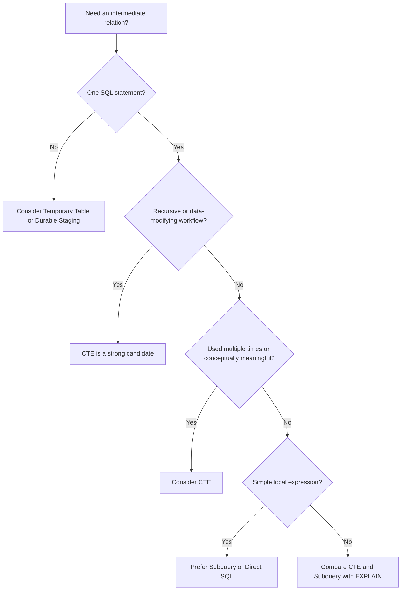

# 15- Overusing CTEs

## Overview

A Common Table Expression (CTE) is a named query expression introduced with `WITH` and scoped to a single SQL statement.

CTEs are valuable for:

- Structuring complex queries.
- Reusing intermediate query results within a statement.
- Recursive queries.
- Data-modifying statements with `RETURNING`.
- Making multi-stage transformations easier to understand.

The anti-pattern is **using CTEs merely because they make SQL look organized**, especially when a simpler subquery, direct query, or set-based expression is clearer or produces a better execution strategy.

Consider:

```sql
WITH active_customers AS (
    SELECT *
    FROM customers
    WHERE status = 'active'
),
customer_orders AS (
    SELECT
        o.customer_id,
        COUNT(*) AS order_count
    FROM orders AS o
    GROUP BY o.customer_id
),
customer_revenue AS (
    SELECT
        o.customer_id,
        SUM(o.total_amount) AS revenue
    FROM orders AS o
    GROUP BY o.customer_id
)
SELECT
    c.id,
    co.order_count,
    cr.revenue
FROM active_customers AS c
LEFT JOIN customer_orders AS co
    ON co.customer_id = c.id
LEFT JOIN customer_revenue AS cr
    ON cr.customer_id = c.id;
```

This is readable, but it unnecessarily scans and aggregates `orders` twice.

A single aggregation may be clearer and more efficient:

```sql
SELECT
    c.id,
    COUNT(o.id) AS order_count,
    COALESCE(SUM(o.total_amount), 0) AS revenue
FROM customers AS c
LEFT JOIN orders AS o
    ON o.customer_id = c.id
WHERE c.status = 'active'
GROUP BY c.id;
```

The core principle is:

> **Use a CTE when it improves semantics, reuse, recursion, data-modifying workflows, or controlled execution. Do not use it as a mandatory formatting layer around every query.**

---

## What Is a CTE?

A CTE is introduced with:

```sql
WITH name AS (
    SELECT ...
)
SELECT ...
FROM name;
```

Example:

```sql
WITH recent_orders AS (
    SELECT
        id,
        customer_id,
        created_at,
        total_amount
    FROM orders
    WHERE created_at >= CURRENT_TIMESTAMP - INTERVAL '30 days'
)
SELECT
    customer_id,
    SUM(total_amount) AS revenue
FROM recent_orders
GROUP BY customer_id;
```

The CTE provides a named intermediate relation for the statement.

Its scope ends when the statement finishes.

---

## Why CTEs Exist

CTEs solve several legitimate problems.

### Query Decomposition

Complex SQL can be divided into logical stages:

```text
source
  ↓
filter
  ↓
aggregate
  ↓
join
  ↓
final result
```

### Recursive Queries

Hierarchical data can require recursive CTEs:

```sql
WITH RECURSIVE ...
```

### Reusing Intermediate Results

A CTE can make a complicated relation easier to reference multiple times.

### Data-Modifying Workflows

PostgreSQL supports data-modifying CTEs:

```sql
WITH deleted AS (
    DELETE FROM sessions
    WHERE expires_at < CURRENT_TIMESTAMP
    RETURNING id
)
INSERT INTO deleted_sessions (session_id)
SELECT id
FROM deleted;
```

### Readability

A complex query can sometimes be much easier to review when meaningful intermediate relations are named.

---

## What "Overusing CTEs" Means

Overuse typically looks like:

```sql
WITH step1 AS (...),
step2 AS (...),
step3 AS (...),
step4 AS (...),
step5 AS (...),
step6 AS (...)
SELECT ...
FROM step6;
```

where most CTEs:

- Are used only once.
- Add no semantic value.
- Repeat the same underlying table.
- Prevent straightforward predicate reasoning.
- Make execution behavior harder to understand.
- Hide an unnecessarily complex query.

A CTE is not inherently better than a subquery.

It is another SQL composition mechanism.

---

## CTE vs Subquery

These can express similar logic.

### CTE

```sql
WITH active_orders AS (
    SELECT *
    FROM orders
    WHERE status = 'active'
)
SELECT
    customer_id,
    COUNT(*)
FROM active_orders
GROUP BY customer_id;
```

### Subquery

```sql
SELECT
    customer_id,
    COUNT(*)
FROM (
    SELECT *
    FROM orders
    WHERE status = 'active'
) AS active_orders
GROUP BY customer_id;
```

The difference is primarily about query structure and, depending on PostgreSQL version and query characteristics, possible optimization behavior.

Do not choose a CTE solely because it appears more readable.

---

## PostgreSQL CTE Optimization

A critical production detail is that PostgreSQL does **not** simply materialize every CTE unconditionally.

In modern PostgreSQL versions, eligible non-recursive, side-effect-free CTEs can be folded into the surrounding query.

Conceptually:

```text
CTE
 ↓
optimizer
 ↓
possibly inline
 ↓
optimize complete query
```

Therefore, this old rule is incorrect:

> "CTEs are always optimization fences."

That behavior is not generally true for modern PostgreSQL.

However, materialization can still occur when required or requested.

---

## `MATERIALIZED`

PostgreSQL allows explicit materialization:

```sql
WITH recent_orders AS MATERIALIZED (
    SELECT *
    FROM orders
    WHERE created_at >= $1
)
SELECT ...
FROM recent_orders;
```

This requests that the CTE result be materialized rather than freely folded into the surrounding query.

Materialization can be useful when:

- The intermediate result is expensive to compute.
- The result is reused multiple times.
- Recomputing the same expression would be expensive.
- You intentionally want to control optimization behavior.

But materialization can also increase:

- Memory usage.
- Temporary storage.
- I/O.
- Execution time.

It should be deliberate.

---

## `NOT MATERIALIZED`

PostgreSQL also supports:

```sql
WITH recent_orders AS NOT MATERIALIZED (
    SELECT *
    FROM orders
    WHERE created_at >= $1
)
SELECT ...
FROM recent_orders;
```

This requests that the CTE be treated like a query-level substitution where possible.

It can be useful when pushing outer predicates into the CTE's underlying query is beneficial.

For example:

```sql
WITH customer_orders AS NOT MATERIALIZED (
    SELECT *
    FROM orders
)
SELECT *
FROM customer_orders
WHERE customer_id = $1;
```

can allow the planner to optimize the underlying `orders` scan as part of the complete query.

Do not use `NOT MATERIALIZED` as a blanket performance directive. The optimizer still needs a workload-specific evaluation.

---

## CTEs and Predicate Pushdown

Suppose:

```sql
WITH orders_by_customer AS (
    SELECT
        customer_id,
        COUNT(*) AS order_count
    FROM orders
    GROUP BY customer_id
)
SELECT *
FROM orders_by_customer
WHERE customer_id = $1;
```

The filter occurs outside the aggregate.

If the CTE is materialized, the database may have to aggregate all customers before filtering to one customer.

A direct formulation can make the selective condition obvious:

```sql
SELECT
    customer_id,
    COUNT(*) AS order_count
FROM orders
WHERE customer_id = $1
GROUP BY customer_id;
```

This is an important distinction:

```text
aggregate everything
    ↓
filter one customer
```

versus:

```text
filter one customer
    ↓
aggregate small dataset
```

Reducing input before expensive operations is often beneficial.

---

## CTE Materialization as an Optimization Tool

Materialization is not always bad.

Consider an expensive calculation used multiple times:

```sql
WITH expensive_result AS MATERIALIZED (
    SELECT
        customer_id,
        expensive_expression(...)
    FROM large_table
)
SELECT ...
FROM expensive_result AS a
JOIN expensive_result AS b
    ON ...
```

Materializing may avoid repeated computation.

The trade-off is:

```text
compute once
+
store intermediate result
```

versus:

```text
recompute
+
avoid intermediate storage
```

The correct choice depends on:

- Intermediate result size.
- Reuse count.
- CPU cost.
- Memory.
- I/O.
- Downstream filtering.

---

## The Cost of Repeating the Same Base Table

A common CTE anti-pattern is:

```sql
WITH completed_orders AS (
    SELECT *
    FROM orders
    WHERE status = 'completed'
),
pending_orders AS (
    SELECT *
    FROM orders
    WHERE status = 'pending'
),
cancelled_orders AS (
    SELECT *
    FROM orders
    WHERE status = 'cancelled'
)
SELECT ...
```

This can make the query unnecessarily complicated and may cause multiple passes over the same relation depending on the final plan.

If the requirement is a conditional summary, consider:

```sql
SELECT
    customer_id,
    COUNT(*) FILTER (
        WHERE status = 'completed'
    ) AS completed_count,
    COUNT(*) FILTER (
        WHERE status = 'pending'
    ) AS pending_count,
    COUNT(*) FILTER (
        WHERE status = 'cancelled'
    ) AS cancelled_count
FROM orders
GROUP BY customer_id;
```

One relational operation can often compute multiple related metrics.

---

## CTEs That Simply Rename Columns

Avoid unnecessary structural layers such as:

```sql
WITH customer_data AS (
    SELECT
        id,
        email,
        status
    FROM customers
)
SELECT
    id,
    email,
    status
FROM customer_data;
```

There is no meaningful abstraction here.

Prefer:

```sql
SELECT
    id,
    email,
    status
FROM customers;
```

A CTE should provide useful structure, semantics, reuse, or execution control.

---

## CTEs That Simply Filter Once

This:

```sql
WITH active_users AS (
    SELECT *
    FROM users
    WHERE status = 'active'
)
SELECT *
FROM active_users
WHERE tenant_id = $1;
```

may be unnecessary.

Prefer:

```sql
SELECT *
FROM users
WHERE status = 'active'
  AND tenant_id = $1;
```

The direct query communicates the complete predicate and can make the intended access path easier to reason about.

---

## CTEs That Hide Query Complexity

CTEs can improve readability, but excessive decomposition can do the opposite.

For example:

```text
customer_base
    ↓
eligible_customers
    ↓
recent_customers
    ↓
customer_orders
    ↓
customer_revenue
    ↓
customer_metrics
    ↓
final_result
```

If every layer is trivial, the query becomes difficult to review because the actual relational operation is spread across many definitions.

A senior engineer should ask:

> Does this CTE represent a meaningful conceptual relation, or is it merely moving SQL into another block?

---

## CTEs and Query Grain

Every CTE should have a clear result grain.

For example:

```text
orders CTE
→ one row per order

customer_metrics CTE
→ one row per customer
```

This is particularly important when joining CTEs.

Suppose:

```text
customer_orders
→ one row per customer

customer_payments
→ multiple rows per customer
```

Joining them without understanding cardinality can cause multiplication.

CTEs do not protect against incorrect joins.

---

## CTEs and Double Counting

Consider:

```sql
WITH order_items AS (
    SELECT
        order_id,
        SUM(price) AS item_total
    FROM order_items
    GROUP BY order_id
),
payments AS (
    SELECT
        order_id,
        SUM(amount) AS payment_total
    FROM payments
    GROUP BY order_id
)
SELECT
    o.id,
    oi.item_total,
    p.payment_total
FROM orders AS o
LEFT JOIN order_items AS oi
    ON oi.order_id = o.id
LEFT JOIN payments AS p
    ON p.order_id = o.id;
```

Here, each CTE produces one row per order before joining.

That can be a good design because it controls cardinality.

The issue is not "using CTEs."

The issue is whether each intermediate relation has a deliberate grain.

---

## CTEs and Window Functions

A CTE is often useful when filtering the result of a window function.

For example:

```sql
WITH ranked_orders AS (
    SELECT
        o.*,
        ROW_NUMBER() OVER (
            PARTITION BY customer_id
            ORDER BY created_at DESC, id DESC
        ) AS rn
    FROM orders AS o
)
SELECT *
FROM ranked_orders
WHERE rn = 1;
```

This is a good structural use because window functions cannot simply be placed in the `WHERE` clause of the same SELECT level.

A subquery would also work:

```sql
SELECT *
FROM (
    SELECT
        o.*,
        ROW_NUMBER() OVER (
            PARTITION BY customer_id
            ORDER BY created_at DESC, id DESC
        ) AS rn
    FROM orders AS o
) AS ranked_orders
WHERE rn = 1;
```

The CTE can be more readable when the intermediate result represents a meaningful stage.

---

## CTEs and Recursive Queries

Recursive CTEs are a legitimate specialized use.

Example:

```sql
WITH RECURSIVE employee_tree AS (
    SELECT
        id,
        manager_id,
        name,
        0 AS depth
    FROM employees
    WHERE id = $1

    UNION ALL

    SELECT
        e.id,
        e.manager_id,
        e.name,
        et.depth + 1
    FROM employees AS e
    JOIN employee_tree AS et
        ON e.manager_id = et.id
)
SELECT *
FROM employee_tree;
```

Recursive CTEs are appropriate for:

- Organizational hierarchies.
- Category trees.
- Dependency graphs.
- Graph traversal.

They should not be replaced with unnecessary application-side loops when the database can safely perform the required traversal.

---

## CTEs and Data-Modifying Statements

PostgreSQL supports data-modifying CTEs.

For example:

```sql
WITH expired_sessions AS (
    DELETE FROM sessions
    WHERE expires_at < CURRENT_TIMESTAMP
    RETURNING id
)
INSERT INTO session_audit (session_id, action)
SELECT
    id,
    'expired'
FROM expired_sessions;
```

This can be useful when several data operations belong to one SQL statement.

Such statements should be carefully reviewed for:

- Transaction behavior.
- Locking.
- WAL volume.
- Error handling.
- Operational impact.

Do not use a data-modifying CTE simply to make a multi-step operation look compact.

---

## CTEs vs Temporary Tables

A CTE:

```text
query-scoped
```

A temporary table:

```text
session-scoped
```

Use a CTE when intermediate data is needed only inside one statement.

Use a temporary table when you genuinely need:

- Multiple statements.
- Explicit indexes on intermediate data.
- Statistics on a temporary relation.
- Reuse across several operations.
- A session-local staging area.

Do not use a CTE when the real requirement is a multi-step workflow spanning multiple SQL statements.

---

## CTEs vs Views

A CTE is:

```text
defined inside one statement
```

A view is:

```text
persistent database object
```

If the same relational abstraction is needed across many queries, a view may be more appropriate.

But avoid creating views merely to hide every query layer.

A view is part of the database schema and becomes a dependency for:

- Queries.
- Migrations.
- Permissions.
- Deployments.
- Schema changes.

---

## CTEs vs Materialized Views

A normal CTE does not automatically provide a persistent cache.

A materialized view stores query results:

```text
base tables
    ↓
materialized view
    ↓
stored result
```

Use materialized views when:

- Recomputing a complex result is expensive.
- Read performance matters.
- Staleness is acceptable.
- Refresh strategy is manageable.

Do not use CTEs expecting them to behave like persistent caches.

---

## CTEs and Backend APIs

Consider a FastAPI endpoint:

```text
GET /customers/{id}/summary
```

The endpoint might require:

```text
customer
order count
revenue
last order
```

A CTE can be appropriate if it creates a meaningful intermediate relation:

```sql
WITH order_metrics AS (
    SELECT
        customer_id,
        COUNT(*) AS order_count,
        SUM(total_amount) AS revenue,
        MAX(created_at) AS last_order_at
    FROM orders
    WHERE customer_id = $1
    GROUP BY customer_id
)
SELECT
    c.id,
    c.email,
    om.order_count,
    om.revenue,
    om.last_order_at
FROM customers AS c
LEFT JOIN order_metrics AS om
    ON om.customer_id = c.id
WHERE c.id = $1;
```

This is more defensible than creating five trivial CTEs for every field.

---

## CTEs in Django

Django's core ORM does not expose every PostgreSQL CTE capability directly.

Applications may use:

- Raw SQL.
- Database-specific extensions.
- Specialized query libraries.
- Views.
- Stored database objects.

When using raw SQL:

```python
from django.db import connection

with connection.cursor() as cursor:
    cursor.execute(
        """
        WITH order_metrics AS (
            SELECT
                customer_id,
                COUNT(*) AS order_count
            FROM orders
            WHERE customer_id = %s
            GROUP BY customer_id
        )
        SELECT
            customer_id,
            order_count
        FROM order_metrics
        """,
        [customer_id],
    )
```

Keep parameters separate from SQL structure.

Do not interpolate user input into the query string.

---

## CTEs in SQLAlchemy

SQLAlchemy provides CTE support:

```python
from sqlalchemy import select, func

order_metrics = (
    select(
        Order.customer_id,
        func.count(Order.id).label("order_count"),
    )
    .where(Order.customer_id == customer_id)
    .group_by(Order.customer_id)
    .cte("order_metrics")
)

stmt = select(
    Customer.id,
    Customer.email,
    order_metrics.c.order_count,
).outerjoin(
    order_metrics,
    order_metrics.c.customer_id == Customer.id,
).where(
    Customer.id == customer_id,
)
```

This is useful when the intermediate relation is meaningful.

As with raw SQL, inspect the generated SQL and execution plan.

---

## CTEs and ORMs: A Common Abstraction Problem

ORM developers sometimes create layers such as:

```text
base queryset
    ↓
filtered queryset
    ↓
annotated queryset
    ↓
CTE
    ↓
another CTE
    ↓
final query
```

The abstraction can become harder to understand than the SQL it generates.

The senior-level skill is not avoiding ORM abstractions.

It is knowing when to inspect the SQL they produce.

---

## CTEs and Query Plans

When a CTE query is slow, inspect:

```sql
EXPLAIN (ANALYZE, BUFFERS)
WITH ...
SELECT ...;
```

Look for:

- Materialization.
- Repeated scans.
- Large intermediate results.
- Sorts.
- Hash operations.
- Actual vs estimated rows.
- Buffer reads.
- Temporary file usage.
- Nested loops.
- Number of loops.

The query text alone is insufficient to determine whether a CTE is causing the problem.

---

## Detecting Unnecessary Materialization

A materialized CTE may appear in the plan as an intermediate result that is computed and then consumed.

Potentially problematic shape:

```text
large base relation
      ↓
materialize huge intermediate result
      ↓
filter most rows away
      ↓
small final result
```

A better plan may push the selective predicate earlier:

```text
base relation
      ↓
selective filter
      ↓
small intermediate result
      ↓
remaining processing
```

This is why filters should be placed as close as possible to the source relation when that matches the intended semantics.

---

## Memory and Temporary Storage

Materialized intermediate results can require substantial resources.

Large CTE workloads can contribute to:

- Memory pressure.
- Temporary files.
- Disk I/O.
- Increased query latency.

Monitor database temporary-file activity when investigating complex analytical queries.

For PostgreSQL, configuration such as:

```text
work_mem
```

affects memory available to individual operations.

Do not blindly increase `work_mem` globally.

Multiple sort/hash operations can occur within a query, and many concurrent queries can multiply memory consumption.

---

## CTEs and Concurrency

A CTE does not create a special transaction boundary.

It is part of the surrounding SQL statement.

If the statement executes inside:

```python
transaction.atomic()
```

in Django, the CTE participates in that transaction.

Likewise, a CTE does not independently commit or roll back.

Transaction behavior is determined by the surrounding transaction context and database statement semantics.

---

## CTEs and Locking

Data-modifying CTEs can acquire locks just like other data modifications.

A query such as:

```sql
WITH deleted AS (
    DELETE FROM jobs
    WHERE completed_at < $1
    RETURNING id
)
SELECT COUNT(*)
FROM deleted;
```

can generate significant WAL and locking pressure when deleting a large number of rows.

For large production operations, consider:

- Batching.
- Lock duration.
- WAL volume.
- Replica lag.
- Vacuum/bloat.
- Transaction size.

A CTE does not make a large mutation operationally cheap.

---

## CTEs and Large Data Processing

For large transformations:

```text
single massive CTE
```

may be less operationally safe than:

```text
bounded batch
+
checkpoint
+
incremental processing
```

For Celery jobs or migrations, a durable staging table may be more appropriate when the intermediate state must survive process failure.

A CTE disappears when its statement finishes.

---

## CTEs and Microservices

A CTE is local to one database.

It cannot coordinate:

```text
PostgreSQL
+
Redis
+
Kafka
+
external HTTP service
```

as one atomic transaction.

For workflows involving external systems, use application-level orchestration and patterns such as the transactional outbox where appropriate.

Do not turn an enormous SQL statement into a substitute for a distributed workflow engine.

---

## Security Considerations

CTEs do not inherently improve SQL security.

Continue to use parameterized SQL:

```sql
WHERE tenant_id = $1
```

rather than:

```python
f"WHERE tenant_id = {tenant_id}"
```

CTEs can also obscure authorization predicates if they are buried in intermediate relations.

For multi-tenant systems, keep security boundaries explicit:

```sql
WITH tenant_orders AS (
    SELECT
        id,
        customer_id,
        total_amount
    FROM orders
    WHERE tenant_id = $1
)
SELECT ...
FROM tenant_orders;
```

The tenant restriction should be deliberate and consistently enforced.

---

## RLS and CTEs

PostgreSQL Row-Level Security still applies according to the roles, policies, and table configuration involved.

A CTE should not be treated as a security boundary.

Do not assume:

```text
CTE filters rows
```

means:

```text
authorization is enforced
```

Security should be implemented through appropriate:

- RLS policies.
- Privileges.
- Application authorization.
- Tenant predicates.
- Database roles.

---

## Reliability and High Availability

For production PostgreSQL systems:

- Test expensive CTE queries against production-scale data.
- Monitor execution time.
- Monitor temporary files.
- Monitor CPU and I/O.
- Monitor replica lag.
- Avoid unexpectedly large materialized intermediates.
- Review data-modifying CTEs carefully.
- Include CTE-heavy queries in migration and deployment testing.

A query that performs acceptably on the primary may still increase replication pressure if it generates substantial writes.

---

## Cost Considerations

Overusing CTEs can increase infrastructure cost indirectly through:

- CPU consumption.
- Memory pressure.
- Temporary disk I/O.
- Longer-running connections.
- Replica workload.
- Larger database instances.

The cost is not caused by the keyword `WITH`.

It comes from the execution strategy and amount of work represented by the query.

---

## When CTEs Are a Good Choice

Use CTEs when they provide meaningful value:

| Situation | CTE suitability |
|---|---|
| Complex multi-stage query | Excellent |
| Recursive traversal | Excellent |
| Reusing meaningful intermediate relation | Good |
| Data-modifying workflow | Good |
| Window-function filtering | Good |
| Temporary single-statement transformation | Good |
| Simple one-condition query | Usually unnecessary |
| Pure column renaming | Usually unnecessary |
| Every query by convention | Poor |
| Expected persistent caching | Wrong abstraction |
| Multi-statement workflow | Consider temp/staging table |

---

## When to Prefer a Subquery

A subquery may be preferable when:

- The relation is used only once.
- The logic is short.
- Naming the intermediate result provides little value.
- Keeping the operation local improves readability.

For example:

```sql
SELECT
    customer_id,
    COUNT(*)
FROM (
    SELECT
        customer_id
    FROM orders
    WHERE status = 'completed'
) AS completed_orders
GROUP BY customer_id;
```

If the subquery is already simple, introducing a named CTE may not improve the query.

---

## When to Prefer Direct SQL

If the query is naturally:

```sql
SELECT
    ...
FROM ...
WHERE ...
GROUP BY ...
```

do not introduce:

```text
CTE 1
CTE 2
CTE 3
```

just to create artificial stages.

Direct SQL is often easier to optimize and review when the relational operation is already straightforward.

---

## When to Prefer a Temporary Table

Use a temporary table when intermediate data must be reused across multiple statements:

```text
statement 1
    ↓
temporary table
    ↓
statement 2
    ↓
statement 3
```

A temporary table can also be indexed and analyzed:

```sql
CREATE TEMP TABLE selected_orders AS
SELECT ...
FROM orders
WHERE ...;

CREATE INDEX selected_orders_customer_idx
ON selected_orders (customer_id);

ANALYZE selected_orders;
```

This is fundamentally different from a query-scoped CTE.

---

## Production Decision Tree



The final decision should be based on semantics and the execution plan.

---

## Common Mistakes

### Mistake: Believing Every CTE Is Materialized

Modern PostgreSQL can inline eligible CTEs.

Do not make performance claims based solely on old CTE behavior.

### Mistake: Assuming CTEs Are Always Faster

A CTE is a query structuring mechanism, not a performance optimization by definition.

### Mistake: Creating a CTE for Every Logical Line

This can make SQL harder to read and reason about.

### Mistake: Aggregating Everything Before Filtering

For example:

```sql
WITH metrics AS (
    SELECT
        customer_id,
        COUNT(*) AS order_count
    FROM orders
    GROUP BY customer_id
)
SELECT *
FROM metrics
WHERE customer_id = $1;
```

If only one customer is needed, filter early when semantics allow.

### Mistake: Repeating the Same Base Table in Multiple CTEs

Several CTEs over the same large table may duplicate expensive work.

Consider conditional aggregation or another shared set-based formulation.

### Mistake: Assuming CTEs Prevent Double Counting

Joins between CTEs can still multiply rows.

Always define the grain of every intermediate relation.

### Mistake: Using a CTE as a Cache

A CTE is query-scoped.

Use a materialized view, cache, or persistent table when durable reuse is required.

### Mistake: Using CTEs for Distributed Workflows

A CTE cannot atomically coordinate Kafka, Redis, HTTP APIs, or other databases.

### Mistake: Ignoring Execution Plans

A visually elegant CTE query can still be operationally expensive.

Use:

```sql
EXPLAIN (ANALYZE, BUFFERS)
```

before making performance conclusions.

---

## Production Review Checklist

- [ ] Does each CTE provide meaningful semantic structure?
- [ ] Is each CTE used once or multiple times?
- [ ] Is the result grain clearly defined?
- [ ] Are large relations scanned repeatedly?
- [ ] Are predicates pushed toward the source where appropriate?
- [ ] Is materialization occurring?
- [ ] Would `NOT MATERIALIZED` be useful?
- [ ] Would explicit `MATERIALIZED` be beneficial?
- [ ] Is a subquery simpler?
- [ ] Is direct SQL simpler?
- [ ] Would aggregation eliminate repeated work?
- [ ] Would a temporary table be more appropriate?
- [ ] Is recursion actually required?
- [ ] Are data-modifying operations appropriately bounded?
- [ ] Are tenant and authorization predicates preserved?
- [ ] Has `EXPLAIN (ANALYZE, BUFFERS)` been reviewed?
- [ ] Has the query been tested at production-scale data volume?
- [ ] Have CPU, memory, I/O, and temporary files been evaluated?
- [ ] Have replica and failover implications been considered?

---

## Interview Traps

### Are CTEs always materialized in PostgreSQL?

No. Modern PostgreSQL can inline eligible non-recursive, side-effect-free CTEs.

### Are CTEs always faster than subqueries?

No. A CTE is primarily a query-structuring mechanism. Performance depends on the resulting execution plan.

### When would you explicitly use `MATERIALIZED`?

When intentionally controlling execution so an intermediate result is computed and stored once, such as when expensive work is reused and materialization is beneficial.

### When might `NOT MATERIALIZED` help?

When allowing the optimizer to fold the CTE into the surrounding query enables predicate pushdown or other optimizations.

### Is a CTE equivalent to a temporary table?

No.

A CTE is scoped to one SQL statement. A temporary table persists for the session or transaction according to its configuration and can be indexed and analyzed.

### Can CTEs prevent duplicate rows?

No. CTEs do not change relational cardinality rules. Joins between CTEs can still produce row multiplication.

### Should every complex query use CTEs?

No. Use them when they improve reasoning, reuse, recursion, or controlled execution. Otherwise a subquery or direct SQL may be clearer.

### Can a CTE improve readability and hurt performance?

Yes. Readability and execution performance are separate concerns. A well-structured CTE may still create an expensive intermediate result or constrain optimization when materialization is involved.

## Key Takeaways

- **CTEs are valuable query-composition tools for meaningful intermediate relations, recursive queries, data-modifying workflows, and complex multi-stage SQL; they are not automatically performance optimizations.**
- **Modern PostgreSQL can inline eligible CTEs, so the outdated rule that "every CTE is an optimization fence" should not be used for performance decisions.**
- **Use `MATERIALIZED` or `NOT MATERIALIZED` deliberately when controlling CTE execution behavior is justified, and validate the result with `EXPLAIN (ANALYZE, BUFFERS)`.**
- **Overusing CTEs can hide query grain, duplicate work, create unnecessarily large intermediates, and make simple SQL harder to maintain; a direct query, subquery, aggregation, or temporary table may be better.**
- **Choose CTEs based on semantics, cardinality, reuse, optimization opportunities, transaction behavior, and production workload rather than using `WITH` as a formatting convention.**