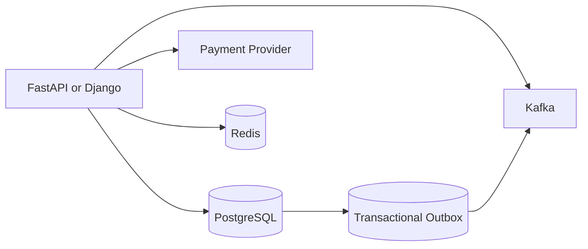
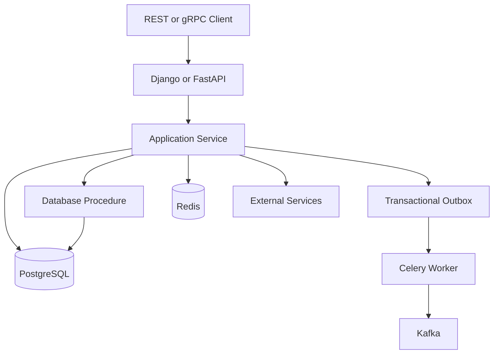

# 16- Overusing Stored Procedures

## Overview

A stored procedure is executable logic stored and managed inside the database. In PostgreSQL, procedures are created with `CREATE PROCEDURE` and invoked with `CALL`.

Stored procedures can be valuable for:

- Database-centric workflows.
- Set-based data processing.
- Atomic operations involving multiple database changes.
- Administrative or operational routines.
- Logic that benefits from executing close to the data.

The anti-pattern is **moving too much application behavior into stored procedures simply because the database can execute it**.

A backend system can become difficult to maintain when:

- Business rules are distributed between Python and SQL.
- Procedures become large application programs.
- External service calls are conceptually mixed with database logic.
- Versioning requires synchronized application and database deployments.
- Testing becomes database-heavy.
- Developers lose visibility into where business behavior is implemented.

The senior engineering question is not:

> "Should we use stored procedures?"

It is:

> **"Which part of this behavior belongs inside the database, and which part belongs in the application or service layer?"**

---

## What a Stored Procedure Is

In PostgreSQL:

```sql
CREATE PROCEDURE archive_expired_sessions()
LANGUAGE SQL
AS $$
    DELETE FROM sessions
    WHERE expires_at < CURRENT_TIMESTAMP;
$$;
```

It can be invoked with:

```sql
CALL archive_expired_sessions();
```

A procedure is a database object with:

- A name.
- Parameters.
- An implementation.
- Ownership.
- Permissions.
- Dependency relationships.
- Transactional behavior determined by PostgreSQL semantics.

PostgreSQL also has **functions**, which are distinct from procedures.

A function is invoked as part of an expression:

```sql
SELECT calculate_customer_balance($1);
```

A procedure is invoked with:

```sql
CALL process_customer_account($1);
```

The distinction matters when designing database APIs.

---

## Why Stored Procedures Exist

Stored procedures solve legitimate database-centric problems.

### Execute Logic Near Data

Instead of:

```text
application
    ↓
SELECT rows
    ↓
Python processing
    ↓
UPDATE rows
```

a database routine may perform the operation directly:

```text
application
    ↓
CALL procedure
    ↓
database
    ├── read
    ├── validate
    ├── update
    └── commit/return result
```

This can reduce network round trips and move set-based processing into the database.

### Encapsulate Database Operations

A procedure can expose a controlled database operation:

```text
Application
    ↓
CALL process_payment(...)
    ↓
Database tables
```

rather than allowing an application role to directly manipulate every underlying table.

### Perform Atomic Database Workflows

A procedure can coordinate several database operations that belong to one database-side operation.

---

## The Overuse Anti-Pattern

A problematic design often evolves like this:

```text
Python service
    ↓
thin wrapper
    ↓
stored procedure
    ↓
large business workflow
    ├── validation
    ├── pricing
    ├── customer rules
    ├── state transitions
    ├── notifications
    ├── retries
    ├── external API assumptions
    └── event publishing
```

The database has effectively become the application server.

This creates a second application runtime inside PostgreSQL.

The problem is not the existence of procedures.

The problem is **placing responsibilities in the wrong layer**.

---

## Database Logic vs Application Logic

A useful boundary is:

```text
Database
├── Data integrity
├── Constraints
├── Set-based data transformations
├── Atomic data operations
├── Database-local invariants
└── Data-centric routines

Application
├── Domain workflows
├── API orchestration
├── External service calls
├── Kafka integration
├── Redis interaction
├── Email/notifications
├── Authorization workflows
└── Cross-service coordination
```

This is not an absolute rule, but it is a strong architectural starting point.

---

## What Belongs in the Database?

Database-side logic is often appropriate for rules that must remain true regardless of which application accesses the database.

For example:

```text
An order cannot have a negative quantity.
```

Prefer a constraint:

```sql
ALTER TABLE order_items
ADD CONSTRAINT order_items_quantity_positive
CHECK (quantity > 0);
```

This is stronger than relying on every application implementation to perform:

```python
if quantity <= 0:
    raise ValueError(...)
```

The database is the correct enforcement point for the invariant.

---

## Constraints Before Procedures

A common anti-pattern is implementing declarative integrity using procedural code.

Avoid:

```sql
CREATE PROCEDURE create_customer(...)
...
IF email_exists THEN
    RAISE EXCEPTION ...;
END IF;
```

as the sole protection against duplicate emails.

Prefer:

```sql
CREATE UNIQUE INDEX customers_email_unique_idx
ON customers (email);
```

Then let the database enforce the invariant under concurrency.

Application code can still provide a friendly error response.

The distinction is:

```text
Constraint
→ guarantees invariant

Procedure
→ performs workflow
```

Use the strongest native database mechanism available.

---

## Good Use Case: Atomic Data Operation

Suppose inventory must not become negative.

A race-prone application pattern is:

```text
SELECT stock
    ↓
Python checks stock
    ↓
UPDATE stock
```

Two workers can observe the same stock.

A better database operation is:

```sql
UPDATE inventory
SET available_quantity = available_quantity - $1
WHERE product_id = $2
  AND available_quantity >= $1
RETURNING available_quantity;
```

This can often eliminate the need for a stored procedure entirely.

The database provides atomicity at the statement level.

---

## Good Use Case: Database-Centric Batch Processing

Stored procedures can be appropriate for operations such as:

- Large set-based transformations.
- Database maintenance workflows.
- Complex data reconciliation.
- Administrative routines.
- Controlled database-side batch operations.

For example:

```sql
CREATE PROCEDURE deactivate_expired_accounts()
LANGUAGE SQL
AS $$
    UPDATE accounts
    SET status = 'inactive'
    WHERE status = 'active'
      AND expires_at < CURRENT_TIMESTAMP;
$$;
```

This is database-centric and set-based.

It does not require Python to fetch every account and issue individual updates.

---

## Avoid Row-by-Row Procedural Processing

A procedure can still be badly implemented.

Avoid:

```text
FOR every row
    SELECT ...
    UPDATE ...
END LOOP
```

when a set-based operation can perform the work.

Prefer:

```sql
UPDATE accounts
SET status = 'inactive'
WHERE status = 'active'
  AND expires_at < CURRENT_TIMESTAMP;
```

The database is optimized for relational, set-based operations.

Putting a procedural loop inside a stored procedure does not automatically make the operation efficient.

---

## Network Round Trips

One advantage of database-side routines is reducing application/database round trips.

Consider:

```text
Python
  ↓ SELECT customer
PostgreSQL
  ↓
Python
  ↓ SELECT orders
PostgreSQL
  ↓
Python
  ↓ UPDATE customer
PostgreSQL
  ↓
Python
  ↓ INSERT audit
PostgreSQL
```

A database-side operation might reduce this to:

```text
Python
  ↓ CALL procedure
PostgreSQL
  ├── customer lookup
  ├── order processing
  ├── update
  └── audit
```

This can be useful for highly data-local operations.

However, fewer network round trips do not automatically mean lower total latency.

Always measure the complete execution plan and workload.

---

## Stored Procedures and Transactions

Stored procedures execute in the database transaction context.

A procedure should not be treated as a magical transaction boundary.

For example, the application may execute:

```sql
BEGIN;

CALL process_order($1);

COMMIT;
```

The exact transaction behavior depends on how the procedure is defined and invoked.

PostgreSQL procedures have transaction-control capabilities in specific invocation contexts, but transaction management inside procedures has important restrictions.

For ordinary application workflows, keep transaction boundaries explicit and understandable at the service layer unless there is a strong reason to manage them inside the procedure.

---

## Stored Procedures vs Application Transactions

Suppose an API performs:

```text
create order
reserve inventory
create payment record
write outbox event
```

The application can explicitly control the database transaction:

```python
from django.db import transaction

with transaction.atomic():
    create_order()
    reserve_inventory()
    create_payment_record()
    create_outbox_event()
```

This keeps the workflow visible in application code while allowing the database to enforce atomicity.

Moving everything into:

```sql
CALL create_complete_order(...);
```

may reduce application complexity in some cases, but it can also hide important domain behavior.

Choose based on ownership and maintainability, not line count.

---

## Business Logic Is Not the Same as Data Integrity

This distinction is critical.

### Data Integrity

Examples:

- Foreign keys.
- Unique constraints.
- Check constraints.
- Not-null requirements.
- Exclusion constraints.

These naturally belong to the database.

### Domain Workflow

Examples:

```text
Customer upgrades subscription
    ↓
charge payment provider
    ↓
update subscription
    ↓
publish Kafka event
    ↓
send notification
```

This is not naturally a database responsibility.

The database cannot safely own the complete workflow because payment providers, Kafka, email systems, and other services are outside the database transaction.

---

## External APIs

Avoid procedures that conceptually depend on:

```text
Stripe
HTTP APIs
AWS services
Kafka
Redis
email providers
```

A database procedure should not become the orchestration layer for distributed systems.

Prefer:



The database handles its local transaction.

The application coordinates external systems.

---

## Transactional Outbox

Suppose an order must be persisted and an event published.

Do not try to make PostgreSQL directly responsible for Kafka delivery.

Instead:

```text
Application
    ↓
PostgreSQL transaction
    ├── orders
    └── outbox_events
             ↓
        transaction commit
             ↓
       background worker
             ↓
           Kafka
```

A stored procedure can potentially participate in creating the outbox record, but Kafka publishing remains outside the database transaction.

This preserves a clear boundary between:

```text
database atomicity
```

and:

```text
distributed event delivery
```

---

## Stored Procedures and Microservices

In a microservices architecture, a database is normally owned by a service.

A procedure can be useful inside that service's database.

However, exposing procedures as cross-service contracts can create tight coupling:

```text
Service A
    ↓
CALL database procedure
    ↓
Service B's database
```

This bypasses service boundaries.

Prefer:

```text
Service A
    ↓ REST/gRPC
Service B
    ↓
Service B database
```

Database procedures should normally remain implementation details of the owning service.

---

## Database as a Shared Application Runtime

A particularly dangerous architecture is:

```text
Django application
       ↓
shared PostgreSQL
       ↑
service B
       ↑
service C
       ↑
reporting service
```

with dozens of shared procedures implementing business behavior for all services.

This creates:

- Tight coupling.
- Deployment coordination.
- Permission complexity.
- Hidden dependencies.
- Difficult ownership.
- Cross-team database coordination.

A database can be shared physically while ownership boundaries remain clear, but application behavior should not become an uncontrolled shared database API.

---

## Versioning and Deployments

Stored procedures are schema objects.

Therefore they must be versioned through your database migration process.

For Django:

```python
from django.db import migrations

PROCEDURE_SQL = """
CREATE OR REPLACE PROCEDURE deactivate_expired_accounts()
LANGUAGE SQL
AS $$
    UPDATE accounts
    SET status = 'inactive'
    WHERE status = 'active'
      AND expires_at < CURRENT_TIMESTAMP;
$$;
"""

class Migration(migrations.Migration):
    dependencies = [
        ("accounts", "0012_previous"),
    ]

    operations = [
        migrations.RunSQL(PROCEDURE_SQL),
    ]
```

Treat procedure changes as code changes.

They should go through:

- Git.
- Code review.
- CI.
- Automated tests.
- Migration testing.
- Deployment validation.

---

## Rolling Deployments and Procedure Compatibility

Suppose version A of the application calls:

```sql
CALL process_order(customer_id, amount);
```

Version B changes it to:

```sql
CALL process_order(customer_id, amount, currency);
```

During a rolling deployment, both application versions may temporarily exist.

The database must support both versions when necessary.

This makes database APIs subject to the same compatibility concerns as HTTP or gRPC APIs.

A safe deployment may require:

```text
expand
    ↓
deploy compatible procedure
    ↓
deploy new application
    ↓
remove old procedure interface later
```

Do not assume database schema changes are instantly synchronized with application deployments.

---

## Stored Procedure Signatures as Contracts

Treat procedure signatures as APIs.

For example:

```sql
process_order(
    customer_id bigint,
    amount numeric,
    currency text
)
```

has compatibility implications.

Changes to:

- Parameter order.
- Parameter types.
- Return behavior.
- Exceptions.
- Side effects.

can break application consumers.

This becomes particularly important when multiple application versions are deployed simultaneously.

---

## Error Handling

Procedures can raise database errors.

For example:

```sql
RAISE EXCEPTION 'Customer % does not exist', p_customer_id;
```

The application must map database errors appropriately.

Avoid leaking internal database details directly to API clients.

Instead:

```text
PostgreSQL exception
    ↓
application error mapping
    ↓
HTTP 4xx/5xx response
```

For known business conditions, prefer stable application-facing error semantics rather than depending on fragile text matching of exception messages.

---

## Stored Procedures and Performance

Stored procedures can improve performance when they:

- Reduce network round trips.
- Execute set-based operations close to data.
- Avoid transferring large datasets to Python.
- Perform atomic database-local operations.

They can hurt performance when they:

- Perform row-by-row loops.
- Execute many internal queries unnecessarily.
- Hold locks for too long.
- Perform large unbounded mutations.
- Consume significant shared database CPU.
- Create contention on hot rows.

The database is shared infrastructure.

Moving work from application servers into PostgreSQL does not make that work free.

---

## Database CPU as a Shared Resource

Consider:

```text
100 application workers
       ↓
PostgreSQL
       ↓
stored procedure
       ↓
expensive CPU-heavy logic
```

Scaling the application from 100 to 500 workers can increase database pressure dramatically.

This is different from CPU-heavy application logic that can often scale horizontally across application instances.

Stored procedures should therefore be evaluated against:

- Database CPU.
- Connection count.
- Lock contention.
- Query latency.
- Replication workload.
- Memory.
- I/O.

---

## Connection Pooling

A stored procedure still consumes a database connection while it executes.

If a procedure takes 20 seconds:

```text
connection acquired
    ↓
CALL procedure
    ↓
20 seconds
    ↓
connection released
```

A large number of concurrent calls can exhaust the connection pool.

Do not assume that moving work into PostgreSQL makes connection pressure disappear.

Keep database operations bounded and predictable.

---

## Long-Running Procedures

Avoid procedures that hold transactions open for long periods without a strong reason.

Long-running database transactions can cause:

- Lock contention.
- Old row versions.
- Vacuum delays.
- Bloat.
- Replica lag.
- Connection pool exhaustion.

For large operations, consider:

- Batching.
- Background workers.
- Durable checkpoints.
- Incremental processing.
- Controlled concurrency.

---

## Large Data Modifications

This procedure:

```sql
CREATE PROCEDURE purge_old_events()
LANGUAGE SQL
AS $$
    DELETE FROM events
    WHERE created_at < CURRENT_TIMESTAMP - INTERVAL '2 years';
$$;
```

may be logically correct but operationally dangerous on a large table.

A massive delete can generate:

- Large WAL volume.
- Dead tuples.
- Vacuum pressure.
- Replica lag.
- Lock contention.
- Long transaction duration.

A production system may instead process bounded batches.

The important lesson is:

> **Encapsulation inside a procedure does not remove the operational cost of the underlying SQL.**

---

## Stored Procedures and Locking

A procedure containing:

```sql
UPDATE accounts
SET balance = balance + $1
WHERE id = $2;
```

still acquires row locks.

If the procedure performs many operations, locks may be held for the duration of the surrounding transaction.

Monitor:

```sql
SELECT
    pid,
    wait_event_type,
    wait_event,
    state,
    query
FROM pg_stat_activity
WHERE datname = current_database();
```

and inspect blocking relationships when necessary.

---

## Deadlocks

Procedures can introduce deadlocks just like application code.

For example:

```text
Procedure A
    locks customer
    ↓
    locks account

Procedure B
    locks account
    ↓
    locks customer
```

This can produce a cycle.

Use consistent lock ordering and keep transactions short.

PostgreSQL can report deadlocks with SQLSTATE:

```text
40P01
```

A safe application retry strategy should retry the **whole transaction**, not merely the failed SQL statement, when the operation is retryable and idempotent.

---

## Stored Procedures and Testing

Database procedures require database-aware testing.

A practical test stack may include:

```text
Unit tests
    ↓
Application logic

Integration tests
    ↓
PostgreSQL
    ↓
Procedure

End-to-end tests
    ↓
API
    ↓
Application
    ↓
Database
```

For procedure-heavy systems, integration tests should validate:

- Successful execution.
- Constraints.
- Concurrency behavior.
- Error conditions.
- Transaction rollback.
- Permissions.
- Migration compatibility.
- Performance on realistic data volumes.

SQLite-based tests may not accurately represent PostgreSQL procedure behavior.

Use PostgreSQL for behavior that depends on PostgreSQL-specific features.

---

## Stored Procedures and Observability

Treat important procedures as production workloads.

Monitor:

- Execution duration.
- Call frequency.
- Errors.
- Lock waits.
- Database CPU.
- I/O.
- Temporary files.
- WAL generation.
- Replica lag.
- Connection pool utilization.

Where available, use PostgreSQL query statistics and application tracing to correlate:

```text
HTTP request
    ↓
service method
    ↓
CALL procedure
    ↓
database execution
```

A procedure should not become an observability blind spot.

---

## Security Considerations

Stored procedures can be part of a least-privilege design, but they can also create serious privilege escalation risks.

Be especially careful with:

```sql
SECURITY DEFINER
```

functions.

A security-definer routine executes with the privileges of its owner.

When using such routines:

- Use a minimally privileged owner.
- Restrict `EXECUTE` privileges.
- Use a safe `search_path`.
- Prefer fully qualified object references.
- Avoid unsafe dynamic SQL.
- Validate inputs.
- Avoid granting broad ownership privileges.

For example, a security-sensitive function should use a controlled search path rather than relying on an attacker-influenced resolution path.

Security-definer routines should be reviewed like privileged application code.

---

## Dynamic SQL

Dynamic SQL inside stored routines requires the same care as dynamic SQL in applications.

Unsafe:

```sql
EXECUTE 'SELECT * FROM ' || table_name;
```

Identifiers and values require different handling.

For PostgreSQL PL/pgSQL, use appropriate identifier/value quoting mechanisms such as `format()` with `%I` for identifiers and `%L` where literal quoting is actually intended, while preferring parameterized `USING` for values.

For example:

```sql
EXECUTE format(
    'SELECT count(*) FROM %I WHERE status = $1',
    target_table
)
INTO row_count
USING target_status;
```

Parameterization protects values, not arbitrary SQL identifiers.

Dynamic SQL should be minimized and tightly controlled.

---

## Stored Procedures and Permissions

A database role should receive only the permissions it requires.

For example:

```sql
GRANT EXECUTE
ON PROCEDURE deactivate_expired_accounts()
TO application_worker;
```

Do not automatically grant broad table permissions simply because a procedure exists.

However, permissions around procedures, ownership, `SECURITY DEFINER`, underlying objects, and role behavior need to be tested carefully.

A procedure can become an unintended privilege escalation path if users can execute privileged routines with attacker-controlled inputs.

---

## Stored Procedures and Django

A healthy architecture might be:

```text
Django service layer
        ↓
database transaction
        ↓
stored procedure for data-local operation
        ↓
PostgreSQL
```

For example:

```python
from django.db import connection

def deactivate_expired_accounts() -> None:
    with connection.cursor() as cursor:
        cursor.execute("CALL deactivate_expired_accounts()")
```

Keep the application wrapper thin.

Avoid creating Python methods that simply expose dozens of database procedures without a clear service-level abstraction.

---

## Stored Procedures and FastAPI

FastAPI can similarly invoke procedures through a database driver or SQLAlchemy.

The endpoint should remain responsible for:

- Request validation.
- Authentication.
- Authorization.
- API response mapping.
- External orchestration.

The procedure should remain focused on database-local behavior.

```text
HTTP request
    ↓
FastAPI
    ├── authentication
    ├── authorization
    ├── validation
    ↓
database call
    ↓
PostgreSQL procedure
    ↓
result
    ↓
API response
```

---

## Stored Procedures and Celery

Procedures can be useful for database-heavy background jobs:

```text
Celery
  ↓
CALL reconcile_account_balances()
  ↓
PostgreSQL
```

But do not assume a procedure makes a job automatically safe.

The worker still needs:

- Idempotency.
- Retry handling.
- Timeouts.
- Monitoring.
- Bounded workload.
- Failure recovery.

If the procedure partially changes state and the worker retries incorrectly, duplicate or inconsistent effects can occur.

---

## Idempotency and Retries

Consider:

```text
Celery task
    ↓
CALL process_payment()
    ↓
network failure
```

The application may not know whether the database committed.

Blindly retrying may duplicate side effects.

Use idempotency keys or durable state transitions where appropriate:

```sql
UPDATE payments
SET status = 'processed'
WHERE id = $1
  AND status = 'pending'
RETURNING id;
```

Database-side atomicity helps, but the application still needs a retry model.

---

## Procedure as a Database API

A mature database architecture may deliberately expose a small set of procedures:

```text
Application
    ↓
Database API
    ├── reserve_inventory()
    ├── finalize_order()
    └── reconcile_balance()
```

This can be effective when:

- The operations are strongly database-centric.
- Multiple consumers need the same operation.
- The interface is intentionally designed.
- Permissions are carefully controlled.
- The procedures are versioned and tested.

The problem starts when the database API becomes a dumping ground for all business behavior.

---

## A Practical Boundary

A useful decision table:

| Responsibility | Database | Application |
|---|---|---|
| Unique constraint | Strong fit | Not sufficient alone |
| Foreign-key integrity | Strong fit | Not sufficient alone |
| Check constraint | Strong fit | Not sufficient alone |
| Atomic row update | Strong fit | Orchestrates |
| Set-based transformation | Strong fit | Usually invokes |
| Complex database reconciliation | Strong fit | Orchestrates |
| API validation | Usually no | Strong fit |
| External API calls | No | Strong fit |
| Kafka publishing | No | Strong fit |
| Redis caching | No | Strong fit |
| Email notification | No | Strong fit |
| Cross-service workflow | No | Strong fit |
| Domain orchestration | Usually no | Strong fit |
| Database maintenance | Strong fit | Can schedule/invoke |
| Large SQL batch | Strong fit when controlled | Worker orchestration |

---

## A Better Architecture

Prefer a layered design:



The procedure is a **database component**, not the entire backend.

---

## When Stored Procedures Are Appropriate

Use stored procedures when most of these are true:

- The operation is database-centric.
- The operation is naturally set-based.
- Atomic database behavior matters.
- Reducing database round trips is valuable.
- The logic should be close to the data.
- The database owns the invariant or operation.
- The procedure can be independently tested.
- The procedure has a stable interface.
- The operational cost is understood.

---

## When Application Logic Is Better

Prefer application logic when the workflow involves:

- External APIs.
- Kafka.
- Redis.
- Celery orchestration.
- Multiple services.
- Complex domain decisions.
- API-specific behavior.
- Rapidly changing business rules.
- Significant non-database computation.

Application code is generally easier to:

- Unit test.
- Refactor.
- Debug.
- Version.
- Deploy independently.
- Integrate with external systems.

---

## Migration Strategy for Procedure-Heavy Systems

If an existing system contains oversized procedures, do not rewrite everything at once.

Use an incremental approach:

```text
Identify procedure responsibilities
        ↓
Separate integrity from workflow
        ↓
Move external orchestration to application
        ↓
Keep database-local operations in DB
        ↓
Add integration tests
        ↓
Introduce stable application service boundary
        ↓
Remove obsolete procedure logic
```

A useful target is:

```text
Database
→ owns data integrity and data-local operations

Application
→ owns domain workflows and integration
```

---

## Common Mistakes

### Mistake: Putting All Business Logic in the Database

This creates a second application runtime inside PostgreSQL.

**Avoid it:** keep database-local invariants and operations in the database, while application services own domain orchestration.

### Mistake: Using Procedures Instead of Constraints

A procedure-based uniqueness check can race under concurrency.

**Avoid it:** use unique constraints or indexes.

### Mistake: Calling External Systems from Database Logic

Database logic is not a replacement for distributed workflow orchestration.

**Avoid it:** use the application or a worker for external services and events.

### Mistake: Assuming Fewer Round Trips Means Faster

The procedure may simply move expensive work into the database.

**Avoid it:** measure total latency, CPU, I/O, locks, and concurrency.

### Mistake: Writing Row-by-Row Loops

Procedural loops can perform badly on large datasets.

**Avoid it:** prefer set-based SQL.

### Mistake: Ignoring Database CPU

Moving computation from Python to PostgreSQL increases shared database workload.

**Avoid it:** monitor database resource consumption and concurrency.

### Mistake: Treating Procedures as Unversioned Scripts

Database routines are schema objects with dependencies.

**Avoid it:** manage them through migrations and CI/CD.

### Mistake: Breaking Rolling Deployments

Changing a procedure interface can break old application instances.

**Avoid it:** use backward-compatible database changes during rolling deployments.

### Mistake: Using `SECURITY DEFINER` Casually

A privileged procedure can become a privilege escalation mechanism.

**Avoid it:** minimize owner privileges, secure `search_path`, restrict execution, and audit dynamic SQL.

### Mistake: Making Procedures Too Large

A 1,000-line procedure may be technically executable but operationally difficult to maintain.

**Avoid it:** decompose responsibilities and establish a clear database/application boundary.

---

## Senior-Level Decision Framework

When reviewing a proposed stored procedure, ask:

### Data Ownership

> Is this behavior fundamentally about manipulating data owned by this database?

### Integrity

> Should this rule remain true regardless of which application writes the data?

If yes, consider a constraint first.

### Set-Based Processing

> Can PostgreSQL perform this operation more efficiently without transferring the dataset to Python?

If yes, database-side processing may be appropriate.

### External Dependencies

> Does this workflow require HTTP, Kafka, Redis, email, or another service?

If yes, keep orchestration outside the procedure.

### Change Frequency

> Is this logic likely to change frequently with product requirements?

Rapidly changing domain behavior is often easier to maintain in application code.

### Concurrency

> Does the operation require atomic database state transitions?

If yes, database-side atomic SQL, constraints, locks, or carefully designed procedures may be valuable.

### Operational Cost

> Will this procedure consume significant shared database resources?

If yes, evaluate workload and concurrency before adopting it.

### Deployment

> Can old and new application versions safely coexist during deployment?

If not, redesign the migration and procedure interface.

---

## Production Checklist

- [ ] Is the responsibility genuinely database-centric?
- [ ] Could a database constraint enforce the invariant instead?
- [ ] Is the operation set-based?
- [ ] Is a procedure actually necessary?
- [ ] Could one atomic SQL statement solve the problem?
- [ ] Are transaction boundaries explicit?
- [ ] Are locks held for a bounded period?
- [ ] Is the operation safe under concurrency?
- [ ] Is retry behavior defined?
- [ ] Is the operation idempotent where required?
- [ ] Does it avoid external service orchestration?
- [ ] Is the procedure version-controlled?
- [ ] Is it deployed through migrations?
- [ ] Is rolling deployment compatibility preserved?
- [ ] Are permissions least-privileged?
- [ ] Has `SECURITY DEFINER` been reviewed if applicable?
- [ ] Is dynamic SQL minimized and safely parameterized?
- [ ] Are execution time and resource usage monitored?
- [ ] Has the procedure been tested on production-scale data?
- [ ] Are HA, replication, backup, and recovery implications understood?

---

## Interview Traps

### Are stored procedures always better because they execute close to the data?

No. They can reduce round trips and efficiently perform database-centric operations, but they can also overload the database, reduce application-layer flexibility, and complicate deployment and testing.

### Should business logic always be kept out of the database?

No. Some business rules are actually data integrity rules and belong in the database. Constraints are often the best mechanism, and some database-centric workflows are suitable for procedures.

### When would you prefer a constraint over a stored procedure?

When the requirement is a declarative invariant such as uniqueness, referential integrity, or a check condition.

### Can a stored procedure call Kafka atomically with PostgreSQL?

No. PostgreSQL transaction atomicity does not extend automatically to Kafka. Use an integration pattern such as a transactional outbox.

### Can stored procedures improve performance?

Yes. They can reduce round trips and execute set-based operations close to the data. But they can also shift CPU and memory consumption onto the database.

### Are stored procedures automatically safer?

No. They still require parameter handling, privilege management, careful dynamic SQL, and secure deployment. `SECURITY DEFINER` routines require particular scrutiny.

### How should procedures be deployed?

Treat them as versioned schema objects managed through migrations, CI/CD, testing, and backward-compatible deployment strategies.

### Why can overusing procedures hurt microservices?

A large shared database procedure layer can create coupling between services, teams, and deployments and can bypass service ownership boundaries.

## Key Takeaways

- **Use stored procedures for deliberate database-centric operations, not as a replacement for the entire application service layer.**
- **Prefer database constraints and atomic SQL for data integrity and concurrency-sensitive invariants before reaching for procedural logic.**
- **Keep external integrations, domain orchestration, Kafka, Redis, HTTP APIs, and cross-service workflows in the application or worker layer.**
- **Treat procedures as versioned database APIs: test them, secure them, monitor their resource usage, and preserve compatibility during rolling deployments.**
- **The right boundary is determined by data ownership, integrity, set-based processing, concurrency, operational cost, and maintainability—not by whether PostgreSQL is technically capable of implementing the logic.**