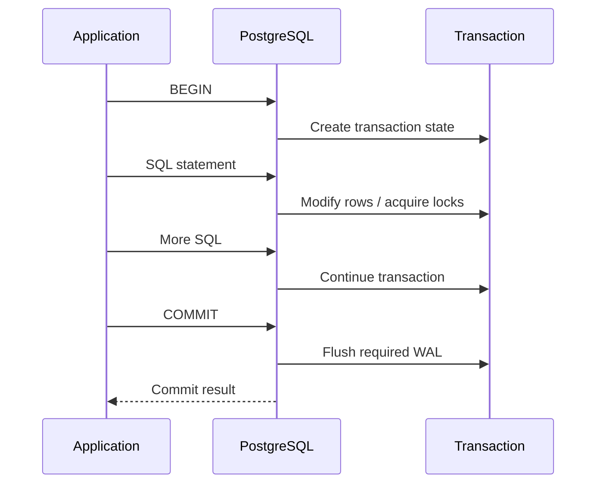
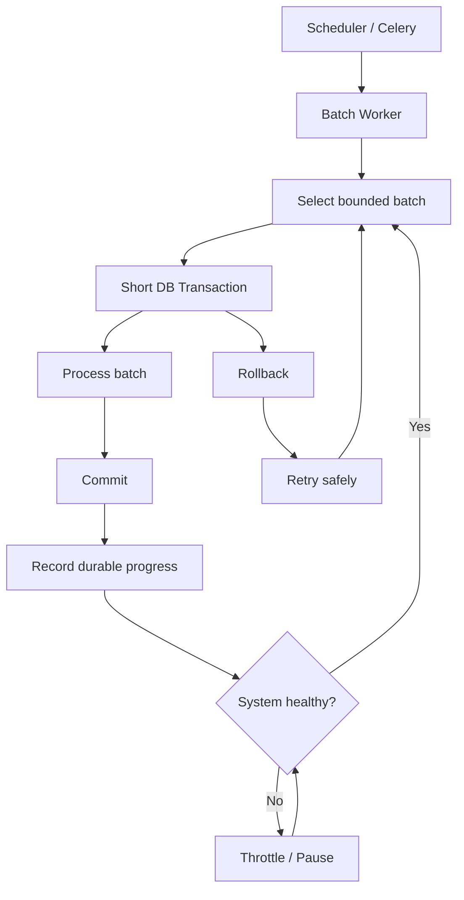

# 17- Large Transactions

## Overview

A database transaction groups operations into an atomic unit of work. A **large transaction** is a transaction that performs a substantial amount of work or remains open for a long time.

Large transactions are not inherently wrong. They become an anti-pattern when a transaction:

- Processes millions of rows in one operation.
- Remains open for minutes or hours.
- Holds locks while application work is performed.
- Generates excessive WAL.
- Keeps old row versions alive.
- Consumes significant connection, memory, or I/O resources.
- Makes rollback or retry prohibitively expensive.

In PostgreSQL, transaction duration matters because transactions interact with:

- MVCC snapshots.
- Row versions.
- Locks.
- WAL.
- Vacuum.
- Replication.
- Connection pools.
- Recovery and failover.

The senior-level principle is:

> **Keep transactions as short as correctness allows, and separate atomicity requirements from batch-processing requirements.**

For example, this can be dangerous on a large table:

```sql
BEGIN;

UPDATE orders
SET status = 'archived'
WHERE created_at < CURRENT_TIMESTAMP - INTERVAL '2 years';

COMMIT;
```

The SQL may be correct, but executing millions of changes inside one transaction can create substantial operational pressure.

A safer design may process bounded batches:

```text
find bounded batch
    ↓
update batch
    ↓
commit
    ↓
observe
    ↓
repeat
```

The important trade-off is that batching changes the transaction boundary. That means the operation is no longer globally atomic unless additional mechanisms are introduced.

---

## What Makes a Transaction "Large"?

There is no universal row-count or duration threshold.

A transaction can be considered large because of:

| Dimension | Example risk |
|---|---|
| Duration | Transaction remains open for several minutes |
| Rows modified | Millions of updates |
| WAL generated | Large replication/recovery impact |
| Locks held | Blocks concurrent requests |
| Snapshot age | Delays cleanup of old row versions |
| Memory | Large sorts, hashes, or application state |
| Connection occupancy | Pool connections remain unavailable |
| Rollback cost | Failure requires undoing substantial work |
| Business scope | One transaction spans unrelated operations |

A transaction modifying 100 rows can be problematic if it holds locks for 30 minutes.

A transaction modifying millions of rows may be acceptable in a controlled maintenance window if its operational impact is understood.

---

## Why Large Transactions Are Dangerous

The main problem is that database work is not isolated from the rest of the system.

A long transaction can create this chain:

```text
Long transaction
      ↓
Locks / old snapshots
      ↓
Vacuum cleanup delayed
      ↓
Dead tuples accumulate
      ↓
Table/index bloat
      ↓
More I/O
      ↓
Higher query latency
```

For write-heavy workloads:

```text
Large transaction
      ↓
Large WAL volume
      ↓
Replica receives WAL
      ↓
Replica lag
      ↓
Read-after-write inconsistency
      ↓
Failover / recovery complexity
```

Large transactions therefore become an architecture and operations concern, not merely a SQL concern.

---

## Transaction Lifecycle

A simplified lifecycle is:



For a large transaction, the middle section may remain active for a long time:

```text
BEGIN
  ↓
large amount of work
  ↓
locks held
  ↓
WAL generated
  ↓
snapshot remains relevant
  ↓
COMMIT
```

The longer this phase lasts, the greater the operational impact can become.

---

## PostgreSQL MVCC and Long Transactions

PostgreSQL uses Multi-Version Concurrency Control (MVCC).

An update generally creates a new row version rather than overwriting the old version in place.

Conceptually:

```text
old row version
      ↓
UPDATE
      ↓
new row version
```

Old row versions eventually become removable when no active transaction still needs to see them.

A long-running transaction can therefore prevent cleanup of row versions that are still potentially visible to its snapshot.

This can contribute to:

- Dead tuples.
- Table bloat.
- Index bloat.
- Increased vacuum work.
- Longer scans.

This is one of the most important reasons to avoid unnecessarily long PostgreSQL transactions.

---

## Long Transactions and Vacuum

Vacuum is responsible for reclaiming space associated with obsolete row versions and maintaining database health.

A long-running transaction can make cleanup less effective because PostgreSQL must preserve row versions that could still be visible to an active snapshot.

This means:

```text
Long transaction
      ↓
old row versions remain relevant
      ↓
vacuum cannot clean everything
      ↓
bloat increases
```

A transaction does not need to be actively executing SQL to cause this problem.

An application connection sitting in:

```text
idle in transaction
```

can still be operationally harmful.

---

## `idle in transaction`

One of the most dangerous transaction states is:

```text
idle in transaction
```

The application has started a transaction but is currently doing nothing.

For example:

```python
with transaction.atomic():
    order = load_order()

    # Slow external API call
    response = payment_provider.charge()

    update_order(order, response)
```

If the external API takes 30 seconds, the database transaction may remain open for the duration.

Prefer:

```python
response = payment_provider.charge()

with transaction.atomic():
    order = load_order()
    update_order(order, response)
```

The exact design depends on the business workflow and concurrency requirements, but the general principle is:

> **Do not hold a database transaction open while waiting for external systems unless the atomicity requirement genuinely demands it.**

---

## Transaction Duration vs Statement Duration

These are different concepts.

A statement may take 10 seconds:

```sql
UPDATE ...
```

A transaction may remain open for 10 minutes:

```text
BEGIN
  ↓
SELECT
  ↓
application processing
  ↓
external API
  ↓
UPDATE
  ↓
other work
  ↓
COMMIT
```

The database impact depends on both:

- How expensive individual statements are.
- How long the transaction remains open.

A fast statement inside a long transaction can still contribute to snapshot and lock problems.

---

## Large Transaction vs Large Statement

These are related but different.

### Large Statement

```sql
DELETE FROM events
WHERE created_at < $1;
```

The statement itself may affect millions of rows.

### Large Transaction

```sql
BEGIN;

DELETE ...;
UPDATE ...;
INSERT ...;
UPDATE ...;

COMMIT;
```

Many operations are grouped into one transaction.

You can have:

- Large statement + short transaction.
- Small statements + long transaction.
- Large statements + long transaction.

Each requires different mitigation.

---

## When Large Transactions Are Appropriate

Large transactions can be justified when atomicity requires them.

Examples:

- Financial state transitions.
- Critical multi-table invariants.
- Small-to-medium schema/data changes.
- Operations where partial completion would be unacceptable.
- Coordinated updates across tightly coupled tables.

For example:

```sql
BEGIN;

UPDATE accounts
SET balance = balance - $1
WHERE id = $2
  AND balance >= $1;

INSERT INTO ledger_entries (
    account_id,
    amount,
    transaction_type
)
VALUES (
    $2,
    -$1,
    'debit'
);

COMMIT;
```

The transaction protects the consistency of the operation.

The question is not whether transactions are good.

The question is whether the **transaction boundary matches the business atomicity requirement**.

---

## When Batching Is Better

Batching is generally preferable for:

- Large backfills.
- Data cleanup.
- Historical migrations.
- Large archival jobs.
- Reprocessing millions of records.
- Background maintenance.

Instead of:

```text
BEGIN
  process 10 million rows
COMMIT
```

use:

```text
BEGIN
  process 5,000 rows
COMMIT

BEGIN
  process 5,000 rows
COMMIT

...
```

This reduces the amount of work and locking associated with each transaction.

---

## Batch Processing Trade-Off

Batching improves operational characteristics but changes atomicity.

A single transaction provides:

```text
all-or-nothing
```

Batching provides:

```text
batch-by-batch progress
```

If batch 37 succeeds and batch 38 fails:

```text
batches 1-37 → committed
batch 38     → failed
batches 39+  → not processed
```

Therefore, batch jobs need:

- Idempotency.
- Restartability.
- Durable progress.
- Clear state transitions.
- Retry handling.

Do not blindly replace every transaction with batches.

---

## Keyset Batch Processing

For large tables, keyset batching is usually preferable to repeatedly using large `OFFSET` values.

Example:

```sql
SELECT id
FROM customers
WHERE id > $1
ORDER BY id
LIMIT 5000;
```

Then process the selected IDs.

Conceptually:

```text
last_id = 0

batch 1:
    id > 0
    LIMIT 5000

batch 2:
    id > last_id
    LIMIT 5000

batch 3:
    id > last_id
    LIMIT 5000
```

This avoids repeatedly scanning/skipping large prefixes of the table.

---

## Batched Update

For PostgreSQL, one approach is to identify a bounded set and update it:

```sql
WITH batch AS (
    SELECT id
    FROM customers
    WHERE id > $1
      AND status = 'pending'
    ORDER BY id
    LIMIT 5000
)
UPDATE customers AS c
SET status = 'processed'
FROM batch
WHERE c.id = batch.id
RETURNING c.id;
```

The application can commit after each batch and persist the last successfully processed key.

---

## Batch Size

There is no universal batch size.

Common starting points might be:

```text
1,000
5,000
10,000
```

but the correct size depends on:

- Row size.
- Index count.
- Query complexity.
- Lock contention.
- WAL volume.
- Disk throughput.
- Replica capacity.
- Application latency.
- Database hardware.

Measure rather than assuming.

---

## Adaptive Batching

A mature batch processor can adjust its behavior based on system health.

For example:

```text
batch
  ↓
measure latency / WAL / locks
  ↓
healthy?
 ┌───────┴───────┐
yes             no
 ↓                ↓
increase          reduce
batch             batch
```

You can also throttle based on:

- CPU.
- I/O latency.
- Replica lag.
- Lock waits.
- Connection utilization.
- API latency.

This is particularly useful for large maintenance operations in production.

---

## Large Deletes

A common anti-pattern is:

```sql
DELETE FROM audit_events
WHERE created_at < $1;
```

against hundreds of millions of rows.

Potential consequences include:

- Huge WAL generation.
- Long execution time.
- Dead tuples.
- Vacuum pressure.
- Replica lag.
- Lock contention.
- Large transaction rollback cost.

For large datasets, consider:

```text
bounded deletes
+
commit
+
vacuum observation
+
repeat
```

For very large time-partitioned data, dropping or detaching an old partition can be dramatically more appropriate than deleting individual rows.

---

## Large Updates

Large updates have similar concerns:

```sql
UPDATE customers
SET normalized_email = lower(email)
WHERE normalized_email IS NULL;
```

On a large table, this may:

- Rewrite many tuples.
- Generate significant WAL.
- Increase dead tuples.
- Affect indexes.
- Consume CPU and I/O.
- Increase replica lag.

Use incremental backfills rather than assuming one massive update is safe.

---

## WAL Implications

PostgreSQL's Write-Ahead Logging (WAL) records changes needed for durability and replication.

A large write transaction can produce a large amount of WAL.

Conceptually:

```text
Large transaction
      ↓
many row changes
      ↓
large WAL volume
      ↓
replication / archiving workload
```

Potential consequences:

- Replica lag.
- Increased storage consumption.
- Higher backup/archive traffic.
- Longer recovery.
- More I/O.

Large write operations should therefore be evaluated against replication capacity.

---

## Replica Lag

Suppose:

```text
Primary
  ↓
large transaction
  ↓
large WAL
  ↓
replica
```

A read replica may fall behind while applying the resulting changes.

This can create:

```text
write completed on primary
        ↓
read routed to replica
        ↓
old data returned
```

If the application requires read-after-write consistency, it must account for replication lag.

Large transactions can make this problem more visible.

---

## Commit and WAL

A commit is not equivalent to:

```text
all data immediately copied to every replica
```

The primary's durability and replica replay are separate concerns.

For large write workloads, monitor:

- WAL generation.
- WAL retention.
- Replica replay lag.
- Archive throughput.
- Replication slot behavior.

Large transactions can also affect logical replication and downstream consumers depending on the architecture.

---

## Rollback Cost

A major transaction failure can be expensive.

Consider:

```text
BEGIN
  ↓
2 million updates
  ↓
error
  ↓
ROLLBACK
```

The database must unwind the transaction's effects.

This can create additional workload during an already unhealthy situation.

Smaller transactions reduce the amount of work that must be rolled back per failure.

This is one reason batch processing improves failure isolation.

---

## Unknown Commit Outcome

Large transactions also make network failures more complicated.

Suppose:

```text
Application
    ↓ COMMIT
PostgreSQL
    ↓
commit succeeds
    X
network connection fails
```

The application may not know whether the transaction committed.

Blindly retrying could duplicate effects if the operation is not idempotent.

Use:

- Idempotency keys.
- Unique constraints.
- Durable operation state.
- Reconciliation.
- Carefully designed retry semantics.

Do not treat a network error during commit as proof that the transaction did not commit.

---

## Django Transactions

Django provides transaction management through:

```python
from django.db import transaction

with transaction.atomic():
    create_order()
    reserve_inventory()
    create_outbox_event()
```

This is appropriate when these operations must commit atomically.

Avoid:

```python
with transaction.atomic():
    for customer in Customer.objects.iterator():
        expensive_external_operation(customer)
        customer.status = "processed"
        customer.save(update_fields=["status"])
```

This can keep one transaction open for a very long time.

For a large background job, prefer bounded units of work.

---

## Django Batch Pattern

A simplified pattern is:

```python
from django.db import transaction

BATCH_SIZE = 5_000

while True:
    with transaction.atomic():
        customer_ids = list(
            Customer.objects
            .filter(status="pending")
            .order_by("id")
            .values_list("id", flat=True)[:BATCH_SIZE]
        )

        if not customer_ids:
            break

        Customer.objects.filter(id__in=customer_ids).update(
            status="processed"
        )
```

For production jobs, make the selection and progress model more explicit, especially when workers can run concurrently.

If multiple workers can process the same queue, PostgreSQL locking patterns such as `FOR UPDATE SKIP LOCKED` may be appropriate.

---

## Celery and Large Transactions

Celery is often a better place to orchestrate large database jobs:

```text
Celery task
    ↓
select batch
    ↓
transaction
    ↓
process batch
    ↓
commit
    ↓
schedule/continue
```

This provides:

- Retry boundaries.
- Monitoring.
- Worker isolation.
- Controlled concurrency.

However, Celery retries must be designed around database idempotency.

A retry can happen after a successful commit but before the worker receives the response.

---

## `SKIP LOCKED` for Concurrent Workers

For queue-like workloads:

```sql
SELECT id
FROM jobs
WHERE status = 'pending'
ORDER BY id
FOR UPDATE SKIP LOCKED
LIMIT 100;
```

This can allow workers to claim different rows without waiting on rows already locked by another worker.

A typical flow is:

```text
Worker A ──┐
           ├── PostgreSQL queue rows
Worker B ──┘
           ↓
FOR UPDATE SKIP LOCKED
```

This is useful for work queues, but it is not a universal batching mechanism.

It can cause temporarily skipped rows and may lead to starvation if ordering and retry behavior are poorly designed.

---

## Transactions and External Services

Avoid:

```python
with transaction.atomic():
    create_order()
    payment_provider.charge()
    publish_kafka_event()
    update_order()
```

The database transaction cannot atomically include the payment provider or Kafka.

Instead, design explicit state transitions and an outbox:

```text
Database transaction
    ├── order
    ├── payment state
    └── outbox event
             ↓
          commit
             ↓
       background worker
             ↓
      external systems
```

This keeps database transactions short and preserves reliable integration semantics.

---

## Connection Pool Impact

Every active transaction occupies a database connection.

If:

```text
pool size = 20
```

and 20 requests each hold transactions while performing slow work:

```text
20 connections
    ↓
all occupied
    ↓
new requests wait
```

A transaction problem can therefore become an application availability problem.

Large or long transactions should be evaluated together with:

- Gunicorn/Uvicorn worker count.
- Django database connection behavior.
- SQLAlchemy pool size.
- PgBouncer configuration.
- Kubernetes pod count.

---

## Kubernetes Scaling Does Not Solve Database Contention

Suppose the application scales from:

```text
10 pods
```

to:

```text
50 pods
```

while each pod performs large transactions.

The database may receive substantially more concurrent work.

This can increase:

- Lock contention.
- CPU.
- I/O.
- Connections.
- WAL generation.
- Deadlocks.

Horizontal application scaling is not automatically beneficial when the bottleneck is the database.

---

## Isolation Levels and Large Transactions

Long transactions make isolation-level behavior more important.

PostgreSQL commonly uses:

```text
READ COMMITTED
```

by default.

Other levels include:

```text
REPEATABLE READ
SERIALIZABLE
```

A long `REPEATABLE READ` transaction can retain a snapshot for an extended period.

`SERIALIZABLE` transactions can additionally encounter serialization failures under contention.

Large transactions therefore increase the importance of:

- Transaction duration.
- Retry behavior.
- Lock ordering.
- Snapshot lifetime.
- Conflict rates.

---

## Serialization Failures

PostgreSQL can abort a transaction with:

```text
SQLSTATE 40001
```

when serialization cannot safely proceed.

The correct retry boundary is generally the **whole transaction**.

Do not simply retry the final statement inside a partially failed transaction.

A retry must also be safe from a business perspective.

---

## Deadlocks

Large transactions can increase deadlock opportunities because they may hold multiple locks for longer.

For example:

```text
Transaction A
  locks customer 1
  locks customer 2

Transaction B
  locks customer 2
  locks customer 1
```

Use consistent lock ordering.

PostgreSQL reports deadlocks with:

```text
SQLSTATE 40P01
```

Retry the whole transaction when the operation is safely retryable.

---

## Large Read Transactions

Large transactions are not only about writes.

A long-running read transaction can also hold a snapshot open.

For example:

```sql
BEGIN;

SELECT ...
FROM very_large_table;

-- application processes results for several minutes

COMMIT;
```

Depending on the query and isolation level, the long-lived snapshot can affect cleanup of row versions created by concurrent writes.

For large exports, consider:

- Streaming results carefully.
- Read-only transactions where appropriate.
- Dedicated replicas.
- Snapshot requirements.
- Export-specific infrastructure.

---

## Large Exports

Do not run a multi-hour export through a normal request transaction:

```text
HTTP request
    ↓
BEGIN
    ↓
large query
    ↓
generate CSV
    ↓
upload S3
    ↓
COMMIT
```

This creates an unnecessarily long database transaction.

Prefer:

```text
API request
    ↓
create export job
    ↓
Celery worker
    ↓
read database
    ↓
generate file
    ↓
upload S3
    ↓
update export status
```

The database interaction can remain short and controlled.

---

## Large Transactions and Timeouts

Use appropriate safeguards such as:

```sql
SET LOCAL statement_timeout = '30s';
```

for appropriate transactional work.

PostgreSQL also provides:

```text
lock_timeout
idle_in_transaction_session_timeout
```

These solve different problems.

| Setting | Purpose |
|---|---|
| `statement_timeout` | Limits statement execution time |
| `lock_timeout` | Limits time waiting to acquire a lock |
| `idle_in_transaction_session_timeout` | Terminates sessions idle inside a transaction |

Timeouts are safety mechanisms, not substitutes for good transaction design.

---

## Transaction Size and Lock Duration

A useful distinction:

```text
transaction size
≠
lock duration
```

A transaction may modify many rows but release some locks earlier depending on operation and lock type, while certain locks can remain until transaction end.

For correctness-sensitive workloads, inspect actual lock behavior rather than assuming all database locks behave identically.

Use PostgreSQL diagnostics such as:

```sql
SELECT
    pid,
    state,
    wait_event_type,
    wait_event,
    query
FROM pg_stat_activity
WHERE state <> 'idle';
```

and:

```sql
SELECT
    pid,
    pg_blocking_pids(pid) AS blocking_pids
FROM pg_stat_activity
WHERE cardinality(pg_blocking_pids(pid)) > 0;
```

---

## Large Transactions and Indexes

Large writes affect indexes too.

An update may require changes to:

- Table tuples.
- B-tree indexes.
- Other indexes.
- WAL.

The more indexes a table has, the more expensive large write operations can become.

This is another reason to evaluate large backfills against:

- Number of indexes.
- Index size.
- HOT-update eligibility.
- WAL rate.
- Replica capacity.

Do not assume an update only costs one table write.

---

## Large Transactions and Partitioning

Partitioning can be useful for very large datasets.

For time-based data:

```text
events
├── events_2026_01
├── events_2026_02
├── events_2026_03
└── events_2026_04
```

Instead of deleting millions of old rows:

```sql
DELETE FROM events
WHERE created_at < $1;
```

you may be able to detach or drop an obsolete partition according to the application's retention strategy.

This can dramatically reduce row-level deletion work.

Partitioning should be designed around access patterns and lifecycle requirements, not added solely to solve one large transaction.

---

## Large Transactions and Replication

For systems using PostgreSQL replication:

```text
Primary
  ↓
WAL
  ↓
Streaming replica
```

Large write transactions can create bursts of replication work.

For logical replication, large transactions can also affect how changes are decoded and delivered depending on the publication/subscriber architecture.

Monitor:

- Replication lag.
- WAL retention.
- Replication slots.
- Archive throughput.
- Replica disk usage.

Large maintenance jobs should be scheduled with replication capacity in mind.

---

## Backup and Recovery

Large transactions can affect:

- WAL volume.
- Point-in-time recovery.
- Replica recovery time.
- Backup storage.
- Restore duration.

A database operation that generates a large amount of WAL can increase the amount of data that recovery and replication infrastructure must process.

For destructive or high-risk maintenance:

```text
backup/PITR readiness
        ↓
small batches
        ↓
monitor
        ↓
validate
        ↓
continue
```

Do not start an enormous production transaction without understanding recovery implications.

---

## Security Considerations

Large transactions can indirectly affect availability.

An attacker or malfunctioning client that can trigger expensive transactions may consume:

- Connections.
- CPU.
- I/O.
- Locks.
- Temporary storage.

Protect production systems with:

- Authentication.
- Authorization.
- Query limits.
- Appropriate timeouts.
- API rate limits.
- Bounded batch sizes.
- Restricted database permissions.

Do not expose arbitrary bulk-update capabilities through an API.

For example, an endpoint allowing:

```text
POST /customers/bulk-update
```

should enforce server-side limits rather than allowing an arbitrary number of records in one transaction.

---

## Monitoring Large Transactions

Monitor transaction age directly.

A useful query is:

```sql
SELECT
    pid,
    usename,
    application_name,
    client_addr,
    state,
    xact_start,
    clock_timestamp() - xact_start AS transaction_age,
    wait_event_type,
    wait_event,
    query
FROM pg_stat_activity
WHERE xact_start IS NOT NULL
ORDER BY xact_start;
```

Look for:

- Very old transactions.
- `idle in transaction`.
- Long-running writes.
- Lock waits.
- Unexpected application names.
- Connections holding transactions open.

---

## Operational Metrics

For large transaction workloads, monitor:

| Metric | Why it matters |
|---|---|
| Transaction age | Detects long-lived transactions |
| Active connections | Detects pool pressure |
| Lock waits | Detects contention |
| Database CPU | Detects compute pressure |
| Disk I/O | Detects storage pressure |
| WAL generation | Measures write amplification |
| Replica lag | Detects replication pressure |
| Dead tuples | Indicates cleanup pressure |
| Table/index bloat | Indicates long-term storage impact |
| Query latency | Measures user-facing impact |
| Temporary files | Indicates memory/workload pressure |

Correlate metrics rather than investigating them independently.

---

## Logging and Tracing

For application services, capture:

```text
request_id
transaction start
database operation
transaction duration
commit/rollback
```

For example:

```text
request_id=abc123
db_transaction_duration_ms=8420
db_rows_affected=50000
db_commit=success
```

This makes it easier to distinguish:

```text
slow SQL
```

from:

```text
long transaction caused by application behavior
```

---

## Production Batch Architecture

A robust large-data workflow can look like:



The important properties are:

- Bounded transactions.
- Durable progress.
- Safe retries.
- Health-aware throttling.
- Observable execution.
- Restartability.

---

## Durable Progress

Do not rely only on:

```text
last_id in application memory
```

for an important long-running migration.

If the process crashes, that state disappears.

For durable jobs, use a persistent checkpoint or derive progress safely from the database state.

A checkpoint should never claim progress beyond what has actually committed.

For example:

```text
batch transaction commits
        ↓
checkpoint advances
```

not:

```text
checkpoint advances
        ↓
batch transaction commits
```

The latter can permanently skip work after a crash.

---

## Idempotent Batch Design

A batch operation should ideally be safe to retry.

For example:

```sql
UPDATE customers
SET status = 'processed'
WHERE id > $1
  AND id <= $2
  AND status = 'pending';
```

Running the same batch again does not necessarily produce an additional effect because already processed rows no longer match.

Idempotency depends on the actual business operation.

For non-idempotent effects, use explicit operation identifiers or unique constraints.

---

## Large Transaction Decision Matrix

| Requirement | Recommended approach |
|---|---|
| Small atomic business operation | Single transaction |
| Multi-table invariant | Transaction |
| Millions of independent rows | Batch transactions |
| Large backfill | Batch + durable progress |
| External API workflow | Short DB transaction + outbox/state machine |
| Long-running export | Background job |
| Massive historical delete | Batch or partition lifecycle |
| Queue processing | Short transactions + `SKIP LOCKED` where appropriate |
| Critical all-or-nothing operation | Single transaction if operationally feasible |
| Very large analytical read | Read-only strategy / replica / export architecture |

---

## Common Mistakes

### Mistake: Wrapping an Entire Batch Job in One Transaction

```python
with transaction.atomic():
    process_millions_of_rows()
```

This creates a potentially enormous transaction.

**Avoid it:** commit bounded batches unless global atomicity is required.

### Mistake: Holding a Transaction During HTTP Calls

```python
with transaction.atomic():
    update_database()
    call_external_api()
    update_database()
```

**Avoid it:** minimize the database transaction and use an outbox/state-machine design when external coordination is required.

### Mistake: Assuming More Atomicity Is Always Better

Global atomicity can be operationally expensive.

**Avoid it:** make the transaction boundary match the actual business invariant.

### Mistake: Using Large `OFFSET` Values for Backfills

```sql
SELECT id
FROM customers
ORDER BY id
OFFSET 5000000
LIMIT 5000;
```

**Avoid it:** use keyset-based progression where possible.

### Mistake: Ignoring Replica Lag

A large write transaction can generate substantial WAL.

**Avoid it:** monitor replication and throttle maintenance jobs.

### Mistake: Forgetting Rollback Cost

A transaction that fails after millions of modifications can be expensive to roll back.

**Avoid it:** use bounded transactions for independent work.

### Mistake: Updating a Huge Table Without Measuring

A correct query can still overwhelm production.

**Avoid it:** benchmark on representative data and monitor CPU, I/O, WAL, locks, and replica lag.

### Mistake: Treating `idle in transaction` as Harmless

The application may appear idle while the database still has an active transaction.

**Avoid it:** enforce transaction boundaries and consider `idle_in_transaction_session_timeout`.

### Mistake: Increasing Kubernetes Replicas to Fix a Database Bottleneck

More application workers can increase concurrent database pressure.

**Avoid it:** identify the database bottleneck before scaling the application.

### Mistake: Retrying a Commit Failure Blindly

The transaction may already have committed.

**Avoid it:** use idempotency and reconciliation when commit outcome is uncertain.

---

## Production Checklist

- [ ] Is a single transaction actually required?
- [ ] Is the transaction boundary aligned with a business invariant?
- [ ] Can the operation be divided into independent batches?
- [ ] Is the transaction duration bounded?
- [ ] Are external calls outside the transaction?
- [ ] Are batch operations idempotent?
- [ ] Is progress durable?
- [ ] Is keyset pagination used for large scans where appropriate?
- [ ] Are batch sizes based on measurements?
- [ ] Are locks monitored?
- [ ] Are `idle in transaction` sessions monitored?
- [ ] Is WAL generation understood?
- [ ] Is replica lag monitored?
- [ ] Is rollback cost understood?
- [ ] Are database connections released promptly?
- [ ] Are timeouts configured appropriately?
- [ ] Are retries applied to the whole transaction?
- [ ] Is commit uncertainty handled?
- [ ] Has the operation been tested against production-scale data?
- [ ] Are backup/PITR and recovery implications understood?
- [ ] Can the job pause safely under database pressure?

---

## Interview Traps

### Are large transactions always bad?

No. Large transactions are appropriate when strong atomicity is required and the workload is operationally manageable.

### Why can long PostgreSQL transactions cause table bloat?

PostgreSQL uses MVCC. Long-lived snapshots can prevent obsolete row versions from becoming removable, reducing vacuum's ability to clean them up.

### Why is `idle in transaction` dangerous?

The session can retain transaction state and potentially prevent cleanup or hold locks even while the application is doing no database work.

### Why are batch transactions often better for large migrations?

They reduce transaction duration, rollback scope, lock duration, and operational blast radius while allowing progress to be committed incrementally.

### Does batching preserve all-or-nothing semantics?

No. Each batch commits independently. If global atomicity is required, batching changes the correctness model and may not be appropriate.

### Why can large transactions cause replica lag?

Large writes generate WAL. Replicas must receive and replay that WAL, which can temporarily exceed their apply capacity.

### Should an external API call happen inside a database transaction?

Usually no. Database transactions cannot atomically include arbitrary external systems, and waiting on network calls unnecessarily extends transaction lifetime.

### Why is a large transaction problematic even if the SQL is fast?

Transaction lifetime affects snapshots, locks, connections, cleanup, replication, and rollback behavior. Statement execution time is only one dimension.

### What is the correct retry boundary after a serialization failure?

Generally the entire transaction, because the transaction's serialization assumptions are no longer valid.

### Can partitioning eliminate the need for large deletes?

For suitable partitioned data, removing an obsolete partition can avoid row-by-row deletion of massive datasets. Partitioning must be designed around the data lifecycle.

## Key Takeaways

- **Large transactions are not inherently wrong, but transaction duration, row count, lock lifetime, WAL generation, snapshot age, and rollback cost must be considered together.**
- **Keep transactions short and move long-running work, external API calls, and large independent data processing outside the transaction boundary.**
- **Use bounded, idempotent batch transactions with durable progress for large backfills, cleanup jobs, and migrations when global atomicity is not required.**
- **Long PostgreSQL transactions can interfere with MVCC cleanup, vacuum, connections, locking, WAL, replication, and overall database availability.**
- **Choose transaction boundaries based on business atomicity and operational constraints—not simply on how convenient it is to wrap an entire operation in `BEGIN`/`COMMIT`.**