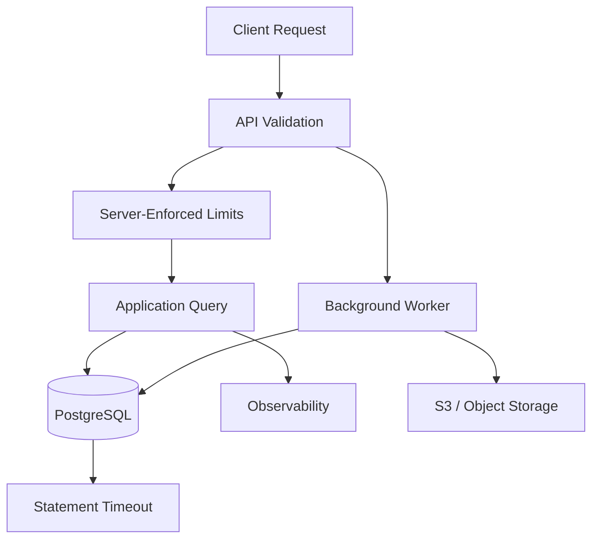

# 18- Unbounded Queries

## Overview

An **unbounded query** is a database query whose result size or amount of work is not deliberately constrained.

Typical examples include:

```sql
SELECT *
FROM orders;
```

or:

```sql
SELECT *
FROM orders
WHERE customer_id = $1;
```

when one customer can legitimately have millions of orders and the API does not impose pagination or another bounded access pattern.

The problem is not simply that the query returns many rows. An unbounded query can also cause the database to perform excessive work before producing the result:

- Large scans.
- Large sorts.
- Large joins.
- Large aggregations.
- Large result sets.
- High network transfer.
- High application memory consumption.
- Long-lived database connections.
- Excessive serialization/deserialization.
- Connection pool exhaustion.

The production principle is:

> **Every externally triggered database operation should have a deliberate bound on result size, execution work, or both.**

This does not mean every SQL statement must contain `LIMIT`. A reporting query may intentionally process millions of rows. The important distinction is whether the workload is **explicitly designed, controlled, and operationally isolated**.

---

## What Is an Unbounded Query?

An unbounded query has no meaningful upper bound on the amount of data it may return or process.

For example:

```sql
SELECT
    id,
    email
FROM customers;
```

If the table contains:

```text
10,000 rows
```

the query may be harmless.

If it later contains:

```text
100,000,000 rows
```

the same query has radically different operational characteristics.

This is a common production failure mode:

```text
small dataset
    ↓
query appears fast
    ↓
data grows
    ↓
query cost grows
    ↓
application latency increases
    ↓
connections remain busy
    ↓
database becomes overloaded
```

The SQL did not change.

The workload did.

---

## Why Unbounded Queries Are Dangerous

A database query consumes multiple resources.

```text
Client request
      ↓
Application
      ↓
PostgreSQL
 ┌───────────────┐
 │ CPU           │
 │ Memory        │
 │ I/O           │
 │ Locks         │
 │ Connections   │
 └───────────────┘
      ↓
Network transfer
      ↓
Application memory
      ↓
JSON serialization
      ↓
Client
```

An unbounded query can therefore amplify resource usage across the entire request path.

For a REST endpoint, one poorly designed query can become:

```text
database work
+
network transfer
+
Python object creation
+
JSON serialization
+
HTTP response size
```

---

## Result Bound vs Work Bound

A critical distinction is:

> **`LIMIT` bounds returned rows, but it does not necessarily bound all database work.**

Consider:

```sql
SELECT *
FROM orders
ORDER BY created_at DESC
LIMIT 100;
```

This may be efficient with an appropriate index.

But:

```sql
SELECT *
FROM orders
ORDER BY expensive_expression
LIMIT 100;
```

may still require substantial work to determine which 100 rows belong in the result.

Similarly:

```sql
SELECT *
FROM orders
WHERE status = 'completed'
LIMIT 100;
```

does not necessarily guarantee a cheap execution plan.

The database still needs to find 100 qualifying rows.

The senior-level question is:

> **What exactly is being bounded: returned rows, scanned rows, sorted rows, grouped rows, joined rows, or total execution time?**

---

## Unbounded Queries in APIs

A common anti-pattern is:

```http
GET /orders
```

with no pagination.

The backend may execute:

```sql
SELECT
    id,
    customer_id,
    total_amount,
    created_at
FROM orders
ORDER BY created_at DESC;
```

As the table grows, the endpoint becomes progressively more expensive.

A production API should usually expose a bounded interface:

```http
GET /orders?limit=50&cursor=...
```

with a server-enforced maximum.

---

## Client-Supplied Limits Are Not Enough

Do not assume:

```http
GET /orders?limit=50
```

means the database will always receive a bounded request.

A malicious or buggy client could send:

```http
GET /orders?limit=100000000
```

The API must validate and cap the value.

For example:

```python
from fastapi import Query

def list_orders(
    limit: int = Query(default=50, ge=1, le=100),
):
    ...
```

The server owns the maximum.

Do not delegate resource protection to clients.

---

## Pagination as a Boundary

Pagination is one of the primary ways to bound API result sets.

For example:

```sql
SELECT
    id,
    customer_id,
    total_amount,
    created_at
FROM orders
ORDER BY created_at DESC, id DESC
LIMIT $1;
```

The application can enforce:

```text
default page size = 50
maximum page size = 100
```

This prevents a normal API request from returning an arbitrary number of rows.

---

## Offset Pagination

A simple implementation is:

```sql
SELECT
    id,
    customer_id,
    total_amount,
    created_at
FROM orders
ORDER BY created_at DESC, id DESC
LIMIT 50
OFFSET 1000;
```

This bounds the response size.

However, deep offsets can still require the database to walk past many rows before returning the requested page.

For example:

```text
OFFSET 5,000,000
LIMIT 50
```

can be expensive.

`LIMIT` does not make a deep offset cheap.

---

## Keyset Pagination

For large datasets, keyset pagination can bound traversal more efficiently.

Example:

```sql
SELECT
    id,
    customer_id,
    total_amount,
    created_at
FROM orders
WHERE (created_at, id) < ($1, $2)
ORDER BY created_at DESC, id DESC
LIMIT 50;
```

The cursor represents the last row from the previous page.

A matching index can support efficient traversal:

```sql
CREATE INDEX orders_created_at_id_idx
ON orders (created_at DESC, id DESC);
```

The result is:

```text
first request
    ↓
50 rows
    ↓
cursor
    ↓
next 50 rows
    ↓
cursor
    ↓
next 50 rows
```

This is generally preferable to deep offset traversal for large ordered datasets.

---

## Deterministic Pagination

Pagination requires deterministic ordering.

Avoid:

```sql
ORDER BY created_at DESC
```

if many rows can share the same timestamp.

Prefer:

```sql
ORDER BY created_at DESC, id DESC
```

The unique identifier provides a stable tie-breaker.

Without deterministic ordering, rows can:

- Move between pages.
- Appear twice.
- Be skipped.

This is especially important for keyset pagination.

---

## Pagination Does Not Guarantee Snapshot Consistency

Suppose:

```text
Page 1
    ↓
new rows inserted
    ↓
Page 2
```

The second query may observe a different database state.

Cursor pagination improves traversal efficiency, but it does not automatically provide a consistent snapshot across all pages.

For applications that require a stable point-in-time dataset, consider a dedicated export or snapshot strategy rather than assuming normal API pagination provides snapshot semantics.

---

## Unbounded `SELECT *`

Another common anti-pattern is:

```sql
SELECT *
FROM customers
WHERE id = $1;
```

Even if the number of rows is bounded, the row width may not be.

A table might eventually contain:

```text
profile data
preferences
large JSONB documents
metadata
```

Selecting everything increases:

- I/O.
- Network transfer.
- Database-to-application bandwidth.
- Python object creation.
- Serialization cost.

Prefer explicit columns:

```sql
SELECT
    id,
    email,
    status,
    created_at
FROM customers
WHERE id = $1;
```

---

## Large Columns Make the Problem Worse

Suppose a table contains:

```text
id
name
status
profile JSONB
document BYTEA
metadata JSONB
```

Then:

```sql
SELECT *
FROM customers
LIMIT 100;
```

may transfer far more data than the API needs.

The number of rows is only one dimension of result size.

Think about:

```text
rows × row width
```

A query returning 1,000 rows containing large JSON or binary data can be more expensive than one returning 100,000 narrow rows.

---

## Unbounded Queries and ORM Behavior

ORMs can hide unbounded database access.

Django:

```python
customers = Customer.objects.all()
```

looks harmless.

But evaluating it can retrieve the entire result set.

This becomes dangerous when passed directly into serialization:

```python
CustomerSerializer(customers, many=True).data
```

A production API should paginate.

---

## Django Pagination

Django REST Framework provides pagination mechanisms.

Conceptually:

```python
from rest_framework.pagination import PageNumberPagination

class CustomerPagination(PageNumberPagination):
    page_size = 50
    page_size_query_param = "page_size"
    max_page_size = 100
```

The important property is:

```text
client-controlled page size
        ↓
server-enforced maximum
```

The API should never allow arbitrary result sizes.

For very large datasets, cursor-based pagination can be a better fit.

---

## FastAPI Pagination

FastAPI itself does not prescribe a database pagination strategy.

The endpoint should enforce limits explicitly:

```python
from fastapi import Query

async def list_orders(
    limit: int = Query(default=50, ge=1, le=100),
):
    ...
```

The repository/database layer should then use that bounded value.

Avoid:

```python
limit = request.query_params.get("limit")
```

followed by direct interpolation or unrestricted use.

Validate both:

- Type.
- Range.

---

## Unbounded Queries in gRPC

The same problem exists with gRPC.

Avoid an RPC that effectively means:

```text
ListAllOrders()
```

with an unlimited repeated response.

Prefer:

```text
ListOrders(
    page_size,
    page_token
)
```

with a server-side maximum.

A service should not assume internal gRPC clients are automatically trustworthy.

---

## Unbounded Queries in Microservices

An internal service can create the same problem as a public API.

For example:

```text
Service A
   ↓
GET /customers
   ↓
Service B
   ↓
SELECT all customers
```

The fact that the caller is another internal service does not eliminate resource limits.

Service-to-service contracts should define:

- Maximum page size.
- Pagination mechanism.
- Maximum response size.
- Timeouts.
- Rate limits where appropriate.

---

## Unbounded Joins

A query can be unbounded even if the final result appears constrained.

For example:

```sql
SELECT
    c.id,
    o.id
FROM customers AS c
JOIN orders AS o
    ON o.customer_id = c.id;
```

If one customer has millions of orders, the join can generate a huge intermediate result.

Joining multiple one-to-many relationships can multiply rows:

```text
customer
  × orders
  × payments
  × events
```

This can become dramatically larger than the final API response suggests.

---

## Limit Before Cardinality Expansion

If the requirement is:

> "Return the latest 20 orders for this customer."

prefer:

```sql
SELECT
    id,
    customer_id,
    total_amount,
    created_at
FROM orders
WHERE customer_id = $1
ORDER BY created_at DESC, id DESC
LIMIT 20;
```

Do not unnecessarily join several large relations before limiting the relevant order set.

For more complex queries, isolate the bounded relation first:

```sql
WITH latest_orders AS (
    SELECT
        id,
        customer_id,
        total_amount,
        created_at
    FROM orders
    WHERE customer_id = $1
    ORDER BY created_at DESC, id DESC
    LIMIT 20
)
SELECT
    lo.id,
    lo.total_amount,
    p.status
FROM latest_orders AS lo
LEFT JOIN payments AS p
    ON p.order_id = lo.id;
```

The exact query should still be validated with `EXPLAIN`.

---

## Aggregation Can Be Unbounded

Consider:

```sql
SELECT
    customer_id,
    SUM(total_amount)
FROM orders
GROUP BY customer_id;
```

The output may be relatively small, but PostgreSQL may need to process the entire `orders` table.

This is not necessarily an anti-pattern.

It is a legitimate analytical query if the requirement is to calculate all customers.

The anti-pattern is exposing it as an unrestricted user-facing operation without considering workload and capacity.

---

## Reporting Queries Are Different

Not every unbounded query should be forced into:

```sql
LIMIT 100;
```

A reporting job may legitimately need:

```text
millions of rows
```

The solution is workload isolation.

For example:

```text
REST API
   ↓
bounded OLTP query
   ↓
PostgreSQL primary

Reporting job
   ↓
controlled large query
   ↓
read replica / warehouse
```

Large queries are acceptable when they are intentional and appropriately isolated.

---

## OLTP vs Analytical Workloads

| Workload | Typical approach |
|---|---|
| User API | Bounded result |
| Admin listing | Pagination + maximum page size |
| Search | Pagination + result cap |
| Export | Background job |
| Analytics | Controlled large query |
| ETL | Batch processing |
| Data migration | Bounded batches |
| Internal reconciliation | Controlled batch |
| Full database scan | Maintenance/reporting workload |

The correct boundary depends on the workload.

---

## Export Endpoints

A common mistake is:

```http
GET /orders/export
```

which executes:

```sql
SELECT *
FROM orders;
```

and returns the entire dataset synchronously.

This can consume:

- Database connections.
- Application memory.
- CPU.
- Network bandwidth.
- HTTP worker capacity.

Prefer:

```text
POST /exports
      ↓
create export job
      ↓
Celery worker
      ↓
bounded database reads
      ↓
stream/write file
      ↓
S3
      ↓
download URL/status
```

This moves a large operation out of the synchronous request path.

---

## Streaming Large Results

Streaming can reduce application memory consumption.

Conceptually:

```text
PostgreSQL
    ↓
row batch
    ↓
application
    ↓
file/socket
    ↓
next batch
```

However, streaming does not make the query itself cheap.

The database may still perform:

- Large scans.
- Large sorts.
- Large joins.
- Long-running transactions.

Streaming solves one part of the problem: application-side buffering.

It does not eliminate database-side workload.

---

## Django Queryset Iteration

Django provides mechanisms such as:

```python
for customer in Customer.objects.iterator(chunk_size=1000):
    process(customer)
```

This can reduce application-side memory usage compared with materializing the entire queryset.

But it does not automatically make an unbounded database operation operationally safe.

For large jobs, also consider:

- Transaction duration.
- Query duration.
- Connection lifetime.
- Batch checkpoints.
- Error handling.
- Replica impact.

---

## Unbounded Queries and Timeouts

Result limits and timeouts solve different problems.

A query can return only 100 rows but still run for several minutes.

A database can therefore use safeguards such as:

```sql
SET LOCAL statement_timeout = '30s';
```

for appropriate workloads.

At the API layer, configure request timeouts as well.

Conceptually:

```text
API timeout
    ↓
application timeout
    ↓
database statement timeout
```

Timeouts should be designed coherently.

A database timeout should not be longer than an API request that will already be terminated, unless there is a specific reason.

---

## `LIMIT` Is Not a Universal Safety Mechanism

This query:

```sql
SELECT *
FROM orders
ORDER BY created_at DESC
LIMIT 100;
```

may be efficient with:

```sql
CREATE INDEX orders_created_at_id_idx
ON orders (created_at DESC, id DESC);
```

But:

```sql
SELECT *
FROM orders
ORDER BY lower(customer_name)
LIMIT 100;
```

may require substantially more work depending on the available indexes and data distribution.

The correct engineering approach is:

```text
bound result
+
bound query work
+
appropriate access path
+
timeout
```

---

## Indexes and Bounded Queries

Indexes can make bounded queries dramatically more efficient.

Suppose:

```sql
SELECT
    id,
    created_at,
    total_amount
FROM orders
WHERE customer_id = $1
ORDER BY created_at DESC, id DESC
LIMIT 50;
```

A suitable index might be:

```sql
CREATE INDEX orders_customer_created_id_idx
ON orders (
    customer_id,
    created_at DESC,
    id DESC
);
```

The database can efficiently locate the relevant customer's newest rows.

Without a suitable access path, the database may need to scan or sort substantially more data.

---

## Partial Indexes

If the API frequently queries a subset:

```sql
SELECT
    id,
    customer_id,
    created_at
FROM orders
WHERE customer_id = $1
  AND status = 'pending'
ORDER BY created_at DESC, id DESC
LIMIT 50;
```

a partial index may be appropriate:

```sql
CREATE INDEX orders_pending_customer_created_idx
ON orders (
    customer_id,
    created_at DESC,
    id DESC
)
WHERE status = 'pending';
```

This should be workload-driven.

Do not add indexes simply because a query contains `LIMIT`.

---

## Unbounded `IN` Lists

Applications can accidentally create another form of unbounded query:

```sql
SELECT *
FROM customers
WHERE id IN (...thousands or millions of values...);
```

The result may be bounded, but the request itself can become enormous.

Large ID lists can create:

- Large SQL statements.
- Network overhead.
- Planning overhead.
- Memory pressure.
- Poor application ergonomics.

For large sets, consider:

- Temporary tables.
- Staging tables.
- `VALUES`.
- PostgreSQL arrays with `ANY`.
- Server-side batch processing.

---

## Unbounded Search

Search endpoints often expose:

```http
GET /customers?name=...
```

without a maximum result size.

Even if the database query is indexed, returning thousands of matching records can overload the API.

Use:

```text
search
+
maximum result count
+
pagination
```

For example:

```sql
SELECT
    id,
    name,
    email
FROM customers
WHERE name ILIKE $1
ORDER BY id
LIMIT 50;
```

For large-scale search requirements, PostgreSQL full-text search, specialized indexes, or dedicated search infrastructure may be more appropriate.

---

## Unbounded JSON Aggregation

Be careful with:

```sql
SELECT
    customer_id,
    jsonb_agg(events)
FROM events
GROUP BY customer_id;
```

A customer with millions of events can produce a very large aggregate.

The output may contain only one row per customer while still consuming substantial memory and processing resources.

Bound the underlying relation when the requirement permits:

```sql
SELECT
    customer_id,
    jsonb_agg(event_data ORDER BY created_at DESC)
FROM (
    SELECT
        customer_id,
        event_data,
        created_at
    FROM events
    WHERE customer_id = $1
    ORDER BY created_at DESC, id DESC
    LIMIT 100
) AS recent_events
GROUP BY customer_id;
```

The exact implementation should be validated against the required semantics.

---

## Unbounded `COUNT(*)`

An exact count can be expensive on large tables:

```sql
SELECT COUNT(*)
FROM orders;
```

Do not assume that because the result is a single integer, the operation is cheap.

For large tables, PostgreSQL may need to inspect a large amount of data to calculate the exact result.

For user-facing pagination, ask whether the application actually requires an exact total.

Alternatives include:

- Omit total counts.
- Return `has_next`.
- Use approximate counts where acceptable.
- Maintain precomputed counters when justified.

---

## `COUNT` for Pagination

A common API implementation is:

```text
SELECT page
SELECT COUNT(*)
```

for every request.

For large datasets, the count can become a significant portion of the request cost.

If the UI only needs:

```text
"Next page available"
```

fetch:

```sql
LIMIT page_size + 1
```

and determine whether an additional row exists.

This can eliminate an expensive exact count.

---

## Unbounded ORM Serialization

Even if the database query is acceptable, serialization can become the bottleneck.

Consider:

```python
queryset = Order.objects.all()
serializer = OrderSerializer(queryset, many=True)
```

The full pipeline can become:

```text
DB rows
  ↓
Django model objects
  ↓
serializer
  ↓
Python dictionaries
  ↓
JSON encoding
  ↓
HTTP response
```

The database is only one part of the resource consumption.

---

## Response Size Limits

API boundaries should also consider payload size.

A response with:

```text
10,000 rows × 20 KB
```

is approximately:

```text
200 MB
```

before considering serialization and protocol overhead.

Even if PostgreSQL can produce the result quickly, sending it synchronously is usually poor API design.

Use:

- Pagination.
- Field selection.
- Compression where appropriate.
- Background exports.
- Object storage for large files.

---

## Security Considerations

Unbounded queries can become an availability vulnerability.

An attacker may repeatedly request:

```http
GET /orders?limit=1000000
```

or trigger expensive filters and sorts.

This can become a form of resource-exhaustion attack.

Protect APIs with:

- Authentication where appropriate.
- Authorization.
- Maximum page sizes.
- Request timeouts.
- Rate limiting.
- Query complexity limits.
- Maximum export sizes or asynchronous exports.
- Database statement timeouts.
- Connection pool limits.

Never rely on database capacity alone to absorb abusive queries.

---

## Multi-Tenant Systems

Multi-tenant systems need particularly careful bounds.

Avoid:

```sql
SELECT *
FROM orders
ORDER BY created_at DESC
LIMIT 100;
```

if tenant isolation is expected.

Prefer:

```sql
SELECT
    id,
    created_at,
    total_amount
FROM orders
WHERE tenant_id = $1
ORDER BY created_at DESC, id DESC
LIMIT 100;
```

The tenant predicate is both a security and performance boundary.

A tenant with millions of records should not accidentally cause queries across the entire database.

---

## Row-Level Security

PostgreSQL Row-Level Security can provide an additional database-side authorization boundary.

However, RLS does not eliminate the need for application-level result limits.

You can have:

```text
RLS
  ↓
authorized 50 million rows
  ↓
unbounded query
```

The query may still be expensive.

Security boundaries and resource boundaries solve different problems.

---

## Redis and Caching

Caching can reduce repeated database queries:

```text
API
 ↓
Redis
 ↓ cache miss
PostgreSQL
```

But caching an enormous unbounded result is usually a poor design.

Avoid:

```text
Redis key
→ all customers
```

Instead cache bounded or purpose-specific results:

```text
customer:{id}:summary
```

or:

```text
orders:{customer_id}:recent
```

Caching should reduce work, not hide an unbounded data model.

---

## Kafka and Unbounded Consumers

The same principle applies to event processing.

A consumer should not attempt to load an arbitrarily large backlog into memory:

```text
Kafka
  ↓
consume entire topic backlog
  ↓
Python list
```

Process messages in bounded batches:

```text
Kafka
  ↓
batch
  ↓
process
  ↓
commit offset
  ↓
next batch
```

This keeps memory and failure scope bounded.

---

## Celery and Background Jobs

Large operations should often move from synchronous APIs to background workers.

For example:

```text
POST /exports
      ↓
create job
      ↓
Celery
      ↓
bounded database batches
      ↓
S3
      ↓
job completed
```

The API remains responsive while the large workload is controlled independently.

---

## AWS Considerations

Unbounded queries can create costs across multiple AWS components:

```text
Application
  ↓
RDS PostgreSQL
  ↓
CPU / I/O
  ↓
replication
  ↓
network transfer
```

Potentially affected resources include:

- Amazon RDS or Aurora capacity.
- Read replicas.
- EBS storage I/O.
- Application instances.
- NAT/network paths depending on architecture.
- S3 for large exports.
- CloudWatch monitoring.

A bounded API query is therefore not only a performance optimization but also a cost-control mechanism.

---

## High Availability and Replicas

Large queries on a primary can affect transaction processing.

For read-heavy analytical workloads, consider:

```text
OLTP API
   ↓
Primary

Reporting
   ↓
Read Replica / Warehouse
```

However, replicas are not free compute capacity.

A large query on a read replica can:

- Consume CPU.
- Consume memory.
- Increase I/O.
- Compete with replication apply.
- Increase replica lag.

Use workload isolation rather than simply redirecting every expensive query to a replica.

---

## Monitoring Unbounded Queries

Monitor query characteristics such as:

- Execution time.
- Rows returned.
- Rows scanned.
- Temporary files.
- Buffer reads.
- CPU.
- Connection duration.
- Response size.
- API latency.

For PostgreSQL:

```sql
EXPLAIN (ANALYZE, BUFFERS)
SELECT
    id,
    customer_id,
    total_amount
FROM orders
WHERE customer_id = $1
ORDER BY created_at DESC, id DESC
LIMIT 100;
```

Compare:

```text
rows returned
vs
rows processed
```

A query returning 100 rows after processing 50 million rows is still operationally expensive.

---

## Query Statistics

Where `pg_stat_statements` is available, use it to identify expensive query patterns.

Useful signals include:

- Total execution time.
- Mean execution time.
- Number of calls.
- Rows returned.
- Shared block reads/hits.
- Temporary block activity depending on available statistics.

High total time can indicate a query that is moderately expensive but called extremely frequently.

High mean time can indicate a query that is individually expensive.

Both matter.

---

## API Observability

Track:

```text
endpoint
page_size
rows_returned
response_bytes
database_duration
serialization_duration
total_duration
```

For example:

```text
GET /orders
page_size=100
rows_returned=100
response_bytes=184000
database_duration_ms=42
serialization_duration_ms=18
total_duration_ms=75
```

This allows engineers to distinguish:

```text
database problem
```

from:

```text
payload / serialization problem
```

---

## Testing

Test APIs against realistic data volumes.

Do not only test:

```text
1,000 orders
```

Test:

```text
1 million orders
10 million orders
```

where production behavior depends on data scale.

Test:

- Maximum page size.
- Invalid page size.
- Deep pagination.
- Large tenant.
- Empty result.
- Large row width.
- Concurrent requests.
- Slow queries.
- Timeout behavior.
- Export workloads.

Load testing should include worst-case but legitimate query patterns.

---

## Production Guardrails

A mature API often has multiple layers of protection:



Examples of guardrails:

- Maximum page size.
- Maximum export range.
- Query timeouts.
- Connection limits.
- Rate limits.
- Background processing.
- Database indexes.
- Monitoring and alerting.

No single control is sufficient for every workload.

---

## Choosing the Right Strategy

| Requirement | Recommended approach |
|---|---|
| Normal API listing | Pagination |
| Large dataset API | Cursor/keyset pagination |
| Deep page navigation | Keyset pagination |
| Large export | Background job |
| Full-table analytics | Controlled analytical workload |
| Large migration | Batch processing |
| Large event processing | Bounded consumer batches |
| Exact count on huge table | Use only when necessary |
| Large response payload | Pagination or object storage |
| Repeated expensive query | Consider caching/materialization |
| Expensive reporting | Read replica/warehouse where appropriate |
| User-controlled query | Strict limits + timeouts |

---

## A Production Pagination Pattern

A robust API typically follows:

```text
Client
  ↓
request page
  ↓
validate cursor/page size
  ↓
enforce maximum
  ↓
execute indexed query
  ↓
return bounded result
  ↓
generate next cursor
```

Example:

```sql
SELECT
    id,
    customer_id,
    total_amount,
    created_at
FROM orders
WHERE customer_id = $1
  AND (created_at, id) < ($2, $3)
ORDER BY created_at DESC, id DESC
LIMIT $4;
```

The corresponding index:

```sql
CREATE INDEX orders_customer_created_id_idx
ON orders (
    customer_id,
    created_at DESC,
    id DESC
);
```

This aligns:

```text
tenant/customer filter
+
cursor predicate
+
ordering
+
bounded result
```

with one access path.

---

## Common Mistakes

### Mistake: Returning Every Row from an API

```sql
SELECT *
FROM orders;
```

**Why it happens:** the dataset is initially small.

**Avoid it:** paginate and enforce a maximum page size.

### Mistake: Trusting Client-Supplied Limits

```http
?limit=10000000
```

**Why it happens:** the developer assumes clients will behave correctly.

**Avoid it:** enforce server-side maximums.

### Mistake: Believing `LIMIT` Makes Any Query Cheap

A query can still perform expensive joins, sorts, or scans before producing the limited result.

**Avoid it:** inspect the execution plan and design appropriate indexes and predicates.

### Mistake: Using Deep `OFFSET`

```sql
OFFSET 5000000 LIMIT 50
```

**Why it happens:** offset pagination is easy to implement.

**Avoid it:** use keyset/cursor pagination for large ordered datasets.

### Mistake: Using `SELECT *`

**Why it happens:** it is convenient during development.

**Avoid it:** select only fields required by the endpoint.

### Mistake: Returning Large JSON Documents

**Why it happens:** database row count is treated as the only measure of response size.

**Avoid it:** consider row width, payload size, and field selection.

### Mistake: Running Full Exports Synchronously

**Why it happens:** the export initially works with small data.

**Avoid it:** use background workers and object storage.

### Mistake: Assuming Streaming Solves Everything

Streaming reduces application buffering but does not eliminate database scans, joins, sorting, or transaction lifetime.

**Avoid it:** control both database work and application memory.

### Mistake: Running Exact `COUNT(*)` on Every Page

**Why it happens:** pagination UIs often want total counts.

**Avoid it:** return `has_next`, use approximate counts, or maintain counters when appropriate.

### Mistake: Ignoring Internal APIs

**Why it happens:** internal clients are considered trusted.

**Avoid it:** enforce resource limits at service boundaries too.

### Mistake: Forgetting Tenant Boundaries

**Why it happens:** authorization and query design are treated separately.

**Avoid it:** include tenant predicates explicitly and enforce authorization through appropriate database/application mechanisms.

---

## Production Checklist

- [ ] Does every user-facing list endpoint have a bounded result size?
- [ ] Is the maximum page size enforced server-side?
- [ ] Is pagination deterministic?
- [ ] Is keyset pagination used for large ordered datasets where appropriate?
- [ ] Are deep `OFFSET` queries avoided?
- [ ] Are only required columns selected?
- [ ] Are large JSON/BLOB fields excluded unless required?
- [ ] Are large joins controlled?
- [ ] Is join cardinality understood?
- [ ] Are expensive aggregations intentionally bounded or isolated?
- [ ] Are exact counts actually required?
- [ ] Are large exports asynchronous?
- [ ] Are background jobs batch-oriented?
- [ ] Are database statement timeouts configured appropriately?
- [ ] Are API timeouts configured?
- [ ] Are indexes aligned with filtering and ordering?
- [ ] Are tenant boundaries enforced?
- [ ] Are maximum request sizes enforced?
- [ ] Are response sizes monitored?
- [ ] Are query execution plans reviewed?
- [ ] Has the endpoint been load-tested with production-scale data?
- [ ] Are expensive workloads isolated from OLTP traffic?
- [ ] Are database CPU, I/O, connections, and replica lag monitored?

---

## Interview Traps

### Does every SQL query need a `LIMIT`?

No. Analytical and maintenance workloads may intentionally process large datasets. The important requirement is that the workload is deliberate and operationally controlled.

### Does `LIMIT 100` guarantee that a query is cheap?

No. The database may still need to scan, sort, join, or aggregate a large amount of data before producing those 100 rows.

### Why is keyset pagination better than deep offset pagination?

Keyset pagination uses values from the previous page as a continuation point, allowing an appropriate index to seek toward the next rows instead of repeatedly skipping a large prefix.

### Is streaming equivalent to pagination?

No. Streaming controls how results are consumed and buffered, while pagination limits the logical result set exposed to a client.

### Why can `COUNT(*)` be expensive?

An exact count over a large relation can require substantial database work even though the result contains only one integer.

### Should reporting queries always be limited?

No. Reports may legitimately require large scans. They should instead be controlled, scheduled, optimized, and potentially isolated on replicas or analytical systems.

### Can an unbounded query cause an outage?

Yes. Large scans or result sets can consume database CPU, I/O, connections, application memory, network bandwidth, and worker capacity, especially when many clients execute them concurrently.

### Is `SELECT *` always an unbounded query?

No. `SELECT *` concerns column selection, while unboundedness primarily concerns the amount of data or work. However, `SELECT *` can significantly amplify the cost of a large result.

### Why should internal APIs have query limits?

Internal services can still generate accidental or malicious resource exhaustion. Service boundaries should protect shared infrastructure regardless of whether the caller is internal.

## Key Takeaways

- **Unbounded queries are a production risk because result size and database work can grow with data volume, affecting CPU, I/O, memory, connections, network bandwidth, and application resources.**
- **Bound API results with server-enforced pagination limits, and prefer deterministic keyset pagination for large ordered datasets instead of deep `OFFSET` traversal.**
- **`LIMIT` alone does not guarantee a cheap query; joins, sorting, aggregation, filtering, and poor access paths can still require substantial database work.**
- **Large exports, analytics, migrations, and event processing should use deliberate workload isolation, batching, background workers, replicas, or analytical infrastructure rather than unrestricted synchronous API queries.**
- **Design query boundaries around both correctness and resource consumption: explicit columns, tenant predicates, appropriate indexes, timeouts, observability, and production-scale testing are all part of preventing unbounded workloads.**