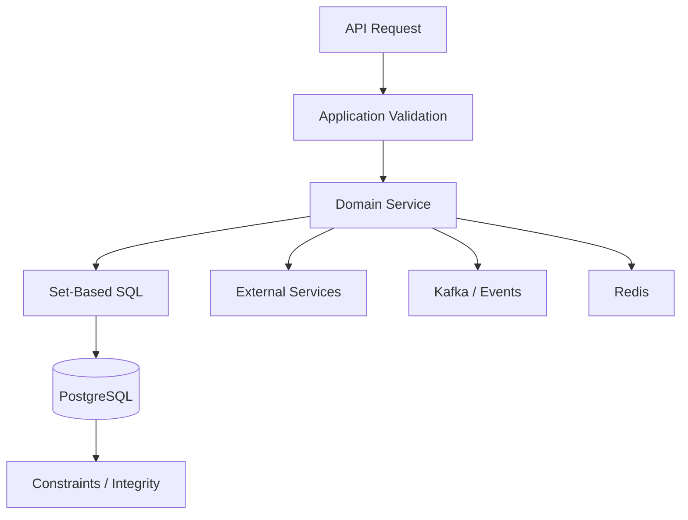
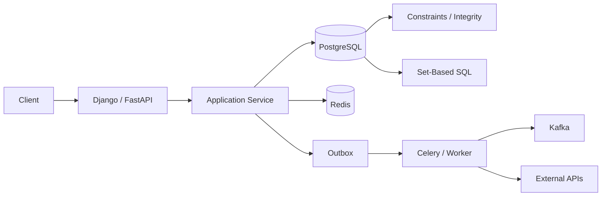

# 19- Application Logic in SQL

## Overview

SQL is designed to express data operations, constraints, filtering, aggregation, joins, and set-based transformations. Modern relational databases are also capable of expressing surprisingly sophisticated business behavior.

The anti-pattern begins when an application progressively moves **domain and workflow logic into SQL** until the database becomes the primary application runtime.

For example, a healthy separation might look like:

```text
FastAPI / Django
    ↓
Application service
    ↓
PostgreSQL
    ├── constraints
    ├── atomic updates
    ├── queries
    └── database-local operations
```

An overgrown design can become:

```text
API
 ↓
thin controller
 ↓
huge SQL statement / procedure
 ├── pricing rules
 ├── eligibility rules
 ├── workflow state machine
 ├── authorization
 ├── notifications
 ├── external-service assumptions
 └── business orchestration
```

The database is excellent at data-centric work, but it is not automatically the correct place for every business rule.

The senior engineering question is:

> **Which logic benefits from being executed close to the data, and which logic belongs in the application or service layer?**

---

## What Is Application Logic in SQL?

Application logic in SQL is behavior that goes beyond straightforward data access and starts implementing domain decisions, workflows, or orchestration directly inside SQL.

Examples include:

```sql
CASE
    WHEN customer_status = 'vip'
         AND lifetime_value > 10000
    THEN ...
    WHEN ...
    THEN ...
END
```

Some conditional logic is completely appropriate.

The problem is when the query becomes responsible for an entire domain workflow:

```text
calculate eligibility
    ↓
calculate pricing
    ↓
change subscription
    ↓
insert audit
    ↓
create notification
    ↓
determine Kafka event
    ↓
update multiple unrelated entities
```

The complexity belongs somewhere, but SQL is not necessarily the best place for all of it.

---

## Why SQL Supports Complex Logic

SQL provides powerful constructs:

- `CASE`.
- `COALESCE`.
- `EXISTS`.
- Subqueries.
- CTEs.
- Window functions.
- Aggregations.
- Constraints.
- Triggers.
- Functions.
- Stored procedures.

These capabilities allow substantial logic to execute inside PostgreSQL.

That is useful because:

```text
data
 ↓
database operation
 ↓
database result
```

can be much more efficient than:

```text
database
 ↓
transfer many rows
 ↓
Python
 ↓
loop
 ↓
calculate
 ↓
write results back
```

The anti-pattern is not "complex SQL."

The anti-pattern is **using SQL as a substitute for application architecture when the logic is not fundamentally data-centric**.

---

## Data Logic vs Domain Logic

A useful distinction is:

| Logic | Typical owner |
|---|---|
| Filtering rows | Database |
| Joining relations | Database |
| Aggregation | Database |
| Referential integrity | Database |
| Uniqueness | Database |
| Check constraints | Database |
| Atomic state transition | Database + application |
| Data reconciliation | Often database |
| Pricing calculation | Often application |
| API validation | Application |
| External API orchestration | Application |
| Kafka publishing | Application/worker |
| Redis caching | Application |
| Email notification | Application/worker |
| Cross-service workflow | Application |
| User-facing workflow | Application |

This is a guideline, not an absolute rule.

---

## Database Integrity Should Stay in the Database

If a rule must always hold regardless of which application writes the data, the database is often the correct enforcement point.

For example:

```sql
ALTER TABLE order_items
ADD CONSTRAINT order_items_quantity_positive
CHECK (quantity > 0);
```

Or:

```sql
CREATE UNIQUE INDEX users_email_unique_idx
ON users (email);
```

These are not examples of harmful application logic in SQL.

They are examples of **database-enforced invariants**.

The database should generally own:

```text
What data states are valid?
```

The application should generally own:

```text
What business workflow should happen?
```

---

## Constraints Before Procedural Logic

Suppose the requirement is:

> A customer cannot have two active subscriptions for the same product.

A procedural approach might first check:

```sql
SELECT 1
FROM subscriptions
WHERE customer_id = $1
  AND product_id = $2
  AND status = 'active';
```

and then insert.

Under concurrency:

```text
Transaction A → no active subscription
Transaction B → no active subscription
Transaction A → INSERT
Transaction B → INSERT
```

A database constraint can enforce the invariant.

For PostgreSQL:

```sql
CREATE UNIQUE INDEX subscriptions_active_unique_idx
ON subscriptions (customer_id, product_id)
WHERE status = 'active';
```

The application can still perform validation for user experience, but the database remains the final authority for the invariant.

---

## When SQL Logic Is Appropriate

SQL is usually the right place for logic that is:

- Set-based.
- Data-local.
- Declarative.
- Closely tied to relational structure.
- Required for atomicity.
- Better executed without transferring large datasets.

For example:

```sql
SELECT
    customer_id,
    COUNT(*) AS order_count,
    SUM(total_amount) AS lifetime_revenue
FROM orders
WHERE status = 'completed'
GROUP BY customer_id;
```

This belongs naturally in SQL.

Trying to fetch every order into Python and calculate these values there is often inferior.

---

## Set-Based Processing

Databases are optimized for operating on sets.

Avoid:

```python
orders = Order.objects.all()

for order in orders:
    if order.status == "completed":
        calculate_revenue(order)
```

when the operation can be expressed efficiently in SQL:

```sql
SELECT
    customer_id,
    SUM(total_amount) AS revenue
FROM orders
WHERE status = 'completed'
GROUP BY customer_id;
```

Moving a data transformation into SQL can improve:

- Network efficiency.
- Database locality.
- Query performance.
- Memory usage.
- Overall throughput.

The correct goal is not minimizing SQL.

It is minimizing inappropriate work in the wrong layer.

---

## Where the Anti-Pattern Begins

Consider:

```sql
SELECT
    CASE
        WHEN customer_tier = 'gold'
             AND monthly_spend > 5000
             AND failed_payments = 0
        THEN ...
        WHEN customer_tier = 'silver'
             AND monthly_spend > 2000
             AND account_age_days > 365
        THEN ...
        ...
    END AS pricing_tier
FROM customers;
```

A moderate amount of business classification can be reasonable.

But if the expression becomes hundreds of lines of nested rules, the SQL becomes a difficult place to maintain domain behavior.

Typical symptoms:

- Deeply nested `CASE`.
- Dozens of CTEs.
- Complex correlated subqueries.
- Repeated business constants.
- Embedded workflow state transitions.
- Logic duplicated across queries.
- Application code that merely calls SQL.
- Difficult-to-test behavior.

---

## Complex `CASE` Expressions

`CASE` is not inherently an anti-pattern.

Good:

```sql
SELECT
    id,
    CASE
        WHEN total_amount >= 1000 THEN 'high'
        WHEN total_amount >= 100 THEN 'medium'
        ELSE 'low'
    END AS order_category
FROM orders;
```

This is a straightforward data classification.

The problem is:

```text
CASE
 ├── pricing
 ├── promotions
 ├── customer history
 ├── geography
 ├── subscription rules
 ├── feature flags
 ├── time windows
 └── exceptions
```

At that point, consider whether the domain decision belongs in application code or a dedicated rules system.

---

## Business Rules That Change Frequently

Frequently changing business logic is often easier to maintain in application code.

For example:

```text
if customer.is_vip:
    discount = 0.20
elif customer.region == "EU":
    discount = 0.15
elif customer.subscription_age > 365:
    discount = 0.10
```

If product requirements change these rules every week, embedding them across multiple SQL queries can create significant maintenance cost.

Application code generally provides better:

- Unit testing.
- Refactoring.
- Code navigation.
- Debugging.
- Version control.
- IDE support.
- Feature-branch workflows.

---

## Business Rules That Rarely Change

Stable, data-centric rules may be better candidates for database enforcement.

Examples:

```text
quantity > 0
balance >= 0
unique active subscription
valid foreign key
valid date range
```

Prefer database-native mechanisms where possible:

```sql
CHECK
UNIQUE
FOREIGN KEY
EXCLUDE
NOT NULL
```

This avoids duplicating critical invariants across applications.

---

## Application Logic vs SQL: A Practical Boundary



The application coordinates the workflow.

The database performs data-centric operations and enforces integrity.

---

## SQL Should Not Become a Workflow Engine

Consider:

```text
Create subscription
    ↓
calculate price
    ↓
charge payment provider
    ↓
update subscription
    ↓
send email
    ↓
publish Kafka event
    ↓
invalidate Redis
```

Trying to represent the entire workflow as SQL creates an architectural mismatch.

A better design is:

```text
Application service
    ↓
short database transaction
    ↓
persist state + outbox
    ↓
commit
    ↓
worker
    ├── Kafka
    ├── email
    └── cache invalidation
```

The database owns its local atomicity.

The application owns distributed orchestration.

---

## SQL and External APIs

Do not make database queries depend conceptually on:

```text
HTTP
Stripe
AWS APIs
Kafka
Redis
SMTP
gRPC services
```

PostgreSQL should not become a distributed integration engine.

The database transaction cannot atomically include arbitrary external services.

Use an application service or worker:

```text
PostgreSQL
    ↓
transactional outbox
    ↓
worker
    ↓
external systems
```

---

## SQL and Kafka

Suppose an order is created and an event must be published.

Do not rely on:

```text
SQL transaction
+
Kafka publish
```

as one atomic operation.

Instead:

```sql
BEGIN;

INSERT INTO orders (...);

INSERT INTO outbox_events (
    event_type,
    aggregate_id,
    payload
)
VALUES (
    'order.created',
    $1,
    $2
);

COMMIT;
```

A worker then publishes the outbox event to Kafka.

This keeps SQL responsible for durable local state and the application responsible for event delivery.

---

## SQL and Redis

Avoid embedding cache management into database logic.

For example, do not make a database routine conceptually responsible for:

```text
UPDATE customer
    ↓
invalidate Redis
    ↓
rebuild Redis cache
```

Redis is outside the database transaction.

Prefer:

```text
database commit
    ↓
event/outbox
    ↓
worker
    ↓
Redis invalidation/update
```

This produces explicit failure and retry semantics.

---

## SQL and Celery

Celery is appropriate for workflows that are:

- Long-running.
- Retryable.
- External-system dependent.
- Asynchronous.
- Resource-intensive.

For example:

```text
API
 ↓
create job
 ↓
Celery
 ↓
database query
 ↓
process data
 ↓
external API
 ↓
update status
```

Do not create a huge SQL statement simply to avoid implementing a background workflow.

---

## SQL and REST APIs

An API should expose domain operations rather than exposing raw SQL behavior.

Prefer:

```http
POST /orders/{id}/cancel
```

over an endpoint that effectively exposes:

```text
execute arbitrary update
```

The service can validate:

- Authentication.
- Authorization.
- State transition.
- Request semantics.

Then use SQL for the atomic database operation.

---

## SQL and gRPC

The same principle applies to internal RPCs.

A gRPC method such as:

```text
FinalizeOrder
```

can call:

```text
application service
    ↓
database transaction
    ↓
atomic SQL
```

The RPC should not merely expose an enormous database procedure as the service's domain model.

---

## Complex Queries Are Not Automatically Bad

A senior engineer should not confuse:

```text
complex SQL
```

with:

```text
bad architecture
```

A reporting query containing:

- CTEs.
- Window functions.
- Aggregations.
- Multiple joins.

may be exactly the correct implementation.

The concern is when the SQL starts encoding behavior that is:

- Not data-centric.
- Highly volatile.
- Cross-service.
- External-system dependent.
- Difficult to test.
- Duplicated across many queries.

---

## Query Complexity vs Business Complexity

These are different.

### Complex SQL, Simple Business Rule

```sql
SELECT
    customer_id,
    SUM(total_amount)
FROM orders
WHERE status = 'completed'
GROUP BY customer_id;
```

The SQL is technically sophisticated but represents a simple data operation.

### Simple SQL, Complex Business Rule

```sql
SELECT status
FROM subscriptions
WHERE id = $1;
```

The query is simple, but the application may need to decide:

```text
Can cancel?
Can refund?
Can downgrade?
Is there a contract?
Does cancellation require notice?
Should an event be emitted?
```

The complexity belongs in the domain/service layer.

---

## Stored Procedures

Stored procedures are a legitimate database feature.

They are appropriate for:

- Database-centric operations.
- Set-based transformations.
- Controlled administrative workflows.
- Atomic database operations.
- Reusable database-side functionality.

They become problematic when they contain:

```text
entire application workflows
```

A procedure should have a clear responsibility.

Avoid a procedure such as:

```text
process_everything_for_customer()
```

that internally handles unrelated business domains.

---

## Triggers

Triggers can enforce or automate database-local behavior.

For example:

```text
INSERT order
    ↓
trigger
    ↓
audit row
```

This can be appropriate for audit or integrity requirements.

But triggers can make application behavior implicit:

```text
INSERT
  ↓
trigger A
  ↓
trigger B
  ↓
function
  ↓
another table
  ↓
another trigger
```

This makes request behavior difficult to understand.

Use triggers carefully and document their side effects.

---

## Hidden Side Effects

A dangerous SQL design is one where a simple operation has unexpected consequences.

Application code:

```python
Order.objects.filter(id=order_id).update(status="cancelled")
```

may look like a single update.

But if the database has:

```text
trigger
 ↓
update inventory
 ↓
insert audit
 ↓
insert notification
 ↓
update another table
```

the true behavior is much larger.

This complicates:

- Debugging.
- Testing.
- Performance analysis.
- Deployment.
- Incident response.

Critical side effects should be visible in architecture and observability.

---

## SQL Logic and Testing

Application logic is generally easier to unit test in Python:

```python
def calculate_discount(customer):
    ...
```

than a deeply nested SQL expression spread across several queries.

SQL should still be tested where it owns behavior.

Use:

```text
unit tests
    ↓
domain logic

integration tests
    ↓
SQL / database behavior

end-to-end tests
    ↓
API + application + database
```

Do not attempt to move logic into SQL merely because it is difficult to test in Python.

---

## Database-Specific Logic

One legitimate reason to use SQL is when the behavior depends heavily on database capabilities.

Examples:

- PostgreSQL window functions.
- Recursive queries.
- PostgreSQL-specific operators.
- Advanced indexing.
- Full-text search.
- Exclusion constraints.
- `ON CONFLICT`.
- `SKIP LOCKED`.

Forcing such behavior into generic application code may produce worse performance and more code.

Database-specific functionality is not automatically technical debt.

The question is whether the dependency is intentional.

---

## Portability Trade-Off

Heavy SQL logic can increase database coupling.

For example:

```sql
ON CONFLICT
```

is PostgreSQL-specific.

So are many PostgreSQL features such as:

```text
JSONB operators
ILIKE
FILTER
SKIP LOCKED
specific index types
```

If PostgreSQL is a deliberate architectural choice, this may be perfectly acceptable.

Do not sacrifice useful PostgreSQL capabilities solely for theoretical portability.

However, understand the trade-off.

---

## ORM Abstraction Leakage

ORMs can make application logic appear separate from SQL while still generating complex SQL.

For example:

```python
queryset.annotate(
    ...
).filter(
    ...
)
```

may produce a query containing:

- Subqueries.
- Windows.
- Aggregations.
- Complex joins.

The ORM does not eliminate SQL complexity.

A senior engineer should inspect generated SQL when behavior or performance is unclear.

---

## Avoid N+1 Application Logic

Ironically, avoiding SQL application logic can go too far.

This is also bad:

```python
orders = Order.objects.all()

for order in orders:
    customer = Customer.objects.get(id=order.customer_id)
```

This creates N+1 queries.

A set-based database operation may be much better:

```python
orders = (
    Order.objects
    .select_related("customer")
    .all()
)
```

The goal is not:

```text
minimum SQL
```

or:

```text
minimum Python
```

The goal is:

> **Place each operation in the layer that can perform it efficiently and maintainably.**

---

## Performance Considerations

Moving computation into SQL can be beneficial when:

```text
large dataset
    ↓
database aggregation/filtering
    ↓
small result
    ↓
application
```

This is often better than:

```text
large dataset
    ↓
network
    ↓
Python
    ↓
process everything
```

But complex SQL can also overload the database.

The database is shared infrastructure.

Monitor:

- CPU.
- I/O.
- Query latency.
- Lock waits.
- Memory.
- Connections.
- Temporary files.

---

## Database CPU vs Application CPU

Consider:

```text
100 application pods
        ↓
PostgreSQL
        ↓
expensive SQL logic
```

Scaling the application horizontally may not help.

The bottleneck is now:

```text
shared PostgreSQL CPU
```

By contrast, CPU-heavy Python logic can often scale across multiple application workers.

This does not mean CPU-intensive logic belongs in Python automatically.

It means resource ownership must be considered.

---

## Query Plans

For SQL-heavy business logic, inspect the execution plan:

```sql
EXPLAIN (ANALYZE, BUFFERS)
SELECT ...;
```

Look for:

- Sequential scans.
- Nested loops.
- Hash joins.
- Sorts.
- Large intermediate relations.
- Incorrect cardinality estimates.
- Temporary file usage.
- Repeated subplans.

A complicated query should be justified by both:

```text
correctness
+
measured performance
```

---

## CTEs and Application Logic

CTEs can improve query structure:

```sql
WITH recent_orders AS (...),
customer_metrics AS (...)
SELECT ...
```

But excessive CTE decomposition can turn SQL into a procedural-looking application.

Avoid:

```text
CTE 1
 ↓
CTE 2
 ↓
CTE 3
 ↓
CTE 4
 ↓
CTE 5
 ↓
CTE 6
```

when the stages do not represent meaningful relational concepts.

Use CTEs where they improve reasoning, reuse, recursion, or execution semantics.

---

## Transactions and Application Logic

Transactions are a shared boundary between SQL and application code.

For example:

```python
from django.db import transaction

with transaction.atomic():
    create_order()
    reserve_inventory()
    create_outbox_event()
```

The application defines the workflow.

The database guarantees atomicity for the local transaction.

This is often a better architecture than hiding the entire workflow inside one large database routine.

---

## Atomic SQL Can Replace Race-Prone Application Logic

Avoid:

```python
account = get_account()

if account.balance >= amount:
    account.balance -= amount
    account.save()
```

when concurrent requests can modify the same account.

Use atomic SQL:

```sql
UPDATE accounts
SET balance = balance - $1
WHERE id = $2
  AND balance >= $1
RETURNING balance;
```

The application still owns the business workflow, while PostgreSQL owns the atomic state transition.

This is an excellent example of the right boundary.

---

## Security Considerations

Complex SQL can create security risks if authorization logic is duplicated or hidden.

For example:

```sql
SELECT *
FROM orders
WHERE customer_id = $1;
```

may be insufficient in a multi-tenant system if the query also needs:

```sql
AND tenant_id = $2
```

Authorization should be explicit.

Use appropriate combinations of:

- Application authorization.
- Database roles.
- Row-Level Security.
- Tenant predicates.
- Least-privilege access.

Do not assume that moving authorization logic into SQL automatically makes it secure.

---

## Parameterization

Application logic in SQL must still use parameterized queries.

Unsafe:

```python
query = f"""
    SELECT *
    FROM orders
    WHERE customer_id = {customer_id}
"""
```

Prefer:

```python
cursor.execute(
    """
    SELECT
        id,
        total_amount
    FROM orders
    WHERE customer_id = %s
    """,
    [customer_id],
)
```

Complex SQL does not justify unsafe string construction.

---

## Maintainability

Overly complex SQL can be difficult to maintain because:

- IDE tooling may be weaker than application tooling.
- Refactoring is less discoverable.
- Business behavior can be hidden in database objects.
- Application developers may not know where logic lives.
- Database migrations become more complex.
- Multiple queries may duplicate the same rule.

This is especially problematic when business logic is spread across:

```text
views
+
functions
+
procedures
+
triggers
+
application code
```

without clear ownership.

---

## Duplication Across SQL Queries

One of the strongest warning signs is repeated business logic.

For example:

```text
Order API
    → pricing CASE

Invoice API
    → pricing CASE

Reporting query
    → pricing CASE

Background job
    → pricing CASE
```

Now the same business rule exists in four places.

When pricing changes:

```text
change 4 implementations
```

A domain service or centralized database abstraction may be more appropriate.

---

## Configuration vs Hard-Coded Business Rules

Avoid embedding frequently changing business values:

```sql
CASE
    WHEN total_amount > 5000 THEN 0.20
    WHEN total_amount > 1000 THEN 0.10
    ...
END
```

if those thresholds are configuration.

Consider storing configuration in controlled tables:

```text
pricing_rules
promotion_rules
feature_configuration
```

and loading them through a well-defined service.

The database can store business configuration without necessarily owning the entire decision-making workflow.

---

## Feature Flags

Do not scatter feature-flag decisions through SQL:

```sql
CASE
    WHEN feature_flag = true
    THEN ...
END
```

across dozens of queries.

Feature flags often belong in application infrastructure because they need:

- Rollouts.
- Targeting.
- Observability.
- Operational control.
- Fast rollback.

SQL can consume the resulting state when necessary, but should not become the primary feature-flag engine.

---

## Audit Requirements

Audit logging is a case where database-side behavior may be appropriate.

For sensitive data, database auditing can provide protection even when multiple applications access the database.

However, distinguish:

```text
audit trail
```

from:

```text
business workflow
```

An audit trigger can be appropriate.

A trigger that sends notifications, calls external services, and changes business state is much harder to reason about.

---

## High Availability

In a highly available PostgreSQL architecture:

```text
Primary
   ↓
replicas
```

database logic executes on the primary when writes are involved.

Moving large amounts of business computation into PostgreSQL can increase primary workload and affect:

- Failover capacity.
- Replica lag.
- CPU headroom.
- Recovery time.

Keep enough database capacity for normal traffic plus operational events such as:

- Backfills.
- Failover.
- Reindexing.
- Vacuum.
- Traffic spikes.

---

## Disaster Recovery

Database-heavy business logic increases the importance of database recovery testing.

Ensure that:

- Procedures are version-controlled.
- Functions are included in migrations.
- Views and triggers are reproducible.
- Schema dependencies are documented.
- Restore procedures recreate database behavior.
- Application/database versions remain compatible.

A disaster recovery environment should restore not only tables but also the database objects required for application behavior.

---

## CI/CD

Treat database logic as source-controlled production code.

A good pipeline can include:

```text
Git commit
    ↓
lint/test application
    ↓
test SQL
    ↓
run PostgreSQL integration tests
    ↓
test migrations
    ↓
deploy compatible schema
    ↓
deploy application
```

Avoid manually editing production procedures.

Manual database changes create drift between:

```text
production
```

and:

```text
Git
```

---

## Production Architecture

A balanced architecture looks like:



The responsibilities are intentionally separated:

```text
Application
→ workflow and orchestration

Database
→ data access, integrity, atomic operations

Worker
→ asynchronous processing and integration
```

---

## Decision Matrix

| Question | Prefer SQL | Prefer Application |
|---|---|---|
| Is it set-based data processing? | Yes | Sometimes |
| Is it a database invariant? | Yes | No |
| Is it a simple classification? | Yes | Yes |
| Is it rapidly changing domain logic? | Usually no | Yes |
| Does it call external APIs? | No | Yes |
| Does it publish Kafka events? | No | Yes |
| Does it update Redis? | No | Yes |
| Does it coordinate services? | No | Yes |
| Does it require atomic DB state transition? | Yes | Orchestrates |
| Does it process millions of rows efficiently? | Often | Often orchestrates |
| Is it API-specific behavior? | Usually no | Yes |
| Is it database-specific optimization? | Yes | Sometimes |
| Is it a reusable database invariant? | Yes | Not sufficient alone |
| Does it require long-running workflow state? | Usually no | Yes |

---

## Senior-Level Decision Framework

Before moving application logic into SQL, ask:

### Is the logic about data or workflow?

```text
data transformation → SQL
workflow → application
```

### Is the rule an invariant?

If yes, consider:

```text
constraint
unique index
foreign key
check
exclusion constraint
```

before procedural logic.

### Does the logic need external systems?

If yes, keep orchestration outside SQL.

### How frequently does the rule change?

Frequent product changes generally favor application code.

### How much data must move?

If millions of rows would otherwise be transferred to Python, SQL may be the better execution layer.

### Is the database the bottleneck?

If PostgreSQL is already CPU- or I/O-constrained, moving additional computation into SQL may worsen the problem.

### Can the logic be tested easily?

If the behavior requires extensive database integration testing merely to validate ordinary domain decisions, reconsider the boundary.

### Is the behavior duplicated?

If the same SQL logic appears in many queries, look for a better abstraction.

### Is the database object part of a deliberate contract?

If yes, version and test it like an API.

---

## Common Mistakes

### Mistake: "If SQL Can Do It, SQL Should Do It"

PostgreSQL is extremely capable, but capability does not determine architectural ownership.

**Avoid it:** place logic according to data ownership, atomicity, performance, and maintainability.

### Mistake: Putting All Business Rules in `CASE`

Simple classifications are fine.

Hundreds of lines of business policy are difficult to maintain in SQL.

**Avoid it:** use application services or a dedicated rules abstraction for volatile domain logic.

### Mistake: Using Procedures as Application Services

A procedure should not become a complete workflow engine.

**Avoid it:** keep external orchestration and domain workflows in the application.

### Mistake: Replacing Constraints with Application Checks

Application checks can race.

**Avoid it:** use database constraints for invariants.

### Mistake: Fetching Everything Into Python

Avoiding SQL logic can also create inefficient N+1 or row-by-row processing.

**Avoid it:** use set-based SQL where the database is the natural execution engine.

### Mistake: Hiding Side Effects in Triggers

Unexpected trigger behavior makes systems difficult to debug.

**Avoid it:** keep trigger responsibilities narrow and well documented.

### Mistake: Duplicating Rules Across Queries

The same business rule implemented in multiple SQL statements will eventually drift.

**Avoid it:** centralize the rule at the appropriate architectural layer.

### Mistake: Calling External Systems from Database Logic

Database transactions cannot atomically include arbitrary external services.

**Avoid it:** use application orchestration and transactional outbox patterns.

### Mistake: Ignoring Database Resource Costs

Moving computation into SQL shifts work to shared database infrastructure.

**Avoid it:** monitor CPU, I/O, memory, locks, connections, and replication.

### Mistake: Treating SQL as a Secret Application Layer

If critical behavior lives inside views, functions, triggers, and procedures, application developers may not know where to look.

**Avoid it:** establish ownership, documentation, source control, and observability.

---

## Production Checklist

- [ ] Is the logic fundamentally data-centric?
- [ ] Could a database constraint enforce the rule?
- [ ] Is the operation naturally set-based?
- [ ] Is atomic database behavior required?
- [ ] Does the logic depend on external services?
- [ ] Does it belong in the application workflow?
- [ ] Is the rule frequently changed?
- [ ] Is the logic duplicated across queries?
- [ ] Is the database already CPU- or I/O-constrained?
- [ ] Are query execution plans understood?
- [ ] Are transaction boundaries appropriate?
- [ ] Are locks and contention understood?
- [ ] Are tenant and authorization boundaries explicit?
- [ ] Is dynamic SQL safely parameterized?
- [ ] Are procedures, functions, views, and triggers version-controlled?
- [ ] Are database objects deployed through CI/CD?
- [ ] Are PostgreSQL integration tests present?
- [ ] Are external side effects handled outside database transactions?
- [ ] Is retry and idempotency behavior defined?
- [ ] Are observability and audit requirements satisfied?
- [ ] Are replication and HA implications understood?
- [ ] Can the complete database behavior be reproduced during disaster recovery?

---

## Interview Traps

### Is putting business logic in SQL always bad?

No. Set-based data logic, constraints, atomic operations, and database-specific functionality can belong in SQL.

### Where should database invariants live?

Prefer database constraints and indexes when the invariant must hold regardless of which application accesses the database.

### Why shouldn't a database procedure call external services?

A PostgreSQL transaction cannot automatically provide atomicity across arbitrary external systems such as Kafka or HTTP APIs.

### Is complex SQL necessarily an anti-pattern?

No. Complex relational operations can be completely appropriate. The concern is complex **domain orchestration** hidden inside SQL.

### Why can moving logic from Python to PostgreSQL improve performance?

The database can perform filtering, joins, and aggregation close to the data, reducing network transfer and application-side processing.

### Can moving logic into SQL hurt scalability?

Yes. It can shift CPU and memory consumption to the shared database, which may become the system bottleneck.

### When should you prefer a constraint over application code?

When the requirement is a data invariant such as uniqueness, referential integrity, or a check condition.

### Are triggers always bad?

No. Narrow database-local uses such as auditing can be appropriate. The problem is hidden, complex, and cascading business behavior.

### Should SQL avoid all database-specific features?

No. If PostgreSQL is an intentional platform choice, PostgreSQL-specific capabilities can be valuable. Portability should be an explicit architectural requirement, not an automatic constraint.

### What is the key distinction between SQL logic and application logic?

SQL should generally own **data-centric operations and integrity**, while the application should generally own **domain workflows, orchestration, and external integrations**.

## Key Takeaways

- **Do not confuse SQL capability with architectural responsibility; SQL is excellent for set-based data operations, integrity, and atomic state changes, but it should not automatically become the application service layer.**
- **Use database constraints for invariants and SQL for data-local computation, while keeping domain workflows, external integrations, Kafka, Redis, and cross-service orchestration in the application or worker layer.**
- **Complex SQL is not inherently bad; the warning sign is volatile, duplicated, workflow-oriented business behavior becoming hidden inside queries, procedures, views, or triggers.**
- **Moving computation into PostgreSQL can improve performance by reducing data transfer, but it also shifts CPU, memory, I/O, locking, and concurrency pressure onto shared database infrastructure.**
- **Choose the boundary deliberately using data ownership, atomicity, workload characteristics, change frequency, testability, operational cost, and maintainability rather than following a simplistic "SQL versus application" rule.**