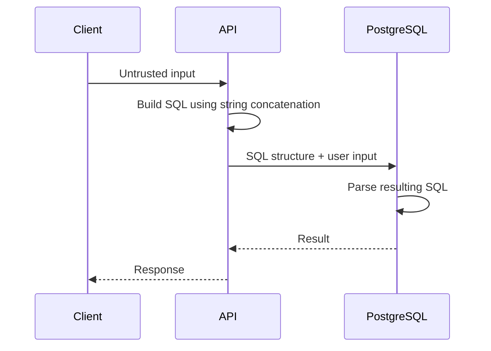
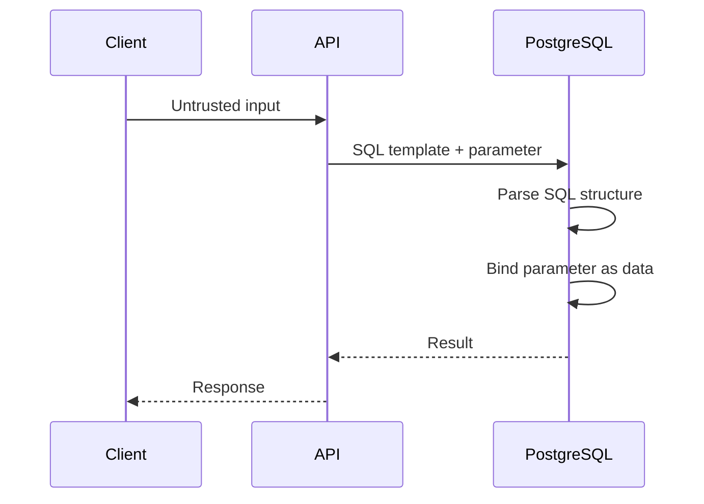

# 20- SQL Injection Basics

## Overview

SQL injection is a security vulnerability that occurs when untrusted input is incorporated into SQL in a way that allows the input to alter the intended SQL structure.

The fundamental problem is a failure to separate:

```text
SQL structure
+
untrusted data
```

A secure application sends them separately:

```text
Application
    ↓
SQL statement + parameters
    ↓
PostgreSQL
    ↓
SQL structure remains fixed
    ↓
parameters are treated as values
```

An insecure application constructs SQL by concatenating or interpolating user-controlled values:

```text
HTTP request
    ↓
untrusted input
    ↓
string concatenation
    ↓
SQL text
    ↓
database
```

SQL injection can lead to unauthorized data access, data modification, authentication bypass, privilege escalation, or destructive database operations.

For backend engineers, SQL injection is primarily an **application/database boundary problem**. The most important defense is to use parameterized queries or safe ORM query APIs consistently.

---

## What SQL Injection Is

Consider an application that constructs a query using string interpolation:

```python
username = request.args["username"]

query = f"""
    SELECT id, username
    FROM users
    WHERE username = '{username}'
"""
```

The application intends to produce:

```sql
SELECT id, username
FROM users
WHERE username = 'alice';
```

But the database receives SQL text generated from the application string.

The application has therefore allowed user input to participate in the SQL grammar.

The fundamental rule is:

> **Never allow untrusted data to become SQL syntax.**

---

## Why SQL Injection Happens

SQL injection usually results from mixing:

```text
code
+
data
```

inside one SQL string.

Unsafe:

```python
query = "SELECT * FROM users WHERE email = '" + email + "'"
```

Unsafe:

```python
query = f"SELECT * FROM users WHERE email = '{email}'"
```

Unsafe:

```python
query = "SELECT * FROM users WHERE email = '%s'" % email
```

All three construct SQL text manually.

The problem is not specifically Python string formatting.

The same vulnerability can occur in:

- Java.
- JavaScript.
- Go.
- PHP.
- Ruby.
- C#.
- Shell scripts.
- Stored procedures.
- Database administration tools.
- ETL pipelines.

---

## SQL Injection Data Flow



The dangerous step is:

```text
API → SQL text containing untrusted input
```

A secure design changes the flow:



The database receives a statement whose SQL structure is separate from the parameter value.

---

## Parameterized Queries

The primary defense is a parameterized query.

For PostgreSQL with Python DB-API:

```python
cursor.execute(
    """
    SELECT id, username
    FROM users
    WHERE username = %s
    """,
    [username],
)
```

The important distinction is:

```text
SQL template
+
parameter value
```

rather than:

```text
SQL template generated by concatenation
```

The parameter is treated as a value rather than SQL syntax.

---

## Parameterization Does Not Mean Manual Escaping

Do not attempt to solve SQL injection by manually escaping strings.

Avoid:

```python
escaped_username = username.replace("'", "''")
```

Manual escaping is fragile because SQL syntax, encodings, database behavior, and query construction can become more complicated than expected.

Prefer the database driver's parameter binding:

```python
cursor.execute(
    """
    SELECT id
    FROM users
    WHERE username = %s
    """,
    [username],
)
```

Parameterization is a structural defense rather than an escaping trick.

---

## Django ORM

Django's ORM normally parameterizes values for you.

Prefer:

```python
users = User.objects.filter(
    username=username,
)
```

rather than constructing SQL manually.

Django generates SQL with parameters rather than directly embedding the value into the SQL string.

Raw SQL can still be safe:

```python
from django.db import connection

with connection.cursor() as cursor:
    cursor.execute(
        """
        SELECT id, username
        FROM users
        WHERE username = %s
        """,
        [username],
    )
```

The fact that SQL is "raw" does not make it insecure.

The issue is **how values are inserted into the SQL statement**.

---

## FastAPI and SQLAlchemy

With SQLAlchemy, use bound parameters.

For example:

```python
from sqlalchemy import text

stmt = text("""
    SELECT id, email
    FROM users
    WHERE email = :email
""")

result = session.execute(
    stmt,
    {"email": email},
)
```

Do not construct:

```python
stmt = text(
    f"SELECT id FROM users WHERE email = '{email}'"
)
```

The SQLAlchemy API does not automatically make arbitrary string-built SQL safe.

---

## gRPC Is Not Automatically Safe

SQL injection is not limited to REST APIs.

Consider:

```text
REST request
    ↓
Python service
    ↓
PostgreSQL
```

and:

```text
gRPC request
    ↓
Python service
    ↓
PostgreSQL
```

Both can be vulnerable.

The database does not care whether the input originated from:

- REST.
- gRPC.
- Kafka.
- CLI.
- Admin UI.
- Internal service.
- Batch job.

Treat all external or untrusted values as untrusted until validated and safely bound.

---

## Input Validation vs SQL Parameterization

These solve different problems.

### Parameterization

Protects SQL structure:

```text
"'; DROP ..."
```

is treated as a value.

### Validation

Ensures the value satisfies application requirements:

```text
email format
UUID format
maximum length
allowed enum
numeric range
```

You often need both.

For example:

```python
if not isinstance(user_id, int):
    raise ValueError("Invalid user ID")
```

and:

```python
cursor.execute(
    """
    SELECT id
    FROM users
    WHERE id = %s
    """,
    [user_id],
)
```

Validation should not replace parameterization.

Parameterization should not replace domain validation.

---

## The Important Exception: SQL Identifiers

Parameterized queries are designed primarily for **values**.

They generally cannot safely parameterize SQL identifiers such as:

```text
table names
column names
sort directions
SQL keywords
```

This creates a common backend security problem.

Unsafe:

```python
column = request.args["sort"]

query = f"""
    SELECT id, email
    FROM users
    ORDER BY {column}
"""
```

The user is controlling SQL structure.

---

## Safe Dynamic Sorting

Use an allowlist.

```python
SORT_COLUMNS = {
    "created": "created_at",
    "email": "email",
    "name": "username",
}

sort_key = request.args.get("sort", "created")

column = SORT_COLUMNS.get(sort_key)

if column is None:
    raise ValueError("Invalid sort field")

query = f"""
    SELECT id, email, username
    FROM users
    ORDER BY {column}
"""
```

The important property is:

```text
user input
    ↓
allowlist key
    ↓
trusted SQL identifier
```

The user never gets to supply arbitrary SQL syntax.

---

## Dynamic Table Names

Suppose an application needs to choose among known tenant tables.

Do not do:

```python
table_name = request.args["table"]

query = f"SELECT * FROM {table_name}"
```

Instead, map an application-level identifier to a trusted identifier:

```python
TABLES = {
    "orders": "orders",
    "customers": "customers",
}

table_name = TABLES.get(resource)

if table_name is None:
    raise ValueError("Invalid resource")
```

Even better, reconsider the schema design if dynamic table selection is being used as a normal request-path mechanism.

A shared table with proper tenant isolation is often easier to operate.

---

## Dynamic `IN` Lists

Do not construct:

```python
ids = request.args["ids"]

query = f"""
    SELECT id
    FROM users
    WHERE id IN ({ids})
"""
```

For PostgreSQL, use parameter binding appropriate to the driver/framework.

With psycopg:

```python
from psycopg import sql

ids = [10, 20, 30]

query = sql.SQL("""
    SELECT id, email
    FROM users
    WHERE id = ANY(%s)
""")

cursor.execute(query, [ids])
```

The exact API depends on the driver and query shape, but the principle remains:

> **Values must be passed as parameters, not interpolated into SQL text.**

---

## PostgreSQL Identifier Composition

PostgreSQL drivers can provide APIs for safely composing SQL identifiers.

For example, psycopg provides `psycopg.sql`:

```python
from psycopg import sql

table_name = "users"

query = sql.SQL(
    "SELECT id, email FROM {}"
).format(
    sql.Identifier(table_name)
)

cursor.execute(query)
```

This is different from:

```python
query = f"SELECT id, email FROM {table_name}"
```

The identifier composition API understands that the value is an SQL identifier.

Even so, application-level allowlists are often preferable when the set of legal identifiers is known.

---

## Parameterization and Query Structure

Consider:

```sql
SELECT *
FROM users
WHERE email = $1;
```

The database understands:

```text
SELECT *
FROM users
WHERE email = ?
```

as the statement structure.

The value is supplied separately.

Conceptually:

```text
SQL parser
    ↓
statement structure

parameter binding
    ↓
value
```

This prevents the value from changing the intended SQL grammar.

---

## Parse, Bind, Execute

The exact protocol differs by driver and API, but the conceptual database flow is:

```text
SQL statement
    ↓
Parse
    ↓
Bind parameters
    ↓
Execute
    ↓
Return rows
```

The key security property is that parameters are not interpreted as arbitrary SQL syntax.

For PostgreSQL's extended query protocol, prepared statements and parameter binding can provide this separation at the protocol level.

Do not confuse parameterization with manually building a SQL string before sending it to the driver.

---

## Prepared Statements

Prepared statements can provide:

- Separation of SQL and values.
- Query plan reuse in appropriate circumstances.
- Reduced parsing overhead in some workloads.

But prepared statements are not required for every safe query.

The security requirement is:

```text
parameter binding
```

not:

```text
must manually create PREPARE statements
```

Most modern drivers and ORMs provide parameterized execution APIs.

---

## SQL Injection Through ORM Raw Queries

An ORM does not eliminate SQL injection.

This is safe:

```python
User.objects.filter(email=email)
```

This can be dangerous:

```python
User.objects.raw(
    f"SELECT * FROM users WHERE email = '{email}'"
)
```

Similarly, unsafe raw SQL can enter a codebase through:

- `RawSQL`.
- `extra()` in older Django code.
- SQLAlchemy `text()`.
- Database cursors.
- Migration scripts.
- Custom repository functions.

Every raw SQL boundary deserves security review.

---

## SQL Injection in Search APIs

A common production endpoint is:

```http
GET /users?search=alice
```

Safe:

```python
users = User.objects.filter(
    username__icontains=search,
)
```

or parameterized SQL:

```sql
SELECT id, username
FROM users
WHERE username ILIKE '%' || $1 || '%';
```

The search value remains data.

Do not construct:

```python
query = f"""
    SELECT id, username
    FROM users
    WHERE username ILIKE '%{search}%'
"""
```

---

## SQL Injection in Authentication

Authentication queries are especially sensitive.

Unsafe:

```python
query = f"""
    SELECT id, password_hash
    FROM users
    WHERE username = '{username}'
"""
```

The authentication path should use parameterization:

```python
cursor.execute(
    """
    SELECT id, password_hash
    FROM users
    WHERE username = %s
    """,
    [username],
)
```

Password verification should then be performed using an appropriate password-hashing library.

SQL injection must not be treated as merely a "data leak" issue. Authentication and authorization boundaries are particularly high impact.

---

## SQL Injection and Authorization

A parameterized query can still be insecure if authorization is missing.

For example:

```sql
SELECT id, total_amount
FROM orders
WHERE id = $1;
```

This may safely avoid SQL injection while still allowing a user to request another tenant's order.

A multi-tenant query may require:

```sql
SELECT id, total_amount
FROM orders
WHERE id = $1
  AND tenant_id = $2;
```

Therefore:

```text
SQL injection defense
≠
authorization
```

They are separate security requirements.

---

## SQL Injection and Multi-Tenancy

A production multi-tenant service should establish tenant boundaries explicitly.

Typical architecture:

```text
Request
    ↓
Authentication
    ↓
Tenant resolution
    ↓
Authorization
    ↓
Parameterized SQL
    ↓
PostgreSQL
```

Depending on the architecture, PostgreSQL Row-Level Security can provide an additional database-side enforcement layer.

But RLS does not replace parameterization.

You need both:

```text
safe SQL construction
+
correct authorization model
```

---

## SQL Injection Through Background Jobs

Do not assume Celery workers are trusted.

Consider a job payload:

```json
{
  "customer_id": "123",
  "filter": "..."
}
```

The payload may originate from:

- An API.
- Another service.
- A database record.
- An imported file.
- An administrative operation.

If it eventually becomes SQL, it must still be parameterized.

Security boundaries do not disappear because execution is asynchronous.

---

## SQL Injection Through Kafka

Kafka messages should also be treated according to their trust boundary.

For example:

```text
Kafka message
    ↓
consumer
    ↓
SQL query
```

Do not assume:

```text
internal topic = trusted input
```

Topics can contain:

- Compromised producer output.
- Bad historical data.
- Schema violations.
- Malicious payloads.
- Operator-generated messages.

Validate data and parameterize SQL in consumers.

---

## SQL Injection in Migration and Administrative Scripts

Migration code can be overlooked because it is not part of the API request path.

Unsafe:

```python
for table_name in tables:
    cursor.execute(
        f"ALTER TABLE {table_name} ..."
    )
```

If identifiers are dynamic, use safe identifier composition or a strict allowlist.

Migration scripts also require review because they often run with elevated database privileges.

A vulnerability in a migration can have a larger blast radius than one in a restricted application connection.

---

## Least-Privilege Database Accounts

Parameterization is the primary SQL injection defense, but database privileges limit the impact of a successful compromise.

For example:

```text
API role
 ├── SELECT
 ├── INSERT
 ├── UPDATE
 └── limited DELETE

Migration role
 ├── schema changes
 └── elevated privileges

Admin role
 └── separate operational access
```

Do not run the application using a PostgreSQL superuser.

Least privilege is defense in depth.

---

## Secrets and Database Credentials

Do not hard-code database credentials:

```python
DATABASE_PASSWORD = "production-password"
```

Use appropriate secret-management mechanisms such as:

- AWS Secrets Manager.
- AWS Systems Manager Parameter Store.
- Kubernetes Secrets with appropriate controls.
- Environment-based secret injection.

A SQL injection vulnerability combined with highly privileged database credentials creates a substantially larger blast radius.

---

## Error Handling

Avoid returning raw database errors to clients:

```text
psycopg.errors.SyntaxError:
syntax error at or near ...
```

Database errors can expose:

- Schema information.
- Table names.
- Column names.
- Query behavior.
- Internal implementation details.

Return a controlled API response:

```json
{
  "detail": "Invalid request"
}
```

Log detailed information internally with appropriate access controls.

---

## Logging Considerations

Avoid logging sensitive SQL parameters indiscriminately.

Bad:

```text
SELECT * FROM users WHERE email = '...'
```

if logs contain sensitive user data.

Prefer structured logging:

```text
event=database_error
query_name=user_lookup
error_class=...
request_id=...
```

For security incidents, retain enough metadata to investigate without creating another sensitive-data repository.

---

## Monitoring and Detection

Preventive controls should be complemented by detection.

Monitor for:

- Unexpected database errors.
- Abnormal query patterns.
- Sudden increases in query latency.
- Unexpected schema access.
- Unusual database role activity.
- Large result sets.
- Repeated malformed requests.
- Authentication anomalies.

Application observability should connect:

```text
request_id
    ↓
application log
    ↓
database operation
    ↓
security event
```

without exposing sensitive values unnecessarily.

---

## WAF and Nginx Are Not the Primary Defense

A Web Application Firewall can detect or block some suspicious request patterns.

Nginx can provide:

- Request filtering.
- Rate limiting.
- TLS termination.
- Access controls.

But neither replaces parameterized SQL.

The correct defense hierarchy is:

```text
Safe query construction
        ↓
Least-privilege database access
        ↓
Input validation
        ↓
Authorization
        ↓
Monitoring
        ↓
WAF / network defenses
```

A WAF is defense in depth, not a substitute for secure database access.

---

## Security Testing

SQL injection should be tested at multiple layers.

### Unit Tests

Test query-building boundaries where appropriate.

### Integration Tests

Execute queries against a real PostgreSQL instance.

### API Security Tests

Test untrusted input through the actual HTTP/gRPC path.

### Static Analysis

Use security tooling to detect:

- String-built SQL.
- Unsafe raw queries.
- Dangerous interpolation.

### Dependency Scanning

Keep:

- Django.
- FastAPI dependencies.
- Database drivers.
- SQLAlchemy.
- Security libraries.

up to date.

---

## Safe Testing Strategy

Security tests should verify behavior rather than relying solely on a collection of attack strings.

For example:

```python
def test_search_treats_input_as_data(client):
    response = client.get(
        "/users",
        params={"search": "unexpected-input"},
    )

    assert response.status_code == 200
```

For high-risk applications, dedicated security testing should also attempt representative malformed inputs and verify that:

- SQL structure cannot be modified.
- Errors are handled safely.
- Unauthorized data is not returned.
- Database state is not unexpectedly modified.

---

## Dependency and Driver Updates

Database drivers are security-sensitive infrastructure.

Keep current versions of:

```text
psycopg
Django
SQLAlchemy
database server
```

within your supported compatibility range.

A secure query pattern can still be undermined by outdated dependencies or unsafe custom wrappers.

---

## Secure Repository Pattern

A useful backend architecture is:

```text
API
 ↓
Service
 ↓
Repository / ORM
 ↓
Parameterized SQL
 ↓
PostgreSQL
```

The service handles:

```text
business workflow
authorization decisions
transaction boundaries
external integrations
```

The repository handles:

```text
queries
parameter binding
database mapping
```

This makes SQL boundaries easier to review and test.

---

## Example: Secure FastAPI Repository

```python
from sqlalchemy import text
from sqlalchemy.orm import Session


def get_user_by_email(session: Session, email: str):
    statement = text("""
        SELECT id, email, username
        FROM users
        WHERE email = :email
    """)

    return session.execute(
        statement,
        {"email": email},
    ).mappings().first()
```

The SQL structure is fixed.

The email is passed separately as a bound parameter.

---

## Example: Secure Django Query

```python
from django.contrib.auth import get_user_model

User = get_user_model()

def find_user(email: str):
    return (
        User.objects
        .filter(email=email)
        .only("id", "email", "username")
        .first()
    )
```

The ORM handles parameterization.

There is no reason to manually construct SQL for this operation.

---

## Example: Secure Raw SQL in Django

```python
from django.db import connection


def find_user(email: str):
    with connection.cursor() as cursor:
        cursor.execute(
            """
            SELECT id, email, username
            FROM users
            WHERE email = %s
            """,
            [email],
        )
        return cursor.fetchone()
```

The important security property is parameter binding.

---

## Unsafe vs Safe Patterns

| Pattern | Risk | Preferred approach |
|---|---|---|
| String concatenation | High | Parameterized query |
| f-string SQL | High | Parameterized query |
| `%` formatting | High | Parameterized query |
| Manual escaping | High | Driver parameterization |
| Django ORM filters | Low when used correctly | Prefer ORM |
| SQLAlchemy bound parameters | Low when used correctly | Prefer bound parameters |
| Raw SQL with parameters | Safe pattern | Use when raw SQL is justified |
| Dynamic identifiers | Potentially high | Allowlist or safe identifier API |
| Dynamic `ORDER BY` | Potentially high | Allowlist columns/directions |
| WAF only | Insufficient | Parameterization + defense in depth |
| Input validation only | Insufficient | Validation + parameterization |

---

## Performance Considerations

Parameterized queries are not inherently a performance problem.

In many systems, they are the standard way to execute SQL.

Performance problems usually come from query design:

```text
missing indexes
bad joins
large scans
poor pagination
unbounded queries
high concurrency
```

not from parameterization itself.

Do not replace safe parameterized queries with string-built SQL because of an unverified performance assumption.

Measure with:

```sql
EXPLAIN (ANALYZE, BUFFERS)
```

when query performance requires investigation.

---

## Connection Pooling

Applications commonly use connection pools:

```text
FastAPI / Django pods
        ↓
connection pool
        ↓
PostgreSQL
```

Every connection should operate under the least privilege required by the application.

Do not assume pooling makes SQL injection less important.

The attacker-controlled input still reaches the same database.

Pooling also reinforces the importance of avoiding unsafe session state and ensuring transaction boundaries are explicit.

---

## Kubernetes and AWS

In Kubernetes:

```text
Ingress / Nginx
    ↓
Service
    ↓
API pods
    ↓
PostgreSQL
```

security should exist at multiple layers:

- TLS.
- Authentication.
- Authorization.
- Network policies/security groups.
- Parameterized SQL.
- Least-privilege DB roles.
- Secrets management.
- Monitoring.

In AWS architectures, database access may involve:

```text
EKS / ECS / EC2
    ↓
private networking
    ↓
RDS / Aurora PostgreSQL
```

Private networking reduces exposure but does not prevent SQL injection.

An attacker who reaches the application can still exploit unsafe query construction.

---

## Reliability and Incident Response

If SQL injection is suspected:

1. Identify affected endpoints and services.
2. Review application and database logs.
3. Determine whether unauthorized data was accessed or modified.
4. Rotate potentially exposed credentials.
5. Restrict compromised database privileges if necessary.
6. Preserve relevant evidence.
7. Patch the vulnerable query construction.
8. Deploy through the normal CI/CD path.
9. Add regression tests.
10. Review similar query patterns throughout the codebase.

Do not assume fixing the first discovered query fixes the vulnerability class.

Search the entire repository for unsafe SQL construction.

---

## Common Mistakes

### Mistake: Using f-Strings for SQL

```python
query = f"SELECT * FROM users WHERE id = {user_id}"
```

**Why it fails:** user-controlled data becomes part of SQL text.

**Avoid it:** use bound parameters.

### Mistake: Escaping Quotes Manually

```python
value = value.replace("'", "''")
```

**Why it fails:** escaping is fragile and easy to get wrong.

**Avoid it:** use the database driver's parameterization mechanism.

### Mistake: Trusting Internal Services

```text
internal service → trusted input
```

is not a sufficient security model.

**Avoid it:** parameterize SQL at every database boundary.

### Mistake: Assuming an ORM Eliminates SQL Injection

Raw SQL APIs and unsafe query expressions can still introduce vulnerabilities.

**Avoid it:** review every raw SQL boundary.

### Mistake: Parameterizing Identifiers

This does not work conceptually:

```python
ORDER BY %s
```

when `%s` is expected to represent a column identifier.

**Avoid it:** use an allowlist or safe identifier composition.

### Mistake: Relying on Input Validation

Validation can reject unexpected values, but it is not the primary SQL injection defense.

**Avoid it:** parameterize regardless of validation.

### Mistake: Using a Superuser Connection

A compromised application with superuser access can have catastrophic impact.

**Avoid it:** use least-privilege database roles.

### Mistake: Returning Database Errors

Raw database errors can expose internal implementation details.

**Avoid it:** return controlled errors and log details securely.

### Mistake: Testing Only One Endpoint

SQL injection can exist in:

- APIs.
- Admin tools.
- Workers.
- Reports.
- Migrations.
- Search endpoints.
- Background jobs.

**Avoid it:** audit all SQL construction paths.

---

## Production Security Checklist

- [ ] All user-controlled SQL values use parameter binding.
- [ ] No f-strings or string concatenation construct SQL.
- [ ] No manual SQL escaping is used as the primary defense.
- [ ] ORM query APIs are preferred for ordinary CRUD operations.
- [ ] Raw SQL is reviewed and parameterized.
- [ ] Dynamic identifiers use strict allowlists or safe identifier composition.
- [ ] Dynamic sort columns and directions are allowlisted.
- [ ] Input validation is used for domain correctness.
- [ ] Authentication queries are parameterized.
- [ ] Authorization is enforced separately from SQL injection protection.
- [ ] Tenant boundaries are explicit.
- [ ] Database roles follow least privilege.
- [ ] Application connections are not superusers.
- [ ] Database credentials are stored securely.
- [ ] Sensitive database errors are not returned to clients.
- [ ] Logs avoid unnecessary sensitive query parameters.
- [ ] SQL injection regression tests exist.
- [ ] Raw SQL boundaries are covered by security review.
- [ ] Dependencies and database drivers are maintained.
- [ ] WAF/network controls are treated as defense in depth.
- [ ] Incident response procedures include database credential rotation.
- [ ] Security monitoring covers abnormal database activity.

---

## Interview Traps

### Is parameterization the same as input validation?

No.

Parameterization protects SQL structure. Validation enforces application-level rules.

### Does an ORM completely prevent SQL injection?

No.

ORM query APIs are generally safe when used correctly, but raw SQL and unsafe expression construction can still introduce injection.

### Can parameters represent table names?

Generally, parameter binding is for values, not SQL identifiers.

Use an allowlist or database-driver identifier composition API for dynamic identifiers.

### Is escaping enough to prevent SQL injection?

Manual escaping should not be used as the primary defense. Parameterized queries provide a safer structural boundary.

### Does a WAF prevent SQL injection?

A WAF can provide defense in depth, but application-side parameterization remains the primary control.

### Does private database networking prevent SQL injection?

No. If an attacker can influence application input, unsafe SQL construction can still be exploited.

### Does SQL injection only affect web applications?

No. Any application that constructs SQL from untrusted input can be vulnerable, including workers, CLI tools, internal services, and data pipelines.

### Does parameterized SQL prevent authorization bugs?

No.

A parameterized query can safely retrieve another tenant's data if authorization is incorrectly implemented.

### Should every piece of logic be moved out of SQL for security?

No.

SQL constraints, set-based operations, atomic updates, and database-local logic remain appropriate. Security depends on how SQL is constructed and executed.

### What is the most important SQL injection defense?

**Keep SQL structure separate from untrusted values by using parameterized queries or safe ORM APIs.**

## Key Takeaways

- **SQL injection occurs when untrusted input can alter SQL structure; parameterized queries separate SQL syntax from data and are the primary defense.**
- **Input validation, authorization, RLS, least-privilege database roles, WAFs, and network controls are complementary controls, not replacements for parameterization.**
- **SQL values can generally be parameterized, but dynamic identifiers such as table names and sort columns require strict allowlists or safe identifier-composition APIs.**
- **ORMs reduce risk but do not eliminate it; raw SQL, dynamic expressions, migrations, background jobs, and internal services must follow the same security rules.**
- **Treat SQL injection as a system-wide security concern: secure query construction, minimize database privileges, monitor abnormal behavior, and test every SQL construction boundary.**