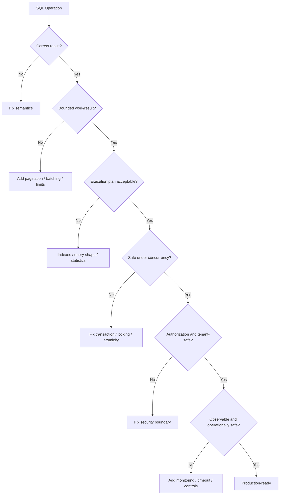

# 21- Common Production SQL Mistakes

## Overview

SQL that works correctly in development can still cause serious production problems when data volume, concurrency, traffic, replication, and operational constraints increase.

Production SQL mistakes are rarely caused by not knowing SQL syntax. They usually come from misunderstanding:

- Query cardinality.
- Execution plans.
- Index behavior.
- Transactions and locks.
- PostgreSQL MVCC.
- Pagination cost.
- Connection pooling.
- Result-set size.
- Concurrency.
- Data growth.
- Failure and retry behavior.

A query returning 100 rows from a development database may behave very differently when the same query runs against 500 million rows.

The senior backend engineer's responsibility is therefore broader than writing valid SQL:

```text
Correct SQL
    ↓
Correct result
    ↓
Predictable execution plan
    ↓
Controlled resource usage
    ↓
Safe concurrency
    ↓
Observable production behavior
```

---

## Production SQL Mindset

A production query should be evaluated across four dimensions:

| Dimension | Questions |
|---|---|
| Correctness | Does it always return the intended result? |
| Performance | How much CPU, memory, I/O, and sorting does it require? |
| Concurrency | What happens when hundreds of requests execute it simultaneously? |
| Operations | What happens during failures, deployments, backups, replication, and traffic spikes? |

A query is not production-ready merely because:

```sql
SELECT ...
```

returns the correct rows.

---

## Common Production Mistakes

The most common production SQL failures include:

- Missing indexes on critical access paths.
- Creating too many indexes.
- Selecting unnecessary columns.
- Using `SELECT *`.
- Unbounded result sets.
- Deep `OFFSET` pagination.
- N+1 queries.
- Incorrect joins that multiply rows.
- Accidental Cartesian products.
- Filtering after aggregation when filtering before aggregation is possible.
- Applying functions incorrectly to indexed predicates.
- Implicit type conversion.
- Incorrect `NULL` handling.
- `NOT IN` with nullable subqueries.
- Large transactions.
- Long-running transactions.
- Locking too many rows.
- Deadlocks.
- Race-prone read-then-write logic.
- Ignoring query plans.
- Assuming `LIMIT` makes every query cheap.
- Running expensive queries during peak traffic.
- Using database connections inefficiently.
- Treating replicas as automatically consistent.
- Building business workflows entirely inside SQL.

---

## Mistake: Using `SELECT *`

Avoid:

```sql
SELECT *
FROM orders
WHERE customer_id = $1;
```

Prefer:

```sql
SELECT
    id,
    status,
    total_amount,
    created_at
FROM orders
WHERE customer_id = $1;
```

### Why It Matters

`SELECT *` can cause:

- Larger network responses.
- More memory usage.
- More application deserialization.
- More database I/O.
- Less effective index-only scans.
- Fragility when columns are added.

A query that was cheap when a table contained five columns may become expensive after several large columns are added.

### Production Rule

Select the columns the caller actually needs.

---

## Mistake: Returning Unbounded Results

Avoid APIs that effectively execute:

```sql
SELECT id, email
FROM users
ORDER BY id;
```

and return every row.

Even with a reasonable database, the application can experience:

```text
Database
 ↓
millions of rows
 ↓
network
 ↓
Python process
 ↓
serialization
 ↓
HTTP response
```

This can exhaust:

- Database resources.
- Application memory.
- Network bandwidth.
- Request timeouts.

Use bounded pagination or asynchronous exports.

---

## Mistake: Assuming `LIMIT` Makes a Query Cheap

This query:

```sql
SELECT id, email
FROM users
ORDER BY created_at DESC
LIMIT 50;
```

may be efficient with an appropriate index.

But:

```sql
SELECT id, email
FROM users
WHERE expensive_condition(...)
ORDER BY created_at DESC
LIMIT 50;
```

may still require substantial work before PostgreSQL can identify the first 50 qualifying rows.

Similarly:

```sql
SELECT id
FROM orders
ORDER BY created_at
LIMIT 50 OFFSET 5000000;
```

can require processing a large number of preceding rows.

`LIMIT` bounds the returned rows, not necessarily the amount of work required to produce them.

---

## Mistake: Deep `OFFSET` Pagination

Avoid:

```sql
SELECT id, created_at
FROM orders
ORDER BY created_at DESC
LIMIT 50 OFFSET 1000000;
```

As the offset grows, PostgreSQL generally has to identify and discard more preceding rows.

Prefer keyset pagination for large datasets:

```sql
SELECT id, created_at
FROM orders
WHERE (created_at, id) < ($1, $2)
ORDER BY created_at DESC, id DESC
LIMIT 50;
```

Use an index aligned with the access pattern:

```sql
CREATE INDEX orders_created_id_idx
ON orders (created_at DESC, id DESC);
```

---

## Mistake: Missing Deterministic Ordering

Avoid:

```sql
SELECT id
FROM orders
LIMIT 50;
```

There is no meaningful ordering contract.

Even this may be insufficient:

```sql
SELECT id
FROM orders
ORDER BY created_at DESC
LIMIT 50;
```

If multiple rows have the same timestamp, their relative order is not deterministic.

Prefer:

```sql
SELECT id, created_at
FROM orders
ORDER BY created_at DESC, id DESC
LIMIT 50;
```

The unique `id` provides a deterministic tie-breaker.

This is particularly important for pagination.

---

## Mistake: N+1 Queries

A typical application mistake:

```python
orders = Order.objects.all()

for order in orders:
    customer = Customer.objects.get(
        id=order.customer_id
    )
```

This can generate:

```text
1 query for orders
+
N queries for customers
```

For 10,000 orders:

```text
10,001 database queries
```

Prefer:

```python
orders = (
    Order.objects
    .select_related("customer")
    .all()
)
```

The database can perform the relationship access much more efficiently.

---

## Mistake: Querying Inside Loops

Avoid:

```python
for user_id in user_ids:
    User.objects.get(id=user_id)
```

Prefer a set-based query:

```python
users = User.objects.filter(
    id__in=user_ids
)
```

The same principle applies to updates and deletes.

Instead of:

```python
for user_id in user_ids:
    User.objects.filter(id=user_id).update(
        status="inactive"
    )
```

consider a single set-based update:

```python
User.objects.filter(
    id__in=user_ids
).update(
    status="inactive"
)
```

---

## Mistake: Incorrect Join Cardinality

Suppose:

```text
customers
1 ─── N orders
1 ─── N payments
```

This query:

```sql
SELECT
    c.id,
    SUM(o.total_amount),
    SUM(p.amount)
FROM customers c
JOIN orders o
    ON o.customer_id = c.id
JOIN payments p
    ON p.customer_id = c.id
GROUP BY c.id;
```

can multiply rows.

If a customer has:

```text
3 orders
4 payments
```

the join can produce:

```text
3 × 4 = 12 rows
```

before aggregation.

The resulting sums can be incorrect.

A senior engineer always asks:

> **What is the grain of each relation before joining it?**

---

## Mistake: Accidental Cartesian Products

This is dangerous:

```sql
SELECT *
FROM orders o
CROSS JOIN customers c;
```

If there are:

```text
1,000,000 orders
100,000 customers
```

the conceptual result contains:

```text
100,000,000,000 rows
```

An accidental missing join condition can have similarly severe consequences:

```sql
SELECT *
FROM orders o, customers c
WHERE ...
```

Always verify join predicates and expected cardinality.

---

## Mistake: Using `JOIN` When Only Existence Is Needed

Avoid:

```sql
SELECT DISTINCT c.id
FROM customers c
JOIN orders o
    ON o.customer_id = c.id;
```

if the requirement is simply:

> Find customers who have at least one order.

Prefer:

```sql
SELECT c.id
FROM customers c
WHERE EXISTS (
    SELECT 1
    FROM orders o
    WHERE o.customer_id = c.id
);
```

This expresses the intended relational operation directly.

The PostgreSQL planner may transform both forms into efficient plans, so `EXISTS` is not automatically faster. The important benefit is correct semantics and avoiding accidental row multiplication.

---

## Mistake: `NOT IN` With `NULL`

Consider:

```sql
WHERE user_id NOT IN (
    SELECT user_id
    FROM blocked_users
)
```

If the subquery can contain `NULL`, SQL's three-valued logic can produce unexpected results.

Prefer:

```sql
WHERE NOT EXISTS (
    SELECT 1
    FROM blocked_users b
    WHERE b.user_id = u.id
)
```

When exclusion semantics matter, `NOT EXISTS` is generally easier to reason about.

---

## Mistake: Incorrect `NULL` Comparisons

This does not test for `NULL`:

```sql
WHERE deleted_at = NULL;
```

Use:

```sql
WHERE deleted_at IS NULL;
```

And:

```sql
WHERE deleted_at IS NOT NULL;
```

Remember:

```text
NULL ≠ empty string
NULL ≠ zero
NULL ≠ false
```

`NULL` represents an unknown or missing value according to SQL's three-valued logic.

---

## Mistake: Filtering After Aggregation Unnecessarily

Consider:

```sql
SELECT
    customer_id,
    COUNT(*)
FROM orders
GROUP BY customer_id
HAVING status = 'completed';
```

This is incorrect because `status` is neither grouped nor aggregated.

If the intention is to count completed orders:

```sql
SELECT
    customer_id,
    COUNT(*)
FROM orders
WHERE status = 'completed'
GROUP BY customer_id;
```

Filtering before aggregation reduces the rows entering the grouping operation.

The optimizer can sometimes transform predicates, but writing the intended relational semantics clearly is still important.

---

## Mistake: Applying Functions to Indexed Columns

Suppose:

```sql
CREATE INDEX users_email_idx
ON users (email);
```

This predicate may prevent the ordinary index from being directly useful:

```sql
WHERE LOWER(email) = LOWER($1)
```

Depending on the design, an expression index may be appropriate:

```sql
CREATE INDEX users_lower_email_idx
ON users (LOWER(email));
```

Or the schema can enforce a normalized representation.

Do not automatically assume:

```text
index exists
```

means:

```text
index will be used
```

Inspect the execution plan.

---

## Mistake: Implicit Type Conversion

Consider:

```sql
WHERE account_id = $1
```

where the application supplies a value with an unexpected type.

Implicit casts can:

- Change semantics.
- Prevent expected index usage.
- Increase query complexity.
- Hide application bugs.

Use consistent types across:

```text
API
 ↓
application
 ↓
ORM/driver
 ↓
PostgreSQL column
```

For identifiers, prefer strongly typed application representations such as integers or UUIDs rather than arbitrary strings.

---

## Mistake: Missing Indexes

A query like:

```sql
SELECT id, status
FROM orders
WHERE customer_id = $1
ORDER BY created_at DESC
LIMIT 50;
```

may benefit from:

```sql
CREATE INDEX orders_customer_created_idx
ON orders (customer_id, created_at DESC);
```

But indexes should be workload-driven.

Ask:

- How often is the query executed?
- How selective is the predicate?
- How large is the table?
- How frequently is the table written?
- Does the index support ordering?
- Does it improve the actual execution plan?

Use:

```sql
EXPLAIN (ANALYZE, BUFFERS)
...
```

to validate the result.

---

## Mistake: Over-Indexing

Every index has a cost.

Indexes consume:

- Disk.
- Memory/cache.
- WAL.
- Write CPU.
- Vacuum work.
- Replication bandwidth.
- Backup storage.

A write-heavy table with dozens of indexes can become unnecessarily expensive.

Do not create an index for every column.

Create indexes for real access patterns.

---

## Mistake: Under-Indexing

The opposite mistake is also common.

A production API may repeatedly execute:

```sql
SELECT ...
FROM orders
WHERE tenant_id = $1
  AND status = $2
ORDER BY created_at DESC
LIMIT 50;
```

while the database has only:

```text
index on id
```

This can result in repeated expensive scans.

Index design should reflect:

```text
WHERE
JOIN
ORDER BY
```

patterns rather than individual columns in isolation.

---

## Mistake: Ignoring Composite Index Column Order

For:

```sql
CREATE INDEX orders_tenant_status_created_idx
ON orders (tenant_id, status, created_at DESC);
```

the column order is intentional.

The useful access pattern might be:

```sql
WHERE tenant_id = $1
  AND status = $2
ORDER BY created_at DESC
```

Changing the order without understanding workload can reduce effectiveness.

Composite indexes should be designed from real query patterns and selectivity.

---

## Mistake: Assuming an Index Guarantees Fast Queries

An index is an available access path.

The PostgreSQL planner may still choose:

```text
Seq Scan
```

because it estimates that scanning the table is cheaper.

Reasons include:

- Low selectivity.
- Small table.
- Outdated statistics.
- High estimated random I/O.
- Query shape.
- Data distribution.

The correct question is not:

> Why didn't PostgreSQL obey my index?

It is:

> Why did the planner estimate another plan to be cheaper?

---

## Mistake: Ignoring Statistics

PostgreSQL uses statistics to estimate:

```text
row counts
selectivity
join cardinality
cost
```

After major data changes, poor statistics can contribute to bad plans.

Useful maintenance includes:

```sql
ANALYZE orders;
```

Autovacuum normally handles routine statistics maintenance, but unusual bulk operations and data distributions may require additional attention.

---

## Mistake: Ignoring Transactions

Consider:

```python
create_order()
reserve_inventory()
create_payment_record()
```

If these operations must succeed or fail together, they require an appropriate transaction boundary.

In Django:

```python
from django.db import transaction

with transaction.atomic():
    create_order()
    reserve_inventory()
    create_payment_record()
```

Without proper transaction semantics, partial state can remain after failures.

---

## Mistake: Making Transactions Too Large

A transaction that processes millions of rows can cause:

- Long lock durations.
- Large WAL generation.
- Replica lag.
- Vacuum pressure.
- Large rollback cost.
- Long-running snapshots.
- Connection occupancy.

Prefer controlled batches when the business operation allows it.

For example:

```sql
UPDATE orders
SET status = 'archived'
WHERE id > $1
  AND id <= $2
  AND status = 'completed';
```

The correct batch size depends on workload and must be measured.

---

## Mistake: Holding Transactions Open While Calling APIs

Avoid:

```text
BEGIN
 ↓
UPDATE database
 ↓
HTTP request to external service
 ↓
wait 5 seconds
 ↓
UPDATE database
 ↓
COMMIT
```

The database transaction remains open while waiting on an external dependency.

Prefer:

```text
database transaction
    ↓
commit local state
    ↓
outbox
    ↓
external worker
    ↓
HTTP/Kafka/etc.
```

Keep database transactions short and focused.

---

## Mistake: Read-Then-Write Race Conditions

This pattern can be unsafe:

```python
account = get_account()

if account.balance >= amount:
    account.balance -= amount
    account.save()
```

Two concurrent requests may both observe sufficient balance.

Prefer an atomic SQL operation:

```sql
UPDATE accounts
SET balance = balance - $1
WHERE id = $2
  AND balance >= $1
RETURNING balance;
```

Concurrency correctness should be designed explicitly.

---

## Mistake: Ignoring Deadlocks

Two transactions can acquire locks in different orders:

```text
Transaction A:
lock row 1
wait for row 2

Transaction B:
lock row 2
wait for row 1
```

This forms a cycle.

PostgreSQL detects deadlocks and aborts one transaction.

Reduce risk by:

- Locking resources in consistent order.
- Keeping transactions short.
- Avoiding unnecessary locks.
- Updating rows in deterministic order.
- Retrying safe transactions where appropriate.

A retry must replay the **whole transaction**, not merely the failed statement.

---

## Mistake: Ignoring Serialization Failures

Under stronger isolation levels, PostgreSQL can abort a transaction with a serialization failure.

Applications should recognize retryable database errors where appropriate, such as:

```text
40001 serialization_failure
40P01 deadlock_detected
```

The retry boundary should normally encompass the complete transaction.

Do not blindly retry every database error.

---

## Mistake: Long-Running Read Transactions

A transaction that remains open for a long time can retain an old snapshot.

This can interfere with PostgreSQL maintenance and contribute to table/index bloat.

A common operational symptom is:

```text
idle in transaction
```

Inspect active sessions:

```sql
SELECT
    pid,
    state,
    xact_start,
    query_start,
    wait_event_type,
    wait_event,
    query
FROM pg_stat_activity
WHERE state <> 'idle';
```

Keep transactions as short as practical.

---

## Mistake: Ignoring Connection Pooling

Each application instance may maintain multiple database connections.

For example:

```text
20 Kubernetes pods
×
10 DB connections
=
200 connections
```

Adding more pods can therefore unexpectedly overload PostgreSQL.

Connection capacity must be designed across:

```text
application replicas
+
workers
+
Celery
+
administrative connections
+
monitoring
```

Use connection pooling appropriately and size it based on database capacity.

---

## Mistake: Running Expensive Queries During Peak Traffic

A query that is acceptable at 2 AM may be harmful during peak traffic.

Examples:

- Large reporting queries.
- Backfills.
- Massive deletes.
- Index creation.
- Full-table exports.
- Reconciliation jobs.

Use:

```text
read replicas
background workers
scheduled maintenance
rate limiting
batch processing
```

where appropriate.

Do not assume replicas solve every workload problem; replication lag and read consistency still matter.

---

## Mistake: Treating Read Replicas as Strongly Consistent

With asynchronous replication:

```text
Primary
  ↓
Replica
```

a write committed on the primary may not yet be visible on a replica.

This creates a potential:

```text
write → immediate read
```

consistency problem.

For workflows requiring read-after-write consistency, route the relevant read to the primary or use an explicit consistency strategy.

---

## Mistake: Ignoring Replica Lag

Heavy writes or expensive queries can increase replication lag.

Monitor:

```text
primary WAL generation
        ↓
replication
        ↓
replica replay
```

Replica lag can affect:

- User-visible data freshness.
- Reporting.
- Failover readiness.
- Read scaling.

Read replicas are part of the consistency architecture, not merely additional databases.

---

## Mistake: Performing Large Deletes in One Transaction

Avoid:

```sql
DELETE FROM audit_logs
WHERE created_at < NOW() - INTERVAL '2 years';
```

when this removes a very large fraction of the table.

Large deletes can generate substantial WAL and create cleanup pressure.

Depending on requirements, consider:

- Batching.
- Partitioning.
- Partition retention.
- Archival.
- Scheduled maintenance.

For time-based data, partitioning can make retention operations dramatically simpler.

---

## Mistake: Forgetting Soft-Delete Predicates

A table may contain:

```text
deleted_at
```

but queries may forget:

```sql
WHERE deleted_at IS NULL
```

This can expose logically deleted data.

Centralize the access pattern through:

- ORM managers/querysets.
- Repository methods.
- Views where appropriate.
- Explicit service-level rules.

Do not assume every developer remembers the predicate.

---

## Mistake: Incorrect Multi-Tenant Filtering

A dangerous query is:

```sql
SELECT *
FROM orders
WHERE id = $1;
```

if `id` is not globally authorized.

A safer access pattern may require:

```sql
SELECT
    id,
    total_amount,
    status
FROM orders
WHERE id = $1
  AND tenant_id = $2;
```

Tenant boundaries should be explicit and, where appropriate, additionally enforced using database mechanisms such as Row-Level Security.

---

## Mistake: SQL Injection

Never construct SQL using untrusted input:

```python
query = f"""
    SELECT *
    FROM users
    WHERE email = '{email}'
"""
```

Use parameterization:

```python
cursor.execute(
    """
    SELECT id, email
    FROM users
    WHERE email = %s
    """,
    [email],
)
```

Input validation is useful but does not replace parameterization.

---

## Mistake: Returning Too Much Data

An endpoint that returns:

```json
{
  "id": "...",
  "email": "...",
  "address": "...",
  "internal_notes": "...",
  "large_json_document": "..."
}
```

may expose data that the client does not need.

Use explicit projections:

```sql
SELECT
    id,
    email,
    display_name
FROM users
WHERE id = $1;
```

This improves both security and performance.

---

## Mistake: Counting Expensive Result Sets Unnecessarily

This can be expensive:

```sql
SELECT COUNT(*)
FROM huge_filtered_dataset;
```

especially when executed on every API request.

Ask whether the UI actually needs an exact total.

Possible alternatives include:

- "Has more" indicators.
- Keyset pagination.
- Approximate counts for analytics.
- Cached counts.
- Separate asynchronous reporting.

Do not optimize away an exact count when business requirements require it, but do not calculate it automatically either.

---

## Mistake: Using `COUNT(*)` Merely for Existence

Avoid:

```sql
SELECT COUNT(*)
FROM orders
WHERE customer_id = $1;
```

when the application only needs:

```text
Does at least one order exist?
```

Prefer:

```sql
SELECT EXISTS (
    SELECT 1
    FROM orders
    WHERE customer_id = $1
);
```

The intent is clearer and the database can stop once existence is established.

---

## Mistake: Doing Row-by-Row Data Processing

Avoid:

```text
SELECT rows
    ↓
Python loop
    ↓
UPDATE one row
    ↓
repeat
```

when a set-based SQL operation is possible.

Prefer:

```sql
UPDATE orders
SET status = 'expired'
WHERE status = 'pending'
  AND expires_at < NOW();
```

For very large workloads, combine set-based operations with batching or partitioning rather than defaulting to row-by-row processing.

---

## Mistake: Assuming Streaming Makes Database Work Cheap

Streaming a result to the application can reduce application memory usage, but it does not necessarily reduce:

- Database CPU.
- Database I/O.
- Network traffic.
- Query execution time.

Streaming is useful for controlled exports, but large exports should generally be designed as background jobs rather than synchronous API requests.

---

## Mistake: Mixing Application and Database Responsibilities

Avoid turning one database procedure into:

```text
validate customer
 ↓
calculate price
 ↓
call payment service
 ↓
send email
 ↓
publish Kafka event
 ↓
invalidate Redis
```

Keep:

```text
PostgreSQL
→ data and atomic database operations

Application
→ domain workflow

Celery / worker
→ asynchronous processing

Kafka
→ event distribution

Redis
→ cache/read acceleration
```

Clear ownership improves reliability and observability.

---

## Mistake: Ignoring Query Timeouts

An unexpected query can consume resources indefinitely.

Production systems should consider appropriate controls such as:

```sql
SET statement_timeout = '5s';
```

and:

```sql
SET lock_timeout = '2s';
```

These have different purposes:

| Setting | Purpose |
|---|---|
| `statement_timeout` | Limits statement execution time |
| `lock_timeout` | Limits time waiting for a lock |
| `idle_in_transaction_session_timeout` | Limits sessions idle while a transaction remains open |

Set appropriate values at the correct scope rather than applying arbitrary global limits.

---

## Mistake: Ignoring `EXPLAIN`

Never optimize a production query purely from intuition.

Use:

```sql
EXPLAIN
SELECT ...;
```

and, when safe in the target environment:

```sql
EXPLAIN (ANALYZE, BUFFERS)
SELECT ...;
```

Evaluate:

- Actual vs estimated rows.
- Scan type.
- Join strategy.
- Sort operations.
- Buffer activity.
- Execution time.
- Temporary file usage.

For high-impact queries, capture representative plans using production-like data.

---

## Mistake: Testing Only With Small Data

A query may appear fast with:

```text
1,000 rows
```

and fail at:

```text
100,000,000 rows
```

Performance testing should approximate:

- Production row counts.
- Data distribution.
- Indexes.
- Concurrent requests.
- Connection pool size.
- Representative query parameters.

Data volume is part of query behavior.

---

## Mistake: Ignoring Data Distribution

A query can behave differently depending on parameter values.

For example:

```sql
WHERE status = $1
```

may be highly selective for:

```text
status = 'cancelled'
```

but not for:

```text
status = 'completed'
```

A single benchmark parameter does not necessarily represent production behavior.

Test common and worst-case distributions.

---

## Mistake: Ignoring Query Plan Changes

Plans can change as:

- Tables grow.
- Statistics change.
- Data distribution changes.
- PostgreSQL versions change.
- Indexes change.
- Configuration changes.

Production performance should therefore be monitored continuously.

Do not treat a query plan observed six months ago as permanent.

---

## Mistake: Schema Changes Without Query Analysis

Adding a column is usually straightforward.

Adding:

```sql
ALTER TABLE ...
```

that requires a large table rewrite or long lock can have production consequences depending on the PostgreSQL version, operation, schema, and default expression.

Before schema changes, evaluate:

- Lock behavior.
- Table size.
- Rewrite requirements.
- Index creation cost.
- Deployment compatibility.
- Rollback strategy.

For large indexes, consider:

```sql
CREATE INDEX CONCURRENTLY ...
```

when appropriate.

Remember that `CREATE INDEX CONCURRENTLY` has transaction restrictions and operational trade-offs.

---

## Mistake: Deploying Schema and Application Changes Without Compatibility

Avoid assuming:

```text
deploy database
    ↓
deploy application
```

can always happen atomically.

For rolling deployments:

```text
old application
+
new application
```

may run simultaneously.

Use an expand/contract strategy where needed:

```text
Expand
 ↓
deploy compatible application
 ↓
migrate/backfill
 ↓
switch usage
 ↓
Contract
```

This is particularly important in Kubernetes environments with multiple replicas.

---

## Mistake: Ignoring Migration Performance

A migration that takes:

```text
50 ms in development
```

may take:

```text
30 minutes in production
```

because production has much more data.

Large migrations should be evaluated for:

- Lock duration.
- WAL generation.
- Replication impact.
- Backfill strategy.
- Batch size.
- Deployment timeout.
- Rollback complexity.

Schema migrations are production operations, not merely source-code changes.

---

## Mistake: Using Database as a Queue Without Understanding Locking

PostgreSQL can support queue-like workloads with patterns such as:

```sql
SELECT id
FROM jobs
WHERE status = 'pending'
ORDER BY id
FOR UPDATE SKIP LOCKED
LIMIT 100;
```

This can be useful for worker coordination.

But `SKIP LOCKED` is not a universal queue solution.

Consider:

- Fairness.
- Starvation.
- Transaction duration.
- Retry behavior.
- Visibility timeouts.
- Queue size.
- Worker concurrency.

For high-scale event processing, Kafka or a dedicated queue may be more appropriate.

---

## Mistake: Assuming `UPDATE` Is Automatically Safe

This:

```sql
UPDATE accounts
SET balance = balance - $1
WHERE id = $2;
```

is atomic at the row-update level, but the business invariant still matters.

If negative balances are forbidden:

```sql
UPDATE accounts
SET balance = balance - $1
WHERE id = $2
  AND balance >= $1
RETURNING balance;
```

Database constraints and transaction semantics should support the intended invariant.

---

## Mistake: Ignoring Idempotency

Production requests can be retried because of:

- Network timeouts.
- Load balancer retries.
- Client retries.
- Worker retries.
- Kubernetes restarts.
- Unknown commit outcomes.

A write operation should consider whether the same logical operation can execute twice.

For example:

```sql
CREATE UNIQUE INDEX payments_idempotency_key_idx
ON payments (idempotency_key);
```

The application can then safely associate retries with the same logical operation.

Database uniqueness is often an important component of reliable idempotency.

---

## Mistake: Treating Unknown Commit Outcomes as Simple Failures

Consider:

```text
Application
    ↓
COMMIT
    ↓
network failure
    ↓
application sees timeout
```

The application does not necessarily know whether PostgreSQL committed the transaction.

Do not automatically retry a non-idempotent operation.

Use:

- Idempotency keys.
- Unique constraints.
- Reconciliation.
- Transactional state machines.
- Safe retry semantics.

Reliability requires handling uncertainty, not merely catching exceptions.

---

## Mistake: Ignoring Security in SQL Design

Production SQL should consider:

- SQL injection.
- Authorization.
- Tenant isolation.
- Least-privilege roles.
- Sensitive columns.
- Audit requirements.
- Row-Level Security where appropriate.

A query can be syntactically correct and parameterized while still exposing unauthorized data.

---

## Mistake: Ignoring Observability

At minimum, production database operations should provide visibility into:

```text
query latency
query frequency
errors
locks
connections
CPU
I/O
replication lag
slow queries
```

For PostgreSQL, extensions and built-in statistics can support query analysis.

For example:

```sql
SELECT
    query,
    calls,
    total_exec_time,
    mean_exec_time
FROM pg_stat_statements
ORDER BY total_exec_time DESC
LIMIT 20;
```

The exact available columns depend on PostgreSQL version and extension configuration.

---

## Production Query Review Checklist

Before approving a high-impact query, ask:

### Correctness

- [ ] What is the row grain?
- [ ] Can joins multiply rows?
- [ ] Are `NULL` semantics correct?
- [ ] Are duplicates expected?
- [ ] Is ordering deterministic?
- [ ] Are tenant boundaries enforced?
- [ ] Are authorization conditions correct?

### Performance

- [ ] Is the result bounded?
- [ ] Are only required columns selected?
- [ ] Is pagination scalable?
- [ ] Are indexes aligned with the access pattern?
- [ ] Has `EXPLAIN` been reviewed?
- [ ] Are statistics current?
- [ ] What happens as the table grows?

### Concurrency

- [ ] What happens with concurrent requests?
- [ ] Are race conditions possible?
- [ ] Are locks required?
- [ ] Can transactions deadlock?
- [ ] Are retry semantics defined?
- [ ] Is the transaction appropriately sized?

### Operations

- [ ] What happens during peak traffic?
- [ ] Can the query cause replica lag?
- [ ] Does it consume significant database CPU?
- [ ] Is a timeout appropriate?
- [ ] Is the query observable?
- [ ] Can it be safely cancelled?
- [ ] Does it interact safely with connection pooling?

### Reliability

- [ ] Is the operation idempotent?
- [ ] What happens if the client retries?
- [ ] What happens if the connection fails during commit?
- [ ] Can partial state remain?
- [ ] Is reconciliation possible?

---

## Production SQL Decision Framework

When reviewing a query, think in this order:



The important progression is:

```text
correctness
→ bounded work
→ execution plan
→ concurrency
→ security
→ operations
```

---

## Practical Production Example

Suppose an endpoint returns recent orders:

```http
GET /customers/{customer_id}/orders
```

A weak implementation might be:

```sql
SELECT *
FROM orders
WHERE customer_id = $1
ORDER BY created_at DESC;
```

Problems:

- Unbounded result.
- `SELECT *`.
- Potentially expensive as the customer accumulates orders.
- No explicit tenant boundary.
- No deterministic tie-breaker.
- No scalable pagination.

A stronger implementation is:

```sql
SELECT
    id,
    status,
    total_amount,
    created_at
FROM orders
WHERE customer_id = $1
  AND tenant_id = $2
  AND (created_at, id) < ($3, $4)
ORDER BY created_at DESC, id DESC
LIMIT $5;
```

With:

```sql
CREATE INDEX orders_customer_created_id_idx
ON orders (
    customer_id,
    created_at DESC,
    id DESC
);
```

The design now addresses:

```text
projection
+
tenant isolation
+
keyset pagination
+
deterministic ordering
+
bounded result
+
index alignment
```

The exact index should still be validated against the complete workload and query plan.

---

## Senior-Level Production Principles

### Optimize Work, Not Just Latency

A query taking 100 ms may still be dangerous if it consumes substantial CPU and runs 10,000 times per second.

Think about:

```text
cost per query
×
query frequency
×
concurrency
```

### Optimize for Growth

Ask:

```text
What happens at 10× the data?
What happens at 10× the traffic?
What happens during failover?
What happens during a backfill?
```

### Prefer Explicit Semantics

Explicit:

```sql
ORDER BY created_at DESC, id DESC
```

is better than relying on incidental row order.

Explicit:

```sql
WHERE tenant_id = $1
```

is better than assuming application code always filtered correctly.

### Keep Transactions Short

Transactions should protect a coherent state transition, not remain open while waiting on unrelated work.

### Measure Before Optimizing

Use:

```sql
EXPLAIN (ANALYZE, BUFFERS)
```

and production observability rather than intuition alone.

### Design for Retries

Assume requests and workers can execute more than once.

Use:

```text
unique constraints
idempotency keys
atomic operations
outbox patterns
reconciliation
```

where appropriate.

---

## Key Takeaways

- **Production SQL must be evaluated for correctness, bounded work, execution plans, concurrency, security, and operational behavior—not merely whether it returns the expected rows.**
- **The most dangerous mistakes often involve scale and concurrency: unbounded queries, deep `OFFSET`, N+1 access, incorrect joins, large transactions, lock contention, and race-prone read-then-write operations.**
- **Use PostgreSQL deliberately: indexes, constraints, transactions, atomic updates, `EXPLAIN`, statistics, partitioning, and set-based operations should support measured workload requirements rather than assumptions.**
- **Design SQL and application behavior together around retries, idempotency, tenant isolation, connection pools, replicas, migrations, and external integrations.**
- **A senior engineer asks not only "Is this query correct?" but also "What happens when this runs concurrently, against 100× the data, during peak traffic, during a deployment, and after a failure?"**