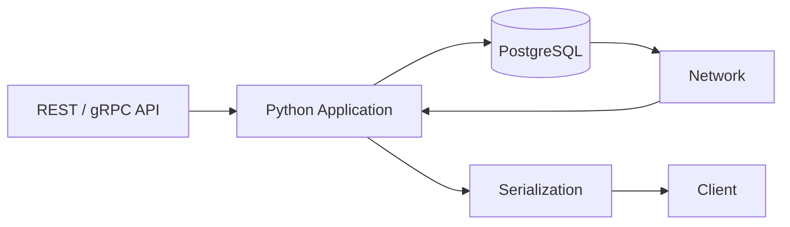
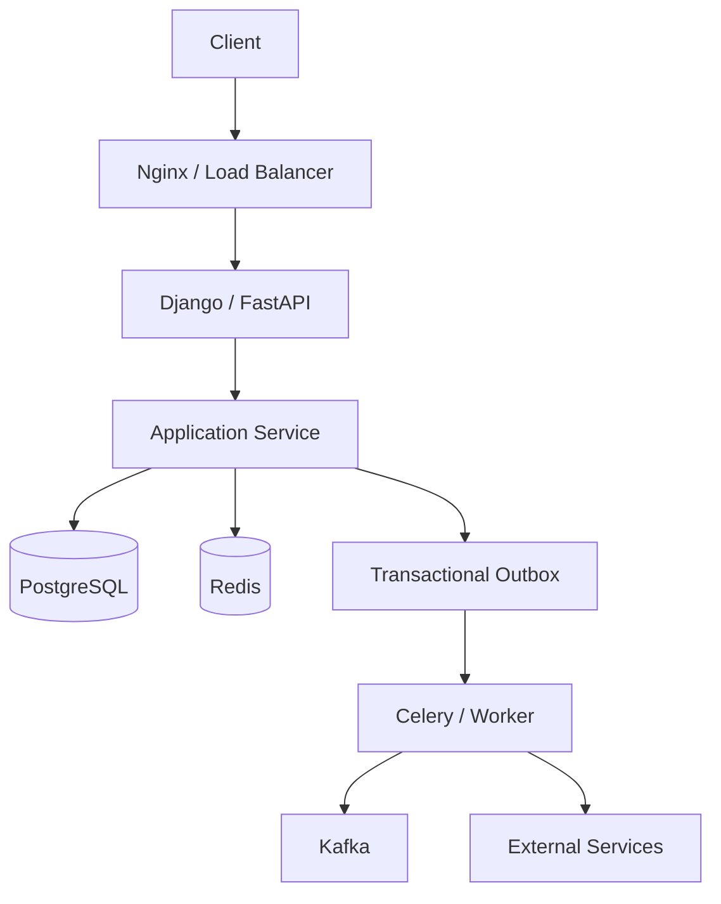

# README

## Overview

The `20- SQL Anti-Patterns and Common Mistakes` section focuses on the SQL problems that most often become expensive, unreliable, or dangerous in production systems.

Knowing SQL syntax is not enough for senior backend engineering. Production SQL must remain correct under:

- Large datasets.
- High concurrency.
- Increasing traffic.
- Long-lived transactions.
- Replication.
- Connection pooling.
- Rolling deployments.
- Retries and failures.
- Multi-tenant access.
- Operational maintenance.

The central principle of this section is:

> **A SQL query is production-ready only when its correctness, resource usage, concurrency behavior, security, and operational impact are understood.**

## Navigation

| # | Section | Layer | Description |
|---|---|---|---|
| 01 | [SQL Anti-Patterns and Common Mistakes](./README.md) | Applied SQL | Production SQL mistakes covering correctness, performance, concurrency, and security |
| 02 | [01- SELECT Star Problems](./01-%20SELECT%20Star%20Problems.md) | Applied SQL | Why SELECT * causes performance, security, and compatibility problems |
| 03 | [02- Missing WHERE Conditions](./02-%20Missing%20WHERE%20Conditions.md) | Applied SQL | Consequences of unfiltered queries and accidental full-table operations |
| 04 | [03- Accidental Cartesian Products](./03-%20Accidental%20Cartesian%20Products.md) | Applied SQL | How missing JOIN conditions produce explosive result sets |
| 05 | [04- Incorrect JOIN Conditions](./04-%20Incorrect%20JOIN%20Conditions.md) | Applied SQL | Common JOIN predicate mistakes and how to diagnose them |
| 06 | [05- Duplicate Rows from JOINs](./05-%20Duplicate%20Rows%20from%20JOINs.md) | Applied SQL | Why JOINs multiply rows and how to prevent unintended duplicates |
| 07 | [06- NULL Comparison Mistakes](./06-%20NULL%20Comparison%20Mistakes.md) | Applied SQL | Three-valued logic traps and correct NULL handling |
| 08 | [07- NOT IN and NULL Problems](./07-%20NOT%20IN%20and%20NULL%20Problems.md) | Applied SQL | Why NOT IN returns no rows when a subquery contains NULL |
| 09 | [08- Implicit Type Conversion](./08-%20Implicit%20Type%20Conversion.md) | Applied SQL | Type mismatch behavior and its impact on index usage and correctness |
| 10 | [09- Functions on Indexed Columns](./09-%20Functions%20on%20Indexed%20Columns.md) | Applied SQL | How applying functions to indexed columns prevents index scans |
| 11 | [10- Over-Indexing](./10-%20Over-Indexing.md) | Applied SQL | The write overhead and storage cost of unnecessary indexes |
| 12 | [11- Under-Indexing](./11-%20Under-Indexing.md) | Applied SQL | Missing indexes and the sequential scan penalty at scale |
| 13 | [12- OFFSET Pagination at Scale](./12-%20OFFSET%20Pagination%20at%20Scale.md) | Applied SQL | Why OFFSET pagination degrades with large page numbers |
| 14 | [13- N Plus One Queries](./13-%20N%20Plus%20One%20Queries.md) | Applied SQL | How ORM lazy loading generates O(n) database queries |
| 15 | [14- Unnecessary Correlated Subqueries](./14-%20Unnecessary%20Correlated%20Subqueries.md) | Applied SQL | Row-by-row subquery execution and when to use JOINs instead |
| 16 | [15- Overusing CTEs](./15-%20Overusing%20CTEs.md) | Applied SQL | CTE materialization behavior and when CTEs add unnecessary overhead |
| 17 | [16- Overusing Stored Procedures](./16-%20Overusing%20Stored%20Procedures.md) | Applied SQL | When stored procedures create operational and testing problems |
| 18 | [17- Large Transactions](./17-%20Large%20Transactions.md) | Applied SQL | Lock duration, bloat, replication lag, and retry complexity from long transactions |
| 19 | [18- Unbounded Queries](./18-%20Unbounded%20Queries.md) | Applied SQL | Queries without LIMIT that can return or process unbounded result sets |
| 20 | [19- Application Logic in SQL](./19-%20Application%20Logic%20in%20SQL.md) | Applied SQL | When embedding business logic in SQL creates maintenance problems |
| 21 | [20- SQL Injection Basics](./20-%20SQL%20Injection%20Basics.md) | Applied SQL | How SQL injection works and parameterized query defense |
| 22 | [21- Common Production SQL Mistakes](./21-%20Common%20Production%20SQL%20Mistakes.md) | Applied SQL | Consolidated production SQL anti-patterns and their mitigations |

---

## What This Section Covers

The section progresses from common query mistakes to deeper production concerns.

```text
SQL correctness
      ↓
Query construction
      ↓
Query performance
      ↓
Indexes and access paths
      ↓
Pagination and result size
      ↓
Transactions and concurrency
      ↓
Security
      ↓
Application/database boundaries
      ↓
Production operations
```

The goal is not to memorize anti-patterns.

The goal is to recognize **why a seemingly reasonable SQL design fails under real production conditions**.

---

## Anti-Pattern Categories

| Category | Typical Problems | Primary Risk |
|---|---|---|
| Query correctness | `NULL` mistakes, incorrect joins, wrong grouping | Incorrect data |
| Query construction | SQL injection, implicit conversions | Security / correctness |
| Result handling | `SELECT *`, unbounded queries | Memory / network |
| Pagination | Deep `OFFSET`, nondeterministic ordering | Latency / scalability |
| Query structure | N+1, correlated subqueries, unnecessary CTEs | Performance / maintainability |
| Indexing | Over-indexing, under-indexing, wrong column order | Read/write performance |
| Transactions | Large or long transactions | Locks / WAL / bloat |
| Concurrency | Race conditions, deadlocks | Reliability |
| Application boundaries | Excessive SQL business logic | Maintainability |
| Production operations | Unsafe migrations, expensive queries | Availability |
| Security | Injection, authorization gaps, tenant leakage | Data compromise |

---

## Document Map

### Query Semantics and Correctness

| File | Topic | Primary Concern |
|---|---|---|
| `01- SELECT * in Production.md` | Explicit column selection | Data transfer and schema coupling |
| `02- Unnecessary DISTINCT.md` | Avoiding unnecessary duplicate elimination | Sorting and query cost |
| `03- Missing WHERE Conditions.md` | Accidental broad operations | Incorrect reads/writes |
| `04- Accidental Cartesian Products.md` | Missing or incorrect joins | Row explosion |
| `05- Incorrect GROUP BY.md` | Aggregation mistakes | Incorrect results |
| `06- NULL Comparison Mistakes.md` | SQL three-valued logic | Incorrect filtering |
| `07- NOT IN and NULL Problems.md` | `NULL` interaction with exclusion | Incorrect results |
| `08- Implicit Type Conversion.md` | Mismatched SQL/application types | Performance and correctness |

### Query Performance

| File | Topic | Primary Concern |
|---|---|---|
| `09- Functions on Indexed Columns.md` | Expressions on indexed predicates | Index usability |
| `10- Over-Indexing.md` | Excessive indexes | Write and storage cost |
| `11- Under-Indexing.md` | Missing access paths | Slow reads |
| `12- OFFSET Pagination at Scale.md` | Offset-based pagination | Increasing latency |
| `13- N Plus One Queries.md` | Per-row database access | Excessive query count |
| `14- Unnecessary Correlated Subqueries.md` | Repeated correlated work | Query execution cost |
| `15- Overusing CTEs.md` | Excessive query decomposition | Complexity and intermediate work |

### Database/Application Boundaries

| File | Topic | Primary Concern |
|---|---|---|
| `16- Overusing Stored Procedures.md` | Excessive database-side business logic | Maintainability and coupling |
| `17- Large Transactions.md` | Oversized or long-running transactions | Locks, WAL, bloat |
| `18- Unbounded Queries.md` | Unbounded database work/results | Resource exhaustion |
| `19- Application Logic in SQL.md` | Moving domain workflows into SQL | Architectural coupling |
| `20- SQL Injection Basics.md` | Unsafe SQL construction | Security |
| `21- Common Production SQL Mistakes.md` | Cross-cutting production failures | Reliability and operations |

---

## Query Correctness Comes First

Performance optimization is meaningless if the query returns the wrong data.

Before optimizing, establish:

```text
What is one row?
        ↓
What relations are being joined?
        ↓
Can joins multiply rows?
        ↓
How are NULLs handled?
        ↓
What filters apply?
        ↓
What should the result grain be?
```

For example, if a query is expected to return:

```text
one row per customer
```

but joins two one-to-many relations, the intermediate result may become:

```text
customer
  × orders
  × payments
```

before aggregation.

Senior SQL review therefore starts with **data semantics**, not indexes.

---

## Performance Anti-Patterns

The most important performance principle is:

> **Optimize the amount of work the database must perform, not just the number of rows returned.**

For example:

```sql
SELECT id
FROM orders
ORDER BY created_at DESC
LIMIT 50;
```

may still perform substantial work if PostgreSQL must scan or sort a large dataset before finding the required rows.

Similarly:

```sql
LIMIT 50 OFFSET 1000000
```

returns only 50 rows but may require PostgreSQL to process many preceding rows.

Production SQL should be evaluated using:

```sql
EXPLAIN (ANALYZE, BUFFERS)
SELECT ...;
```

where running the query is safe in the target environment.

---

## Result Size Is a Production Concern

A database query affects more than PostgreSQL.

The complete path is:



A large result can consume:

- Database memory.
- Application memory.
- Network bandwidth.
- Serialization CPU.
- Client memory.
- Request timeout budget.

Therefore:

```text
SELECT *
+
unbounded results
```

is frequently a production problem even when the SQL itself is syntactically correct.

---

## Pagination

Pagination must be designed around dataset size.

### Offset Pagination

```sql
SELECT id, created_at
FROM orders
ORDER BY created_at DESC, id DESC
LIMIT 50 OFFSET 10000;
```

Advantages:

- Simple.
- Easy to understand.
- Useful for small datasets and shallow pages.
- Convenient when random page access is required.

Limitations:

- Work generally increases with offset.
- Deep pages become expensive.
- Concurrent changes can cause inconsistent page boundaries.

### Keyset Pagination

```sql
SELECT id, created_at
FROM orders
WHERE (created_at, id) < ($1, $2)
ORDER BY created_at DESC, id DESC
LIMIT 50;
```

Advantages:

- Efficient for large datasets.
- Stable traversal.
- Works well with an aligned index.

The ordering must be deterministic, commonly using a unique tie-breaker such as `id`.

---

## Indexing Anti-Patterns

Indexes are access paths, not guarantees of fast execution.

A good index strategy considers:

```text
WHERE
JOIN
ORDER BY
GROUP BY
data distribution
write frequency
query frequency
```

For example:

```sql
CREATE INDEX orders_customer_created_idx
ON orders (customer_id, created_at DESC);
```

may support:

```sql
SELECT id, created_at
FROM orders
WHERE customer_id = $1
ORDER BY created_at DESC
LIMIT 50;
```

But adding indexes indiscriminately increases:

- Storage.
- WAL.
- Write cost.
- Vacuum work.
- Replication traffic.
- Backup size.

Index decisions should therefore be workload-driven.

---

## Transactions and Concurrency

Production SQL runs concurrently.

A query that works correctly in isolation can fail under concurrent requests.

Consider:

```text
Request A → read balance
Request B → read balance
Request A → modify balance
Request B → modify balance
```

The application must deliberately define the concurrency behavior.

Useful database mechanisms include:

- Transactions.
- Row-level locks.
- Atomic updates.
- Unique constraints.
- Check constraints.
- Appropriate isolation levels.
- `SELECT ... FOR UPDATE`.
- `SKIP LOCKED` for appropriate queue-like workloads.

The correct solution depends on the invariant being protected.

---

## Large Transactions

Large transactions can create:

```text
long locks
+
large WAL
+
replica lag
+
vacuum pressure
+
bloat
+
large rollback cost
```

For large data processing, prefer controlled batches when the operation permits it.

For example:

```text
select batch
    ↓
process
    ↓
commit
    ↓
next batch
```

However, batching must preserve correctness and idempotency.

There is no universal "correct" batch size.

---

## Retry and Idempotency

Production systems retry.

Possible causes include:

- Client timeouts.
- Network failures.
- Load balancer behavior.
- Worker retries.
- Kubernetes restarts.
- Serialization failures.
- Deadlocks.

A write should therefore consider:

```text
What happens if this operation runs twice?
```

A database uniqueness constraint can support idempotency:

```sql
CREATE UNIQUE INDEX payments_idempotency_key_idx
ON payments (idempotency_key);
```

For distributed workflows, combine database transactions with appropriate patterns such as a transactional outbox.

---

## Security Anti-Patterns

SQL security requires more than parameterization.

The security model should include:

```text
parameterized SQL
+
authentication
+
authorization
+
tenant isolation
+
least privilege
+
secure secrets
+
monitoring
```

For example, this query may be safe from SQL injection:

```sql
SELECT *
FROM orders
WHERE id = $1;
```

but still be insecure if the application fails to verify that the current user can access that order.

---

## SQL Injection

Unsafe:

```python
query = f"""
    SELECT id, email
    FROM users
    WHERE email = '{email}'
"""
```

Safe:

```python
cursor.execute(
    """
    SELECT id, email
    FROM users
    WHERE email = %s
    """,
    [email],
)
```

The primary defense is to keep:

```text
SQL structure
```

separate from:

```text
untrusted values
```

Input validation is useful for application correctness, but it does not replace parameterization.

---

## Multi-Tenancy

Production queries must explicitly respect tenant boundaries.

Instead of:

```sql
SELECT *
FROM orders
WHERE id = $1;
```

the access pattern may require:

```sql
SELECT
    id,
    status,
    total_amount
FROM orders
WHERE id = $1
  AND tenant_id = $2;
```

Depending on the architecture, PostgreSQL Row-Level Security can provide another enforcement layer.

The key principle is:

> **Tenant isolation must be part of the data-access design, not an assumption made by individual callers.**

---

## Application vs Database Responsibilities

The database should generally own:

```text
constraints
foreign keys
unique invariants
set-based data processing
aggregations
atomic state transitions
relational queries
```

The application should generally own:

```text
domain workflows
external API calls
Kafka orchestration
Redis interactions
user-facing validation
cross-service coordination
long-running workflows
```

This does not mean SQL should be simple.

A sophisticated SQL query can be exactly the right implementation when the problem is relational.

The anti-pattern occurs when the database becomes the application's workflow engine.

---

## Database-Specific Logic

PostgreSQL provides powerful capabilities such as:

- Window functions.
- CTEs.
- `ON CONFLICT`.
- `SKIP LOCKED`.
- JSON/JSONB operations.
- Partial indexes.
- Expression indexes.
- Exclusion constraints.
- Full-text search.

Using PostgreSQL-specific functionality is not inherently bad.

If PostgreSQL is an intentional platform choice, database-specific features can provide substantial value.

The important question is whether the coupling is:

```text
intentional
+
documented
+
tested
+
operationally understood
```

---

## Production Migrations

Database migrations are production operations.

Before applying a schema change, consider:

- Lock duration.
- Table size.
- Index creation cost.
- WAL generation.
- Replica lag.
- Rolling deployment compatibility.
- Backfill strategy.
- Rollback strategy.

Large schema changes often benefit from an expand/contract approach:

```text
Expand
  ↓
deploy compatible application
  ↓
backfill
  ↓
switch application behavior
  ↓
Contract
```

This is particularly important when multiple Kubernetes pods run different application versions during a rolling deployment.

---

## Observability

Production SQL requires visibility.

Useful signals include:

| Signal | Why It Matters |
|---|---|
| Query latency | Detect slow operations |
| Query frequency | Identify high-impact queries |
| Rows returned | Detect unbounded results |
| Rows affected | Detect dangerous writes |
| CPU | Identify compute pressure |
| I/O | Identify storage bottlenecks |
| Lock waits | Detect contention |
| Connections | Detect pool exhaustion |
| Replica lag | Detect replication pressure |
| Deadlocks | Detect concurrency problems |
| Errors | Detect correctness and operational failures |

PostgreSQL's `pg_stat_activity` and, where enabled, `pg_stat_statements` are useful operational tools.

For example:

```sql
SELECT
    query,
    calls,
    total_exec_time,
    mean_exec_time
FROM pg_stat_statements
ORDER BY total_exec_time DESC
LIMIT 20;
```

---

## Production Architecture

A healthy backend architecture keeps SQL close to the data without turning the database into the entire application.



Responsibilities remain explicit:

```text
API
→ transport

Application service
→ domain workflow

PostgreSQL
→ data, integrity, atomic operations

Redis
→ caching / read acceleration

Celery
→ asynchronous processing

Kafka
→ event distribution
```

---

## Review Workflow for Production SQL

A practical SQL review can follow this sequence:

```text
Understand business requirement
        ↓
Determine result grain
        ↓
Validate correctness
        ↓
Check tenant/security boundaries
        ↓
Bound result and work
        ↓
Inspect joins and cardinality
        ↓
Inspect indexes
        ↓
Review EXPLAIN
        ↓
Review transaction behavior
        ↓
Review concurrency
        ↓
Review retry/idempotency behavior
        ↓
Review operational impact
        ↓
Add monitoring and tests
```

This process catches substantially more problems than reviewing SQL syntax alone.

---

## Anti-Pattern Review Checklist

### Correctness

- [ ] Is the result grain explicit?
- [ ] Are joins cardinality-safe?
- [ ] Are duplicates expected?
- [ ] Are `NULL` semantics correct?
- [ ] Are aggregation semantics correct?
- [ ] Is ordering deterministic?
- [ ] Are tenant boundaries enforced?

### Performance

- [ ] Is the result bounded?
- [ ] Are only required columns selected?
- [ ] Is pagination appropriate?
- [ ] Are indexes aligned with the workload?
- [ ] Has the execution plan been inspected?
- [ ] Are statistics representative?
- [ ] What happens as data volume grows?

### Concurrency

- [ ] Can concurrent requests race?
- [ ] Are transactions correctly scoped?
- [ ] Are locks necessary?
- [ ] Can deadlocks occur?
- [ ] Are retryable failures handled?
- [ ] Is the operation idempotent?

### Security

- [ ] Are values parameterized?
- [ ] Are dynamic identifiers allowlisted?
- [ ] Are authorization checks explicit?
- [ ] Is tenant isolation enforced?
- [ ] Is the database role least privileged?
- [ ] Are sensitive errors hidden from clients?

### Operations

- [ ] Is the query observable?
- [ ] Can it cause replica lag?
- [ ] Can it overload PostgreSQL?
- [ ] Are appropriate timeouts configured?
- [ ] Is the migration deployment-safe?
- [ ] Is the behavior recoverable after failure?

---

## Senior Engineering Principles

### Correctness Before Optimization

Do not optimize an incorrect query.

Establish:

```text
semantic correctness
→
performance
```

not the reverse.

### Optimize for Work

Always consider:

```text
work per query
×
query frequency
×
concurrency
```

A 100 ms query executed 10,000 times per second can be more important than a 2-second query executed once per hour.

### Design for Growth

Ask:

```text
What happens at 10× the data?
What happens at 10× the traffic?
What happens during a failover?
What happens during a backfill?
What happens during a rolling deployment?
```

### Make Concurrency Explicit

Production systems execute operations simultaneously.

Use database primitives deliberately rather than relying on application timing.

### Keep Security at Every Boundary

A private PostgreSQL instance, ORM, WAF, or internal network does not eliminate application-level security requirements.

### Treat Database Objects as Production Code

Views, functions, procedures, triggers, indexes, constraints, and migrations should be:

- Version-controlled.
- Reviewed.
- Tested.
- Observable.
- Reproducible.

---

## Interview Perspective

A strong senior-level SQL answer should usually go beyond syntax.

When presented with a query, discuss:

```text
1. Correctness
2. Result grain
3. Cardinality
4. Indexes
5. Execution plan
6. Data volume
7. Concurrency
8. Transaction behavior
9. Security
10. Operational impact
```

For example, when asked:

> "How would you optimize this query?"

A strong answer starts by asking:

- What is the current execution plan?
- How many rows are involved?
- What is the query frequency?
- What are the important predicates?
- What indexes exist?
- What is the expected result size?
- Is the query executed concurrently?
- Is the query part of a transaction?
- What are the correctness requirements?
- Is the latency problem database execution, network transfer, or application processing?

This demonstrates production reasoning rather than memorized SQL techniques.

## Key Takeaways

- **Production SQL problems are usually caused by scale, concurrency, data growth, or operational assumptions rather than SQL syntax itself.**
- **Review SQL in the order of correctness, bounded work, execution plan, concurrency, security, and operational impact.**
- **Use PostgreSQL capabilities deliberately—indexes, constraints, transactions, atomic updates, and set-based operations should be driven by real workload requirements and measured behavior.**
- **Treat pagination, transactions, retries, tenant isolation, migrations, and observability as part of SQL design rather than separate operational concerns.**
- **The senior SQL mindset is to reason about what happens under large data, high concurrency, failures, deployments, and retries—not merely whether the query works on a development dataset.**