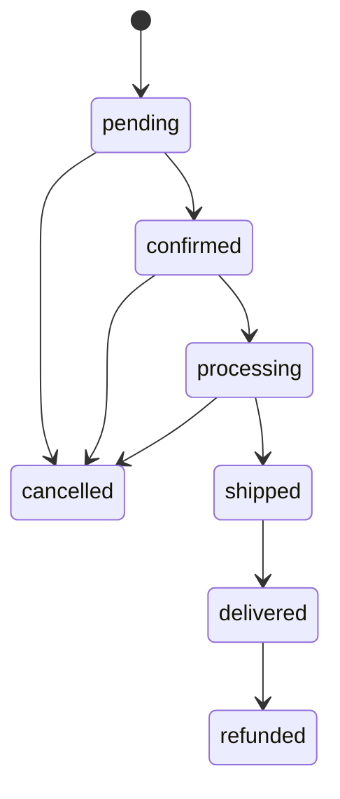

# 01- Requirements

## Overview

This project defines a production-oriented relational database for an **E-Commerce platform** using PostgreSQL.

The database must support the complete lifecycle of an online shopping system:

```text
Customer
   ↓
Product discovery
   ↓
Cart
   ↓
Order
   ↓
Payment
   ↓
Inventory
   ↓
Shipment
   ↓
Delivery
```

The requirements are intentionally designed to exercise practical SQL and relational database engineering rather than merely create a collection of CRUD tables.

The project should demonstrate:

- Relational modeling.
- Normalization.
- Primary and foreign keys.
- Constraints.
- Transactions.
- Indexing.
- Query optimization.
- Aggregation.
- Joins.
- Window functions.
- Pagination.
- Concurrency control.
- Inventory consistency.
- Order and payment state management.
- Reporting queries.
- Production-oriented data integrity.

---

## Project Scope

The system represents a simplified but realistic e-commerce backend.

### Core capabilities

The database must support:

- Customer accounts.
- Customer addresses.
- Product catalog.
- Product categories.
- Product variants.
- Product pricing.
- Inventory.
- Shopping carts.
- Cart items.
- Orders.
- Order items.
- Payments.
- Shipments.
- Order status history.
- Product reviews.
- Coupons and discounts.

The project should prioritize database correctness and realistic backend access patterns over implementing every possible e-commerce feature.

---

## System Actors

The database will primarily support these actors:

| Actor | Responsibilities |
|---|---|
| Customer | Browse products, manage cart, place orders, make payments, track shipments |
| Admin | Manage products, inventory, pricing, categories, orders |
| Warehouse | Manage inventory and fulfillment |
| Payment System | Record payment attempts and outcomes |
| Shipping System | Create and update shipment information |
| Backend Service | Coordinates application workflows and database transactions |

---

## Functional Requirements

## Customer Management

The system must store customer information.

A customer should have:

- Unique identifier.
- Name.
- Email address.
- Password hash.
- Account status.
- Creation timestamp.
- Update timestamp.

### Requirements

- Email must be unique.
- Email should be stored in a normalized form.
- Passwords must never be stored as plaintext.
- Customer status should support lifecycle management.
- Customers may have multiple addresses.
- Customer records should support auditing through timestamps.

Example statuses:

```text
active
suspended
deleted
```

The database should enforce structural integrity, while authentication and password verification remain application responsibilities.

---

## Customer Addresses

A customer may have multiple addresses.

An address should support:

- Address type.
- Recipient name.
- Address lines.
- City.
- State/province.
- Postal code.
- Country.
- Default-address indicator.

Possible address types:

```text
billing
shipping
```

The model should allow:

```text
Customer
   ├── Address
   ├── Address
   └── Address
```

An application may designate one address as the default for a particular purpose.

---

## Product Catalog

The system must support a product catalog.

A product should have:

- Unique identifier.
- SKU or product code.
- Name.
- Description.
- Brand.
- Category.
- Status.
- Creation timestamp.
- Update timestamp.

Products should support lifecycle states such as:

```text
draft
active
inactive
discontinued
```

Products should not be physically deleted when historical orders depend on them.

---

## Product Categories

Products must belong to categories.

The system should support:

```text
Category
   ↓
Products
```

The design should allow categories to be managed independently from products.

A category should have:

- Unique identifier.
- Name.
- Slug.
- Optional description.
- Active status.
- Timestamps.

Category names/slugs should follow appropriate uniqueness rules.

---

## Product Variants

Products may have multiple purchasable variants.

For example:

```text
T-Shirt
 ├── Small / Black
 ├── Medium / Black
 ├── Large / Black
 ├── Small / White
 └── Medium / White
```

A variant should have:

- Unique identifier.
- Product reference.
- SKU.
- Optional variant attributes.
- Price.
- Active status.

Inventory should normally be tracked at the **variant/SKU level**, not merely at the product level.

---

## Product Attributes

The system should support variant attributes such as:

```text
size = medium
color = black
storage = 256GB
```

The implementation may use normalized relational structures or PostgreSQL `JSONB` where appropriate.

The design should avoid using JSONB as an excuse to remove all relational structure.

Fields that participate heavily in:

```text
WHERE
JOIN
ORDER BY
UNIQUE
```

operations should generally remain structured relational attributes.

---

## Product Pricing

The system must represent the current selling price of a product variant.

Pricing requirements should allow:

- Current price.
- Currency.
- Effective timestamps.
- Historical pricing where required.

Historical prices should remain available for auditing and order history.

An order item must not depend on the product's current price after the order has been created.

---

## Order Price Snapshot

When an order is created, the order item should capture the price used for that transaction.

For example:

```text
Product current price
        ↓
Order creation
        ↓
Order item unit price snapshot
```

This prevents historical orders from changing when the product price changes.

An order item should contain values such as:

- Product/variant reference.
- Product name snapshot where appropriate.
- Quantity.
- Unit price.
- Discount.
- Tax.
- Line total.

The exact monetary model should use `NUMERIC` rather than floating-point types.

---

## Inventory

Inventory must be tracked at the product variant/SKU level.

Inventory should support at least:

- Available quantity.
- Reserved quantity.
- Stock status.
- Updated timestamp.

A conceptual inventory state is:

```text
available
    ↓
reserved
    ↓
fulfilled
```

The system must prevent inventory quantities from becoming invalid.

For example:

```sql
CHECK (available_quantity >= 0)
```

where the selected inventory model makes that invariant appropriate.

---

## Inventory Reservations

Placing an order may require reserving inventory.

A reservation should identify:

- Order.
- Product variant.
- Quantity.
- Reservation status.
- Creation timestamp.
- Expiration timestamp where applicable.

Possible states:

```text
reserved
released
consumed
expired
```

Inventory reservation must be concurrency-safe.

Two concurrent orders must not both successfully reserve the same finite inventory.

This requirement should be implemented using appropriate PostgreSQL transactions and locking/atomic-update strategies.

---

## Shopping Cart

A customer may have an active shopping cart.

A cart should contain:

- Customer reference.
- Status.
- Creation timestamp.
- Update timestamp.

Possible states:

```text
active
converted
abandoned
```

A customer should not accidentally have multiple active carts unless the application explicitly supports that behavior.

---

## Cart Items

A cart can contain multiple product variants.

A cart item should contain:

- Cart reference.
- Product variant reference.
- Quantity.
- Added timestamp.
- Updated timestamp.

A cart should normally contain at most one row for a given product variant.

For example:

```text
cart_id + variant_id
```

can form a unique constraint.

Adding an existing item should generally update its quantity rather than create an uncontrolled duplicate row.

---

## Order Management

An order represents a customer's purchase.

An order should have:

- Unique order identifier.
- Customer reference.
- Order status.
- Currency.
- Subtotal.
- Discount amount.
- Tax amount.
- Shipping amount.
- Grand total.
- Billing address snapshot.
- Shipping address snapshot.
- Creation timestamp.
- Update timestamp.

Possible order states:

```text
pending
confirmed
processing
shipped
delivered
cancelled
refunded
```

The application should define valid state transitions.

---

## Order State Transitions

Order status changes should follow an explicit state model.

Example:



Not every transition should be permitted.

For example:

```text
delivered → processing
```

should generally not be an ordinary order transition.

The application owns the workflow, while the database should preserve valid state and historical records.

---

## Order Items

Each order contains one or more order items.

An order item should include:

- Order reference.
- Product variant reference.
- Quantity.
- Unit price snapshot.
- Discount.
- Tax.
- Line total.

The database must preserve historical order information even if:

- The product is renamed.
- The product is discontinued.
- The current price changes.
- The SKU becomes inactive.

Historical transaction data must not depend entirely on mutable catalog data.

---

## Payment Management

The system must record payment attempts.

A payment record should support:

- Order reference.
- Payment provider.
- Provider transaction identifier.
- Amount.
- Currency.
- Payment status.
- Failure reason where appropriate.
- Created timestamp.
- Updated timestamp.

Possible states:

```text
pending
authorized
captured
failed
cancelled
refunded
```

Payment state transitions must be designed to handle retries and duplicate callbacks.

---

## Payment Idempotency

Payment operations must support idempotency.

For example:

```text
API request
    ↓
idempotency key
    ↓
database uniqueness
    ↓
payment operation
```

A suitable database constraint can prevent duplicate logical payment records:

```sql
CREATE UNIQUE INDEX ...
```

The exact uniqueness key should reflect the payment provider's semantics.

The database should help enforce idempotency, while the application handles provider interaction and retry behavior.

---

## Payment Provider Integration

The database must not directly depend on external payment APIs.

The intended architecture is:

```text
Application
    ↓
PostgreSQL transaction
    ↓
Payment state / outbox
    ↓
Payment provider integration
```

The payment provider may be external to the database.

The database stores durable state and identifiers required for reconciliation.

---

## Shipment Management

An order may have one or more shipment records depending on fulfillment requirements.

A shipment should contain:

- Order reference.
- Carrier.
- Tracking number.
- Shipment status.
- Shipped timestamp.
- Delivered timestamp.
- Creation timestamp.
- Update timestamp.

Possible statuses:

```text
pending
packed
shipped
in_transit
delivered
failed
returned
```

The model should allow partial shipments if the project design supports multiple fulfillment groups.

---

## Order Status History

Order status changes should be auditable.

A history record should contain:

- Order reference.
- Previous status.
- New status.
- Changed timestamp.
- Actor/source.
- Optional reason.

Example:

```text
pending
   ↓
confirmed
   ↓
processing
   ↓
shipped
   ↓
delivered
```

This supports:

- Customer support.
- Debugging.
- Auditing.
- Analytics.
- Operational investigations.

---

## Product Reviews

Customers may submit reviews for products they purchased.

A review should include:

- Customer reference.
- Product reference.
- Rating.
- Review text.
- Status.
- Creation timestamp.
- Update timestamp.

Rating should have a database constraint.

For example:

```sql
CHECK (rating BETWEEN 1 AND 5)
```

The system should decide whether multiple reviews per customer/product are allowed.

If only one review is allowed:

```text
UNIQUE(customer_id, product_id)
```

may be appropriate.

---

## Coupons and Discounts

The system should support discount codes.

A coupon may contain:

- Code.
- Discount type.
- Discount value.
- Minimum order amount.
- Maximum discount.
- Start time.
- Expiration time.
- Usage limit.
- Active status.

Possible discount types:

```text
percentage
fixed_amount
```

The application should validate business eligibility, while the database preserves valid stored values.

---

## Coupon Usage

Coupon usage should be tracked separately from coupon definition.

A usage record can identify:

- Coupon.
- Customer.
- Order.
- Applied amount.
- Timestamp.

This enables queries such as:

```text
How many times has this coupon been used?
Which customers used it?
Which orders received the discount?
```

Concurrency must be considered when enforcing usage limits.

---

## Monetary Values

All monetary amounts should use an exact numeric representation.

For PostgreSQL:

```sql
NUMERIC(12, 2)
```

or an appropriate precision for the business domain.

Avoid:

```text
FLOAT
REAL
DOUBLE PRECISION
```

for currency calculations where exact decimal semantics are required.

The database should store:

```text
amount
+
currency
```

rather than assuming every amount is denominated in one global currency.

---

## Timestamps

Transactional records should use timestamps suitable for distributed backend systems.

The preferred PostgreSQL representation is generally:

```sql
TIMESTAMPTZ
```

Application and database conventions should define whether timestamps are represented in UTC.

Avoid mixing:

```text
timestamp without time zone
+
timestamp with time zone
```

without a deliberate reason.

---

## Identifiers

Every major entity must have a stable primary key.

Candidates include:

```text
BIGINT
UUID
```

The project should choose an identifier strategy deliberately.

Identifiers should:

- Be immutable.
- Have stable semantics.
- Not encode business meaning.
- Be suitable for foreign-key references.

Human-readable order numbers can be separate from internal primary keys.

---

## Data Integrity Requirements

The database must enforce structural integrity wherever practical.

Use:

```text
PRIMARY KEY
FOREIGN KEY
UNIQUE
NOT NULL
CHECK
```

Examples:

```sql
CHECK (quantity > 0)
```

```sql
CHECK (rating BETWEEN 1 AND 5)
```

```sql
UNIQUE (sku)
```

Application validation remains important, but critical database invariants should not depend solely on application behavior.

---

## Referential Integrity

Relationships should be represented using foreign keys.

Examples:

```text
order.customer_id
    → customer.id

order_item.order_id
    → order.id

order_item.variant_id
    → product_variant.id

payment.order_id
    → order.id
```

Foreign keys prevent orphaned records unless the design explicitly allows them.

Delete behavior should be chosen deliberately.

For transactional data, cascading deletion should not be used casually.

---

## Soft Deletion

Catalog entities may require soft deletion or lifecycle states rather than physical deletion.

For example:

```text
products.status = discontinued
```

instead of:

```sql
DELETE FROM products;
```

Historical orders should remain queryable even after a product is no longer available for purchase.

Soft deletion must be applied consistently to queries.

---

## Auditability

The project should preserve sufficient historical information to answer:

```text
What happened?
When did it happen?
Which entity changed?
What was the previous state?
What is the current state?
```

At minimum, important transactional entities should include timestamps.

State-history tables should be used where detailed lifecycle auditing is required.

---

## Query Requirements

The database should support practical backend queries.

### Product Queries

Examples:

- Find active products.
- Find products by category.
- Search products by SKU.
- Find variants for a product.
- Find products within a price range.
- Sort products by price.
- Sort products by creation date.

### Customer Queries

Examples:

- Find customer by email.
- Retrieve customer addresses.
- Retrieve customer order history.
- Calculate customer lifetime value.

### Cart Queries

Examples:

- Retrieve active cart.
- Add product to cart.
- Update cart quantity.
- Remove cart item.
- Calculate cart total.

### Order Queries

Examples:

- Retrieve order by ID.
- Retrieve customer order history.
- Find orders by status.
- Find recent orders.
- Calculate order totals.
- Find pending orders requiring processing.

### Inventory Queries

Examples:

- Find available inventory.
- Reserve inventory.
- Release reservation.
- Find low-stock products.
- Find inventory changes.

### Payment Queries

Examples:

- Retrieve payment status.
- Find failed payment attempts.
- Find payments requiring reconciliation.
- Retrieve transactions by provider identifier.

### Reporting Queries

Examples:

- Revenue by day.
- Revenue by product.
- Revenue by category.
- Top-selling products.
- Average order value.
- Customer lifetime value.
- Orders by status.
- Inventory value.
- Coupon usage.
- Product review averages.

---

## Pagination Requirements

Customer-facing list APIs must not return unbounded results.

The database design should support pagination for:

- Products.
- Orders.
- Reviews.
- Customers.
- Inventory records.

For large datasets, keyset pagination should be considered.

A deterministic ordering should use a unique tie-breaker.

Example:

```sql
ORDER BY created_at DESC, id DESC
```

---

## Search Requirements

The initial project should support structured search using indexed columns.

Examples:

```text
SKU
product name
category
status
price range
creation date
```

PostgreSQL full-text search or trigram search may be introduced later if search requirements justify it.

Search functionality should not be implemented by transferring the entire product catalog into Python.

---

## Transaction Requirements

Order creation should be transactional.

A conceptual workflow is:

```text
BEGIN
    ↓
validate customer/cart state
    ↓
lock or atomically reserve inventory
    ↓
create order
    ↓
create order items
    ↓
create payment state
    ↓
create outbox event
    ↓
COMMIT
```

The exact transaction boundary should be kept as short as practical.

External API calls should not remain inside the database transaction.

---

## Order Creation Consistency

The system must prevent:

```text
Order created
+
inventory not reserved
```

or:

```text
Inventory reserved
+
order creation failed
```

when both operations are intended to be atomic.

The database transaction should coordinate local state transitions.

External payment or shipping calls should use explicit asynchronous or compensating workflows.

---

## Concurrency Requirements

The database must support concurrent customers attempting to purchase the same inventory.

Example:

```text
Inventory = 5

Customer A → requests 4
Customer B → requests 3
```

The system must not allow:

```text
A reserves 4
B reserves 3
```

unless the business model explicitly supports overselling.

Inventory updates must therefore use suitable PostgreSQL transaction and locking mechanisms.

---

## Outbox Requirements

Events that must be published after a successful transaction should be persisted transactionally.

Example:

```text
orders
order_items
outbox_events
```

can be committed together.

A background worker can then publish:

```text
order.created
order.confirmed
payment.completed
shipment.created
```

to Kafka or another event system.

This avoids relying on an unreliable:

```text
database commit
+
independent event publish
```

sequence.

---

## Data Lifecycle

The project should distinguish between:

```text
mutable catalog data
```

and:

```text
historical transactional data
```

For example:

```text
Product price
    ↓
changes over time

Order item price
    ↓
must remain historically correct
```

Historical data should not silently change because current catalog information changed.

---

## Production Scale Assumptions

The schema should be designed with growth in mind.

A conceptual target workload might include:

| Entity | Approximate scale |
|---|---:|
| Customers | 1–10 million |
| Products | 100k–1 million |
| Product variants | 500k–5 million |
| Orders | 10–100+ million |
| Order items | 50–500+ million |
| Payments | 10–200+ million |
| Reviews | 1–50 million |

These are design targets rather than strict implementation requirements.

The important objective is to avoid a schema that only works for development-sized datasets.

---

## Indexing Requirements

Indexes should support actual application access patterns.

Likely candidates include:

```text
customer.email
product.sku
product.category_id
product.status
product_variant.product_id
order.customer_id
order.created_at
order.status
order_item.order_id
payment.order_id
payment.provider_transaction_id
shipment.order_id
review.product_id
```

Composite indexes should be introduced based on real query patterns.

Do not automatically index every column.

---

## Example Access Pattern

A common order-history query might be:

```sql
SELECT
    id,
    status,
    grand_total,
    created_at
FROM orders
WHERE customer_id = $1
ORDER BY created_at DESC, id DESC
LIMIT 50;
```

A supporting index might be:

```sql
CREATE INDEX orders_customer_created_id_idx
ON orders (
    customer_id,
    created_at DESC,
    id DESC
);
```

The index should be validated using the actual execution plan and workload.

---

## Security Requirements

The system must protect:

- Customer information.
- Password hashes.
- Payment identifiers.
- Addresses.
- Internal operational data.

Requirements include:

- Parameterized SQL.
- Least-privilege database roles.
- Explicit authorization.
- Tenant boundaries if multi-tenancy is introduced.
- Secure secret management.
- Controlled database access.
- Auditability of sensitive operations.

Payment card data should not be stored directly unless the architecture and compliance requirements explicitly require it.

Prefer tokenized payment-provider identifiers.

---

## Availability Requirements

The database should support a production architecture with:

```text
Application replicas
        ↓
Connection pool
        ↓
PostgreSQL primary
        ↓
Read replicas
```

Read replicas may support suitable read-heavy workloads.

Strong read-after-write requirements should be routed appropriately because asynchronous replicas can lag behind the primary.

---

## Backup and Recovery Requirements

The project should assume that production data requires recovery capability.

The operational design should include:

- Automated backups.
- Point-in-time recovery where supported.
- Restore testing.
- Retention policies.
- Recovery objectives.
- Monitoring for backup failures.

A backup that has never been restored successfully should not be treated as proven disaster recovery.

---

## Monitoring Requirements

Important database metrics include:

```text
query latency
query throughput
database CPU
database I/O
connection usage
lock waits
deadlocks
transaction duration
replication lag
WAL generation
table/index growth
vacuum activity
```

Application metrics should also track:

```text
orders created
payment failures
inventory reservation failures
checkout failures
```

Database and application telemetry should be correlated using request or trace identifiers where practical.

---

## Operational Requirements

The project should use migrations for schema changes.

The deployment process should support:

```text
Git
 ↓
migration tests
 ↓
integration tests
 ↓
schema migration
 ↓
application deployment
```

Production schema changes should consider rolling deployment compatibility.

For large tables, avoid assuming that every `ALTER TABLE`, index creation, or backfill is operationally cheap.

---

## Data Model Principles

The initial schema should follow these principles:

### Normalize Core Transactional Data

Avoid unnecessary duplication across:

```text
customers
products
orders
payments
inventory
```

### Snapshot Historical Transaction Values

Orders should preserve:

```text
price
tax
discount
shipping address
billing address
```

as required for historical correctness.

### Use Constraints for Invariants

Prefer database enforcement for:

```text
uniqueness
valid quantities
valid ratings
valid references
```

### Keep Workflows in the Application

The database should provide:

```text
data integrity
+
atomic operations
+
queries
```

while Django/FastAPI/application services coordinate:

```text
business workflows
+
external APIs
+
Kafka
+
Redis
+
Celery
```

---

## Expected Project Deliverables

The project should eventually contain documentation and SQL artifacts covering:

```text
Requirements
    ↓
Data Model
    ↓
ER Diagram
    ↓
Schema Design
    ↓
DDL
    ↓
Seed Data
    ↓
Indexes
    ↓
Queries
    ↓
Transactions
    ↓
Performance Analysis
    ↓
Production Considerations
```

The requirements document is the source of functional and non-functional expectations for the subsequent database design.

---

## Acceptance Criteria

The project is considered complete when the resulting database design can demonstrate:

- Correct relational modeling.
- Enforced primary and foreign-key relationships.
- Meaningful `NOT NULL`, `UNIQUE`, and `CHECK` constraints.
- Correct handling of product and order history.
- Safe inventory reservation under concurrency.
- Transactionally consistent order creation.
- Idempotent payment handling.
- Practical indexing.
- Efficient pagination.
- Representative reporting queries.
- SQL injection-safe access patterns.
- Multi-layer security considerations.
- Migration and deployment considerations.
- Production-oriented monitoring considerations.
- Backup and recovery planning.

The implementation should favor correctness and explainable engineering decisions over unnecessary complexity.

## Key Takeaways

- **The e-commerce database must model customers, catalog, inventory, carts, orders, payments, shipments, and reviews with explicit relational integrity and production-oriented constraints.**
- **Transactional history must be immutable where necessary: order prices, totals, and addresses should preserve the values relevant to the original transaction rather than depending on mutable catalog data.**
- **Inventory reservation, order creation, and payment state require deliberate transaction, concurrency, and idempotency design rather than simple CRUD operations.**
- **The schema must support realistic production access patterns through appropriate indexes, deterministic pagination, bounded queries, observability, security, backups, and migration-safe deployment.**
- **The project should demonstrate senior SQL engineering: database constraints and atomic operations belong close to the data, while application services coordinate domain workflows and external systems.**