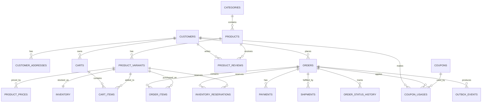
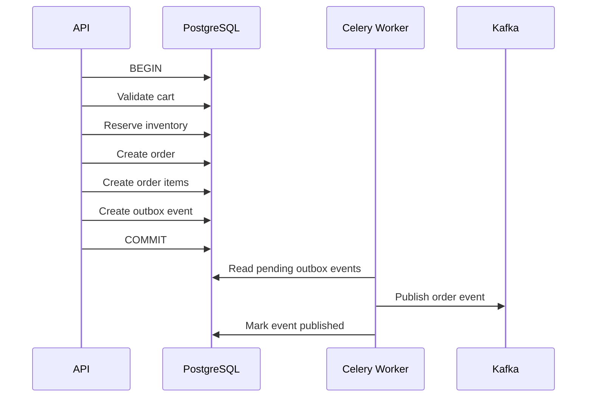
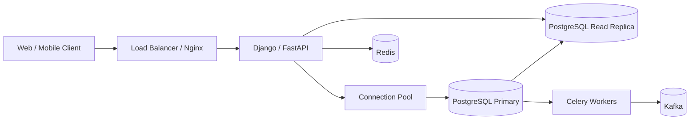

# 02- Schema Design

## Overview

The e-commerce database schema translates the requirements into a concrete relational model that PostgreSQL can enforce and efficiently query.

The design should separate:

- **Catalog data** — products, variants, categories, pricing.
- **Customer data** — customers and addresses.
- **Transactional data** — carts, orders, order items, payments.
- **Operational data** — inventory, reservations, shipments.
- **Audit data** — status history and other lifecycle records.
- **Promotional data** — coupons and coupon usage.
- **Customer-generated data** — product reviews.

The primary design goal is not to minimize the number of tables. It is to create clear ownership, explicit relationships, enforceable invariants, predictable query patterns, and a schema that remains maintainable as transaction volume grows.

The target database is **PostgreSQL**.

---

## Schema Design Principles

The schema follows several core principles.

| Principle | Design approach |
|---|---|
| Referential integrity | Foreign keys between related entities |
| Data integrity | `NOT NULL`, `CHECK`, `UNIQUE`, primary keys |
| Historical correctness | Snapshot transactional values where required |
| Normalization | Keep independently changing facts in separate tables |
| Query performance | Index based on real access patterns |
| Concurrency safety | Transactions, row locks, atomic updates |
| Auditability | Explicit history tables for important state changes |
| Scalability | Avoid unnecessary row duplication and unbounded relationships |
| Security | Least privilege and parameterized application access |
| Operational safety | Migration-friendly schema changes |

---

## High-Level Domain Model

The database can be divided into the following domains:

```text
Customer Domain
├── customers
└── customer_addresses

Catalog Domain
├── categories
├── products
├── product_variants
└── product_prices

Shopping Domain
├── carts
└── cart_items

Order Domain
├── orders
├── order_items
└── order_status_history

Inventory Domain
├── inventory
└── inventory_reservations

Payment Domain
└── payments

Fulfillment Domain
└── shipments

Review Domain
└── product_reviews

Promotion Domain
├── coupons
└── coupon_usages

Integration Domain
└── outbox_events
```

---

## Entity Relationship Diagram

The following represents the core relational model.



---

## Identifier Strategy

Every major entity should have a stable primary key.

For this project, `BIGINT GENERATED BY DEFAULT AS IDENTITY` is a strong default for internal relational identifiers.

Example:

```sql
id BIGINT GENERATED BY DEFAULT AS IDENTITY PRIMARY KEY
```

### Why identity-based BIGINT?

It provides:

- Compact indexes.
- Efficient joins.
- Efficient foreign keys.
- Sequential key generation.
- Large capacity.
- Native PostgreSQL support.

A separate public identifier can be introduced where exposing sequential internal IDs would be undesirable.

For example:

```text
internal id     → BIGINT
public order ID → UUID or opaque identifier
```

Do not encode business meaning into primary keys.

---

## Common Timestamp Columns

Transactional tables should generally include:

```sql
created_at TIMESTAMPTZ NOT NULL DEFAULT CURRENT_TIMESTAMP,
updated_at TIMESTAMPTZ NOT NULL DEFAULT CURRENT_TIMESTAMP
```

`updated_at` requires application or database-side handling to remain current.

For immutable event/history tables, only `created_at` may be necessary.

Use `TIMESTAMPTZ` consistently unless there is a specific reason to model a timezone-free timestamp.

---

## Customer Schema

## Customers

The `customers` table owns account-level customer information.

```sql
CREATE TABLE customers (
    id BIGINT GENERATED BY DEFAULT AS IDENTITY PRIMARY KEY,
    email TEXT NOT NULL,
    full_name TEXT NOT NULL,
    password_hash TEXT NOT NULL,
    status TEXT NOT NULL DEFAULT 'active',
    created_at TIMESTAMPTZ NOT NULL DEFAULT CURRENT_TIMESTAMP,
    updated_at TIMESTAMPTZ NOT NULL DEFAULT CURRENT_TIMESTAMP,

    CONSTRAINT customers_status_check
        CHECK (status IN ('active', 'suspended', 'deleted'))
);
```

Email uniqueness should be enforced according to the application's normalization rules.

A common PostgreSQL approach is:

```sql
CREATE UNIQUE INDEX customers_email_unique_idx
ON customers (LOWER(email));
```

The application should also normalize email handling consistently.

### Design consideration

Do not store:

```text
password
```

Store only a secure password hash generated by an appropriate password-hashing library.

---

## Customer Addresses

Addresses are separate because a customer can have multiple addresses.

```sql
CREATE TABLE customer_addresses (
    id BIGINT GENERATED BY DEFAULT AS IDENTITY PRIMARY KEY,
    customer_id BIGINT NOT NULL,
    address_type TEXT NOT NULL,
    recipient_name TEXT NOT NULL,
    address_line_1 TEXT NOT NULL,
    address_line_2 TEXT,
    city TEXT NOT NULL,
    state_province TEXT,
    postal_code TEXT NOT NULL,
    country_code CHAR(2) NOT NULL,
    is_default BOOLEAN NOT NULL DEFAULT FALSE,
    created_at TIMESTAMPTZ NOT NULL DEFAULT CURRENT_TIMESTAMP,
    updated_at TIMESTAMPTZ NOT NULL DEFAULT CURRENT_TIMESTAMP,

    CONSTRAINT customer_addresses_customer_fk
        FOREIGN KEY (customer_id)
        REFERENCES customers(id),

    CONSTRAINT customer_addresses_type_check
        CHECK (address_type IN ('billing', 'shipping'))
);
```

A customer may have multiple addresses.

If the business rule is "one default shipping address per customer", that should be enforced with a partial unique index rather than relying only on application code:

```sql
CREATE UNIQUE INDEX customer_one_default_shipping_idx
ON customer_addresses (customer_id)
WHERE address_type = 'shipping' AND is_default;
```

The same pattern can be used for billing addresses if required.

---

## Catalog Schema

## Categories

```sql
CREATE TABLE categories (
    id BIGINT GENERATED BY DEFAULT AS IDENTITY PRIMARY KEY,
    name TEXT NOT NULL,
    slug TEXT NOT NULL,
    description TEXT,
    is_active BOOLEAN NOT NULL DEFAULT TRUE,
    created_at TIMESTAMPTZ NOT NULL DEFAULT CURRENT_TIMESTAMP,
    updated_at TIMESTAMPTZ NOT NULL DEFAULT CURRENT_TIMESTAMP,

    CONSTRAINT categories_slug_unique UNIQUE (slug)
);
```

A slug is useful for stable API and URL representations.

---

## Products

A product represents the conceptual catalog item.

```sql
CREATE TABLE products (
    id BIGINT GENERATED BY DEFAULT AS IDENTITY PRIMARY KEY,
    category_id BIGINT NOT NULL,
    name TEXT NOT NULL,
    description TEXT,
    brand TEXT,
    status TEXT NOT NULL DEFAULT 'draft',
    created_at TIMESTAMPTZ NOT NULL DEFAULT CURRENT_TIMESTAMP,
    updated_at TIMESTAMPTZ NOT NULL DEFAULT CURRENT_TIMESTAMP,

    CONSTRAINT products_category_fk
        FOREIGN KEY (category_id)
        REFERENCES categories(id),

    CONSTRAINT products_status_check
        CHECK (status IN ('draft', 'active', 'inactive', 'discontinued'))
);
```

A product is not necessarily directly purchasable.

The purchasable unit is normally the variant.

---

## Product Variants

A variant represents a specific SKU.

```sql
CREATE TABLE product_variants (
    id BIGINT GENERATED BY DEFAULT AS IDENTITY PRIMARY KEY,
    product_id BIGINT NOT NULL,
    sku TEXT NOT NULL,
    attributes JSONB NOT NULL DEFAULT '{}'::jsonb,
    is_active BOOLEAN NOT NULL DEFAULT TRUE,
    created_at TIMESTAMPTZ NOT NULL DEFAULT CURRENT_TIMESTAMP,
    updated_at TIMESTAMPTZ NOT NULL DEFAULT CURRENT_TIMESTAMP,

    CONSTRAINT product_variants_product_fk
        FOREIGN KEY (product_id)
        REFERENCES products(id),

    CONSTRAINT product_variants_sku_unique UNIQUE (sku)
);
```

`JSONB` is appropriate for flexible variant attributes when the attribute structure varies significantly between products.

However, frequently queried attributes should not automatically be placed inside JSONB.

For example, if the application frequently executes:

```sql
WHERE size = 'medium'
```

or:

```sql
ORDER BY storage_capacity
```

a dedicated relational representation may be more appropriate.

---

## Product Pricing

Pricing is separated from variants to support historical prices.

```sql
CREATE TABLE product_prices (
    id BIGINT GENERATED BY DEFAULT AS IDENTITY PRIMARY KEY,
    variant_id BIGINT NOT NULL,
    currency_code CHAR(3) NOT NULL,
    amount NUMERIC(12, 2) NOT NULL,
    effective_from TIMESTAMPTZ NOT NULL,
    effective_to TIMESTAMPTZ,
    created_at TIMESTAMPTZ NOT NULL DEFAULT CURRENT_TIMESTAMP,

    CONSTRAINT product_prices_variant_fk
        FOREIGN KEY (variant_id)
        REFERENCES product_variants(id),

    CONSTRAINT product_prices_amount_check
        CHECK (amount >= 0),

    CONSTRAINT product_prices_period_check
        CHECK (
            effective_to IS NULL
            OR effective_to > effective_from
        )
);
```

This provides price history:

```text
Variant
   │
   ├── $100 → January
   ├── $110 → February
   └── $120 → March
```

For production systems where overlapping effective periods must be impossible, PostgreSQL range types and exclusion constraints can enforce that rule more strongly.

---

## Shopping Cart Schema

## Carts

```sql
CREATE TABLE carts (
    id BIGINT GENERATED BY DEFAULT AS IDENTITY PRIMARY KEY,
    customer_id BIGINT NOT NULL,
    status TEXT NOT NULL DEFAULT 'active',
    created_at TIMESTAMPTZ NOT NULL DEFAULT CURRENT_TIMESTAMP,
    updated_at TIMESTAMPTZ NOT NULL DEFAULT CURRENT_TIMESTAMP,

    CONSTRAINT carts_customer_fk
        FOREIGN KEY (customer_id)
        REFERENCES customers(id),

    CONSTRAINT carts_status_check
        CHECK (status IN ('active', 'converted', 'abandoned'))
);
```

If only one active cart is allowed:

```sql
CREATE UNIQUE INDEX carts_one_active_per_customer_idx
ON carts (customer_id)
WHERE status = 'active';
```

---

## Cart Items

```sql
CREATE TABLE cart_items (
    id BIGINT GENERATED BY DEFAULT AS IDENTITY PRIMARY KEY,
    cart_id BIGINT NOT NULL,
    variant_id BIGINT NOT NULL,
    quantity INTEGER NOT NULL,
    created_at TIMESTAMPTZ NOT NULL DEFAULT CURRENT_TIMESTAMP,
    updated_at TIMESTAMPTZ NOT NULL DEFAULT CURRENT_TIMESTAMP,

    CONSTRAINT cart_items_cart_fk
        FOREIGN KEY (cart_id)
        REFERENCES carts(id)
        ON DELETE CASCADE,

    CONSTRAINT cart_items_variant_fk
        FOREIGN KEY (variant_id)
        REFERENCES product_variants(id),

    CONSTRAINT cart_items_quantity_check
        CHECK (quantity > 0),

    CONSTRAINT cart_items_unique_variant
        UNIQUE (cart_id, variant_id)
);
```

The uniqueness constraint prevents:

```text
cart 100
 ├── variant 25 × 2
 └── variant 25 × 3
```

Instead, the application should update the existing row to:

```text
variant 25 × 5
```

---

## Order Schema

## Orders

An order represents a historical purchase transaction.

```sql
CREATE TABLE orders (
    id BIGINT GENERATED BY DEFAULT AS IDENTITY PRIMARY KEY,
    customer_id BIGINT NOT NULL,
    status TEXT NOT NULL DEFAULT 'pending',
    currency_code CHAR(3) NOT NULL,
    subtotal NUMERIC(12, 2) NOT NULL,
    discount_amount NUMERIC(12, 2) NOT NULL DEFAULT 0,
    tax_amount NUMERIC(12, 2) NOT NULL DEFAULT 0,
    shipping_amount NUMERIC(12, 2) NOT NULL DEFAULT 0,
    grand_total NUMERIC(12, 2) NOT NULL,
    billing_address JSONB NOT NULL,
    shipping_address JSONB NOT NULL,
    created_at TIMESTAMPTZ NOT NULL DEFAULT CURRENT_TIMESTAMP,
    updated_at TIMESTAMPTZ NOT NULL DEFAULT CURRENT_TIMESTAMP,

    CONSTRAINT orders_customer_fk
        FOREIGN KEY (customer_id)
        REFERENCES customers(id),

    CONSTRAINT orders_status_check
        CHECK (
            status IN (
                'pending',
                'confirmed',
                'processing',
                'shipped',
                'delivered',
                'cancelled',
                'refunded'
            )
        ),

    CONSTRAINT orders_subtotal_check
        CHECK (subtotal >= 0),

    CONSTRAINT orders_discount_check
        CHECK (discount_amount >= 0),

    CONSTRAINT orders_tax_check
        CHECK (tax_amount >= 0),

    CONSTRAINT orders_shipping_check
        CHECK (shipping_amount >= 0),

    CONSTRAINT orders_total_check
        CHECK (grand_total >= 0)
);
```

### Why are addresses stored as JSONB?

Order addresses are historical snapshots.

If the customer later changes their address, the old order must continue showing the address used for that transaction.

An alternative is to create normalized order-address tables:

```text
orders
 ├── order_billing_addresses
 └── order_shipping_addresses
```

That approach is preferable when the application needs extensive relational querying against historical addresses.

For this project, immutable JSONB snapshots are a reasonable trade-off because addresses are primarily displayed rather than independently queried.

---

## Order Items

```sql
CREATE TABLE order_items (
    id BIGINT GENERATED BY DEFAULT AS IDENTITY PRIMARY KEY,
    order_id BIGINT NOT NULL,
    variant_id BIGINT NOT NULL,
    product_name_snapshot TEXT NOT NULL,
    sku_snapshot TEXT NOT NULL,
    quantity INTEGER NOT NULL,
    unit_price NUMERIC(12, 2) NOT NULL,
    discount_amount NUMERIC(12, 2) NOT NULL DEFAULT 0,
    tax_amount NUMERIC(12, 2) NOT NULL DEFAULT 0,
    line_total NUMERIC(12, 2) NOT NULL,
    created_at TIMESTAMPTZ NOT NULL DEFAULT CURRENT_TIMESTAMP,

    CONSTRAINT order_items_order_fk
        FOREIGN KEY (order_id)
        REFERENCES orders(id)
        ON DELETE CASCADE,

    CONSTRAINT order_items_variant_fk
        FOREIGN KEY (variant_id)
        REFERENCES product_variants(id),

    CONSTRAINT order_items_quantity_check
        CHECK (quantity > 0),

    CONSTRAINT order_items_unit_price_check
        CHECK (unit_price >= 0),

    CONSTRAINT order_items_discount_check
        CHECK (discount_amount >= 0),

    CONSTRAINT order_items_tax_check
        CHECK (tax_amount >= 0),

    CONSTRAINT order_items_line_total_check
        CHECK (line_total >= 0)
);
```

The product foreign key provides the relationship to the current catalog, while snapshots preserve historical transaction information.

This distinction is important:

```text
Current catalog
     │
     └── mutable

Order item
     │
     ├── variant_id
     ├── product_name_snapshot
     ├── sku_snapshot
     └── unit_price
             │
             └── historical
```

---

## Order Status History

```sql
CREATE TABLE order_status_history (
    id BIGINT GENERATED BY DEFAULT AS IDENTITY PRIMARY KEY,
    order_id BIGINT NOT NULL,
    previous_status TEXT,
    new_status TEXT NOT NULL,
    changed_by TEXT,
    reason TEXT,
    created_at TIMESTAMPTZ NOT NULL DEFAULT CURRENT_TIMESTAMP,

    CONSTRAINT order_status_history_order_fk
        FOREIGN KEY (order_id)
        REFERENCES orders(id)
        ON DELETE CASCADE
);
```

The current state belongs in `orders`.

The historical sequence belongs in `order_status_history`.

This avoids repeatedly reconstructing the current state from historical records.

---

## Inventory Schema

## Inventory

Inventory is maintained at the SKU/variant level.

```sql
CREATE TABLE inventory (
    variant_id BIGINT PRIMARY KEY,
    available_quantity INTEGER NOT NULL DEFAULT 0,
    reserved_quantity INTEGER NOT NULL DEFAULT 0,
    updated_at TIMESTAMPTZ NOT NULL DEFAULT CURRENT_TIMESTAMP,

    CONSTRAINT inventory_variant_fk
        FOREIGN KEY (variant_id)
        REFERENCES product_variants(id),

    CONSTRAINT inventory_available_check
        CHECK (available_quantity >= 0),

    CONSTRAINT inventory_reserved_check
        CHECK (reserved_quantity >= 0)
);
```

A one-to-one relationship is appropriate because each active variant has one inventory aggregate in this model.

---

## Inventory Reservations

```sql
CREATE TABLE inventory_reservations (
    id BIGINT GENERATED BY DEFAULT AS IDENTITY PRIMARY KEY,
    order_id BIGINT NOT NULL,
    variant_id BIGINT NOT NULL,
    quantity INTEGER NOT NULL,
    status TEXT NOT NULL DEFAULT 'reserved',
    expires_at TIMESTAMPTZ,
    created_at TIMESTAMPTZ NOT NULL DEFAULT CURRENT_TIMESTAMP,
    updated_at TIMESTAMPTZ NOT NULL DEFAULT CURRENT_TIMESTAMP,

    CONSTRAINT inventory_reservations_order_fk
        FOREIGN KEY (order_id)
        REFERENCES orders(id),

    CONSTRAINT inventory_reservations_variant_fk
        FOREIGN KEY (variant_id)
        REFERENCES product_variants(id),

    CONSTRAINT inventory_reservations_quantity_check
        CHECK (quantity > 0),

    CONSTRAINT inventory_reservations_status_check
        CHECK (
            status IN (
                'reserved',
                'released',
                'consumed',
                'expired'
            )
        )
);
```

The reservation record provides an auditable representation of inventory held for an order.

---

## Concurrency-Safe Inventory Update

A reservation should not follow this unsafe sequence:

```text
SELECT available_quantity
        ↓
Python checks quantity
        ↓
Python decides it is sufficient
        ↓
UPDATE inventory
```

Two concurrent transactions can both observe the same inventory.

Prefer an atomic database operation:

```sql
UPDATE inventory
SET
    available_quantity = available_quantity - $1,
    reserved_quantity = reserved_quantity + $1,
    updated_at = CURRENT_TIMESTAMP
WHERE variant_id = $2
  AND available_quantity >= $1;
```

The application then checks the affected-row count.

```text
1 row updated → reservation succeeded
0 rows updated → insufficient inventory
```

This keeps the critical invariant close to the data.

---

## Payment Schema

```sql
CREATE TABLE payments (
    id BIGINT GENERATED BY DEFAULT AS IDENTITY PRIMARY KEY,
    order_id BIGINT NOT NULL,
    provider TEXT NOT NULL,
    provider_transaction_id TEXT,
    amount NUMERIC(12, 2) NOT NULL,
    currency_code CHAR(3) NOT NULL,
    status TEXT NOT NULL DEFAULT 'pending',
    failure_reason TEXT,
    created_at TIMESTAMPTZ NOT NULL DEFAULT CURRENT_TIMESTAMP,
    updated_at TIMESTAMPTZ NOT NULL DEFAULT CURRENT_TIMESTAMP,

    CONSTRAINT payments_order_fk
        FOREIGN KEY (order_id)
        REFERENCES orders(id),

    CONSTRAINT payments_amount_check
        CHECK (amount >= 0),

    CONSTRAINT payments_status_check
        CHECK (
            status IN (
                'pending',
                'authorized',
                'captured',
                'failed',
                'cancelled',
                'refunded'
            )
        )
);
```

Provider transaction identifiers should be indexed and made unique when the provider guarantees their uniqueness.

For example:

```sql
CREATE UNIQUE INDEX payments_provider_transaction_unique_idx
ON payments (provider, provider_transaction_id)
WHERE provider_transaction_id IS NOT NULL;
```

This helps protect against duplicate webhook processing.

---

## Shipment Schema

```sql
CREATE TABLE shipments (
    id BIGINT GENERATED BY DEFAULT AS IDENTITY PRIMARY KEY,
    order_id BIGINT NOT NULL,
    carrier TEXT NOT NULL,
    tracking_number TEXT,
    status TEXT NOT NULL DEFAULT 'pending',
    shipped_at TIMESTAMPTZ,
    delivered_at TIMESTAMPTZ,
    created_at TIMESTAMPTZ NOT NULL DEFAULT CURRENT_TIMESTAMP,
    updated_at TIMESTAMPTZ NOT NULL DEFAULT CURRENT_TIMESTAMP,

    CONSTRAINT shipments_order_fk
        FOREIGN KEY (order_id)
        REFERENCES orders(id),

    CONSTRAINT shipments_status_check
        CHECK (
            status IN (
                'pending',
                'packed',
                'shipped',
                'in_transit',
                'delivered',
                'failed',
                'returned'
            )
        )
);
```

If tracking numbers are globally unique for a carrier, enforce that with an appropriate unique constraint.

Do not assume every order has exactly one shipment unless the business requirement explicitly guarantees it.

---

## Product Review Schema

```sql
CREATE TABLE product_reviews (
    id BIGINT GENERATED BY DEFAULT AS IDENTITY PRIMARY KEY,
    customer_id BIGINT NOT NULL,
    product_id BIGINT NOT NULL,
    rating SMALLINT NOT NULL,
    review_text TEXT,
    status TEXT NOT NULL DEFAULT 'pending',
    created_at TIMESTAMPTZ NOT NULL DEFAULT CURRENT_TIMESTAMP,
    updated_at TIMESTAMPTZ NOT NULL DEFAULT CURRENT_TIMESTAMP,

    CONSTRAINT product_reviews_customer_fk
        FOREIGN KEY (customer_id)
        REFERENCES customers(id),

    CONSTRAINT product_reviews_product_fk
        FOREIGN KEY (product_id)
        REFERENCES products(id),

    CONSTRAINT product_reviews_rating_check
        CHECK (rating BETWEEN 1 AND 5),

    CONSTRAINT product_reviews_status_check
        CHECK (
            status IN (
                'pending',
                'approved',
                'rejected'
            )
        ),

    CONSTRAINT product_reviews_customer_product_unique
        UNIQUE (customer_id, product_id)
);
```

The unique constraint means one customer can review a product only once.

If the product requirements later allow multiple reviews, this constraint should be revisited rather than worked around in application code.

---

## Promotion Schema

## Coupons

```sql
CREATE TABLE coupons (
    id BIGINT GENERATED BY DEFAULT AS IDENTITY PRIMARY KEY,
    code TEXT NOT NULL,
    discount_type TEXT NOT NULL,
    discount_value NUMERIC(12, 2) NOT NULL,
    minimum_order_amount NUMERIC(12, 2) NOT NULL DEFAULT 0,
    maximum_discount_amount NUMERIC(12, 2),
    usage_limit INTEGER,
    starts_at TIMESTAMPTZ NOT NULL,
    expires_at TIMESTAMPTZ,
    is_active BOOLEAN NOT NULL DEFAULT TRUE,
    created_at TIMESTAMPTZ NOT NULL DEFAULT CURRENT_TIMESTAMP,
    updated_at TIMESTAMPTZ NOT NULL DEFAULT CURRENT_TIMESTAMP,

    CONSTRAINT coupons_code_unique UNIQUE (code),

    CONSTRAINT coupons_discount_type_check
        CHECK (discount_type IN ('percentage', 'fixed_amount')),

    CONSTRAINT coupons_discount_value_check
        CHECK (discount_value >= 0),

    CONSTRAINT coupons_minimum_order_check
        CHECK (minimum_order_amount >= 0),

    CONSTRAINT coupons_maximum_discount_check
        CHECK (
            maximum_discount_amount IS NULL
            OR maximum_discount_amount >= 0
        ),

    CONSTRAINT coupons_usage_limit_check
        CHECK (
            usage_limit IS NULL
            OR usage_limit > 0
        ),

    CONSTRAINT coupons_period_check
        CHECK (
            expires_at IS NULL
            OR expires_at > starts_at
        )
);
```

Additional business-specific constraints may be needed for percentage discounts.

For example, a percentage value might need to be constrained to:

```text
0 < percentage <= 100
```

if that is the business definition.

---

## Coupon Usage

```sql
CREATE TABLE coupon_usages (
    id BIGINT GENERATED BY DEFAULT AS IDENTITY PRIMARY KEY,
    coupon_id BIGINT NOT NULL,
    customer_id BIGINT NOT NULL,
    order_id BIGINT NOT NULL,
    applied_amount NUMERIC(12, 2) NOT NULL,
    created_at TIMESTAMPTZ NOT NULL DEFAULT CURRENT_TIMESTAMP,

    CONSTRAINT coupon_usages_coupon_fk
        FOREIGN KEY (coupon_id)
        REFERENCES coupons(id),

    CONSTRAINT coupon_usages_customer_fk
        FOREIGN KEY (customer_id)
        REFERENCES customers(id),

    CONSTRAINT coupon_usages_order_fk
        FOREIGN KEY (order_id)
        REFERENCES orders(id),

    CONSTRAINT coupon_usages_amount_check
        CHECK (applied_amount >= 0),

    CONSTRAINT coupon_usages_order_unique
        UNIQUE (order_id)
);
```

Whether one order may use multiple coupons is a business decision.

If multiple coupons are allowed, the final uniqueness constraint should instead represent the intended rule.

---

## Outbox Schema

The transactional outbox supports reliable event publication.

```sql
CREATE TABLE outbox_events (
    id BIGINT GENERATED BY DEFAULT AS IDENTITY PRIMARY KEY,
    aggregate_type TEXT NOT NULL,
    aggregate_id BIGINT NOT NULL,
    event_type TEXT NOT NULL,
    payload JSONB NOT NULL,
    status TEXT NOT NULL DEFAULT 'pending',
    available_at TIMESTAMPTZ NOT NULL DEFAULT CURRENT_TIMESTAMP,
    published_at TIMESTAMPTZ,
    created_at TIMESTAMPTZ NOT NULL DEFAULT CURRENT_TIMESTAMP,

    CONSTRAINT outbox_events_status_check
        CHECK (status IN ('pending', 'published', 'failed'))
);
```

A worker such as Celery can retrieve pending events and publish them to Kafka.

The important transaction is:

```text
BEGIN
    INSERT order
    INSERT order_items
    INSERT outbox_event
COMMIT
```

The event cannot exist without the successful transaction.

---

## Foreign Key Delete Strategy

Delete behavior must be chosen per relationship.

| Relationship | Typical strategy |
|---|---|
| Customer → orders | `RESTRICT` / default |
| Order → order items | `CASCADE` can be appropriate |
| Order → payments | Usually preserve history |
| Product → order items | Preserve relationship/history |
| Cart → cart items | `CASCADE` |
| Customer → addresses | `CASCADE` may be appropriate |
| Order → status history | `CASCADE` only if order deletion is permitted |
| Coupon → usage history | Preserve history |

The most important rule is:

> Do not use `ON DELETE CASCADE` merely because it makes development easier.

Cascading from a customer into historical orders, payments, or financial records can create severe data-loss consequences.

For transactional systems, deletion is often replaced by lifecycle states.

---

## Relationship Cardinality

The major relationships are:

| Relationship | Cardinality |
|---|---|
| Customer → Addresses | One-to-many |
| Customer → Orders | One-to-many |
| Customer → Carts | One-to-many |
| Category → Products | One-to-many |
| Product → Variants | One-to-many |
| Variant → Prices | One-to-many |
| Variant → Inventory | One-to-one |
| Cart → Cart Items | One-to-many |
| Order → Order Items | One-to-many |
| Order → Payments | One-to-many |
| Order → Shipments | One-to-many |
| Order → Status History | One-to-many |
| Order → Inventory Reservations | One-to-many |
| Coupon → Coupon Usages | One-to-many |
| Product → Reviews | One-to-many |

---

## Normalization Strategy

The transactional schema should generally follow third-normal-form principles.

For example, avoid storing:

```text
order
 ├── product_1
 ├── product_2
 ├── product_3
```

Instead:

```text
orders
   │
   └── order_items
          ├── item 1
          ├── item 2
          └── item 3
```

This allows an order to contain an arbitrary number of items without changing the schema.

However, normalization does not mean eliminating every duplicated value.

Historical snapshots are deliberate denormalization.

---

## Intentional Denormalization

The following duplication is intentional:

```text
products.name
        ↓
order_items.product_name_snapshot
```

and:

```text
customer_addresses.*
        ↓
orders.shipping_address
```

The purpose is historical correctness rather than query optimization.

This distinction is important:

```text
Accidental duplication
        ≠
Intentional historical snapshot
```

---

## Current State vs Historical State

A useful design pattern is:

```text
Current state table
        +
History/event table
```

Examples:

```text
orders
+
order_status_history
```

```text
inventory
+
inventory_reservations
```

The current-state table supports fast operational queries.

The history table supports auditability and reconstruction of important events.

---

## Indexing Strategy

Indexes should be derived from known access patterns rather than added indiscriminately.

Initial candidates include:

```sql
CREATE INDEX orders_customer_created_idx
ON orders (customer_id, created_at DESC, id DESC);

CREATE INDEX orders_status_created_idx
ON orders (status, created_at DESC);

CREATE INDEX order_items_order_idx
ON order_items (order_id);

CREATE INDEX product_variants_product_idx
ON product_variants (product_id);

CREATE INDEX inventory_reservations_order_idx
ON inventory_reservations (order_id);

CREATE INDEX payments_order_idx
ON payments (order_id);

CREATE INDEX shipments_order_idx
ON shipments (order_id);

CREATE INDEX reviews_product_created_idx
ON product_reviews (product_id, created_at DESC);
```

These are starting points, not universal requirements.

Production indexes should be validated with:

```sql
EXPLAIN (ANALYZE, BUFFERS)
```

and actual workload metrics.

---

## Keyset Pagination Support

For order history:

```sql
SELECT
    id,
    status,
    grand_total,
    created_at
FROM orders
WHERE customer_id = $1
  AND (created_at, id) < ($2, $3)
ORDER BY created_at DESC, id DESC
LIMIT 50;
```

The supporting index:

```sql
CREATE INDEX orders_customer_created_id_idx
ON orders (customer_id, created_at DESC, id DESC);
```

This avoids the increasing row-discarding cost associated with deep `OFFSET` pagination.

---

## Multi-Tenancy Consideration

The current requirements describe a single logical e-commerce platform rather than a tenant-isolated SaaS system.

If multi-tenancy is introduced later, the schema should consistently model:

```text
tenant_id
```

and tenant boundaries must be reflected in:

- Foreign keys.
- Unique constraints.
- Indexes.
- Queries.
- Authorization.
- Row-level security where appropriate.

Adding tenant isolation after the database has accumulated production data is significantly more difficult than designing the boundary deliberately from the beginning.

---

## Django Mapping

The relational design maps naturally to Django models.

For example:

```python
class ProductVariant(models.Model):
    product = models.ForeignKey(
        "Product",
        on_delete=models.PROTECT,
        related_name="variants",
    )
    sku = models.CharField(max_length=100, unique=True)
    attributes = models.JSONField(default=dict)
    is_active = models.BooleanField(default=True)
    created_at = models.DateTimeField(auto_now_add=True)
    updated_at = models.DateTimeField(auto_now=True)
```

The database remains the final enforcement layer for important constraints.

Django model validation should not be treated as a replacement for PostgreSQL constraints.

---

## FastAPI and SQLAlchemy Mapping

FastAPI should treat the database schema as a persistence boundary.

A typical request flow is:

```text
Nginx / Load Balancer
        ↓
FastAPI
        ↓
Service Layer
        ↓
SQLAlchemy
        ↓
PostgreSQL
```

The service layer should coordinate business operations while SQL constraints and transactions enforce database invariants.

---

## Transaction Boundary

Checkout should use a transaction around the local database state transition.



The external Kafka operation is deliberately outside the order transaction.

---

## Schema Ownership

In a microservice architecture, avoid allowing every service to directly modify every table.

A possible ownership model is:

| Service | Primary ownership |
|---|---|
| Customer Service | Customers, addresses |
| Catalog Service | Products, variants, categories, pricing |
| Order Service | Orders, order items, order history |
| Inventory Service | Inventory, reservations |
| Payment Service | Payments |
| Fulfillment Service | Shipments |

If the project uses a modular monolith instead, these can remain in one PostgreSQL database while maintaining logical domain boundaries.

A shared database does not automatically mean shared ownership of every table.

---

## Schema Migration Strategy

Schema changes should be managed through version-controlled migrations.

A production-safe evolution pattern is:

```text
Additive schema change
        ↓
Deploy compatible application
        ↓
Backfill / migrate data
        ↓
Switch application behavior
        ↓
Remove obsolete schema later
```

Avoid deployments that require the old and new application versions to understand incompatible schemas simultaneously.

This matters in Kubernetes because rolling deployments can temporarily run multiple application versions.

---

## Large-Table Considerations

Tables such as:

```text
orders
order_items
payments
order_status_history
outbox_events
```

can grow rapidly.

Before modifying them in production, consider:

- Lock duration.
- Index creation cost.
- WAL generation.
- Replica lag.
- Backfill duration.
- Vacuum impact.
- Disk growth.
- Application query load.

Large historical tables may eventually require archival or partitioning based on actual workload.

Partitioning should be introduced because operational/query requirements justify it, not simply because a table is large.

---

## Data Retention

Different entities have different retention characteristics.

| Data | Typical consideration |
|---|---|
| Active carts | Short-lived |
| Orders | Long-lived |
| Payments | Long-lived |
| Order history | Long-lived |
| Outbox events | Short/medium-lived after successful publication |
| Inventory reservations | Short-lived after resolution |
| Product catalog | Long-lived |
| Reviews | Long-lived |

Retention periods must follow business, legal, tax, compliance, and operational requirements.

Do not automatically delete historical financial or transactional records merely to reduce database size.

---

## Security Model

Application database access should use a dedicated PostgreSQL role with only the permissions required by the application.

Avoid:

```text
application → superuser
```

Prefer:

```text
application role
    ↓
required schema/table permissions
```

Sensitive operations such as administrative maintenance should use separate roles.

SQL queries must use parameter binding rather than string interpolation.

---

## Sensitive Data

The schema should minimize sensitive data storage.

Examples:

```text
Password
→ password hash only

Payment card
→ provider token/reference

Customer address
→ store only when operationally required
```

Access to sensitive tables should be auditable and restricted.

If compliance requirements apply, database design must be evaluated together with the broader application and infrastructure architecture.

---

## Backup and Disaster Recovery

The schema should be compatible with PostgreSQL backup and recovery mechanisms.

Production planning should cover:

- Automated backups.
- Point-in-time recovery.
- WAL retention.
- Restore testing.
- Recovery Point Objective (RPO).
- Recovery Time Objective (RTO).
- Replica health.
- Storage capacity.

Read replicas are not substitutes for backups.

---

## Monitoring Schema Health

Operational monitoring should include:

```text
table size
index size
index usage
dead tuples
vacuum activity
autovacuum behavior
long-running transactions
lock waits
deadlocks
replication lag
WAL generation
connection utilization
```

Application metrics should correlate with database behavior.

For example:

```text
Checkout latency ↑
        ↓
inventory update latency ↑
        ↓
row lock contention ↑
```

This is more useful than monitoring database CPU alone.

---

## Common Schema Design Mistakes

### Storing Current Price Only

Bad:

```text
order_items
    product_id
```

and calculating historical price from the current product table.

Why it fails:

```text
Product price changes
        ↓
Historical order appears to change
```

Store the transaction price.

---

### Using Floating Point for Money

Bad:

```sql
price DOUBLE PRECISION
```

Why it fails:

Floating-point arithmetic does not provide the decimal semantics expected for financial values.

Prefer:

```sql
NUMERIC
```

---

### Removing Foreign Keys for Performance

Foreign keys provide correctness.

If a specific workload has a performance problem, investigate:

- Indexes.
- Query plans.
- Locking.
- Batch behavior.
- Schema design.

Do not remove referential integrity as the first optimization.

---

### Overusing JSONB

JSONB is useful for flexible attributes, but this is usually a poor design:

```text
products
    metadata JSONB
```

containing every important business field.

Frequently queried and constrained attributes should generally have relational representation.

---

### Cascading Deletes Through Transactional Data

Avoid designs where:

```text
DELETE customer
    ↓
DELETE orders
    ↓
DELETE payments
```

Historical transactions usually need retention.

Use lifecycle states and explicit archival policies instead.

---

### Indexing Every Foreign Key Blindly

Foreign keys frequently benefit from indexes, especially for joins and parent-row operations, but PostgreSQL does not automatically create indexes on referencing columns.

The right approach is to evaluate access patterns and operational requirements rather than mechanically indexing every column.

---

### Treating ORM Validation as Database Integrity

Django validation can be bypassed by:

```text
bulk operations
raw SQL
other services
administrative scripts
```

Important invariants should therefore exist at the PostgreSQL level.

---

## Schema Review Checklist

Before implementing the schema, verify:

### Modeling

- [ ] Each entity has a clear ownership boundary.
- [ ] Relationships have explicit cardinality.
- [ ] Repeating data is represented relationally.
- [ ] Historical snapshots are deliberate.
- [ ] JSONB is used only where flexibility justifies it.

### Integrity

- [ ] Primary keys exist.
- [ ] Foreign keys exist where relationships require them.
- [ ] Important columns use `NOT NULL`.
- [ ] Business invariants use `CHECK`.
- [ ] Uniqueness is enforced at the database level.
- [ ] Delete behavior is deliberate.

### Transactions

- [ ] Checkout has a clear transaction boundary.
- [ ] Inventory reservation is concurrency-safe.
- [ ] Payment operations are idempotent.
- [ ] Outbox events are transactionally persisted.

### Performance

- [ ] Major access paths have appropriate indexes.
- [ ] Composite index ordering matches query predicates and ordering.
- [ ] Large list APIs use bounded queries.
- [ ] Keyset pagination is considered for high-volume endpoints.
- [ ] Query plans are tested with realistic data.

### Security

- [ ] Application uses least-privileged database roles.
- [ ] Passwords are never stored in plaintext.
- [ ] Payment card data is not unnecessarily stored.
- [ ] SQL uses parameterized queries.
- [ ] Sensitive operations are controlled and auditable.

### Operations

- [ ] Schema changes use migrations.
- [ ] Large-table changes consider locks and WAL.
- [ ] Backup and restore procedures are defined.
- [ ] Database metrics are monitored.
- [ ] Retention policies are explicit.

---

## Interview-Level Design Decisions

A senior engineer should be able to explain why the schema makes these choices.

| Decision | Reason |
|---|---|
| Variant-level inventory | Inventory is consumed by a specific SKU |
| Separate order items | Orders contain variable numbers of products |
| Price snapshots | Historical orders must remain correct |
| Address snapshots | Customer addresses can change |
| `NUMERIC` for money | Exact decimal semantics |
| Foreign keys | Database-level referential integrity |
| Partial unique indexes | Enforce conditional uniqueness |
| Status history | Auditability without deriving current state repeatedly |
| Atomic inventory update | Prevent race-condition overselling |
| Outbox | Reliable event publication |
| Keyset pagination | Scales better for deep pagination |
| JSONB for flexible attributes | Handles variable metadata without making core data opaque |

---

## Production Architecture

A practical deployment can look like:



The exact topology depends on workload.

Redis should not become the authoritative source for transactional order or inventory state unless the architecture explicitly provides equivalent durability and consistency guarantees.

PostgreSQL remains the system of record for the relational transaction model.

---

## Cost Considerations

The largest cost drivers are likely to be:

- PostgreSQL compute.
- Storage.
- IOPS.
- Backups.
- Replication.
- Read replicas.
- Database observability.
- Operational overhead.

Indexes increase:

```text
storage
+
write amplification
+
WAL
+
maintenance
```

Therefore, schema optimization should consider total system cost rather than query latency alone.

---

## Final Schema Dependency Order

When creating the schema from scratch, a practical dependency order is:

```text
customers
    ↓
customer_addresses

categories
    ↓
products
    ↓
product_variants
    ↓
product_prices
    ↓
inventory

carts
    ↓
cart_items

orders
    ↓
order_items
    ↓
order_status_history
    ↓
inventory_reservations
    ↓
payments
    ↓
shipments

coupons
    ↓
coupon_usages

product_reviews

outbox_events
```

The exact migration order can differ when foreign keys are introduced in later migrations, but dependencies should remain explicit.

## Key Takeaways

- **Model the e-commerce system around clear domains and relationships, using PostgreSQL constraints to enforce important invariants.**
- **Separate mutable catalog state from immutable transactional history through deliberate snapshots for prices, product information, and addresses.**
- **Treat inventory, payments, and order creation as concurrency-sensitive transactional workflows rather than ordinary CRUD operations.**
- **Design indexes from real query patterns and support high-volume APIs with deterministic keyset pagination and bounded queries.**
- **Keep the schema migration-friendly, least-privileged, observable, backup-capable, and compatible with rolling deployments and future scale.**