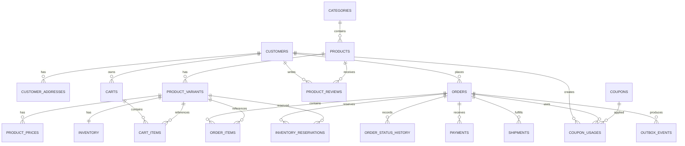
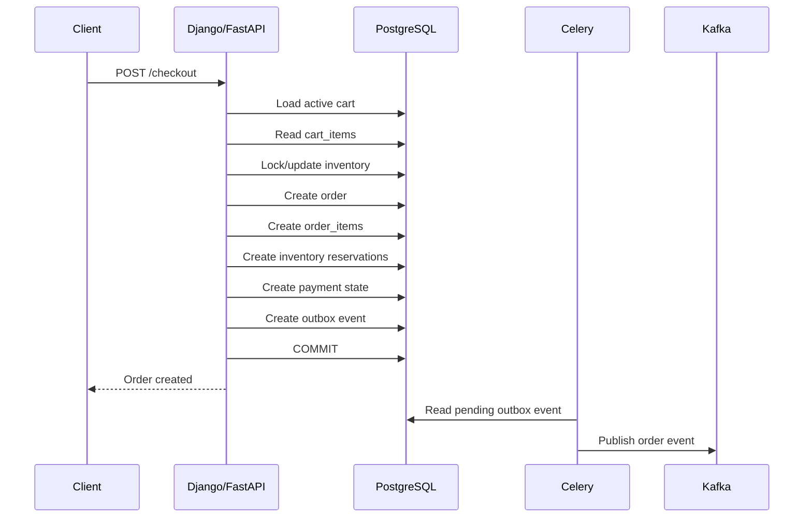

# 03- Tables and Relationships

## Overview

This document defines the tables, relationships, cardinality, foreign-key strategy, and ownership boundaries for the e-commerce PostgreSQL database.

The schema is organized around several domains:

```text
Customer
   │
   ├── Addresses
   ├── Carts
   ├── Orders
   └── Reviews

Catalog
   │
   ├── Categories
   ├── Products
   ├── Variants
   └── Prices

Commerce
   │
   ├── Carts
   ├── Orders
   ├── Payments
   ├── Shipments
   └── Coupons

Inventory
   │
   ├── Inventory
   └── Reservations

Integration
   │
   └── Outbox Events
```

The goal is to make every relationship explicit and enforceable while preserving historical transaction data and supporting realistic backend access patterns.

---

## Domain Boundaries

| Domain | Tables | Primary responsibility |
|---|---|---|
| Customer | `customers`, `customer_addresses` | Customer identity and saved addresses |
| Catalog | `categories`, `products`, `product_variants`, `product_prices` | Products available for sale |
| Shopping | `carts`, `cart_items` | Temporary customer shopping state |
| Orders | `orders`, `order_items`, `order_status_history` | Purchase transactions |
| Inventory | `inventory`, `inventory_reservations` | Stock availability and reservations |
| Payments | `payments` | Payment attempts and provider state |
| Fulfillment | `shipments` | Physical order fulfillment |
| Reviews | `product_reviews` | Customer product feedback |
| Promotions | `coupons`, `coupon_usages` | Discount definitions and application |
| Integration | `outbox_events` | Reliable domain event publication |

---

## Complete Relationship Diagram



---

## Table Inventory

| Table | Purpose | Primary Key |
|---|---|---|
| `customers` | Customer accounts | `id` |
| `customer_addresses` | Saved customer addresses | `id` |
| `categories` | Product categories | `id` |
| `products` | Catalog products | `id` |
| `product_variants` | Purchasable SKUs | `id` |
| `product_prices` | Variant price history | `id` |
| `carts` | Customer shopping carts | `id` |
| `cart_items` | Products in carts | `id` |
| `orders` | Customer purchase transactions | `id` |
| `order_items` | Products purchased in an order | `id` |
| `order_status_history` | Order lifecycle history | `id` |
| `inventory` | Current SKU inventory state | `variant_id` |
| `inventory_reservations` | Inventory held for orders | `id` |
| `payments` | Payment attempts and outcomes | `id` |
| `shipments` | Fulfillment records | `id` |
| `product_reviews` | Customer reviews | `id` |
| `coupons` | Discount definitions | `id` |
| `coupon_usages` | Coupon application history | `id` |
| `outbox_events` | Transactionally persisted events | `id` |

---

## Customers

### Purpose

`customers` is the root entity for customer-owned commerce data.

```text
customers
    │
    ├── customer_addresses
    ├── carts
    ├── orders
    ├── product_reviews
    └── coupon_usages
```

### Important Columns

| Column | Role |
|---|---|
| `id` | Stable internal identifier |
| `email` | Login/contact identifier |
| `full_name` | Customer display name |
| `password_hash` | Secure password representation |
| `status` | Account lifecycle state |
| `created_at` | Creation timestamp |
| `updated_at` | Last modification timestamp |

### Relationships

```text
customers 1 ─── N customer_addresses
customers 1 ─── N carts
customers 1 ─── N orders
customers 1 ─── N product_reviews
customers 1 ─── N coupon_usages
```

A customer can exist without an order, so the relationship from customer to order is naturally optional on the customer side.

---

## Customer Addresses

### Purpose

`customer_addresses` stores reusable addresses associated with a customer.

```text
customers
    │
    └── customer_addresses
```

### Relationship

```text
customers.id
     ↓
customer_addresses.customer_id
```

Cardinality:

```text
One customer → Many addresses
```

An address belongs to exactly one customer in this model.

### Default Address

A customer may have multiple saved addresses but typically only one default address for each address type.

A PostgreSQL partial unique index can enforce this:

```sql
CREATE UNIQUE INDEX customer_default_shipping_address_idx
ON customer_addresses (customer_id)
WHERE address_type = 'shipping'
  AND is_default = TRUE;
```

The same pattern can be applied to billing addresses.

---

## Categories

### Purpose

`categories` groups products for catalog navigation and filtering.

```text
categories
    │
    └── products
```

Relationship:

```text
categories.id
     ↓
products.category_id
```

Cardinality:

```text
One category → Many products
```

A product belongs to one category in the current simplified model.

If products can belong to multiple categories, this relationship should become many-to-many through a junction table:

```text
products
    │
    └── product_categories
             │
             └── categories
```

Do not add many-to-many complexity unless the requirements require it.

---

## Products

### Purpose

`products` represents the conceptual catalog item.

Example:

```text
Product
└── T-Shirt
```

A product can have multiple variants.

```text
T-Shirt
├── Small / Black
├── Medium / Black
├── Large / Black
└── Medium / White
```

### Relationship

```text
products 1 ─── N product_variants
```

A product should not be treated as the inventory unit when variants are independently purchasable.

---

## Product Variants

### Purpose

`product_variants` represents the actual purchasable SKU.

```text
products
    │
    ├── variant A
    ├── variant B
    └── variant C
```

Each variant has:

- A unique SKU.
- A parent product.
- Optional attributes.
- Active/inactive state.

### Relationship

```text
products.id
     ↓
product_variants.product_id
```

Cardinality:

```text
One product → Many variants
```

A variant can then participate in:

```text
product_prices
cart_items
order_items
inventory
inventory_reservations
```

This makes the variant the central purchasable catalog entity.

---

## Product Prices

### Purpose

`product_prices` stores price history for product variants.

```text
product_variants
       │
       └── product_prices
```

Relationship:

```text
product_variants.id
        ↓
product_prices.variant_id
```

Cardinality:

```text
One variant → Many historical prices
```

Example:

```text
SKU-100
├── $99.00  effective January
├── $109.00 effective February
└── $119.00 effective March
```

This avoids destroying historical pricing whenever the current price changes.

---

## Cart

### Purpose

A cart represents temporary shopping state before checkout.

```text
customers
    │
    └── carts
           │
           └── cart_items
```

Relationship:

```text
customers.id
     ↓
carts.customer_id
```

Cardinality:

```text
One customer → Many carts over time
```

Only one active cart may be permitted depending on the business rule.

A partial unique index can enforce this:

```sql
CREATE UNIQUE INDEX carts_one_active_per_customer_idx
ON carts (customer_id)
WHERE status = 'active';
```

---

## Cart Items

### Purpose

`cart_items` represents the variants currently selected by the customer.

Relationships:

```text
carts 1 ─── N cart_items
product_variants 1 ─── N cart_items
```

This creates two foreign-key relationships:

```text
cart_items.cart_id
    → carts.id

cart_items.variant_id
    → product_variants.id
```

### Uniqueness

A cart should generally contain a single row per variant:

```sql
UNIQUE (cart_id, variant_id)
```

Therefore:

```text
Cart 100
├── SKU-A × 2
├── SKU-B × 1
└── SKU-C × 4
```

is valid, while:

```text
Cart 100
├── SKU-A × 2
└── SKU-A × 3
```

should normally be represented as:

```text
Cart 100
└── SKU-A × 5
```

---

## Orders

### Purpose

`orders` is the root entity for a completed or attempted purchase.

```text
customers
    │
    └── orders
           ├── order_items
           ├── payments
           ├── shipments
           ├── order_status_history
           ├── inventory_reservations
           └── coupon_usages
```

Relationship:

```text
customers.id
     ↓
orders.customer_id
```

Cardinality:

```text
One customer → Many orders
```

An order must belong to exactly one customer in this model.

---

## Order Items

### Purpose

`order_items` represents individual purchased products.

```text
orders
   │
   ├── item
   ├── item
   └── item
```

Relationships:

```text
orders 1 ─── N order_items
product_variants 1 ─── N order_items
```

The order item references the variant but also stores historical snapshots.

Typical fields:

```text
variant_id
product_name_snapshot
sku_snapshot
quantity
unit_price
discount_amount
tax_amount
line_total
```

### Why Store Snapshots?

Suppose:

```text
Product name = "Premium T-Shirt"
Price = $50
```

A customer purchases it.

Later:

```text
Product name = "Basic T-Shirt"
Price = $30
```

The historical order must still show:

```text
Premium T-Shirt
$50
```

Therefore the order item stores transaction-specific values.

---

## Order Status History

### Purpose

`order_status_history` records lifecycle transitions.

```text
orders
   │
   └── order_status_history
```

Relationship:

```text
orders.id
     ↓
order_status_history.order_id
```

Cardinality:

```text
One order → Many status history records
```

Example:

```text
pending
   ↓
confirmed
   ↓
processing
   ↓
shipped
   ↓
delivered
```

The `orders.status` column stores the current state.

The history table stores how the order reached that state.

---

## Inventory

### Purpose

`inventory` stores the current stock state for each product variant.

```text
product_variants
       │
       └── inventory
```

Relationship:

```text
product_variants.id
        ↓
inventory.variant_id
```

Cardinality:

```text
One variant → One inventory record
```

This can be represented using the variant ID itself as the primary key:

```sql
variant_id BIGINT PRIMARY KEY
```

This naturally enforces one-to-one cardinality.

---

## Inventory Reservations

### Purpose

`inventory_reservations` represents stock temporarily held for an order.

Relationships:

```text
orders 1 ─── N inventory_reservations
product_variants 1 ─── N inventory_reservations
```

Conceptually:

```text
Order
 │
 ├── SKU-A → 2 units
 └── SKU-B → 1 unit
```

Each reservation has its own lifecycle:

```text
reserved
   ↓
consumed

reserved
   ↓
released

reserved
   ↓
expired
```

This provides operational history instead of encoding all inventory behavior into one current-state row.

---

## Payments

### Purpose

An order may have multiple payment attempts.

```text
orders
   │
   └── payments
```

Relationship:

```text
orders.id
     ↓
payments.order_id
```

Cardinality:

```text
One order → Many payment attempts
```

This is important because payment processing can fail and be retried.

Example:

```text
Order 500
├── Payment attempt 1 → failed
├── Payment attempt 2 → failed
└── Payment attempt 3 → captured
```

Do not model payment as strictly one-to-one unless the business requirements guarantee exactly one payment record.

---

## Payment Provider Identity

A provider transaction identifier should be stored separately from the internal payment ID.

```text
payments.id
        ↓
Internal database identity

payments.provider_transaction_id
        ↓
External provider identity
```

A conditional unique index can prevent duplicate provider transactions:

```sql
CREATE UNIQUE INDEX payments_provider_transaction_unique_idx
ON payments (provider, provider_transaction_id)
WHERE provider_transaction_id IS NOT NULL;
```

This is particularly useful when payment providers retry webhooks.

---

## Shipments

### Purpose

`shipments` represents fulfillment activity.

```text
orders
   │
   └── shipments
```

Relationship:

```text
orders.id
     ↓
shipments.order_id
```

Cardinality:

```text
One order → One or many shipments
```

Supporting multiple shipments allows:

```text
Order 100
├── Shipment 1 → Warehouse A
└── Shipment 2 → Warehouse B
```

This is more flexible than assuming every order maps to exactly one shipment.

---

## Product Reviews

### Purpose

`product_reviews` connects customers with products.

Conceptually:

```text
customers
     │
     └── product_reviews
                │
                ↓
             products
```

Relationships:

```text
customers 1 ─── N product_reviews
products 1 ─── N product_reviews
```

Together these form a logical many-to-many relationship:

```text
customers N ─── N products
```

with `product_reviews` acting as the association entity.

If one review per customer/product is required:

```sql
UNIQUE (customer_id, product_id)
```

enforces the rule.

---

## Coupons

### Purpose

`coupons` defines reusable discount rules.

```text
coupons
    │
    └── coupon_usages
```

A coupon exists independently of any particular order.

It may define:

```text
code
discount type
discount value
minimum order
maximum discount
usage limit
validity period
active state
```

---

## Coupon Usages

### Purpose

`coupon_usages` records the application of a coupon to an order.

Relationships:

```text
coupons 1 ─── N coupon_usages
customers 1 ─── N coupon_usages
orders 1 ─── N coupon_usages
```

This allows queries such as:

```text
How many times was this coupon used?

Which customer used it?

Which order received the discount?

How much discount was applied?
```

---

## Outbox Events

### Purpose

`outbox_events` provides durable event publication state.

Relationships:

```text
orders
   │
   └── outbox_events
```

The event table does not need to be tightly coupled to only orders.

A generic structure can support:

```text
aggregate_type
aggregate_id
event_type
payload
status
```

For example:

```text
aggregate_type = order
aggregate_id   = 10001
event_type     = order.created
```

The event is inserted inside the same database transaction as the business change.

---

## Relationship Matrix

| Parent | Child | Cardinality | Foreign Key | Typical Delete Strategy |
|---|---|---:|---|---|
| `customers` | `customer_addresses` | 1:N | `customer_id` | Cascade can be appropriate |
| `customers` | `carts` | 1:N | `customer_id` | Preserve or cascade by lifecycle |
| `customers` | `orders` | 1:N | `customer_id` | Preserve |
| `customers` | `product_reviews` | 1:N | `customer_id` | Preserve/history dependent |
| `customers` | `coupon_usages` | 1:N | `customer_id` | Preserve |
| `categories` | `products` | 1:N | `category_id` | Usually restrict |
| `products` | `product_variants` | 1:N | `product_id` | Usually restrict/protect |
| `product_variants` | `product_prices` | 1:N | `variant_id` | Preserve history |
| `product_variants` | `inventory` | 1:1 | `variant_id` | Usually restrict |
| `product_variants` | `cart_items` | 1:N | `variant_id` | Usually restrict |
| `product_variants` | `order_items` | 1:N | `variant_id` | Preserve |
| `product_variants` | `inventory_reservations` | 1:N | `variant_id` | Preserve operational history |
| `carts` | `cart_items` | 1:N | `cart_id` | Cascade |
| `orders` | `order_items` | 1:N | `order_id` | Cascade only when order deletion is allowed |
| `orders` | `payments` | 1:N | `order_id` | Preserve |
| `orders` | `shipments` | 1:N | `order_id` | Preserve |
| `orders` | `order_status_history` | 1:N | `order_id` | Preserve if order is retained |
| `orders` | `inventory_reservations` | 1:N | `order_id` | Preserve |
| `orders` | `coupon_usages` | 1:N | `order_id` | Preserve |
| `orders` | `outbox_events` | 1:N | `aggregate_id` conceptually | Retention-dependent |
| `coupons` | `coupon_usages` | 1:N | `coupon_id` | Preserve |
| `products` | `product_reviews` | 1:N | `product_id` | Preserve |

---

## Foreign Key Direction

Foreign keys live on the dependent/child table.

For example:

```text
customers
    id
     │
     ▼
orders
    customer_id
```

The `orders` table owns the foreign-key column because an order depends on a customer relationship.

Similarly:

```text
orders
    id
     │
     ▼
order_items
    order_id
```

This direction matters when designing joins, indexes, deletes, and migrations.

---

## Parent and Child Semantics

Consider:

```text
orders
    │
    └── order_items
```

An order is the parent.

An order item is the child.

The child contains:

```sql
order_id REFERENCES orders(id)
```

This provides:

- Referential integrity.
- Efficient relationship traversal.
- Protection against orphan records.
- Explicit dependency semantics.

The same pattern appears throughout the schema.

---

## Junction Tables

A junction table represents a many-to-many relationship.

The current design has a natural many-to-many relationship between customers and products through reviews:

```text
customers
    │
    └── product_reviews
            │
            └── products
```

A future product/category many-to-many design could use:

```text
product_categories
-------------------
product_id
category_id
```

with:

```sql
PRIMARY KEY (product_id, category_id)
```

Do not model many-to-many relationships using comma-separated IDs or arrays merely to avoid creating a junction table.

---

## One-to-One Relationships

The strongest way to represent a one-to-one relationship is to make the child foreign key unique.

For inventory, the design uses:

```sql
variant_id BIGINT PRIMARY KEY
```

which simultaneously provides:

```text
FOREIGN KEY → product_variants.id
PRIMARY KEY → guarantees uniqueness
```

Therefore:

```text
product_variant 1 ─── 1 inventory
```

If a separate `id` were used instead, the relationship would require:

```sql
UNIQUE (variant_id)
```

---

## Optional vs Mandatory Relationships

A foreign key does not automatically mean that the relationship is mandatory.

Compare:

```sql
customer_id BIGINT NOT NULL
```

with:

```sql
customer_id BIGINT
```

The first means:

```text
Every order must reference a customer.
```

The second means:

```text
An order may exist without a customer.
```

For this project, customer-owned orders should generally use:

```sql
customer_id BIGINT NOT NULL
```

Guest checkout would require an explicit design decision rather than silently making the relationship nullable.

---

## Relationship Indexing

Foreign keys should be evaluated for supporting indexes on the child side.

For example:

```sql
CREATE INDEX orders_customer_id_idx
ON orders (customer_id);
```

This helps queries such as:

```sql
SELECT *
FROM orders
WHERE customer_id = $1;
```

It can also help PostgreSQL efficiently check or process parent-row operations involving foreign keys.

Not every foreign-key column requires a standalone index. If an existing composite index already provides the required access path, another index may be redundant.

---

## Composite Relationship Indexes

Some relationships are queried together with ordering.

For example:

```sql
SELECT id, status, grand_total, created_at
FROM orders
WHERE customer_id = $1
ORDER BY created_at DESC, id DESC
LIMIT 50;
```

A better index is:

```sql
CREATE INDEX orders_customer_created_id_idx
ON orders (customer_id, created_at DESC, id DESC);
```

This is preferable to creating separate indexes solely on:

```text
customer_id
created_at
id
```

when the primary access pattern is the combined predicate and ordering.

---

## Relationship Query Examples

### Customer → Orders

```sql
SELECT
    o.id,
    o.status,
    o.grand_total,
    o.created_at
FROM orders AS o
WHERE o.customer_id = $1
ORDER BY o.created_at DESC, o.id DESC
LIMIT 50;
```

### Order → Items

```sql
SELECT
    oi.id,
    oi.sku_snapshot,
    oi.product_name_snapshot,
    oi.quantity,
    oi.unit_price,
    oi.line_total
FROM order_items AS oi
WHERE oi.order_id = $1
ORDER BY oi.id;
```

### Product → Variants

```sql
SELECT
    pv.id,
    pv.sku,
    pv.attributes
FROM product_variants AS pv
WHERE pv.product_id = $1
  AND pv.is_active = TRUE
ORDER BY pv.id;
```

### Order → Payment Attempts

```sql
SELECT
    p.id,
    p.provider,
    p.status,
    p.amount,
    p.created_at
FROM payments AS p
WHERE p.order_id = $1
ORDER BY p.created_at DESC;
```

---

## Join Cardinality and Duplicate Rows

Relationships directly affect query cardinality.

Consider:

```text
customers
    1
    │
    N
orders
    │
    N
order_items
```

Joining customers to orders produces one row per order.

Joining that result to order items produces one row per order item.

For example:

```sql
SELECT
    c.id,
    o.id,
    oi.id
FROM customers AS c
JOIN orders AS o
    ON o.customer_id = c.id
JOIN order_items AS oi
    ON oi.order_id = o.id;
```

The result is not:

```text
one row per customer
```

It is:

```text
one row per order item
```

Understanding result grain is essential when writing aggregate queries.

---

## Avoiding Accidental Multiplication

Suppose an order has:

```text
3 order items
2 payment attempts
```

Joining both relationships directly creates:

```text
3 × 2 = 6 rows
```

This can produce incorrect aggregates.

Bad pattern:

```sql
SELECT
    o.id,
    SUM(oi.line_total),
    COUNT(p.id)
FROM orders AS o
JOIN order_items AS oi
    ON oi.order_id = o.id
JOIN payments AS p
    ON p.order_id = o.id
GROUP BY o.id;
```

The query may multiply order-item and payment rows.

A safer design aggregates each one-to-many relationship independently before combining results when the metrics require independent grains.

---

## Historical Relationship Strategy

Some relationships should remain valid even when the referenced catalog entity changes.

For example:

```text
order_items.variant_id
       ↓
product_variants
```

should preserve the relationship to the purchased SKU.

However, historical values should not depend entirely on the current product state.

Therefore:

```text
order_items
├── variant_id
├── sku_snapshot
├── product_name_snapshot
└── unit_price
```

provides both:

```text
relational traceability
+
historical correctness
```

---

## Delete Strategy

### Catalog

Products should generally not be physically deleted when they are referenced by historical orders.

Prefer:

```text
active
inactive
discontinued
```

states.

### Orders

Orders should normally be retained.

Payments, shipment records, and order history should not disappear simply because a customer account becomes inactive.

### Carts

Cart items can safely use cascading deletion when the cart itself is intentionally deleted.

### Addresses

Saved customer addresses can often be deleted with the customer, subject to business requirements.

Historical order addresses should not depend on the continued existence of the saved address record.

---

## Schema Lifecycle

The relationship model should support the complete lifecycle:

```text
Catalog
   ↓
Cart
   ↓
Checkout
   ↓
Order
   ↓
Payment
   ↓
Inventory
   ↓
Shipment
   ↓
Delivery
```

At checkout:

```text
cart_items
    ↓
order_items
    ↓
inventory_reservations
    ↓
payment
    ↓
shipment
```

The cart is temporary.

The order becomes the durable transactional record.

---

## Backend Request Flow

A typical checkout request can traverse the relationships as follows:



The database relationships allow the application to move from temporary shopping state to durable transactional state without losing referential integrity.

---

## Django Relationship Mapping

Django relationships should mirror the database design.

Example:

```python
class Order(models.Model):
    customer = models.ForeignKey(
        "Customer",
        on_delete=models.PROTECT,
        related_name="orders",
    )
    status = models.CharField(max_length=32)
    grand_total = models.DecimalField(
        max_digits=12,
        decimal_places=2,
    )
    created_at = models.DateTimeField(auto_now_add=True)
    updated_at = models.DateTimeField(auto_now=True)
```

The important point is that:

```text
Django ForeignKey
        ↓
PostgreSQL FOREIGN KEY
```

should represent the same domain relationship.

Application-level relationships should not contradict database constraints.

---

## SQLAlchemy Relationship Mapping

A SQLAlchemy model can expose the same relationship:

```python
class Order(Base):
    __tablename__ = "orders"

    id: Mapped[int] = mapped_column(primary_key=True)
    customer_id: Mapped[int] = mapped_column(
        ForeignKey("customers.id"),
        nullable=False,
    )

    customer: Mapped["Customer"] = relationship(
        back_populates="orders"
    )
```

The ORM relationship is an application representation of the relational relationship.

It does not eliminate the need to understand:

```text
foreign keys
joins
cardinality
indexes
transactions
```

---

## Microservice Ownership

If this database eventually supports multiple services, table ownership should remain explicit.

A possible boundary is:

```text
Catalog Service
    ├── categories
    ├── products
    ├── product_variants
    └── product_prices

Order Service
    ├── orders
    ├── order_items
    └── order_status_history

Inventory Service
    ├── inventory
    └── inventory_reservations

Payment Service
    └── payments

Fulfillment Service
    └── shipments
```

The services may initially share PostgreSQL during a modular-monolith phase.

Do not prematurely distribute the database merely because the application uses microservices.

---

## Cross-Service Relationships

When services eventually own separate databases, traditional foreign keys cannot enforce cross-database relationships.

For example:

```text
Order DB
    order.customer_id
          X
Customer DB
```

cannot use a normal PostgreSQL foreign key.

The architecture then relies on:

- Stable external identifiers.
- Application-level validation.
- Event-driven synchronization.
- Idempotent consumers.
- Reconciliation processes.

This is one reason a modular monolith can be significantly simpler when strong relational consistency is required.

---

## Security Implications

Relationships can become authorization boundaries.

For example:

```text
customer
   ↓
orders
   ↓
order_items
```

An API must ensure that:

```text
customer A
```

cannot retrieve:

```text
customer B's order
```

A query should scope access explicitly:

```sql
SELECT
    o.id,
    o.status,
    o.grand_total
FROM orders AS o
WHERE o.id = $1
  AND o.customer_id = $2;
```

Do not rely solely on the fact that the client supplied an order ID.

Foreign keys enforce integrity, not authorization.

---

## Multi-Tenant Relationship Safety

If the system becomes multi-tenant, relationships should prevent cross-tenant references.

For example, it is not enough to have:

```text
orders.customer_id
```

if both customers and orders belong to tenants.

The application and database design must ensure:

```text
order.tenant_id
+
customer.tenant_id
```

remain consistent.

Depending on the architecture, composite foreign keys, Row-Level Security, or service-level authorization may be appropriate.

---

## Monitoring Relationship Health

Production monitoring should detect relationship-related problems such as:

- Foreign-key violations.
- Unexpected orphan records.
- Excessive child-row counts.
- Slow joins.
- Missing indexes on high-volume relationships.
- Lock contention during parent updates/deletes.
- Unexpected cardinality increases.

Query performance should be evaluated using:

```sql
EXPLAIN (ANALYZE, BUFFERS)
```

rather than assuming that a relationship is efficient simply because the tables have indexes.

---

## Common Mistakes

### Treating Every Relationship as One-to-One

Bad:

```text
orders → payment
```

when payment retries are possible.

Better:

```text
orders 1 → N payments
```

and define which payment state represents the successful transaction.

---

### Storing Multiple IDs in One Column

Bad:

```text
product_ids = "10,20,30"
```

This destroys relational integrity and makes querying inefficient.

Use:

```text
order_items
```

or another appropriate junction/child table.

---

### Missing Uniqueness Constraints

Application code may check:

```text
Does this cart already contain SKU X?
```

but concurrent requests can still create duplicates.

Use:

```sql
UNIQUE (cart_id, variant_id)
```

to make the invariant database-enforced.

---

### Using Cascading Deletes Without Understanding the Graph

A cascade can traverse multiple relationships unexpectedly.

Before using `ON DELETE CASCADE`, understand:

```text
Parent
 ↓
Child
 ↓
Grandchild
 ↓
Additional historical records
```

Use it primarily where child data has no independent historical value.

---

### Forgetting Child-Side Indexes

A foreign key establishes integrity but does not automatically create the index needed for every query pattern.

For large tables, inspect actual joins and access paths.

---

### Confusing Foreign Keys with Authorization

This:

```sql
FOREIGN KEY (customer_id)
REFERENCES customers(id)
```

means the customer exists.

It does **not** mean the current authenticated user is allowed to access that customer.

Authorization must be enforced separately.

---

### Assuming ORM Relationships Are Free

Calling:

```python
order.customer
```

can execute a query if the relationship was not loaded.

Similarly:

```python
for order in orders:
    print(order.items.all())
```

can create an N+1 query pattern.

Django should use appropriate:

```text
select_related()
prefetch_related()
```

strategies, while SQLAlchemy should use appropriate eager-loading strategies.

---

## Production Checklist

### Tables

- [ ] Every table has a clear business purpose.
- [ ] Every entity has a stable primary key.
- [ ] Historical and mutable data are distinguished.
- [ ] Repeating data is modeled as child rows.
- [ ] Many-to-many relationships use explicit association tables.

### Relationships

- [ ] Cardinality is explicitly defined.
- [ ] Foreign keys exist for relational dependencies.
- [ ] Mandatory relationships use `NOT NULL`.
- [ ] One-to-one relationships use uniqueness.
- [ ] Conditional uniqueness uses appropriate partial indexes.
- [ ] Delete behavior is intentional.

### Query Performance

- [ ] High-volume foreign-key access paths are indexed.
- [ ] Composite indexes match actual query patterns.
- [ ] Large relationship joins have been tested with realistic data.
- [ ] Pagination is deterministic.
- [ ] N+1 query patterns are prevented at the application layer.

### Transactions

- [ ] Checkout relationships are updated transactionally.
- [ ] Inventory reservations are concurrency-safe.
- [ ] Payment attempts support retries.
- [ ] Outbox events are committed with the relevant business transaction.

### Security

- [ ] Foreign keys are not treated as authorization.
- [ ] Customer-owned resources are explicitly scoped.
- [ ] SQL is parameterized.
- [ ] Database roles follow least privilege.
- [ ] Sensitive historical data has controlled access.

### Operations

- [ ] Migrations preserve relationship compatibility.
- [ ] Large-table relationship changes consider locking.
- [ ] Backup and restore procedures include all related tables.
- [ ] Query plans are monitored for high-volume relationships.
- [ ] Referential integrity violations are observable.

---

## Senior Design Perspective

A strong relational design is not simply a collection of tables connected by foreign keys.

The important questions are:

```text
What is the entity?

Who owns it?

What is its lifecycle?

What is the cardinality?

Which values are mutable?

Which values must remain historically correct?

Which invariants must the database enforce?

Which relationships are queried frequently?

Which relationships are concurrency-sensitive?

What happens when an entity is deleted?

What happens when services are separated?
```

For this e-commerce project, the most important relationship distinction is between:

```text
Current operational state
```

and:

```text
Historical transactional state
```

For example:

```text
product_variants
       │
       ├── current catalog information
       │
       └── inventory

order_items
       │
       ├── historical SKU snapshot
       ├── historical product name
       └── historical price
```

This allows the database to remain relational while preserving the correctness of historical transactions.

## Key Takeaways

- **Relationships should explicitly model cardinality, ownership, lifecycle, and historical requirements rather than merely connecting tables with foreign keys.**
- **The product variant is the central purchasable entity, connecting catalog, pricing, carts, orders, and inventory.**
- **Orders, payments, shipments, reservations, and history are intentionally one-to-many relationships because real production workflows involve retries, partial fulfillment, and state transitions.**
- **Foreign keys enforce referential integrity, while unique constraints, indexes, transactions, and authorization controls solve different engineering problems.**
- **A senior schema design separates mutable operational state from historical transaction data and considers query cardinality, concurrency, migrations, service boundaries, and long-term scale.**