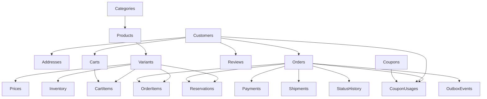

# 04- Sample Data

## Overview

This document defines a realistic PostgreSQL seed dataset for the e-commerce database.

The sample data is designed to exercise:

- Customer and address relationships.
- Product/category relationships.
- Product variants and pricing history.
- Inventory and reservations.
- Shopping carts.
- Orders and order items.
- Payment retries and successful payments.
- Shipments and order status history.
- Product reviews.
- Coupons and coupon usage.
- Transactional outbox events.

The dataset should be useful for:

- Developing SQL queries.
- Testing joins and aggregations.
- Testing constraints.
- Demonstrating pagination.
- Testing transactions and concurrency.
- Validating Django/FastAPI repository code.
- Testing API responses.
- Running `EXPLAIN (ANALYZE, BUFFERS)` against non-trivial data.
- Practicing SQL interview problems.

The data is intentionally small enough to inspect manually while containing enough relationships to expose common SQL mistakes.

---

## Seed Data Design

The dataset uses the following approximate distribution:

| Entity | Rows |
|---|---:|
| Customers | 5 |
| Addresses | 7 |
| Categories | 5 |
| Products | 8 |
| Product variants | 13 |
| Product prices | 15 |
| Carts | 5 |
| Cart items | 8 |
| Orders | 8 |
| Order items | 15 |
| Order status history | 30 |
| Inventory | 13 |
| Inventory reservations | 8 |
| Payments | 10 |
| Shipments | 7 |
| Product reviews | 9 |
| Coupons | 4 |
| Coupon usages | 6 |
| Outbox events | 8 |

The data includes both successful and unsuccessful workflows.

---

## Data Relationships



---

## Seed Data Conventions

The dataset follows these conventions:

- IDs are explicitly specified for reproducibility.
- Timestamps use UTC offsets through `TIMESTAMPTZ`.
- Monetary values use exact decimal literals.
- Passwords are represented by clearly fake password hashes.
- Payment-provider identifiers are synthetic.
- Tracking numbers are synthetic.
- No real customer or payment information is used.
- Status values match the schema design.
- Foreign-key dependencies are inserted before dependent rows.

This dataset is intended for development and testing only.

---

## Customers

```sql
INSERT INTO customers (
    id,
    email,
    full_name,
    password_hash,
    status,
    created_at,
    updated_at
)
OVERRIDING SYSTEM VALUE
VALUES
    (
        1,
        'alice@example.test',
        'Alice Johnson',
        '$argon2id$v=19$m=65536,t=3,p=4$test-alice-hash',
        'active',
        '2026-01-05T09:00:00Z',
        '2026-01-05T09:00:00Z'
    ),
    (
        2,
        'bob@example.test',
        'Bob Smith',
        '$argon2id$v=19$m=65536,t=3,p=4$test-bob-hash',
        'active',
        '2026-01-12T10:30:00Z',
        '2026-01-12T10:30:00Z'
    ),
    (
        3,
        'carol@example.test',
        'Carol Williams',
        '$argon2id$v=19$m=65536,t=3,p=4$test-carol-hash',
        'active',
        '2026-02-02T08:15:00Z',
        '2026-02-02T08:15:00Z'
    ),
    (
        4,
        'david@example.test',
        'David Brown',
        '$argon2id$v=19$m=65536,t=3,p=4$test-david-hash',
        'suspended',
        '2026-02-18T14:20:00Z',
        '2026-04-01T11:00:00Z'
    ),
    (
        5,
        'emma@example.test',
        'Emma Davis',
        '$argon2id$v=19$m=65536,t=3,p=4$test-emma-hash',
        'active',
        '2026-03-10T16:45:00Z',
        '2026-03-10T16:45:00Z'
    );
```

The password values are deliberately non-functional test placeholders.

---

## Customer Addresses

```sql
INSERT INTO customer_addresses (
    id,
    customer_id,
    address_type,
    recipient_name,
    address_line_1,
    address_line_2,
    city,
    state_province,
    postal_code,
    country_code,
    is_default,
    created_at,
    updated_at
)
OVERRIDING SYSTEM VALUE
VALUES
    (
        1,
        1,
        'shipping',
        'Alice Johnson',
        '12 Market Street',
        'Apartment 4A',
        'Bengaluru',
        'Karnataka',
        '560001',
        'IN',
        TRUE,
        '2026-01-05T09:10:00Z',
        '2026-01-05T09:10:00Z'
    ),
    (
        2,
        1,
        'billing',
        'Alice Johnson',
        '12 Market Street',
        'Apartment 4A',
        'Bengaluru',
        'Karnataka',
        '560001',
        'IN',
        TRUE,
        '2026-01-05T09:11:00Z',
        '2026-01-05T09:11:00Z'
    ),
    (
        3,
        2,
        'shipping',
        'Bob Smith',
        '88 Park Avenue',
        NULL,
        'Pune',
        'Maharashtra',
        '411001',
        'IN',
        TRUE,
        '2026-01-12T10:40:00Z',
        '2026-01-12T10:40:00Z'
    ),
    (
        4,
        3,
        'shipping',
        'Carol Williams',
        '42 Lake Road',
        'Floor 2',
        'Hyderabad',
        'Telangana',
        '500001',
        'IN',
        TRUE,
        '2026-02-02T08:25:00Z',
        '2026-02-02T08:25:00Z'
    ),
    (
        5,
        3,
        'shipping',
        'Carol Williams',
        '17 Hill View',
        NULL,
        'Hyderabad',
        'Telangana',
        '500032',
        'IN',
        FALSE,
        '2026-02-15T08:25:00Z',
        '2026-02-15T08:25:00Z'
    ),
    (
        6,
        4,
        'shipping',
        'David Brown',
        '9 River Street',
        NULL,
        'Chennai',
        'Tamil Nadu',
        '600001',
        'IN',
        TRUE,
        '2026-02-18T14:30:00Z',
        '2026-02-18T14:30:00Z'
    ),
    (
        7,
        5,
        'shipping',
        'Emma Davis',
        '55 Green Park',
        'Unit 7',
        'Delhi',
        'Delhi',
        '110001',
        'IN',
        TRUE,
        '2026-03-10T16:55:00Z',
        '2026-03-10T16:55:00Z'
    );
```

---

## Categories

```sql
INSERT INTO categories (
    id,
    name,
    slug,
    description,
    is_active,
    created_at,
    updated_at
)
OVERRIDING SYSTEM VALUE
VALUES
    (
        1,
        'Laptops',
        'laptops',
        'Portable computers for personal and professional use.',
        TRUE,
        '2026-01-01T08:00:00Z',
        '2026-01-01T08:00:00Z'
    ),
    (
        2,
        'Smartphones',
        'smartphones',
        'Mobile phones and related devices.',
        TRUE,
        '2026-01-01T08:05:00Z',
        '2026-01-01T08:05:00Z'
    ),
    (
        3,
        'Accessories',
        'accessories',
        'Computer and mobile accessories.',
        TRUE,
        '2026-01-01T08:10:00Z',
        '2026-01-01T08:10:00Z'
    ),
    (
        4,
        'Monitors',
        'monitors',
        'Displays for productivity and entertainment.',
        TRUE,
        '2026-01-01T08:15:00Z',
        '2026-01-01T08:15:00Z'
    ),
    (
        5,
        'Storage',
        'storage',
        'Internal and external storage devices.',
        TRUE,
        '2026-01-01T08:20:00Z',
        '2026-01-01T08:20:00Z'
    );
```

---

## Products

```sql
INSERT INTO products (
    id,
    category_id,
    name,
    description,
    brand,
    status,
    created_at,
    updated_at
)
OVERRIDING SYSTEM VALUE
VALUES
    (
        1,
        1,
        'ProBook 14',
        '14-inch professional laptop.',
        'Acme',
        'active',
        '2026-01-02T09:00:00Z',
        '2026-01-02T09:00:00Z'
    ),
    (
        2,
        1,
        'UltraBook 15',
        'Thin 15-inch productivity laptop.',
        'Acme',
        'active',
        '2026-01-03T09:00:00Z',
        '2026-01-03T09:00:00Z'
    ),
    (
        3,
        2,
        'Phone X',
        'Flagship smartphone.',
        'Nova',
        'active',
        '2026-01-04T09:00:00Z',
        '2026-01-04T09:00:00Z'
    ),
    (
        4,
        2,
        'Phone Lite',
        'Affordable smartphone.',
        'Nova',
        'active',
        '2026-01-05T09:00:00Z',
        '2026-01-05T09:00:00Z'
    ),
    (
        5,
        3,
        'Mechanical Keyboard',
        'Compact mechanical keyboard.',
        'KeyWorks',
        'active',
        '2026-01-06T09:00:00Z',
        '2026-01-06T09:00:00Z'
    ),
    (
        6,
        3,
        'Wireless Mouse',
        'Ergonomic wireless mouse.',
        'KeyWorks',
        'active',
        '2026-01-07T09:00:00Z',
        '2026-01-07T09:00:00Z'
    ),
    (
        7,
        4,
        'UltraView 27',
        '27-inch productivity monitor.',
        'Vision',
        'active',
        '2026-01-08T09:00:00Z',
        '2026-01-08T09:00:00Z'
    ),
    (
        8,
        5,
        'FastSSD 1TB',
        '1 TB NVMe solid-state drive.',
        'StoreMax',
        'discontinued',
        '2026-01-09T09:00:00Z',
        '2026-05-01T09:00:00Z'
    );
```

The discontinued product remains in the dataset because historical orders can still reference it.

---

## Product Variants

```sql
INSERT INTO product_variants (
    id,
    product_id,
    sku,
    attributes,
    is_active,
    created_at,
    updated_at
)
OVERRIDING SYSTEM VALUE
VALUES
    (
        1,
        1,
        'PRO14-16-512',
        '{"ram_gb": 16, "storage_gb": 512, "color": "silver"}',
        TRUE,
        '2026-01-02T09:10:00Z',
        '2026-01-02T09:10:00Z'
    ),
    (
        2,
        1,
        'PRO14-32-1024',
        '{"ram_gb": 32, "storage_gb": 1024, "color": "silver"}',
        TRUE,
        '2026-01-02T09:11:00Z',
        '2026-01-02T09:11:00Z'
    ),
    (
        3,
        2,
        'ULT15-16-512',
        '{"ram_gb": 16, "storage_gb": 512, "color": "gray"}',
        TRUE,
        '2026-01-03T09:10:00Z',
        '2026-01-03T09:10:00Z'
    ),
    (
        4,
        2,
        'ULT15-32-1024',
        '{"ram_gb": 32, "storage_gb": 1024, "color": "gray"}',
        TRUE,
        '2026-01-03T09:11:00Z',
        '2026-01-03T09:11:00Z'
    ),
    (
        5,
        3,
        'PHONEX-128-BLK',
        '{"storage_gb": 128, "color": "black"}',
        TRUE,
        '2026-01-04T09:10:00Z',
        '2026-01-04T09:10:00Z'
    ),
    (
        6,
        3,
        'PHONEX-256-BLK',
        '{"storage_gb": 256, "color": "black"}',
        TRUE,
        '2026-01-04T09:11:00Z',
        '2026-01-04T09:11:00Z'
    ),
    (
        7,
        4,
        'PHONELITE-128-BLU',
        '{"storage_gb": 128, "color": "blue"}',
        TRUE,
        '2026-01-05T09:10:00Z',
        '2026-01-05T09:10:00Z'
    ),
    (
        8,
        5,
        'KEY-75-BLK',
        '{"layout": "75%", "color": "black"}',
        TRUE,
        '2026-01-06T09:10:00Z',
        '2026-01-06T09:10:00Z'
    ),
    (
        9,
        6,
        'MOUSE-WL-BLK',
        '{"connection": "wireless", "color": "black"}',
        TRUE,
        '2026-01-07T09:10:00Z',
        '2026-01-07T09:10:00Z'
    ),
    (
        10,
        7,
        'MON27-4K',
        '{"resolution": "3840x2160", "size_inches": 27}',
        TRUE,
        '2026-01-08T09:10:00Z',
        '2026-01-08T09:10:00Z'
    ),
    (
        11,
        7,
        'MON27-QHD',
        '{"resolution": "2560x1440", "size_inches": 27}',
        TRUE,
        '2026-01-08T09:11:00Z',
        '2026-01-08T09:11:00Z'
    ),
    (
        12,
        8,
        'SSD-1TB-NVME',
        '{"capacity_gb": 1024, "interface": "NVMe"}',
        FALSE,
        '2026-01-09T09:10:00Z',
        '2026-05-01T09:00:00Z'
    ),
    (
        13,
        5,
        'KEY-75-WHT',
        '{"layout": "75%", "color": "white"}',
        TRUE,
        '2026-02-10T09:10:00Z',
        '2026-02-10T09:10:00Z'
    );
```

---

## Product Prices

The dataset includes price changes for selected variants.

```sql
INSERT INTO product_prices (
    id,
    variant_id,
    currency_code,
    amount,
    effective_from,
    effective_to,
    created_at
)
OVERRIDING SYSTEM VALUE
VALUES
    (1, 1, 'INR', 79999.00, '2026-01-02T09:00:00Z', '2026-03-01T00:00:00Z', '2026-01-02T09:00:00Z'),
    (2, 1, 'INR', 82999.00, '2026-03-01T00:00:00Z', NULL, '2026-03-01T00:00:00Z'),
    (3, 2, 'INR', 99999.00, '2026-01-02T09:00:00Z', NULL, '2026-01-02T09:00:00Z'),
    (4, 3, 'INR', 74999.00, '2026-01-03T09:00:00Z', NULL, '2026-01-03T09:00:00Z'),
    (5, 4, 'INR', 94999.00, '2026-01-03T09:00:00Z', NULL, '2026-01-03T09:00:00Z'),
    (6, 5, 'INR', 59999.00, '2026-01-04T09:00:00Z', '2026-04-01T00:00:00Z', '2026-01-04T09:00:00Z'),
    (7, 5, 'INR', 57999.00, '2026-04-01T00:00:00Z', NULL, '2026-04-01T00:00:00Z'),
    (8, 6, 'INR', 67999.00, '2026-01-04T09:00:00Z', NULL, '2026-01-04T09:00:00Z'),
    (9, 7, 'INR', 24999.00, '2026-01-05T09:00:00Z', NULL, '2026-01-05T09:00:00Z'),
    (10, 8, 'INR', 12999.00, '2026-01-06T09:00:00Z', NULL, '2026-01-06T09:00:00Z'),
    (11, 9, 'INR', 4999.00, '2026-01-07T09:00:00Z', NULL, '2026-01-07T09:00:00Z'),
    (12, 10, 'INR', 32999.00, '2026-01-08T09:00:00Z', NULL, '2026-01-08T09:00:00Z'),
    (13, 11, 'INR', 24999.00, '2026-01-08T09:00:00Z', NULL, '2026-01-08T09:00:00Z'),
    (14, 12, 'INR', 6999.00, '2026-01-09T09:00:00Z', '2026-05-01T00:00:00Z', '2026-01-09T09:00:00Z'),
    (15, 13, 'INR', 13499.00, '2026-02-10T09:00:00Z', NULL, '2026-02-10T09:00:00Z');
```

The first and sixth variants demonstrate historical pricing.

---

## Inventory

```sql
INSERT INTO inventory (
    variant_id,
    available_quantity,
    reserved_quantity,
    updated_at
)
VALUES
    (1, 18, 2, '2026-09-01T10:00:00Z'),
    (2, 7, 1, '2026-09-01T10:00:00Z'),
    (3, 12, 0, '2026-09-01T10:00:00Z'),
    (4, 4, 1, '2026-09-01T10:00:00Z'),
    (5, 25, 3, '2026-09-01T10:00:00Z'),
    (6, 9, 0, '2026-09-01T10:00:00Z'),
    (7, 31, 2, '2026-09-01T10:00:00Z'),
    (8, 50, 4, '2026-09-01T10:00:00Z'),
    (9, 42, 1, '2026-09-01T10:00:00Z'),
    (10, 6, 0, '2026-09-01T10:00:00Z'),
    (11, 15, 0, '2026-09-01T10:00:00Z'),
    (12, 0, 0, '2026-09-01T10:00:00Z'),
    (13, 20, 1, '2026-09-01T10:00:00Z');
```

Variant `12` is discontinued and currently out of stock.

---

## Carts

```sql
INSERT INTO carts (
    id,
    customer_id,
    status,
    created_at,
    updated_at
)
OVERRIDING SYSTEM VALUE
VALUES
    (1, 1, 'active', '2026-09-01T09:00:00Z', '2026-09-05T18:00:00Z'),
    (2, 2, 'converted', '2026-08-10T12:00:00Z', '2026-08-10T13:00:00Z'),
    (3, 3, 'active', '2026-09-03T10:00:00Z', '2026-09-05T17:30:00Z'),
    (4, 4, 'abandoned', '2026-07-01T08:00:00Z', '2026-07-20T08:00:00Z'),
    (5, 5, 'active', '2026-09-04T15:00:00Z', '2026-09-05T19:00:00Z');
```

---

## Cart Items

```sql
INSERT INTO cart_items (
    id,
    cart_id,
    variant_id,
    quantity,
    created_at,
    updated_at
)
OVERRIDING SYSTEM VALUE
VALUES
    (1, 1, 1, 1, '2026-09-01T09:05:00Z', '2026-09-05T18:00:00Z'),
    (2, 1, 9, 2, '2026-09-01T09:06:00Z', '2026-09-05T18:00:00Z'),
    (3, 2, 5, 1, '2026-08-10T12:05:00Z', '2026-08-10T13:00:00Z'),
    (4, 2, 8, 1, '2026-08-10T12:06:00Z', '2026-08-10T13:00:00Z'),
    (5, 3, 10, 1, '2026-09-03T10:05:00Z', '2026-09-05T17:30:00Z'),
    (6, 3, 13, 1, '2026-09-03T10:06:00Z', '2026-09-05T17:30:00Z'),
    (7, 4, 12, 1, '2026-07-01T08:05:00Z', '2026-07-20T08:00:00Z'),
    (8, 5, 7, 2, '2026-09-04T15:05:00Z', '2026-09-05T19:00:00Z');
```

---

## Orders

Order addresses are stored as snapshots rather than references to the current customer address.

```sql
INSERT INTO orders (
    id,
    customer_id,
    status,
    currency_code,
    subtotal,
    discount_amount,
    tax_amount,
    shipping_amount,
    grand_total,
    billing_address,
    shipping_address,
    created_at,
    updated_at
)
OVERRIDING SYSTEM VALUE
VALUES
    (
        1001,
        1,
        'delivered',
        'INR',
        82999.00,
        5000.00,
        14039.82,
        0.00,
        92038.82,
        '{"recipient_name":"Alice Johnson","address_line_1":"12 Market Street","address_line_2":"Apartment 4A","city":"Bengaluru","state_province":"Karnataka","postal_code":"560001","country_code":"IN"}',
        '{"recipient_name":"Alice Johnson","address_line_1":"12 Market Street","address_line_2":"Apartment 4A","city":"Bengaluru","state_province":"Karnataka","postal_code":"560001","country_code":"IN"}',
        '2026-03-02T10:00:00Z',
        '2026-03-08T16:00:00Z'
    ),
    (
        1002,
        2,
        'delivered',
        'INR',
        59999.00,
        0.00,
        10799.82,
        499.00,
        71297.82,
        '{"recipient_name":"Bob Smith","address_line_1":"88 Park Avenue","city":"Pune","state_province":"Maharashtra","postal_code":"411001","country_code":"IN"}',
        '{"recipient_name":"Bob Smith","address_line_1":"88 Park Avenue","city":"Pune","state_province":"Maharashtra","postal_code":"411001","country_code":"IN"}',
        '2026-03-10T11:00:00Z',
        '2026-03-16T15:00:00Z'
    ),
    (
        1003,
        3,
        'shipped',
        'INR',
        32999.00,
        3000.00,
        5399.82,
        0.00,
        35398.82,
        '{"recipient_name":"Carol Williams","address_line_1":"42 Lake Road","address_line_2":"Floor 2","city":"Hyderabad","state_province":"Telangana","postal_code":"500001","country_code":"IN"}',
        '{"recipient_name":"Carol Williams","address_line_1":"42 Lake Road","address_line_2":"Floor 2","city":"Hyderabad","state_province":"Telangana","postal_code":"500001","country_code":"IN"}',
        '2026-04-05T09:30:00Z',
        '2026-04-10T12:00:00Z'
    ),
    (
        1004,
        5,
        'processing',
        'INR',
        12999.00,
        1000.00,
        2159.82,
        299.00,
        14457.82,
        '{"recipient_name":"Emma Davis","address_line_1":"55 Green Park","address_line_2":"Unit 7","city":"Delhi","state_province":"Delhi","postal_code":"110001","country_code":"IN"}',
        '{"recipient_name":"Emma Davis","address_line_1":"55 Green Park","address_line_2":"Unit 7","city":"Delhi","state_province":"Delhi","postal_code":"110001","country_code":"IN"}',
        '2026-05-12T14:15:00Z',
        '2026-05-13T09:00:00Z'
    ),
    (
        1005,
        1,
        'cancelled',
        'INR',
        74999.00,
        0.00,
        13499.82,
        0.00,
        88498.82,
        '{"recipient_name":"Alice Johnson","address_line_1":"12 Market Street","address_line_2":"Apartment 4A","city":"Bengaluru","state_province":"Karnataka","postal_code":"560001","country_code":"IN"}',
        '{"recipient_name":"Alice Johnson","address_line_1":"12 Market Street","address_line_2":"Apartment 4A","city":"Bengaluru","state_province":"Karnataka","postal_code":"560001","country_code":"IN"}',
        '2026-05-20T13:00:00Z',
        '2026-05-20T14:00:00Z'
    ),
    (
        1006,
        2,
        'confirmed',
        'INR',
        14997.00,
        0.00,
        2699.46,
        299.00,
        17995.46,
        '{"recipient_name":"Bob Smith","address_line_1":"88 Park Avenue","city":"Pune","state_province":"Maharashtra","postal_code":"411001","country_code":"IN"}',
        '{"recipient_name":"Bob Smith","address_line_1":"88 Park Avenue","city":"Pune","state_province":"Maharashtra","postal_code":"411001","country_code":"IN"}',
        '2026-06-15T17:30:00Z',
        '2026-06-15T18:00:00Z'
    ),
    (
        1007,
        3,
        'pending',
        'INR',
        4999.00,
        500.00,
        809.82,
        199.00,
        5507.82,
        '{"recipient_name":"Carol Williams","address_line_1":"17 Hill View","city":"Hyderabad","state_province":"Telangana","postal_code":"500032","country_code":"IN"}',
        '{"recipient_name":"Carol Williams","address_line_1":"17 Hill View","city":"Hyderabad","state_province":"Telangana","postal_code":"500032","country_code":"IN"}',
        '2026-08-20T10:00:00Z',
        '2026-08-20T10:05:00Z'
    ),
    (
        1008,
        5,
        'delivered',
        'INR',
        32999.00,
        2000.00,
        5579.82,
        0.00,
        36578.82,
        '{"recipient_name":"Emma Davis","address_line_1":"55 Green Park","address_line_2":"Unit 7","city":"Delhi","state_province":"Delhi","postal_code":"110001","country_code":"IN"}',
        '{"recipient_name":"Emma Davis","address_line_1":"55 Green Park","address_line_2":"Unit 7","city":"Delhi","state_province":"Delhi","postal_code":"110001","country_code":"IN"}',
        '2026-08-25T12:00:00Z',
        '2026-08-30T14:00:00Z'
    );
```

The order totals are intentionally stored as transaction values. They should not be recalculated from the current catalog price.

---

## Order Items

```sql
INSERT INTO order_items (
    id,
    order_id,
    variant_id,
    product_name_snapshot,
    sku_snapshot,
    quantity,
    unit_price,
    discount_amount,
    tax_amount,
    line_total,
    created_at
)
OVERRIDING SYSTEM VALUE
VALUES
    (1, 1001, 1, 'ProBook 14', 'PRO14-16-512', 1, 82999.00, 5000.00, 14039.82, 92038.82, '2026-03-02T10:01:00Z'),

    (2, 1002, 5, 'Phone X', 'PHONEX-128-BLK', 1, 59999.00, 0.00, 10799.82, 70798.82, '2026-03-10T11:01:00Z'),
    (3, 1002, 9, 'Wireless Mouse', 'MOUSE-WL-BLK', 1, 4999.00, 0.00, 899.82, 5898.82, '2026-03-10T11:02:00Z'),

    (4, 1003, 10, 'UltraView 27', 'MON27-4K', 1, 32999.00, 3000.00, 5399.82, 35398.82, '2026-04-05T09:31:00Z'),

    (5, 1004, 8, 'Mechanical Keyboard', 'KEY-75-BLK', 1, 12999.00, 1000.00, 2159.82, 14158.82, '2026-05-12T14:16:00Z'),

    (6, 1005, 3, 'UltraBook 15', 'ULT15-16-512', 1, 74999.00, 0.00, 13499.82, 88498.82, '2026-05-20T13:01:00Z'),

    (7, 1006, 8, 'Mechanical Keyboard', 'KEY-75-BLK', 1, 12999.00, 0.00, 2339.82, 15338.82, '2026-06-15T17:31:00Z'),
    (8, 1006, 9, 'Wireless Mouse', 'MOUSE-WL-BLK', 1, 4999.00, 0.00, 899.82, 5898.82, '2026-06-15T17:32:00Z'),

    (9, 1007, 9, 'Wireless Mouse', 'MOUSE-WL-BLK', 1, 4999.00, 500.00, 809.82, 5308.82, '2026-08-20T10:01:00Z'),

    (10, 1008, 10, 'UltraView 27', 'MON27-4K', 1, 32999.00, 2000.00, 5579.82, 36578.82, '2026-08-25T12:01:00Z'),

    (11, 1008, 9, 'Wireless Mouse', 'MOUSE-WL-BLK', 1, 4999.00, 0.00, 899.82, 5898.82, '2026-08-25T12:02:00Z'),
    (12, 1008, 13, 'Mechanical Keyboard', 'KEY-75-WHT', 1, 13499.00, 0.00, 2429.82, 15928.82, '2026-08-25T12:03:00Z'),

    (13, 1001, 9, 'Wireless Mouse', 'MOUSE-WL-BLK', 1, 4999.00, 0.00, 899.82, 5898.82, '2026-03-02T10:02:00Z'),

    (14, 1003, 9, 'Wireless Mouse', 'MOUSE-WL-BLK', 1, 4999.00, 0.00, 899.82, 5898.82, '2026-04-05T09:32:00Z'),

    (15, 1005, 12, 'FastSSD 1TB', 'SSD-1TB-NVME', 1, 6999.00, 0.00, 1259.82, 8258.82, '2026-05-20T13:02:00Z');
```

For some orders, `grand_total` represents the complete checkout total, including shipping and order-level adjustments. Line totals should therefore not automatically be assumed to equal `grand_total`.

---

## Order Status History

```sql
INSERT INTO order_status_history (
    id,
    order_id,
    previous_status,
    new_status,
    changed_by,
    reason,
    created_at
)
OVERRIDING SYSTEM VALUE
VALUES
    (1, 1001, NULL, 'pending', 'customer', 'Order created', '2026-03-02T10:00:00Z'),
    (2, 1001, 'pending', 'confirmed', 'payment-service', 'Payment authorized', '2026-03-02T10:05:00Z'),
    (3, 1001, 'confirmed', 'processing', 'order-service', 'Fulfillment started', '2026-03-03T08:00:00Z'),
    (4, 1001, 'processing', 'shipped', 'warehouse', 'Shipment dispatched', '2026-03-04T12:00:00Z'),
    (5, 1001, 'shipped', 'delivered', 'shipping-service', 'Carrier confirmed delivery', '2026-03-08T16:00:00Z'),

    (6, 1002, NULL, 'pending', 'customer', 'Order created', '2026-03-10T11:00:00Z'),
    (7, 1002, 'pending', 'confirmed', 'payment-service', 'Payment captured', '2026-03-10T11:10:00Z'),
    (8, 1002, 'confirmed', 'processing', 'order-service', 'Fulfillment started', '2026-03-11T08:00:00Z'),
    (9, 1002, 'processing', 'shipped', 'warehouse', 'Shipment dispatched', '2026-03-12T12:00:00Z'),
    (10, 1002, 'shipped', 'delivered', 'shipping-service', 'Carrier confirmed delivery', '2026-03-16T15:00:00Z'),

    (11, 1003, NULL, 'pending', 'customer', 'Order created', '2026-04-05T09:30:00Z'),
    (12, 1003, 'pending', 'confirmed', 'payment-service', 'Payment captured', '2026-04-05T09:40:00Z'),
    (13, 1003, 'confirmed', 'processing', 'order-service', 'Fulfillment started', '2026-04-06T08:00:00Z'),
    (14, 1003, 'processing', 'shipped', 'warehouse', 'Shipment dispatched', '2026-04-10T12:00:00Z'),

    (15, 1004, NULL, 'pending', 'customer', 'Order created', '2026-05-12T14:15:00Z'),
    (16, 1004, 'pending', 'confirmed', 'payment-service', 'Payment captured', '2026-05-12T14:20:00Z'),
    (17, 1004, 'confirmed', 'processing', 'order-service', 'Fulfillment started', '2026-05-13T09:00:00Z'),

    (18, 1005, NULL, 'pending', 'customer', 'Order created', '2026-05-20T13:00:00Z'),
    (19, 1005, 'pending', 'confirmed', 'payment-service', 'Payment captured', '2026-05-20T13:05:00Z'),
    (20, 1005, 'confirmed', 'cancelled', 'customer', 'Customer requested cancellation', '2026-05-20T14:00:00Z'),

    (21, 1006, NULL, 'pending', 'customer', 'Order created', '2026-06-15T17:30:00Z'),
    (22, 1006, 'pending', 'confirmed', 'payment-service', 'Payment captured', '2026-06-15T17:40:00Z'),

    (23, 1007, NULL, 'pending', 'customer', 'Order created', '2026-08-20T10:00:00Z'),

    (24, 1008, NULL, 'pending', 'customer', 'Order created', '2026-08-25T12:00:00Z'),
    (25, 1008, 'pending', 'confirmed', 'payment-service', 'Payment captured', '2026-08-25T12:10:00Z'),
    (26, 1008, 'confirmed', 'processing', 'order-service', 'Fulfillment started', '2026-08-26T08:00:00Z'),
    (27, 1008, 'processing', 'shipped', 'warehouse', 'Shipment dispatched', '2026-08-27T12:00:00Z'),
    (28, 1008, 'shipped', 'delivered', 'shipping-service', 'Carrier confirmed delivery', '2026-08-30T14:00:00Z'),

    (29, 1004, 'processing', 'processing', 'system', 'Fulfillment status reconciled', '2026-05-14T09:00:00Z'),
    (30, 1006, 'confirmed', 'confirmed', 'system', 'Payment reconciliation completed', '2026-06-16T09:00:00Z');
```

The final two records demonstrate that operational systems can produce additional history records even when the effective business state does not change. Production applications should decide whether no-op transitions are allowed.

---

## Inventory Reservations

```sql
INSERT INTO inventory_reservations (
    id,
    order_id,
    variant_id,
    quantity,
    status,
    expires_at,
    created_at,
    updated_at
)
OVERRIDING SYSTEM VALUE
VALUES
    (1, 1001, 1, 1, 'consumed', '2026-03-02T11:00:00Z', '2026-03-02T10:02:00Z', '2026-03-02T10:05:00Z'),
    (2, 1002, 5, 1, 'consumed', '2026-03-10T12:00:00Z', '2026-03-10T11:02:00Z', '2026-03-10T11:10:00Z'),
    (3, 1003, 10, 1, 'consumed', '2026-04-05T10:30:00Z', '2026-04-05T09:32:00Z', '2026-04-05T09:40:00Z'),
    (4, 1004, 8, 1, 'reserved', '2026-05-13T14:15:00Z', '2026-05-12T14:17:00Z', '2026-05-13T09:00:00Z'),
    (5, 1005, 3, 1, 'released', '2026-05-20T15:00:00Z', '2026-05-20T13:02:00Z', '2026-05-20T14:00:00Z'),
    (6, 1006, 8, 1, 'reserved', '2026-06-16T18:00:00Z', '2026-06-15T17:32:00Z', '2026-06-15T18:00:00Z'),
    (7, 1007, 9, 1, 'reserved', '2026-08-20T12:00:00Z', '2026-08-20T10:02:00Z', '2026-08-20T10:02:00Z'),
    (8, 1008, 10, 1, 'consumed', '2026-08-25T13:00:00Z', '2026-08-25T12:02:00Z', '2026-08-25T12:10:00Z');
```

Reservations demonstrate multiple lifecycle states:

```text
reserved
consumed
released
```

---

## Payments

The dataset includes multiple payment attempts for the same order.

```sql
INSERT INTO payments (
    id,
    order_id,
    provider,
    provider_transaction_id,
    amount,
    currency_code,
    status,
    failure_reason,
    created_at,
    updated_at
)
OVERRIDING SYSTEM VALUE
VALUES
    (
        1,
        1001,
        'stripe',
        'pi_test_1001',
        92038.82,
        'INR',
        'captured',
        NULL,
        '2026-03-02T10:04:00Z',
        '2026-03-02T10:05:00Z'
    ),
    (
        2,
        1002,
        'stripe',
        'pi_test_1002',
        71297.82,
        'INR',
        'captured',
        NULL,
        '2026-03-10T11:08:00Z',
        '2026-03-10T11:10:00Z'
    ),
    (
        3,
        1003,
        'stripe',
        'pi_test_1003',
        35398.82,
        'INR',
        'captured',
        NULL,
        '2026-04-05T09:38:00Z',
        '2026-04-05T09:40:00Z'
    ),
    (
        4,
        1004,
        'stripe',
        'pi_test_1004',
        14457.82,
        'INR',
        'captured',
        NULL,
        '2026-05-12T14:19:00Z',
        '2026-05-12T14:20:00Z'
    ),
    (
        5,
        1005,
        'stripe',
        'pi_test_1005',
        88498.82,
        'INR',
        'captured',
        NULL,
        '2026-05-20T13:04:00Z',
        '2026-05-20T13:05:00Z'
    ),
    (
        6,
        1006,
        'stripe',
        NULL,
        17995.46,
        'INR',
        'failed',
        'insufficient_funds',
        '2026-06-15T17:35:00Z',
        '2026-06-15T17:35:00Z'
    ),
    (
        7,
        1006,
        'stripe',
        'pi_test_1006_retry',
        17995.46,
        'INR',
        'captured',
        NULL,
        '2026-06-15T17:39:00Z',
        '2026-06-15T17:40:00Z'
    ),
    (
        8,
        1007,
        'stripe',
        NULL,
        5507.82,
        'INR',
        'pending',
        NULL,
        '2026-08-20T10:03:00Z',
        '2026-08-20T10:05:00Z'
    ),
    (
        9,
        1008,
        'stripe',
        'pi_test_1008',
        36578.82,
        'INR',
        'captured',
        NULL,
        '2026-08-25T12:08:00Z',
        '2026-08-25T12:10:00Z'
    ),
    (
        10,
        1008,
        'stripe',
        'pi_test_1008_refund',
        36578.82,
        'INR',
        'refunded',
        NULL,
        '2026-08-31T10:00:00Z',
        '2026-08-31T10:05:00Z'
    );
```

Order `1006` demonstrates payment retry behavior.

Order `1008` demonstrates a refund lifecycle.

---

## Shipments

```sql
INSERT INTO shipments (
    id,
    order_id,
    carrier,
    tracking_number,
    status,
    shipped_at,
    delivered_at,
    created_at,
    updated_at
)
OVERRIDING SYSTEM VALUE
VALUES
    (
        1,
        1001,
        'FastShip',
        'FS10010001',
        'delivered',
        '2026-03-04T12:00:00Z',
        '2026-03-08T16:00:00Z',
        '2026-03-04T11:30:00Z',
        '2026-03-08T16:00:00Z'
    ),
    (
        2,
        1002,
        'FastShip',
        'FS10020001',
        'delivered',
        '2026-03-12T12:00:00Z',
        '2026-03-16T15:00:00Z',
        '2026-03-12T11:30:00Z',
        '2026-03-16T15:00:00Z'
    ),
    (
        3,
        1003,
        'ParcelPro',
        'PP10030001',
        'in_transit',
        '2026-04-10T12:00:00Z',
        NULL,
        '2026-04-10T11:30:00Z',
        '2026-04-11T09:00:00Z'
    ),
    (
        4,
        1004,
        'FastShip',
        NULL,
        'pending',
        NULL,
        NULL,
        '2026-05-13T09:10:00Z',
        '2026-05-13T09:10:00Z'
    ),
    (
        5,
        1008,
        'ParcelPro',
        'PP10080001',
        'delivered',
        '2026-08-27T12:00:00Z',
        '2026-08-30T14:00:00Z',
        '2026-08-27T11:30:00Z',
        '2026-08-30T14:00:00Z'
    ),
    (
        6,
        1008,
        'FastShip',
        'FS10080002',
        'delivered',
        '2026-08-27T13:00:00Z',
        '2026-08-30T13:30:00Z',
        '2026-08-27T12:30:00Z',
        '2026-08-30T13:30:00Z'
    ),
    (
        7,
        1006,
        'FastShip',
        NULL,
        'packed',
        NULL,
        NULL,
        '2026-06-16T08:00:00Z',
        '2026-06-16T08:00:00Z'
    );
```

Multiple shipments for order `1008` demonstrate partial/multi-package fulfillment.

---

## Product Reviews

```sql
INSERT INTO product_reviews (
    id,
    customer_id,
    product_id,
    rating,
    review_text,
    status,
    created_at,
    updated_at
)
OVERRIDING SYSTEM VALUE
VALUES
    (
        1,
        1,
        1,
        5,
        'Excellent laptop for backend development.',
        'approved',
        '2026-03-12T10:00:00Z',
        '2026-03-13T09:00:00Z'
    ),
    (
        2,
        2,
        3,
        4,
        'Good performance and battery life.',
        'approved',
        '2026-03-20T11:00:00Z',
        '2026-03-21T09:00:00Z'
    ),
    (
        3,
        3,
        7,
        5,
        'Very good display for development work.',
        'approved',
        '2026-04-20T12:00:00Z',
        '2026-04-21T09:00:00Z'
    ),
    (
        4,
        5,
        5,
        4,
        'Fast and comfortable phone.',
        'approved',
        '2026-06-01T13:00:00Z',
        '2026-06-02T09:00:00Z'
    ),
    (
        5,
        1,
        6,
        5,
        'Great mouse for long work sessions.',
        'approved',
        '2026-06-05T13:00:00Z',
        '2026-06-06T09:00:00Z'
    ),
    (
        6,
        2,
        5,
        3,
        'Good product but slightly expensive.',
        'approved',
        '2026-06-10T13:00:00Z',
        '2026-06-11T09:00:00Z'
    ),
    (
        7,
        3,
        4,
        4,
        'Good value for the price.',
        'approved',
        '2026-07-01T13:00:00Z',
        '2026-07-02T09:00:00Z'
    ),
    (
        8,
        5,
        7,
        5,
        'Excellent monitor for productivity.',
        'approved',
        '2026-09-01T13:00:00Z',
        '2026-09-02T09:00:00Z'
    ),
    (
        9,
        4,
        8,
        2,
        'Product was discontinued shortly after purchase.',
        'pending',
        '2026-06-20T13:00:00Z',
        '2026-06-20T13:00:00Z'
    );
```

The review dataset includes different ratings and moderation states for aggregation and filtering exercises.

---

## Coupons

```sql
INSERT INTO coupons (
    id,
    code,
    discount_type,
    discount_value,
    minimum_order_amount,
    maximum_discount_amount,
    usage_limit,
    starts_at,
    expires_at,
    is_active,
    created_at,
    updated_at
)
OVERRIDING SYSTEM VALUE
VALUES
    (
        1,
        'WELCOME500',
        'fixed_amount',
        500.00,
        5000.00,
        500.00,
        1000,
        '2026-01-01T00:00:00Z',
        '2026-12-31T23:59:59Z',
        TRUE,
        '2026-01-01T00:00:00Z',
        '2026-01-01T00:00:00Z'
    ),
    (
        2,
        'SAVE10',
        'percentage',
        10.00,
        10000.00,
        5000.00,
        500,
        '2026-02-01T00:00:00Z',
        '2026-09-30T23:59:59Z',
        TRUE,
        '2026-02-01T00:00:00Z',
        '2026-02-01T00:00:00Z'
    ),
    (
        3,
        'SUMMER2000',
        'fixed_amount',
        2000.00,
        20000.00,
        2000.00,
        100,
        '2026-05-01T00:00:00Z',
        '2026-06-30T23:59:59Z',
        FALSE,
        '2026-05-01T00:00:00Z',
        '2026-07-01T00:00:00Z'
    ),
    (
        4,
        'VIP15',
        'percentage',
        15.00,
        25000.00,
        7500.00,
        50,
        '2026-01-01T00:00:00Z',
        NULL,
        TRUE,
        '2026-01-01T00:00:00Z',
        '2026-01-01T00:00:00Z'
    );
```

---

## Coupon Usages

```sql
INSERT INTO coupon_usages (
    id,
    coupon_id,
    customer_id,
    order_id,
    applied_amount,
    created_at
)
OVERRIDING SYSTEM VALUE
VALUES
    (1, 1, 1, 1001, 5000.00, '2026-03-02T10:00:30Z'),
    (2, 2, 3, 1003, 3000.00, '2026-04-05T09:30:30Z'),
    (3, 1, 5, 1004, 1000.00, '2026-05-12T14:15:30Z'),
    (4, 1, 3, 1007, 500.00, '2026-08-20T10:00:30Z'),
    (5, 2, 5, 1008, 2000.00, '2026-08-25T12:00:30Z'),
    (6, 3, 2, 1002, 0.00, '2026-03-10T11:00:30Z');
```

The final row demonstrates why business validation must distinguish between a coupon being referenced and a positive discount actually being applied. In a production implementation, unused or zero-value coupon applications may require a stricter business rule.

---

## Outbox Events

```sql
INSERT INTO outbox_events (
    id,
    aggregate_type,
    aggregate_id,
    event_type,
    payload,
    status,
    available_at,
    published_at,
    created_at
)
OVERRIDING SYSTEM VALUE
VALUES
    (
        1,
        'order',
        1001,
        'order.created',
        '{"order_id":1001,"customer_id":1}',
        'published',
        '2026-03-02T10:00:00Z',
        '2026-03-02T10:06:00Z',
        '2026-03-02T10:00:00Z'
    ),
    (
        2,
        'order',
        1002,
        'order.created',
        '{"order_id":1002,"customer_id":2}',
        'published',
        '2026-03-10T11:00:00Z',
        '2026-03-10T11:12:00Z',
        '2026-03-10T11:00:00Z'
    ),
    (
        3,
        'order',
        1003,
        'order.shipped',
        '{"order_id":1003,"tracking_number":"PP10030001"}',
        'published',
        '2026-04-10T12:00:00Z',
        '2026-04-10T12:02:00Z',
        '2026-04-10T12:00:00Z'
    ),
    (
        4,
        'order',
        1004,
        'order.processing',
        '{"order_id":1004}',
        'published',
        '2026-05-13T09:00:00Z',
        '2026-05-13T09:02:00Z',
        '2026-05-13T09:00:00Z'
    ),
    (
        5,
        'order',
        1006,
        'order.confirmed',
        '{"order_id":1006}',
        'pending',
        '2026-06-15T18:00:00Z',
        NULL,
        '2026-06-15T18:00:00Z'
    ),
    (
        6,
        'order',
        1007,
        'order.created',
        '{"order_id":1007,"customer_id":3}',
        'failed',
        '2026-08-20T10:05:00Z',
        NULL,
        '2026-08-20T10:05:00Z'
    ),
    (
        7,
        'order',
        1008,
        'order.created',
        '{"order_id":1008,"customer_id":5}',
        'published',
        '2026-08-25T12:00:00Z',
        '2026-08-25T12:12:00Z',
        '2026-08-25T12:00:00Z'
    ),
    (
        8,
        'order',
        1008,
        'order.delivered',
        '{"order_id":1008}',
        'published',
        '2026-08-30T14:00:00Z',
        '2026-08-30T14:05:00Z',
        '2026-08-30T14:00:00Z'
    );
```

The pending and failed events are intentional so that background-worker retry logic can be tested.

---

## Sequence Synchronization

Because the seed dataset explicitly supplies IDs, PostgreSQL identity sequences may need to be synchronized afterward.

For each table using identity columns, update the sequence to the current maximum ID.

Example:

```sql
SELECT setval(
    pg_get_serial_sequence('customers', 'id'),
    COALESCE((SELECT MAX(id) FROM customers), 1),
    TRUE
);
```

The same approach can be applied to the other identity-backed tables.

A safer reusable approach for a development-only seed script is to insert without explicit IDs where deterministic IDs are not required.

---

## Transactional Seed Script

Seed data should normally be loaded inside a transaction.

```sql
BEGIN;

-- Insert parent tables first.
-- Insert dependent tables after their referenced rows exist.

-- Seed statements go here.

COMMIT;
```

If any statement fails, the transaction can be rolled back:

```sql
ROLLBACK;
```

For development environments, this provides a clean all-or-nothing initialization process.

---

## Recommended Seed Execution

If the schema and seed data are separate files:

```text
01-schema.sql
02-sample-data.sql
```

run them in dependency order.

Using PostgreSQL's `psql`:

```bash
psql "$DATABASE_URL" \
  --set ON_ERROR_STOP=1 \
  --file 01-schema.sql

psql "$DATABASE_URL" \
  --set ON_ERROR_STOP=1 \
  --file 02-sample-data.sql
```

`ON_ERROR_STOP=1` prevents a script from silently continuing after a SQL error.

---

## Docker PostgreSQL

For a local PostgreSQL container:

```bash
docker exec -i ecommerce-postgres \
  psql -U ecommerce -d ecommerce \
  --set ON_ERROR_STOP=1 \
  < 02-sample-data.sql
```

The exact container name and credentials depend on the local development environment.

Secrets should not be committed to Git.

---

## Django Integration

If Django owns the schema, seed data can be loaded through a management command or fixture mechanism.

A production-oriented management command can make the seed process explicit:

```text
python manage.py seed_ecommerce
```

The command should:

- Run inside an appropriate transaction.
- Avoid creating duplicate records unexpectedly.
- Validate required dependencies.
- Be safe to run in development environments.
- Never contain production secrets.

For large datasets, bulk inserts should be preferred over one ORM `save()` call per row.

---

## FastAPI Integration

FastAPI applications can use the same SQL seed file independently of the API layer.

A development initialization process might be:

```text
PostgreSQL
    ↓
schema migration
    ↓
sample data
    ↓
FastAPI startup
```

Application startup should not silently populate production databases with development data.

---

## SQL Practice Queries

The dataset is deliberately structured to support common SQL exercises.

### Find Active Customers

```sql
SELECT
    id,
    email,
    full_name
FROM customers
WHERE status = 'active'
ORDER BY id;
```

### Find Customer Orders

```sql
SELECT
    c.full_name,
    o.id AS order_id,
    o.status,
    o.grand_total,
    o.created_at
FROM customers AS c
JOIN orders AS o
    ON o.customer_id = c.id
ORDER BY c.id, o.created_at DESC;
```

### Find Products Without Orders

```sql
SELECT
    p.id,
    p.name
FROM products AS p
WHERE NOT EXISTS (
    SELECT 1
    FROM product_variants AS pv
    JOIN order_items AS oi
        ON oi.variant_id = pv.id
    WHERE pv.product_id = p.id
);
```

### Calculate Revenue by Product

```sql
SELECT
    p.id,
    p.name,
    SUM(oi.line_total) AS revenue
FROM products AS p
JOIN product_variants AS pv
    ON pv.product_id = p.id
JOIN order_items AS oi
    ON oi.variant_id = pv.id
JOIN orders AS o
    ON o.id = oi.order_id
WHERE o.status NOT IN ('cancelled')
GROUP BY p.id, p.name
ORDER BY revenue DESC;
```

### Find Top-Selling Variants

```sql
SELECT
    pv.sku,
    SUM(oi.quantity) AS units_sold
FROM product_variants AS pv
JOIN order_items AS oi
    ON oi.variant_id = pv.id
JOIN orders AS o
    ON o.id = oi.order_id
WHERE o.status NOT IN ('cancelled')
GROUP BY pv.id, pv.sku
ORDER BY units_sold DESC, pv.sku
LIMIT 10;
```

### Find Customers With Multiple Orders

```sql
SELECT
    customer_id,
    COUNT(*) AS order_count
FROM orders
GROUP BY customer_id
HAVING COUNT(*) > 1
ORDER BY order_count DESC;
```

### Find Latest Order per Customer

```sql
SELECT
    customer_id,
    id AS order_id,
    status,
    created_at
FROM (
    SELECT
        o.*,
        ROW_NUMBER() OVER (
            PARTITION BY customer_id
            ORDER BY created_at DESC, id DESC
        ) AS row_number
    FROM orders AS o
) AS ranked_orders
WHERE row_number = 1;
```

### Find Payment Retries

```sql
SELECT
    order_id,
    COUNT(*) AS payment_attempts
FROM payments
GROUP BY order_id
HAVING COUNT(*) > 1
ORDER BY payment_attempts DESC;
```

### Find Low-Stock Variants

```sql
SELECT
    pv.sku,
    i.available_quantity,
    i.reserved_quantity
FROM inventory AS i
JOIN product_variants AS pv
    ON pv.id = i.variant_id
WHERE i.available_quantity <= 10
ORDER BY i.available_quantity, pv.sku;
```

### Find Pending Outbox Events

```sql
SELECT
    id,
    aggregate_type,
    aggregate_id,
    event_type,
    available_at
FROM outbox_events
WHERE status = 'pending'
  AND available_at <= CURRENT_TIMESTAMP
ORDER BY id;
```

---

## Aggregation Test Cases

The dataset intentionally supports multiple aggregation scenarios.

| Question | Useful SQL technique |
|---|---|
| Revenue by product | `GROUP BY` |
| Revenue by customer | `GROUP BY` |
| Top products | `ORDER BY` + `LIMIT` |
| Products with no orders | `NOT EXISTS` |
| Latest order per customer | `ROW_NUMBER()` |
| Payment attempts per order | `COUNT()` |
| Average product rating | `AVG()` |
| Customers with multiple orders | `HAVING` |
| Running order totals | Window functions |
| Previous order date | `LAG()` |
| Coupon usage counts | `GROUP BY` |
| Pending outbox events | Filtering |
| Low inventory | `WHERE` |

---

## Pagination Test Cases

The order dataset can be used to test deterministic pagination.

First page:

```sql
SELECT
    id,
    customer_id,
    status,
    grand_total,
    created_at
FROM orders
ORDER BY created_at DESC, id DESC
LIMIT 3;
```

Next page:

```sql
SELECT
    id,
    customer_id,
    status,
    grand_total,
    created_at
FROM orders
WHERE (created_at, id) < ($1, $2)
ORDER BY created_at DESC, id DESC
LIMIT 3;
```

The combination:

```text
created_at
+
id
```

provides deterministic ordering even when timestamps are identical.

---

## Constraint Testing

The sample dataset can also be used to verify database constraints.

### Invalid Quantity

```sql
INSERT INTO cart_items (
    cart_id,
    variant_id,
    quantity
)
VALUES (1, 1, 0);
```

Expected result:

```text
CHECK constraint violation
```

### Duplicate SKU

```sql
INSERT INTO product_variants (
    product_id,
    sku,
    attributes
)
VALUES (
    1,
    'PRO14-16-512',
    '{}'
);
```

Expected result:

```text
UNIQUE constraint violation
```

### Invalid Rating

```sql
INSERT INTO product_reviews (
    customer_id,
    product_id,
    rating,
    status
)
VALUES (
    2,
    1,
    7,
    'approved'
);
```

Expected result:

```text
CHECK constraint violation
```

### Invalid Foreign Key

```sql
INSERT INTO orders (
    customer_id,
    status,
    currency_code,
    subtotal,
    discount_amount,
    tax_amount,
    shipping_amount,
    grand_total,
    billing_address,
    shipping_address
)
VALUES (
    999999,
    'pending',
    'INR',
    100.00,
    0.00,
    18.00,
    0.00,
    118.00,
    '{}',
    '{}'
);
```

Expected result:

```text
FOREIGN KEY constraint violation
```

---

## Data Quality Checks

After loading the seed data, run basic integrity checks.

### Orders Without Customers

```sql
SELECT o.id
FROM orders AS o
LEFT JOIN customers AS c
    ON c.id = o.customer_id
WHERE c.id IS NULL;
```

Expected:

```text
0 rows
```

### Order Items Without Orders

```sql
SELECT oi.id
FROM order_items AS oi
LEFT JOIN orders AS o
    ON o.id = oi.order_id
WHERE o.id IS NULL;
```

Expected:

```text
0 rows
```

### Variants Without Inventory

```sql
SELECT pv.id, pv.sku
FROM product_variants AS pv
LEFT JOIN inventory AS i
    ON i.variant_id = pv.id
WHERE i.variant_id IS NULL;
```

Expected:

```text
0 rows
```

### Duplicate Active Carts

```sql
SELECT
    customer_id,
    COUNT(*) AS active_cart_count
FROM carts
WHERE status = 'active'
GROUP BY customer_id
HAVING COUNT(*) > 1;
```

Expected:

```text
0 rows
```

---

## Realistic Query Testing

Small seed data is useful for correctness but insufficient for serious performance analysis.

For query optimization exercises, generate substantially larger datasets using:

```text
customers       → millions
products        → hundreds of thousands
orders          → millions
order_items     → tens of millions
```

Then compare:

```sql
EXPLAIN (ANALYZE, BUFFERS)
```

before and after adding or changing indexes.

A query that appears instant on eight orders may behave completely differently on ten million orders.

---

## Reproducibility

Development data should be deterministic.

Prefer:

```text
fixed IDs
fixed timestamps
fixed status values
fixed relationships
```

over random values when the purpose is:

- SQL practice.
- Integration tests.
- Documentation.
- Debugging.
- Reproducing bugs.

Randomized datasets are useful for load and distribution testing, but they should be a separate test-data strategy.

---

## Test Data vs Production Data

Never use copied production customer or payment data as development fixtures without an approved data-protection process.

Development data should be:

```text
synthetic
+
non-sensitive
+
reproducible
```

This is especially important for:

- Email addresses.
- Addresses.
- Authentication data.
- Payment identifiers.
- Customer-generated content.

The `.test` domain is appropriate for synthetic email addresses.

---

## Common Seed Data Mistakes

### Inserting Child Rows First

Bad:

```text
order_items
    ↓
orders
```

when the foreign key requires:

```text
orders
    ↓
order_items
```

Insert parent records before dependent records unless constraints are deliberately deferred.

---

### Hard-Coding Passwords as Real Credentials

Seed data should never contain reusable production credentials.

Use clearly fake password hashes and ensure test accounts cannot authenticate against production systems.

---

### Using Real Payment Data

Do not place:

```text
credit card numbers
payment secrets
real provider credentials
```

in sample data.

Use provider-generated test identifiers or synthetic values.

---

### Making Every Record Identical

A dataset containing only:

```text
active customers
completed orders
successful payments
```

does not exercise real backend logic.

Useful test data includes:

```text
pending
failed
cancelled
refunded
discontinued
out of stock
multiple payment attempts
multiple shipments
```

---

### Ignoring Historical State

The dataset should contain historical records that differ from current catalog state.

For example:

```text
product price changed
product discontinued
customer address changed
payment retried
```

This allows SQL queries to test historical correctness.

---

### Using Tiny Data for Performance Conclusions

Five customers cannot demonstrate production query behavior.

Use small seed data for:

```text
correctness
relationships
query development
```

and larger generated datasets for:

```text
performance
index testing
pagination at scale
query-plan analysis
```

---

## Recommended Seed Workflow

A clean local development workflow is:

```text
Create database
      ↓
Run migrations
      ↓
Load deterministic seed data
      ↓
Run integrity checks
      ↓
Run SQL exercises
      ↓
Run integration tests
```

For a Django project:

```bash
python manage.py migrate
python manage.py seed_ecommerce
```

For a SQL-first project:

```bash
psql "$DATABASE_URL" --set ON_ERROR_STOP=1 --file 01-schema.sql
psql "$DATABASE_URL" --set ON_ERROR_STOP=1 --file 02-sample-data.sql
```

---

## Key Takeaways

- **Seed data should exercise relationships and real business states, not merely populate every table with arbitrary rows.**
- **Deterministic IDs, timestamps, statuses, and relationships make SQL exercises, integration tests, debugging, and documentation reproducible.**
- **The dataset intentionally includes payment retries, cancellations, refunds, reservations, multiple shipments, historical prices, and discontinued products to expose production-level edge cases.**
- **Small fixtures validate correctness; realistic large datasets are required for meaningful performance, indexing, pagination, and query-plan analysis.**
- **Development data must remain synthetic and non-sensitive, with production credentials, payment information, and customer data excluded entirely.**