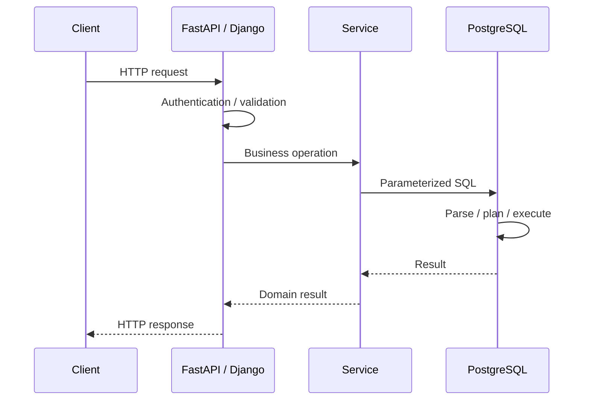
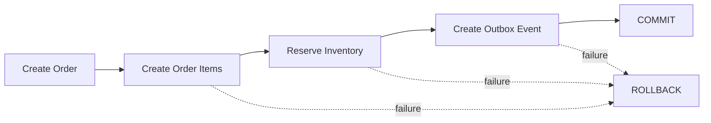

# 05- CRUD Queries

## Overview

CRUD represents the four fundamental data operations performed by an application against a relational database:

| Operation | SQL | Typical E-Commerce Use |
|---|---|---|
| Create | `INSERT` | Create customer, order, cart item |
| Read | `SELECT` | Fetch products, orders, inventory |
| Update | `UPDATE` | Change order status, inventory, customer details |
| Delete | `DELETE` | Remove cart items, deactivate test records |

In a production backend, CRUD is not simply about knowing four SQL statements. The important engineering questions are:

- What rows should be affected?
- What constraints protect the operation?
- Can concurrent requests modify the same data?
- Is the operation idempotent?
- Should the change happen inside a transaction?
- What indexes support the access pattern?
- What happens if zero or multiple rows match?
- Does the API expose database implementation details?
- Can the operation accidentally modify or delete more data than intended?

The examples in this document use the e-commerce schema and sample data defined in the preceding project documents.

---

## CRUD Request Lifecycle

A typical REST API operation passes through several layers before SQL reaches PostgreSQL.



The database should enforce data integrity even when application code is correct.

For example:

```text
Application validation
        +
Database constraints
        +
Transaction boundaries
        +
Concurrency control
```

provide substantially stronger guarantees than application validation alone.

---

## Create with INSERT

`INSERT` creates new rows.

A basic insert looks like:

```sql
INSERT INTO customers (
    email,
    full_name,
    password_hash,
    status
)
VALUES (
    $1,
    $2,
    $3,
    $4
)
RETURNING id, email, full_name, status, created_at;
```

`RETURNING` is especially useful in PostgreSQL because the application can receive generated values without issuing a second query.

### Why RETURNING Matters

Without `RETURNING`, an application might do:

```text
INSERT
  ↓
SELECT newly created row
```

With PostgreSQL:

```text
INSERT ... RETURNING
        ↓
created row
```

This reduces round trips and avoids unnecessary lookup logic.

---

## Create a Customer

```sql
INSERT INTO customers (
    email,
    full_name,
    password_hash,
    status
)
VALUES (
    'new.customer@example.test',
    'New Customer',
    '$argon2id$v=19$m=65536,t=3,p=4$synthetic-test-hash',
    'active'
)
RETURNING id, email, full_name, created_at;
```

In an application, values should be parameters rather than interpolated into SQL.

For example with Python and `psycopg`:

```python
from psycopg import Connection

def create_customer(
    connection: Connection,
    email: str,
    full_name: str,
    password_hash: str,
) -> dict:
    with connection.cursor() as cursor:
        cursor.execute(
            """
            INSERT INTO customers (
                email,
                full_name,
                password_hash,
                status
            )
            VALUES (%s, %s, %s, 'active')
            RETURNING id, email, full_name, status, created_at
            """,
            (email, full_name, password_hash),
        )

        row = cursor.fetchone()

    return {
        "id": row[0],
        "email": row[1],
        "full_name": row[2],
        "status": row[3],
        "created_at": row[4],
    }
```

Parameterized queries protect the SQL structure from user-controlled values.

---

## Insert Multiple Rows

PostgreSQL supports multi-row inserts:

```sql
INSERT INTO categories (
    name,
    slug,
    description,
    is_active
)
VALUES
    ('Cameras', 'cameras', 'Digital cameras.', TRUE),
    ('Audio', 'audio', 'Audio equipment.', TRUE),
    ('Networking', 'networking', 'Networking equipment.', TRUE)
RETURNING id, name, slug;
```

This is generally preferable to issuing one database round trip per row.

### Multi-Row Insert vs Row-by-Row Insert

| Approach | Database round trips | Typical Use |
|---|---:|---|
| One `INSERT` per row | High | Small interactive operations |
| Multi-row `INSERT` | Low | Small/medium batches |
| `COPY` | Very low | Large bulk loading |
| ORM `bulk_create` | Depends on ORM | Application-level bulk operations |

For very large imports, PostgreSQL `COPY` is usually more appropriate than constructing extremely large `INSERT` statements.

---

## Insert with Conflict Handling

E-commerce systems frequently need idempotent writes.

PostgreSQL supports:

```sql
INSERT ... ON CONFLICT
```

Example:

```sql
INSERT INTO product_variants (
    product_id,
    sku,
    attributes,
    is_active
)
VALUES (
    $1,
    $2,
    $3::jsonb,
    TRUE
)
ON CONFLICT (sku)
DO UPDATE SET
    attributes = EXCLUDED.attributes,
    is_active = EXCLUDED.is_active,
    updated_at = CURRENT_TIMESTAMP
RETURNING id, sku, is_active;
```

This is an **upsert**.

Use it when the business operation genuinely means:

```text
create if missing
otherwise update the existing row
```

Do not use upsert merely because it is convenient. The conflict target should correspond to a real business uniqueness rule.

---

## Read with SELECT

`SELECT` retrieves data.

Basic product query:

```sql
SELECT
    id,
    name,
    brand,
    status,
    created_at
FROM products
WHERE status = 'active'
ORDER BY created_at DESC, id DESC;
```

Production reads should generally specify:

- Required columns.
- Filtering conditions.
- Deterministic ordering where ordering matters.
- Pagination for collection endpoints.
- Appropriate authorization boundaries.

Avoid:

```sql
SELECT *
FROM products;
```

when an API needs only a few fields.

---

## Read a Single Row

```sql
SELECT
    id,
    email,
    full_name,
    status,
    created_at
FROM customers
WHERE id = $1;
```

The application must distinguish:

```text
one row
zero rows
unexpected multiple rows
```

If `id` is a primary key, multiple rows cannot match.

For a business key such as email, uniqueness should be enforced by the database if the application expects one row.

---

## Read by Business Key

```sql
SELECT
    id,
    email,
    full_name,
    status
FROM customers
WHERE email = $1;
```

If email is intended to be unique, enforce it:

```sql
CREATE UNIQUE INDEX customers_email_unique
ON customers (email);
```

Application-level checks such as:

```text
SELECT email
  ↓
if not exists
  ↓
INSERT
```

are vulnerable to concurrent requests.

Two requests can both observe that the email does not exist.

The database constraint closes this race.

---

## Read Related Data with JOIN

Fetch an order with its customer:

```sql
SELECT
    o.id AS order_id,
    o.status,
    o.grand_total,
    o.created_at,
    c.id AS customer_id,
    c.full_name,
    c.email
FROM orders AS o
JOIN customers AS c
    ON c.id = o.customer_id
WHERE o.id = $1;
```

For order details, fetch line items separately when appropriate:

```sql
SELECT
    oi.id,
    oi.sku_snapshot,
    oi.product_name_snapshot,
    oi.quantity,
    oi.unit_price,
    oi.line_total
FROM order_items AS oi
WHERE oi.order_id = $1
ORDER BY oi.id;
```

Separating parent and collection queries can sometimes produce a cleaner API implementation than one large join, especially when multiple one-to-many relationships would multiply rows.

---

## Read with EXISTS

When the application needs to know whether a relationship exists, use `EXISTS` rather than loading unnecessary rows.

Example:

```sql
SELECT EXISTS (
    SELECT 1
    FROM orders
    WHERE id = $1
      AND customer_id = $2
      AND status <> 'cancelled'
) AS can_access;
```

This is useful for authorization checks.

`EXISTS` expresses the business intent directly:

```text
Does a matching row exist?
```

rather than:

```text
How many matching rows are there?
```

---

## Read with Aggregation

Calculate customer order counts:

```sql
SELECT
    customer_id,
    COUNT(*) AS order_count,
    SUM(grand_total) AS lifetime_order_value
FROM orders
WHERE status <> 'cancelled'
GROUP BY customer_id
ORDER BY lifetime_order_value DESC;
```

When aggregation is used in APIs or reporting queries, carefully define which statuses count as business revenue.

For example, cancelled orders should generally not be treated as completed sales.

---

## Read with Pagination

Collection APIs should normally have explicit pagination.

Offset pagination:

```sql
SELECT
    id,
    status,
    grand_total,
    created_at
FROM orders
ORDER BY created_at DESC, id DESC
LIMIT $1
OFFSET $2;
```

This is simple but becomes less efficient at large offsets.

Keyset pagination:

```sql
SELECT
    id,
    status,
    grand_total,
    created_at
FROM orders
WHERE (created_at, id) < ($1, $2)
ORDER BY created_at DESC, id DESC
LIMIT $3;
```

For large datasets, keyset pagination is usually the better default when the API's navigation model allows it.

---

## Update with UPDATE

`UPDATE` changes existing rows.

Example:

```sql
UPDATE customers
SET
    full_name = $1,
    updated_at = CURRENT_TIMESTAMP
WHERE id = $2
RETURNING id, email, full_name, updated_at;
```

The most important safety rule is:

> Never issue a production `UPDATE` without deliberately verifying its `WHERE` clause.

This is dangerous:

```sql
UPDATE customers
SET status = 'active';
```

It updates every customer.

---

## Conditional Update

A production update often includes the current state.

```sql
UPDATE orders
SET
    status = 'processing',
    updated_at = CURRENT_TIMESTAMP
WHERE id = $1
  AND status = 'confirmed'
RETURNING id, status, updated_at;
```

This turns the operation into an atomic state transition.

The application can inspect the affected-row count:

```text
1 row → transition succeeded
0 rows → order was not in the expected state
```

This is substantially safer than:

```text
SELECT status
UPDATE status
```

because another transaction can change the order between those two statements.

---

## Atomic Inventory Update

Inventory is a classic concurrency problem.

Avoid:

```text
SELECT available_quantity
        ↓
Python checks quantity
        ↓
UPDATE inventory
```

Instead, perform the condition and modification atomically:

```sql
UPDATE inventory
SET
    available_quantity = available_quantity - $1,
    updated_at = CURRENT_TIMESTAMP
WHERE variant_id = $2
  AND available_quantity >= $1
RETURNING variant_id, available_quantity, reserved_quantity;
```

If zero rows are returned, the inventory condition was not satisfied.

This pattern avoids overselling caused by two requests reading the same stock value before either updates it.

---

## Increment Counters Atomically

Avoid:

```text
SELECT usage_count
        ↓
usage_count + 1
        ↓
UPDATE
```

Prefer:

```sql
UPDATE coupons
SET
    usage_count = usage_count + 1,
    updated_at = CURRENT_TIMESTAMP
WHERE id = $1
  AND usage_count < usage_limit
RETURNING usage_count;
```

The database evaluates and updates the value atomically within the statement.

---

## Delete with DELETE

Delete a cart item:

```sql
DELETE FROM cart_items
WHERE id = $1
  AND cart_id = $2
RETURNING id;
```

Including `cart_id` is important when the API is operating in the context of a customer's cart.

The query now expresses:

```text
Delete this item only if it belongs to this cart.
```

This provides an additional authorization boundary.

---

## Hard Delete vs Soft Delete

Hard delete:

```sql
DELETE FROM products
WHERE id = $1;
```

Soft delete:

```sql
UPDATE products
SET
    status = 'deleted',
    updated_at = CURRENT_TIMESTAMP
WHERE id = $1
RETURNING id, status;
```

| Strategy | Advantages | Limitations |
|---|---|---|
| Hard delete | Simple, physically removes data | Breaks historical references if poorly designed |
| Soft delete | Preserves history | Every query must handle deleted rows |
| Archive | Separates active and historical data | More operational complexity |

For e-commerce data, orders and financial records generally require preservation rather than arbitrary deletion.

Products can often be made inactive or discontinued instead of physically deleted.

---

## DELETE with Referential Dependencies

A product may be referenced by:

```text
product
  ↓
product_variant
  ↓
order_item
```

Deleting it can fail because of foreign-key constraints.

This is desirable.

Historical order records should not disappear simply because a catalog product is no longer sold.

A better lifecycle is often:

```sql
UPDATE products
SET
    status = 'discontinued',
    updated_at = CURRENT_TIMESTAMP
WHERE id = $1;
```

---

## Transactions Around CRUD Operations

Some business operations require multiple SQL statements to succeed together.

Order creation may involve:

```text
Create order
    ↓
Create order items
    ↓
Reserve inventory
    ↓
Create payment record
    ↓
Create outbox event
```

These operations should be considered as one transactional unit where the business invariant requires atomicity.



Example:

```sql
BEGIN;

INSERT INTO orders (
    customer_id,
    status,
    currency_code,
    subtotal,
    discount_amount,
    tax_amount,
    shipping_amount,
    grand_total,
    billing_address,
    shipping_address
)
VALUES (
    $1,
    'pending',
    'INR',
    $2,
    $3,
    $4,
    $5,
    $6,
    $7,
    $8
)
RETURNING id;

-- Insert order items.

-- Reserve inventory.

-- Insert transactional outbox event.

COMMIT;
```

If a required operation fails:

```sql
ROLLBACK;
```

Do not hold a database transaction open while calling external payment providers or other slow remote services unless the architecture explicitly requires and can tolerate that coupling.

---

## CRUD and Idempotency

HTTP retries, client retries, load balancer retries, and worker retries can cause duplicate requests.

For example:

```text
Client
  ↓
POST /orders
  ↓
Database commit succeeds
  ↓
Network response is lost
  ↓
Client retries POST
```

Without idempotency, two orders may be created.

A common approach is an idempotency key:

```sql
CREATE UNIQUE INDEX orders_idempotency_key_unique
ON orders (customer_id, idempotency_key)
WHERE idempotency_key IS NOT NULL;
```

Then:

```sql
INSERT INTO orders (
    customer_id,
    idempotency_key,
    status,
    ...
)
VALUES (
    $1,
    $2,
    'pending',
    ...
)
ON CONFLICT (customer_id, idempotency_key)
DO NOTHING
RETURNING id, status;
```

The application must also define what happens when the key already exists.

---

## CRUD and Optimistic Concurrency

When multiple clients can update the same resource, optimistic concurrency can prevent lost updates.

A common technique is a version column:

```sql
UPDATE products
SET
    name = $1,
    version = version + 1,
    updated_at = CURRENT_TIMESTAMP
WHERE id = $2
  AND version = $3
RETURNING id, name, version, updated_at;
```

If zero rows are returned:

```text
The version supplied by the client is stale.
```

The API can return an appropriate conflict response.

This is often preferable to overwriting another user's changes silently.

---

## CRUD and Row Locking

For operations requiring serialized access to a row:

```sql
SELECT
    variant_id,
    available_quantity,
    reserved_quantity
FROM inventory
WHERE variant_id = $1
FOR UPDATE;
```

The selected row is locked until the transaction ends.

A typical workflow:

```sql
BEGIN;

SELECT available_quantity
FROM inventory
WHERE variant_id = $1
FOR UPDATE;

-- Validate and modify inventory.

UPDATE inventory
SET
    available_quantity = available_quantity - $2,
    reserved_quantity = reserved_quantity + $2,
    updated_at = CURRENT_TIMESTAMP
WHERE variant_id = $1;

COMMIT;
```

Use row locks intentionally. Excessive locking reduces concurrency and can create deadlocks.

For simple conditional inventory decrements, an atomic `UPDATE ... WHERE available_quantity >= ...` can be preferable.

---

## Django ORM Mapping

The same CRUD operations can be represented using Django's ORM.

Create:

```python
customer = Customer.objects.create(
    email=email,
    full_name=full_name,
    password_hash=password_hash,
    status="active",
)
```

Read:

```python
customer = Customer.objects.get(id=customer_id)
```

Filtered read:

```python
orders = (
    Order.objects
    .filter(customer_id=customer_id)
    .exclude(status="cancelled")
    .order_by("-created_at", "-id")
)
```

Update:

```python
updated = (
    Customer.objects
    .filter(id=customer_id)
    .update(
        full_name=full_name,
        updated_at=timezone.now(),
    )
)
```

Delete:

```python
deleted, _ = CartItem.objects.filter(
    id=item_id,
    cart_id=cart_id,
).delete()
```

The ORM does not eliminate SQL knowledge. Understanding generated SQL remains important for:

- Query count.
- Join behavior.
- Index usage.
- Locking.
- Transactions.
- Pagination.
- Aggregation.

---

## FastAPI Repository Pattern

A FastAPI service commonly separates API handling from database operations.

```python
from psycopg import Connection


def get_order(
    connection: Connection,
    order_id: int,
    customer_id: int,
) -> dict | None:
    with connection.cursor() as cursor:
        cursor.execute(
            """
            SELECT
                id,
                status,
                grand_total,
                created_at
            FROM orders
            WHERE id = %s
              AND customer_id = %s
            """,
            (order_id, customer_id),
        )

        row = cursor.fetchone()

    if row is None:
        return None

    return {
        "id": row[0],
        "status": row[1],
        "grand_total": row[2],
        "created_at": row[3],
    }
```

The repository should not silently turn every database operation into generic CRUD. Business-specific operations should remain explicit.

For example:

```text
reserve_inventory()
confirm_order()
cancel_order()
capture_payment()
```

are usually more meaningful service operations than exposing arbitrary:

```text
update_inventory()
update_order()
```

methods.

---

## CRUD and API Semantics

CRUD does not map one-to-one with HTTP methods in every situation, but the common mapping is:

| HTTP | Typical SQL | Example |
|---|---|---|
| `POST` | `INSERT` | Create order |
| `GET` | `SELECT` | Get order |
| `PUT` | `UPDATE` | Replace resource |
| `PATCH` | `UPDATE` | Partial update |
| `DELETE` | `DELETE` or soft delete | Remove cart item |

The database operation should still reflect the domain semantics.

For example:

```http
PATCH /orders/1006
```

should not necessarily allow the client to submit:

```json
{
  "status": "delivered"
}
```

if only the fulfillment system is authorized to make that transition.

Authorization belongs at the application/domain layer, while integrity constraints belong in the database.

---

## CRUD and Indexes

CRUD performance depends heavily on the predicates used to locate rows.

For:

```sql
SELECT *
FROM orders
WHERE customer_id = $1
ORDER BY created_at DESC, id DESC
LIMIT 20;
```

a useful index is:

```sql
CREATE INDEX orders_customer_created_idx
ON orders (customer_id, created_at DESC, id DESC);
```

For:

```sql
UPDATE inventory
SET available_quantity = available_quantity - $1
WHERE variant_id = $2;
```

`variant_id` should be indexed or uniquely constrained according to the inventory model.

Indexes improve reads but add:

- Storage.
- Write overhead.
- WAL generation.
- Vacuum work.
- Replication traffic.
- Backup size.

Index decisions should therefore be based on actual workload.

---

## CRUD and Query Plans

Never assume a CRUD query is efficient because it contains a primary key.

Inspect important production queries:

```sql
EXPLAIN (ANALYZE, BUFFERS)
SELECT
    id,
    status,
    grand_total
FROM orders
WHERE customer_id = 2
ORDER BY created_at DESC, id DESC
LIMIT 20;
```

Look for:

- Sequential scans where an index should help.
- Unexpected row estimates.
- Large numbers of rows removed by filters.
- Sort operations.
- Excessive buffer reads.
- Expensive nested loops.
- Poor cardinality estimates.

The optimizer chooses the execution plan; creating an index does not guarantee that PostgreSQL will use it.

---

## CRUD and Security

### Parameterize Values

Never construct SQL using string interpolation:

```python
query = f"""
SELECT *
FROM customers
WHERE email = '{email}'
"""
```

Use parameter binding:

```python
cursor.execute(
    """
    SELECT id, email, full_name
    FROM customers
    WHERE email = %s
    """,
    (email,),
)
```

### Enforce Authorization Scope

Bad:

```sql
UPDATE orders
SET status = 'cancelled'
WHERE id = $1;
```

Safer when cancellation is customer-scoped:

```sql
UPDATE orders
SET
    status = 'cancelled',
    updated_at = CURRENT_TIMESTAMP
WHERE id = $1
  AND customer_id = $2
  AND status IN ('pending', 'confirmed');
```

The application should still perform the broader authorization decision, but the SQL predicate provides an additional protection boundary.

---

## Multi-Tenant CRUD

In a multi-tenant system, tenant identity should be part of data access.

Instead of:

```sql
SELECT *
FROM orders
WHERE id = $1;
```

prefer:

```sql
SELECT
    id,
    status,
    grand_total,
    created_at
FROM orders
WHERE id = $1
  AND tenant_id = $2;
```

This prevents a resource ID from being treated as sufficient authorization.

For stronger isolation, PostgreSQL Row-Level Security can provide a database-enforced policy layer, but RLS must be designed alongside connection pooling, application roles, and transaction-scoped tenant context.

---

## CRUD Error Handling

Applications should distinguish different failure categories.

| Database condition | Application meaning |
|---|---|
| No row found | Resource does not exist or is not visible |
| Unique violation | Duplicate business key |
| Foreign-key violation | Invalid relationship |
| Check violation | Invalid state/value |
| Serialization failure | Transaction should usually retry |
| Deadlock | Transaction should usually retry |
| Timeout | Operation exceeded operational limit |
| Connection failure | Infrastructure/database availability issue |

Do not convert every database error into:

```http
500 Internal Server Error
```

without classification.

Likewise, do not expose raw PostgreSQL errors directly to API clients.

---

## CRUD and Transactions in Django

For multi-step writes:

```python
from django.db import transaction


@transaction.atomic
def create_order(customer, order_data, items):
    order = Order.objects.create(
        customer=customer,
        **order_data,
    )

    OrderItem.objects.bulk_create(
        [
            OrderItem(order=order, **item)
            for item in items
        ]
    )

    return order
```

The transaction boundary should represent a real business invariant.

Do not automatically wrap every read-only request in a long-lived transaction.

---

## CRUD and Background Workers

Celery workers often perform database CRUD for asynchronous workflows.

Example:

```text
Order created
    ↓
Transactional outbox
    ↓
Kafka / worker
    ↓
Celery task
    ↓
Update fulfillment state
```

Workers must assume retries can happen.

Therefore:

```text
CRUD operation
+
idempotency
+
unique constraints
+
transaction
```

is often more important than simply ensuring the SQL statement succeeds once.

---

## Delete and Asynchronous Cleanup

Large deletes should not necessarily be executed as one enormous transaction.

Instead of:

```sql
DELETE FROM audit_events;
```

a large production cleanup may process bounded batches.

For example:

```sql
DELETE FROM audit_events
WHERE id IN (
    SELECT id
    FROM audit_events
    WHERE created_at < $1
    ORDER BY id
    LIMIT $2
);
```

The worker can repeat the operation until no rows remain.

This reduces transaction size and can reduce lock, WAL, replication, and vacuum pressure.

The exact strategy depends on foreign keys, indexing, partitioning, retention requirements, and workload.

---

## CRUD in High Availability Systems

In a PostgreSQL primary/replica architecture:

```text
                    ┌──────────────┐
                    │   Primary    │
                    │   PostgreSQL │
                    └──────┬───────┘
                           │
                    WAL replication
                           │
             ┌─────────────┴─────────────┐
             ↓                           ↓
      Read Replica 1              Read Replica 2
```

Writes normally go to the primary.

Read replicas can serve appropriate read-only workloads.

However, immediately reading after a write from a replica can produce stale results because replication is asynchronous.

For workflows requiring read-after-write consistency:

```text
POST /orders
     ↓
Primary write
     ↓
GET /orders/{id}
     ↓
Prefer primary when necessary
```

The routing decision belongs to the application's consistency model.

---

## Observability

CRUD operations should be observable without logging sensitive data.

Useful metrics include:

- Query latency.
- Database connection pool utilization.
- Query error rate.
- Transaction duration.
- Lock wait time.
- Rows affected.
- Deadlocks.
- Serialization failures.
- Replica lag.
- Slow-query counts.

For PostgreSQL, tools such as `pg_stat_statements` can help identify expensive or frequently executed queries.

Avoid logging:

```text
password hashes
payment secrets
authorization tokens
sensitive personal data
```

as part of SQL diagnostics.

---

## Common CRUD Mistakes

### Missing WHERE Clause

Dangerous:

```sql
DELETE FROM customers;
```

or:

```sql
UPDATE products
SET status = 'inactive';
```

Use a deliberately scoped predicate and review destructive statements before execution.

---

### Read-Then-Write Race

Dangerous:

```text
SELECT stock
      ↓
application checks stock
      ↓
UPDATE stock
```

Prefer atomic updates or appropriate row locking.

---

### Assuming Row Count Means Success

For:

```sql
UPDATE orders
SET status = 'cancelled'
WHERE id = $1
  AND status = 'pending';
```

zero rows could mean:

- Order does not exist.
- Order belongs to another tenant/customer if scoped.
- Order is already in another state.

The application must define the correct API behavior.

---

### Using SELECT COUNT(*) for Existence

Avoid:

```sql
SELECT COUNT(*)
FROM orders
WHERE customer_id = $1;
```

when the only question is whether one exists.

Prefer:

```sql
SELECT EXISTS (
    SELECT 1
    FROM orders
    WHERE customer_id = $1
);
```

If the actual requirement is the count, use `COUNT`.

---

### N+1 CRUD Queries

Bad application behavior:

```text
SELECT customers
    ↓
SELECT orders for customer 1
SELECT orders for customer 2
SELECT orders for customer 3
...
```

Use joins, `EXISTS`, prefetching, batching, or purpose-built queries depending on the access pattern.

---

### Using SELECT * Everywhere

`SELECT *` increases coupling between:

```text
database schema
    ↕
application code
    ↕
API response
```

Explicit columns make query contracts clearer and reduce unnecessary data transfer.

---

### Treating CRUD as the Domain Model

Generic methods such as:

```python
update_order(...)
delete_order(...)
```

can hide business rules.

Prefer domain operations where state transitions matter:

```python
confirm_order(...)
cancel_order(...)
reserve_inventory(...)
capture_payment(...)
```

The underlying implementation may still use ordinary SQL CRUD operations.

---

## Production CRUD Checklist

Before shipping a CRUD operation, verify:

### Correctness

- Does the query affect exactly the intended rows?
- Are foreign keys and constraints defined?
- Are NULL semantics correct?
- Are status transitions valid?
- Is historical data preserved where required?

### Concurrency

- Can two requests update the same row?
- Is a check-and-update operation atomic?
- Is optimistic or pessimistic locking required?
- Can deadlocks occur?
- Can serialization failures occur?

### Performance

- Is the predicate indexed appropriately?
- Is the result bounded?
- Is pagination deterministic?
- Is the query returning unnecessary columns?
- Has the important query been inspected with `EXPLAIN`?

### Security

- Are values parameterized?
- Is authorization enforced?
- Is tenant/customer scope included where necessary?
- Could the operation expose another user's data?
- Are sensitive values excluded from logs?

### Reliability

- Is the operation idempotent where retries are possible?
- Is the transaction boundary correct?
- What happens after a timeout?
- Can the client safely retry?
- What happens if the database connection fails after the commit?

---

## CRUD Decision Matrix

| Requirement | Recommended approach |
|---|---|
| Create one record | `INSERT ... RETURNING` |
| Create many records | Multi-row `INSERT` / bulk operation |
| Insert-or-update by unique key | `ON CONFLICT` |
| Read one record by ID | Indexed `SELECT` |
| Read related records | `JOIN` / separate bounded query |
| Check existence | `EXISTS` |
| Update one known row | `UPDATE ... WHERE primary_key` |
| Conditional state transition | `UPDATE ... WHERE current_state` |
| Atomic inventory change | Conditional `UPDATE` |
| Serialize complex row operation | `SELECT ... FOR UPDATE` |
| Remove temporary child data | Scoped `DELETE` |
| Preserve business history | Status change / soft delete / archive |
| Large cleanup | Bounded batch deletes |
| Retry-safe create | Idempotency key + unique constraint |
| Prevent lost updates | Version column / optimistic concurrency |
| Multi-step business write | Transaction |
| Large read API | Keyset pagination where appropriate |

---

## Interview Traps

### Is CRUD enough for database design?

No.

CRUD describes basic operations, but production database design also requires:

```text
constraints
indexes
transactions
concurrency
isolation
authorization
idempotency
observability
failure handling
```

### Is `UPDATE` atomic?

A single SQL statement is atomic under PostgreSQL's transactional model, but that does not automatically make a multi-statement business workflow atomic.

### Should every operation use a transaction?

Transactions are fundamental to correctness, but transaction scope should match the business invariant. Long unnecessary transactions can reduce concurrency and increase operational pressure.

### Is `DELETE` always better than soft delete?

No. The correct choice depends on retention, auditability, referential integrity, regulatory requirements, storage lifecycle, and query complexity.

### Does an ORM eliminate SQL optimization?

No. ORMs generate SQL. Senior backend engineers must understand the resulting SQL, query plans, indexes, locking, and transaction behavior.

---

## Key Takeaways

- **CRUD is the mechanical layer; production correctness comes from combining SQL with constraints, transactions, concurrency control, authorization, and idempotency.**
- **Prefer atomic SQL for check-and-change operations such as inventory reservation and state transitions instead of vulnerable read-then-write sequences.**
- **Use explicit columns, deterministic pagination, appropriate indexes, parameterized values, and bounded queries for production workloads.**
- **Design writes for retries and concurrency using unique constraints, `ON CONFLICT`, optimistic locking, transactions, and appropriate row locks.**
- **Treat business operations such as `cancel_order()` or `reserve_inventory()` as domain behavior implemented with CRUD primitives rather than exposing generic database mutation everywhere.**