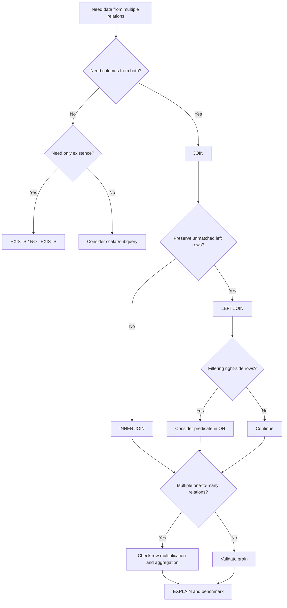

# 06- JOIN Queries

## Overview

`JOIN` is the primary SQL mechanism for combining related rows from multiple tables.

In the e-commerce database, business information is intentionally distributed across normalized tables:

```text
customers
    │
    └── orders
          │
          ├── order_items
          │
          ├── payments
          │
          └── shipments

products
    │
    └── product_variants
          │
          └── inventory
```

A production backend frequently needs information that spans these relationships:

- Customer + orders
- Order + order items
- Order + payment
- Product + variants
- Variant + inventory
- Customer + addresses
- Orders + shipments

The difficult part is not writing `JOIN` syntax. Senior-level SQL work requires understanding:

- Join cardinality.
- Result grain.
- Inner vs outer join semantics.
- Duplicate row multiplication.
- NULL behavior.
- Predicate placement.
- Index requirements.
- Aggregation after joins.
- Authorization and tenant boundaries.
- Query plans and execution cost.

---

## Why JOINs Matter

A normalized relational schema avoids storing the same information repeatedly.

For example, an order stores:

```text
customer_id
```

rather than duplicating the customer's complete profile.

A join reconstructs the information needed by a particular query:

```sql
SELECT
    o.id,
    o.status,
    c.full_name,
    c.email
FROM orders AS o
JOIN customers AS c
    ON c.id = o.customer_id;
```

The database combines rows based on a relationship.

This allows the schema to remain normalized while still supporting application-specific read models.

---

## JOIN Mental Model

A useful mental model is:

```text
Left relation
    +
Join condition
    +
Right relation
    =
Combined result
```

For:

```sql
FROM orders AS o
JOIN customers AS c
    ON c.id = o.customer_id
```

the relationship is:

```text
orders.customer_id → customers.id
```

The direction of the foreign key matters for understanding the domain, but SQL can join in either syntactic direction.

---

## Result Grain

Before writing a join, define the grain of the result.

For example:

```text
One row per customer
One row per order
One row per order item
One row per product variant
```

This is one of the most important senior-level SQL concepts.

Consider:

```sql
SELECT
    o.id,
    oi.id
FROM orders AS o
JOIN order_items AS oi
    ON oi.order_id = o.id;
```

The result grain is:

```text
one row per order item
```

An order with five items produces five result rows.

The join did not duplicate data incorrectly. The result grain changed from:

```text
orders → one row per order
```

to:

```text
orders + order_items → one row per order item
```

Many SQL bugs are actually grain misunderstandings.

---

## INNER JOIN

An `INNER JOIN` returns rows where the join condition matches on both sides.

```sql
SELECT
    o.id AS order_id,
    c.id AS customer_id,
    c.full_name
FROM orders AS o
INNER JOIN customers AS c
    ON c.id = o.customer_id;
```

If an order has no matching customer, that order is excluded.

Because `orders.customer_id` should reference an existing customer through a foreign key, this is normally expected to return every valid order.

### When to Use

Use `INNER JOIN` when:

- The related record is required for the result.
- Missing related data should exclude the row.
- The relationship is mandatory.
- You only want matched records.

---

## LEFT JOIN

A `LEFT JOIN` preserves every row from the left table.

```sql
SELECT
    c.id,
    c.full_name,
    o.id AS order_id,
    o.status
FROM customers AS c
LEFT JOIN orders AS o
    ON o.customer_id = c.id
ORDER BY c.id, o.id;
```

Customers without orders still appear.

Their order columns contain `NULL`.

```text
Customer A → Order 1001
Customer A → Order 1002
Customer B → NULL
```

This is useful for questions such as:

```text
Which customers have never placed an order?
```

```sql
SELECT
    c.id,
    c.full_name,
    c.email
FROM customers AS c
LEFT JOIN orders AS o
    ON o.customer_id = c.id
WHERE o.id IS NULL;
```

---

## RIGHT JOIN

A `RIGHT JOIN` preserves rows from the right side.

```sql
SELECT
    o.id,
    c.full_name
FROM orders AS o
RIGHT JOIN customers AS c
    ON c.id = o.customer_id;
```

It is valid SQL, but most production code prefers `LEFT JOIN` because the preserved relation is conventionally written first.

The equivalent query is:

```sql
SELECT
    o.id,
    c.full_name
FROM customers AS c
LEFT JOIN orders AS o
    ON o.customer_id = c.id;
```

Prefer the form that makes the business intent easiest to understand.

---

## FULL OUTER JOIN

A `FULL OUTER JOIN` preserves unmatched rows from both sides.

```sql
SELECT
    c.id AS customer_id,
    o.id AS order_id
FROM customers AS c
FULL OUTER JOIN orders AS o
    ON o.customer_id = c.id;
```

This is useful for reconciliation and data-quality analysis.

For example:

```text
Customer without order
Order without customer
Customer with order
```

In a properly constrained schema, an order without a customer should generally be impossible.

That makes `FULL OUTER JOIN` useful for investigating data produced by imports, migrations, external systems, or historically inconsistent schemas.

---

## CROSS JOIN

A `CROSS JOIN` produces the Cartesian product.

```sql
SELECT
    c.id AS customer_id,
    p.id AS product_id
FROM customers AS c
CROSS JOIN products AS p;
```

If there are:

```text
5 customers
×
8 products
```

the result contains:

```text
40 rows
```

Cross joins are appropriate when every combination is genuinely required.

They are dangerous when produced accidentally.

For example:

```sql
SELECT *
FROM orders AS o
JOIN products AS p;
```

without an appropriate join condition can create massive row multiplication.

---

## Self JOIN

A table can be joined to itself.

Example:

```sql
SELECT
    parent.id AS parent_category_id,
    parent.name AS parent_category,
    child.id AS child_category_id,
    child.name AS child_category
FROM categories AS parent
JOIN categories AS child
    ON child.parent_id = parent.id;
```

Self joins are useful for hierarchical data.

Typical use cases include:

- Category hierarchies.
- Organizational structures.
- Referral relationships.
- Parent/child records.
- Dependency graphs.

For deeply recursive hierarchies, PostgreSQL recursive CTEs are generally more appropriate than repeatedly writing self joins.

---

## JOIN Syntax

Explicit join syntax should be preferred:

```sql
SELECT
    o.id,
    c.full_name
FROM orders AS o
JOIN customers AS c
    ON c.id = o.customer_id
WHERE o.status = 'delivered';
```

Avoid old comma-style joins:

```sql
SELECT
    o.id,
    c.full_name
FROM orders AS o, customers AS c
WHERE c.id = o.customer_id;
```

Explicit `JOIN ... ON` makes relationship conditions easier to see and reduces the chance of accidentally creating a Cartesian product.

---

## Multiple JOINs

Production queries frequently join several tables.

For an order detail view:

```sql
SELECT
    o.id AS order_id,
    o.status,
    c.full_name,
    c.email,
    oi.id AS order_item_id,
    oi.sku_snapshot,
    oi.product_name_snapshot,
    oi.quantity,
    oi.unit_price
FROM orders AS o
JOIN customers AS c
    ON c.id = o.customer_id
JOIN order_items AS oi
    ON oi.order_id = o.id
WHERE o.id = $1
ORDER BY oi.id;
```

The result grain is:

```text
one row per order item
```

The customer and order information are repeated across those rows because they belong to the parent grain.

That repetition is expected.

---

## One-to-One JOIN

A one-to-one relationship produces at most one related row.

For example, if `inventory.variant_id` is unique:

```sql
SELECT
    pv.id AS variant_id,
    pv.sku,
    i.available_quantity,
    i.reserved_quantity
FROM product_variants AS pv
JOIN inventory AS i
    ON i.variant_id = pv.id;
```

The expected grain is:

```text
one row per product variant
```

The uniqueness constraint is important because the database, not just application assumptions, should enforce the one-to-one relationship.

---

## One-to-Many JOIN

Orders and order items are a classic one-to-many relationship.

```sql
SELECT
    o.id AS order_id,
    oi.id AS order_item_id,
    oi.quantity
FROM orders AS o
JOIN order_items AS oi
    ON oi.order_id = o.id;
```

One order can produce many rows.

```text
Order 1001
    ├── Item 1
    ├── Item 2
    └── Item 3
```

Therefore:

```text
orders row count
        ↓
JOIN order_items
        ↓
order-item row count
```

This is the source of many accidental aggregation errors.

---

## Many-to-Many JOIN

Many-to-many relationships normally use a junction table.

For example:

```text
products
    │
    └── product_categories
            │
            └── categories
```

The query becomes:

```sql
SELECT
    p.id AS product_id,
    p.name AS product_name,
    c.id AS category_id,
    c.name AS category_name
FROM products AS p
JOIN product_categories AS pc
    ON pc.product_id = p.id
JOIN categories AS c
    ON c.id = pc.category_id;
```

The junction table represents relationships rather than duplicating category data into every product.

---

## LEFT JOIN and Predicate Placement

A common mistake is accidentally turning a `LEFT JOIN` into an effective inner join.

Consider:

```sql
SELECT
    c.id,
    c.full_name,
    o.id AS order_id
FROM customers AS c
LEFT JOIN orders AS o
    ON o.customer_id = c.id
WHERE o.status = 'delivered';
```

The `WHERE` condition rejects rows where `o.status` is `NULL`.

Customers without orders disappear.

If the requirement is:

> Return all customers and include delivered orders when they exist.

put the condition in the join:

```sql
SELECT
    c.id,
    c.full_name,
    o.id AS order_id
FROM customers AS c
LEFT JOIN orders AS o
    ON o.customer_id = c.id
   AND o.status = 'delivered';
```

The distinction is critical.

---

## JOIN vs WHERE

A useful rule is:

```text
ON
→ defines which rows match across relations

WHERE
→ filters the resulting row set
```

For inner joins, optimizers can often move predicates without changing semantics.

For outer joins, predicate placement can change the result.

Therefore, do not rely on the optimizer to make a semantically incorrect query correct.

---

## JOIN with NULL

Consider:

```sql
SELECT
    c.id,
    o.id
FROM customers AS c
LEFT JOIN orders AS o
    ON o.customer_id = c.id;
```

When no order exists:

```text
o.id = NULL
```

To identify unmatched rows:

```sql
WHERE o.id IS NULL
```

not:

```sql
WHERE o.id = NULL
```

SQL uses three-valued logic, so `NULL = NULL` does not evaluate to `TRUE`.

---

## JOIN and Duplicate Rows

Suppose:

```text
Customer
   ↓
Orders
   ↓
Order Items
```

Joining all three produces one row per order item.

If a customer has:

```text
3 orders
5 total items
```

the customer may appear five times.

This is expected based on result grain.

The mistake is assuming:

```sql
COUNT(c.id)
```

means:

```text
number of customers
```

after a one-to-many join.

Instead:

```sql
COUNT(DISTINCT c.id)
```

may be appropriate when the requirement is the number of unique customers.

But `DISTINCT` should not be used as a generic fix for an incorrect join.

---

## JOIN and Aggregation

Consider calculating customer order totals.

A straightforward query is:

```sql
SELECT
    c.id,
    c.full_name,
    COUNT(o.id) AS order_count,
    COALESCE(SUM(o.grand_total), 0) AS total_order_value
FROM customers AS c
LEFT JOIN orders AS o
    ON o.customer_id = c.id
   AND o.status <> 'cancelled'
GROUP BY
    c.id,
    c.full_name;
```

The `LEFT JOIN` preserves customers with no qualifying orders.

The `COALESCE` converts a `NULL` aggregate result into zero.

---

## Avoiding Double Counting

This query can be dangerous:

```sql
SELECT
    o.id,
    SUM(oi.line_total) AS item_total,
    SUM(p.amount) AS payment_total
FROM orders AS o
JOIN order_items AS oi
    ON oi.order_id = o.id
JOIN payments AS p
    ON p.order_id = o.id
GROUP BY o.id;
```

If an order has:

```text
3 order items
2 payment records
```

the join can produce:

```text
3 × 2 = 6 rows
```

Both aggregates may be multiplied.

A safer design is to aggregate each one-to-many relation separately:

```sql
WITH item_totals AS (
    SELECT
        order_id,
        SUM(line_total) AS item_total
    FROM order_items
    GROUP BY order_id
),
payment_totals AS (
    SELECT
        order_id,
        SUM(amount) AS payment_total
    FROM payments
    GROUP BY order_id
)
SELECT
    o.id,
    COALESCE(it.item_total, 0) AS item_total,
    COALESCE(pt.payment_total, 0) AS payment_total
FROM orders AS o
LEFT JOIN item_totals AS it
    ON it.order_id = o.id
LEFT JOIN payment_totals AS pt
    ON pt.order_id = o.id;
```

The principle is:

> Aggregate independent one-to-many relationships before joining them together when their row multiplication would change the calculation.

---

## JOIN vs EXISTS

If the requirement is only to determine whether a related row exists, `EXISTS` is often clearer.

Suppose the requirement is:

> Find customers who have at least one delivered order.

Using a join:

```sql
SELECT DISTINCT
    c.id,
    c.full_name
FROM customers AS c
JOIN orders AS o
    ON o.customer_id = c.id
WHERE o.status = 'delivered';
```

Using `EXISTS`:

```sql
SELECT
    c.id,
    c.full_name
FROM customers AS c
WHERE EXISTS (
    SELECT 1
    FROM orders AS o
    WHERE o.customer_id = c.id
      AND o.status = 'delivered'
);
```

`EXISTS` expresses the requirement directly and avoids needing `DISTINCT` to remove duplicated customers.

PostgreSQL can transform both forms into efficient plans, so do not assume `EXISTS` is always faster. Choose primarily based on semantics, then validate performance with the execution plan.

---

## JOIN vs Subquery

A join is generally useful when columns from both relations are part of the result.

```sql
SELECT
    o.id,
    c.email
FROM orders AS o
JOIN customers AS c
    ON c.id = o.customer_id;
```

A subquery or `EXISTS` is often more appropriate when only a condition or scalar value is needed.

```sql
SELECT
    o.id,
    o.status
FROM orders AS o
WHERE EXISTS (
    SELECT 1
    FROM customers AS c
    WHERE c.id = o.customer_id
      AND c.status = 'active'
);
```

The choice should follow the desired result semantics rather than a blanket rule such as "joins are faster."

---

## Joining Filtered Relations

Complex queries become easier to reason about when large relations are reduced before further joins.

Example:

```sql
SELECT
    p.id,
    p.name,
    pv.sku,
    i.available_quantity
FROM products AS p
JOIN product_variants AS pv
    ON pv.product_id = p.id
JOIN inventory AS i
    ON i.variant_id = pv.id
WHERE p.status = 'active'
  AND pv.is_active = TRUE
  AND i.available_quantity > 0;
```

The optimizer may reorder operations and push predicates where valid, but writing correct selective predicates makes the intended semantics clear.

---

## JOIN Order

SQL syntax shows:

```sql
FROM A
JOIN B
JOIN C
```

but PostgreSQL's optimizer may choose a different physical join order.

Possible algorithms include:

- Nested Loop.
- Hash Join.
- Merge Join.

Do not assume textual join order determines execution order.

For large queries, inspect:

```sql
EXPLAIN (ANALYZE, BUFFERS)
SELECT ...;
```

The optimizer uses statistics, estimated cardinality, indexes, costs, and available join strategies to choose a plan.

---

## Nested Loop Join

A nested loop conceptually performs:

```text
for each row from outer relation:
    find matching rows in inner relation
```

It can be excellent when:

- The outer relation is small.
- The inner relation has an efficient index.
- The join is highly selective.

Example:

```text
1 order
   ↓
indexed order_items lookup
```

can be very efficient.

It can become expensive when:

```text
large outer relation
×
expensive inner lookup
```

produces many repeated operations.

---

## Hash Join

A hash join generally builds a hash structure for one relation and probes it using the other.

It can work well for large equality joins where suitable indexes are not the primary access mechanism.

Conceptually:

```text
Build hash table
       ↓
Probe matching rows
```

Memory availability matters. Large hash operations can spill to temporary files when memory is insufficient.

---

## Merge Join

A merge join operates efficiently when both inputs are available in compatible sorted order.

Conceptually:

```text
Sorted A ──────┐
               ├── Merge
Sorted B ──────┘
```

It can be effective for large ordered inputs.

The optimizer chooses the algorithm based on estimated costs.

---

## Indexes for JOINs

Foreign-key columns frequently participate in joins.

For:

```sql
SELECT
    o.id,
    oi.quantity
FROM orders AS o
JOIN order_items AS oi
    ON oi.order_id = o.id
WHERE o.id = $1;
```

an index on:

```sql
order_items(order_id)
```

is typically important.

The parent primary key:

```text
orders.id
```

is already indexed through the primary-key constraint.

A foreign key does not automatically guarantee that the referencing column has an index.

---

## Composite Indexes for JOIN Workloads

Suppose an API frequently executes:

```sql
SELECT
    id,
    status,
    created_at
FROM orders
WHERE customer_id = $1
  AND status = $2
ORDER BY created_at DESC, id DESC
LIMIT 20;
```

A candidate index is:

```sql
CREATE INDEX orders_customer_status_created_idx
ON orders (
    customer_id,
    status,
    created_at DESC,
    id DESC
);
```

The correct index depends on actual workload, data distribution, selectivity, and other queries using the same relation.

Do not create indexes solely because columns appear in a join.

---

## JOIN Performance Checklist

For an important join query, inspect:

```sql
EXPLAIN (ANALYZE, BUFFERS)
SELECT
    o.id,
    oi.sku_snapshot,
    oi.quantity
FROM orders AS o
JOIN order_items AS oi
    ON oi.order_id = o.id
WHERE o.customer_id = $1
ORDER BY o.created_at DESC, o.id DESC;
```

Look for:

- Actual vs estimated row counts.
- Join algorithm.
- Sequential scans.
- Index scans.
- Sort operations.
- Rows removed by filters.
- Buffer hits and reads.
- Temporary-file activity.
- Execution time.

Large differences between estimated and actual rows can indicate stale or insufficient statistics, skewed data, or an inaccurate cost model.

---

## JOINs in Django

Django's ORM uses joins when traversing relationships.

Example:

```python
orders = (
    Order.objects
    .select_related("customer")
    .filter(
        customer_id=customer_id,
        status="delivered",
    )
)
```

`select_related()` is appropriate for single-valued relationships such as:

- Foreign keys.
- One-to-one relationships.

For collections, use `prefetch_related()`:

```python
orders = (
    Order.objects
    .filter(customer_id=customer_id)
    .prefetch_related("items")
)
```

The goal is not to force everything into one SQL join. The goal is to avoid unnecessary database round trips while keeping result shape and query cost appropriate.

---

## JOINs and N+1 Queries

Without eager loading:

```python
orders = Order.objects.filter(customer_id=customer_id)

for order in orders:
    print(order.customer.email)
```

the application may execute additional queries for related data depending on the relationship and access pattern.

This can become:

```text
1 query for orders
+
N queries for related records
```

Django provides:

```python
select_related()
prefetch_related()
```

to address common cases.

The generated SQL should still be inspected for large or complex queries.

---

## JOINs in SQLAlchemy

SQLAlchemy supports explicit relationship loading strategies.

For example:

```python
from sqlalchemy import select
from sqlalchemy.orm import joinedload

statement = (
    select(Order)
    .options(joinedload(Order.customer))
    .where(Order.customer_id == customer_id)
)

orders = session.scalars(statement).all()
```

For collection relationships, `selectinload()` is often preferable to blindly using joined eager loading because joining collections can multiply rows.

```python
from sqlalchemy.orm import selectinload

statement = (
    select(Order)
    .options(selectinload(Order.items))
    .where(Order.customer_id == customer_id)
)
```

The correct strategy depends on result size and relationship cardinality.

---

## JOINs and REST APIs

Consider:

```http
GET /orders/1001
```

The API may need:

```text
Order
├── Customer summary
├── Items
├── Payment summary
└── Shipment summary
```

One giant SQL join is not necessarily the best implementation.

A better design may use:

```text
Request
   ↓
Order query
   ↓
Related bounded queries
   ↓
Application assembles response
```

or a carefully designed query when the relationships and cardinalities are manageable.

The database query shape should serve the API contract rather than the other way around.

---

## JOINs and gRPC

The same principle applies to gRPC.

A gRPC endpoint such as:

```text
GetOrder
```

may return a structured response:

```text
Order
├── customer
├── repeated items
├── payment
└── shipment
```

The service can use:

- One optimized query.
- Multiple bounded queries.
- A read model.
- Precomputed data.

The decision depends on latency, consistency, cardinality, and database workload.

---

## JOINs Across Microservices

SQL joins work naturally within one database boundary.

They should not normally cross independent service databases.

Avoid architectures such as:

```text
Order Service DB
       JOIN
Payment Service DB
       JOIN
Customer Service DB
```

when those services own separate databases.

Instead, use:

```text
API/service orchestration
        ↓
Order Service
        ↓
Payment Service
        ↓
Customer Service
```

or maintain a purpose-built read model using events.

Kafka can distribute changes, while a read-oriented database or materialized projection can provide cross-domain query capability.

---

## Security and Authorization

A join does not provide authorization automatically.

This query:

```sql
SELECT
    o.id,
    c.email
FROM orders AS o
JOIN customers AS c
    ON c.id = o.customer_id
WHERE o.id = $1;
```

does not establish that the requesting customer is allowed to see the order.

Customer-scoped access should be explicit:

```sql
SELECT
    o.id,
    o.status,
    c.email
FROM orders AS o
JOIN customers AS c
    ON c.id = o.customer_id
WHERE o.id = $1
  AND o.customer_id = $2;
```

For multi-tenant systems:

```sql
WHERE o.id = $1
  AND o.tenant_id = $2
```

may be required.

Foreign keys enforce relationships, not authorization.

---

## JOINs and Row-Level Security

PostgreSQL Row-Level Security can provide another enforcement layer.

For example:

```text
Application request
        ↓
Tenant context
        ↓
PostgreSQL session/transaction context
        ↓
RLS policy
        ↓
JOIN query
```

RLS should be designed carefully with:

- Connection pooling.
- Transaction-scoped tenant context.
- Application roles.
- Table ownership.
- `BYPASSRLS`.
- `FORCE ROW LEVEL SECURITY` where appropriate.

A join does not bypass RLS simply because another table is involved; the effective policies and execution context must be understood.

---

## JOINs and Data Leakage

A particularly dangerous pattern is returning columns that were only needed internally.

Avoid:

```sql
SELECT
    o.*,
    c.*,
    p.*
FROM orders AS o
JOIN customers AS c
    ON c.id = o.customer_id
JOIN payments AS p
    ON p.order_id = o.id;
```

This can accidentally expose:

- Internal identifiers.
- Payment metadata.
- Sensitive customer attributes.
- Operational fields.
- Internal status information.

Select only fields required by the application or API.

---

## JOINs and Pagination

Pagination becomes more complex when joining one-to-many relationships.

Consider:

```sql
SELECT
    o.id,
    oi.id AS item_id
FROM orders AS o
JOIN order_items AS oi
    ON oi.order_id = o.id
ORDER BY o.created_at DESC, o.id DESC
LIMIT 20;
```

The `LIMIT` applies to joined rows, not necessarily 20 distinct orders.

You may receive:

```text
Order A → item 1
Order A → item 2
Order A → item 3
...
```

and fewer than 20 unique orders.

A common strategy is:

```text
1. Page parent orders
2. Fetch children for those order IDs
3. Assemble the response
```

This also works well with Django `prefetch_related()` and application-level batching.

---

## Joining Before or After Pagination

For parent-child APIs, a safer pattern is:

```sql
WITH page AS (
    SELECT
        id,
        status,
        created_at
    FROM orders
    WHERE customer_id = $1
    ORDER BY created_at DESC, id DESC
    LIMIT $2
)
SELECT
    p.id AS order_id,
    p.status,
    oi.id AS item_id,
    oi.sku_snapshot,
    oi.quantity
FROM page AS p
LEFT JOIN order_items AS oi
    ON oi.order_id = p.id
ORDER BY
    p.created_at DESC,
    p.id DESC,
    oi.id;
```

The parent page is bounded before the one-to-many expansion.

For complex APIs, this can be significantly easier to reason about.

---

## JOINs and Soft Deletes

If related records can be soft deleted, include the appropriate condition.

For example:

```sql
SELECT
    p.id,
    p.name,
    pv.sku
FROM products AS p
JOIN product_variants AS pv
    ON pv.product_id = p.id
   AND pv.is_active = TRUE
WHERE p.status = 'active';
```

Be consistent.

If one query excludes inactive children while another does not, API behavior can become inconsistent and difficult to debug.

---

## JOINs and Historical Data

The e-commerce schema stores historical snapshots in `order_items`:

```text
product_name_snapshot
sku_snapshot
unit_price
```

Therefore an order-history query should normally use those values:

```sql
SELECT
    oi.product_name_snapshot,
    oi.sku_snapshot,
    oi.unit_price,
    oi.quantity
FROM order_items AS oi
WHERE oi.order_id = $1;
```

Do not automatically join the current product catalog to reconstruct historical order information.

The current catalog may have changed since the order was created.

This is an important distinction between:

```text
current state
```

and:

```text
historical business state
```

---

## JOINs with Redis and Kafka

Redis and Kafka do not replace relational joins.

A common architecture is:

```text
PostgreSQL
    ↓
Transactional Outbox
    ↓
Kafka
    ↓
Consumer
    ↓
Redis / Read Model
```

A frequently accessed API may then query a precomputed read model instead of repeatedly performing expensive cross-table joins.

This is useful when:

- Read latency is critical.
- Data can tolerate controlled eventual consistency.
- The same complex join is executed very frequently.
- The read shape differs significantly from the normalized write schema.

Do not introduce a read model merely to avoid learning how to optimize a normal join.

---

## JOINs and Materialized Views

If a complex join is expensive and the underlying data does not need to be calculated for every request, a materialized view can sometimes help.

Example:

```sql
CREATE MATERIALIZED VIEW customer_order_summary AS
SELECT
    c.id AS customer_id,
    c.full_name,
    COUNT(o.id) AS order_count,
    COALESCE(SUM(o.grand_total), 0) AS total_order_value
FROM customers AS c
LEFT JOIN orders AS o
    ON o.customer_id = c.id
GROUP BY
    c.id,
    c.full_name;
```

The trade-off is freshness.

```text
Normal JOIN
→ current data
→ compute on request

Materialized view
→ stored result
→ refresh required
```

---

## Operational Considerations

Complex joins can consume substantial:

- CPU.
- Memory.
- Disk I/O.
- Temporary storage.
- Connection time.
- Database connection pool capacity.

One expensive query multiplied by hundreds of concurrent API requests can become a database incident.

Monitor:

```text
query latency
rows processed
buffer reads
temporary files
connection pool saturation
lock waits
replica lag
CPU
I/O
```

For PostgreSQL, `pg_stat_statements` is particularly useful for identifying high-cost or high-frequency query patterns.

---

## High Availability and Replicas

Read-heavy join queries can sometimes be routed to PostgreSQL replicas.

However:

```text
Primary write
      ↓
replication
      ↓
Replica
      ↓
read
```

introduces potential replica lag.

Do not route consistency-sensitive reads blindly to replicas.

For example, after creating an order:

```text
POST /orders
    ↓
Primary
    ↓
201 Created

GET /orders/{id}
    ↓
Replica
    ↓
possibly stale result
```

The application must choose a read strategy based on its consistency requirements.

---

## Cost Considerations

JOIN performance affects infrastructure cost because inefficient queries require more:

- Database CPU.
- Memory.
- I/O.
- Provisioned database capacity.
- Replica capacity.
- Operational headroom.

An efficient query can sometimes reduce infrastructure requirements more effectively than simply scaling the database vertically.

The correct optimization workflow is:

```text
Measure
  ↓
EXPLAIN
  ↓
Identify bottleneck
  ↓
Change query/index/schema
  ↓
Measure again
```

---

## Common JOIN Mistakes

### Missing the JOIN Condition

Dangerous:

```sql
SELECT *
FROM orders AS o
JOIN order_items AS oi;
```

This creates a Cartesian product.

Always make the relationship explicit.

---

### Using DISTINCT to Hide Bad Joins

This is often a smell:

```sql
SELECT DISTINCT
    c.id,
    c.full_name
FROM customers AS c
JOIN orders AS o
    ON o.customer_id = c.id;
```

`DISTINCT` may be correct, but first ask:

```text
Why are multiple rows being produced?
What is the intended result grain?
```

If the requirement is existence, `EXISTS` may express the query better.

---

### Accidentally Turning LEFT JOIN into INNER JOIN

Bad:

```sql
FROM customers AS c
LEFT JOIN orders AS o
    ON o.customer_id = c.id
WHERE o.status = 'delivered'
```

If customers without orders must remain visible, move the condition into `ON`.

---

### Aggregating After Multiple One-to-Many Joins

Joining:

```text
orders
+ order_items
+ payments
+ shipments
```

can multiply rows.

Aggregate independent collections separately when necessary.

---

### Joining Current Data to Historical Data

Do not reconstruct historical order values from mutable product records when the order already stores snapshots.

Historical business facts should remain stable.

---

### Fetching Everything Through One Giant JOIN

A single SQL query is not automatically better than multiple bounded queries.

A giant join can create:

```text
large intermediate results
high memory usage
row multiplication
complex application mapping
difficult pagination
```

Choose query shape based on cardinality and API requirements.

---

## Production Review Checklist

Before shipping a join-heavy query, verify:

### Correctness

- What is the result grain?
- Are all relationships joined using the correct keys?
- Can the join multiply rows?
- Are NULLs handled correctly?
- Are outer-join predicates placed correctly?
- Are historical values being preserved?

### Performance

- Are join columns indexed appropriately?
- Are predicates selective?
- Is the result bounded?
- Is pagination applied at the correct grain?
- Has `EXPLAIN (ANALYZE, BUFFERS)` been reviewed?
- Are estimated and actual cardinalities reasonable?

### Security

- Is tenant/customer scope enforced?
- Are authorization conditions present?
- Are sensitive columns excluded?
- Are SQL values parameterized?
- Is RLS part of the security model where appropriate?

### Reliability

- Could concurrent changes affect the result?
- Is replica lag acceptable?
- Could the query exhaust connection pool capacity?
- Could temporary-file usage become excessive?
- Does the query remain acceptable as data volume grows?

---

## Senior JOIN Decision Framework

Use the following reasoning sequence:



The goal is not to memorize join types.

The goal is to reason about:

```text
relationship
→ cardinality
→ result grain
→ filtering
→ aggregation
→ execution cost
→ security
```

---

## Interview Traps

### Does INNER JOIN always return fewer rows?

Not necessarily.

Depending on relationship cardinality, a join can produce more rows than either input relation.

For example:

```text
1 order
×
5 order items
=
5 result rows
```

---

### Does LEFT JOIN always preserve the same number of rows as the left table?

No.

It guarantees that every left row has at least one result row, but matching multiple right rows can multiply the left row.

---

### Is JOIN always faster than a subquery?

No.

PostgreSQL can transform logically equivalent queries into similar execution plans. Choose based on semantics and validate with `EXPLAIN`.

---

### Why can COUNT become incorrect after a JOIN?

Because one-to-many joins multiply rows.

If an order has five items:

```sql
COUNT(o.id)
```

can count five joined rows rather than one order.

Use an appropriate grain or `COUNT(DISTINCT o.id)` when that is actually the intended metric.

---

### Why doesn't a foreign key automatically make every JOIN fast?

A foreign key enforces referential integrity.

It does not automatically guarantee an index on the referencing column or an optimal index for every query pattern.

---

### Does SQL execute JOINs in the order written?

Not necessarily.

The optimizer can reorder joins and choose different physical execution strategies.

---

## Key Takeaways

- **Always determine the result grain and join cardinality before writing or reviewing a JOIN; most serious JOIN bugs are caused by unexpected row multiplication.**
- **Use `INNER JOIN` for required matches, `LEFT JOIN` when unmatched left rows must survive, and `EXISTS` when the requirement is only to test existence.**
- **Be especially careful when joining multiple one-to-many relationships because independent child rows can multiply each other and corrupt aggregates.**
- **JOIN performance depends on cardinality, indexes, statistics, join algorithms, filtering, and workload; validate important queries with `EXPLAIN (ANALYZE, BUFFERS)`.**
- **Production JOINs must also enforce authorization scope, tenant boundaries, historical-data semantics, bounded result sets, and appropriate consistency behavior.**