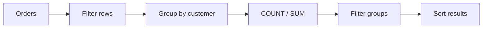
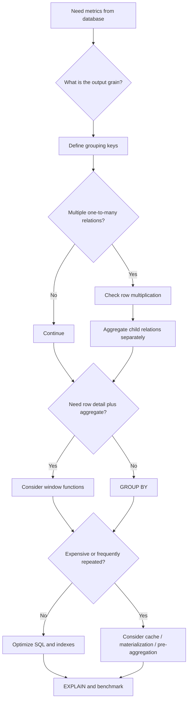

# 07- Aggregation Queries

## Overview

Aggregation queries transform multiple rows into calculated values such as:

- Counts
- Sums
- Averages
- Minimums and maximums
- Group-level metrics
- Percentages
- Revenue totals
- Inventory summaries
- Customer statistics

In an e-commerce system, aggregation is central to reporting and operational APIs:

```text
Orders
  ↓
Revenue
  ↓
Daily / monthly totals

Order Items
  ↓
Product sales
  ↓
Best-selling products

Inventory
  ↓
Available stock
  ↓
Low-stock products

Customers + Orders
  ↓
Customer lifetime value
  ↓
Customer segmentation
```

The basic syntax is easy. The production challenge is ensuring that the aggregation is performed at the correct **grain**, over the correct rows, without accidental duplication or incorrect business semantics.

---

## Aggregation Mental Model

A typical aggregation query follows this logical pattern:

```text
Source rows
    ↓
WHERE
    ↓
GROUP BY
    ↓
Aggregate functions
    ↓
HAVING
    ↓
ORDER BY
```

For example:

```sql
SELECT
    customer_id,
    COUNT(*) AS order_count,
    SUM(grand_total) AS total_value
FROM orders
WHERE status <> 'cancelled'
GROUP BY customer_id
HAVING COUNT(*) >= 2
ORDER BY total_value DESC;
```

Conceptually:



The SQL optimizer may physically execute operations in a different order, but understanding the logical processing order is essential for reasoning about query correctness.

---

## Aggregate Functions

PostgreSQL provides common aggregate functions such as:

| Function | Purpose | Example |
|---|---|---|
| `COUNT` | Count rows/values | `COUNT(*)` |
| `SUM` | Total numeric value | `SUM(grand_total)` |
| `AVG` | Average numeric value | `AVG(grand_total)` |
| `MIN` | Smallest value | `MIN(grand_total)` |
| `MAX` | Largest value | `MAX(grand_total)` |
| `STRING_AGG` | Concatenate strings | `STRING_AGG(sku, ', ')` |
| `ARRAY_AGG` | Build an array | `ARRAY_AGG(id)` |
| `BOOL_AND` | All values true | `BOOL_AND(is_active)` |
| `BOOL_OR` | Any value true | `BOOL_OR(is_active)` |

The correct aggregate depends on the business question.

---

## COUNT

### COUNT(*)

`COUNT(*)` counts rows.

```sql
SELECT COUNT(*) AS order_count
FROM orders;
```

It counts rows regardless of whether individual columns contain `NULL`.

### COUNT(column)

```sql
SELECT COUNT(shipped_at) AS shipped_order_count
FROM orders;
```

`COUNT(column)` counts only rows where that column is not `NULL`.

Therefore:

```text
COUNT(*)
→ counts rows

COUNT(column)
→ counts non-NULL column values
```

This distinction is important when working with optional relationships.

---

## COUNT with Conditions

PostgreSQL supports the `FILTER` clause:

```sql
SELECT
    COUNT(*) AS total_orders,
    COUNT(*) FILTER (
        WHERE status = 'delivered'
    ) AS delivered_orders,
    COUNT(*) FILTER (
        WHERE status = 'cancelled'
    ) AS cancelled_orders
FROM orders;
```

This is often cleaner than repeating conditional expressions.

An alternative is:

```sql
SELECT
    COUNT(*) AS total_orders,
    SUM(CASE WHEN status = 'delivered' THEN 1 ELSE 0 END)
        AS delivered_orders
FROM orders;
```

Both can be valid. `FILTER` communicates aggregate-specific filtering particularly clearly in PostgreSQL.

---

## SUM

Calculate total order value:

```sql
SELECT
    SUM(grand_total) AS total_revenue
FROM orders
WHERE status = 'delivered';
```

A critical detail is that `SUM` can return `NULL` when there are no input rows.

For an API that requires numeric zero:

```sql
SELECT
    COALESCE(SUM(grand_total), 0) AS total_revenue
FROM orders
WHERE status = 'delivered';
```

The application should distinguish between:

```text
NULL → no qualifying aggregate value
0    → explicit numeric zero
```

and normalize the result according to the API contract.

---

## AVG

Calculate average delivered order value:

```sql
SELECT
    AVG(grand_total) AS average_order_value
FROM orders
WHERE status = 'delivered';
```

`AVG` is calculated over non-NULL values.

For financial reporting, avoid blindly using floating-point application types for monetary values. PostgreSQL `numeric` is generally appropriate for exact monetary calculations when the schema uses it consistently.

---

## MIN and MAX

Find the highest and lowest order values:

```sql
SELECT
    MIN(grand_total) AS minimum_order_value,
    MAX(grand_total) AS maximum_order_value
FROM orders
WHERE status = 'delivered';
```

These aggregates can also be used for operational metrics:

```sql
SELECT
    MIN(created_at) AS first_order_at,
    MAX(created_at) AS latest_order_at
FROM orders;
```

---

## GROUP BY

`GROUP BY` changes the result grain.

Example:

```sql
SELECT
    customer_id,
    COUNT(*) AS order_count
FROM orders
GROUP BY customer_id;
```

The result is:

```text
one row per customer_id
```

Without `GROUP BY`:

```sql
SELECT COUNT(*)
FROM orders;
```

the result is:

```text
one row for the entire input
```

This distinction should always be explicit in your reasoning.

---

## GROUP BY Multiple Columns

Group orders by customer and status:

```sql
SELECT
    customer_id,
    status,
    COUNT(*) AS order_count
FROM orders
GROUP BY
    customer_id,
    status
ORDER BY
    customer_id,
    status;
```

The grain becomes:

```text
one row per customer + status combination
```

Adding columns to `GROUP BY` increases the granularity of the result.

---

## GROUP BY and Selected Columns

In a grouped query, non-aggregated selected columns generally need to be grouping expressions or otherwise be functionally dependent in ways PostgreSQL can establish.

Valid:

```sql
SELECT
    customer_id,
    COUNT(*) AS order_count
FROM orders
GROUP BY customer_id;
```

Invalid:

```sql
SELECT
    customer_id,
    status,
    COUNT(*)
FROM orders
GROUP BY customer_id;
```

because `status` is neither aggregated nor grouped.

Correct:

```sql
SELECT
    customer_id,
    status,
    COUNT(*) AS order_count
FROM orders
GROUP BY
    customer_id,
    status;
```

Do not solve grouping errors by blindly adding every selected column to `GROUP BY`. Doing so can change the result grain and business meaning.

---

## Aggregation by Product

Calculate units sold per SKU:

```sql
SELECT
    sku_snapshot AS sku,
    SUM(quantity) AS units_sold,
    SUM(line_total) AS sales_value
FROM order_items AS oi
JOIN orders AS o
    ON o.id = oi.order_id
WHERE o.status = 'delivered'
GROUP BY sku_snapshot
ORDER BY units_sold DESC;
```

The result grain is:

```text
one row per SKU
```

The order filter is applied before aggregation.

---

## Aggregation by Product Variant

If the current product variant is needed:

```sql
SELECT
    pv.id AS variant_id,
    pv.sku,
    SUM(oi.quantity) AS units_sold,
    SUM(oi.line_total) AS sales_value
FROM order_items AS oi
JOIN orders AS o
    ON o.id = oi.order_id
JOIN product_variants AS pv
    ON pv.sku = oi.sku_snapshot
WHERE o.status = 'delivered'
GROUP BY
    pv.id,
    pv.sku
ORDER BY sales_value DESC;
```

For historical reporting, however, joining current catalog data must be considered carefully. `order_items` stores snapshots specifically so historical order information does not depend entirely on mutable catalog records.

---

## Aggregation by Customer

Calculate customer order metrics:

```sql
SELECT
    c.id AS customer_id,
    c.full_name,
    COUNT(o.id) AS order_count,
    COALESCE(SUM(o.grand_total), 0) AS lifetime_value
FROM customers AS c
LEFT JOIN orders AS o
    ON o.customer_id = c.id
   AND o.status <> 'cancelled'
GROUP BY
    c.id,
    c.full_name
ORDER BY lifetime_value DESC;
```

The `LEFT JOIN` ensures customers without qualifying orders remain in the result.

Without it, customers with no orders would disappear.

---

## Aggregation by Order Status

```sql
SELECT
    status,
    COUNT(*) AS order_count
FROM orders
GROUP BY status
ORDER BY order_count DESC;
```

This is useful for operational dashboards.

For example:

```text
pending
confirmed
processing
shipped
delivered
cancelled
```

can be monitored over time.

However, a current status count is not the same as a historical status-transition count. For lifecycle reporting, `order_status_history` should be queried instead.

---

## Aggregation by Date

Daily order volume:

```sql
SELECT
    DATE(created_at) AS order_date,
    COUNT(*) AS order_count,
    SUM(grand_total) AS order_value
FROM orders
GROUP BY DATE(created_at)
ORDER BY order_date;
```

This is simple and useful for reporting.

For high-volume systems, be aware that applying expressions to timestamp columns can affect index usage for filtering.

A better bounded date filter is:

```sql
SELECT
    DATE(created_at) AS order_date,
    COUNT(*) AS order_count,
    SUM(grand_total) AS order_value
FROM orders
WHERE created_at >= $1
  AND created_at < $2
GROUP BY DATE(created_at)
ORDER BY order_date;
```

The range predicate provides a clearer opportunity for an index on `created_at`.

---

## Time-Based Aggregation

For PostgreSQL reporting, `date_trunc` is useful:

```sql
SELECT
    date_trunc('month', created_at) AS month,
    COUNT(*) AS order_count,
    SUM(grand_total) AS order_value
FROM orders
WHERE created_at >= $1
  AND created_at < $2
GROUP BY date_trunc('month', created_at)
ORDER BY month;
```

Common granularities include:

```text
hour
day
week
month
quarter
year
```

The reporting timezone should be explicitly defined when business reporting depends on local calendar boundaries.

---

## WHERE Before Aggregation

Use `WHERE` to filter source rows before grouping.

Example:

```sql
SELECT
    customer_id,
    SUM(grand_total) AS revenue
FROM orders
WHERE status = 'delivered'
GROUP BY customer_id;
```

This means:

```text
Only delivered orders
        ↓
Group by customer
        ↓
Calculate revenue
```

This is generally preferable when excluded rows should not participate in the aggregation at all.

---

## HAVING After Aggregation

Use `HAVING` to filter groups.

Example:

```sql
SELECT
    customer_id,
    COUNT(*) AS order_count
FROM orders
GROUP BY customer_id
HAVING COUNT(*) >= 5;
```

This means:

```text
All orders
    ↓
Group by customer
    ↓
Count orders
    ↓
Keep customers with at least 5
```

Do not replace:

```sql
HAVING COUNT(*) >= 5
```

with:

```sql
WHERE COUNT(*) >= 5
```

because aggregate results are not available to `WHERE`.

---

## WHERE and HAVING Together

```sql
SELECT
    customer_id,
    COUNT(*) AS delivered_orders,
    SUM(grand_total) AS delivered_value
FROM orders
WHERE status = 'delivered'
GROUP BY customer_id
HAVING SUM(grand_total) >= 100000
ORDER BY delivered_value DESC;
```

The semantics are:

```text
WHERE
→ select delivered orders

GROUP BY
→ create customer groups

SUM / COUNT
→ calculate metrics

HAVING
→ retain high-value customers
```

Filtering early can substantially reduce the amount of data that must be grouped.

---

## Conditional Aggregation

Conditional aggregation is useful when several metrics are required in one result.

```sql
SELECT
    COUNT(*) AS total_orders,
    COUNT(*) FILTER (
        WHERE status = 'delivered'
    ) AS delivered_orders,
    COUNT(*) FILTER (
        WHERE status = 'cancelled'
    ) AS cancelled_orders,
    COALESCE(
        SUM(grand_total) FILTER (
            WHERE status = 'delivered'
        ),
        0
    ) AS delivered_value
FROM orders;
```

This can be significantly more efficient than issuing separate queries for every metric, although the actual performance depends on the workload and execution plan.

---

## Aggregating Boolean Conditions

PostgreSQL's `FILTER` makes operational metrics concise:

```sql
SELECT
    COUNT(*) FILTER (
        WHERE available_quantity = 0
    ) AS out_of_stock,
    COUNT(*) FILTER (
        WHERE available_quantity > 0
    ) AS in_stock,
    COUNT(*) AS total_variants
FROM inventory;
```

This can support inventory dashboards and monitoring endpoints.

---

## DISTINCT Aggregation

`DISTINCT` can be used inside aggregates.

Count unique customers:

```sql
SELECT
    COUNT(DISTINCT customer_id) AS unique_customers
FROM orders
WHERE status = 'delivered';
```

Count unique SKUs sold:

```sql
SELECT
    COUNT(DISTINCT sku_snapshot) AS unique_skus
FROM order_items;
```

Use `DISTINCT` intentionally. It can require additional sorting or hashing and can become expensive on large datasets.

More importantly, it should represent the business requirement rather than hide an incorrect join.

---

## Aggregation After JOINs

Consider:

```sql
SELECT
    c.id,
    COUNT(o.id) AS order_count
FROM customers AS c
LEFT JOIN orders AS o
    ON o.customer_id = c.id
GROUP BY c.id;
```

This is safe because the desired grain is:

```text
one row per customer
```

and `COUNT(o.id)` counts matching order rows.

However, adding another one-to-many join can change the result:

```sql
FROM customers AS c
LEFT JOIN orders AS o
    ON o.customer_id = c.id
LEFT JOIN payments AS p
    ON p.order_id = o.id
```

Now each order can be repeated for every payment.

The aggregate may become incorrect.

---

## Avoiding Multi-Join Double Counting

Suppose the requirement is:

```text
customer
→ total order value
→ total payments
```

Do not blindly aggregate after joining both one-to-many relationships.

Instead:

```sql
WITH order_totals AS (
    SELECT
        customer_id,
        SUM(grand_total) AS order_value
    FROM orders
    GROUP BY customer_id
),
payment_totals AS (
    SELECT
        o.customer_id,
        SUM(p.amount) AS payment_value
    FROM payments AS p
    JOIN orders AS o
        ON o.id = p.order_id
    GROUP BY o.customer_id
)
SELECT
    c.id AS customer_id,
    c.full_name,
    COALESCE(ot.order_value, 0) AS order_value,
    COALESCE(pt.payment_value, 0) AS payment_value
FROM customers AS c
LEFT JOIN order_totals AS ot
    ON ot.customer_id = c.id
LEFT JOIN payment_totals AS pt
    ON pt.customer_id = c.id;
```

Each relation is aggregated at the required customer grain before being combined.

---

## Aggregation and Window Functions

`GROUP BY` and window functions solve different problems.

`GROUP BY` collapses rows:

```sql
SELECT
    customer_id,
    SUM(grand_total) AS total_value
FROM orders
GROUP BY customer_id;
```

A window function preserves row-level detail:

```sql
SELECT
    id,
    customer_id,
    grand_total,
    SUM(grand_total) OVER (
        PARTITION BY customer_id
    ) AS customer_total
FROM orders;
```

The second query returns one row per order while also providing the customer's aggregate.

Use:

```text
GROUP BY
→ when you want fewer rows

Window function
→ when you want original rows plus aggregate context
```

---

## Running Totals

A running revenue total can be calculated using a window function:

```sql
SELECT
    created_at,
    id,
    grand_total,
    SUM(grand_total) OVER (
        ORDER BY created_at, id
        ROWS BETWEEN UNBOUNDED PRECEDING AND CURRENT ROW
    ) AS running_revenue
FROM orders
WHERE status = 'delivered'
ORDER BY created_at, id;
```

The ordering must be deterministic.

Using only `created_at` can be ambiguous when multiple rows share the same timestamp. Adding `id` provides a tie-breaker.

---

## Aggregation with GROUP BY and Window Functions

You can aggregate first and then apply a window function:

```sql
WITH customer_sales AS (
    SELECT
        customer_id,
        SUM(grand_total) AS sales
    FROM orders
    WHERE status = 'delivered'
    GROUP BY customer_id
)
SELECT
    customer_id,
    sales,
    SUM(sales) OVER () AS total_sales,
    sales / NULLIF(SUM(sales) OVER (), 0) AS sales_share
FROM customer_sales
ORDER BY sales DESC;
```

This produces:

```text
customer
sales
total sales
percentage of total
```

The separation makes the grain clear.

---

## Top Customers

```sql
SELECT
    customer_id,
    COUNT(*) AS order_count,
    SUM(grand_total) AS lifetime_value
FROM orders
WHERE status = 'delivered'
GROUP BY customer_id
ORDER BY lifetime_value DESC
LIMIT 10;
```

This is appropriate when the requirement is simply:

```text
Top 10 customers overall
```

For top customers per region, category, or other group, window functions such as `ROW_NUMBER()` or `RANK()` are usually more appropriate.

---

## Aggregating Inventory

Calculate inventory totals:

```sql
SELECT
    COUNT(*) AS variant_count,
    SUM(available_quantity) AS available_units,
    SUM(reserved_quantity) AS reserved_units
FROM inventory;
```

Low-stock report:

```sql
SELECT
    pv.sku,
    i.available_quantity,
    i.reserved_quantity
FROM inventory AS i
JOIN product_variants AS pv
    ON pv.id = i.variant_id
WHERE i.available_quantity <= 5
ORDER BY i.available_quantity ASC, pv.id;
```

Aggregation and non-aggregated operational queries often complement each other in inventory systems.

---

## Aggregating by Category

Calculate sales by category:

```sql
SELECT
    c.id AS category_id,
    c.name,
    SUM(oi.quantity) AS units_sold,
    SUM(oi.line_total) AS sales_value
FROM order_items AS oi
JOIN orders AS o
    ON o.id = oi.order_id
JOIN product_variants AS pv
    ON pv.sku = oi.sku_snapshot
JOIN products AS p
    ON p.id = pv.product_id
JOIN product_categories AS pc
    ON pc.product_id = p.id
JOIN categories AS c
    ON c.id = pc.category_id
WHERE o.status = 'delivered'
GROUP BY
    c.id,
    c.name
ORDER BY sales_value DESC;
```

This query demonstrates why result grain must be understood at every join.

If products can belong to multiple categories, the same sale can contribute to multiple category totals.

That may be correct for category attribution, or it may be double counting from the business perspective.

The schema's relationship semantics must determine the intended metric.

---

## Aggregating Historical Status

For lifecycle analysis, query the history table rather than the current order status:

```sql
SELECT
    status,
    COUNT(*) AS transition_count
FROM order_status_history
GROUP BY status
ORDER BY transition_count DESC;
```

To calculate transitions by day:

```sql
SELECT
    DATE(created_at) AS transition_date,
    status,
    COUNT(*) AS transition_count
FROM order_status_history
GROUP BY
    DATE(created_at),
    status
ORDER BY
    transition_date,
    status;
```

Current-state reporting and historical-event reporting are different workloads.

---

## Aggregation and NULL

Consider:

```sql
SELECT
    COUNT(*) AS row_count,
    COUNT(shipped_at) AS shipped_count,
    SUM(grand_total) AS total_value
FROM orders;
```

Potential semantics:

```text
COUNT(*)        → number of rows
COUNT(shipped_at) → rows with shipped_at
SUM(grand_total) → sum of non-NULL grand_total values
```

If there are no input rows:

```text
COUNT(*) → 0
COUNT(column) → 0
SUM(...) → NULL
AVG(...) → NULL
MIN(...) → NULL
MAX(...) → NULL
```

Normalize aggregates with `COALESCE` only when the API or business semantics require it.

---

## Numeric Precision

For financial calculations, use appropriate PostgreSQL numeric types.

For example:

```sql
SUM(grand_total)
```

is preferable when `grand_total` uses `numeric`.

Avoid converting financial values through binary floating-point representations unnecessarily.

A backend should maintain consistent rules across:

```text
database
→ Python
→ serialization
→ API
→ reporting
```

Rounding should also have an explicit business rule.

---

## Aggregation and Currency

An e-commerce system may support multiple currencies.

This query is potentially meaningless:

```sql
SELECT
    SUM(grand_total)
FROM orders;
```

if `grand_total` contains:

```text
INR
USD
EUR
```

Instead:

```sql
SELECT
    currency_code,
    SUM(grand_total) AS total_value
FROM orders
WHERE status = 'delivered'
GROUP BY currency_code;
```

Never aggregate monetary amounts across currencies unless they have been converted using a defined exchange-rate policy.

---

## Aggregation Performance

Aggregation can become expensive when PostgreSQL must process millions of rows.

Potential costs include:

```text
Sequential scan
    ↓
Filtering
    ↓
Sort or hash aggregation
    ↓
Final result
```

Inspect important reports with:

```sql
EXPLAIN (ANALYZE, BUFFERS)
SELECT
    customer_id,
    SUM(grand_total)
FROM orders
WHERE status = 'delivered'
GROUP BY customer_id;
```

Pay attention to:

- Actual row counts.
- Estimated row counts.
- Hash vs sort aggregation.
- Memory usage.
- Temporary file activity.
- Buffer reads.
- Execution time.

---

## Hash Aggregation vs Group Aggregation

PostgreSQL can use different aggregation strategies.

Conceptually:

```text
Hash Aggregate
→ build groups using a hash structure

GroupAggregate
→ consume appropriately ordered input
```

Hash aggregation can require significant memory.

Large aggregations may spill to disk when memory is insufficient.

Increasing `work_mem` can help specific workloads but should not be treated as a universal fix because memory settings can multiply across concurrent operations.

---

## Indexes and Aggregation

Indexes can help reduce the input rows before aggregation.

For:

```sql
SELECT
    customer_id,
    SUM(grand_total)
FROM orders
WHERE status = 'delivered'
GROUP BY customer_id;
```

a partial index may be useful in some workloads:

```sql
CREATE INDEX orders_delivered_customer_idx
ON orders (customer_id)
WHERE status = 'delivered';
```

Whether this improves the query depends on:

- Percentage of delivered orders.
- Table size.
- Query frequency.
- Data distribution.
- Planner estimates.
- Alternative indexes.

Do not create aggregation indexes without measuring the workload.

---

## Pre-Aggregation

Frequently requested metrics may justify pre-aggregation.

For example:

```text
Raw orders
    ↓
Daily aggregation job
    ↓
daily_sales table
    ↓
Dashboard/API
```

A pre-aggregated table might contain:

```text
sales_date
currency_code
order_count
sales_value
units_sold
```

This trades:

```text
fresh computation
```

for:

```text
maintained derived state
```

The design is useful when reporting queries are frequent and raw-table aggregation is expensive.

---

## Materialized Views

A materialized view can store an aggregate result:

```sql
CREATE MATERIALIZED VIEW daily_sales AS
SELECT
    DATE(created_at) AS sales_date,
    currency_code,
    COUNT(*) AS order_count,
    SUM(grand_total) AS sales_value
FROM orders
WHERE status = 'delivered'
GROUP BY
    DATE(created_at),
    currency_code;
```

Refresh:

```sql
REFRESH MATERIALIZED VIEW daily_sales;
```

For concurrent refreshes, PostgreSQL requires the appropriate unique index and other conditions.

Materialized views are useful when:

- The aggregation is expensive.
- Results can be slightly stale.
- Queries are frequent.
- Refresh cost is acceptable.

They are not a replacement for transactionally correct source data.

---

## Aggregation in Django

Django provides aggregation APIs:

```python
from django.db.models import Count, Sum

customer_metrics = (
    Order.objects
    .filter(status="delivered")
    .values("customer_id")
    .annotate(
        order_count=Count("id"),
        lifetime_value=Sum("grand_total"),
    )
    .order_by("-lifetime_value")
)
```

This generally generates SQL using:

```text
GROUP BY
COUNT
SUM
ORDER BY
```

For performance-sensitive code, inspect the generated SQL and execution plan rather than assuming ORM aggregation is optimal.

---

## Aggregation in FastAPI

A reporting endpoint might execute a bounded aggregate query:

```python
from psycopg import Connection


def get_order_metrics(connection: Connection) -> dict:
    with connection.cursor() as cursor:
        cursor.execute(
            """
            SELECT
                COUNT(*) AS total_orders,
                COUNT(*) FILTER (
                    WHERE status = 'delivered'
                ) AS delivered_orders,
                COALESCE(
                    SUM(grand_total) FILTER (
                        WHERE status = 'delivered'
                    ),
                    0
                ) AS delivered_value
            FROM orders
            """
        )

        total_orders, delivered_orders, delivered_value = cursor.fetchone()

    return {
        "total_orders": total_orders,
        "delivered_orders": delivered_orders,
        "delivered_value": delivered_value,
    }
```

For dashboards, consider caching expensive metrics in Redis when the freshness requirement permits it.

---

## Aggregation with Redis

Redis can reduce repeated database computation:

```text
PostgreSQL
    ↓
Aggregation job
    ↓
Redis
    ↓
Dashboard API
```

Example cached value:

```text
sales:daily:2026-09-05:INR
```

However, Redis should not become the authoritative financial source merely because aggregation is expensive.

The source of truth remains the transactional database unless the architecture explicitly defines otherwise.

---

## Aggregation with Celery

Expensive reporting can be moved out of synchronous API requests:

```text
User
 ↓
POST /reports
 ↓
FastAPI / Django
 ↓
Celery
 ↓
PostgreSQL aggregation
 ↓
Store report
 ↓
Notify user
```

This prevents a large aggregation from consuming API worker capacity.

For very large datasets, consider dedicated analytical infrastructure rather than continuously running OLAP-style workloads against an OLTP database.

---

## Aggregation and Kafka

Kafka events can support incremental metrics:

```text
Order Service
     ↓
Transactional Outbox
     ↓
Kafka
     ↓
Analytics Consumer
     ↓
Aggregated Read Model
```

This can reduce repeated full-table scans.

The trade-off is increased complexity:

- Event ordering.
- Duplicate events.
- Consumer retries.
- Late events.
- Reprocessing.
- Reconciliation.
- Event schema evolution.

Incremental aggregation should be introduced because of a real scalability requirement, not merely because Kafka is available.

---

## Security Considerations

Aggregation can still leak sensitive information.

For example:

```sql
SELECT
    customer_id,
    SUM(grand_total)
FROM orders
GROUP BY customer_id;
```

may expose financial information about individual customers.

Authorization must apply to the aggregate's source rows.

For customer-scoped reporting:

```sql
SELECT
    COUNT(*) AS order_count,
    COALESCE(SUM(grand_total), 0) AS total_value
FROM orders
WHERE customer_id = $1
  AND status <> 'cancelled';
```

For multi-tenant systems:

```sql
WHERE tenant_id = $1
```

should normally be part of the data-access boundary.

RLS can provide an additional database-enforced isolation layer when designed correctly.

---

## Scalability Considerations

As order volume grows:

```text
10K rows
→ direct aggregation is trivial

10M rows
→ indexes and query plans matter

1B rows
→ partitioning, pre-aggregation, replicas,
   materialized views, or analytical systems may be required
```

The correct architecture depends on:

- Query frequency.
- Freshness requirements.
- Data volume.
- Cardinality.
- Concurrency.
- Reporting complexity.
- Cost constraints.

Do not optimize for hypothetical scale before measuring the actual workload.

---

## Reliability and Failure Handling

Aggregation APIs should have explicit behavior when the database is unavailable.

Avoid making critical transactional workflows depend synchronously on expensive reporting queries.

Separate:

```text
transactional path
```

from:

```text
analytics/reporting path
```

when possible.

For background aggregation:

- Make jobs retryable.
- Make updates idempotent.
- Track processing windows.
- Handle late-arriving data.
- Reconcile derived metrics against source data.
- Avoid holding long transactions unnecessarily.

---

## High Availability and Disaster Recovery

Aggregation systems should preserve the distinction between:

```text
source-of-truth transactional data
```

and:

```text
derived reporting data
```

Derived aggregates can often be rebuilt from source tables after a failure.

This simplifies disaster recovery.

For example:

```text
orders
order_items
payments
    ↓
rebuild aggregation
    ↓
daily_sales
```

If a materialized view or reporting table is lost, the recovery process should ideally have a documented rebuild strategy.

Backups must protect the source-of-truth data even when derived data is considered disposable.

---

## Common Aggregation Mistakes

### Aggregating After Row Multiplication

Joining:

```text
orders
+
order_items
+
payments
```

and then summing both children can produce incorrect totals.

Aggregate independent one-to-many relationships separately.

---

### Using COUNT(*) After LEFT JOIN

Consider:

```sql
SELECT
    c.id,
    COUNT(*) AS order_count
FROM customers AS c
LEFT JOIN orders AS o
    ON o.customer_id = c.id
GROUP BY c.id;
```

A customer with no orders can still produce one NULL-extended joined row, causing `COUNT(*)` to return `1`.

Use:

```sql
COUNT(o.id)
```

when counting matching orders.

---

### Using DISTINCT as a Repair Mechanism

This:

```sql
SUM(DISTINCT grand_total)
```

is not a general solution to join multiplication.

Two legitimate orders can have the same total.

The correct solution is to fix the query grain and relationship structure.

---

### Mixing Currencies

Never calculate:

```sql
SUM(grand_total)
```

across multiple currencies unless an explicit conversion policy exists.

Group by currency or convert first.

---

### Filtering Aggregates with WHERE

Invalid:

```sql
WHERE SUM(grand_total) > 100000
```

Use:

```sql
HAVING SUM(grand_total) > 100000
```

when filtering groups.

---

### Grouping by Too Many Columns

Adding unnecessary columns:

```sql
GROUP BY
    customer_id,
    order_id,
    order_item_id
```

can destroy the intended customer-level aggregation.

Always define the desired grain first.

---

### Treating Current State as History

Counting:

```sql
orders.status
```

answers:

```text
How many orders are currently in each state?
```

It does not answer:

```text
How many orders transitioned into each state over time?
```

Use `order_status_history` for lifecycle history.

---

## Production Review Checklist

Before deploying an aggregation query, verify:

### Correctness

- What is the source grain?
- What is the output grain?
- Are one-to-many joins multiplying rows?
- Are NULL values handled correctly?
- Are financial values aggregated with appropriate precision?
- Are currencies separated?
- Are business statuses interpreted correctly?

### Performance

- Is filtering performed before aggregation where appropriate?
- Is the query scanning an unnecessarily large dataset?
- Are indexes helping reduce input?
- Is aggregation spilling to temporary storage?
- Are estimated and actual row counts reasonable?
- Has `EXPLAIN (ANALYZE, BUFFERS)` been reviewed?

### Security

- Is customer/tenant scope enforced?
- Could the aggregate expose sensitive information?
- Does RLS apply appropriately?
- Are parameters bound rather than interpolated?

### Reliability

- Can the query run safely under concurrency?
- Is the API request bounded by an appropriate timeout?
- Should the work run asynchronously?
- Can the aggregate be rebuilt?
- Is derived data distinguishable from source-of-truth data?

---

## Senior Aggregation Decision Framework

Use this reasoning sequence:



A senior engineer should be able to answer:

```text
What rows are included?
What is the input grain?
What is the output grain?
Can joins multiply rows?
What does NULL mean?
What business states count?
Can the metric be rebuilt?
How often is it queried?
How fresh must it be?
```

---

## Interview Traps

### What is the difference between WHERE and HAVING?

`WHERE` filters source rows before grouping.

`HAVING` filters groups after aggregation.

---

### Why can COUNT(*) be wrong with LEFT JOIN?

Because a `LEFT JOIN` creates a NULL-extended row for an unmatched left-side record.

Use:

```sql
COUNT(right_table.id)
```

when the goal is to count matching right-side rows.

---

### Why can SUM become incorrect after multiple JOINs?

Independent one-to-many relationships can multiply each other's rows.

For example:

```text
3 order items × 2 payments = 6 joined rows
```

Aggregating both relations over those six rows can inflate both totals.

---

### Is GROUP BY the only way to aggregate?

No.

Window functions provide aggregate context while preserving row-level detail.

---

### Is DISTINCT a safe way to fix duplicate aggregate results?

No.

`DISTINCT` may remove legitimate equal values and does not necessarily correct the underlying relationship problem.

---

### Should every aggregate query be cached?

No.

Caching adds consistency and invalidation complexity.

First optimize the query and measure its workload. Cache or pre-aggregate when repeated computation justifies the additional architecture.

---

## Key Takeaways

- **Define the input and output grain before writing an aggregation query; incorrect grain is the primary source of incorrect metrics.**
- **Use `WHERE` to reduce source rows, `GROUP BY` to establish aggregate grain, and `HAVING` to filter groups after aggregation.**
- **Be especially careful with one-to-many JOINs because row multiplication can silently corrupt `COUNT`, `SUM`, and other metrics.**
- **For frequently executed or expensive aggregations, consider appropriate indexes, pre-aggregation, materialized views, Redis, Celery, or analytical infrastructure based on measured workload and freshness requirements.**
- **Treat financial precision, currency, NULL semantics, authorization, tenant isolation, and rebuildability as part of aggregation correctness—not as secondary concerns.**