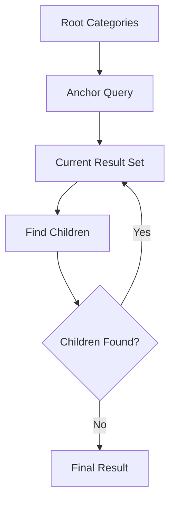
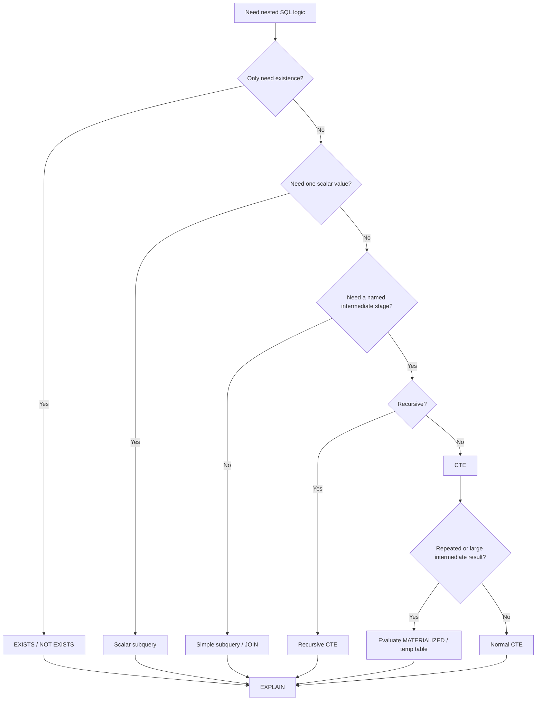

# 08- Subqueries and CTEs

## Overview

Subqueries and Common Table Expressions (CTEs) allow SQL queries to be composed from smaller logical operations.

They are useful when a query needs to:

- Filter using the result of another query.
- Check whether related data exists.
- Calculate an intermediate result.
- Aggregate data before joining it.
- Rank or filter rows in multiple stages.
- Build recursive relationships.
- Perform complex data transformations while keeping the SQL readable.

In the e-commerce database, common examples include:

```text
Find customers whose order value exceeds a threshold
Find products with above-average prices
Find orders containing a particular SKU
Aggregate payments before joining them to orders
Find the latest status for each order
Traverse category hierarchies
```

The important production distinction is that **subqueries and CTEs are query-composition mechanisms, not automatically performance optimizations**.

PostgreSQL's optimizer may transform equivalent queries into similar execution plans. The correct choice should therefore begin with semantics and maintainability, followed by measurement with `EXPLAIN`.

---

## Subquery Mental Model

A subquery is a query nested inside another SQL statement.

Example:

```sql
SELECT
    id,
    full_name,
    email
FROM customers
WHERE id IN (
    SELECT customer_id
    FROM orders
    WHERE status = 'delivered'
);
```

Conceptually:

```text
Inner query
    ↓
customer IDs with delivered orders
    ↓
Outer query
    ↓
customers matching those IDs
```

The inner query can return:

- One value.
- One column with multiple values.
- One row.
- Multiple rows and columns.

The outer query must use the result according to its shape.

---

## Types of Subqueries

| Type | Result shape | Common use |
|---|---|---|
| Scalar subquery | One value | Compare against calculated value |
| Single-row subquery | One row | Fetch one related result |
| Multi-row subquery | Multiple rows | `IN`, `ANY`, `ALL` |
| Correlated subquery | Depends on outer row | Per-row existence/calculation |
| Derived table | Relation in `FROM` | Intermediate result |
| `EXISTS` subquery | Boolean existence | Relationship checks |

The distinction is primarily about how the inner query relates to the outer query and what result shape it produces.

---

## Scalar Subqueries

A scalar subquery returns a single value.

Example:

```sql
SELECT
    id,
    name,
    base_price
FROM products
WHERE base_price > (
    SELECT AVG(base_price)
    FROM products
);
```

The inner query returns:

```text
average product price
```

The outer query compares each product against that value.

This is useful for queries such as:

```text
Products above average price
Orders above average order value
Customers above average lifetime value
```

A scalar subquery must produce at most one row. If it produces multiple rows, PostgreSQL raises an error.

---

## Scalar Subquery with Aggregation

Aggregation naturally produces scalar results.

```sql
SELECT
    COUNT(*) AS total_orders
FROM orders;
```

It can be embedded:

```sql
SELECT
    id,
    status,
    grand_total
FROM orders
WHERE grand_total > (
    SELECT AVG(grand_total)
    FROM orders
);
```

This is readable because the inner query represents a single business metric.

---

## IN Subqueries

`IN` checks whether a value belongs to a set returned by another query.

```sql
SELECT
    id,
    full_name
FROM customers
WHERE id IN (
    SELECT customer_id
    FROM orders
    WHERE status = 'delivered'
);
```

This means:

```text
Find customer IDs associated with delivered orders
        ↓
Return those customers
```

If the actual requirement is only existence, `EXISTS` may express the intent more directly.

---

## EXISTS Subqueries

`EXISTS` answers:

```text
Does at least one matching row exist?
```

Example:

```sql
SELECT
    c.id,
    c.full_name,
    c.email
FROM customers AS c
WHERE EXISTS (
    SELECT 1
    FROM orders AS o
    WHERE o.customer_id = c.id
      AND o.status = 'delivered'
);
```

The inner query is logically evaluated for the outer customer.

PostgreSQL can optimize this into a semi-join rather than literally executing a complete independent query for every customer.

Therefore, do not assume correlated syntax automatically means poor performance.

---

## NOT EXISTS

Find customers who have never placed a delivered order:

```sql
SELECT
    c.id,
    c.full_name,
    c.email
FROM customers AS c
WHERE NOT EXISTS (
    SELECT 1
    FROM orders AS o
    WHERE o.customer_id = c.id
      AND o.status = 'delivered'
);
```

`NOT EXISTS` is generally preferable to `NOT IN` when NULL semantics could otherwise produce unexpected results.

---

## Correlated Subqueries

A correlated subquery references a column from the outer query.

Example:

```sql
SELECT
    c.id,
    c.full_name
FROM customers AS c
WHERE (
    SELECT COUNT(*)
    FROM orders AS o
    WHERE o.customer_id = c.id
) >= 5;
```

The inner query depends on the current customer.

Conceptually:

```text
Customer 1
   ↓
count orders for customer 1

Customer 2
   ↓
count orders for customer 2

Customer 3
   ↓
count orders for customer 3
```

However, the optimizer may transform the operation into a more efficient plan.

Still, correlated aggregates should be evaluated carefully because an equivalent grouped query may be clearer and easier to optimize.

---

## Correlated Subquery vs GROUP BY

Correlated form:

```sql
SELECT
    c.id,
    c.full_name
FROM customers AS c
WHERE (
    SELECT COUNT(*)
    FROM orders AS o
    WHERE o.customer_id = c.id
) >= 5;
```

Grouped form:

```sql
SELECT
    c.id,
    c.full_name
FROM customers AS c
JOIN orders AS o
    ON o.customer_id = c.id
GROUP BY
    c.id,
    c.full_name
HAVING COUNT(*) >= 5;
```

Both can be valid.

The choice depends on:

- Desired result semantics.
- Whether customers without orders should remain candidates.
- Additional relationships.
- Readability.
- Execution plan.

Do not choose based on the assumption that one syntax is universally faster.

---

## Derived Tables

A subquery in the `FROM` clause creates a derived relation.

Example:

```sql
SELECT
    customer_id,
    order_value
FROM (
    SELECT
        customer_id,
        SUM(grand_total) AS order_value
    FROM orders
    WHERE status = 'delivered'
    GROUP BY customer_id
) AS customer_sales
WHERE order_value >= 100000;
```

The inner query creates:

```text
customer_id
order_value
```

The outer query filters those aggregated results.

This can make multi-stage transformations explicit.

---

## CTE

A Common Table Expression is defined using `WITH`.

```sql
WITH customer_sales AS (
    SELECT
        customer_id,
        SUM(grand_total) AS total_value
    FROM orders
    WHERE status = 'delivered'
    GROUP BY customer_id
)
SELECT
    customer_id,
    total_value
FROM customer_sales
WHERE total_value >= 100000;
```

The CTE gives the intermediate query a name:

```text
customer_sales
```

This improves readability when a query contains multiple logical stages.

---

## CTE vs Subquery

Equivalent derived-table query:

```sql
SELECT
    customer_id,
    total_value
FROM (
    SELECT
        customer_id,
        SUM(grand_total) AS total_value
    FROM orders
    WHERE status = 'delivered'
    GROUP BY customer_id
) AS customer_sales
WHERE total_value >= 100000;
```

CTE version:

```sql
WITH customer_sales AS (
    SELECT
        customer_id,
        SUM(grand_total) AS total_value
    FROM orders
    WHERE status = 'delivered'
    GROUP BY customer_id
)
SELECT
    customer_id,
    total_value
FROM customer_sales
WHERE total_value >= 100000;
```

The CTE often communicates the multi-stage structure more clearly.

It should not automatically be treated as a temporary table or guaranteed optimization barrier.

---

## PostgreSQL CTE Materialization

Modern PostgreSQL can inline eligible non-recursive, side-effect-free CTEs into the surrounding query.

Therefore:

```sql
WITH customer_sales AS (
    SELECT ...
)
SELECT ...
FROM customer_sales;
```

does **not** inherently mean:

```text
execute CTE
↓
store complete result
↓
execute outer query
```

PostgreSQL may inline the CTE.

You can influence this behavior:

```sql
WITH customer_sales AS MATERIALIZED (
    SELECT ...
)
SELECT ...
FROM customer_sales;
```

or:

```sql
WITH customer_sales AS NOT MATERIALIZED (
    SELECT ...
)
SELECT ...
FROM customer_sales;
```

Use these explicitly only when there is a demonstrated reason.

---

## MATERIALIZED

`MATERIALIZED` can be useful when the intermediate result should be computed once and reused.

Example:

```sql
WITH customer_sales AS MATERIALIZED (
    SELECT
        customer_id,
        SUM(grand_total) AS total_value
    FROM orders
    GROUP BY customer_id
)
SELECT
    customer_id,
    total_value
FROM customer_sales
WHERE total_value >= 100000;
```

Materialization can reduce repeated computation when a CTE is referenced multiple times.

However, it can also prevent beneficial predicate pushdown and force creation of a larger intermediate result.

Therefore:

```text
MATERIALIZED
→ intentional optimization decision
→ validate with EXPLAIN
```

not:

```text
MATERIALIZED
→ automatically faster
```

---

## NOT MATERIALIZED

`NOT MATERIALIZED` allows PostgreSQL to inline the CTE when possible.

Example:

```sql
WITH active_orders AS NOT MATERIALIZED (
    SELECT
        id,
        customer_id,
        grand_total
    FROM orders
    WHERE status = 'delivered'
)
SELECT
    *
FROM active_orders
WHERE customer_id = $1;
```

Inlining can allow the optimizer to combine predicates and choose a better plan.

Again, the correct behavior depends on the query.

---

## Multiple CTEs

Complex reporting queries can be broken into logical stages.

```sql
WITH delivered_orders AS (
    SELECT
        id,
        customer_id,
        grand_total
    FROM orders
    WHERE status = 'delivered'
),
customer_sales AS (
    SELECT
        customer_id,
        COUNT(*) AS order_count,
        SUM(grand_total) AS total_value
    FROM delivered_orders
    GROUP BY customer_id
)
SELECT
    c.id,
    c.full_name,
    cs.order_count,
    cs.total_value
FROM customers AS c
JOIN customer_sales AS cs
    ON cs.customer_id = c.id
ORDER BY cs.total_value DESC;
```

This is easier to review than a deeply nested query.

The trade-off is that excessive CTE decomposition can hide the actual data flow.

---

## CTE Dependency Chain

A CTE can reference a previous CTE:

```text
orders
   ↓
delivered_orders
   ↓
customer_sales
   ↓
customer_segments
   ↓
final result
```

Example:

```sql
WITH delivered_orders AS (
    SELECT
        customer_id,
        grand_total
    FROM orders
    WHERE status = 'delivered'
),
customer_sales AS (
    SELECT
        customer_id,
        SUM(grand_total) AS total_value
    FROM delivered_orders
    GROUP BY customer_id
),
customer_segments AS (
    SELECT
        customer_id,
        total_value,
        CASE
            WHEN total_value >= 100000 THEN 'premium'
            WHEN total_value >= 25000 THEN 'standard'
            ELSE 'basic'
        END AS segment
    FROM customer_sales
)
SELECT *
FROM customer_segments
ORDER BY total_value DESC;
```

This is a useful pattern for complex reporting logic.

---

## CTE for Aggregation Before JOIN

CTEs are particularly useful for preventing row multiplication.

```sql
WITH payment_totals AS (
    SELECT
        order_id,
        SUM(amount) AS total_paid
    FROM payments
    GROUP BY order_id
)
SELECT
    o.id,
    o.grand_total,
    COALESCE(pt.total_paid, 0) AS total_paid
FROM orders AS o
LEFT JOIN payment_totals AS pt
    ON pt.order_id = o.id;
```

The payment table is reduced to:

```text
one row per order
```

before being joined to `orders`.

This makes the result grain explicit.

---

## CTE for Latest Related Row

A common requirement is:

```text
Get the latest status-history row for every order.
```

One approach uses `ROW_NUMBER()`:

```sql
WITH ranked_statuses AS (
    SELECT
        osh.*,
        ROW_NUMBER() OVER (
            PARTITION BY osh.order_id
            ORDER BY osh.created_at DESC, osh.id DESC
        ) AS row_number
    FROM order_status_history AS osh
)
SELECT
    order_id,
    status,
    created_at
FROM ranked_statuses
WHERE row_number = 1;
```

The CTE isolates the ranking stage from the final filtering stage.

The `id` tie-breaker makes the ordering deterministic when timestamps are equal.

---

## CTE for Top-N per Group

Find the top three products by sales within each category:

```sql
WITH product_sales AS (
    SELECT
        p.id AS product_id,
        p.name,
        c.id AS category_id,
        c.name AS category_name,
        SUM(oi.line_total) AS sales_value
    FROM order_items AS oi
    JOIN orders AS o
        ON o.id = oi.order_id
    JOIN product_variants AS pv
        ON pv.sku = oi.sku_snapshot
    JOIN products AS p
        ON p.id = pv.product_id
    JOIN product_categories AS pc
        ON pc.product_id = p.id
    JOIN categories AS c
        ON c.id = pc.category_id
    WHERE o.status = 'delivered'
    GROUP BY
        p.id,
        p.name,
        c.id,
        c.name
),
ranked_products AS (
    SELECT
        product_sales.*,
        ROW_NUMBER() OVER (
            PARTITION BY category_id
            ORDER BY sales_value DESC, product_id
        ) AS row_number
    FROM product_sales
)
SELECT
    category_id,
    category_name,
    product_id,
    name,
    sales_value
FROM ranked_products
WHERE row_number <= 3
ORDER BY
    category_id,
    row_number;
```

The stages are:

```text
Raw transactions
    ↓
Product/category sales
    ↓
Rank within category
    ↓
Keep top three
```

---

## Recursive CTEs

Recursive CTEs are useful for hierarchical data.

Suppose categories have:

```text
Electronics
  ├── Cameras
  │     └── Mirrorless
  └── Audio
```

A recursive query can traverse the hierarchy.

```sql
WITH RECURSIVE category_tree AS (
    SELECT
        id,
        name,
        parent_id,
        0 AS depth
    FROM categories
    WHERE parent_id IS NULL

    UNION ALL

    SELECT
        c.id,
        c.name,
        c.parent_id,
        ct.depth + 1
    FROM categories AS c
    JOIN category_tree AS ct
        ON c.parent_id = ct.id
)
SELECT
    id,
    name,
    parent_id,
    depth
FROM category_tree
ORDER BY depth, id;
```

The recursive structure consists of:

```text
Anchor query
    ↓
Recursive query
    ↓
More rows
    ↓
Repeat until no new rows
```

Recursive CTEs should have a well-defined termination condition.

---

## Recursive CTE Data Flow



Recursive queries should be tested against:

- Deep hierarchies.
- Missing parents.
- Cyclic data.
- Unexpected branching.
- Large trees.

A recursive CTE does not automatically protect against bad hierarchical data.

---

## Data-Modifying CTEs

PostgreSQL supports data-modifying statements inside `WITH`.

For example:

```sql
WITH deleted_items AS (
    DELETE FROM cart_items
    WHERE cart_id = $1
    RETURNING id
)
SELECT COUNT(*) AS deleted_count
FROM deleted_items;
```

The `DELETE` performs the mutation, while the outer query consumes its returned rows.

This can be useful for atomic workflows that need to combine data modification and result processing.

Use data-modifying CTEs carefully because they can make transaction behavior harder to understand.

---

## CTEs and Transactions

A CTE is part of the SQL statement.

It is not a transaction by itself.

For example:

```sql
WITH ...
UPDATE ...
RETURNING ...;
```

is still one SQL statement.

For multiple independent statements:

```text
INSERT
UPDATE
INSERT
```

use an explicit transaction when atomicity is required:

```sql
BEGIN;

INSERT ...;

UPDATE ...;

INSERT ...;

COMMIT;
```

Do not confuse:

```text
CTE
```

with:

```text
transaction
```

or:

```text
temporary table
```

They solve different problems.

---

## CTE vs Temporary Table

| Feature | CTE | Temporary Table |
|---|---|---|
| Scope | Single statement | Database session |
| Persistent object | No | No |
| Can index intermediate data | No | Yes |
| Statistics | Uses query planning | Can `ANALYZE` |
| Reusable across statements | No | Yes |
| Explicit materialization | PostgreSQL supports it | Naturally stored |
| Best for | Query composition | Multi-step intermediate data |
| Connection pooling sensitivity | Low | High |

A temporary table is useful when a large intermediate dataset must be reused across multiple statements or requires its own indexes/statistics.

A CTE is usually better for query-local composition.

---

## CTE vs View

| Feature | CTE | View |
|---|---|---|
| Scope | One statement | Persistent database object |
| Reuse | Within statement | Across queries |
| Definition stored | No | Yes |
| Permissions | Inherits surrounding query context | Can be granted independently |
| Good for | Query composition | Reusable query interface |

If multiple services or queries need the same stable SQL abstraction, a view may be more appropriate.

If the logic exists only for one query, a CTE is usually more natural.

---

## CTE vs Subquery vs Temporary Table

A useful decision matrix:

| Requirement | Prefer |
|---|---|
| Simple nested condition | Subquery |
| Existence check | `EXISTS` |
| Single calculated value | Scalar subquery |
| Query-local named stage | CTE |
| Recursive hierarchy | Recursive CTE |
| Multiple references in one query | CTE, with materialization considered |
| Reuse across statements | Temporary table |
| Need indexes on intermediate data | Temporary table |
| Persistent reusable SQL interface | View |
| Persistent precomputed result | Materialized view |

These are engineering preferences, not absolute rules.

---

## CTEs and Query Plans

Always validate important CTE queries.

```sql
EXPLAIN (ANALYZE, BUFFERS)
WITH customer_sales AS (
    SELECT
        customer_id,
        SUM(grand_total) AS total_value
    FROM orders
    WHERE status = 'delivered'
    GROUP BY customer_id
)
SELECT
    customer_id,
    total_value
FROM customer_sales
WHERE total_value >= 100000;
```

Inspect:

- Whether the CTE was inlined.
- Actual row counts.
- Aggregation strategy.
- Join strategy.
- Sort operations.
- Buffer usage.
- Temporary-file activity.
- Execution time.

Do not infer execution behavior from SQL syntax alone.

---

## Performance Considerations

Subqueries and CTEs can be efficient, but poor query structure can still produce expensive workloads.

Potential problems include:

```text
Large intermediate results
Repeated scans
Expensive correlated calculations
Unnecessary materialization
Large sorts
Hash memory pressure
Poor cardinality estimates
```

The correct optimization process is:

```text
Understand result grain
        ↓
Write semantically correct query
        ↓
EXPLAIN
        ↓
Measure
        ↓
Optimize query/index/schema
        ↓
Measure again
```

---

## Correlated Subquery Performance

Consider:

```sql
SELECT
    c.id,
    (
        SELECT SUM(o.grand_total)
        FROM orders AS o
        WHERE o.customer_id = c.id
    ) AS lifetime_value
FROM customers AS c;
```

This can be perfectly reasonable for some workloads.

For large datasets, compare it with a grouped relation:

```sql
SELECT
    c.id,
    COALESCE(SUM(o.grand_total), 0) AS lifetime_value
FROM customers AS c
LEFT JOIN orders AS o
    ON o.customer_id = c.id
GROUP BY c.id;
```

Then inspect both plans.

There is no universal rule that one form must be faster.

---

## Predicate Pushdown

Suppose:

```sql
WITH active_orders AS (
    SELECT *
    FROM orders
)
SELECT *
FROM active_orders
WHERE customer_id = $1;
```

An eligible CTE may be inlined, allowing PostgreSQL to optimize the outer predicate together with the underlying query.

Explicit `MATERIALIZED` can change this:

```sql
WITH active_orders AS MATERIALIZED (
    SELECT *
    FROM orders
)
SELECT *
FROM active_orders
WHERE customer_id = $1;
```

The outer filter may then operate on the materialized intermediate result.

This illustrates why materialization should be a deliberate decision rather than a default assumption.

---

## Subqueries and Security

Subqueries do not provide authorization automatically.

Unsafe:

```sql
SELECT
    o.id,
    (
        SELECT email
        FROM customers AS c
        WHERE c.id = o.customer_id
    ) AS customer_email
FROM orders AS o
WHERE o.id = $1;
```

The query still needs appropriate authorization scope.

For customer access:

```sql
SELECT
    o.id,
    o.status,
    (
        SELECT email
        FROM customers AS c
        WHERE c.id = o.customer_id
    ) AS customer_email
FROM orders AS o
WHERE o.id = $1
  AND o.customer_id = $2;
```

For multi-tenant systems, tenant scope should be enforced consistently.

---

## Parameterization

Subqueries and CTEs do not change SQL injection rules.

Bad:

```python
query = f"""
SELECT *
FROM orders
WHERE customer_id = {customer_id}
"""
```

Use parameter binding:

```python
cursor.execute(
    """
    SELECT
        id,
        status,
        grand_total
    FROM orders
    WHERE customer_id = %s
    """,
    (customer_id,),
)
```

Parameterization protects values, not SQL identifiers or arbitrary query structure.

Dynamic identifiers require safe allowlisting or database-driver identifier composition.

---

## Django ORM and Subqueries

Django supports subqueries through `Subquery` and `OuterRef`.

Example:

```python
from django.db.models import OuterRef, Subquery

latest_order = (
    Order.objects
    .filter(customer_id=OuterRef("pk"))
    .order_by("-created_at", "-id")
    .values("id")[:1]
)

customers = Customer.objects.annotate(
    latest_order_id=Subquery(latest_order)
)
```

This can produce one query rather than performing a query per customer.

For existence checks, Django's `Exists` is often clearer:

```python
from django.db.models import Exists, OuterRef

delivered_orders = Order.objects.filter(
    customer_id=OuterRef("pk"),
    status="delivered",
)

customers = Customer.objects.annotate(
    has_delivered_order=Exists(delivered_orders)
)
```

Inspect generated SQL for performance-sensitive ORM queries.

---

## Django and CTEs

Django's core ORM does not provide a general-purpose native CTE API in the same way it provides `Subquery` and `Exists`.

For CTE-heavy PostgreSQL queries, options include:

- Carefully designed ORM queries.
- Raw SQL.
- A well-maintained third-party CTE library where appropriate.
- Database views for stable reusable query interfaces.

Avoid introducing raw SQL merely because a CTE is possible. Use it when the query's complexity or database-specific behavior justifies it.

---

## FastAPI and SQLAlchemy

SQLAlchemy supports CTEs directly.

```python
from sqlalchemy import select, func

customer_sales = (
    select(
        Order.customer_id,
        func.sum(Order.grand_total).label("total_value"),
    )
    .where(Order.status == "delivered")
    .group_by(Order.customer_id)
    .cte("customer_sales")
)

statement = (
    select(
        customer_sales.c.customer_id,
        customer_sales.c.total_value,
    )
    .where(customer_sales.c.total_value >= 100000)
)
```

The SQLAlchemy expression represents the same logical structure:

```text
orders
    ↓
customer_sales CTE
    ↓
filter aggregated customers
```

As with raw SQL, generated SQL and execution plans should be inspected for important workloads.

---

## Subqueries in APIs

A reporting endpoint might need:

```text
Customer
├── order_count
├── lifetime_value
└── latest_order_id
```

One SQL query can derive these values using CTEs or subqueries.

The API should receive a purpose-built result:

```json
{
  "customer_id": 1,
  "order_count": 8,
  "lifetime_value": 145000,
  "latest_order_id": 1008
}
```

Do not expose intermediate query structures as API contracts.

The SQL is an implementation detail of the service.

---

## Background Processing

Complex reporting queries can be executed by Celery workers:

```text
FastAPI / Django
      ↓
Create report request
      ↓
Celery
      ↓
PostgreSQL
      ↓
Subqueries / CTEs / aggregation
      ↓
Persist report
      ↓
Client retrieves result
```

This prevents long-running SQL from consuming synchronous API worker capacity.

For very large reporting workloads, consider analytical systems or pre-aggregated data rather than continuously executing expensive CTEs against transactional tables.

---

## CTEs and Microservices

A CTE is local to one SQL statement and therefore local to the database containing the relevant data.

It does not solve distributed joins.

If:

```text
Order Service DB
Payment Service DB
Customer Service DB
```

are independently owned, this will not work as a normal PostgreSQL query:

```text
orders CTE
   ↓
JOIN payment service database
   ↓
JOIN customer service database
```

Cross-service reporting generally requires:

- Service APIs.
- Event-driven projections.
- Data replication.
- Analytical storage.
- Purpose-built read models.

Kafka can help construct such read models, but it introduces eventual consistency and operational complexity.

---

## Operational Considerations

Monitor complex query workloads for:

- Query latency.
- CPU utilization.
- Buffer reads.
- Temporary file usage.
- Memory pressure.
- Lock waits.
- Connection pool saturation.
- Query frequency.
- Replica lag.

A query that takes:

```text
500 ms × 1 request/minute
```

may be harmless.

The same query at:

```text
500 ms × 500 requests/second
```

can become a major database bottleneck.

Query frequency is as important as individual query latency.

---

## Reliability and Timeouts

Complex analytical queries should have appropriate operational limits.

PostgreSQL supports settings such as:

```sql
SET LOCAL statement_timeout = '5s';
```

inside a transaction or request-scoped database context where appropriate.

This is different from:

```text
lock_timeout
```

which limits waiting for locks.

Long-running reporting work should generally be moved to asynchronous processing when it does not need to complete during the request.

---

## High Availability and Disaster Recovery

CTEs and subqueries do not change PostgreSQL's durability model.

For production systems:

- Source transactional data should be backed up.
- Derived reports should have a rebuild strategy.
- Read replicas can serve appropriate read workloads.
- Replica lag should be monitored.
- Long-running queries should not unnecessarily interfere with primary workload.
- Analytical workloads may warrant separate infrastructure.

If a derived reporting table can be rebuilt from:

```text
orders
order_items
payments
```

then it is operationally different from the transactional source data.

---

## Common Mistakes

### Assuming Every CTE Is Materialized

Incorrect mental model:

```text
CTE = temporary table
```

PostgreSQL can inline eligible CTEs.

Use explicit `MATERIALIZED` or `NOT MATERIALIZED` only when justified.

---

### Assuming Correlated Means Slow

A correlated subquery can sometimes be transformed into an efficient plan.

Measure the actual plan instead of judging performance purely from syntax.

---

### Using CTEs Everywhere

Turning every small query stage into a CTE can make SQL harder to understand.

Use a CTE when the named intermediate relation improves:

- Readability.
- Reuse.
- Logical separation.
- Recursive processing.
- Controlled materialization.

---

### Using CTEs to Hide Bad JOINs

A CTE does not automatically fix row multiplication.

This remains problematic:

```sql
WITH data AS (
    SELECT *
    FROM orders
    JOIN order_items
        ON order_items.order_id = orders.id
    JOIN payments
        ON payments.order_id = orders.id
)
SELECT ...
FROM data;
```

If the joins multiply rows, wrapping them in a CTE does not remove the problem.

---

### Using DISTINCT to Repair Duplicates

If a subquery or CTE produces unexpected duplicates, determine the intended grain first.

Do not blindly add:

```sql
DISTINCT
```

as a repair mechanism.

---

### Ignoring NULL Semantics

This can be dangerous:

```sql
WHERE customer_id NOT IN (
    SELECT customer_id
    FROM orders
);
```

If the subquery contains `NULL`, `NOT IN` can produce unexpected results.

Prefer:

```sql
WHERE NOT EXISTS (
    SELECT 1
    FROM orders AS o
    WHERE o.customer_id = c.id
);
```

when testing absence of related rows.

---

### Treating a CTE as a Transaction

A CTE is query composition.

It does not provide transaction boundaries or isolation by itself.

---

### Returning Unbounded Intermediate Data

A CTE such as:

```sql
WITH everything AS (
    SELECT *
    FROM orders
)
SELECT ...
FROM everything;
```

does not make an unbounded query safe.

The underlying workload still matters.

---

## Production Review Checklist

Before shipping a subquery or CTE-heavy query, verify:

### Semantics

- What is the result grain?
- What result shape does each subquery produce?
- Can the subquery return multiple rows unexpectedly?
- Are NULL semantics correct?
- Is `EXISTS` more appropriate than `IN`?
- Are historical and current data being mixed intentionally?

### Performance

- Has the query been tested with realistic data volume?
- Has `EXPLAIN (ANALYZE, BUFFERS)` been reviewed?
- Is a correlated operation actually expensive?
- Is an intermediate result unnecessarily large?
- Is explicit materialization justified?
- Could an index reduce the input workload?

### Security

- Are parameters bound?
- Is authorization enforced?
- Is tenant scope included?
- Could the query expose sensitive aggregated or joined data?
- Are RLS policies understood?

### Reliability

- Is the query bounded?
- Is a timeout appropriate?
- Should the work be asynchronous?
- Could it affect the primary database under peak load?
- Can derived data be rebuilt?

### Maintainability

- Does the CTE naming explain the intermediate grain?
- Would a simpler join or subquery be clearer?
- Would a view be more appropriate for repeated logic?
- Would a temporary table be better for multi-statement workflows?

---

## Senior Decision Framework

Use this sequence when deciding between a subquery and CTE:



The final decision should consider:

```text
Semantics
→ result grain
→ readability
→ reuse
→ cardinality
→ execution plan
→ workload
→ operational cost
```

---

## Interview Traps

### Is a CTE always materialized?

No.

Modern PostgreSQL can inline eligible CTEs. Explicit `MATERIALIZED` can force materialization, while `NOT MATERIALIZED` can request inlining behavior when allowed.

---

### Is a CTE faster than a subquery?

Not inherently.

Equivalent SQL may produce equivalent execution plans.

Choose based on semantics and readability, then measure.

---

### Are correlated subqueries always slow?

No.

The optimizer can transform some correlated queries into efficient plans.

Always inspect the execution plan.

---

### What is the difference between CTE and temporary table?

A CTE is query-scoped.

A temporary table is session-scoped and can be indexed, analyzed, and reused across statements.

---

### When should EXISTS be preferred?

When the requirement is:

```text
Does at least one matching row exist?
```

rather than:

```text
Return or aggregate the matching rows.
```

---

### Can CTEs solve distributed joins?

No.

A PostgreSQL CTE operates within the database/query context where it is defined. Independent microservice databases require a different integration or read-model strategy.

---

## Key Takeaways

- **Use subqueries and CTEs to express multi-stage SQL logic, but choose them based on semantics, result shape, readability, and reuse rather than assuming they improve performance.**
- **PostgreSQL can inline eligible CTEs, so a CTE should not automatically be treated as a materialized temporary table; use `MATERIALIZED` or `NOT MATERIALIZED` deliberately.**
- **Always reason about cardinality and result grain, especially when CTEs or subqueries are used to aggregate one-to-many relationships before joining them.**
- **Use `EXISTS` for existence checks, scalar subqueries for single calculated values, recursive CTEs for hierarchical traversal, and temporary tables when intermediate data must persist across multiple statements or require indexes.**
- **Validate important subquery and CTE workloads with realistic data and `EXPLAIN (ANALYZE, BUFFERS)` before introducing materialization, caching, pre-aggregation, or more complex architecture.**