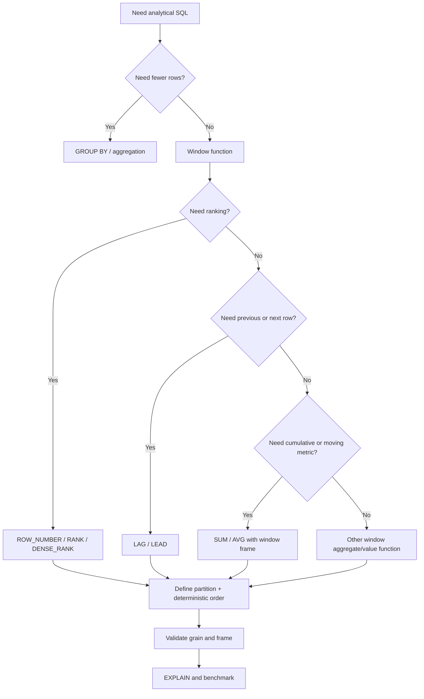

# 09- Window Function Queries

## Overview

Window functions allow SQL to calculate values across a related set of rows while preserving the individual rows in the result.

This makes them fundamentally different from `GROUP BY`.

```text
GROUP BY
→ multiple rows become one row per group

Window function
→ original rows remain, with additional calculated values
```

In the e-commerce database, window functions are particularly useful for:

- Ranking products by sales.
- Finding the latest order or status per group.
- Calculating running revenue.
- Comparing an order with the previous order.
- Calculating customer-level totals while retaining order details.
- Detecting changes in order status.
- Building top-N-per-group queries.
- Calculating percentages and relative metrics.

Window functions are powerful because they allow many analytical operations to remain inside PostgreSQL instead of moving row-by-row processing into Python.

---

## Window Function Mental Model

A window function operates over a defined set of rows called its **window**.

```sql
function(...) OVER (
    PARTITION BY ...
    ORDER BY ...
    ROWS ...
)
```

Conceptually:

```text
Source rows
    ↓
WHERE / JOIN
    ↓
Window definition
    ↓
Window calculation
    ↓
Final filtering / ordering
```

Example:

```sql
SELECT
    id,
    customer_id,
    grand_total,
    SUM(grand_total) OVER (
        PARTITION BY customer_id
    ) AS customer_total
FROM orders;
```

The result remains:

```text
one row per order
```

but each order also contains:

```text
total value of all orders belonging to that customer
```

---

## Window Function Anatomy

A typical window expression contains:

```sql
FUNCTION(value) OVER (
    PARTITION BY grouping_column
    ORDER BY ordering_column
    ROWS BETWEEN ...
)
```

Each component has a different purpose.

| Component | Purpose |
|---|---|
| Function | Calculation such as `SUM`, `ROW_NUMBER`, `LAG` |
| `OVER` | Turns the function into a window operation |
| `PARTITION BY` | Defines independent groups |
| `ORDER BY` | Defines row order within each window |
| Frame | Defines which rows are included for frame-sensitive functions |

Not every window function requires every component.

---

## Window Functions vs GROUP BY

Consider:

```sql
SELECT
    customer_id,
    SUM(grand_total) AS customer_total
FROM orders
GROUP BY customer_id;
```

Result:

```text
one row per customer
```

Now:

```sql
SELECT
    id,
    customer_id,
    grand_total,
    SUM(grand_total) OVER (
        PARTITION BY customer_id
    ) AS customer_total
FROM orders;
```

Result:

```text
one row per order
+
customer-level total
```

This distinction is fundamental.

| Requirement | Preferred |
|---|---|
| Collapse rows into groups | `GROUP BY` |
| Preserve individual rows | Window function |
| Rank rows within groups | Window function |
| Running total | Window function |
| Previous/next row | Window function |
| Group-level aggregate only | `GROUP BY` |

---

## ROW_NUMBER

`ROW_NUMBER()` assigns a unique sequential number to rows within each window.

Example:

```sql
SELECT
    id,
    customer_id,
    grand_total,
    ROW_NUMBER() OVER (
        PARTITION BY customer_id
        ORDER BY created_at DESC, id DESC
    ) AS order_number
FROM orders;
```

For each customer:

```text
latest order → 1
second latest → 2
third latest → 3
```

This is useful for:

- Latest record per group.
- Top-N records.
- Deduplication.
- Selecting one preferred row.
- Ranking API results within a group.

---

## Latest Order per Customer

A common production query is:

```text
Find the latest order for every customer.
```

Use:

```sql
WITH ranked_orders AS (
    SELECT
        id,
        customer_id,
        status,
        grand_total,
        created_at,
        ROW_NUMBER() OVER (
            PARTITION BY customer_id
            ORDER BY created_at DESC, id DESC
        ) AS row_number
    FROM orders
)
SELECT
    id,
    customer_id,
    status,
    grand_total,
    created_at
FROM ranked_orders
WHERE row_number = 1;
```

The CTE is needed because window functions are evaluated before the query's final filtering stage, so the generated row number cannot simply be filtered in the same `WHERE` clause.

---

## Deterministic Ordering

This is safer:

```sql
ROW_NUMBER() OVER (
    PARTITION BY customer_id
    ORDER BY created_at DESC, id DESC
)
```

than:

```sql
ROW_NUMBER() OVER (
    PARTITION BY customer_id
    ORDER BY created_at DESC
)
```

Why?

Multiple orders can have the same `created_at`.

The additional `id` creates a deterministic tie-breaker.

For production pagination, ranking, latest-row selection, and event processing, prefer a total ordering whenever the business semantics require deterministic results.

---

## RANK

`RANK()` assigns the same rank to tied values and leaves gaps after ties.

```sql
SELECT
    id,
    sku_snapshot,
    line_total,
    RANK() OVER (
        ORDER BY line_total DESC
    ) AS sales_rank
FROM order_items;
```

If values are:

```text
100
100
80
70
```

the ranks are:

```text
1
1
3
4
```

The gap occurs because two rows occupy rank `1`.

---

## DENSE_RANK

`DENSE_RANK()` also gives tied rows the same rank but does not leave gaps.

```sql
SELECT
    id,
    sku_snapshot,
    line_total,
    DENSE_RANK() OVER (
        ORDER BY line_total DESC
    ) AS sales_rank
FROM order_items;
```

For:

```text
100
100
80
70
```

the ranks are:

```text
1
1
2
3
```

---

## ROW_NUMBER vs RANK vs DENSE_RANK

| Function | Ties share rank? | Gaps after ties? | Unique row number? |
|---|---:|---:|---:|
| `ROW_NUMBER` | No | No | Yes |
| `RANK` | Yes | Yes | No |
| `DENSE_RANK` | Yes | No | No |

Choose based on business semantics.

```text
Need exactly one row per position?
→ ROW_NUMBER

Competition-style ranking?
→ RANK

Ranking without gaps?
→ DENSE_RANK
```

---

## Top-N per Group

Suppose the requirement is:

```text
Top 3 orders by value for every customer.
```

Use:

```sql
WITH ranked_orders AS (
    SELECT
        id,
        customer_id,
        grand_total,
        created_at,
        ROW_NUMBER() OVER (
            PARTITION BY customer_id
            ORDER BY grand_total DESC, id DESC
        ) AS row_number
    FROM orders
)
SELECT
    id,
    customer_id,
    grand_total,
    created_at
FROM ranked_orders
WHERE row_number <= 3
ORDER BY
    customer_id,
    row_number;
```

This is a common interview and production pattern.

---

## Top-N with Ties

If the requirement is:

```text
Return everyone tied within the top 3 ranks.
```

`RANK()` may be more appropriate:

```sql
WITH ranked_orders AS (
    SELECT
        id,
        customer_id,
        grand_total,
        RANK() OVER (
            PARTITION BY customer_id
            ORDER BY grand_total DESC
        ) AS sales_rank
    FROM orders
)
SELECT
    id,
    customer_id,
    grand_total,
    sales_rank
FROM ranked_orders
WHERE sales_rank <= 3;
```

The result can contain more than three rows per customer because ties are preserved.

---

## PARTITION BY

`PARTITION BY` divides the input into independent windows.

Example:

```sql
SELECT
    id,
    customer_id,
    grand_total,
    SUM(grand_total) OVER (
        PARTITION BY customer_id
    ) AS customer_total
FROM orders;
```

Conceptually:

```text
Customer 1
├── Order A
├── Order B
└── Order C

Customer 2
├── Order D
└── Order E
```

The calculation is performed independently for each customer partition.

---

## No PARTITION BY

Without `PARTITION BY`, all qualifying rows belong to one window.

```sql
SELECT
    id,
    grand_total,
    SUM(grand_total) OVER () AS total_order_value
FROM orders;
```

Every row receives the total across the complete input set.

This is useful for:

- Overall totals.
- Percentage-of-total calculations.
- Global ranking.
- Running totals across the entire dataset.

---

## Running Total

A running revenue calculation:

```sql
SELECT
    id,
    created_at,
    grand_total,
    SUM(grand_total) OVER (
        ORDER BY created_at, id
        ROWS BETWEEN UNBOUNDED PRECEDING AND CURRENT ROW
    ) AS running_revenue
FROM orders
WHERE status = 'delivered'
ORDER BY created_at, id;
```

The calculation progresses:

```text
Order 1 → total through order 1
Order 2 → total through order 2
Order 3 → total through order 3
...
```

The explicit `ROWS` frame makes the intended behavior clear.

---

## Window Frames

A window's `ORDER BY` and frame determine which rows participate in a frame-sensitive calculation.

For example:

```sql
ROWS BETWEEN UNBOUNDED PRECEDING AND CURRENT ROW
```

means:

```text
from the first row
through the current row
```

Common frame expressions include:

```sql
ROWS BETWEEN UNBOUNDED PRECEDING AND CURRENT ROW
```

```sql
ROWS BETWEEN 6 PRECEDING AND CURRENT ROW
```

```sql
ROWS BETWEEN UNBOUNDED PRECEDING AND UNBOUNDED FOLLOWING
```

Frame semantics matter particularly for:

- Running totals.
- Moving averages.
- `FIRST_VALUE`.
- `LAST_VALUE`.
- Ordered aggregates.

Do not assume the default frame always represents the business meaning you want.

---

## Moving Average

Calculate a rolling average over the current row and previous six rows:

```sql
SELECT
    created_at,
    id,
    grand_total,
    AVG(grand_total) OVER (
        ORDER BY created_at, id
        ROWS BETWEEN 6 PRECEDING AND CURRENT ROW
    ) AS rolling_average
FROM orders
WHERE status = 'delivered'
ORDER BY created_at, id;
```

This is a **seven-row** moving window, not necessarily a seven-day window.

If rows are irregularly distributed over time, row-based frames and time-based business windows are not equivalent.

---

## FIRST_VALUE

`FIRST_VALUE()` returns the first value according to the window ordering.

```sql
SELECT
    id,
    customer_id,
    grand_total,
    FIRST_VALUE(grand_total) OVER (
        PARTITION BY customer_id
        ORDER BY created_at, id
    ) AS first_order_value
FROM orders;
```

This preserves every order while exposing the customer's first order value.

---

## LAST_VALUE

`LAST_VALUE()` requires particular care because the default window frame may end at the current row.

For a true partition-wide last value:

```sql
SELECT
    id,
    customer_id,
    grand_total,
    LAST_VALUE(grand_total) OVER (
        PARTITION BY customer_id
        ORDER BY created_at, id
        ROWS BETWEEN UNBOUNDED PRECEDING
                 AND UNBOUNDED FOLLOWING
    ) AS last_order_value
FROM orders;
```

The explicit frame prevents the common mistake of unintentionally returning the current row's value rather than the partition's final value.

---

## LAG

`LAG()` retrieves a value from a previous row.

```sql
SELECT
    id,
    customer_id,
    created_at,
    grand_total,
    LAG(grand_total) OVER (
        PARTITION BY customer_id
        ORDER BY created_at, id
    ) AS previous_order_value
FROM orders;
```

The first order for each customer has:

```text
previous_order_value = NULL
```

This is useful for:

- Comparing consecutive orders.
- Detecting state changes.
- Calculating deltas.
- Measuring time between events.
- Analyzing customer behavior.

---

## LEAD

`LEAD()` retrieves a value from a following row.

```sql
SELECT
    id,
    customer_id,
    created_at,
    grand_total,
    LEAD(created_at) OVER (
        PARTITION BY customer_id
        ORDER BY created_at, id
    ) AS next_order_at
FROM orders;
```

This is useful for:

- Finding the next event.
- Calculating time until the next event.
- Session analysis.
- Lifecycle analysis.

---

## Calculating Differences

Compare each order with the customer's previous order:

```sql
SELECT
    id,
    customer_id,
    grand_total,
    grand_total
        - LAG(grand_total) OVER (
            PARTITION BY customer_id
            ORDER BY created_at, id
        ) AS value_change
FROM orders;
```

The first row per customer produces `NULL`.

If the API needs zero instead:

```sql
COALESCE(
    grand_total
        - LAG(grand_total) OVER (
            PARTITION BY customer_id
            ORDER BY created_at, id
        ),
    0
)
```

Only normalize `NULL` when zero actually represents the desired business meaning.

---

## Calculating Time Between Orders

```sql
SELECT
    id,
    customer_id,
    created_at,
    created_at
        - LAG(created_at) OVER (
            PARTITION BY customer_id
            ORDER BY created_at, id
        ) AS time_since_previous_order
FROM orders;
```

The result represents the elapsed time between consecutive orders for each customer.

Remember:

```text
LAG offset = previous row
```

not:

```text
previous day
previous week
previous timestamp
```

The window's ordering determines what "previous" means.

---

## Detecting Status Changes

Using order status history:

```sql
SELECT
    id,
    order_id,
    status,
    created_at,
    LAG(status) OVER (
        PARTITION BY order_id
        ORDER BY created_at, id
    ) AS previous_status
FROM order_status_history;
```

Then identify transitions:

```sql
WITH status_changes AS (
    SELECT
        id,
        order_id,
        status,
        created_at,
        LAG(status) OVER (
            PARTITION BY order_id
            ORDER BY created_at, id
        ) AS previous_status
    FROM order_status_history
)
SELECT
    order_id,
    previous_status,
    status AS new_status,
    created_at
FROM status_changes
WHERE previous_status IS NOT NULL
  AND previous_status <> status;
```

This is useful for lifecycle analysis and operational auditing.

---

## Ranking Products by Sales

Calculate total sales first, then rank products:

```sql
WITH product_sales AS (
    SELECT
        oi.sku_snapshot AS sku,
        SUM(oi.quantity) AS units_sold,
        SUM(oi.line_total) AS sales_value
    FROM order_items AS oi
    JOIN orders AS o
        ON o.id = oi.order_id
    WHERE o.status = 'delivered'
    GROUP BY oi.sku_snapshot
)
SELECT
    sku,
    units_sold,
    sales_value,
    RANK() OVER (
        ORDER BY sales_value DESC
    ) AS sales_rank
FROM product_sales
ORDER BY sales_rank, sku;
```

The stages are:

```text
order items
    ↓
aggregate by SKU
    ↓
rank aggregated products
```

This is a common pattern:

```text
GROUP BY
→ establish metric grain

Window function
→ compare or rank those groups
```

---

## Percentage of Total

Calculate each customer's share of total sales:

```sql
WITH customer_sales AS (
    SELECT
        customer_id,
        SUM(grand_total) AS sales
    FROM orders
    WHERE status = 'delivered'
    GROUP BY customer_id
)
SELECT
    customer_id,
    sales,
    sales / NULLIF(
        SUM(sales) OVER (),
        0
    ) AS sales_share
FROM customer_sales
ORDER BY sales DESC;
```

The `NULLIF` prevents division by zero.

The result is:

```text
customer
sales
sales / total sales
```

If a percentage is required:

```sql
100.0 * sales / NULLIF(SUM(sales) OVER (), 0)
```

---

## Multiple Window Functions

Multiple window expressions can operate on the same result set.

```sql
SELECT
    id,
    customer_id,
    grand_total,
    ROW_NUMBER() OVER (
        PARTITION BY customer_id
        ORDER BY created_at DESC, id DESC
    ) AS recency_rank,
    SUM(grand_total) OVER (
        PARTITION BY customer_id
    ) AS customer_total,
    AVG(grand_total) OVER (
        PARTITION BY customer_id
    ) AS customer_average
FROM orders;
```

The result remains one row per order while exposing several customer-level metrics.

---

## Multiple Window Definitions

When several functions share the same window definition, PostgreSQL supports named windows.

```sql
SELECT
    id,
    customer_id,
    grand_total,
    ROW_NUMBER() OVER customer_orders AS row_number,
    SUM(grand_total) OVER customer_orders AS customer_total
FROM orders
WINDOW customer_orders AS (
    PARTITION BY customer_id
    ORDER BY created_at, id
);
```

Named windows can improve readability when the same definition is reused.

Do not introduce them merely to make a short query more abstract.

---

## Filtering Window Results

Window functions cannot normally be used directly in `WHERE`.

This is invalid:

```sql
SELECT
    id,
    customer_id,
    ROW_NUMBER() OVER (
        PARTITION BY customer_id
        ORDER BY created_at DESC, id DESC
    ) AS row_number
FROM orders
WHERE row_number = 1;
```

Use a subquery or CTE:

```sql
WITH ranked_orders AS (
    SELECT
        id,
        customer_id,
        ROW_NUMBER() OVER (
            PARTITION BY customer_id
            ORDER BY created_at DESC, id DESC
        ) AS row_number
    FROM orders
)
SELECT
    id,
    customer_id
FROM ranked_orders
WHERE row_number = 1;
```

This creates a clear two-stage pipeline:

```text
calculate window value
        ↓
filter calculated result
```

---

## QUALIFY

Some SQL systems provide `QUALIFY` to filter window-function results directly.

PostgreSQL does not provide a native `QUALIFY` clause.

Therefore, PostgreSQL commonly uses:

```sql
WITH ranked AS (
    SELECT
        ...,
        ROW_NUMBER() OVER (...) AS rn
    FROM ...
)
SELECT *
FROM ranked
WHERE rn = 1;
```

Do not copy `QUALIFY` syntax from another database into PostgreSQL.

---

## Window Functions and JOINs

Window functions operate after the query's `FROM`, `JOIN`, and `WHERE` processing.

This matters when joins multiply rows.

For example:

```sql
SELECT
    o.id,
    oi.id AS item_id,
    ROW_NUMBER() OVER (
        PARTITION BY o.id
        ORDER BY oi.id
    ) AS item_number
FROM orders AS o
JOIN order_items AS oi
    ON oi.order_id = o.id;
```

The window sees the joined rows.

The result grain is:

```text
one row per order item
```

not:

```text
one row per order
```

Define the join grain before applying the window function.

---

## Window Functions and Aggregation

A common analytical pattern is:

```text
1. Aggregate
2. Window over aggregate result
```

Example:

```sql
WITH monthly_sales AS (
    SELECT
        DATE_TRUNC('month', created_at) AS month,
        SUM(grand_total) AS sales
    FROM orders
    WHERE status = 'delivered'
    GROUP BY DATE_TRUNC('month', created_at)
)
SELECT
    month,
    sales,
    SUM(sales) OVER (
        ORDER BY month
        ROWS BETWEEN UNBOUNDED PRECEDING AND CURRENT ROW
    ) AS cumulative_sales
FROM monthly_sales
ORDER BY month;
```

This produces:

```text
month
monthly sales
cumulative sales
```

The aggregation establishes monthly grain before the window calculates the cumulative metric.

---

## Window Functions and Pagination

Window functions can be useful for analytical ranking but are not automatically the best pagination mechanism.

For ordinary large API pagination:

```text
keyset pagination
```

is often preferable.

For example:

```sql
SELECT
    id,
    created_at,
    status
FROM orders
WHERE (created_at, id) < ($1, $2)
ORDER BY created_at DESC, id DESC
LIMIT 20;
```

A `ROW_NUMBER()` calculation over a huge result set can require processing many rows before the final page is known.

Use window functions for analytical requirements, not simply because they can assign row numbers.

---

## Performance Characteristics

Window functions often require PostgreSQL to establish the ordering needed by the window.

For:

```sql
ROW_NUMBER() OVER (
    PARTITION BY customer_id
    ORDER BY created_at, id
)
```

the database may need to sort or otherwise obtain appropriately ordered input.

Potential costs include:

- Sorting.
- Memory consumption.
- Temporary files.
- Large intermediate results.
- CPU utilization.

Indexes can sometimes provide useful ordering or reduce the amount of data processed, but an index does not guarantee that PostgreSQL will avoid a sort.

---

## Window Functions and work_mem

Large sorts and window operations can consume `work_mem`.

Under concurrency, memory consumption can multiply:

```text
one query
  ↓
several sort/hash operations
  ↓
per-operation memory

many concurrent queries
  ↓
aggregate memory pressure
```

Increasing `work_mem` globally without understanding concurrency can create memory pressure.

Tune based on workload and execution plans.

---

## Explain Window Queries

Inspect important window queries:

```sql
EXPLAIN (ANALYZE, BUFFERS)
WITH ranked_orders AS (
    SELECT
        id,
        customer_id,
        grand_total,
        ROW_NUMBER() OVER (
            PARTITION BY customer_id
            ORDER BY created_at DESC, id DESC
        ) AS row_number
    FROM orders
)
SELECT
    id,
    customer_id,
    grand_total
FROM ranked_orders
WHERE row_number <= 3;
```

Look for:

- Sort operations.
- Actual row counts.
- Buffer reads.
- Temporary-file activity.
- Execution time.
- Unexpected joins before the window.
- Large intermediate datasets.

Optimize the query based on the actual plan.

---

## Indexing Window Queries

Suppose the query repeatedly uses:

```sql
PARTITION BY customer_id
ORDER BY created_at DESC, id DESC
```

A candidate index is:

```sql
CREATE INDEX orders_customer_created_id_idx
ON orders (
    customer_id,
    created_at DESC,
    id DESC
);
```

This may help related access patterns.

However:

- The planner may still choose a different strategy.
- Filtering predicates may change the optimal index.
- Large portions of the table may still need processing.
- Window functions may still require additional work.

Index design should follow the complete query workload rather than the window expression alone.

---

## Window Functions and NULL Ordering

PostgreSQL allows explicit NULL ordering:

```sql
ORDER BY shipped_at DESC NULLS LAST
```

or:

```sql
ORDER BY shipped_at ASC NULLS FIRST
```

This matters for ranking and latest-row queries.

For example:

```sql
ROW_NUMBER() OVER (
    PARTITION BY customer_id
    ORDER BY shipped_at DESC NULLS LAST, id DESC
)
```

makes the treatment of unshipped orders explicit.

Do not rely on implicit NULL ordering when it affects business semantics.

---

## Window Functions in Django

Django supports window expressions.

Example:

```python
from django.db.models import F, Window
from django.db.models.functions import RowNumber

orders = Order.objects.annotate(
    customer_order_number=Window(
        expression=RowNumber(),
        partition_by=[F("customer_id")],
        order_by=[
            F("created_at").desc(),
            F("id").desc(),
        ],
    )
)
```

This can be useful for analytical APIs and reporting.

For complex window queries, inspect generated SQL and validate PostgreSQL execution plans.

---

## Window Functions in FastAPI

A FastAPI endpoint can expose a reporting result generated by PostgreSQL:

```python
from psycopg import Connection


def get_top_customer_orders(
    connection: Connection,
    limit_per_customer: int,
) -> list[dict]:
    with connection.cursor() as cursor:
        cursor.execute(
            """
            WITH ranked_orders AS (
                SELECT
                    id,
                    customer_id,
                    grand_total,
                    created_at,
                    ROW_NUMBER() OVER (
                        PARTITION BY customer_id
                        ORDER BY created_at DESC, id DESC
                    ) AS row_number
                FROM orders
            )
            SELECT
                id,
                customer_id,
                grand_total,
                created_at
            FROM ranked_orders
            WHERE row_number <= %s
            ORDER BY customer_id, row_number
            """,
            (limit_per_customer,),
        )

        rows = cursor.fetchall()

    return [
        {
            "id": row[0],
            "customer_id": row[1],
            "grand_total": row[2],
            "created_at": row[3],
        }
        for row in rows
    ]
```

The API should expose the business result rather than leaking the SQL/window implementation.

---

## Window Functions and Historical Events

Window functions are particularly useful for event history:

```text
order_status_history
        ↓
partition by order
        ↓
order by event time
        ↓
LAG / LEAD
        ↓
state transitions
```

For example:

```sql
SELECT
    order_id,
    status,
    created_at,
    created_at
        - LAG(created_at) OVER (
            PARTITION BY order_id
            ORDER BY created_at, id
        ) AS time_since_previous_status
FROM order_status_history
ORDER BY order_id, created_at, id;
```

This can identify how long orders spent between recorded status events.

---

## Late-Arriving Events

Window functions depend on ordering.

If an historical event arrives late:

```text
Event A
Event C
Event B arrives later
```

then a query ordered by event time may produce different results after `B` is inserted.

This matters in systems using:

- Kafka.
- Event ingestion.
- CDC pipelines.
- Asynchronous workers.

Do not assume insertion order is business-event order.

If event ordering matters, store an appropriate event timestamp and deterministic sequence/tie-breaker.

---

## Window Functions and Kafka

Kafka provides ordering within a partition, but that does not necessarily mean the database's business-event order is identical.

For example:

```text
Kafka partition order
        ≠
business event time
```

If events are persisted asynchronously, use explicit event timestamps or sequence values when reconstructing lifecycle order.

Window functions can then operate on:

```sql
ORDER BY event_time, event_id
```

rather than assuming database insertion order.

---

## Security Considerations

Window functions do not change authorization requirements.

A customer-scoped query should remain scoped:

```sql
SELECT
    id,
    customer_id,
    grand_total,
    SUM(grand_total) OVER (
        PARTITION BY customer_id
    ) AS customer_total
FROM orders
WHERE customer_id = $1;
```

If the query is used for a multi-tenant API:

```sql
WHERE tenant_id = $1
```

must be included according to the application's data-isolation model.

Be careful with aggregates and windows because they can reveal information about other rows in the same partition if authorization boundaries are incorrectly applied.

---

## Reliability and Operational Considerations

Window queries are often analytical and can be more expensive than simple point lookups.

Avoid running large unbounded analytical windows on every API request when:

- The dataset is large.
- The query is highly concurrent.
- The result changes infrequently.
- The calculation can be precomputed.

Alternatives include:

```text
Materialized view
Pre-aggregated table
Background job
Redis cache
Analytics database
```

For example:

```text
PostgreSQL
    ↓
Celery aggregation job
    ↓
customer_metrics
    ↓
FastAPI
```

The appropriate design depends on freshness and workload requirements.

---

## High Availability and Disaster Recovery

Window queries do not alter PostgreSQL durability, but expensive analytical workloads can affect primary database capacity.

For production systems:

- Route appropriate read-only analytical workloads to replicas.
- Monitor replica lag.
- Avoid consistency-sensitive reads from stale replicas.
- Keep transactional and analytical workloads separated where possible.
- Maintain a rebuild strategy for derived metrics.
- Back up source-of-truth transactional tables.

Derived ranking or reporting tables should ideally be reproducible from authoritative data.

---

## Common Mistakes

### Using GROUP BY When Row Detail Is Required

If the API needs:

```text
every order
+
customer lifetime value
```

`GROUP BY` alone removes the individual order rows.

Use a window function:

```sql
SUM(grand_total) OVER (
    PARTITION BY customer_id
)
```

---

### Filtering a Window Function in WHERE

This does not work:

```sql
WHERE ROW_NUMBER() OVER (...) = 1
```

Use a CTE or subquery.

---

### Forgetting a Tie-Breaker

Avoid:

```sql
ORDER BY created_at DESC
```

when multiple records can have the same timestamp and deterministic selection matters.

Prefer:

```sql
ORDER BY created_at DESC, id DESC
```

---

### Misunderstanding RANK

`RANK()` leaves gaps after ties.

If:

```text
100
100
90
```

the ranks are:

```text
1
1
3
```

Use `DENSE_RANK()` if gaps are not desired.

---

### Misusing LAST_VALUE

Without an explicit frame, `LAST_VALUE()` may return the current row's value rather than the final value of the partition.

Use:

```sql
ROWS BETWEEN UNBOUNDED PRECEDING
         AND UNBOUNDED FOLLOWING
```

when the entire partition is intended.

---

### Assuming LAG Means Previous Date

`LAG()` means previous row according to the window ordering.

It does not mean:

```text
previous day
previous week
previous calendar event
```

---

### Applying Windows After an Incorrect JOIN

If a join multiplies rows, the window function sees the multiplied rows.

Fix the query's grain before applying the window.

---

### Using ROW_NUMBER for Pagination by Default

`ROW_NUMBER()` can assign positions, but it is not automatically an efficient large-scale pagination strategy.

For ordinary APIs, deterministic keyset pagination is often more appropriate.

---

### Assuming Indexes Eliminate Window Cost

An index may help access or ordering, but the window operation may still require substantial processing.

Measure the complete query plan.

---

## Production Review Checklist

Before deploying a window-heavy query, verify:

### Semantics

- What is the input grain?
- What is the output grain?
- What defines each partition?
- What defines row order?
- Are ties deterministic?
- Is the window frame correct?
- Does `NULL` have the intended ordering?

### Performance

- Is the input dataset bounded?
- Is the partition potentially huge?
- Is a sort required?
- Are temporary files generated?
- Is the appropriate index available?
- Has `EXPLAIN (ANALYZE, BUFFERS)` been reviewed?

### Security

- Is tenant/customer scope enforced?
- Can the window calculation reveal another user's data?
- Are sensitive columns excluded?
- Are query parameters bound safely?

### Reliability

- Can late-arriving events change the result?
- Is eventual consistency acceptable?
- Should the calculation be asynchronous?
- Can a derived result be rebuilt?
- Is replica staleness acceptable?

---

## Senior Decision Framework

Use this reasoning process:



A senior engineer should be able to explain:

```text
What rows enter the window?
What is the partition?
What is the ordering?
What is the frame?
What happens on ties?
Can joins multiply rows?
How many rows must PostgreSQL process?
Can the result be precomputed?
```

---

## Interview Traps

### What is the biggest difference between GROUP BY and a window function?

`GROUP BY` collapses rows into groups.

A window function preserves the input rows and adds calculations based on related rows.

---

### Why is ROW_NUMBER useful for latest-per-group queries?

It creates a deterministic position within each group, allowing the outer query to select:

```sql
WHERE row_number = 1
```

after the window calculation has been performed.

---

### What is the difference between RANK and DENSE_RANK?

Both assign the same rank to ties.

`RANK` leaves gaps.

`DENSE_RANK` does not.

---

### Why can LAST_VALUE produce surprising results?

Because the default frame can end at the current row.

If the intended value is the last row of the complete partition, define the frame explicitly.

---

### Can window functions be used in WHERE?

Not directly in PostgreSQL's normal query syntax.

Use a subquery or CTE to calculate the window value first and filter it in the outer query.

---

### Does ROW_NUMBER guarantee deterministic results?

Only when the window's ordering provides a deterministic ordering.

If ties remain unresolved, add an appropriate unique or stable tie-breaker.

---

### Are window functions always slower than GROUP BY?

They solve different problems.

A window query may process more rows because it preserves row-level detail, while `GROUP BY` reduces the result.

Performance depends on the query, data volume, ordering, partitioning, and execution plan.

---

## Key Takeaways

- **Window functions preserve row-level detail while calculating values across related rows, making them the right tool for ranking, running totals, comparisons, and group-level context.**
- **Always define `PARTITION BY`, deterministic `ORDER BY`, and the appropriate window frame; these determine exactly which rows participate in the calculation.**
- **Use `ROW_NUMBER`, `RANK`, and `DENSE_RANK` according to tie semantics, and use `LAG`/`LEAD` when comparing consecutive rows or events.**
- **Validate the result grain before applying a window function, especially after JOINs, because row multiplication directly changes the rows visible to the window.**
- **For production workloads, inspect window-query execution plans, control input size, understand sort and memory costs, and consider pre-aggregation or asynchronous processing when analytical calculations become expensive.**