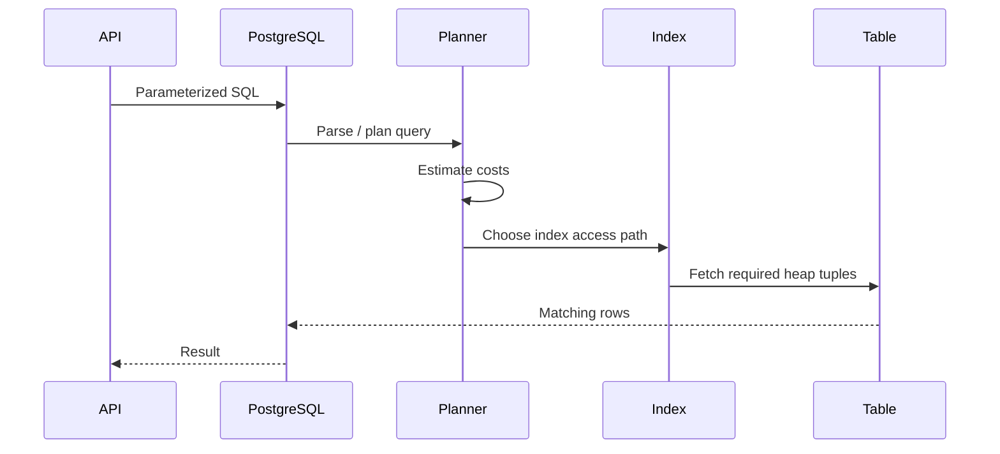
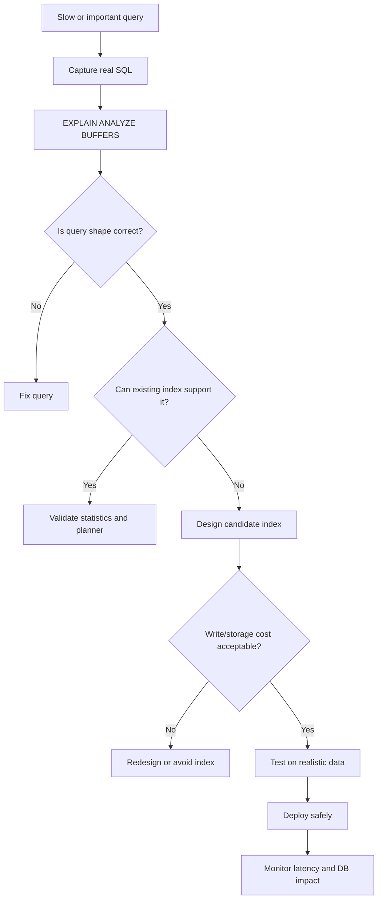

# 10- Indexing Strategy

## Overview

Indexes are one of the most important performance tools in a PostgreSQL-backed application. They allow the database to locate qualifying rows without scanning the entire table and can also support ordering, uniqueness, joins, foreign-key checks, and common access patterns.

For the e-commerce database, indexing should be driven by actual application queries rather than by adding an index to every frequently queried column.

A production indexing strategy balances:

```text
Read performance
      +
Write performance
      +
Storage
      +
WAL / replication overhead
      +
Vacuum and maintenance
      +
Operational complexity
```

An index is an **access path**, not a guarantee that PostgreSQL will use it.

The PostgreSQL planner chooses between sequential scans, index scans, bitmap scans, index-only scans, and other strategies based on estimated cost and current statistics.

---

## E-Commerce Database Access Patterns

The schema contains several high-traffic relationships:

```text
customers
   │
   ├── customer_addresses
   ├── carts
   └── orders
          │
          ├── order_items
          ├── payments
          ├── shipments
          └── order_status_history

products
   │
   └── product_variants
          │
          ├── inventory
          └── inventory_reservations
```

Typical production queries include:

- Find a customer's recent orders.
- Find order items for an order.
- Find payments for an order.
- Find the latest status for an order.
- Find available inventory for a SKU.
- Find active reservations for an inventory item.
- Find products by category.
- Find active prices for a variant.
- Find unprocessed outbox events.
- Find top-selling products over a time range.

The indexes should support these access patterns.

---

## What an Index Provides

Without a useful index:

```text
Query
  ↓
Sequential scan
  ↓
Inspect many table rows
  ↓
Return qualifying rows
```

With an appropriate index:

```text
Query
  ↓
Index lookup / ordered traversal
  ↓
Locate candidate rows
  ↓
Fetch table rows if necessary
  ↓
Return result
```

For a large table, avoiding unnecessary row inspection can dramatically reduce latency and I/O.

However, index traversal itself has a cost, and fetching many table rows through an index can be more expensive than a sequential scan.

---

## PostgreSQL B-tree Index

The default PostgreSQL index type is B-tree.

Example:

```sql
CREATE INDEX orders_customer_id_idx
ON orders (customer_id);
```

B-tree indexes are suitable for many common operations:

```sql
=
<
<=
>
>=
BETWEEN
ORDER BY
```

They are generally the first index type to consider for normal OLTP queries.

---

## Primary Keys and Unique Constraints

A primary key automatically creates a unique B-tree index in PostgreSQL.

For example:

```sql
CREATE TABLE orders (
    id bigint GENERATED ALWAYS AS IDENTITY PRIMARY KEY
);
```

creates an index supporting:

```sql
WHERE id = $1
```

Likewise:

```sql
CREATE UNIQUE INDEX customers_email_uidx
ON customers (email);
```

can enforce a business uniqueness requirement.

Prefer constraints when the requirement is truly a data invariant:

```sql
ALTER TABLE customers
ADD CONSTRAINT customers_email_unique UNIQUE (email);
```

The database then both enforces the rule and maintains the necessary index.

---

## Foreign-Key Indexes

Foreign keys do not automatically create an index on the referencing column in PostgreSQL.

For example:

```sql
CREATE TABLE order_items (
    id bigint PRIMARY KEY,
    order_id bigint NOT NULL REFERENCES orders(id)
);
```

A useful index is usually:

```sql
CREATE INDEX order_items_order_id_idx
ON order_items (order_id);
```

This supports queries such as:

```sql
SELECT
    id,
    sku_snapshot,
    quantity,
    line_total
FROM order_items
WHERE order_id = $1;
```

It can also help operations involving the referenced relationship, including parent-row updates/deletes where PostgreSQL must check referencing rows.

For high-volume child tables, foreign-key indexing should be evaluated deliberately.

---

## Index the Access Pattern, Not the Column

A common mistake is:

```text
"customer_id is queried frequently, therefore create an index on customer_id."
```

The better question is:

```text
"What does the complete production query look like?"
```

Consider:

```sql
SELECT
    id,
    status,
    grand_total,
    created_at
FROM orders
WHERE customer_id = $1
ORDER BY created_at DESC, id DESC
LIMIT 20;
```

A more useful index is:

```sql
CREATE INDEX orders_customer_created_id_idx
ON orders (
    customer_id,
    created_at DESC,
    id DESC
);
```

The index matches:

```text
filter
  ↓
customer_id

ordering
  ↓
created_at DESC
id DESC
```

This is much more useful than blindly creating several independent indexes.

---

## Composite Indexes

A composite index contains multiple columns:

```sql
CREATE INDEX orders_customer_status_created_idx
ON orders (
    customer_id,
    status,
    created_at DESC
);
```

Column order matters.

Conceptually:

```text
(customer_id, status, created_at)
```

is organized first by:

```text
customer_id
```

then:

```text
status
```

then:

```text
created_at
```

It is not equivalent to:

```text
(status, customer_id, created_at)
```

---

## Composite Index Column Order

Suppose the query is:

```sql
SELECT
    id,
    grand_total,
    created_at
FROM orders
WHERE customer_id = $1
  AND status = 'delivered'
ORDER BY created_at DESC
LIMIT 20;
```

A strong candidate is:

```sql
CREATE INDEX orders_customer_status_created_idx
ON orders (
    customer_id,
    status,
    created_at DESC
);
```

The general reasoning is:

```text
Equality / highly selective predicates
        ↓
Ordering or range columns
        ↓
Additional columns only when justified
```

There is no universal formula that works for every workload. Query shape, selectivity, cardinality, ordering, and competing queries all matter.

---

## Keyset Pagination Index

For:

```sql
SELECT
    id,
    customer_id,
    grand_total,
    created_at
FROM orders
WHERE customer_id = $1
  AND (created_at, id) < ($2, $3)
ORDER BY created_at DESC, id DESC
LIMIT 20;
```

use an index aligned with the access pattern:

```sql
CREATE INDEX orders_customer_created_id_idx
ON orders (
    customer_id,
    created_at DESC,
    id DESC
);
```

This is an important production pattern for high-volume order APIs.

The cursor might contain:

```text
created_at
id
```

so the database can continue from the previous position rather than repeatedly skipping earlier rows.

---

## Partial Indexes

A partial index contains only rows satisfying a predicate.

For example, an outbox worker may repeatedly query:

```sql
SELECT
    id,
    aggregate_type,
    aggregate_id,
    event_type,
    payload
FROM outbox_events
WHERE published_at IS NULL
ORDER BY created_at, id
LIMIT 100;
```

A candidate index is:

```sql
CREATE INDEX outbox_unpublished_created_idx
ON outbox_events (created_at, id)
WHERE published_at IS NULL;
```

Advantages:

- Smaller index.
- Less maintenance than indexing all rows.
- Efficient for frequently queried subsets.

Limitations:

- Only useful when the query predicate matches the index predicate appropriately.
- It is workload-specific.
- It can become less valuable if the qualifying population becomes most of the table.

Partial indexes are particularly useful for:

- Unprocessed jobs.
- Active records.
- Soft-delete patterns.
- Pending payments.
- Unpublished outbox events.
- Current inventory states.

---

## Soft Delete Indexing

Suppose:

```sql
deleted_at IS NULL
```

defines active customers.

A query might be:

```sql
SELECT
    id,
    email,
    created_at
FROM customers
WHERE deleted_at IS NULL
  AND email = $1;
```

A partial index can be appropriate:

```sql
CREATE UNIQUE INDEX customers_active_email_uidx
ON customers (email)
WHERE deleted_at IS NULL;
```

This can also enforce:

```text
Only one active customer may use an email address.
```

The business semantics must be explicit.

Do not create a partial unique index merely because a table contains a `deleted_at` column.

---

## Expression Indexes

An expression index indexes the result of an expression.

For example:

```sql
CREATE INDEX customers_lower_email_idx
ON customers (LOWER(email));
```

This supports:

```sql
SELECT
    id
FROM customers
WHERE LOWER(email) = LOWER($1);
```

Expression indexes are useful when a specific expression is repeatedly used and cannot reasonably be normalized away.

However, consider whether the schema should instead store normalized data.

For example:

```text
normalized email column
        +
unique constraint
```

may be easier to reason about than repeatedly applying expressions.

---

## Covering Indexes and INCLUDE

PostgreSQL supports `INCLUDE` columns.

Example:

```sql
CREATE INDEX orders_customer_created_covering_idx
ON orders (
    customer_id,
    created_at DESC,
    id DESC
)
INCLUDE (
    status,
    grand_total
);
```

The key columns determine index ordering.

Included columns are stored in the index payload and can sometimes allow an index-only scan.

This can reduce heap access when PostgreSQL can obtain the required data directly from the index and visibility conditions allow it.

Do not add large `INCLUDE` payloads indiscriminately.

Larger indexes mean:

- More storage.
- More cache pressure.
- More write overhead.
- More WAL.
- More maintenance work.

---

## Index-Only Scans

An index-only scan can satisfy a query using index data without fetching every matching heap tuple.

For example:

```sql
SELECT
    customer_id,
    created_at
FROM orders
WHERE customer_id = $1
ORDER BY created_at DESC
LIMIT 20;
```

An aligned index may allow PostgreSQL to avoid many heap fetches.

However, PostgreSQL still uses the visibility map to determine whether heap access can safely be skipped.

Therefore:

```text
index-only scan
≠
"heap access is always zero"
```

Vacuum and table visibility state affect how effective index-only scans are.

---

## Indexes for JOINs

Consider:

```sql
SELECT
    o.id,
    oi.sku_snapshot,
    oi.quantity
FROM orders AS o
JOIN order_items AS oi
    ON oi.order_id = o.id
WHERE o.id = $1;
```

The child-side index:

```sql
CREATE INDEX order_items_order_id_idx
ON order_items (order_id);
```

is important when retrieving items for a specific order.

For large tables, missing join-supporting indexes can cause expensive scans.

Always inspect the actual join plan rather than assuming an index is used.

---

## Indexes for EXISTS

Suppose:

```sql
SELECT
    c.id,
    c.email
FROM customers AS c
WHERE EXISTS (
    SELECT 1
    FROM orders AS o
    WHERE o.customer_id = c.id
      AND o.status = 'delivered'
);
```

A candidate index is:

```sql
CREATE INDEX orders_customer_status_idx
ON orders (customer_id, status);
```

The database can use the index to efficiently find qualifying child rows.

The optimal index depends on the complete workload and predicate selectivity.

---

## Indexes for Aggregation

Indexes do not automatically make every aggregation fast.

For:

```sql
SELECT
    customer_id,
    SUM(grand_total)
FROM orders
WHERE status = 'delivered'
GROUP BY customer_id;
```

a candidate index might be:

```sql
CREATE INDEX orders_status_customer_idx
ON orders (status, customer_id);
```

But PostgreSQL may still choose a sequential scan followed by aggregation if that is cheaper.

This is an important production principle:

> An index is useful only when its complete access path is cheaper than the alternatives.

---

## Indexes and ORDER BY

For:

```sql
SELECT
    id,
    created_at
FROM orders
ORDER BY created_at DESC, id DESC
LIMIT 50;
```

an index such as:

```sql
CREATE INDEX orders_created_id_idx
ON orders (created_at DESC, id DESC);
```

may allow PostgreSQL to obtain rows in the desired order efficiently.

This is particularly useful for:

- Recent orders.
- Activity feeds.
- Audit records.
- Event histories.
- Administrative dashboards.

For a highly selective filter plus ordering, the composite index should generally reflect the complete access pattern.

---

## Indexes and LIKE

A normal B-tree index is useful for some prefix searches, such as:

```sql
WHERE email LIKE 'alice%'
```

but not generally for:

```sql
WHERE email LIKE '%alice%'
```

because the leading wildcard prevents normal B-tree ordering from efficiently narrowing the search range.

For substring or full-text requirements, investigate PostgreSQL-specific approaches such as:

- `pg_trgm`.
- Full-text search.
- Specialized search infrastructure.

Do not add a normal B-tree index and assume it solves arbitrary substring search.

---

## Indexes and NULL

B-tree indexes can contain NULL values.

For example:

```sql
CREATE INDEX orders_shipped_at_idx
ON orders (shipped_at);
```

can support queries involving indexed ordering and suitable predicates involving `NULL`, depending on the query plan.

For a query such as:

```sql
WHERE shipped_at IS NULL
```

PostgreSQL may use the index when the planner determines that it is beneficial.

A partial index can sometimes be more targeted:

```sql
CREATE INDEX orders_unshipped_idx
ON orders (id)
WHERE shipped_at IS NULL;
```

Choose based on workload.

---

## Inventory Indexing

Inventory is usually a high-concurrency part of an e-commerce system.

A lookup might be:

```sql
SELECT
    variant_id,
    available_quantity
FROM inventory
WHERE variant_id = $1;
```

If `variant_id` is unique, enforce it:

```sql
CREATE UNIQUE INDEX inventory_variant_uidx
ON inventory (variant_id);
```

For reservation processing:

```sql
SELECT
    id,
    variant_id,
    quantity
FROM inventory_reservations
WHERE status = 'active'
  AND expires_at <= NOW()
ORDER BY expires_at, id
LIMIT 100
FOR UPDATE SKIP LOCKED;
```

a candidate index is:

```sql
CREATE INDEX inventory_reservations_expiry_idx
ON inventory_reservations (expires_at, id)
WHERE status = 'active';
```

This aligns the index with the worker's filtering and ordering pattern.

---

## Outbox Indexing

The outbox pattern commonly has a worker repeatedly looking for unpublished events:

```sql
SELECT
    id,
    aggregate_type,
    aggregate_id,
    event_type,
    payload
FROM outbox_events
WHERE published_at IS NULL
ORDER BY created_at, id
LIMIT 100
FOR UPDATE SKIP LOCKED;
```

A partial index is a strong candidate:

```sql
CREATE INDEX outbox_pending_idx
ON outbox_events (created_at, id)
WHERE published_at IS NULL;
```

The processing architecture becomes:


The index does not replace the locking strategy.

`FOR UPDATE SKIP LOCKED` and transaction boundaries still determine concurrency behavior.

---

## Indexes and Status Columns

A common mistake is adding:

```sql
CREATE INDEX orders_status_idx
ON orders (status);
```

because every query contains `status`.

If the table contains:

```text
90% delivered
5% processing
3% shipped
2% pending
```

a standalone status index may have limited value for queries targeting common statuses.

Instead, consider the complete query:

```sql
WHERE customer_id = $1
  AND status = 'processing'
ORDER BY created_at DESC
```

A composite or partial index may be much more useful.

Index selectivity and workload matter more than whether a column appears in a `WHERE` clause.

---

## Index Selectivity

Selectivity describes how effectively a predicate narrows the candidate rows.

For example:

```text
customer_id = specific customer
```

may be highly selective.

While:

```text
status = 'delivered'
```

may be poorly selective.

But selectivity alone does not determine the index design.

The planner considers:

- Estimated row counts.
- Table size.
- Statistics.
- Cache state.
- Random I/O cost.
- Sequential scan cost.
- Query ordering.
- Join strategy.
- Parallelism.

---

## Query Lifecycle with an Index

A simplified request flow:



The actual PostgreSQL execution path can be more complex and may use:

- Index scans.
- Bitmap index scans.
- Bitmap heap scans.
- Index-only scans.
- Sequential scans.
- Parallel plans.

---

## Index Scan vs Sequential Scan

An index scan is not automatically better.

Suppose a query returns:

```text
5 rows
```

An index can be very useful.

If it returns:

```text
80% of a large table
```

a sequential scan may be cheaper.

The planner is therefore expected to choose:

```text
Index scan
```

for some queries and:

```text
Sequential scan
```

for others.

Do not treat:

```text
"PostgreSQL ignored my index"
```

as automatically being a database problem.

First inspect the plan and estimated versus actual cardinality.

---

## Bitmap Scans

For queries returning many scattered rows, PostgreSQL may use:

```text
Bitmap Index Scan
        ↓
Bitmap Heap Scan
```

The index identifies candidate heap pages, and PostgreSQL then visits those pages more efficiently than performing many random individual heap fetches.

Bitmap strategies can be useful for moderately selective queries.

The planner chooses them based on cost.

---

## Statistics and ANALYZE

The planner relies heavily on statistics.

After significant data changes, statistics can affect plan quality.

PostgreSQL's autovacuum/autovacuum-analyze mechanisms normally maintain statistics automatically, but highly unusual workloads may require explicit maintenance.

You can inspect statistics:

```sql
ANALYZE orders;
```

For a specific table:

```sql
ANALYZE orders;
```

If a plan is unexpectedly poor, investigate statistics before blindly adding indexes.

---

## Extended Statistics

Some predicates involve correlated columns.

For example:

```text
tenant_id
status
```

may not be statistically independent.

PostgreSQL supports extended statistics to improve estimates for certain multi-column relationships.

Example:

```sql
CREATE STATISTICS orders_tenant_status_stats
ON tenant_id, status
FROM orders;
```

Then:

```sql
ANALYZE orders;
```

This is an advanced optimization technique.

Do not add extended statistics without evidence that cardinality estimation is a problem.

---

## Detecting Missing Indexes

Start with the actual query:

```sql
EXPLAIN (ANALYZE, BUFFERS)
SELECT
    id,
    status,
    grand_total
FROM orders
WHERE customer_id = 123
ORDER BY created_at DESC, id DESC
LIMIT 20;
```

Look for:

```text
Seq Scan
```

when a selective access path is expected.

Then evaluate:

```text
Actual rows
Estimated rows
Buffers
Sort cost
Execution time
Filter removal
Join strategy
```

A missing index is only one possible explanation.

---

## Detecting Redundant Indexes

Suppose a table has:

```sql
CREATE INDEX orders_customer_idx
ON orders (customer_id);

CREATE INDEX orders_customer_created_idx
ON orders (customer_id, created_at DESC);
```

The second index may support access patterns that make the first redundant, but this must be validated against the workload.

Do not delete indexes solely because one appears to be a prefix of another.

Consider:

- Actual query usage.
- Index size.
- Write cost.
- Constraints.
- Different ordering requirements.
- Partial predicates.
- Covering columns.

---

## Unused Indexes

PostgreSQL statistics can help identify indexes with low usage.

For example:

```sql
SELECT
    schemaname,
    relname AS table_name,
    indexrelname AS index_name,
    idx_scan,
    pg_size_pretty(pg_relation_size(indexrelid)) AS index_size
FROM pg_stat_user_indexes
ORDER BY idx_scan, pg_relation_size(indexrelid);
```

An index with:

```text
idx_scan = 0
```

may deserve investigation.

But zero observed scans do **not** prove an index is unnecessary.

Possible explanations include:

- Statistics were recently reset.
- The workload has not exercised that query.
- The index supports rare but critical operations.
- The application has seasonal traffic.
- The index supports a constraint.

Treat index removal as a measured change.

---

## Index Size

Inspect index sizes:

```sql
SELECT
    indexrelname AS index_name,
    pg_size_pretty(pg_relation_size(indexrelid)) AS size
FROM pg_stat_user_indexes
WHERE relname = 'orders'
ORDER BY pg_relation_size(indexrelid) DESC;
```

Large indexes affect:

- Disk usage.
- Buffer-cache pressure.
- Backup size.
- WAL generation.
- Replication.
- Vacuum maintenance.
- Index build time.

Index count is therefore an operational concern, not only a query-performance concern.

---

## Write Amplification

Every index adds work to writes.

For:

```sql
INSERT INTO orders ...
```

PostgreSQL must maintain the table and every affected index.

Similarly:

```text
UPDATE
DELETE
```

can cause index maintenance.

Therefore:

```text
More indexes
→ potentially faster reads
→ slower writes
→ more storage
→ more WAL
→ more maintenance
```

The correct target is not:

```text
maximum number of indexes
```

but:

```text
minimum indexes that efficiently support important workloads
```

---

## Indexes and UPDATE

An update can be especially expensive when indexed columns change.

For example:

```sql
UPDATE orders
SET
    customer_id = $1,
    created_at = NOW()
WHERE id = $2;
```

Changing indexed columns requires corresponding index maintenance.

Even updating a non-indexed column can interact with index-only scan effectiveness and table storage through PostgreSQL's MVCC mechanisms.

Do not evaluate index cost only by counting SELECT queries.

---

## Indexes and HOT Updates

PostgreSQL can sometimes perform HOT (Heap-Only Tuple) updates when indexed columns are not changed and there is suitable space on the page.

Heavy indexing can reduce the situations where HOT updates are possible because more columns may be indexed.

This can increase write amplification.

For write-heavy tables:

```text
index every queryable column
```

is particularly dangerous.

---

## Index Bloat and Maintenance

Indexes can grow due to normal MVCC activity and workload patterns.

Monitor:

- Index size.
- Table size.
- Dead tuples.
- Vacuum behavior.
- Query latency.
- Storage growth.

Do not introduce aggressive index-rebuild operations without understanding their locking and operational characteristics.

Routine maintenance should be driven by observed conditions rather than folklore.

---

## Creating Indexes in Production

For large production tables, ordinary:

```sql
CREATE INDEX
```

can acquire locks that interfere with writes.

PostgreSQL supports:

```sql
CREATE INDEX CONCURRENTLY
```

Example:

```sql
CREATE INDEX CONCURRENTLY orders_customer_created_id_idx
ON orders (
    customer_id,
    created_at DESC,
    id DESC
);
```

This reduces disruption to concurrent writes, but it has important operational constraints.

`CREATE INDEX CONCURRENTLY`:

- Takes longer.
- Performs more work.
- Cannot run inside a transaction block.
- Can leave an invalid index if the operation fails.

Check for invalid indexes after failures and clean them up appropriately.

---

## Django Migrations

For Django:

```python
from django.db import migrations, models


class Migration(migrations.Migration):
    atomic = False

    dependencies = [
        ("orders", "0012_previous"),
    ]

    operations = [
        migrations.AddIndex(
            model_name="order",
            index=models.Index(
                fields=["customer", "-created_at", "-id"],
                name="orders_customer_created_idx",
            ),
        ),
    ]
```

For very large production tables, index deployment may require a PostgreSQL-specific migration using `RunSQL` and `CREATE INDEX CONCURRENTLY`.

When doing this:

- Set the migration to `atomic = False`.
- Test the migration on production-like data.
- Plan for rollback carefully.
- Monitor database load.
- Verify the index after deployment.

---

## CI/CD Index Deployment

Treat indexes as schema changes.

A production deployment can follow:

```text
Migration reviewed
      ↓
Query workload identified
      ↓
EXPLAIN benchmark
      ↓
Production-like dataset test
      ↓
Concurrent index creation
      ↓
Monitor DB load
      ↓
Verify index validity
      ↓
Monitor query latency
```

Avoid adding indexes during emergency incidents without understanding write and storage consequences.

---

## Zero-Downtime Considerations

For large tables:

```text
Application deployment
        +
Schema deployment
```

must be coordinated.

A new index is usually backward-compatible with existing application code, making it safer than destructive schema changes.

Still consider:

- Index build duration.
- CPU utilization.
- I/O utilization.
- Replication lag.
- Lock behavior.
- Disk capacity.
- Backup impact.

Always ensure sufficient disk space before building a large index.

---

## Read Replicas

Indexes are replicated with PostgreSQL physical replication because they are part of the database storage state.

A primary's index strategy therefore affects replicas too.

This means additional indexes can increase:

```text
primary write work
      ↓
WAL generation
      ↓
replica replay work
```

Read replicas do not make indexing unnecessary.

They change where read workload is executed but do not remove the underlying index-maintenance cost.

---

## Partitioned Tables

For very large datasets such as:

```text
order_status_history
outbox_events
audit/event tables
```

partitioning may eventually become useful.

Indexes should then be designed with partitioning and query pruning in mind.

For example:

```text
orders
├── orders_2026_01
├── orders_2026_02
├── orders_2026_03
└── ...
```

A query constrained by the partition key may only access relevant partitions.

Do not introduce partitioning merely because a table is large. Query patterns, retention requirements, operational complexity, and data volume should justify it.

---

## Multi-Tenant Indexing

For tenant-isolated systems, queries often contain:

```sql
WHERE tenant_id = $1
```

A common pattern is:

```sql
CREATE INDEX orders_tenant_created_idx
ON orders (
    tenant_id,
    created_at DESC,
    id DESC
);
```

This aligns tenant filtering with ordering.

Tenant-aware indexing is particularly important when:

```text
many tenants share one table
```

because the database should efficiently narrow work to the relevant tenant.

Do not rely on application code alone for tenant isolation. Authorization and data-isolation controls must be enforced independently of index design.

---

## Security Considerations

Indexes do not provide authorization.

This:

```sql
CREATE INDEX orders_customer_id_idx
ON orders (customer_id);
```

does not prevent a user from querying another customer's rows.

Security must be enforced through:

- Application authorization.
- Tenant predicates.
- PostgreSQL roles.
- Row-level security where appropriate.
- Least-privilege database access.

Indexes should support secure query patterns, not replace them.

---

## Redis and Indexing

Redis should not be introduced merely because a PostgreSQL query needs an index.

A typical decision is:

```text
PostgreSQL query too slow
        ↓
Inspect EXPLAIN
        ↓
Can indexing/schema/query optimization solve it?
        ↓
Yes → optimize PostgreSQL
No / workload requires cache
        ↓
Consider Redis
```

Caching a poorly understood query can hide rather than solve the underlying database problem.

Redis is useful when:

- Data is read extremely frequently.
- Low latency is required.
- Eventual consistency is acceptable.
- The cache invalidation strategy is understood.

---

## Celery and Background Work

Heavy analytical queries do not necessarily belong in synchronous HTTP requests.

For example:

```text
FastAPI
   ↓
enqueue report
   ↓
Celery
   ↓
PostgreSQL
   ↓
store result
   ↓
API retrieves result
```

Indexing should still optimize the underlying workload, but moving expensive work out of the request path can improve user-facing latency.

Do not use Celery as an excuse for an inefficient query.

---

## Monitoring

Track both query performance and index health.

Useful PostgreSQL metrics include:

- Query latency.
- Query execution count.
- Buffer reads/hits.
- Sequential scans.
- Index scans.
- Table/index size.
- Dead tuples.
- Autovacuum activity.
- WAL volume.
- Replication lag.

For query-level analysis, `pg_stat_statements` is particularly useful.

A practical workflow is:

```text
Slow API
   ↓
Find SQL statement
   ↓
Inspect pg_stat_statements
   ↓
EXPLAIN (ANALYZE, BUFFERS)
   ↓
Determine bottleneck
   ↓
Modify query/schema/index
   ↓
Benchmark
   ↓
Monitor production
```

---

## Cost Considerations

Indexes consume real infrastructure resources.

Additional indexes increase:

- Storage requirements.
- Database I/O.
- WAL generation.
- Replication traffic/work.
- Backup size.
- Restore time.
- Migration time.
- Maintenance work.

For AWS-managed PostgreSQL environments, storage and I/O costs should therefore be considered when designing indexes at scale.

A smaller, workload-focused index strategy can be cheaper and faster than indexing every possible query pattern.

---

## Common Indexing Mistakes

### Indexing Every Column

Bad strategy:

```text
customer_id
status
created_at
updated_at
email
phone
country
...
```

with an index on every column.

Why it fails:

- More write overhead.
- More storage.
- More planner choices.
- More maintenance.
- Increased replication/WAL overhead.

Index important access patterns instead.

---

### Creating Separate Indexes for Every Predicate Combination

For example:

```text
(customer_id)
(customer_id, status)
(customer_id, status, created_at)
(customer_id, created_at)
(customer_id, created_at, id)
```

may be excessive.

Some may be useful, but they should be justified by actual queries.

---

### Ignoring Column Order

These are not equivalent:

```sql
(customer_id, created_at)
```

and:

```sql
(created_at, customer_id)
```

The optimal order depends on the access pattern.

---

### Assuming Indexes Are Always Used

PostgreSQL may correctly choose:

```text
Seq Scan
```

even when an index exists.

Always inspect:

```sql
EXPLAIN (ANALYZE, BUFFERS)
```

before drawing conclusions.

---

### Indexing Low-Selectivity Columns Blindly

An index on:

```sql
status
```

may not help much if most rows have the same status.

Consider the full query and whether a composite or partial index better matches the workload.

---

### Forgetting Foreign-Key Indexes

A high-volume child table often needs an index on its foreign key.

For example:

```sql
order_items(order_id)
```

is typically important.

---

### Building Large Indexes Without Operational Planning

A large index build can consume substantial:

- CPU.
- I/O.
- Disk.
- Time.

It can also affect replication.

Production index deployment needs capacity planning.

---

### Dropping an Index Based Only on Low Usage

`idx_scan = 0` is evidence to investigate, not proof that an index is useless.

Consider workload history and application behavior before removal.

---

## Indexing Decision Framework

When deciding whether to add an index:



The important sequence is:

```text
Query
→ Plan
→ Diagnosis
→ Index design
→ Benchmark
→ Deployment
→ Monitoring
```

not:

```text
Slow query
→ CREATE INDEX
```

---

## Practical E-Commerce Index Set

A reasonable starting point for the e-commerce workload might include indexes such as:

```sql
CREATE INDEX order_items_order_id_idx
ON order_items (order_id);

CREATE INDEX orders_customer_created_id_idx
ON orders (
    customer_id,
    created_at DESC,
    id DESC
);

CREATE INDEX order_status_history_order_created_id_idx
ON order_status_history (
    order_id,
    created_at,
    id
);

CREATE INDEX payments_order_created_id_idx
ON payments (
    order_id,
    created_at DESC,
    id DESC
);

CREATE INDEX shipments_order_created_id_idx
ON shipments (
    order_id,
    created_at,
    id
);

CREATE INDEX inventory_reservations_expiry_idx
ON inventory_reservations (
    expires_at,
    id
)
WHERE status = 'active';

CREATE INDEX outbox_pending_idx
ON outbox_events (
    created_at,
    id
)
WHERE published_at IS NULL;
```

These should be treated as **candidate indexes**, not mandatory indexes.

The final set should be validated against the actual schema, constraints, application queries, data distribution, and production workload.

---

## Index Review Checklist

Before adding an index, ask:

### Query

- What exact query requires it?
- What is the result cardinality?
- Is the query already written efficiently?
- Is pagination deterministic?
- Are joins multiplying rows?

### Index Design

- What columns are filtered?
- Which predicates are equality predicates?
- Which predicates are ranges?
- Does the query require ordering?
- Does column order match the access pattern?
- Would a partial index be better?
- Would an expression index be necessary?
- Would `INCLUDE` columns provide meaningful benefit?

### Cost

- How large will the index become?
- How frequently are the indexed columns written?
- Will WAL increase materially?
- Will replication be affected?
- Is storage capacity sufficient?

### Operations

- Can it be built safely in production?
- Should `CREATE INDEX CONCURRENTLY` be used?
- Is the migration non-atomic where required?
- How will the index be verified?
- What metrics will be monitored after deployment?

---

## Senior Engineering Perspective

A senior engineer should treat indexing as part of **query architecture**, not as a database afterthought.

For every important query, understand:

```text
Application requirement
        ↓
SQL shape
        ↓
Result grain
        ↓
Predicates
        ↓
Join relationships
        ↓
Ordering / pagination
        ↓
Candidate index
        ↓
Execution plan
        ↓
Read/write trade-off
        ↓
Operational impact
```

The best index is not necessarily the one that makes one query fastest.

It is the index that provides the best overall workload trade-off across:

```text
Latency
Throughput
Write amplification
Storage
Replication
Maintenance
Reliability
Operational simplicity
```

---

## Interview Traps

### Does PostgreSQL always use an index if one exists?

No.

The planner chooses the lowest-cost plan based on statistics and estimated costs.

---

### Do foreign keys automatically create indexes?

No.

PostgreSQL automatically creates the required unique index for primary keys and unique constraints, but it does not automatically create an index on the referencing foreign-key column.

---

### Is a composite index equivalent to multiple single-column indexes?

No.

For example:

```sql
(customer_id, created_at)
```

has ordering semantics that differ from separate indexes:

```sql
(customer_id)
(created_at)
```

The optimal choice depends on query patterns.

---

### Why does column order matter?

Because the index is ordered according to its key columns.

A query filtering by the leading columns can generally exploit the index more effectively than one that only constrains a later column.

---

### Is a low-selectivity column always useless in an index?

No.

It may be useful as part of a composite or partial index, depending on the complete query.

---

### Can indexes slow down writes?

Yes.

Every relevant insert, update, and delete can require index maintenance.

---

### Is an index-only scan guaranteed to avoid table access?

No.

Visibility information and other execution details determine whether PostgreSQL can avoid heap fetches.

---

### Does `CREATE INDEX CONCURRENTLY` run inside a transaction?

No.

It has special transaction restrictions and should be planned appropriately in migration tooling.

---

## Key Takeaways

- **Design indexes around real query access patterns, including filtering, joins, ordering, and pagination—not around individual columns in isolation.**
- **Composite index column order matters, and partial, expression, and covering indexes should be introduced only when the workload justifies their additional complexity.**
- **Indexes improve reads but add storage, write, WAL, replication, and maintenance costs; the goal is a workload-balanced index set, not maximum index coverage.**
- **Use `EXPLAIN (ANALYZE, BUFFERS)` and production statistics to validate index decisions; PostgreSQL may correctly choose a sequential or bitmap scan even when an index exists.**
- **Treat index creation and removal as production schema changes, with realistic benchmarking, safe deployment, capacity planning, and post-deployment monitoring.**