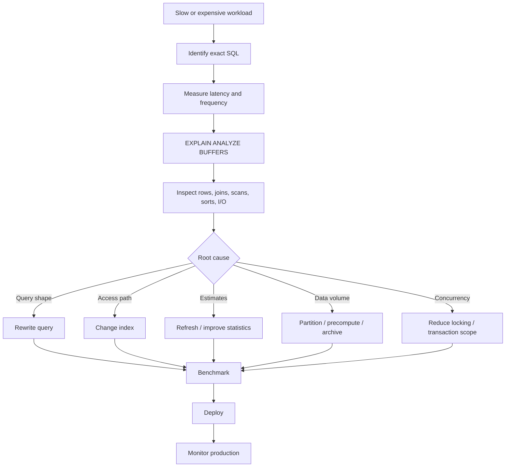
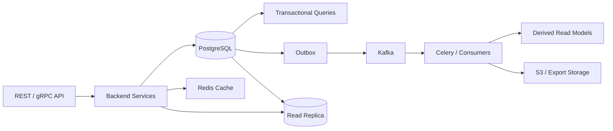

# 11- Query Optimization

## Overview

SQL query optimization is the process of improving query correctness, latency, throughput, and resource consumption by changing the query, schema, indexes, statistics, or execution strategy.

In a production e-commerce system, optimization should not begin with:

```text
"Which index should I add?"
```

It should begin with:

```text
What is slow?
Why is it slow?
How many rows are actually processed?
What execution plan did PostgreSQL choose?
What is the cheapest safe change?
Did the change improve the real workload?
```

A useful optimization model is:

```text
Application request
      ↓
SQL query
      ↓
Execution plan
      ↓
I/O + CPU + memory + locks
      ↓
Response latency
      ↓
User / service impact
```

The goal is not to make every query theoretically optimal. The goal is to make important production workloads sufficiently fast, predictable, reliable, and cost-effective.

---

## Query Optimization in the E-Commerce System

Typical high-value queries include:

| Workload | Example |
|---|---|
| Customer orders | Recent orders for one customer |
| Order details | Items, payments, shipments |
| Inventory | Current stock for a SKU |
| Reservation workers | Unexpired or expired reservations |
| Checkout | Atomic inventory and order operations |
| Admin search | Orders by status/date/customer |
| Product catalog | Active products and prices |
| Reporting | Revenue and sales aggregation |
| Outbox | Unpublished events |
| Audit/history | Order status transitions |

Optimization priorities should generally follow business impact:

```text
High-volume + latency-sensitive
        ↓
High-volume background jobs
        ↓
Expensive reports
        ↓
Rare administrative queries
```

A query executed 10,000 times per minute deserves more attention than a query executed once per day, even if the latter is individually slower.

---

## What Makes a Query Expensive?

A query can be expensive because of:

- Reading too many rows.
- Returning too many rows.
- Poor filtering.
- Missing or unsuitable indexes.
- Incorrect join strategy.
- Row multiplication.
- Large sorts.
- Hash aggregation.
- Window functions.
- Repeated correlated work.
- Poor cardinality estimates.
- Large transactions.
- Lock contention.
- Excessive network transfer.
- Application-side N+1 queries.
- Unnecessary columns.
- Data distribution changes.

The important distinction is:

```text
Query latency
≠
only CPU time
```

A query can spend significant time waiting for:

```text
disk I/O
locks
buffer availability
other database resources
```

---

## Start with the Actual Query

Never optimize an abstract ORM operation without inspecting the SQL it generates.

For PostgreSQL:

```sql
EXPLAIN (ANALYZE, BUFFERS)
SELECT
    id,
    status,
    grand_total,
    created_at
FROM orders
WHERE customer_id = 123
ORDER BY created_at DESC, id DESC
LIMIT 20;
```

This gives much more useful information than simply saying:

```text
"The endpoint is slow."
```

Optimization should begin with a reproducible SQL statement and realistic parameters.

---

## EXPLAIN

`EXPLAIN` shows the execution plan PostgreSQL intends to use.

Example:

```sql
EXPLAIN
SELECT
    id,
    status
FROM orders
WHERE customer_id = 123;
```

Typical plan concepts include:

```text
Seq Scan
Index Scan
Index Only Scan
Bitmap Index Scan
Bitmap Heap Scan
Nested Loop
Hash Join
Merge Join
Sort
Aggregate
HashAggregate
WindowAgg
Limit
```

`EXPLAIN` is useful for understanding the optimizer's decisions without actually executing the query.

---

## EXPLAIN ANALYZE

`EXPLAIN ANALYZE` executes the query and reports actual execution statistics.

Example:

```sql
EXPLAIN (ANALYZE, BUFFERS)
SELECT
    id,
    status,
    grand_total
FROM orders
WHERE customer_id = 123
ORDER BY created_at DESC, id DESC
LIMIT 20;
```

This allows comparison between:

```text
Estimated rows
vs
Actual rows
```

and:

```text
Estimated cost
vs
Actual execution time
```

Use it carefully on write queries because `EXPLAIN ANALYZE` actually executes them.

---

## BUFFERS

For production diagnosis, this is often more useful:

```sql
EXPLAIN (ANALYZE, BUFFERS)
...
```

It exposes buffer activity such as:

```text
shared hit
shared read
shared dirtied
shared written
```

A high number of shared reads can indicate significant physical or lower-level cache I/O.

A query with many shared hits may still be expensive because memory/cache access also consumes resources.

---

## Reading an Execution Plan

Consider:

```text
Limit
  -> Index Scan using orders_customer_created_id_idx
       Index Cond: (customer_id = 123)
```

This is generally a promising shape for:

```sql
WHERE customer_id = 123
ORDER BY created_at DESC, id DESC
LIMIT 20
```

The index can provide both:

```text
filtering
+
ordering
```

and PostgreSQL may stop after finding enough rows.

The important question is not whether the plan contains an index.

It is whether the plan efficiently processes the required workload.

---

## Estimated Rows vs Actual Rows

Suppose the plan reports:

```text
rows=100
actual rows=500000
```

That is a major estimation mismatch.

The planner may make poor decisions because it believes the operation is much smaller than reality.

Potential causes include:

- Stale statistics.
- Data distribution changes.
- Correlated columns.
- Skewed values.
- Insufficient statistics detail.
- Complex predicates.

A common first step is:

```sql
ANALYZE orders;
```

Then re-run the plan.

---

## Query Optimization Workflow

A disciplined workflow:



Avoid changing multiple unrelated variables at once.

Otherwise, you may not know which change actually helped.

---

## Reduce the Number of Rows Early

One of the most effective optimization principles is:

> Reduce the amount of data processed as early as the query semantics allow.

Prefer:

```sql
SELECT
    id,
    status,
    grand_total
FROM orders
WHERE customer_id = $1
  AND status = 'delivered';
```

over loading a large dataset and filtering it in Python.

The database is designed to perform filtering close to the data.

This is especially important for:

- Large tables.
- Aggregations.
- Joins.
- Window functions.
- Sorting.

---

## Avoid SELECT *

Instead of:

```sql
SELECT *
FROM orders
WHERE customer_id = $1;
```

prefer:

```sql
SELECT
    id,
    status,
    grand_total,
    created_at
FROM orders
WHERE customer_id = $1;
```

Benefits include:

- Less data read.
- Less network transfer.
- Less application memory.
- Lower serialization cost.
- Better API boundaries.
- More opportunities for index-only scans.

`SELECT *` is particularly problematic in backend APIs because database rows often contain columns that are not needed by the client.

---

## LIMIT Does Not Automatically Make Queries Cheap

This query:

```sql
SELECT *
FROM orders
ORDER BY created_at DESC
LIMIT 20;
```

may still require substantial work if PostgreSQL cannot efficiently obtain the required order.

Likewise:

```sql
SELECT *
FROM orders
WHERE customer_id = $1
LIMIT 20;
```

can still scan many rows if no useful access path exists.

`LIMIT` limits the returned rows, not necessarily the work required to find them.

---

## Optimize ORDER BY

Consider:

```sql
SELECT
    id,
    created_at,
    status
FROM orders
WHERE customer_id = $1
ORDER BY created_at DESC, id DESC
LIMIT 20;
```

A candidate index:

```sql
CREATE INDEX orders_customer_created_id_idx
ON orders (
    customer_id,
    created_at DESC,
    id DESC
);
```

This aligns:

```text
WHERE customer_id = ?
ORDER BY created_at DESC, id DESC
LIMIT 20
```

The query can potentially retrieve the first required rows directly from the index.

---

## OFFSET vs Keyset Pagination

This becomes expensive at high offsets:

```sql
SELECT
    id,
    created_at,
    status
FROM orders
ORDER BY created_at DESC, id DESC
LIMIT 20 OFFSET 100000;
```

PostgreSQL still has to advance through the earlier rows.

Keyset pagination is generally better for large datasets:

```sql
SELECT
    id,
    created_at,
    status
FROM orders
WHERE (created_at, id) < ($1, $2)
ORDER BY created_at DESC, id DESC
LIMIT 20;
```

with:

```sql
CREATE INDEX orders_created_id_idx
ON orders (
    created_at DESC,
    id DESC
);
```

Keyset pagination provides a more scalable continuation mechanism for large ordered datasets.

---

## Optimize JOINs

Suppose:

```sql
SELECT
    o.id,
    oi.sku_snapshot,
    oi.quantity
FROM orders AS o
JOIN order_items AS oi
    ON oi.order_id = o.id
WHERE o.id = $1;
```

The child relationship should generally have an appropriate access path:

```sql
CREATE INDEX order_items_order_id_idx
ON order_items (order_id);
```

But query optimization is not simply:

```text
"Add an index to every JOIN column."
```

Consider:

- Join cardinality.
- Filtering before joining.
- Parent/child sizes.
- Join algorithm.
- Existing indexes.
- Actual execution plan.

---

## Prevent Accidental Row Multiplication

Consider:

```sql
SELECT
    o.id,
    SUM(oi.line_total) AS item_total,
    COUNT(p.id) AS payment_count
FROM orders AS o
JOIN order_items AS oi
    ON oi.order_id = o.id
LEFT JOIN payments AS p
    ON p.order_id = o.id
GROUP BY o.id;
```

If an order has:

```text
3 order items
2 payments
```

the join can produce:

```text
3 × 2 = 6 rows
```

before aggregation.

This can both:

```text
produce incorrect totals
+
increase query work
```

A safer design may aggregate each one-to-many relationship separately before joining.

---

## EXISTS Instead of Unnecessary JOINs

If the requirement is:

```text
Find customers who have at least one delivered order.
```

prefer an existence-oriented query:

```sql
SELECT
    c.id,
    c.email
FROM customers AS c
WHERE EXISTS (
    SELECT 1
    FROM orders AS o
    WHERE o.customer_id = c.id
      AND o.status = 'delivered'
);
```

rather than joining all matching orders when their columns are not needed.

PostgreSQL can optimize `EXISTS` into efficient semi-join strategies.

Do not assume `EXISTS` is always faster, but use the construct that matches the required semantics.

---

## Avoid NOT IN NULL Problems

This can produce surprising results:

```sql
WHERE id NOT IN (
    SELECT customer_id
    FROM orders
)
```

if the subquery can contain `NULL`.

When the requirement is non-existence, prefer:

```sql
WHERE NOT EXISTS (
    SELECT 1
    FROM orders AS o
    WHERE o.customer_id = c.id
)
```

This avoids the three-valued-logic trap associated with `NOT IN` and NULL.

---

## Avoid Functions Around Indexed Predicates

Suppose:

```sql
WHERE LOWER(email) = LOWER($1)
```

and only this index exists:

```sql
CREATE INDEX customers_email_idx
ON customers (email);
```

The normal index may not efficiently support the expression.

If this exact access pattern is required, consider:

```sql
CREATE INDEX customers_lower_email_idx
ON customers (LOWER(email));
```

or normalize the stored value and query it directly.

Do not automatically assume an expression is bad. The issue is whether the expression matches an available access path.

---

## Implicit Type Conversion

Query parameters should use compatible data types.

For example, if:

```sql
customer_id bigint
```

then the application should bind a numeric parameter with the appropriate type rather than relying on unnecessary conversions.

Implicit conversions can affect:

- Index usability.
- Cardinality estimates.
- Query plans.
- Runtime cost.

The correct fix is usually to make application and database types agree.

---

## Aggregation Optimization

For:

```sql
SELECT
    customer_id,
    SUM(grand_total) AS total
FROM orders
WHERE status = 'delivered'
GROUP BY customer_id;
```

consider:

```text
How many rows enter the aggregate?
How selective is status?
How many customer groups exist?
Can filtering happen earlier?
Is an index useful?
Would pre-aggregation be better?
```

Do not assume an index automatically makes aggregation fast.

For very large analytical workloads, consider:

- Pre-aggregated tables.
- Materialized views.
- Partitioning.
- Dedicated analytics infrastructure.

---

## Window Function Optimization

Window functions can require sorting and processing large partitions.

For:

```sql
SELECT
    id,
    customer_id,
    grand_total,
    ROW_NUMBER() OVER (
        PARTITION BY customer_id
        ORDER BY created_at DESC, id DESC
    ) AS row_number
FROM orders;
```

consider:

- Filtering unnecessary rows before the window.
- Appropriate indexes.
- Partition size.
- Sort cost.
- `work_mem`.
- Whether the result should be precomputed.

A window function is not inherently inefficient, but applying it to millions of unnecessary rows is.

---

## Correlated Subqueries

A correlated subquery references a value from the outer query.

Example:

```sql
SELECT
    c.id,
    (
        SELECT MAX(o.created_at)
        FROM orders AS o
        WHERE o.customer_id = c.id
    ) AS last_order_at
FROM customers AS c;
```

Depending on the planner and query shape, this may be efficient.

But a correlated operation can become expensive when repeated work is required for many outer rows.

Possible alternatives include:

```text
JOIN
GROUP BY
pre-aggregation
window function
EXISTS
```

Do not rewrite every correlated subquery automatically.

Measure first.

---

## CTEs and Optimization

Modern PostgreSQL can inline eligible non-recursive, side-effect-free CTEs.

Therefore:

```sql
WITH customer_orders AS (
    SELECT
        customer_id,
        COUNT(*) AS order_count
    FROM orders
    GROUP BY customer_id
)
SELECT *
FROM customer_orders
WHERE order_count > 10;
```

should not automatically be considered slower because it uses a CTE.

However, explicit materialization changes behavior:

```sql
WITH customer_orders AS MATERIALIZED (
    ...
)
```

and:

```sql
WITH customer_orders AS NOT MATERIALIZED (
    ...
)
```

can influence execution.

Use these options when there is a demonstrated reason, not as a generic optimization technique.

---

## Predicate Pushdown

Suppose:

```sql
SELECT *
FROM (
    SELECT
        id,
        customer_id,
        status,
        created_at
    FROM orders
) AS o
WHERE customer_id = $1;
```

A capable optimizer can often push predicates through query layers when semantics allow it.

Do not manually rewrite every query solely to imitate an imagined execution order.

Instead:

```text
write clear SQL
+
inspect the execution plan
```

The logical query structure and physical execution plan are not the same thing.

---

## Query Plan Stability

A query can become slower without any application code changing.

Reasons include:

- Data volume increased.
- Data distribution changed.
- Statistics changed.
- Cache state changed.
- Indexes changed.
- PostgreSQL version changed.
- Parameter values have different selectivity.
- Hardware or I/O characteristics changed.

Therefore production monitoring should track query performance over time.

A query that was fast with:

```text
100,000 rows
```

may not remain fast at:

```text
100 million rows
```

---

## Parameter Sensitivity

A query can behave differently for different parameters.

For example:

```sql
WHERE status = $1
```

may produce very different row counts for:

```text
pending
```

versus:

```text
delivered
```

depending on the data distribution.

Prepared statements and planning behavior can therefore matter for certain workloads.

When a query is unexpectedly fast for one parameter and slow for another, inspect:

- Parameter selectivity.
- Estimated vs actual rows.
- Chosen plan.
- Statistics.
- PostgreSQL planning behavior.

Do not immediately force a plan.

---

## Sorting and work_mem

Operations such as:

```sql
ORDER BY
GROUP BY
DISTINCT
window functions
```

can require substantial memory.

If memory is insufficient, PostgreSQL may use temporary files.

Inspect execution plans for:

```text
Sort Method
Disk
```

or other evidence of external processing.

Increasing `work_mem` can help some queries, but global increases can be dangerous because multiple operations and concurrent sessions can consume memory.

Tune carefully.

---

## COUNT vs EXISTS

If the application only needs:

```text
Does at least one row exist?
```

avoid:

```sql
SELECT COUNT(*)
FROM orders
WHERE customer_id = $1;
```

when a simple existence test is sufficient.

Use:

```sql
SELECT EXISTS (
    SELECT 1
    FROM orders
    WHERE customer_id = $1
);
```

The database can stop once existence has been established.

If the application genuinely needs the count, use `COUNT`.

Do not replace semantic requirements with performance assumptions.

---

## Avoid Application-Side Row-by-Row Processing

Inefficient:

```python
orders = load_orders()

for order in orders:
    load_order_items(order.id)
```

This can create:

```text
1 query
+
N queries
=
N+1 queries
```

Instead, load the required relationships in an appropriately bounded query.

In Django:

```python
orders = (
    Order.objects
    .filter(customer_id=customer_id)
    .prefetch_related("items")
)
```

For reporting or complex access patterns, a carefully designed SQL query may be more appropriate.

---

## Django Query Optimization

Common Django tools include:

```python
select_related()
prefetch_related()
only()
defer()
annotate()
Exists()
Subquery()
```

Example:

```python
orders = (
    Order.objects
    .filter(customer_id=customer_id)
    .select_related("customer")
    .prefetch_related("items")
    .order_by("-created_at", "-id")[:20]
)
```

The important point is to understand the SQL produced.

ORM abstraction does not remove the need for database knowledge.

---

## FastAPI Query Optimization

FastAPI itself does not optimize SQL.

The optimization boundary is usually:

```text
FastAPI
   ↓
service/repository layer
   ↓
SQL / ORM
   ↓
PostgreSQL
```

A useful repository method should return only the required fields:

```python
def get_recent_orders(connection, customer_id: int) -> list[tuple]:
    with connection.cursor() as cursor:
        cursor.execute(
            """
            SELECT
                id,
                status,
                grand_total,
                created_at
            FROM orders
            WHERE customer_id = %s
            ORDER BY created_at DESC, id DESC
            LIMIT 20
            """,
            (customer_id,),
        )
        return cursor.fetchall()
```

Use parameter binding rather than string interpolation.

---

## Reduce Network and Serialization Cost

A query can be database-fast but endpoint-slow.

Consider:

```text
PostgreSQL
    ↓
10 MB result
    ↓
Python objects
    ↓
JSON serialization
    ↓
Nginx
    ↓
Client
```

Optimizing SQL execution alone does not solve the entire request.

Measure:

```text
DB execution
+
DB-to-application transfer
+
Python processing
+
serialization
+
network
```

This is particularly important for REST and gRPC APIs returning large datasets.

---

## Large Exports

Do not run an enormous synchronous query through an HTTP request simply because the SQL is optimized.

For example:

```text
Admin API
   ↓
request export
   ↓
Celery
   ↓
PostgreSQL
   ↓
stream/process
   ↓
S3
   ↓
download URL
```

This separates:

```text
interactive request latency
```

from:

```text
large analytical workload
```

Query optimization remains important, but workload architecture matters as much as SQL syntax.

---

## Query Optimization and Transactions

A query may be fast individually but problematic inside a long transaction.

For example:

```text
BEGIN
  expensive query
  application processing
  external API call
  more SQL
COMMIT
```

This can hold locks or snapshots longer than necessary.

Prefer:

```text
short database transaction
        ↓
commit
        ↓
external work
```

when business correctness allows it.

Keep database transactions focused on atomic database state changes.

---

## Lock Contention

Sometimes the query is not CPU- or I/O-bound.

It is waiting.

For example:

```text
Transaction A
    locks inventory row
        ↓
Transaction B
    waits for same row
```

The second request's latency may appear as:

```text
"slow SQL"
```

but the underlying issue is concurrency.

When investigating production latency, distinguish:

```text
execution time
vs
lock wait time
```

This changes the solution completely.

---

## Optimize Inventory Updates Atomically

A checkout operation should avoid:

```text
SELECT available_quantity
        ↓
Python checks quantity
        ↓
UPDATE inventory
```

when concurrent requests can modify the same row.

A safer pattern is:

```sql
UPDATE inventory
SET available_quantity = available_quantity - $1,
    updated_at = NOW()
WHERE variant_id = $2
  AND available_quantity >= $1
RETURNING variant_id, available_quantity;
```

The database performs the condition and state change atomically.

Query optimization here is not just about speed.

It is about correctness under concurrency.

---

## Partial Index for Worker Queries

Suppose a Celery worker repeatedly executes:

```sql
SELECT
    id,
    aggregate_type,
    aggregate_id,
    event_type,
    payload
FROM outbox_events
WHERE published_at IS NULL
ORDER BY created_at, id
LIMIT 100
FOR UPDATE SKIP LOCKED;
```

A candidate index:

```sql
CREATE INDEX outbox_pending_idx
ON outbox_events (created_at, id)
WHERE published_at IS NULL;
```

This reduces the index's size and targets the worker's active population.

The worker still needs correct transaction handling and idempotent publishing.

---

## Query Optimization and Redis

Do not use Redis as the first response to every slow SQL query.

A better sequence is:

```text
Slow PostgreSQL query
        ↓
Check SQL correctness
        ↓
EXPLAIN
        ↓
Fix query/index/statistics
        ↓
Measure again
        ↓
Still too expensive?
        ↓
Consider caching / precomputation
```

Redis is appropriate when the workload genuinely benefits from caching or fast derived reads.

A cache can hide database problems while introducing:

- Staleness.
- Invalidation complexity.
- Memory cost.
- Operational complexity.

---

## Query Optimization and Kafka

Kafka does not directly optimize PostgreSQL queries.

It can change the architecture when expensive work does not need synchronous execution:

```text
API
 ↓
transaction
 ↓
outbox
 ↓
Kafka
 ↓
consumer
 ↓
derived read model
```

For example, a product-sales ranking can be incrementally maintained instead of recalculating a massive aggregation for every API request.

This is an architectural optimization rather than a SQL syntax optimization.

---

## Query Optimization and Microservices

A service should avoid querying another service's database directly merely to avoid a local query.

Instead:

```text
Service A
   ↓
API / event contract
   ↓
Service B
```

If a cross-service query is required frequently, consider:

- API composition.
- Event-driven projections.
- Read models.
- Data replication where justified.
- Materialized views within a service boundary.

Database optimization should not violate ownership boundaries.

---

## Security and Query Optimization

Optimization must not weaken authorization.

Avoid:

```python
Order.objects.get(id=order_id)
```

when the endpoint requires customer ownership.

Prefer a scoped query:

```python
Order.objects.get(
    id=order_id,
    customer_id=request.user.customer_id,
)
```

The optimized query must still enforce:

```text
tenant
+
customer
+
authorization
```

Security predicates should not be removed simply because they appear to reduce query performance.

Instead, design indexes that support secure access patterns.

---

## Observability

Use database and application metrics together.

Useful application metrics:

- Endpoint latency.
- DB time per request.
- Query count per request.
- Error rate.
- Timeout rate.
- Connection pool wait time.

Useful PostgreSQL metrics:

- Query execution time.
- Calls per query.
- Shared buffer activity.
- Sequential scans.
- Index scans.
- Temporary files.
- Lock waits.
- Deadlocks.
- Active connections.

`pg_stat_statements` is particularly useful for identifying high-cost or high-frequency SQL.

---

## Query Optimization in Production

A safe production process:

```text
Identify problematic query
        ↓
Capture representative parameters
        ↓
Measure baseline
        ↓
EXPLAIN (ANALYZE, BUFFERS)
        ↓
Develop candidate change
        ↓
Benchmark realistic data
        ↓
Review write/storage impact
        ↓
Deploy safely
        ↓
Monitor
        ↓
Rollback or iterate if required
```

Never benchmark only against a tiny development database.

Query plans and performance depend heavily on:

```text
data volume
data distribution
indexes
statistics
hardware
cache state
concurrency
```

---

## Benchmarking Correctly

A good benchmark should include:

- Production-like row counts.
- Production-like distributions.
- Representative parameters.
- Warm and cold cache considerations where relevant.
- Concurrent workload.
- Realistic indexes.
- Comparable PostgreSQL configuration.

Compare:

```text
Before
-----
execution time
rows processed
buffers
CPU
temporary I/O

After
-----
execution time
rows processed
buffers
CPU
temporary I/O
```

A query that becomes 20% faster but doubles write overhead may not be a net improvement.

---

## Common Optimization Mistakes

### Adding an Index Before Inspecting the Plan

Why it happens:

```text
Slow query → missing index
```

Why it is wrong:

The bottleneck may actually be:

- Incorrect join.
- Bad cardinality estimate.
- Excessive rows.
- Sort.
- Locking.
- Application-side processing.

Use `EXPLAIN` first.

---

### Optimizing the Wrong Query

A developer may optimize:

```text
slowest query by execution time
```

when the real production impact comes from:

```text
moderately expensive query × millions of executions
```

Prioritize by:

```text
total workload cost
=
frequency × resource consumption
```

---

### Trusting Tiny Development Data

A query that is instant with:

```text
1,000 rows
```

may become unacceptable with:

```text
100 million rows
```

Test with realistic data volume and distribution.

---

### Using SELECT * Everywhere

This increases:

- Database I/O.
- Network transfer.
- Application memory.
- Serialization work.

Select only required columns.

---

### Using OFFSET for Deep Pagination

Deep offsets require PostgreSQL to advance through earlier rows.

Use keyset pagination for suitable high-volume APIs.

---

### Assuming CTEs Are Always Materialized

Modern PostgreSQL can inline eligible CTEs.

Do not claim:

```text
CTE = temporary result table
```

without considering PostgreSQL version and CTE properties.

Use `MATERIALIZED` or `NOT MATERIALIZED` intentionally.

---

### Assuming EXISTS Is Always Faster

`EXISTS` often expresses existence efficiently, but PostgreSQL may transform different SQL constructs into similar plans.

Measure the actual workload.

---

### Increasing work_mem Globally

More memory can help sorts and hashes, but excessive global settings can multiply memory consumption across concurrent operations.

Tune carefully.

---

### Forcing Index Usage

PostgreSQL's planner may correctly decide that a sequential scan is cheaper.

Do not fight the planner without understanding:

```text
cardinality
statistics
selectivity
table size
cache state
```

---

### Ignoring Lock Waits

A query can have low execution cost but high user-visible latency because it is waiting for another transaction.

Always consider concurrency when investigating production latency.

---

## Senior Optimization Checklist

### Query Shape

- Is the query returning only required columns?
- Is filtering performed in SQL?
- Is the result bounded?
- Is pagination appropriate?
- Is the ordering deterministic?
- Are joins producing the intended grain?
- Is `EXISTS` more appropriate than a row-producing join?
- Are aggregations performed at the correct grain?

### Execution Plan

- What scan type is used?
- Are estimated and actual rows close?
- Are joins appropriate?
- Is there an unexpected sort?
- Is there temporary I/O?
- Are buffers reasonable?
- Is PostgreSQL choosing a sequential scan intentionally?

### Indexing

- Does an existing index support the query?
- Is a composite index appropriate?
- Does column order match the access pattern?
- Would a partial index help?
- Is the index worth its write/storage cost?

### Concurrency

- Is the query waiting on locks?
- Is the transaction too long?
- Are multiple workers competing for the same rows?
- Could an atomic statement replace read-then-write application logic?

### Application

- Is the ORM generating N+1 queries?
- Is the result unnecessarily large?
- Is Python doing work PostgreSQL could do efficiently?
- Is serialization becoming a bottleneck?
- Is the database connection pool saturated?

### Architecture

- Should this workload be asynchronous?
- Should the result be cached?
- Should it be precomputed?
- Should a materialized view or read model be used?
- Does the workload belong in PostgreSQL at all?

---

## Query Optimization Decision Framework

A senior engineer should classify the bottleneck before choosing a solution.

| Bottleneck | Typical solution |
|---|---|
| Too many rows | Better predicates / query shape |
| Missing access path | Index |
| Poor composite index | Redesign index |
| Bad cardinality estimate | Statistics / extended statistics |
| Large sort | Better ordering/index/filtering |
| Large aggregation | Pre-aggregation / partitioning / query redesign |
| N+1 | Join / prefetch / batch loading |
| Deep pagination | Keyset pagination |
| Lock contention | Shorter transactions / concurrency redesign |
| Large response | Projection / pagination / async export |
| Repeated expensive calculation | Cache / materialized view / read model |
| High-frequency workload | Optimize total workload, not one query |
| Analytical workload | Precompute / analytics system |

The optimization process is therefore:

```text
Measure
→ classify bottleneck
→ choose intervention
→ benchmark
→ deploy
→ monitor
```

---

## Production Architecture

A mature e-commerce system typically separates different workload types:



The objective is not to move every slow query somewhere else.

The objective is to ensure each workload executes in the system best suited to its requirements.

---

## Disaster Recovery and Reliability

Query optimization should not compromise recoverability.

Be careful when introducing:

- Large indexes.
- Large materialized structures.
- Derived tables.
- Caches.
- Read replicas.
- Partitioning.

Source-of-truth transactional data should remain recoverable.

Derived data should ideally be:

```text
rebuildable
+
versioned
+
observable
```

For example, a cached product-ranking result should not become the only copy of business-critical information.

---

## Cost Optimization

Database performance and infrastructure cost are closely related.

An inefficient query can increase:

```text
CPU
I/O
storage activity
WAL
replication
connection utilization
```

At scale:

```text
small per-query inefficiency
×
high query volume
=
large infrastructure cost
```

Optimization can therefore reduce both latency and infrastructure requirements.

However, a more expensive index or replica may be justified if it protects critical latency requirements.

Optimize for the business workload, not for infrastructure cost alone.

---

## Interview Traps

### What is the first thing you should do when a query is slow?

Capture the actual SQL and inspect:

```sql
EXPLAIN (ANALYZE, BUFFERS)
```

Do not immediately add an index.

---

### Why can PostgreSQL choose a sequential scan when an index exists?

Because the planner estimates that a sequential scan is cheaper.

This can happen when:

- Many rows match.
- The table is small.
- The index is poorly selective.
- Statistics are inaccurate.
- The required ordering does not match the index.

---

### What is the difference between estimated and actual rows?

Estimated rows come from the planner's statistics and cost model.

Actual rows are observed during execution.

Large discrepancies can lead to poor plan choices.

---

### Why is `LIMIT 20` not always enough to make a query fast?

Because PostgreSQL may need to process or sort a large amount of data before it can determine which 20 rows qualify.

An appropriate index can sometimes make the limit highly efficient.

---

### Why is keyset pagination generally better than deep OFFSET pagination?

Offset pagination requires PostgreSQL to advance past earlier rows.

Keyset pagination uses the previous row's ordering values as a continuation point, allowing the database to seek closer to the required position.

---

### Does adding an index always improve performance?

No.

Indexes can:

- Slow writes.
- Increase storage.
- Increase WAL.
- Increase replication work.
- Increase maintenance.

The index must provide enough workload benefit to justify its cost.

---

### Are CTEs always materialized?

No.

Modern PostgreSQL can inline eligible CTEs.

`MATERIALIZED` and `NOT MATERIALIZED` can be used when explicit behavior is justified.

---

### Is a slow query always a SQL problem?

No.

The bottleneck may be:

```text
lock contention
connection pool saturation
network transfer
serialization
application processing
```

Measure the complete request lifecycle.

---

### Should Redis be used whenever PostgreSQL is slow?

No.

First determine whether the SQL, indexes, statistics, or schema can solve the problem.

Introduce caching when the workload actually benefits from it.

---

## Key Takeaways

- **Optimize from evidence: capture the real SQL, inspect `EXPLAIN (ANALYZE, BUFFERS)`, identify the actual bottleneck, then choose the smallest effective change.**
- **Reduce rows, columns, joins, sorting, and repeated work as early as query semantics safely allow; align indexes with real filtering, ordering, and pagination patterns.**
- **Treat query performance as a full request-path problem: database execution, locks, connection pools, network transfer, Python processing, and serialization can all contribute to latency.**
- **Validate optimizations against realistic data volume, distribution, and concurrency, and consider write amplification, WAL, replication, storage, and infrastructure cost.**
- **Senior-level optimization is workload and architecture driven: use query rewrites and indexes first where appropriate, then consider precomputation, Redis, read models, asynchronous processing, replicas, or analytics infrastructure when the workload requires them.**