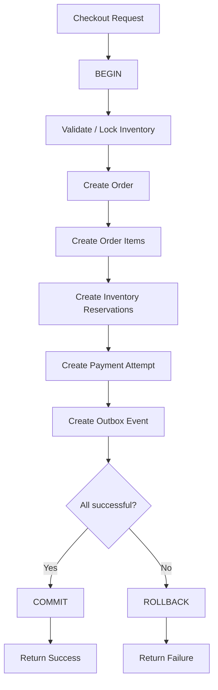
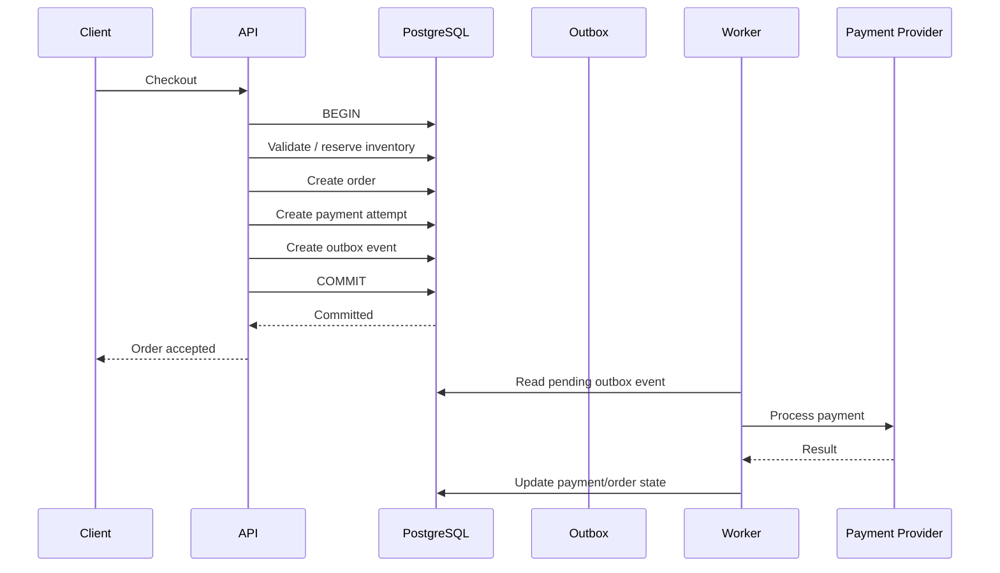
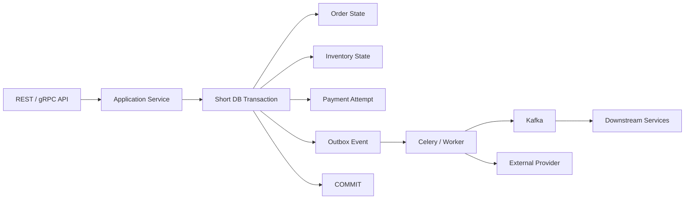

# 12- Transaction Scenarios

## Overview

Transactions are the foundation of correctness in the e-commerce database. They define which database changes succeed or fail together and provide the isolation required when multiple customers, workers, and services modify the same data concurrently.

For this project, transactions are especially important for:

- Checkout.
- Inventory reservation.
- Payment state changes.
- Order status transitions.
- Coupon usage.
- Outbox event creation.
- Background job processing.
- Concurrent inventory updates.
- Idempotent request handling.

A useful mental model is:

```text
Business operation
      ↓
Database transaction
      ↓
Read required state
      ↓
Validate / lock / modify
      ↓
Commit
      ↓
Durable new state
```

The transaction boundary should represent the smallest unit of database state that must change atomically.

---

## ACID in the E-Commerce Database

PostgreSQL transactions provide the ACID properties.

| Property | Meaning | E-Commerce Example |
|---|---|---|
| Atomicity | All transaction changes succeed or fail together | Order + order items + inventory reservation |
| Consistency | Constraints and invariants remain valid | Inventory cannot become negative |
| Isolation | Concurrent transactions do not incorrectly interfere | Two checkouts cannot both consume the same stock |
| Durability | Committed data survives failures according to durability configuration | Completed order remains after restart |

ACID does not mean that business workflows spanning multiple services become one atomic transaction.

For example:

```text
PostgreSQL transaction
        ↓
Kafka
        ↓
Payment service
        ↓
Shipping service
```

cannot normally be treated as one database transaction.

Distributed workflows require patterns such as:

- Outbox.
- Idempotency.
- Retries.
- Compensation.
- Saga-style orchestration where appropriate.

---

## Transaction Boundary

A transaction should contain the database changes that must succeed or fail together.

For example, checkout may require:

```text
Create order
Create order items
Reserve inventory
Create payment attempt
Create outbox event
```

If these changes represent one atomic database state transition, they belong in one transaction.

Conceptually:



The external payment provider should generally not be called while holding the database transaction open.

---

## Scenario: Creating an Order

A simple order creation transaction might look like:

```sql
BEGIN;

INSERT INTO orders (
    id,
    customer_id,
    status,
    subtotal,
    grand_total,
    created_at
)
VALUES (
    $1,
    $2,
    'pending',
    $3,
    $4,
    NOW()
);

INSERT INTO order_items (
    id,
    order_id,
    sku_snapshot,
    quantity,
    unit_price,
    line_total
)
VALUES
    ($5, $1, $6, $7, $8, $9);

COMMIT;
```

If the second insert fails:

```text
order insert
     ↓
order item insert fails
     ↓
ROLLBACK
```

The order should not remain partially created.

---

## Scenario: Order Creation with Multiple Items

For multiple items:

```sql
BEGIN;

INSERT INTO orders (
    id,
    customer_id,
    status,
    subtotal,
    grand_total,
    created_at
)
VALUES (
    $1,
    $2,
    'pending',
    $3,
    $4,
    NOW()
);

INSERT INTO order_items (
    id,
    order_id,
    sku_snapshot,
    quantity,
    unit_price,
    line_total
)
VALUES
    ($5, $1, $6, $7, $8, $9),
    ($10, $1, $11, $12, $13, $14),
    ($15, $1, $16, $17, $18, $19);

COMMIT;
```

If any required item insert violates a constraint, the entire transaction can roll back.

This provides atomic order construction.

---

## Scenario: Inventory Reservation

Inventory is concurrency-sensitive.

A naive implementation is:

```text
SELECT available_quantity
        ↓
Python checks quantity
        ↓
UPDATE inventory
```

Two concurrent requests can both observe the same quantity.

For example:

```text
Initial stock = 1

Request A reads 1
Request B reads 1

A decides it can purchase
B decides it can purchase

Both attempt to consume stock
```

This is a race condition.

---

## Atomic Inventory Update

A safer approach is to combine the condition and update:

```sql
UPDATE inventory
SET
    available_quantity = available_quantity - $1,
    updated_at = NOW()
WHERE variant_id = $2
  AND available_quantity >= $1
RETURNING
    variant_id,
    available_quantity;
```

The application checks whether a row was returned.

```text
row returned
→ reservation succeeded

no row returned
→ insufficient inventory
```

This is often preferable to a separate read followed by a write.

The database performs the critical state transition atomically.

---

## Inventory Reservation with Row Locking

Sometimes the application needs to inspect multiple pieces of state before making the decision.

In that case:

```sql
BEGIN;

SELECT
    variant_id,
    available_quantity
FROM inventory
WHERE variant_id = $1
FOR UPDATE;
```

The selected row is locked until the transaction ends.

Then:

```sql
UPDATE inventory
SET
    available_quantity = available_quantity - $2,
    updated_at = NOW()
WHERE variant_id = $1;

INSERT INTO inventory_reservations (
    id,
    variant_id,
    order_id,
    quantity,
    status,
    created_at
)
VALUES (
    $3,
    $1,
    $4,
    $2,
    'active',
    NOW()
);

COMMIT;
```

Concurrent transactions attempting to lock the same inventory row must coordinate.

---

## Atomic Update vs SELECT FOR UPDATE

| Pattern | Best use |
|---|---|
| Atomic conditional `UPDATE` | Simple invariant such as sufficient stock |
| `SELECT ... FOR UPDATE` | Multiple dependent decisions require locked state |
| `SKIP LOCKED` | Concurrent workers processing independent queue items |
| Advisory lock | Explicit application-defined locking where appropriate |

Prefer the simplest mechanism that correctly enforces the invariant.

Do not use row locks simply because they are available.

---

## Scenario: Checkout

A robust checkout flow usually separates database state changes from external side effects.



The key principle is:

> Do not hold a database transaction open while waiting for an external network service.

---

## Why External API Calls Should Not Be Inside Transactions

Avoid:

```text
BEGIN
  reserve inventory
  call payment provider
  wait 2 seconds
  update payment
COMMIT
```

Problems include:

- Long transaction duration.
- Locks held longer.
- More contention.
- Increased connection occupancy.
- Greater rollback cost.
- External timeout can leave the database transaction open.
- Database throughput decreases under load.

Prefer:

```text
Short database transaction
        ↓
Commit durable intent
        ↓
External processing
        ↓
Persist result
```

Use idempotency and reconciliation to handle uncertain external outcomes.

---

## Scenario: Payment Attempt

A payment attempt can be recorded transactionally:

```sql
BEGIN;

INSERT INTO payments (
    id,
    order_id,
    status,
    amount,
    created_at
)
VALUES (
    $1,
    $2,
    'pending',
    $3,
    NOW()
);

INSERT INTO outbox_events (
    id,
    aggregate_type,
    aggregate_id,
    event_type,
    payload,
    created_at
)
VALUES (
    $4,
    'order',
    $2,
    'payment_requested',
    $5,
    NOW()
);

COMMIT;
```

The database now contains durable intent to process the payment.

A worker can safely process the event later.

---

## Scenario: Payment Retry

Payment providers can fail transiently.

Do not simply retry blindly.

A robust model records:

```text
payment attempt 1 → failed
payment attempt 2 → pending
payment attempt 3 → succeeded
```

The `payments` table can therefore contain multiple attempts for one order.

The database transaction should make each state transition atomic.

For example:

```sql
UPDATE payments
SET
    status = 'succeeded',
    provider_transaction_id = $1,
    updated_at = NOW()
WHERE id = $2
  AND status = 'pending'
RETURNING id;
```

The status predicate prevents an already-finalized payment from being incorrectly transitioned.

---

## Conditional State Transitions

Instead of:

```text
SELECT status
        ↓
Python checks status
        ↓
UPDATE status
```

consider:

```sql
UPDATE orders
SET
    status = 'shipped',
    updated_at = NOW()
WHERE id = $1
  AND status = 'processing'
RETURNING id, status;
```

The database performs:

```text
expected current state
+
new state
```

atomically.

If no row is returned:

```text
order did not exist
OR
state was no longer processing
```

The application can then handle the conflict explicitly.

---

## Order State Machine

A transaction can enforce an individual state transition, but valid state transitions should also be defined at the application/domain level.

Example:

```text
pending
   ↓
processing
   ↓
shipped
   ↓
delivered
```

Possible terminal states:

```text
cancelled
refunded
```

Do not assume that every status can transition directly to every other status.

For complex workflows, maintain explicit transition rules.

---

## Scenario: Order Status History

When changing order status, both the current state and history may need to change atomically:

```sql
BEGIN;

UPDATE orders
SET
    status = 'shipped',
    updated_at = NOW()
WHERE id = $1
  AND status = 'processing'
RETURNING id;

INSERT INTO order_status_history (
    id,
    order_id,
    status,
    created_at
)
VALUES (
    $2,
    $1,
    'shipped',
    NOW()
);

COMMIT;
```

However, the insert should only happen if the update actually changed the expected order.

A transaction does not automatically make incorrect sequencing correct.

---

## Scenario: Coupon Usage

Coupon usage often requires several conditions:

```text
Coupon exists
+
Coupon active
+
Customer eligible
+
Usage limit available
+
Customer has not exceeded limit
```

These checks can be vulnerable to concurrent requests.

A naive implementation:

```text
SELECT usage count
        ↓
Python validates
        ↓
INSERT usage
```

can allow two concurrent requests to both observe available capacity.

Use appropriate database constraints and locking/atomic logic.

---

## Constraints Before Application Checks

If a rule can be represented declaratively, prefer a database constraint.

For example:

```sql
CREATE UNIQUE INDEX coupon_usages_customer_coupon_uidx
ON coupon_usages (
    coupon_id,
    customer_id
);
```

if the business rule is:

```text
A customer can use a coupon only once.
```

The database then becomes the final enforcement point.

Application validation remains useful for user-friendly errors, but correctness should not depend solely on a prior application query.

---

## Scenario: Idempotent Order Creation

Clients can retry requests because of:

- Network timeouts.
- Mobile retries.
- Reverse-proxy retries.
- Client retries.
- Worker retries.

Without idempotency:

```text
POST /orders
        ↓
request succeeds
        ↓
response lost
        ↓
client retries
        ↓
second order created
```

Use an idempotency key.

A transaction can enforce uniqueness:

```sql
CREATE UNIQUE INDEX orders_idempotency_key_uidx
ON orders (customer_id, idempotency_key);
```

Then the database prevents duplicate order creation for the same customer/key pair.

---

## Idempotency and Transaction Boundaries

A typical pattern:

```text
BEGIN
  insert idempotency record / order
  create order items
  reserve inventory
  create outbox event
COMMIT
```

If the transaction fails:

```text
all changes roll back
```

If it commits:

```text
retry sees existing idempotency state
```

The API can return the previously created order rather than executing the operation again.

The exact idempotency design depends on whether the original response is also stored.

---

## Scenario: Outbox Pattern

The outbox pattern solves the problem of atomically recording:

```text
database state change
+
event publication intent
```

Example:

```sql
BEGIN;

UPDATE orders
SET
    status = 'processing',
    updated_at = NOW()
WHERE id = $1;

INSERT INTO outbox_events (
    id,
    aggregate_type,
    aggregate_id,
    event_type,
    payload,
    created_at
)
VALUES (
    $2,
    'order',
    $1,
    'order_processing',
    $3,
    NOW()
);

COMMIT;
```

The application does not directly publish to Kafka inside this database transaction.

A separate worker publishes the durable outbox event.

---

## Why the Outbox Matters

Without an outbox:

```text
UPDATE PostgreSQL
      ↓
publish Kafka
```

can fail between operations.

For example:

```text
PostgreSQL commit succeeds
Kafka publish fails
```

Now the database contains a state change but the event was lost.

With the outbox:

```text
PostgreSQL transaction
├── business state
└── outbox event

        ↓

commit

        ↓

worker publishes event
```

The publication can be retried independently.

---

## Outbox Processing Transaction

A worker can claim events using:

```sql
BEGIN;

SELECT
    id,
    aggregate_type,
    aggregate_id,
    event_type,
    payload
FROM outbox_events
WHERE published_at IS NULL
ORDER BY created_at, id
LIMIT 100
FOR UPDATE SKIP LOCKED;
```

The worker then processes the selected events.

The exact transaction boundary depends on whether the event is marked before or after publication.

Because Kafka publication and PostgreSQL commit are separate systems, the worker must be designed for retries and duplicate delivery.

---

## Kafka and At-Least-Once Processing

A typical flow is:

```text
PostgreSQL
   ↓
Outbox
   ↓
Worker
   ↓
Kafka
   ↓
Consumer
   ↓
Database
```

A failure can occur after Kafka accepts the message but before the worker records:

```text
published_at
```

The worker may publish the same event again.

Therefore consumers should be idempotent.

Possible techniques include:

```text
event_id unique constraint
processed_events table
idempotent state transition
upsert
```

A transaction solves database atomicity, not cross-system exactly-once delivery.

---

## Scenario: Background Job Queue

Transactions can be used to claim work safely.

```sql
BEGIN;

SELECT
    id,
    aggregate_id,
    payload
FROM outbox_events
WHERE published_at IS NULL
ORDER BY created_at, id
LIMIT 100
FOR UPDATE SKIP LOCKED;
```

`SKIP LOCKED` allows multiple workers to process different rows concurrently.

Conceptually:

```text
Worker A → locks rows 1-100
Worker B → skips locked rows → processes 101-200
Worker C → processes another available batch
```

This is useful for queue-like workloads.

However, `SKIP LOCKED` can allow rows to be skipped temporarily and should not be interpreted as strict fairness.

---

## Scenario: Inventory Reservation Expiration

A worker may expire reservations:

```sql
UPDATE inventory_reservations
SET
    status = 'expired',
    updated_at = NOW()
WHERE status = 'active'
  AND expires_at <= NOW()
RETURNING
    id,
    variant_id,
    quantity;
```

If inventory must be restored as part of the same operation, both changes should occur in one transaction:

```text
expire reservation
+
increase available inventory
```

Otherwise a failure between the two operations can leave inconsistent state.

---

## Scenario: Refund

A refund may involve:

```text
payment state
+
order state
+
audit/history
+
outbox event
```

The database state transition can be atomic:

```sql
BEGIN;

UPDATE payments
SET
    status = 'refunded',
    updated_at = NOW()
WHERE id = $1
  AND status = 'succeeded'
RETURNING id;

UPDATE orders
SET
    status = 'refunded',
    updated_at = NOW()
WHERE id = $2
  AND status IN ('delivered', 'processing');

INSERT INTO outbox_events (
    id,
    aggregate_type,
    aggregate_id,
    event_type,
    payload,
    created_at
)
VALUES (
    $3,
    'order',
    $2,
    'refund_completed',
    $4,
    NOW()
);

COMMIT;
```

External payment-provider communication should be handled outside the transaction or through a durable workflow depending on the provider integration.

---

## Isolation Levels

PostgreSQL supports transaction isolation levels including:

| Isolation level | Typical use |
|---|---|
| Read Committed | PostgreSQL default; most OLTP workloads |
| Repeatable Read | Consistent transaction snapshot with stronger guarantees |
| Serializable | Highest standard isolation; detects serialization anomalies |

For most e-commerce CRUD workloads:

```text
READ COMMITTED
```

is often sufficient when combined with:

- Constraints.
- Atomic updates.
- Appropriate row locking.
- Correct transaction boundaries.

Do not increase isolation globally without understanding the workload and retry implications.

---

## Read Committed

PostgreSQL's default is:

```sql
READ COMMITTED
```

Each statement generally sees a snapshot containing data committed before that statement began.

This means two statements in the same transaction can observe different committed database states.

Therefore:

```text
BEGIN
SELECT ...
UPDATE ...
SELECT ...
COMMIT
```

does not automatically mean every statement sees one immutable snapshot.

If the business operation requires stronger snapshot semantics, choose the appropriate isolation level deliberately.

---

## Repeatable Read

Example:

```sql
BEGIN TRANSACTION ISOLATION LEVEL REPEATABLE READ;

SELECT
    ...
FROM orders
WHERE customer_id = $1;

-- additional statements

COMMIT;
```

The transaction uses a consistent snapshot.

However, concurrent changes can still result in serialization failures depending on the workload.

Applications must be prepared to retry transactions when PostgreSQL reports retryable serialization errors.

---

## Serializable

For particularly strict invariants:

```sql
BEGIN TRANSACTION ISOLATION LEVEL SERIALIZABLE;
```

PostgreSQL uses Serializable Snapshot Isolation.

A transaction can fail with:

```text
SQLSTATE 40001
```

when serialization cannot be maintained.

The application should retry the **entire transaction** where appropriate.

Do not retry only the final SQL statement.

---

## Deadlocks

Two transactions can deadlock:

```text
Transaction A
locks inventory 1
    ↓
waits for inventory 2

Transaction B
locks inventory 2
    ↓
waits for inventory 1
```

PostgreSQL detects deadlocks and aborts one transaction.

The application may receive:

```text
SQLSTATE 40P01
```

A retry strategy may be appropriate for transient deadlocks.

---

## Preventing Deadlocks

Use a consistent lock ordering.

For example, when reserving multiple SKUs:

```text
Sort variant IDs
      ↓
Lock inventory rows in ascending ID order
      ↓
Perform updates
      ↓
Commit
```

Instead of:

```text
Request A:
lock 10 → lock 20

Request B:
lock 20 → lock 10
```

which can deadlock.

Consistent ordering significantly reduces this class of failure.

---

## Transaction Retry Pattern

For retryable PostgreSQL errors:

```python
from time import sleep


def run_with_retry(operation, attempts: int = 3):
    for attempt in range(attempts):
        try:
            return operation()
        except SerializationFailure:
            if attempt == attempts - 1:
                raise

            sleep(0.05 * (2**attempt))
```

The important architectural rule is that `operation()` must represent the complete transaction.

Do not retry a single statement from the middle of a failed transaction.

---

## Unknown Commit Outcome

A particularly difficult case is:

```text
Client sends COMMIT
        ↓
network connection fails
        ↓
client does not know whether commit succeeded
```

The transaction may have:

```text
committed
```

or:

```text
rolled back
```

The application must not assume failure means the operation definitely did not happen.

This is another reason idempotency keys and reconciliation mechanisms are important.

For payment/order workflows, durable identifiers allow the application to query the final state safely.

---

## Django Transactions

Django provides:

```python
from django.db import transaction


with transaction.atomic():
    order = Order.objects.create(
        customer_id=customer_id,
        status="pending",
        subtotal=subtotal,
        grand_total=grand_total,
    )

    OrderItem.objects.bulk_create(items)

    OutboxEvent.objects.create(
        aggregate_type="order",
        aggregate_id=order.id,
        event_type="order_created",
        payload=payload,
    )
```

If an exception escapes the `atomic()` block, Django rolls the transaction back.

Keep the block focused.

Avoid performing slow external operations inside it.

---

## Django `select_for_update`

For row-level locking:

```python
from django.db import transaction


with transaction.atomic():
    inventory = (
        Inventory.objects
        .select_for_update()
        .get(variant_id=variant_id)
    )

    if inventory.available_quantity < quantity:
        raise InsufficientInventory

    inventory.available_quantity -= quantity
    inventory.save(
        update_fields=["available_quantity", "updated_at"]
    )
```

This is appropriate when the application needs to read state and make multiple decisions while protecting that row.

For simple invariants, an atomic conditional update may be simpler.

---

## FastAPI Transactions

FastAPI does not define transaction behavior.

The transaction should be controlled by the database-access layer.

A conceptual structure is:

```text
HTTP request
    ↓
service
    ↓
repository
    ↓
BEGIN
    ↓
SQL operations
    ↓
COMMIT / ROLLBACK
```

Do not let transaction boundaries become accidental consequences of connection-management code.

They should represent explicit business/data invariants.

---

## Connection Pooling

Transactions interact closely with connection pools.

A transaction is associated with a specific database connection.

With transaction pooling:

```text
request
  ↓
borrow connection
  ↓
BEGIN
  ↓
SQL
  ↓
COMMIT
  ↓
return connection
```

Session-dependent state should not be assumed to persist across requests.

This matters when using tools such as PgBouncer.

Keep transaction state explicit and avoid relying on session-local state across pooled connections.

---

## Transaction Duration

A transaction should generally be short.

Long transactions can cause:

- Lock contention.
- Long-lived snapshots.
- Delayed vacuum cleanup.
- Table/index bloat.
- Increased connection occupancy.
- Larger rollback work.
- Increased replica lag.
- Operational instability.

Avoid:

```text
BEGIN
  database work
  Python processing
  external API
  sleep
  more database work
COMMIT
```

Prefer:

```text
prepare data
  ↓
short transaction
  ↓
commit
  ↓
external / asynchronous work
```

when business semantics allow it.

---

## Large Transactions

Avoid processing millions of rows in one transaction when the operation can safely be batched.

Instead:

```text
batch 1 → commit
batch 2 → commit
batch 3 → commit
...
```

Use deterministic batching, preferably based on a stable key rather than deep `OFFSET`.

For example:

```sql
DELETE FROM order_status_history
WHERE id > $1
  AND id <= $2;
```

The exact strategy depends on foreign keys, retention requirements, locks, and business correctness.

---

## Transaction Timeouts

PostgreSQL provides separate controls for different failure modes.

### Statement Timeout

```sql
SET LOCAL statement_timeout = '5s';
```

Limits statement execution time.

### Lock Timeout

```sql
SET LOCAL lock_timeout = '2s';
```

Limits how long a statement waits to acquire a lock.

### Idle Transaction Timeout

```sql
SET LOCAL idle_in_transaction_session_timeout = '30s';
```

Protects against sessions remaining idle while holding an open transaction.

These solve different problems.

Do not use one timeout setting as a substitute for understanding the workload.

---

## Security Considerations

Transactions should not bypass authorization checks.

For example:

```sql
UPDATE orders
SET status = 'cancelled'
WHERE id = $1
  AND customer_id = $2
  AND status = 'pending';
```

The transaction protects atomicity, while:

```text
customer_id = $2
```

enforces ownership at the query level.

For multi-tenant systems, transaction logic should preserve tenant isolation throughout every query.

---

## Monitoring Transactions

Monitor:

- Transaction duration.
- Active transactions.
- Idle-in-transaction sessions.
- Lock waits.
- Deadlocks.
- Serialization failures.
- Rollbacks.
- Connection pool utilization.
- Long-running queries.
- Replica lag.

Useful PostgreSQL diagnostics include:

```sql
SELECT
    pid,
    usename,
    state,
    xact_start,
    query_start,
    wait_event_type,
    wait_event,
    query
FROM pg_stat_activity
WHERE xact_start IS NOT NULL
ORDER BY xact_start;
```

Long-lived transactions deserve investigation.

---

## Production Transaction Architecture

A robust e-commerce workflow often looks like:



The transaction establishes a durable database state.

Asynchronous workers then perform operations that do not belong inside the database transaction.

---

## Common Mistakes

### Calling External APIs Inside a Transaction

Why it happens:

```text
"Everything should happen atomically."
```

Why it is dangerous:

External systems cannot participate in a normal PostgreSQL transaction.

Instead:

```text
persist intent
→ commit
→ process externally
→ persist result
```

---

### Read-Then-Write Without Protection

Bad:

```text
SELECT stock
UPDATE stock
```

under concurrent requests.

Use:

```text
atomic UPDATE
```

or:

```text
SELECT FOR UPDATE
```

when appropriate.

---

### Holding Transactions During Python Processing

Avoid:

```python
with transaction.atomic():
    rows = load_large_dataset()
    expensive_python_processing(rows)
    save_results()
```

The transaction remains open while Python processes the data.

Move expensive work outside the transaction where possible.

---

### Assuming Transactions Prevent All Race Conditions

Transactions provide atomicity and isolation, but application logic can still have races.

Use:

- Constraints.
- Correct isolation.
- Row locks.
- Atomic updates.
- Unique indexes.
- Idempotency.

---

### Ignoring Deadlocks

Locks taken in inconsistent order can deadlock.

Use consistent ordering and keep transactions short.

---

### Retrying Only One Statement

After a serialization failure or deadlock, the transaction has failed.

Retry the complete transaction, not an arbitrary statement from the middle.

---

### Assuming Commit Failure Means Rollback

A network failure around `COMMIT` can leave the client uncertain about the final state.

Use idempotency and reconciliation for important workflows.

---

### Creating Huge Transactions

Large transactions can increase:

- WAL.
- Locks.
- Vacuum pressure.
- Replica lag.
- Rollback cost.

Batch work where semantics allow it.

---

### Using Locks Instead of Constraints

Application-level locking is not always the best way to enforce uniqueness or invariants.

Prefer database constraints when possible.

---

## Production Checklist

Before designing a transaction, ask:

### Atomicity

- Which database changes must succeed together?
- What state would be invalid if only part succeeded?

### Concurrency

- Can two requests modify the same rows?
- Is an atomic update sufficient?
- Is `SELECT FOR UPDATE` required?
- Could workers process the same row?

### Constraints

- Can the invariant be enforced with a unique constraint?
- Can `CHECK`, foreign keys, or other database constraints help?

### External Systems

- Does the workflow call Kafka, Redis, payment providers, or other services?
- Can those operations happen after commit?
- Is an outbox required?

### Reliability

- Can the request be retried?
- Is the operation idempotent?
- What happens if the client loses the response?
- Can the final state be reconciled?

### Performance

- How long will the transaction remain open?
- How many rows can it touch?
- Could it cause lock contention?
- Could it increase replica lag?

### Operations

- What happens on deadlock?
- What happens on serialization failure?
- Are appropriate timeouts configured?
- Can long transactions be detected?

---

## Senior Transaction Decision Framework

A senior engineer should reason about transactions in this order:

```text
1. Identify the invariant.
        ↓
2. Identify all database state that must change atomically.
        ↓
3. Define the smallest correct transaction boundary.
        ↓
4. Identify concurrent writers.
        ↓
5. Choose constraints / atomic updates / locks.
        ↓
6. Separate external side effects.
        ↓
7. Add idempotency and retry handling.
        ↓
8. Measure transaction duration and contention.
```

The goal is not:

```text
"Put the whole request in one transaction."
```

The goal is:

```text
"Make the smallest database state transition that preserves correctness atomic."
```

---

## Interview Traps

### Does a transaction make a distributed workflow atomic?

No.

A PostgreSQL transaction controls PostgreSQL state. Kafka, payment providers, Redis, and other services require separate reliability patterns.

---

### Should external API calls happen inside a database transaction?

Usually no.

They can make transactions unnecessarily long and cannot participate in PostgreSQL's atomic commit.

---

### When should you use SELECT FOR UPDATE?

When the application needs to read mutable state and then make decisions or multiple changes while preventing conflicting concurrent modifications.

For a simple invariant, an atomic conditional `UPDATE` may be preferable.

---

### What is the PostgreSQL default isolation level?

`READ COMMITTED`.

It provides statement-level visibility semantics rather than one immutable snapshot for the entire transaction.

---

### What should happen after a serialization failure?

Retry the complete transaction when the operation is safely retryable.

PostgreSQL reports serialization failures using SQLSTATE:

```text
40001
```

---

### What should happen after a deadlock?

PostgreSQL aborts one transaction.

The application can retry the complete transaction when appropriate.

The PostgreSQL SQLSTATE for a detected deadlock is:

```text
40P01
```

---

### Can a transaction prevent duplicate orders?

A transaction helps, but idempotency usually requires a durable uniqueness mechanism such as:

```sql
UNIQUE (customer_id, idempotency_key)
```

The transaction and constraint work together.

---

### Why use the outbox pattern?

It allows business state and the durable intent to publish an event to be committed atomically in PostgreSQL, avoiding the failure gap between a database commit and an external message publication.

---

## Key Takeaways

- **Define transactions around business invariants and keep the database transaction as small and short as correctness allows.**
- **Use database constraints, atomic updates, and row locks deliberately to protect shared state such as inventory, payments, coupons, and order transitions under concurrency.**
- **Do not hold PostgreSQL transactions open while calling external services; use outbox, idempotency, retries, and reconciliation for cross-system workflows.**
- **Design explicitly for deadlocks, serialization failures, transaction timeouts, large transactions, and unknown commit outcomes rather than assuming ACID eliminates operational failure.**
- **A production transaction design combines atomic database state changes with workload-aware concurrency control, observability, and reliable integration patterns.**