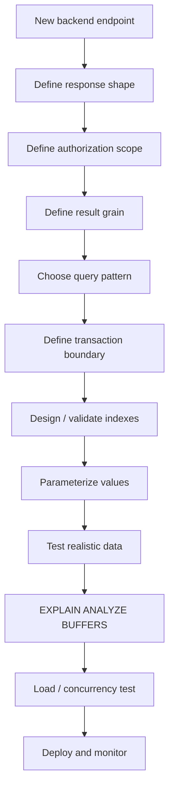

# 13- Backend Query Patterns

## Overview

Backend applications rarely execute isolated SQL statements. A production API usually combines filtering, pagination, joins, aggregation, authorization, concurrency control, and state transitions into a small set of recurring query patterns.

For the e-commerce database, these patterns appear in workflows such as:

- Customer order history.
- Order detail retrieval.
- Product catalog search.
- Checkout.
- Inventory reservation.
- Payment processing.
- Order status transitions.
- Coupon validation.
- Outbox processing.
- Administrative reporting.
- Background cleanup jobs.

The important engineering skill is not memorizing SQL syntax. It is recognizing the **data-access problem** and choosing a query shape that preserves correctness while remaining efficient under production load.

A useful mental model is:

```text
HTTP / gRPC request
        ↓
Application service
        ↓
Query pattern
        ↓
PostgreSQL
        ↓
Indexes / constraints / transactions
        ↓
Result
        ↓
API response
```

---

## Query Pattern Categories

Most backend queries fall into a small number of categories.

| Pattern | Typical use |
|---|---|
| Point lookup | Fetch one order/product/customer |
| Filtered list | Customer orders, products |
| Keyset pagination | Large ordered datasets |
| Detail query | Parent + related children |
| Existence check | Eligibility / authorization |
| Aggregate | Revenue, counts, totals |
| Latest-per-group | Latest order/status per entity |
| Top-N-per-group | Best products per category |
| Atomic update | Inventory / counters |
| Conditional transition | Order/payment state |
| Upsert | Idempotent writes |
| Lock-and-process | Background workers |
| Soft delete | Retain historical records |
| Outbox polling | Event publication |
| Reporting query | Analytics / administration |

---

## Point Lookup

A point lookup retrieves one known entity.

Example:

```sql
SELECT
    id,
    customer_id,
    status,
    subtotal,
    grand_total,
    created_at
FROM orders
WHERE id = $1;
```

This is usually supported by the primary-key index:

```text
order ID
   ↓
primary-key index
   ↓
order row
```

Use point lookups when the application already has a stable identifier.

Avoid loading unnecessary columns:

```sql
SELECT *
```

when the endpoint only requires a small projection.

---

## Secure Point Lookup

A point lookup should include authorization scope when required.

Instead of:

```sql
SELECT
    id,
    status,
    grand_total
FROM orders
WHERE id = $1;
```

a customer-facing endpoint can use:

```sql
SELECT
    id,
    status,
    grand_total
FROM orders
WHERE id = $1
  AND customer_id = $2;
```

This creates an important backend pattern:

```text
entity identity
+
authorization scope
```

The transaction and index do not provide authorization by themselves.

---

## Filtered List Queries

A common API query is:

```sql
SELECT
    id,
    status,
    grand_total,
    created_at
FROM orders
WHERE customer_id = $1
  AND status = $2
ORDER BY created_at DESC, id DESC
LIMIT $3;
```

The query contains four important elements:

```text
filter
+
authorization scope
+
deterministic ordering
+
bounded result
```

A candidate index:

```sql
CREATE INDEX orders_customer_status_created_idx
ON orders (
    customer_id,
    status,
    created_at DESC,
    id DESC
);
```

The exact index should be validated against the complete workload.

---

## Keyset Pagination

For high-volume APIs, keyset pagination is generally preferable to deep offsets.

Instead of:

```sql
SELECT
    id,
    status,
    created_at
FROM orders
WHERE customer_id = $1
ORDER BY created_at DESC, id DESC
LIMIT 20 OFFSET 100000;
```

use:

```sql
SELECT
    id,
    status,
    created_at
FROM orders
WHERE customer_id = $1
  AND (created_at, id) < ($2, $3)
ORDER BY created_at DESC, id DESC
LIMIT 20;
```

The cursor contains the last row from the previous page:

```text
created_at
id
```

The corresponding index is:

```sql
CREATE INDEX orders_customer_created_id_idx
ON orders (
    customer_id,
    created_at DESC,
    id DESC
);
```

The ordering must be deterministic.

---

## API Pagination Pattern

A typical response can contain:

```json
{
  "items": [
    {
      "id": 1008,
      "status": "shipped",
      "created_at": "2026-08-31T12:00:00Z"
    }
  ],
  "next_cursor": "..."
}
```

The cursor should encode the values required to continue the ordering safely.

Do not expose mutable internal implementation details unnecessarily.

For sensitive APIs, signed or opaque cursors can prevent clients from manipulating pagination state.

---

## Parent-Child Detail Query

An order detail endpoint often requires:

```text
order
+
order items
+
payments
+
shipments
```

Do not automatically join every relationship into one enormous query.

For example:

```sql
SELECT
    o.id,
    o.status,
    o.grand_total,
    oi.id AS item_id,
    oi.sku_snapshot,
    oi.quantity,
    oi.line_total
FROM orders AS o
JOIN order_items AS oi
    ON oi.order_id = o.id
WHERE o.id = $1
  AND o.customer_id = $2
ORDER BY oi.id;
```

This produces:

```text
one row per order item
```

The application can then assemble the response.

---

## Avoid Cartesian Multiplication

Consider joining:

```text
order
+
order_items
+
payments
+
shipments
```

If an order has:

```text
3 items
2 payments
2 shipments
```

a multi-join can potentially produce:

```text
3 × 2 × 2 = 12 rows
```

This can cause:

- Duplicate data.
- Incorrect aggregates.
- Larger result sets.
- More database work.
- More Python serialization work.

Separate queries or pre-aggregate child collections when appropriate.

---

## Batch Loading

When retrieving multiple parent entities, avoid:

```text
1 query for orders
+
1 query per order for items
```

This creates an N+1 pattern.

Instead:

```sql
SELECT
    id,
    order_id,
    sku_snapshot,
    quantity,
    line_total
FROM order_items
WHERE order_id = ANY($1)
ORDER BY order_id, id;
```

The application can group the results by `order_id`.

This pattern is particularly useful for REST APIs and service-layer batch operations.

---

## Django Batch Loading

Django can handle common relationship-loading patterns:

```python
orders = (
    Order.objects
    .filter(customer_id=customer_id)
    .prefetch_related("items")
    .order_by("-created_at", "-id")[:20]
)
```

Use:

```text
select_related()
```

for suitable single-valued relationships.

Use:

```text
prefetch_related()
```

for collections.

Always inspect query counts for high-traffic endpoints.

---

## Existence Checks

If the application only needs to know whether something exists:

```sql
SELECT EXISTS (
    SELECT 1
    FROM orders
    WHERE customer_id = $1
      AND status = 'delivered'
);
```

This communicates the intended semantics directly.

Use `COUNT(*)` when the actual count is required.

Do not retrieve full rows simply to determine existence.

---

## Authorization with EXISTS

Existence queries are useful for authorization and eligibility.

For example:

```sql
SELECT EXISTS (
    SELECT 1
    FROM orders
    WHERE id = $1
      AND customer_id = $2
);
```

The query answers:

```text
Does this order belong to this customer?
```

The application should still have a clear authorization model, but scoping the database query reduces accidental cross-tenant access.

---

## NOT EXISTS

For non-existence:

```sql
SELECT
    c.id,
    c.email
FROM customers AS c
WHERE NOT EXISTS (
    SELECT 1
    FROM orders AS o
    WHERE o.customer_id = c.id
);
```

This is generally preferable to:

```sql
NOT IN (...)
```

when NULL semantics could make the latter surprising.

Use `NOT EXISTS` when the business requirement is explicitly:

```text
There is no related row satisfying this condition.
```

---

## Aggregate Query

For customer lifetime order value:

```sql
SELECT
    customer_id,
    COUNT(*) AS order_count,
    SUM(grand_total) AS lifetime_value
FROM orders
WHERE status = 'delivered'
GROUP BY customer_id;
```

Aggregation should happen at the correct grain.

If the API requires one customer per result:

```text
GROUP BY customer_id
```

is appropriate.

If it needs every order plus the customer's total:

```text
window function
```

may be more appropriate.

---

## Aggregate Before Joining

Suppose an order has multiple items and multiple payments.

Instead of aggregating after joining both relationships, aggregate independently:

```sql
WITH item_totals AS (
    SELECT
        order_id,
        SUM(line_total) AS item_total
    FROM order_items
    GROUP BY order_id
),
payment_totals AS (
    SELECT
        order_id,
        SUM(amount) AS paid_amount
    FROM payments
    WHERE status = 'succeeded'
    GROUP BY order_id
)
SELECT
    o.id,
    o.grand_total,
    COALESCE(i.item_total, 0) AS item_total,
    COALESCE(p.paid_amount, 0) AS paid_amount
FROM orders AS o
LEFT JOIN item_totals AS i
    ON i.order_id = o.id
LEFT JOIN payment_totals AS p
    ON p.order_id = o.id;
```

This avoids multiplying independent one-to-many relationships.

---

## Latest Row per Group

A common requirement is:

```text
Latest status for every order.
```

Use:

```sql
WITH ranked_status AS (
    SELECT
        id,
        order_id,
        status,
        created_at,
        ROW_NUMBER() OVER (
            PARTITION BY order_id
            ORDER BY created_at DESC, id DESC
        ) AS row_number
    FROM order_status_history
)
SELECT
    id,
    order_id,
    status,
    created_at
FROM ranked_status
WHERE row_number = 1;
```

The deterministic tie-breaker:

```sql
id DESC
```

ensures stable selection when timestamps are identical.

---

## PostgreSQL DISTINCT ON

PostgreSQL provides another useful pattern for latest-per-group queries:

```sql
SELECT DISTINCT ON (order_id)
    id,
    order_id,
    status,
    created_at
FROM order_status_history
ORDER BY
    order_id,
    created_at DESC,
    id DESC;
```

This is PostgreSQL-specific but can be concise and efficient for appropriate workloads.

The `ORDER BY` is critical.

The first ordering columns must align with the `DISTINCT ON` expressions.

Use `ROW_NUMBER()` when portability or more complex ranking semantics matter.

---

## Top-N per Group

For the top three products by sales within each category:

```sql
WITH product_sales AS (
    SELECT
        p.category_id,
        p.id AS product_id,
        SUM(oi.line_total) AS sales
    FROM products AS p
    JOIN product_variants AS pv
        ON pv.product_id = p.id
    JOIN order_items AS oi
        ON oi.sku_snapshot = pv.sku
    JOIN orders AS o
        ON o.id = oi.order_id
    WHERE o.status = 'delivered'
    GROUP BY
        p.category_id,
        p.id
),
ranked_products AS (
    SELECT
        category_id,
        product_id,
        sales,
        ROW_NUMBER() OVER (
            PARTITION BY category_id
            ORDER BY sales DESC, product_id DESC
        ) AS row_number
    FROM product_sales
)
SELECT
    category_id,
    product_id,
    sales
FROM ranked_products
WHERE row_number <= 3;
```

The pattern is:

```text
JOIN
→ aggregate
→ rank
→ filter
```

---

## Conditional Aggregation

A dashboard may need several counts in one query:

```sql
SELECT
    COUNT(*) AS total_orders,
    COUNT(*) FILTER (
        WHERE status = 'pending'
    ) AS pending_orders,
    COUNT(*) FILTER (
        WHERE status = 'processing'
    ) AS processing_orders,
    COUNT(*) FILTER (
        WHERE status = 'shipped'
    ) AS shipped_orders,
    COUNT(*) FILTER (
        WHERE status = 'delivered'
    ) AS delivered_orders
FROM orders;
```

This can be preferable to executing separate queries for every status.

It reduces:

```text
database round trips
+
query overhead
```

when the metrics naturally belong to the same dataset and consistency boundary.

---

## Date-Based Reporting

For monthly sales:

```sql
SELECT
    DATE_TRUNC('month', created_at) AS month,
    SUM(grand_total) AS revenue,
    COUNT(*) AS order_count
FROM orders
WHERE status = 'delivered'
  AND created_at >= $1
  AND created_at < $2
GROUP BY DATE_TRUNC('month', created_at)
ORDER BY month;
```

Use a half-open interval:

```text
[start, end)
```

instead of:

```text
BETWEEN start AND end
```

for timestamp ranges when the endpoint semantics represent a continuous time period.

This avoids ambiguity around the end timestamp.

---

## Search by Date Range

Prefer:

```sql
WHERE created_at >= $1
  AND created_at < $2
```

rather than applying a function to the timestamp:

```sql
WHERE DATE(created_at) = $1
```

The range predicate can better align with a normal index on:

```sql
created_at
```

The exact plan should still be verified with `EXPLAIN`.

---

## Atomic Inventory Decrement

For checkout:

```sql
UPDATE inventory
SET
    available_quantity = available_quantity - $1,
    updated_at = NOW()
WHERE variant_id = $2
  AND available_quantity >= $1
RETURNING
    variant_id,
    available_quantity;
```

Interpretation:

```text
row returned
→ inventory operation succeeded

no row returned
→ insufficient stock or variant not found
```

This avoids an unsafe application sequence:

```text
SELECT stock
→ check in Python
→ UPDATE stock
```

under concurrency.

---

## Conditional State Transition

For order processing:

```sql
UPDATE orders
SET
    status = 'processing',
    updated_at = NOW()
WHERE id = $1
  AND status = 'pending'
RETURNING
    id,
    status;
```

This expresses:

```text
only transition pending → processing
```

as one atomic database operation.

If no row is returned, the order may:

- Not exist.
- Already have another status.
- Have been processed concurrently.

The application should distinguish these cases where required.

---

## Upsert

PostgreSQL supports:

```sql
INSERT INTO inventory (
    variant_id,
    available_quantity,
    updated_at
)
VALUES (
    $1,
    $2,
    NOW()
)
ON CONFLICT (variant_id)
DO UPDATE SET
    available_quantity = EXCLUDED.available_quantity,
    updated_at = NOW()
RETURNING
    variant_id,
    available_quantity;
```

Use upsert when the desired semantics are:

```text
insert if absent
otherwise update the existing row
```

The conflict target should correspond to an actual unique constraint or unique index.

---

## Idempotent Insert

For idempotency keys:

```sql
INSERT INTO orders (
    customer_id,
    idempotency_key,
    status,
    subtotal,
    grand_total,
    created_at
)
VALUES (
    $1,
    $2,
    'pending',
    $3,
    $4,
    NOW()
)
ON CONFLICT (customer_id, idempotency_key)
DO NOTHING
RETURNING id;
```

The database uniqueness constraint is the final enforcement mechanism.

Do not rely only on:

```text
SELECT whether key exists
→ INSERT
```

because concurrent requests can both observe absence.

---

## Optimistic Concurrency

A version column can protect against lost updates.

Example:

```sql
UPDATE orders
SET
    status = $1,
    version = version + 1,
    updated_at = NOW()
WHERE id = $2
  AND version = $3
RETURNING
    id,
    status,
    version;
```

If zero rows are returned:

```text
the record changed after the caller read it
```

The application can return a conflict or retry according to the business semantics.

---

## Pessimistic Concurrency

When conflicts must be serialized explicitly:

```sql
BEGIN;

SELECT
    id,
    available_quantity
FROM inventory
WHERE variant_id = $1
FOR UPDATE;

-- validate and modify

COMMIT;
```

Use this when the application needs a protected read-modify-write sequence.

Keep the transaction short.

---

## Lock-and-Process Pattern

Background workers can claim rows using:

```sql
SELECT
    id,
    aggregate_id,
    payload
FROM outbox_events
WHERE published_at IS NULL
ORDER BY created_at, id
LIMIT 100
FOR UPDATE SKIP LOCKED;
```

This allows multiple workers to process different rows concurrently.

A common architecture is:

```text
PostgreSQL
     ↓
pending work
     ↓
SKIP LOCKED
     ↓
worker
     ↓
external system
```

Workers still need idempotency because external publication and database state updates are separate operations.

---

## Soft Delete

For records that must remain available historically:

```sql
UPDATE products
SET
    deleted_at = NOW(),
    updated_at = NOW()
WHERE id = $1
  AND deleted_at IS NULL
RETURNING id;
```

Active queries then use:

```sql
WHERE deleted_at IS NULL
```

A partial index can support common active-record access:

```sql
CREATE INDEX products_active_category_idx
ON products (category_id, id)
WHERE deleted_at IS NULL;
```

Soft delete is not automatically superior to physical deletion.

It introduces:

- Larger tables.
- More complex queries.
- Retention requirements.
- Possible uniqueness complications.

---

## Current Price Query

Because product prices may be historical, the application should explicitly identify the active price.

For example:

```sql
SELECT
    pv.id,
    pp.amount
FROM product_variants AS pv
JOIN product_prices AS pp
    ON pp.variant_id = pv.id
WHERE pv.id = $1
  AND pp.effective_from <= NOW()
  AND (pp.effective_to IS NULL OR pp.effective_to > NOW())
ORDER BY pp.effective_from DESC
LIMIT 1;
```

Historical pricing should not be inferred from whichever row happens to be returned first.

If the business invariant is:

```text
only one price can be active at a time
```

consider enforcing it at the database level where the schema permits.

---

## Customer Order History

A production query:

```sql
SELECT
    id,
    status,
    grand_total,
    created_at
FROM orders
WHERE customer_id = $1
ORDER BY created_at DESC, id DESC
LIMIT 20;
```

Candidate index:

```sql
CREATE INDEX orders_customer_created_id_idx
ON orders (
    customer_id,
    created_at DESC,
    id DESC
);
```

This is a high-value pattern because it combines:

```text
authorization scope
+
filtering
+
ordering
+
pagination
```

---

## Order Detail

For the order header:

```sql
SELECT
    id,
    customer_id,
    status,
    subtotal,
    grand_total,
    created_at
FROM orders
WHERE id = $1
  AND customer_id = $2;
```

Then load items:

```sql
SELECT
    id,
    sku_snapshot,
    product_name_snapshot,
    quantity,
    unit_price,
    line_total
FROM order_items
WHERE order_id = $1
ORDER BY id;
```

This two-query approach can be preferable to one huge multi-join when the endpoint contains several independent collections.

The correct choice depends on response shape, latency requirements, and query volume.

---

## Product Catalog Query

A typical catalog endpoint might use:

```sql
SELECT
    p.id,
    p.name,
    p.brand,
    p.category_id
FROM products AS p
WHERE p.category_id = $1
  AND p.deleted_at IS NULL
ORDER BY p.id
LIMIT 50;
```

For large catalogs:

```text
bounded result
+
deterministic ordering
+
appropriate index
```

are essential.

Search requirements involving arbitrary text should not automatically be implemented using multiple `LIKE` predicates. PostgreSQL full-text search, trigram indexes, or dedicated search infrastructure may be more appropriate.

---

## Count Queries

A dashboard may need:

```sql
SELECT COUNT(*)
FROM orders
WHERE customer_id = $1;
```

This is appropriate when an exact count is required.

But exact counts over very large datasets can be expensive.

For APIs, consider whether the client actually needs:

```text
exact total count
```

or merely:

```text
has next page
```

Keyset pagination often does not require an exact total.

Avoid performing expensive `COUNT(*)` queries simply because a frontend convention expects pagination totals.

---

## EXISTS vs COUNT

For:

```text
Does this customer have any delivered orders?
```

prefer:

```sql
SELECT EXISTS (
    SELECT 1
    FROM orders
    WHERE customer_id = $1
      AND status = 'delivered'
);
```

For:

```text
How many delivered orders does this customer have?
```

use:

```sql
SELECT COUNT(*)
FROM orders
WHERE customer_id = $1
  AND status = 'delivered';
```

Choose based on semantics first.

---

## NULL Handling

Use explicit NULL semantics.

Incorrect:

```sql
WHERE deleted_at = NULL
```

Correct:

```sql
WHERE deleted_at IS NULL
```

Likewise:

```sql
WHERE deleted_at IS NOT NULL
```

when testing for a value.

Do not assume:

```text
NULL = NULL
```

because SQL uses three-valued logic.

---

## COALESCE in Backend Queries

For optional related data:

```sql
SELECT
    o.id,
    COALESCE(p.paid_amount, 0) AS paid_amount
FROM orders AS o
LEFT JOIN (
    SELECT
        order_id,
        SUM(amount) AS paid_amount
    FROM payments
    WHERE status = 'succeeded'
    GROUP BY order_id
) AS p
    ON p.order_id = o.id;
```

Use `COALESCE` when:

```text
NULL
```

has the business meaning:

```text
no matching value → zero
```

Do not blindly convert all NULLs to zero.

---

## API Query Projection

A backend endpoint should define a deliberate database projection.

For example:

```sql
SELECT
    id,
    status,
    grand_total,
    created_at
FROM orders
WHERE customer_id = $1
ORDER BY created_at DESC, id DESC
LIMIT 20;
```

This creates a useful boundary:

```text
database schema
    ↓
query projection
    ↓
service model
    ↓
API response
```

The API should not automatically expose every database column.

This reduces:

- Data transfer.
- Accidental data exposure.
- Serialization overhead.
- Coupling to schema changes.

---

## Parameterized Queries

Always bind values.

Safe:

```python
cursor.execute(
    """
    SELECT
        id,
        status,
        grand_total
    FROM orders
    WHERE customer_id = %s
    """,
    (customer_id,),
)
```

Avoid:

```python
cursor.execute(
    f"""
    SELECT id
    FROM orders
    WHERE customer_id = {customer_id}
    """
)
```

Parameterization protects SQL values from being interpreted as SQL syntax.

It does not automatically make dynamic table names, column names, or SQL keywords safe.

---

## Dynamic Sorting

A common API requirement is:

```text
sort=created_at
sort=grand_total
```

Do not directly interpolate arbitrary client input:

```python
query = f"ORDER BY {sort_column}"
```

Use an allowlist:

```python
SORT_COLUMNS = {
    "created_at": "created_at",
    "total": "grand_total",
}

sort_column = SORT_COLUMNS.get(requested_sort, "created_at")
```

Then construct the trusted SQL structure separately from bound values.

Dynamic SQL identifiers require a different safety strategy from ordinary parameter values.

---

## Query Patterns and Transactions

Some patterns must be combined with transactions.

For example:

```text
inventory update
+
reservation creation
+
order creation
```

should be atomic when the business invariant requires all three to change together.

Other operations should remain outside the transaction:

```text
HTTP call
Kafka publication
large report generation
long Python computation
```

A good backend query pattern includes both:

```text
SQL shape
+
transaction boundary
```

---

## Query Patterns and Microservices

A microservice should normally query data it owns.

For example:

```text
Order Service
    ↓
orders
order_items
payments
```

while:

```text
Inventory Service
    ↓
inventory
inventory_reservations
```

If an order endpoint requires inventory information owned by another service, avoid direct database coupling.

Prefer:

```text
API composition
or
event-driven read model
```

depending on latency and consistency requirements.

---

## Query Patterns and Redis

Redis is useful when the read pattern requires:

- Very low latency.
- High request frequency.
- Acceptable staleness.
- A well-defined invalidation/update strategy.

For example:

```text
Product API
   ↓
Redis
   ↓ cache miss
PostgreSQL
   ↓
Redis
   ↓
API
```

Do not cache every database query.

First determine whether the query itself can be efficiently served from PostgreSQL.

---

## Query Patterns and Kafka

Kafka becomes useful when database state changes need asynchronous propagation.

For example:

```text
Order transaction
    ↓
orders + outbox
    ↓
Kafka
    ↓
inventory / notification / analytics consumers
```

This separates the transactional database operation from downstream processing.

Consumers should use idempotent patterns because message delivery can be repeated.

---

## Query Patterns and Celery

Celery is appropriate for work that does not need to block an HTTP request:

```text
large export
email
reconciliation
outbox processing
expired reservation cleanup
analytics aggregation
```

A typical pattern:

```text
API
 ↓
create durable job state
 ↓
commit
 ↓
Celery
 ↓
bounded SQL batches
 ↓
update job state
```

Avoid putting the entire workload into one enormous transaction.

---

## Query Patterns and Read Models

If a query repeatedly combines:

```text
many joins
+
large aggregations
+
high request volume
```

consider a derived read model.

For example:

```text
orders
order_items
payments
        ↓
background aggregation
        ↓
customer_metrics
        ↓
API
```

The read model can be optimized specifically for the API's access pattern.

The trade-off is:

```text
lower read cost
+
more write/update complexity
+
eventual consistency
```

---

## Query Optimization Checklist

For every important backend query, ask:

### Correctness

- What is the input grain?
- What is the output grain?
- Can JOINs multiply rows?
- Are NULLs handled correctly?
- Are state transitions protected?
- Are concurrency assumptions explicit?

### Performance

- Is the result bounded?
- Are only required columns selected?
- Is pagination scalable?
- Are filters selective?
- Is the index aligned with the query?
- Has `EXPLAIN (ANALYZE, BUFFERS)` been checked?

### Security

- Is authorization scope part of the query?
- Is tenant isolation enforced?
- Are values parameterized?
- Are dynamic identifiers allowlisted?
- Could the result expose sensitive columns?

### Reliability

- Is the operation idempotent?
- Does it need a transaction?
- Could concurrent requests conflict?
- Can a worker retry safely?
- Is an outbox required?

### Architecture

- Does the query belong in synchronous request processing?
- Should it be cached?
- Should it be precomputed?
- Should it be moved to a background worker?
- Does it cross a service ownership boundary?

---

## Production Query Pattern Matrix

| Requirement | Preferred pattern |
|---|---|
| Fetch one entity | Primary-key lookup |
| Fetch one entity securely | PK + authorization scope |
| Large ordered list | Keyset pagination |
| Small bounded list | `LIMIT` + deterministic order |
| Related collection | Batch query / prefetch |
| Check existence | `EXISTS` |
| Check non-existence | `NOT EXISTS` |
| Exact count | `COUNT(*)` |
| Group-level metrics | `GROUP BY` |
| Group metrics + detail rows | Window function |
| Latest row per group | `ROW_NUMBER()` / `DISTINCT ON` |
| Top-N per group | Window ranking |
| Simple invariant update | Atomic conditional `UPDATE` |
| Read-modify-write | `SELECT FOR UPDATE` |
| Insert-or-update | `ON CONFLICT` |
| Duplicate request protection | Unique idempotency key |
| Worker claiming | `FOR UPDATE SKIP LOCKED` |
| Durable event publication | Transaction + outbox |
| Large asynchronous work | Celery / worker |
| Repeated expensive reads | Cache / read model |
| Cross-service data | API / event-driven projection |

---

## Common Mistakes

### N+1 Queries

```text
Load 100 orders
→ query items for each order
→ 101 queries
```

Use batch loading or prefetching.

---

### Returning Unbounded Results

Avoid:

```sql
SELECT *
FROM orders
WHERE customer_id = $1;
```

without pagination or a known small result set.

Large results consume:

```text
DB memory/I/O
+
network
+
Python memory
+
serialization time
```

---

### Using OFFSET at Scale

Avoid:

```sql
LIMIT 50 OFFSET 500000;
```

for large high-volume APIs.

Use keyset pagination when the access pattern supports it.

---

### Joining Every Relationship

A single query containing:

```text
orders
+
items
+
payments
+
shipments
+
reviews
```

may produce massive row multiplication.

Design the response shape first.

---

### Using COUNT for Existence

Avoid:

```sql
SELECT COUNT(*)
```

when the application only needs to know whether at least one row exists.

Use:

```sql
SELECT EXISTS (...)
```

---

### Read-Then-Write Race

Avoid:

```text
SELECT stock
→ application checks
→ UPDATE stock
```

for concurrency-sensitive inventory.

Use an atomic conditional update or appropriate locking.

---

### Missing Authorization Predicates

Avoid:

```sql
WHERE id = $1
```

for customer-facing resources when ownership must be enforced.

Use:

```sql
WHERE id = $1
  AND customer_id = $2
```

or an equivalent authorization design.

---

### Blindly Caching Slow Queries

Redis can hide a query problem while introducing:

```text
stale data
+
invalidation complexity
+
memory cost
```

Understand the database workload first.

---

### Putting External Work Inside Transactions

Avoid:

```text
BEGIN
→ SQL
→ HTTP call
→ Kafka
→ more SQL
→ COMMIT
```

Keep database transactions short and use durable asynchronous patterns for external effects.

---

### Assuming ORM Abstraction Solves SQL Performance

Django and SQLAlchemy make database access easier, but they do not eliminate:

```text
query planning
indexing
join cardinality
transactions
locking
pagination
```

Senior backend engineers must understand the generated SQL.

---

## Backend Query Review Workflow

A practical code-review workflow:



This workflow catches problems before they become production incidents.

---

## Senior Engineering Perspective

Backend SQL should be designed from the business operation backward.

Start with:

```text
What does the endpoint need?
```

Then determine:

```text
What is the required result grain?
        ↓
Which tables contain the data?
        ↓
Which authorization boundaries apply?
        ↓
Which query pattern matches the requirement?
        ↓
What must be atomic?
        ↓
What can be asynchronous?
        ↓
What index supports the access path?
        ↓
What happens under concurrency?
        ↓
What happens at 100× today's data?
```

A strong backend query is therefore not simply syntactically correct.

It is:

```text
Correct
+
Bounded
+
Authorized
+
Concurrency-safe
+
Observable
+
Efficient
+
Maintainable
```

---

## Interview Traps

### What is the best query pattern for a large customer order history?

Typically:

```text
customer scope
+
deterministic ordering
+
keyset pagination
+
aligned composite index
```

rather than deep `OFFSET`.

---

### When should you use JOIN versus EXISTS?

Use `JOIN` when related columns or rows are part of the result.

Use `EXISTS` when the requirement is only whether a related row exists.

---

### Why can multiple LEFT JOINs produce incorrect totals?

Independent one-to-many relationships can multiply each other's rows before aggregation.

Aggregate each relationship separately when necessary.

---

### How do you prevent a concurrent inventory race?

Use an atomic conditional update or lock the inventory row with `SELECT ... FOR UPDATE` when a protected read-modify-write sequence is required.

---

### How do you make POST order creation idempotent?

Use a durable idempotency key backed by a unique database constraint and perform the relevant creation work transactionally.

---

### Why use an outbox instead of publishing directly to Kafka?

Because the database transaction and Kafka publication are separate operations.

The outbox makes the event publication intent durable together with the business state change.

---

### When should a query become a read model?

When the query is repeatedly expensive, high-volume, and can tolerate controlled freshness or eventual consistency.

---

### Is one SQL query always better than multiple queries?

No.

One query can produce row multiplication, complex plans, large intermediate results, or difficult response assembly.

A small number of well-designed bounded queries can be better than one enormous query.

---

## Key Takeaways

- **Choose backend query patterns from the required result grain, authorization boundary, concurrency model, and response shape—not from SQL syntax alone.**
- **Use bounded deterministic queries, keyset pagination, batch loading, `EXISTS`, aggregation, and window functions according to the exact access pattern.**
- **Protect state-changing operations with database constraints, atomic updates, appropriate row locks, idempotency keys, and explicit transaction boundaries.**
- **Treat ORM-generated SQL, indexes, execution plans, network transfer, caching, and asynchronous workers as one performance and reliability system.**
- **Senior-level query design optimizes for correctness, security, scalability, concurrency, and operational behavior at production data volumes—not merely for a query that works on development data.**