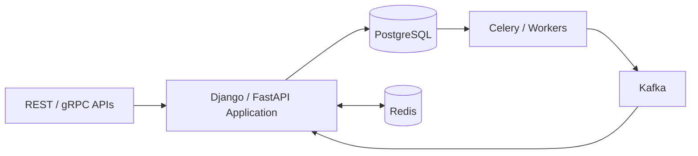
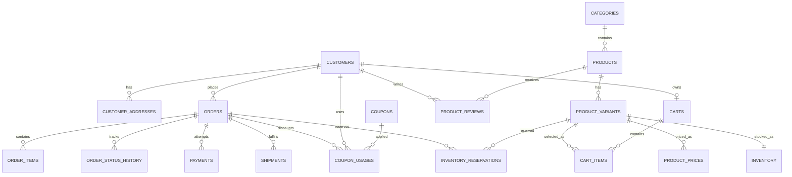
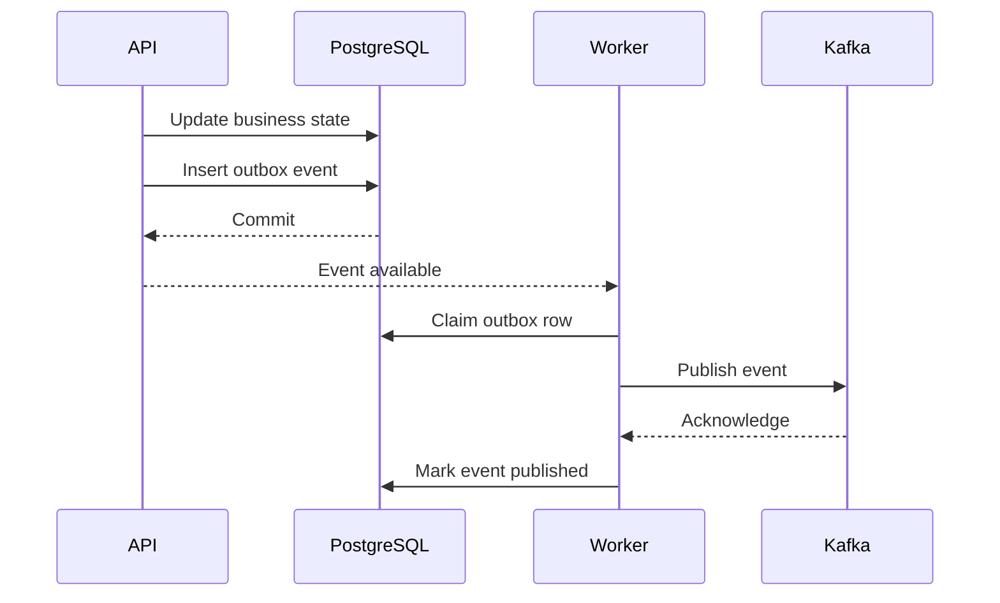
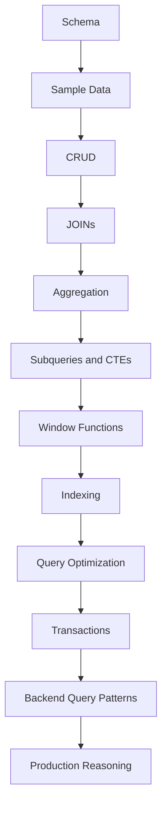
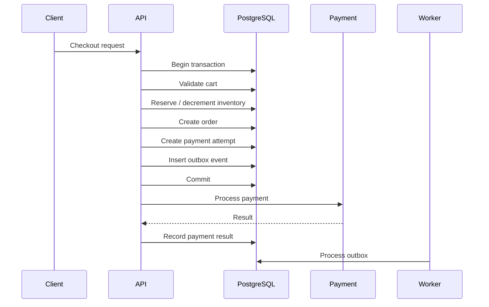

# README

## Overview

This project is a production-oriented **E-Commerce Database** designed to strengthen SQL and backend engineering skills through realistic PostgreSQL data models, queries, transaction scenarios, and performance patterns.

The project is intentionally broader than database syntax. It demonstrates how SQL participates in real backend systems involving:

- Customer and product management.
- Shopping carts and checkout.
- Orders and order history.
- Inventory and reservations.
- Payments and refunds.
- Shipments and fulfillment.
- Coupons and promotions.
- Product reviews.
- Transactional integrity.
- Query optimization and indexing.
- Background processing.
- Event-driven architecture.
- API and microservice integration.

The database is designed as a practical environment for reasoning about **data modeling, query design, concurrency, performance, security, reliability, and production operations**.

## Navigation

- [01- Requirements](./01-%20Requirements.md) — Project scope, business requirements, and data modeling goals
- [02- Schema Design](./02-%20Schema%20Design.md) — Relational schema design decisions and entity relationships
- [03- Tables and Relationships](./03-%20Tables%20and%20Relationships.md) — Table definitions, foreign keys, and relationship modeling
- [04- Sample Data](./04-%20Sample%20Data.md) — Representative data sets for query development and testing
- [05- CRUD Queries](./05-%20CRUD%20Queries.md) — INSERT, SELECT, UPDATE, DELETE patterns for core entities
- [06- JOIN Queries](./06-%20JOIN%20Queries.md) — Multi-table queries covering typical e-commerce access patterns
- [07- Aggregation Queries](./07-%20Aggregation%20Queries.md) — Sales, inventory, and order aggregation queries
- [08- Subqueries and CTEs](./08-%20Subqueries%20and%20CTEs.md) — Complex filtering and intermediate result patterns
- [09- Window Function Queries](./09-%20Window%20Function%20Queries.md) — Ranking, running totals, and period comparisons
- [10- Indexing Strategy](./10-%20Indexing%20Strategy.md) — Index design based on query access patterns
- [11- Query Optimization](./11-%20Query%20Optimization.md) — Execution plan analysis and query rewriting
- [12- Transaction Scenarios](./12-%20Transaction%20Scenarios.md) — Order placement, inventory updates, and concurrent write safety
- [13- Backend Query Patterns](./13-%20Backend%20Query%20Patterns.md) — API-aligned query patterns for Django and FastAPI backends

---

## Project Architecture

The database represents the core transactional data owned by an e-commerce platform.



The primary source of truth for transactional business state is PostgreSQL.

Redis and Kafka are complementary infrastructure components rather than replacements for transactional database guarantees.

---

## Project Goals

The project is intended to provide realistic SQL practice across the complete backend lifecycle:

```text
Schema
  ↓
Sample Data
  ↓
CRUD
  ↓
JOINs
  ↓
Aggregation
  ↓
Subqueries / CTEs
  ↓
Window Functions
  ↓
Indexes
  ↓
Query Optimization
  ↓
Transactions
  ↓
Backend Query Patterns
```

This progression moves from basic data access toward senior-level database reasoning.

---

## Database Domains

The schema is organized around business domains rather than isolated tables.

| Domain | Primary tables | Responsibility |
|---|---|---|
| Customers | `customers`, `customer_addresses` | Customer identity and addresses |
| Catalog | `categories`, `products`, `product_variants`, `product_prices` | Product and SKU management |
| Shopping | `carts`, `cart_items` | Active shopping sessions |
| Orders | `orders`, `order_items`, `order_status_history` | Order lifecycle |
| Inventory | `inventory`, `inventory_reservations` | Stock and reservations |
| Payments | `payments` | Payment attempts and outcomes |
| Fulfillment | `shipments` | Shipment tracking |
| Reviews | `product_reviews` | Customer feedback |
| Promotions | `coupons`, `coupon_usages` | Discount management |
| Integration | `outbox_events` | Reliable event publication |

---

## Core Data Model

The main relationships are:



---

## Important Modeling Decisions

### Product vs Product Variant

A product represents the catalog-level item.

A product variant represents the **purchasable SKU**.

For example:

```text
Product
  └── T-Shirt
       ├── SKU-RED-M
       ├── SKU-RED-L
       └── SKU-BLUE-M
```

Inventory and purchasing should operate at the variant/SKU level.

---

### Historical Order Data

Order items contain historical snapshots such as:

```text
product_name_snapshot
sku_snapshot
unit_price
quantity
line_total
```

This is intentional.

If a product is renamed or repriced later, historical orders must remain historically accurate.

The order should not depend on the current catalog representation to reconstruct its past state.

---

### Current Order Status vs Status History

The order stores its current state:

```text
orders.status
```

while the history table records transitions:

```text
order_status_history
```

This gives two useful access patterns:

```text
Current state
→ fast lookup

Historical state transitions
→ audit / troubleshooting / analytics
```

---

### Inventory vs Reservations

Inventory represents available stock.

Reservations represent temporary claims against inventory.

This separation allows workflows such as:

```text
Product selected
    ↓
Inventory reserved
    ↓
Payment processing
    ↓
Order confirmed
    ↓
Reservation finalized
```

Reservation expiry can be handled asynchronously.

---

### Payments

Payments are modeled as one-to-many with orders.

An order can have multiple payment attempts because:

```text
attempt 1 → failed
attempt 2 → succeeded
```

This is preferable to overwriting payment history.

---

### Shipments

An order can have multiple shipments.

This supports:

```text
one order
    ↓
multiple packages
```

which is common when inventory is fulfilled from different locations.

---

### Outbox Events

The `outbox_events` table supports reliable event publication.

The application can commit:

```text
business state
+
event intent
```

in the same database transaction.

A worker can then publish the event asynchronously.



This avoids relying on a fragile sequence such as:

```text
COMMIT database
→ publish Kafka event
```

where a process failure can leave the database updated but the event unpublished.

---

## Documentation Map

### Schema and Data

| File | Focus |
|---|---|
| `03- Tables and Relationships.md` | Tables, relationships, constraints, cardinality, and domain boundaries |
| `04- Sample Data.md` | Deterministic PostgreSQL seed data and data-quality checks |

### Query Fundamentals

| File | Focus |
|---|---|
| `05- CRUD Queries.md` | INSERT, SELECT, UPDATE, DELETE, upserts, atomic updates, and idempotency |
| `06- JOIN Queries.md` | INNER, LEFT, RIGHT, FULL, CROSS, self joins, cardinality, and join design |
| `07- Aggregation Queries.md` | `GROUP BY`, aggregates, conditional aggregation, and reporting queries |
| `08- Subqueries and CTEs.md` | Scalar, correlated, `EXISTS`, CTEs, recursive queries, and aggregate-before-join |
| `09- Window Function Queries.md` | Ranking, running totals, latest-per-group, top-N, and analytical queries |

### Performance and Transactions

| File | Focus |
|---|---|
| `10- Indexing Strategy.md` | Access patterns, composite indexes, partial indexes, covering indexes, and maintenance |
| `11- Query Optimization.md` | `EXPLAIN`, execution plans, cardinality, sorting, joins, and optimization workflow |
| `12- Transaction Scenarios.md` | Checkout, inventory, payments, locking, isolation, retries, and concurrency |
| `13- Backend Query Patterns.md` | Production query patterns for APIs, workers, idempotency, pagination, and read models |

---

## Recommended Learning Sequence

The project should be approached as an engineering progression rather than as independent SQL exercises.



The later documents depend heavily on concepts introduced earlier.

For example:

```text
JOIN knowledge
→ aggregation correctness

aggregation knowledge
→ query optimization

index knowledge
→ execution-plan analysis

transaction knowledge
→ concurrency-safe backend patterns
```

---

## Project Schema by Domain

### Customer Domain

```text
customers
customer_addresses
```

Typical operations:

- Create customer.
- Update profile.
- Manage addresses.
- Fetch customer order history.
- Enforce customer-specific authorization.

Important concerns:

- Unique email constraints.
- Sensitive data handling.
- Tenant/customer authorization.
- Efficient customer-scoped queries.

---

### Catalog Domain

```text
categories
products
product_variants
product_prices
```

Typical operations:

- Browse products.
- Filter by category.
- Retrieve product details.
- Retrieve purchasable variants.
- Resolve active prices.
- Preserve price history.

Important concerns:

- Soft deletion.
- Product/SKU separation.
- Historical pricing.
- Catalog read performance.
- Search requirements.

---

### Shopping Domain

```text
carts
cart_items
```

Typical operations:

- Create cart.
- Add item.
- Update quantity.
- Remove item.
- Calculate cart totals.
- Validate product availability.

Important concerns:

- Unique cart/variant combinations.
- Concurrent updates.
- Price changes between cart creation and checkout.
- Cart expiration.

---

### Order Domain

```text
orders
order_items
order_status_history
```

Typical operations:

- Create order.
- Add order items.
- Transition order state.
- Retrieve order history.
- Retrieve order details.
- Audit state changes.

Important concerns:

- Transaction boundaries.
- State-machine transitions.
- Historical snapshots.
- Idempotency.
- Authorization.
- Concurrency.

---

### Inventory Domain

```text
inventory
inventory_reservations
```

Typical operations:

- Check stock.
- Reserve stock.
- Release reservation.
- Finalize reservation.
- Adjust stock.

Important concerns:

- Race conditions.
- Atomic updates.
- Row locking.
- Reservation expiry.
- Overselling.
- Worker concurrency.

---

### Payment Domain

```text
payments
```

Typical operations:

- Record payment attempt.
- Record provider response.
- Retry failed payment.
- Record refund.
- Determine payment state.

Important concerns:

- External provider calls.
- Idempotency.
- Unknown commit outcomes.
- Webhook processing.
- Transaction boundaries.

---

### Fulfillment Domain

```text
shipments
```

Typical operations:

- Create shipment.
- Update shipment status.
- Track package.
- Handle multiple shipments per order.

Important concerns:

- External carrier integration.
- Event-driven updates.
- Status transitions.
- Idempotent webhook handling.

---

### Promotion Domain

```text
coupons
coupon_usages
```

Typical operations:

- Validate coupon.
- Apply coupon.
- Track usage.
- Enforce usage limits.

Important concerns:

- Concurrent redemption.
- Expiration.
- Customer-specific limits.
- Unique constraints.
- Atomic validation and usage recording.

---

### Integration Domain

```text
outbox_events
```

Typical operations:

- Store event.
- Claim pending event.
- Publish event.
- Retry failure.
- Mark successful publication.

Important concerns:

- At-least-once delivery.
- Idempotent consumers.
- Retry behavior.
- Backlog monitoring.
- Poison messages.
- Event ordering.

---

## Representative Backend Workflows

### Customer Order History

```text
GET /customers/{customer_id}/orders
        ↓
Authorization
        ↓
Customer-scoped query
        ↓
Keyset pagination
        ↓
PostgreSQL
        ↓
JSON response
```

Typical SQL characteristics:

```text
WHERE customer_id = ?
ORDER BY created_at DESC, id DESC
LIMIT ?
```

The corresponding index should match the actual access pattern.

---

### Order Detail

```text
GET /orders/{order_id}
        ↓
Authorize customer
        ↓
Load order
        ↓
Load order items
        ↓
Load payment / shipment information
        ↓
Build response
```

Do not automatically combine every relationship into one multi-join query.

The correct query structure depends on the response shape and relationship cardinality.

---

### Checkout

A simplified checkout flow:



A real implementation should define precisely which payment-provider operations occur before or after the transaction and use idempotency and reconciliation for failures.

---

## Query Design Principles

### Define Result Grain First

Before writing a query, ask:

```text
What does one result row represent?
```

Examples:

```text
one customer
one order
one order item
one customer per month
one product per category
```

This prevents many join and aggregation bugs.

---

### Filter Early When Semantically Valid

Reduce unnecessary rows before expensive operations.

For example:

```sql
WHERE status = 'delivered'
```

before aggregation can reduce the amount of data processed.

The optimizer may reorder predicates internally, so "filter early" is a logical reasoning principle rather than a guarantee about physical execution order.

---

### Bound Backend Queries

Every API query should have an intentional result-size strategy.

Use:

- `LIMIT`.
- Keyset pagination.
- Appropriate filtering.
- Explicit projections.
- Maximum page sizes.

Avoid exposing database-scale datasets directly through synchronous APIs.

---

### Prefer Atomic Database Operations

When a business invariant can be expressed atomically, let PostgreSQL enforce it.

For example:

```sql
UPDATE inventory
SET available_quantity = available_quantity - $1
WHERE variant_id = $2
  AND available_quantity >= $1
RETURNING variant_id;
```

This is safer than implementing the entire invariant as separate application reads and writes.

---

## Indexing Strategy

Indexes should be driven by real access patterns.

Typical project indexes may support:

```text
customer → orders
order → items
order → payments
order → shipments
variant → inventory
variant → prices
category → products
outbox → unpublished events
```

A representative index:

```sql
CREATE INDEX orders_customer_created_id_idx
ON orders (
    customer_id,
    created_at DESC,
    id DESC
);
```

This supports the common access pattern:

```sql
WHERE customer_id = ?
ORDER BY created_at DESC, id DESC
```

Do not add indexes simply because a column appears in a query.

Evaluate:

```text
selectivity
+
query frequency
+
write overhead
+
storage
+
execution plan
```

---

## Query Optimization Workflow

Use:

```sql
EXPLAIN (ANALYZE, BUFFERS)
SELECT
    id,
    status,
    grand_total
FROM orders
WHERE customer_id = 1
ORDER BY created_at DESC, id DESC
LIMIT 20;
```

Inspect:

- Estimated rows.
- Actual rows.
- Scan type.
- Join strategy.
- Sort operations.
- Buffer hits/reads.
- Execution time.
- Planning time.
- Rows removed by filters.

Do not optimize from SQL appearance alone.

The execution plan is the database's actual strategy.

---

## Transaction Strategy

Transactions should protect business invariants without becoming unnecessarily large.

Typical transactional operations include:

```text
Create order
+
Create order items
+
Reserve inventory
+
Create outbox event
```

Operations that involve external systems should generally not hold database locks while waiting for network calls.

Avoid:

```text
BEGIN
→ database work
→ HTTP request
→ wait
→ Kafka request
→ wait
→ COMMIT
```

Long transactions increase:

- Lock duration.
- MVCC retention.
- Vacuum pressure.
- WAL accumulation.
- Replica lag.
- Rollback cost.

---

## Concurrency Patterns

The project provides realistic opportunities to practice:

| Problem | Database pattern |
|---|---|
| Prevent overselling | Atomic conditional update |
| Protected read-modify-write | `SELECT FOR UPDATE` |
| Avoid duplicate requests | Unique idempotency key |
| Safe worker concurrency | `SKIP LOCKED` |
| Prevent lost updates | Optimistic versioning |
| Enforce uniqueness | Unique constraint |
| Reliable event intent | Transactional outbox |
| Serialization conflict | Retry complete transaction |
| Deadlock | Consistent lock ordering + retry strategy |

The database should enforce invariants wherever possible.

---

## Security Model

Backend SQL must be designed with security boundaries in mind.

### Parameterization

Always bind values:

```python
cursor.execute(
    """
    SELECT id, status
    FROM orders
    WHERE customer_id = %s
    """,
    (customer_id,),
)
```

Do not construct SQL by interpolating untrusted values.

---

### Authorization Scoping

Customer-facing queries should generally include the appropriate ownership or tenant predicate.

For example:

```sql
WHERE id = $1
  AND customer_id = $2
```

rather than fetching by ID and performing authorization as an unrelated assumption later.

---

### Data Minimization

Avoid:

```sql
SELECT *
```

for API projections.

Select only the fields required by the operation.

This reduces accidental exposure of:

- Internal identifiers.
- Payment metadata.
- Security-sensitive fields.
- Internal operational information.

---

## Django and FastAPI Integration

The project can be implemented with either Django or FastAPI.

### Django

Django ORM is appropriate for many standard operations:

```python
orders = (
    Order.objects
    .filter(customer_id=customer_id)
    .order_by("-created_at", "-id")[:20]
)
```

For complex operations, use:

- `select_related()`.
- `prefetch_related()`.
- `Exists()`.
- `Subquery()`.
- `transaction.atomic()`.
- `select_for_update()`.
- Raw SQL when the query genuinely requires it.

Always inspect generated SQL for performance-critical operations.

---

### FastAPI

FastAPI commonly works with SQLAlchemy or another PostgreSQL client.

A service-layer design can separate:

```text
HTTP validation
        ↓
application service
        ↓
repository/query layer
        ↓
PostgreSQL
```

This makes transaction boundaries and query ownership easier to reason about.

---

## Background Processing

Some project operations should not execute synchronously in an API request.

Examples:

- Outbox publication.
- Expired reservation cleanup.
- Large exports.
- Reconciliation.
- Historical aggregation.
- Notification delivery.

A typical architecture:

```text
PostgreSQL
     ↓
Celery worker
     ↓
bounded batch
     ↓
commit
     ↓
next batch
```

For queue-like database work, `FOR UPDATE SKIP LOCKED` can allow multiple workers to claim different rows.

---

## Redis Integration

Redis can support:

```text
hot product data
session/cache data
rate limiting
short-lived state
```

but should not replace PostgreSQL constraints for transactional invariants.

For example:

```text
Redis says stock = 5
```

is not sufficient to guarantee:

```text
stock cannot become negative
```

The authoritative inventory invariant belongs in the transactional database.

---

## Kafka Integration

Kafka is appropriate for asynchronous domain events such as:

```text
OrderCreated
PaymentSucceeded
OrderShipped
InventoryReserved
```

A recommended pattern is:

```text
PostgreSQL transaction
    ↓
outbox_events
    ↓
publisher
    ↓
Kafka
    ↓
consumers
```

Consumers should assume messages can be delivered more than once.

---

## Observability

Production database access should be observable at multiple levels.

### Application Metrics

Track:

- Endpoint latency.
- Database query latency.
- Query count per request.
- Error rate.
- Transaction duration.
- Connection-pool utilization.

### PostgreSQL Metrics

Monitor:

- CPU.
- Memory.
- Connections.
- Lock waits.
- Slow queries.
- Cache hit ratio.
- WAL generation.
- Replication lag.
- Deadlocks.
- Vacuum activity.
- Table/index growth.

### Business Metrics

Track:

- Checkout failures.
- Payment failures.
- Inventory reservation failures.
- Outbox backlog.
- Order processing latency.
- Failed background jobs.

A technically fast database is not sufficient if checkout success rate is declining.

---

## High Availability

For production PostgreSQL deployments:

```text
Application
    ↓
connection endpoint
    ↓
primary
    ↓
replicas
```

Use replicas for appropriate read workloads, but understand that replicas can lag.

Do not send consistency-critical reads to a replica immediately after a write unless the application explicitly tolerates replica lag.

Typical HA capabilities include:

- Automated failover.
- Streaming replication.
- Backups.
- Point-in-time recovery.
- Connection management.
- Monitoring.
- Tested restoration procedures.

---

## Disaster Recovery

Backups are useful only if restoration works.

A production design should define:

```text
RPO
+
RTO
+
backup retention
+
restore procedure
+
failover procedure
```

For PostgreSQL, point-in-time recovery can provide recovery to a selected timestamp when the required base backups and WAL are available.

The project should be treated as a learning environment for understanding these operational concerns, even if the local setup is much simpler.

---

## Performance at Scale

A query that performs well with:

```text
10,000 rows
```

may behave differently with:

```text
100 million rows
```

Always reason about:

- Data volume.
- Data distribution.
- Selectivity.
- Index size.
- Working-set size.
- Concurrent requests.
- Connection count.
- Sort memory.
- Join cardinality.
- Vacuum behavior.
- Replica lag.

Performance testing should use realistic distributions rather than only tiny development fixtures.

---

## Cost Considerations

Database cost is affected by more than instance size.

Poor query patterns can increase:

```text
CPU
+
I/O
+
memory pressure
+
storage
+
WAL
+
replication traffic
+
backup size
```

Examples:

```text
N+1 queries
→ excessive database calls

Unbounded queries
→ excessive network and application memory

Over-indexing
→ storage + write amplification

Large transactions
→ WAL + vacuum pressure

Unnecessary polling
→ CPU + connection usage
```

Query optimization is therefore also a cost optimization technique.

---

## Testing Strategy

SQL-heavy backend systems require more than unit tests.

### Unit Tests

Test:

- Query-building logic.
- Service-layer behavior.
- Validation.
- State transition rules.

### Integration Tests

Test against PostgreSQL for:

- Constraints.
- Transactions.
- Real SQL semantics.
- Locking.
- Isolation behavior.
- Query results.

### Concurrency Tests

Explicitly test scenarios such as:

```text
two simultaneous checkouts
two coupon redemptions
two inventory reservations
duplicate payment requests
multiple outbox workers
```

Concurrency bugs frequently pass ordinary sequential tests.

---

## Data Quality Checks

Useful checks include:

```sql
SELECT COUNT(*)
FROM orders
WHERE grand_total < 0;
```

Check orphaned data:

```sql
SELECT oi.id
FROM order_items AS oi
LEFT JOIN orders AS o
    ON o.id = oi.order_id
WHERE o.id IS NULL;
```

Check invalid inventory:

```sql
SELECT *
FROM inventory
WHERE available_quantity < 0;
```

Constraints should enforce invariants where possible, but operational data-quality queries are still useful for detecting historical or integration problems.

---

## Development Environment

A local PostgreSQL environment can be run using Docker.

Example:

```bash
docker run --name ecommerce-postgres \
  -e POSTGRES_USER=ecommerce \
  -e POSTGRES_PASSWORD=ecommerce_dev \
  -e POSTGRES_DB=ecommerce \
  -p 5432:5432 \
  -d postgres
```

For team development, prefer a version-controlled Docker Compose configuration with:

- PostgreSQL version pinned.
- Environment variables.
- Persistent development volume.
- Health checks.
- Application service dependencies.

Never reuse development credentials in production.

---

## CI/CD

Database changes should be treated as production code.

A CI pipeline can validate:

```text
lint
  ↓
migration validation
  ↓
database startup
  ↓
schema creation
  ↓
seed/test data
  ↓
integration tests
  ↓
query tests
  ↓
application tests
```

Production migrations should be designed with deployment compatibility in mind.

Avoid migrations that require the entire production system to stop unless downtime is explicitly acceptable.

---

## Production Migration Principles

For large production tables:

```text
avoid long blocking operations
```

Consider:

- Expand/contract migrations.
- Backward-compatible schema changes.
- Batched backfills.
- Concurrent index creation where appropriate.
- Separate deployment and cleanup phases.
- Monitoring lock acquisition.
- Rollback/recovery planning.

For example:

```text
Deploy code that supports old + new schema
        ↓
Add new nullable structure
        ↓
Backfill gradually
        ↓
Switch application reads/writes
        ↓
Validate
        ↓
Remove old structure later
```

---

## Common Project Mistakes

### Treating the Database as a Passive Storage Layer

PostgreSQL should enforce important invariants through:

- Constraints.
- Unique indexes.
- Foreign keys.
- Transactions.
- Atomic updates.

Do not move every correctness rule into Python simply because the application is easier to modify.

---

### Treating SQL as an Implementation Detail

Senior backend engineers need to understand:

```text
ORM
→ generated SQL
→ execution plan
→ index
→ locks
→ storage
```

An ORM abstraction does not remove database behavior.

---

### Optimizing Before Measuring

Avoid adding indexes or rewriting queries without evidence.

Use:

```sql
EXPLAIN (ANALYZE, BUFFERS)
```

and production metrics to establish the actual bottleneck.

---

### Using Development Data for Performance Decisions

Small fixtures hide:

- Poor cardinality estimates.
- Expensive sorts.
- Missing indexes.
- Large joins.
- Lock contention.
- Table growth.

Performance testing should resemble production data distribution.

---

### Ignoring Concurrency

A sequential test may show:

```text
stock = 1
checkout A succeeds
```

while concurrent production traffic produces:

```text
checkout A succeeds
checkout B succeeds
stock becomes -1
```

Concurrency must be part of the design and test strategy.

---

## Senior Engineering Review Checklist

Before considering a database-backed endpoint production-ready, review:

### Data Model

- Is the data modeled at the correct grain?
- Are relationships explicit?
- Are historical values preserved where required?
- Are constraints enforcing important invariants?

### SQL

- Is the query result bounded?
- Is the projection intentional?
- Can joins multiply rows?
- Are NULL semantics correct?
- Is pagination deterministic?

### Performance

- Is the access pattern indexed?
- Has the query plan been inspected?
- Are estimates close to actual cardinality?
- Is the query safe under realistic data volume?
- Are database round trips reasonable?

### Concurrency

- Can two requests modify the same state?
- Is an atomic operation sufficient?
- Is locking required?
- Is idempotency required?
- Can deadlocks or serialization failures occur?

### Security

- Are values parameterized?
- Is authorization enforced?
- Is tenant/customer scope included?
- Is sensitive data excluded?

### Operations

- Are slow queries observable?
- Are transaction durations monitored?
- Is connection-pool capacity understood?
- Are retries safe?
- Is recovery from partial failure defined?

---

## Interview Perspective

This project provides a practical environment for answering senior backend SQL questions such as:

- Why can a JOIN produce duplicate business entities?
- When should `EXISTS` be preferred over `JOIN`?
- Why can `NOT IN` behave unexpectedly with NULL?
- When should a CTE be used?
- How do window functions differ from `GROUP BY`?
- How do you design keyset pagination?
- How do composite index column orders affect queries?
- How do you investigate a slow PostgreSQL query?
- How do you prevent inventory overselling?
- When should `SELECT FOR UPDATE` be used?
- How do you make checkout idempotent?
- Why use an outbox pattern?
- How do you handle deadlocks?
- Why are long transactions dangerous?
- When should data be cached in Redis?
- When should an expensive query become a read model?
- How do database transactions interact with Kafka and external payment APIs?
- How do you design PostgreSQL for high availability and recovery?

The strongest answers should explain:

```text
correctness
+
query shape
+
execution behavior
+
indexing
+
transactions
+
concurrency
+
security
+
operational impact
```

rather than only providing SQL syntax.

---

## Engineering Principles

The project should reinforce several principles:

### Database Constraints Are Part of the Application

A unique constraint or foreign key is not merely database administration.

It is executable business correctness.

### Query Shape Matters

Two logically equivalent queries can have very different:

- Plans.
- Intermediate row counts.
- Memory requirements.
- Lock behavior.
- Network cost.

### Result Grain Must Be Explicit

Most difficult JOIN and aggregation bugs begin with an unclear understanding of what one row represents.

### Transactions Should Be Deliberate

Use transactions to protect invariants, not as a default wrapper around arbitrary application work.

### Measure Before Optimizing

Use execution plans, metrics, realistic data, and load tests rather than intuition alone.

### Production Scale Changes Query Behavior

Correctness on a small dataset does not imply acceptable performance under high concurrency and large data volume.

---

## Project Completion Standard

A completed implementation should allow an engineer to demonstrate the following flow:

```text
Design relational schema
        ↓
Load realistic data
        ↓
Write CRUD queries
        ↓
Build joins
        ↓
Perform aggregations
        ↓
Use subqueries and CTEs
        ↓
Use window functions
        ↓
Design indexes
        ↓
Analyze execution plans
        ↓
Implement transactions
        ↓
Handle concurrency
        ↓
Build backend query patterns
        ↓
Integrate with APIs/workers/events
        ↓
Reason about production scale
```

The goal is not simply to have an e-commerce database that works.

The goal is to develop the ability to make **correct, efficient, secure, and operationally sound SQL decisions inside real backend systems**.

---

## Key Takeaways

- **This project treats PostgreSQL as a core part of backend architecture, not merely a persistence layer.**
- **The schema and query exercises progressively connect data modeling, SQL correctness, indexing, optimization, transactions, and concurrency.**
- **Production query design must account for result grain, authorization, pagination, execution plans, database constraints, and realistic data volume.**
- **Reliable e-commerce workflows depend on atomic database operations, idempotency, appropriate locking, short transactions, and patterns such as the transactional outbox.**
- **The project is complete when SQL knowledge can be applied to real API, worker, caching, event-driven, scalability, and operational scenarios.**