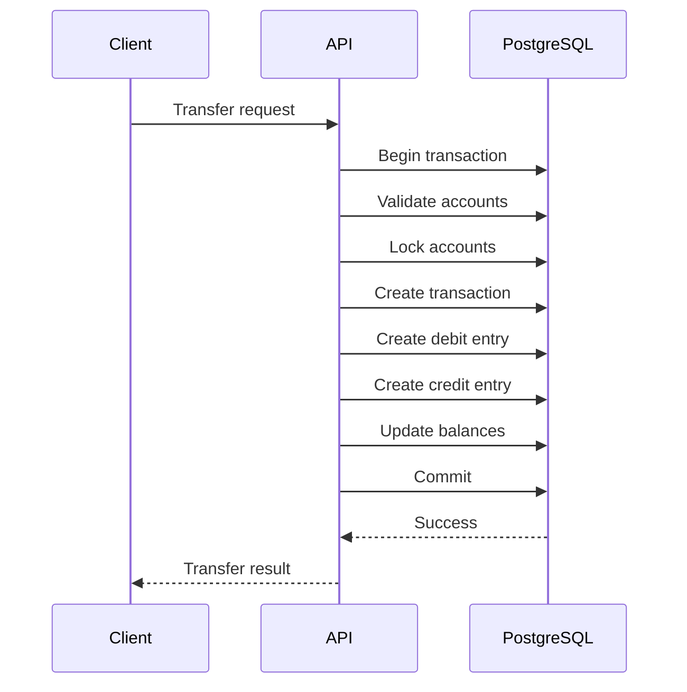
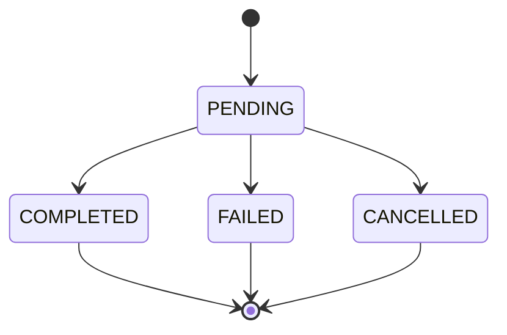

# 01- Requirements

## Overview

This project defines the requirements for a production-oriented **Banking Transaction Database** built with PostgreSQL and consumed by a backend application.

The purpose is to model financial transactions in a way that supports:

- Correct account balances.
- Double-entry transaction records.
- Atomic money movement.
- Transaction history and auditability.
- Concurrent transfers.
- Idempotent payment requests.
- Transaction state management.
- Reconciliation.
- Fraud and operational review.
- High availability and disaster recovery.
- Backend APIs and asynchronous processing.

Banking systems are particularly useful for SQL practice because database correctness is directly connected to financial correctness.

A query that is merely "fast enough" is not sufficient if it can produce:

```text
incorrect balance
duplicate transfer
lost transaction
partial debit
partial credit
```

The core engineering principle is:

> **Financial invariants must be enforced by the database and transaction design, not only by application code.**

---

## System Scope

The database represents a simplified banking platform supporting:

```text
Customers
    ↓
Accounts
    ↓
Transactions
    ↓
Ledger Entries
    ↓
Balances / Reconciliation
```

The system should support both customer-facing operations and internal operational workflows.

### In Scope

- Customer management.
- Account management.
- Account ownership.
- Account status.
- Currency.
- Money transfers.
- Deposits.
- Withdrawals.
- Double-entry ledger.
- Transaction status.
- Idempotency.
- Transaction history.
- Audit information.
- Reconciliation.
- Operational reporting.
- Background transaction processing.

### Out of Scope

The project does not attempt to implement a complete regulated banking platform.

The following are intentionally simplified or excluded unless introduced by later project requirements:

- Full regulatory reporting.
- Real payment-network integration.
- Real card processing.
- KYC provider integration.
- AML case-management systems.
- Central-bank settlement.
- Real-world SWIFT/SEPA/ACH integration.
- Production-grade cryptographic key management.

The database should still model the core correctness properties expected from financial transaction systems.

---

## Functional Requirements

### Customer Management

The system must support:

- Creating customers.
- Updating customer information.
- Activating/deactivating customers.
- Retrieving customer information.
- Listing accounts belonging to a customer.

A customer may own multiple accounts.

```text
Customer
   ├── Checking Account
   ├── Savings Account
   └── Other Account
```

---

## Account Management

The system must support:

- Creating accounts.
- Assigning accounts to customers.
- Tracking account status.
- Tracking account currency.
- Tracking current balance.
- Recording account creation time.
- Closing accounts according to business rules.

Possible account states:

```text
ACTIVE
FROZEN
SUSPENDED
CLOSED
```

Account state transitions should be explicitly controlled.

For example:

```text
ACTIVE → FROZEN
ACTIVE → SUSPENDED
ACTIVE → CLOSED
FROZEN → ACTIVE
SUSPENDED → ACTIVE
```

Not every transition should be allowed.

---

## Account Balance Requirements

The system must maintain an account balance consistent with the ledger.

For example:

```text
Opening balance
+ credits
- debits
= resulting balance
```

However, balance should not be treated as an independently mutable value.

A robust design should define the relationship between:

```text
account balance
+
ledger entries
+
transaction state
```

The database must prevent partial money movement.

---

## Monetary Representation

Money must not be represented using floating-point types.

Avoid:

```python
balance = 100.10
```

for financial arithmetic.

The database should use an exact numeric representation appropriate for the defined currency model, such as:

```sql
NUMERIC(19, 4)
```

or another explicitly justified precision.

The exact precision should be chosen based on supported currencies and business rules.

For systems supporting multiple currencies, the currency code must be stored explicitly.

Example:

```text
amount = 1250.50
currency = USD
```

---

## Currency Requirements

Each monetary value must have an associated currency.

The system must prevent accidental interpretation of:

```text
100 USD
```

as:

```text
100 EUR
```

without an explicit conversion operation.

A transfer between accounts should therefore validate:

```text
source currency
destination currency
```

and apply an explicit FX/business rule if cross-currency transfers are supported.

For the initial project, restricting transfers to the same currency is a reasonable simplification.

---

## Transfer Requirements

The system must support transferring money between two accounts.

A transfer should logically perform:

```text
Debit source account
+
Credit destination account
+
Create transaction record
+
Create ledger entries
```

These operations must succeed or fail atomically.



A failure must not produce:

```text
source debited
destination not credited
```

---

## Double-Entry Requirement

Every completed financial transaction must balance.

For a transfer:

```text
Source account:      -100.00
Destination account: +100.00
--------------------------------
Net movement:           0.00
```

At the ledger level:

```text
total debits = total credits
```

This invariant is fundamental.

A transaction should never be considered financially complete if its ledger representation is unbalanced.

---

## Transaction Identity

Every financial transaction must have a stable unique identifier.

Example:

```text
transaction_id
```

The identifier should remain stable across:

- API retries.
- Background processing.
- Operational investigation.
- Reconciliation.
- Audit queries.

The database should enforce uniqueness rather than relying exclusively on application-level checks.

---

## Idempotency Requirements

Financial APIs must handle retries safely.

For example:

```text
Client
  ↓
POST /transfers
  ↓
Server processes request
  ↓
Network timeout
  ↓
Client retries
```

The retry must not create a second transfer.

The system should support an idempotency key such as:

```text
Idempotency-Key: 9f4...
```

A unique constraint should enforce the invariant.

Conceptually:

```text
customer/request scope
+
idempotency key
→
one logical operation
```

Idempotency must be durable in PostgreSQL rather than maintained only in Redis or application memory.

---

## Transaction Status

A transfer should have an explicit lifecycle.

A simplified state model:



Possible statuses:

| Status | Meaning |
|---|---|
| `PENDING` | Transaction accepted but not finalized |
| `COMPLETED` | Financial operation completed |
| `FAILED` | Operation failed |
| `CANCELLED` | Operation was explicitly cancelled |

State transitions must be controlled.

Avoid allowing arbitrary application code to execute:

```text
PENDING → COMPLETED
COMPLETED → PENDING
FAILED → COMPLETED
```

without business justification.

---

## Ledger Requirements

The ledger is the authoritative historical representation of financial movements.

A ledger entry should contain enough information to establish:

- Transaction identity.
- Account.
- Amount.
- Debit/credit direction.
- Currency.
- Creation timestamp.
- Related transaction.
- Operational metadata where appropriate.

A simplified representation:

```text
Transaction
    |
    +-- Ledger Entry: Account A, DEBIT, 100.00
    |
    +-- Ledger Entry: Account B, CREDIT, 100.00
```

Ledger entries should generally be immutable after posting.

Corrections should normally be represented through additional compensating transactions rather than silently rewriting historical financial records.

---

## Immutable Financial History

Once a financial transaction is completed, historical records should not be freely updated or deleted.

Avoid:

```sql
UPDATE ledger_entries
SET amount = 500
WHERE id = 123;
```

to correct a previous transaction.

Prefer a compensating transaction:

```text
Original:
A → B : 100

Correction:
B → A : 20

Net:
A → B : 80
```

The exact correction model depends on business requirements, but the principle is:

```text
preserve history
+
record correction
```

---

## Deposits

The system must support deposits.

A deposit should create:

```text
transaction
+
credit ledger entry
```

Example:

```text
Cash / external funding source
        ↓
Account +100
```

The project may represent the external side using a system or settlement account rather than modeling a physical cash movement.

---

## Withdrawals

The system must support withdrawals.

A withdrawal should create:

```text
transaction
+
debit ledger entry
```

The system must validate sufficient available funds according to the account's balance model.

Avoid implementing:

```text
SELECT balance
→ check in Python
→ UPDATE balance
```

without concurrency protection.

---

## Insufficient Funds

For accounts that do not allow overdrafts, a transfer must fail atomically when available funds are insufficient.

Example:

```text
Current balance = 500
Transfer = 600
```

Expected:

```text
Debit source      → rejected
Credit destination → not created
Transaction       → failed
```

Never allow:

```text
source = -100
destination = +600
```

unless overdrafts are explicitly supported by the business model.

---

## Account Locking

Concurrent transfers can target the same account.

For example:

```text
Transfer A:
Account X → Account Y

Transfer B:
Account X → Account Z
```

Both operations may attempt to modify Account X simultaneously.

The system must define a concurrency strategy using mechanisms such as:

- Row-level locking.
- Atomic conditional updates.
- Consistent lock ordering.
- Appropriate transaction isolation.

A common PostgreSQL approach is:

```sql
SELECT id, balance
FROM accounts
WHERE id IN ($1, $2)
ORDER BY id
FOR UPDATE;
```

Consistent ordering reduces deadlock risk.

---

## Deadlock Requirements

Transfers involving two accounts can deadlock if concurrent requests acquire locks in different orders.

Bad pattern:

```text
Transaction A:
lock account 1
lock account 2

Transaction B:
lock account 2
lock account 1
```

Potential result:

```text
A waits for B
B waits for A
```

The application should:

- Acquire locks in a consistent order.
- Keep transactions short.
- Handle PostgreSQL deadlock errors.
- Retry the complete transaction where appropriate.

---

## Transaction Isolation

The system should explicitly choose transaction isolation based on the operation.

PostgreSQL commonly uses:

```text
READ COMMITTED
```

as the default.

Not every banking operation requires:

```text
SERIALIZABLE
```

Higher isolation can increase:

- Serialization failures.
- Retries.
- Contention.
- Latency.

The project should demonstrate the difference between:

```text
correct locking
+
atomic updates
+
appropriate isolation
```

rather than assuming maximum isolation is always the safest design.

---

## Balance Consistency

The project must define whether account balance is:

1. Calculated from ledger entries.
2. Stored as a maintained projection.
3. Both, with reconciliation.

For a production-oriented design, a practical approach is:

```text
Ledger
  ↓
authoritative financial history

Account balance
  ↓
maintained transactional projection
```

The balance can provide efficient reads while the ledger provides auditability.

A reconciliation process can compare:

```text
stored balance
vs
ledger-derived balance
```

and identify discrepancies.

---

## Reconciliation

The system should support reconciliation queries.

Example conceptual check:

```sql
SELECT
    account_id,
    SUM(amount) AS ledger_balance
FROM ledger_entries
GROUP BY account_id;
```

The real query must account for debit/credit direction and the defined opening balance model.

Reconciliation should detect:

- Missing ledger entries.
- Duplicate entries.
- Incorrect balances.
- Unbalanced transactions.
- Unexpected transaction states.

Reconciliation should be observable and repeatable.

---

## Audit Requirements

Financial systems require strong auditability.

The system should record relevant metadata such as:

```text
created_at
updated_at
created_by / actor
request identifier
transaction identifier
source
```

The exact fields depend on the business requirements.

Audit information should answer:

```text
What happened?
When did it happen?
Which account was affected?
Which transaction caused it?
Which request initiated it?
What was the resulting state?
```

---

## API Requirements

The backend should expose clear APIs.

Example:

```http
POST /transfers
```

Request:

```json
{
  "source_account_id": "acc_1001",
  "destination_account_id": "acc_2001",
  "amount": "100.00",
  "currency": "USD"
}
```

Response:

```json
{
  "transaction_id": "txn_90001",
  "status": "COMPLETED"
}
```

The API should not expose internal database implementation unnecessarily.

---

## API Error Requirements

The API should distinguish important failure classes.

| Error | Example |
|---|---|
| Validation | Invalid amount |
| Authentication | Missing credentials |
| Authorization | Account not owned by caller |
| Not found | Account does not exist |
| Business rule | Insufficient funds |
| Conflict | Idempotency key reused differently |
| Concurrency | Serialization/deadlock retry exhausted |
| Infrastructure | Database unavailable |

Do not expose raw PostgreSQL error messages to clients.

---

## Security Requirements

Banking data requires strong authorization boundaries.

The system must prevent:

```text
Customer A
    ↓
Customer B's account
```

from being accessed or modified through manipulated identifiers.

Authorization should be scoped by the authenticated principal.

For example:

```sql
SELECT id
FROM accounts
WHERE id = $1
  AND customer_id = $2;
```

Application authorization should be reinforced by database-level controls where appropriate.

---

## Sensitive Data

The database should avoid storing unnecessary sensitive information.

Examples include:

- Authentication secrets.
- Payment credentials.
- Full card numbers.
- Encryption keys.
- External provider secrets.

Secrets should be managed through appropriate infrastructure such as AWS Secrets Manager or another dedicated secret-management system.

Database records should contain only the information required for the business operation.

---

## SQL Injection Protection

All user-controlled values must be parameterized.

Safe:

```python
cursor.execute(
    """
    SELECT id, balance
    FROM accounts
    WHERE customer_id = %s
    """,
    (customer_id,),
)
```

Avoid:

```python
query = f"""
SELECT id, balance
FROM accounts
WHERE customer_id = '{customer_id}'
"""
```

Dynamic SQL identifiers require separate validation and allowlisting.

---

## Data Integrity Requirements

Important invariants should be represented as database constraints wherever possible.

Examples:

```text
account identifier is unique
transaction identifier is unique
idempotency key is unique in its defined scope
account balance follows defined numeric constraints
ledger references valid accounts
ledger references valid transactions
currency values are valid
amounts follow defined sign rules
```

The exact constraint design should follow the chosen ledger representation.

---

## Negative Amount Representation

The project must choose one consistent representation.

For example, ledger entries can represent:

### Option A: Direction + Positive Amount

```text
direction = DEBIT
amount = 100.00
```

or:

```text
direction = CREDIT
amount = 100.00
```

### Option B: Signed Amount

```text
-100.00
+100.00
```

Either approach can work.

The important requirement is consistency and unambiguous aggregation.

For a banking learning project, explicit direction plus non-negative amount can make ledger semantics easier to validate.

---

## Transaction Atomicity

A transfer must be atomic.

Conceptually:

```sql
BEGIN;

-- lock accounts
-- validate balance
-- create transaction
-- create ledger entries
-- update balances

COMMIT;
```

If any operation fails:

```sql
ROLLBACK;
```

The database must never expose a state where only half of the transfer has been committed.

---

## Idempotent Retry Requirements

Consider:

```text
POST /transfers
        ↓
DB commit succeeds
        ↓
response lost
        ↓
client retries
```

The retry must return the existing transaction rather than creating a new financial movement.

The system should therefore store enough information to correlate:

```text
idempotency key
→ transaction
```

A retry using the same key with different request parameters should be rejected rather than silently modifying the original operation.

---

## External Payment Integration

External providers introduce distributed transaction problems.

Avoid:

```text
BEGIN DATABASE TRANSACTION
    ↓
call payment provider
    ↓
wait
    ↓
COMMIT
```

when the provider call can take significant time.

Instead, design an explicit workflow around:

```text
database state
+
idempotency
+
provider request ID
+
webhook/reconciliation
```

The database transaction cannot atomically commit with an external provider.

---

## Event-Driven Requirements

Important transaction events may need to reach other services:

```text
TransactionCompleted
TransactionFailed
AccountFrozen
TransferCreated
```

A transactional outbox is an appropriate pattern:

```text
DB transaction
    ├── transaction state
    ├── ledger entries
    └── outbox event
             ↓
        publisher
             ↓
          Kafka
```

The event should be created in the same transaction as the business state.

---

## Background Processing

Celery or another worker system may process:

- Reconciliation.
- Transaction notifications.
- Outbox publication.
- Failed transaction retries.
- Account statements.
- Fraud review workflows.
- Historical reporting.

Workers must use:

```text
bounded batches
+
idempotent processing
+
retry-safe operations
```

Avoid large transactions containing millions of records.

---

## Reporting Requirements

The system should support queries such as:

```text
Transactions per account
Daily transaction volume
Daily transfer value
Failed transaction count
Top accounts by transaction volume
Transactions by currency
Debit/credit totals
```

Reporting queries should not interfere with latency-sensitive transaction processing unnecessarily.

For larger systems, consider:

```text
read replicas
materialized views
ETL
data warehouse
```

depending on freshness requirements.

---

## Statement Generation

The database should support retrieving transaction history for an account.

Typical access pattern:

```sql
SELECT
    id,
    transaction_id,
    amount,
    direction,
    created_at
FROM ledger_entries
WHERE account_id = $1
ORDER BY created_at DESC, id DESC
LIMIT $2;
```

For large histories, keyset pagination should be preferred over deep offsets.

The cursor should include deterministic ordering fields such as:

```text
created_at
id
```

---

## Performance Requirements

The system should remain efficient for common operations:

| Operation | Expected access pattern |
|---|---|
| Account lookup | Primary/unique key |
| Customer accounts | Customer-scoped index |
| Account transaction history | Account + timestamp + ID |
| Transaction lookup | Unique transaction ID |
| Idempotency lookup | Unique scoped key |
| Pending work | Status + creation time |
| Reconciliation | Batch/analytical access |

Indexes should be designed from actual query patterns.

Do not create indexes on every column.

---

## Scalability Requirements

The design should support growth in:

```text
customers
accounts
transactions
ledger entries
API traffic
background workers
```

The system should avoid architectural assumptions that work only for small datasets.

Important considerations include:

- Composite indexes.
- Keyset pagination.
- Partitioning for very large transaction tables.
- Read replicas.
- Connection pooling.
- Batch processing.
- Archival/retention strategies.
- Efficient reporting architecture.

Partitioning should be introduced only when scale and operational requirements justify it.

---

## High Availability Requirements

A production banking database should minimize the possibility of financial service interruption.

The architecture should consider:

```text
Application instances
        ↓
Load balancer
        ↓
PostgreSQL primary
        ↓
replicas / standby
```

Operational requirements include:

- Automated failover.
- Replication monitoring.
- Connection recovery.
- Backups.
- Point-in-time recovery.
- Restore testing.

Application code must tolerate transient database connection failures without duplicating financial operations.

---

## Disaster Recovery

The project should define:

```text
RPO
RTO
backup retention
restore procedure
failover procedure
```

Financial databases require especially strong recovery guarantees because loss of transaction history can have business and regulatory consequences.

A backup that has never been restored should not be treated as a proven recovery strategy.

---

## Observability Requirements

The system should expose operational metrics such as:

### Database

- Query latency.
- Lock wait time.
- Deadlocks.
- Serialization failures.
- Connection pool utilization.
- CPU.
- Memory.
- Storage.
- WAL generation.
- Replication lag.

### Transaction Processing

- Transfers per second.
- Successful transfers.
- Failed transfers.
- Insufficient-funds failures.
- Retry count.
- Idempotency conflicts.
- Transaction processing latency.

### Reconciliation

- Accounts checked.
- Transactions checked.
- Balance mismatches.
- Unbalanced ledger transactions.
- Reconciliation duration.

---

## Logging Requirements

Logs should contain correlation identifiers such as:

```text
request_id
transaction_id
account_id
```

where appropriate.

Do not log:

- Authentication credentials.
- Secrets.
- Sensitive financial information unnecessarily.
- Full payment credentials.

Logs should support troubleshooting without becoming another source of sensitive-data exposure.

---

## Alerting Requirements

Production alerts should focus on actionable conditions.

Examples:

```text
Database unavailable
Replication lag above threshold
Deadlock rate increasing
Serialization failures increasing
Transaction failure rate increasing
Outbox backlog growing
Reconciliation mismatch detected
Connection pool exhausted
Storage nearing capacity
```

Alerts should distinguish between:

```text
normal business failures
```

and:

```text
systemic infrastructure failures
```

For example, insufficient funds is normally a business outcome, not a database incident.

---

## Reliability Requirements

The system must remain correct under:

- Concurrent transfers.
- API retries.
- Worker retries.
- Database connection failures.
- Process crashes.
- Transaction rollbacks.
- Deadlocks.
- Serialization failures.
- Duplicate messages.
- Delayed messages.
- External provider failures.

Correctness must not depend on a single application process remaining alive.

---

## Failure Scenarios

The project should explicitly reason about failures.

### Application Crashes Before Commit

Expected:

```text
transaction rolled back
```

No partial financial state should remain.

### Application Crashes After Commit

Expected:

```text
financial state remains committed
```

If the client did not receive the response, an idempotent retry should recover the existing transaction.

### Worker Crashes During Event Processing

Expected:

```text
event remains retryable
```

The consumer must tolerate duplicate delivery.

### Database Connection Drops

The application must not assume:

```text
connection failure = transaction definitely rolled back
```

In some situations the commit outcome may be unknown.

Idempotency and reconciliation are important safeguards.

---

## Development and Testing Requirements

The project should run locally using PostgreSQL.

A Docker-based development environment is appropriate.

Example:

```bash
docker run --name banking-postgres \
  -e POSTGRES_USER=banking \
  -e POSTGRES_PASSWORD=banking_dev \
  -e POSTGRES_DB=banking \
  -p 5432:5432 \
  -d postgres
```

Development credentials must never be reused in production.

---

## Test Data Requirements

Sample data should include:

- Multiple customers.
- Multiple accounts per customer.
- Multiple currencies if supported.
- Completed transfers.
- Failed transfers.
- Pending transactions.
- Deposits.
- Withdrawals.
- Multiple transactions per account.
- Concurrent-operation scenarios.
- Idempotency scenarios.
- Reconciliation scenarios.

The dataset should be deterministic so SQL exercises produce repeatable results.

---

## Testing Requirements

### Unit Tests

Test:

- Validation.
- Service-layer rules.
- State transitions.
- API behavior.

### Integration Tests

Use real PostgreSQL to test:

- Constraints.
- Transactions.
- Locks.
- Isolation.
- Ledger behavior.
- Idempotency.
- SQL queries.

### Concurrency Tests

Test:

```text
two simultaneous transfers from one account
two transfers between the same accounts
duplicate API requests
concurrent withdrawals
concurrent deposits
multiple workers processing the same pending operation
```

Concurrency testing is particularly important for financial operations.

---

## Security Testing

The system should test:

- Unauthorized account access.
- Cross-customer account access.
- SQL injection.
- Idempotency abuse.
- Invalid transaction states.
- Excessive transaction amounts.
- Invalid currencies.
- Parameter manipulation.
- Privilege escalation.

Security should be tested at the API and database layers.

---

## Acceptance Criteria

The project is considered functionally complete when:

- Customers can own multiple accounts.
- Accounts have explicit states and currencies.
- Monetary values use exact numeric representation.
- Transfers are atomic.
- Double-entry ledger records are created correctly.
- Completed transactions are balanced.
- Insufficient funds cannot produce partial transfers.
- Concurrent transfers are handled safely.
- Idempotency prevents duplicate financial operations.
- Transaction states follow defined transitions.
- Historical financial records are preserved.
- Reconciliation can identify balance inconsistencies.
- APIs enforce customer/account authorization.
- Queries are parameterized.
- Transaction history supports efficient pagination.
- Important query paths have appropriate indexes.
- Integration tests run against PostgreSQL.
- Failure and retry scenarios are explicitly tested.

---

## Recommended Project Structure

A practical project structure is:

```text
21- projects/
└── 02- Banking Transaction Database/
    ├── 01- Requirements.md
    ├── 02- Tables and Relationships.md
    ├── 03- Sample Data.md
    ├── 04- CRUD Queries.md
    ├── 05- JOIN Queries.md
    ├── 06- Aggregation Queries.md
    ├── 07- Subqueries and CTEs.md
    ├── 08- Window Function Queries.md
    ├── 09- Indexing Strategy.md
    ├── 10- Query Optimization.md
    ├── 11- Transaction Scenarios.md
    ├── 12- Concurrency Scenarios.md
    ├── 13- Reconciliation Queries.md
    ├── 14- Backend Query Patterns.md
    └── README.md
```

The exact file sequence can evolve as the database implementation grows.

---

## Senior-Level Design Questions

The project should eventually support reasoning about questions such as:

- What is the authoritative source of truth for an account balance?
- Should balance be calculated from the ledger or stored separately?
- How do you prevent double spending under concurrent requests?
- How do you guarantee debit and credit atomicity?
- How do you prevent duplicate transfers after an API timeout?
- How do you handle an unknown transaction commit outcome?
- How do you prevent transfer deadlocks?
- When is `SELECT FOR UPDATE` necessary?
- When is an atomic conditional update sufficient?
- What transaction isolation level should be used?
- How should ledger history be corrected?
- How should transaction events be published to Kafka?
- How should external payment providers be integrated?
- How should reconciliation detect data corruption?
- How should transaction history scale to billions of rows?
- How should read replicas be used without violating consistency?
- How should database failover interact with API retries?
- How should financial data be retained and archived?

These questions are central to senior backend and system-design interviews.

---

## Engineering Principles

### Financial State Must Be Atomic

Never allow a transfer to commit only one side of the financial movement.

### The Ledger Must Be Auditable

Historical financial events should be preserved rather than silently rewritten.

### Database Constraints Enforce Invariants

Application validation improves user experience, but the database should enforce critical uniqueness and integrity rules.

### Idempotency Is Mandatory for Retryable Money Operations

A network timeout must not turn one customer request into two financial transactions.

### Concurrency Must Be Designed Explicitly

Correct sequential behavior does not imply correct concurrent behavior.

### External Systems Require Distributed-System Patterns

PostgreSQL cannot share a single ACID transaction with Kafka, payment providers, or arbitrary HTTP services.

Use patterns such as:

```text
idempotency
+
outbox
+
reconciliation
+
retry
```

where appropriate.

---

## Key Takeaways

- **The banking database must treat financial correctness, atomicity, and auditability as primary requirements rather than secondary application concerns.**
- **Transfers require atomic double-entry updates, explicit concurrency control, idempotency, and carefully defined transaction boundaries.**
- **Ledger history should remain auditable and corrections should normally be represented through compensating transactions rather than destructive updates.**
- **Production reliability requires reconciliation, safe retries, observability, high availability, tested disaster recovery, and explicit handling of failures across PostgreSQL and external systems.**
- **The project should evolve from SQL fundamentals into senior-level reasoning about concurrency, financial invariants, backend APIs, event-driven systems, and database operations at scale.**