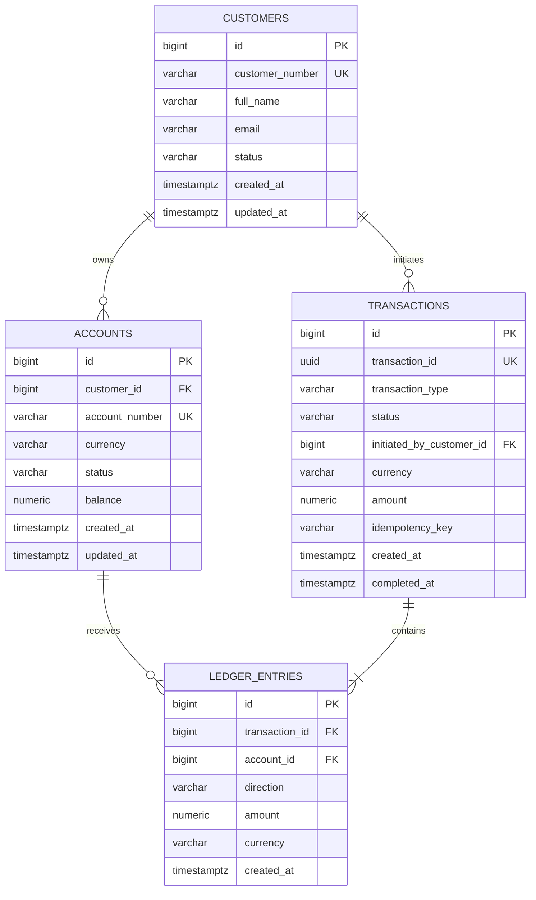
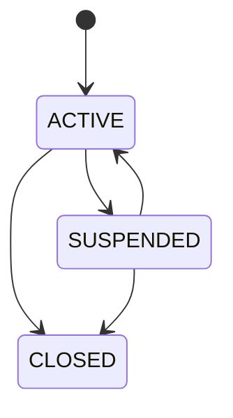

# 02- Schema Design

## Overview

This document defines the relational schema for the **Banking Transaction Database**.

The schema is designed around one primary requirement:

> Financial state must remain correct, traceable, and recoverable under concurrent backend operations and failures.

The database must represent:

- Customers.
- Accounts.
- Account ownership.
- Account balances.
- Financial transactions.
- Double-entry ledger entries.
- Transaction status.
- Idempotency.
- Audit metadata.
- Reconciliation data.

The design intentionally separates **business transaction state** from **ledger history**.

```text
Customer
   ↓
Account
   ↓
Financial Transaction
   ↓
Ledger Entries
   ↓
Balance / Reconciliation
```

PostgreSQL is the source of truth for transactional state.

---

## Design Principles

The schema follows several principles.

| Principle | Design implication |
|---|---|
| Financial correctness | Use constraints and transactions |
| Double-entry accounting | Every posted transaction has balanced ledger entries |
| Historical integrity | Ledger records are append-oriented |
| Idempotency | Durable unique request identifiers |
| Concurrency safety | Explicit locking and atomic updates |
| Auditability | Preserve transaction and ledger history |
| Query efficiency | Index actual backend access patterns |
| Security | Separate ownership and authorization data |
| Scalability | Avoid unnecessary hot rows and unbounded queries |
| Recovery | Preserve enough information for reconciliation |

---

## Domain Model

The initial schema contains the following core entities:

```text
customers
    │
    └── accounts
            │
            ├── transactions
            │       │
            │       └── ledger_entries
            │
            └── balance

transactions
    │
    └── idempotency information

audit information
    │
    └── transaction / account operations
```

A simplified relationship diagram:



---

## Customers

The `customers` table represents the banking customer.

A customer can own multiple accounts.

Example:

```text
Customer 1001
    ├── Checking
    ├── Savings
    └── Foreign Currency Account
```

### Responsibilities

The table stores:

- Customer identity.
- Customer-facing identifier.
- Basic profile information.
- Customer lifecycle status.
- Creation/update timestamps.

It should not store secrets or unnecessary payment credentials.

---

## Customer Status

A simplified status model:

```text
ACTIVE
SUSPENDED
CLOSED
```

Possible transitions:



The database schema should constrain valid values, while application/business logic should control valid transitions.

---

## Accounts

The `accounts` table represents a customer's financial account.

An account has:

- Stable internal ID.
- Unique account number.
- Owner.
- Currency.
- Lifecycle status.
- Current balance.
- Creation timestamp.
- Update timestamp.

The account is the primary object used by transactional operations.

---

## Account Ownership

The basic relationship is:

```text
customer 1 ──────── N accounts
```

The database should enforce this using a foreign key:

```sql
customer_id BIGINT NOT NULL REFERENCES customers(id)
```

This prevents an account from referencing a customer that does not exist.

If joint accounts are later required, the ownership model should be changed to a junction table rather than weakening the current relationship.

---

## Account Number

The externally meaningful account number should be unique.

Example:

```text
account_number = ACCT-10000001
```

The internal primary key can remain a surrogate identifier:

```text
id = 12345
```

This separates:

```text
internal database identity
```

from:

```text
external business identifier
```

Do not assume sequential IDs are suitable as public identifiers.

---

## Account Currency

Every account must have an explicit currency.

Example:

```text
USD
EUR
GBP
INR
```

For the initial project, currency can be represented as an ISO-style three-character code.

```sql
currency CHAR(3) NOT NULL
```

A production system may use a dedicated currency reference table or stronger validation depending on requirements.

---

## Account Status

Suggested states:

```text
ACTIVE
FROZEN
SUSPENDED
CLOSED
```

An account's status determines whether transactions are permitted.

For example:

| Status | Debit | Credit | New transfer |
|---|---:|---:|---:|
| `ACTIVE` | Yes | Yes | Yes |
| `FROZEN` | No | Business-dependent | No |
| `SUSPENDED` | No | Business-dependent | No |
| `CLOSED` | No | Usually no | No |

The exact behavior should be defined by business rules.

Do not encode all state behavior into a simple database `CHECK` constraint because many transitions depend on the current operation and authorization context.

---

## Account Balance

The `balance` column represents the current account balance used for efficient reads.

Example:

```text
balance = 1250.50
```

Use exact numeric arithmetic:

```sql
balance NUMERIC(19, 4) NOT NULL
```

The chosen precision must match the supported currencies and business rules.

Do not use:

```sql
REAL
DOUBLE PRECISION
```

for authoritative monetary values.

---

## Balance as a Projection

The balance should be treated as a maintained projection of financial activity.

Conceptually:

```text
Ledger
  ↓
financial history

Account balance
  ↓
current read-optimized state
```

This provides:

```text
fast balance reads
+
auditable transaction history
```

but introduces a consistency requirement.

Every operation changing the financial state must update the balance and ledger atomically.

---

## Transactions

The `transactions` table represents a logical financial operation.

Examples:

```text
TRANSFER
DEPOSIT
WITHDRAWAL
REFUND
ADJUSTMENT
```

A transaction is not the same thing as a PostgreSQL database transaction.

The distinction is important:

```text
Banking transaction
    = business operation

Database transaction
    = ACID unit of work
```

One banking transaction may require one PostgreSQL transaction to create its records atomically.

---

## Transaction Identifier

Use a stable unique business identifier.

Example:

```text
transaction_id = 8f0b2c2d-...
```

A UUID is appropriate for externally exposed transaction identifiers when sequential public IDs are undesirable.

The database should enforce:

```sql
UNIQUE (transaction_id)
```

The identifier should be stable across retries and operational investigation.

---

## Transaction Type

Suggested values:

```text
TRANSFER
DEPOSIT
WITHDRAWAL
REFUND
ADJUSTMENT
```

The type describes the business operation.

It should not be used as a replacement for ledger direction.

For example:

```text
TRANSFER
```

can produce:

```text
DEBIT account A
CREDIT account B
```

while:

```text
DEPOSIT
```

may produce:

```text
CREDIT customer account
DEBIT system settlement account
```

depending on the ledger model.

---

## Transaction Status

Suggested states:

```text
PENDING
COMPLETED
FAILED
CANCELLED
```

The database should prevent invalid status values.

A PostgreSQL enum can be used, but a constrained text representation can provide simpler migration behavior.

For example:

```sql
status VARCHAR(20) NOT NULL
CHECK (
    status IN (
        'PENDING',
        'COMPLETED',
        'FAILED',
        'CANCELLED'
    )
)
```

The application should enforce valid transitions.

---

## Transaction Amount

A transaction should store the business-level amount.

For example:

```text
transaction:
    amount = 100.00
    currency = USD
```

Ledger entries then represent how that amount affects individual accounts.

This distinction allows:

```text
transaction amount
```

to remain easy to query while:

```text
ledger entries
```

represent the accounting movement.

---

## Transaction Currency

The transaction must have an explicit currency.

For same-currency transfers:

```text
source account = USD
destination account = USD
transaction = USD
```

For the initial project, transfers should require:

```text
source currency = destination currency
```

Cross-currency transfers introduce additional requirements:

- FX rate.
- Rate source.
- Conversion timestamp.
- Spread/fees.
- Multiple currency ledger entries.
- Settlement handling.

These should not be hidden inside a generic `amount` field.

---

## Ledger Entries

The `ledger_entries` table is the historical accounting representation.

A transfer of 100 USD creates:

```text
Transaction T1

Entry 1:
Account A
DEBIT
100 USD

Entry 2:
Account B
CREDIT
100 USD
```

The fundamental invariant is:

```text
Total debits = Total credits
```

for every completed financial transaction.

---

## Ledger Direction

A practical representation is:

```text
direction = DEBIT
amount = 100.00
```

or:

```text
direction = CREDIT
amount = 100.00
```

The amount itself should remain non-negative.

A constraint can enforce this:

```sql
amount NUMERIC(19, 4) NOT NULL
CHECK (amount > 0)
```

This makes direction explicit and avoids ambiguous signed-value semantics.

---

## Ledger Immutability

Completed ledger entries should be treated as append-only.

Avoid destructive corrections:

```sql
UPDATE ledger_entries
SET amount = 50
WHERE id = 123;
```

Instead:

```text
Original transaction
       ↓
Compensating transaction
       ↓
Corrected financial position
```

This preserves the audit trail.

Database permissions should be designed so ordinary application roles cannot arbitrarily rewrite historical ledger records.

---

## Transaction-to-Ledger Relationship

A transaction should have one or more ledger entries.

For a basic transfer:

```text
1 transaction
    ├── debit entry
    └── credit entry
```

For more complex operations:

```text
1 transaction
    ├── debit customer
    ├── credit merchant
    ├── debit fee account
    └── credit revenue account
```

Therefore, the relationship should be:

```text
transaction 1 ──────── N ledger_entries
```

Do not hard-code the schema around exactly two ledger rows if future requirements may introduce fees, taxes, or settlement accounts.

---

## Enforcing Balanced Transactions

A normal row-level `CHECK` constraint cannot easily enforce:

```text
sum(debits) = sum(credits)
```

across multiple ledger rows.

Therefore, the design should use a combination of:

- Application transaction logic.
- Database transaction boundaries.
- Constraints on individual rows.
- Controlled ledger insertion.
- Reconciliation queries.
- Optional database triggers or stored procedures when justified.

The authoritative invariant is:

```text
A completed transaction must have balanced ledger entries.
```

---

## Idempotency

The schema must support safe API retries.

A transfer request may contain:

```text
customer_id
idempotency_key
```

A unique constraint can enforce one logical request per customer.

Example:

```sql
CREATE UNIQUE INDEX transactions_customer_idempotency_key_idx
ON transactions (initiated_by_customer_id, idempotency_key)
WHERE idempotency_key IS NOT NULL;
```

This prevents two concurrent requests from creating duplicate business transactions with the same idempotency key.

---

## Idempotency Request Consistency

A reused idempotency key must not silently represent a different request.

For example:

```text
First request:
key = abc
amount = 100

Retry:
key = abc
amount = 500
```

The backend should reject this as a conflict.

A production design may store a request fingerprint or canonical request metadata alongside the idempotency key.

---

## Audit Metadata

Transactions should contain enough metadata to support investigation.

Useful fields include:

```text
created_at
completed_at
initiated_by_customer_id
request_id
source
```

Not every field must be stored directly on the transaction table.

For high-volume systems, request tracing information and audit records may be separated into dedicated structures.

The important requirement is traceability.

---

## Timestamps

Use PostgreSQL timestamp types appropriate for distributed backend systems.

Prefer:

```sql
TIMESTAMPTZ
```

for application-facing event timestamps.

Examples:

```text
created_at
updated_at
completed_at
```

Applications should consistently handle timestamps in UTC.

Do not store local timezone assumptions inside financial timestamps.

---

## Primary Keys

Use surrogate primary keys for internal relational identity:

```sql
id BIGINT GENERATED BY DEFAULT AS IDENTITY PRIMARY KEY
```

Business identifiers should have their own unique constraints:

```sql
transaction_id UUID NOT NULL UNIQUE
account_number VARCHAR(...) NOT NULL UNIQUE
customer_number VARCHAR(...) NOT NULL UNIQUE
```

This provides stable internal relationships without exposing database implementation details.

---

## Foreign Keys

Important relationships should use foreign keys.

Examples:

```text
accounts.customer_id
transactions.initiated_by_customer_id
ledger_entries.transaction_id
ledger_entries.account_id
```

Foreign keys provide database-enforced referential integrity.

They prevent orphan records and make the relational model explicit.

---

## Delete Strategy

Financial history should generally not use cascading deletes.

Avoid:

```sql
ON DELETE CASCADE
```

on relationships where deleting a parent could destroy financial history.

For example:

```text
customer
  ↓
account
  ↓
ledger
```

should not allow deleting a customer to silently delete financial records.

Prefer lifecycle states such as:

```text
CLOSED
SUSPENDED
```

and controlled archival/retention processes.

---

## Account Closure

Closing an account should be a business operation, not a simple deletion.

Before closure, the application should validate requirements such as:

```text
balance = 0
no pending transactions
no unresolved holds
no active obligations
```

The database can enforce some conditions, while application workflow enforces others.

The account row should remain available for historical references.

---

## Constraints

The initial schema should use constraints for fundamental data integrity.

Examples:

```sql
CHECK (balance >= 0)
CHECK (amount > 0)
CHECK (currency ~ '^[A-Z]{3}$')
CHECK (status IN (...))
```

The exact balance constraint depends on whether overdrafts are supported.

Do not introduce a `balance >= 0` constraint if the business model explicitly permits negative balances.

---

## Example Core DDL

A simplified production-oriented starting point:

```sql
CREATE TABLE customers (
    id BIGINT GENERATED BY DEFAULT AS IDENTITY PRIMARY KEY,
    customer_number VARCHAR(32) NOT NULL UNIQUE,
    full_name VARCHAR(200) NOT NULL,
    email VARCHAR(320) NOT NULL,
    status VARCHAR(20) NOT NULL
        CHECK (status IN ('ACTIVE', 'SUSPENDED', 'CLOSED')),
    created_at TIMESTAMPTZ NOT NULL DEFAULT NOW(),
    updated_at TIMESTAMPTZ NOT NULL DEFAULT NOW()
);

CREATE TABLE accounts (
    id BIGINT GENERATED BY DEFAULT AS IDENTITY PRIMARY KEY,
    customer_id BIGINT NOT NULL
        REFERENCES customers(id),
    account_number VARCHAR(32) NOT NULL UNIQUE,
    currency CHAR(3) NOT NULL,
    status VARCHAR(20) NOT NULL
        CHECK (
            status IN (
                'ACTIVE',
                'FROZEN',
                'SUSPENDED',
                'CLOSED'
            )
        ),
    balance NUMERIC(19, 4) NOT NULL DEFAULT 0
        CHECK (balance >= 0),
    created_at TIMESTAMPTZ NOT NULL DEFAULT NOW(),
    updated_at TIMESTAMPTZ NOT NULL DEFAULT NOW()
);

CREATE TABLE transactions (
    id BIGINT GENERATED BY DEFAULT AS IDENTITY PRIMARY KEY,
    transaction_id UUID NOT NULL UNIQUE,
    transaction_type VARCHAR(20) NOT NULL
        CHECK (
            transaction_type IN (
                'TRANSFER',
                'DEPOSIT',
                'WITHDRAWAL',
                'REFUND',
                'ADJUSTMENT'
            )
        ),
    status VARCHAR(20) NOT NULL
        CHECK (
            status IN (
                'PENDING',
                'COMPLETED',
                'FAILED',
                'CANCELLED'
            )
        ),
    initiated_by_customer_id BIGINT
        REFERENCES customers(id),
    amount NUMERIC(19, 4) NOT NULL
        CHECK (amount > 0),
    currency CHAR(3) NOT NULL,
    idempotency_key VARCHAR(128),
    created_at TIMESTAMPTZ NOT NULL DEFAULT NOW(),
    completed_at TIMESTAMPTZ
);

CREATE TABLE ledger_entries (
    id BIGINT GENERATED BY DEFAULT AS IDENTITY PRIMARY KEY,
    transaction_id BIGINT NOT NULL
        REFERENCES transactions(id),
    account_id BIGINT NOT NULL
        REFERENCES accounts(id),
    direction VARCHAR(10) NOT NULL
        CHECK (direction IN ('DEBIT', 'CREDIT')),
    amount NUMERIC(19, 4) NOT NULL
        CHECK (amount > 0),
    currency CHAR(3) NOT NULL,
    created_at TIMESTAMPTZ NOT NULL DEFAULT NOW()
);

CREATE UNIQUE INDEX transactions_customer_idempotency_key_idx
ON transactions (initiated_by_customer_id, idempotency_key)
WHERE idempotency_key IS NOT NULL;
```

This is a foundation rather than a complete regulated banking schema.

---

## Important Schema Refinements

The simplified DDL above should be refined as the implementation develops.

For example, a production design may introduce:

```text
currency reference table
audit_events
transaction_state_history
account_holds
settlement_accounts
external_reference identifiers
```

These should be introduced only when the requirements justify them.

Avoid premature schema complexity.

---

## Indexing Strategy

Initial indexes should support common backend access patterns.

### Customer Accounts

```sql
CREATE INDEX accounts_customer_id_idx
ON accounts (customer_id);
```

Supports:

```sql
SELECT *
FROM accounts
WHERE customer_id = $1;
```

### Account Ledger History

```sql
CREATE INDEX ledger_entries_account_created_idx
ON ledger_entries (
    account_id,
    created_at DESC,
    id DESC
);
```

Supports:

```text
account transaction history
+
keyset pagination
```

### Transaction Lookup

The unique constraint on:

```text
transaction_id
```

already provides an index.

### Pending Transactions

If workers process pending transactions:

```sql
CREATE INDEX transactions_pending_created_idx
ON transactions (created_at, id)
WHERE status = 'PENDING';
```

Partial indexes should be based on actual worker access patterns.

---

## Balance and Ledger Consistency

The schema contains two related representations:

```text
accounts.balance
```

and:

```text
ledger_entries
```

They must not become independently authoritative.

A transfer should update both in one PostgreSQL transaction:

```text
BEGIN
    ↓
lock accounts
    ↓
validate balances
    ↓
create transaction
    ↓
create ledger entries
    ↓
update balances
    ↓
COMMIT
```

If any step fails:

```text
ROLLBACK
```

---

## Transfer Example

Suppose:

```text
Account A = 1,000 USD
Account B =   500 USD

Transfer = 100 USD
```

After completion:

```text
Account A = 900 USD
Account B = 600 USD
```

Ledger:

```text
Transaction T1

A | DEBIT  | 100 USD
B | CREDIT | 100 USD
```

The total financial movement is balanced:

```text
Debit  = 100
Credit = 100
```

---

## Concurrency Design

The schema must support concurrent requests safely.

Consider:

```text
Account A = 100

Request 1: transfer 80
Request 2: transfer 80
```

Without proper concurrency control:

```text
Request 1 reads 100
Request 2 reads 100
Request 1 transfers 80
Request 2 transfers 80
```

The system could incorrectly allow 160 to leave a 100 balance.

The schema alone does not solve this.

The transaction implementation must combine:

```text
row locking
or
atomic conditional update
+
transaction boundaries
```

with the appropriate business rules.

---

## Lock Ordering

For transfers between two accounts, acquire locks in deterministic order.

For example:

```text
smaller account ID
        ↓
larger account ID
```

Conceptually:

```sql
SELECT id, balance
FROM accounts
WHERE id IN ($1, $2)
ORDER BY id
FOR UPDATE;
```

This reduces the likelihood of deadlocks caused by inconsistent lock acquisition.

---

## Multi-Currency Considerations

A future multi-currency model may require:

```text
transaction
    ├── USD debit
    ├── EUR credit
    └── FX metadata
```

The current simplified model should avoid pretending that:

```text
100 USD = 100 EUR
```

Cross-currency transactions require explicit conversion information.

Do not add an implicit exchange rate to application code without representing the financial event in the database.

---

## Fees

Fees should be represented explicitly when introduced.

For example:

```text
Customer account       DEBIT  105
Fee account             CREDIT 5
Destination account     CREDIT 100
```

This remains balanced:

```text
Total debits  = 105
Total credits = 105
```

Trying to hide fees by modifying the transfer amount can make reconciliation and auditability harder.

---

## Transaction State History

If operational audit requirements become stronger, add a separate history table:

```text
transaction_state_history
```

Example:

```text
T1
PENDING   → 10:00:00
COMPLETED → 10:00:02
```

This is preferable to overwriting status when historical transitions matter.

The same principle already applies to financial ledger history.

---

## Database Ownership

In a monolithic application, all tables may initially be managed by one PostgreSQL schema.

In a microservice architecture, ownership should be explicit.

For example:

```text
Account Service
    ↓
customers
accounts

Transaction Service
    ↓
transactions
ledger_entries
```

Cross-service database joins should generally be avoided.

Use:

```text
APIs
+
events
+
read models
```

when data crosses service boundaries.

---

## Django Mapping

A Django model can represent the relational structure:

```python
class Account(models.Model):
    customer = models.ForeignKey(
        "Customer",
        on_delete=models.PROTECT,
        related_name="accounts",
    )
    account_number = models.CharField(
        max_length=32,
        unique=True,
    )
    currency = models.CharField(max_length=3)
    status = models.CharField(max_length=20)
    balance = models.DecimalField(
        max_digits=19,
        decimal_places=4,
    )
```

`PROTECT` is useful for historical financial relationships because deleting a customer should not silently delete the account.

The final model should also define appropriate database constraints and indexes.

---

## FastAPI Integration

FastAPI does not dictate the database model.

A typical architecture is:

```text
FastAPI
   ↓
Service layer
   ↓
Repository / query layer
   ↓
PostgreSQL
```

The service layer should own business workflows such as:

```text
transfer
withdrawal
deposit
account closure
```

while SQL handles data integrity and transactional operations.

---

## Redis Considerations

Redis should not become the authoritative account balance store.

Avoid:

```text
PostgreSQL balance
      ↕
Redis balance
```

with no clear consistency model.

Redis can cache:

```text
account metadata
customer information
non-critical derived data
```

but financial invariants must remain enforceable by PostgreSQL.

---

## Kafka Considerations

The schema should support eventual integration with Kafka.

A future outbox table could contain:

```text
event_id
aggregate_type
aggregate_id
event_type
payload
created_at
published_at
```

The important architectural boundary is:

```text
PostgreSQL transaction
        ↓
durable event intent
        ↓
Kafka
```

rather than assuming PostgreSQL and Kafka share one transaction.

---

## Security Considerations

### Least Privilege

Application database users should not have unrestricted privileges.

Separate responsibilities where practical:

```text
application role
migration role
read-only reporting role
operational/admin role
```

Ordinary application roles should not be able to arbitrarily delete or modify historical ledger data.

---

### Row-Level Authorization

The application must verify:

```text
authenticated customer
        ↓
owns account
        ↓
authorized operation
```

Database-level row security can provide an additional boundary in appropriate architectures, but it should not replace a clearly designed authorization model.

---

### Sensitive Information

Do not store:

```text
passwords in plaintext
API secrets
encryption keys
full payment credentials
```

The schema should contain only information necessary for the banking domain.

---

## Scalability Considerations

Transaction and ledger tables may become very large.

At scale, consider:

- Composite indexes.
- Keyset pagination.
- Table partitioning where justified.
- Archival/retention policies.
- Read replicas for appropriate read workloads.
- Dedicated reporting infrastructure.
- Connection pooling.
- Batch reconciliation.

Partitioning should be introduced based on measurable workload and operational requirements, not simply because a table is large.

---

## High Availability

The database should support a topology such as:

```text
                    ┌───────────────┐
                    │   PostgreSQL  │
                    │    Primary    │
                    └───────┬───────┘
                            │
                  Streaming Replication
                            │
                  ┌─────────┴─────────┐
                  │                   │
             Read Replica        Standby
```

The application must handle connection failures and failover.

Financial writes should have a clear primary-writer path.

Reads that require read-after-write consistency should not blindly use potentially lagging replicas.

---

## Disaster Recovery

The schema must support recovery requirements such as:

```text
backup
+
WAL
+
point-in-time recovery
+
restore testing
```

Financial transaction history should be recoverable without depending on application caches.

Redis caches should be treated as reconstructible data unless explicitly designed otherwise.

---

## Monitoring

Monitor database behavior relevant to this schema:

### Query Metrics

- Transaction lookup latency.
- Account history query latency.
- Reconciliation query duration.
- Slow queries.
- Query frequency.

### Database Metrics

- CPU.
- Memory.
- Connections.
- Lock waits.
- Deadlocks.
- WAL generation.
- Replication lag.
- Storage growth.
- Vacuum activity.

### Financial Metrics

- Unbalanced transactions.
- Balance mismatches.
- Failed transfers.
- Pending transaction backlog.
- Idempotency conflicts.

Financial correctness metrics are as important as infrastructure metrics.

---

## Common Schema Mistakes

### Using Floating-Point Money

Incorrect:

```sql
balance DOUBLE PRECISION
```

Use exact numeric representation.

---

### Storing Only the Current Balance

A balance without transaction history provides poor auditability.

Use:

```text
current balance
+
ledger history
```

when historical financial reconstruction matters.

---

### Making Ledger Entries Mutable

Overwriting historical entries destroys the audit trail.

Prefer compensating transactions.

---

### Using `ON DELETE CASCADE`

Cascading deletion can destroy financial history.

Use restrictive relationships and explicit lifecycle states.

---

### No Idempotency Constraint

Application-only duplicate detection is vulnerable to concurrent requests.

Use a durable unique constraint.

---

### No Currency Column

A bare:

```text
amount = 100
```

is ambiguous.

Represent:

```text
amount + currency
```

explicitly.

---

### Relying Only on Application Validation

This is unsafe:

```text
Python validates
        ↓
database blindly accepts
```

Critical invariants should also be represented using:

```text
constraints
+
transactions
+
atomic SQL
```

---

### Treating Balance as Independently Editable

Allowing arbitrary:

```sql
UPDATE accounts
SET balance = ...
```

can break the relationship between balance and ledger history.

Balance changes should occur through controlled financial operations.

---

## Schema Design Checklist

Before implementing the next stage, verify:

### Entities

- [ ] Customers are modeled.
- [ ] Accounts are modeled.
- [ ] Financial transactions are modeled.
- [ ] Ledger entries are modeled.
- [ ] Business identifiers are distinct from internal IDs.

### Financial Correctness

- [ ] Money uses exact numeric types.
- [ ] Currency is explicit.
- [ ] Ledger direction is explicit.
- [ ] Ledger amounts are positive.
- [ ] Completed transactions must balance.
- [ ] Balance and ledger updates are atomic.

### Integrity

- [ ] Primary keys exist.
- [ ] Foreign keys exist.
- [ ] Unique business identifiers exist.
- [ ] Status values are constrained.
- [ ] Invalid amounts are rejected.
- [ ] Delete behavior preserves financial history.

### Concurrency

- [ ] Transfer locking strategy is defined.
- [ ] Lock ordering is deterministic.
- [ ] Idempotency is database-enforced.
- [ ] Deadlock handling is planned.
- [ ] Serialization retry behavior is defined.

### Performance

- [ ] Account lookup is indexed.
- [ ] Customer account lookup is indexed.
- [ ] Ledger history supports efficient pagination.
- [ ] Pending worker queries have appropriate indexes.
- [ ] Large-table growth is considered.

### Security

- [ ] Database roles use least privilege.
- [ ] Sensitive fields are minimized.
- [ ] Authorization scope is explicit.
- [ ] Historical ledger modification is restricted.
- [ ] API values are parameterized.

---

## Senior Design Perspective

The most important design decision is not the exact column list.

It is the separation of responsibilities:

```text
Account
    ↓
current financial state

Transaction
    ↓
business operation

Ledger Entry
    ↓
historical accounting movement
```

This separation enables:

```text
fast reads
+
auditability
+
reconciliation
+
concurrency control
+
financial correctness
```

The database should make invalid states difficult to create.

A senior-level design therefore asks:

```text
What is the source of truth?
What must be immutable?
What must be unique?
What must be atomic?
What can happen concurrently?
What happens if the process crashes?
What happens if the client retries?
What happens if the database fails after COMMIT?
How can the financial state be reconciled?
How does the model scale to billions of ledger rows?
```

These questions should drive the schema more than normalization alone.

---

## Key Takeaways

- **Separate customer, account, business transaction, and ledger-entry responsibilities so current state and historical financial movement remain independently understandable.**
- **Use exact monetary types, explicit currencies, database constraints, foreign keys, and durable idempotency keys to enforce core financial invariants.**
- **Treat ledger history as append-oriented and auditable; correct financial mistakes through compensating transactions rather than destructive updates.**
- **Design account balances, locking, transaction boundaries, and ledger writes as one concurrency-sensitive system rather than independent CRUD operations.**
- **A production banking schema must be designed for authorization, reconciliation, observability, high availability, recovery, and long-term transaction growth in addition to relational correctness.**