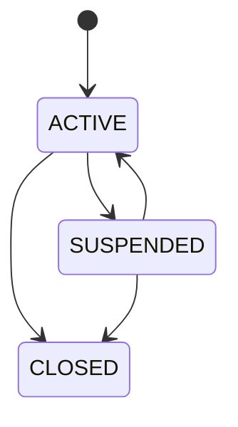
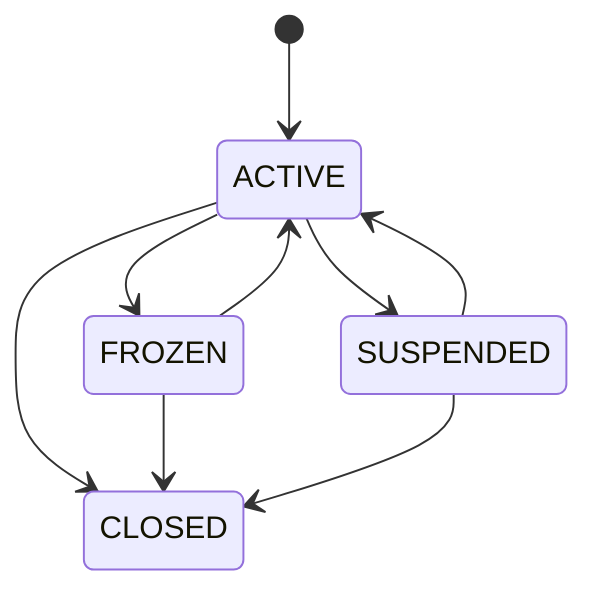

# 03- Accounts and Customers

## Overview

Customers and accounts form the foundation of the banking transaction database.

The relationship is intentionally simple:

```text
Customer
   │
   ├── Account
   ├── Account
   └── Account
```

A customer represents the person or business using the banking platform. An account represents a financial container in a specific currency through which transactions occur.

The design must support:

- Multiple accounts per customer.
- Unique customer and account identifiers.
- Account lifecycle management.
- Explicit currency.
- Current balance tracking.
- Ownership authorization.
- Safe account creation and closure.
- Efficient customer-to-account queries.
- Historical financial references.
- Concurrent account operations.

The important distinction is:

```text
Customer
    = ownership / identity boundary

Account
    = financial state boundary

Transaction
    = business operation

Ledger entry
    = accounting movement
```

Keeping these responsibilities separate makes the rest of the banking schema easier to reason about.

---

## Customer Entity

A customer represents the owner or controller of one or more banking accounts.

A simplified customer record contains:

| Field | Purpose |
|---|---|
| `id` | Internal relational identifier |
| `customer_number` | External/business identifier |
| `full_name` | Customer display name |
| `email` | Contact identifier |
| `status` | Customer lifecycle state |
| `created_at` | Creation timestamp |
| `updated_at` | Last modification timestamp |

A customer should not directly contain financial state.

For example, avoid:

```text
customers.balance
```

because one customer can own multiple accounts, potentially in different currencies.

Balances belong to accounts.

---

## Customer-to-Account Relationship

The initial relationship is:

```text
1 Customer
    ↓
N Accounts
```

Example:

```text
Customer C1001
    │
    ├── Account A1001 / USD
    ├── Account A1002 / USD
    └── Account A1003 / EUR
```

The database should enforce the relationship with a foreign key:

```sql
customer_id BIGINT NOT NULL
    REFERENCES customers(id)
```

This prevents an account from referencing a nonexistent customer.

---

## Customer Identifiers

Use separate identifiers for database identity and business identity.

Example:

```text
id                = 10001
customer_number   = CUST-00010001
```

The internal `id` is useful for joins and foreign keys.

The business identifier can be exposed through APIs.

This separation allows internal database implementation to evolve without changing public identifiers.

A typical constraint is:

```sql
customer_number VARCHAR(32) NOT NULL UNIQUE
```

---

## Customer Email

Email can be used as a contact identifier, but its uniqueness semantics should be explicitly defined.

Do not assume that:

```text
email = identity
```

unless the business requirements guarantee it.

If email must be unique, enforce it with a database constraint.

If the system allows multiple customer records associated with historical or normalized email identities, the schema may require a more explicit identity model.

The important principle is:

> Do not rely on application-level uniqueness checks for business identifiers that must be globally unique.

---

## Customer Status

A simplified customer lifecycle is:

```text
ACTIVE
SUSPENDED
CLOSED
```

Example:



The application should control which transitions are valid.

A database constraint can prevent invalid status values:

```sql
CHECK (
    status IN (
        'ACTIVE',
        'SUSPENDED',
        'CLOSED'
    )
)
```

But a `CHECK` constraint alone does not model all transition rules.

For example, whether:

```text
CLOSED → ACTIVE
```

is allowed is a business decision.

---

## Customer Lifecycle

Customer lifecycle should be different from account lifecycle.

For example:

```text
Customer = ACTIVE
Account  = FROZEN
```

is a valid state.

Likewise:

```text
Customer = SUSPENDED
Account  = ACTIVE
```

may exist historically even if new transactions are prohibited.

Do not collapse customer and account state into one status field.

They represent different business boundaries.

---

## Account Entity

An account represents the financial state against which transactions are posted.

A simplified account contains:

| Field | Purpose |
|---|---|
| `id` | Internal primary key |
| `customer_id` | Account owner |
| `account_number` | External/business identifier |
| `currency` | Account currency |
| `status` | Account lifecycle state |
| `balance` | Current balance projection |
| `created_at` | Creation timestamp |
| `updated_at` | Last modification timestamp |

The account is the object that participates in financial operations.

---

## Account Number

Account numbers should be unique.

Example:

```text
ACCT-10000001
```

Use a database uniqueness constraint:

```sql
account_number VARCHAR(32) NOT NULL UNIQUE
```

Do not rely on:

```python
if not Account.objects.filter(account_number=value).exists():
    create_account()
```

as the only protection.

Concurrent requests can both observe that the value does not exist.

The database constraint is the final authority.

---

## Account Currency

Every account must have an explicit currency.

Example:

```text
Account A1001 → USD
Account A1002 → EUR
```

A monetary value without a currency is incomplete.

Avoid:

```text
balance = 1000
```

without knowing whether the value represents:

```text
USD
EUR
GBP
INR
```

The schema should store currency alongside financial amounts.

---

## Currency Representation

For the initial project:

```sql
currency CHAR(3) NOT NULL
```

is sufficient if the application validates supported ISO-style currency codes.

A stronger design can use a reference table:

```text
currencies
-----------
code
name
minor_units
active
```

This becomes useful when the system needs to model:

- Currency-specific decimal precision.
- Supported/unsupported currencies.
- Currency activation.
- Display names.
- Regulatory restrictions.

Do not introduce a currency table solely for normalization if the project does not need those capabilities.

---

## Monetary Precision

Use exact numeric types for balances.

Example:

```sql
balance NUMERIC(19, 4) NOT NULL
```

Avoid:

```sql
REAL
DOUBLE PRECISION
```

for authoritative monetary values.

Floating-point arithmetic can introduce representation errors that are inappropriate for financial calculations.

Python should also use `Decimal` for monetary operations rather than `float`.

Example:

```python
from decimal import Decimal

amount = Decimal("100.25")
```

---

## Account Balance

The account balance represents the current financial position.

Example:

```text
Account A1001
Currency: USD
Balance: 1250.50
```

The balance should be treated as a maintained projection rather than an independently editable value.

Conceptually:

```text
Ledger entries
       ↓
financial history
       ↓
account balance
       ↓
fast current-state reads
```

This allows account balance queries to remain efficient without calculating the entire ledger every time.

---

## Balance and Ledger Consistency

If the database stores both:

```text
accounts.balance
```

and:

```text
ledger_entries
```

they must be updated consistently.

A transfer should perform:

```text
BEGIN
    ↓
lock relevant accounts
    ↓
validate balances
    ↓
create transaction
    ↓
create ledger entries
    ↓
update balances
    ↓
COMMIT
```

If any operation fails:

```text
ROLLBACK
```

The system must not commit:

```text
balance change
```

without the corresponding:

```text
ledger movement
```

when both are part of the authoritative operation.

---

## Account Balance Constraints

A non-overdraft account can use:

```sql
CHECK (balance >= 0)
```

However, this constraint should only be used if negative balances are genuinely prohibited.

If overdrafts are supported, the model must represent:

```text
available balance
+
overdraft limit
```

or an equivalent business rule.

Do not add `balance >= 0` simply because negative values look invalid.

The constraint must match the actual financial model.

---

## Account Status

A simplified account lifecycle is:

```text
ACTIVE
FROZEN
SUSPENDED
CLOSED
```

Example:



The exact transitions depend on business requirements.

The important distinction is between:

```text
status value constraint
```

and:

```text
state transition authorization
```

The first belongs naturally in the database.

The second is usually implemented as explicit application/service logic, potentially reinforced by database procedures or triggers when justified.

---

## Account Operation Rules

Typical behavior might be:

| Account status | Debit | Credit | Transfer |
|---|---:|---:|---:|
| `ACTIVE` | Yes | Yes | Yes |
| `FROZEN` | No | Business-dependent | No |
| `SUSPENDED` | No | Business-dependent | No |
| `CLOSED` | No | Usually no | No |

These are business rules, not merely column values.

For example, a frozen account may still receive a regulatory refund depending on the domain requirements.

Avoid encoding complex operational policy into scattered SQL predicates.

---

## Account Creation

Account creation should be a controlled business operation.

A simplified flow:

```text
Authenticated customer
        ↓
Validate customer
        ↓
Validate currency
        ↓
Generate unique account number
        ↓
Create account
        ↓
Commit
        ↓
Return account
```

The account should normally begin with:

```text
balance = 0
status = ACTIVE
```

unless the business workflow requires an initial funding transaction.

---

## Initial Funding

If an account is opened with an initial deposit, avoid treating:

```text
INSERT account(balance = 1000)
```

as a complete financial operation.

A stronger design is:

```text
Create account
+
Create deposit transaction
+
Create ledger entries
+
Update balance
```

within the appropriate transactional boundary.

This preserves financial history.

---

## Account Closure

Closing an account should not delete it.

Instead:

```sql
UPDATE accounts
SET
    status = 'CLOSED',
    updated_at = NOW()
WHERE id = $1
  AND status <> 'CLOSED';
```

Before closure, business validation may require:

```text
balance = 0
no pending transactions
no unresolved holds
no outstanding obligations
```

The account remains in the database so historical transactions can continue referencing it.

---

## Why Not Delete Accounts?

Suppose:

```text
Customer
  ↓
Account
  ↓
Ledger Entries
```

Deleting the account could either:

```text
destroy financial history
```

or:

```text
break foreign-key relationships
```

Neither is desirable.

Financial entities generally need lifecycle states and retention policies rather than ordinary CRUD deletion.

---

## Foreign Key Delete Behavior

Use restrictive deletion semantics for financial records.

For example:

```sql
customer_id BIGINT NOT NULL
    REFERENCES customers(id)
    ON DELETE RESTRICT
```

or an equivalent restrictive/default behavior.

In Django, a relationship may use:

```python
on_delete=models.PROTECT
```

This prevents accidental deletion of a parent object that has historical financial dependencies.

Avoid:

```python
on_delete=models.CASCADE
```

for core financial history unless the relationship has a carefully justified lifecycle.

---

## Account Ownership Authorization

The database relationship enables an important security pattern.

Instead of:

```sql
SELECT *
FROM accounts
WHERE id = $1;
```

a customer-facing operation can use:

```sql
SELECT
    id,
    account_number,
    currency,
    status,
    balance
FROM accounts
WHERE id = $1
  AND customer_id = $2;
```

This makes the query itself customer-scoped.

The request flow becomes:

```text
Authenticated customer
        ↓
customer_id
        ↓
account lookup
        ↓
ownership predicate
        ↓
authorized account
```

This reduces the risk of insecure direct object references.

---

## Customer Account Listing

A common API operation is:

```http
GET /customers/{customer_id}/accounts
```

The corresponding query can be:

```sql
SELECT
    id,
    account_number,
    currency,
    status,
    balance,
    created_at
FROM accounts
WHERE customer_id = $1
ORDER BY id;
```

The customer-to-account foreign key should have an index:

```sql
CREATE INDEX accounts_customer_id_idx
ON accounts (customer_id);
```

This supports efficient account listing.

---

## Account Lookup

External operations commonly use account number:

```sql
SELECT
    id,
    customer_id,
    currency,
    status,
    balance
FROM accounts
WHERE account_number = $1;
```

The unique constraint on `account_number` provides an index suitable for this point lookup.

For customer-facing operations, add ownership scope:

```sql
WHERE account_number = $1
  AND customer_id = $2
```

---

## Account Transaction History

Accounts will eventually have many ledger entries.

A common query is:

```sql
SELECT
    id,
    transaction_id,
    direction,
    amount,
    currency,
    created_at
FROM ledger_entries
WHERE account_id = $1
ORDER BY created_at DESC, id DESC
LIMIT $2;
```

A suitable index is:

```sql
CREATE INDEX ledger_entries_account_created_id_idx
ON ledger_entries (
    account_id,
    created_at DESC,
    id DESC
);
```

This supports both:

```text
account filtering
```

and:

```text
deterministic chronological ordering
```

---

## Keyset Pagination for Account History

For large transaction histories, use a cursor rather than deep offsets.

Example:

```sql
SELECT
    id,
    transaction_id,
    direction,
    amount,
    currency,
    created_at
FROM ledger_entries
WHERE account_id = $1
  AND (created_at, id) < ($2, $3)
ORDER BY created_at DESC, id DESC
LIMIT 50;
```

The cursor contains:

```text
created_at
id
```

The combination provides deterministic ordering.

This is preferable to:

```sql
OFFSET 500000
```

when the account has a very large transaction history.

---

## Customer-to-Account Query Pattern

A typical backend query can combine identity and authorization:

```sql
SELECT
    a.id,
    a.account_number,
    a.currency,
    a.status,
    a.balance
FROM accounts AS a
JOIN customers AS c
    ON c.id = a.customer_id
WHERE a.customer_id = $1
  AND c.status = 'ACTIVE'
ORDER BY a.id;
```

Whether checking customer status belongs in every query depends on the authorization model.

Avoid unnecessary joins if the information is already represented by the authenticated request context.

The query should contain only predicates that are actually required.

---

## Account Creation with PostgreSQL

A simple account creation operation:

```sql
INSERT INTO accounts (
    customer_id,
    account_number,
    currency,
    status,
    balance,
    created_at,
    updated_at
)
VALUES (
    $1,
    $2,
    $3,
    'ACTIVE',
    0,
    NOW(),
    NOW()
)
RETURNING
    id,
    account_number,
    currency,
    status,
    balance;
```

`RETURNING` avoids a second query when the newly created representation is required.

---

## Customer Creation

A corresponding customer insert:

```sql
INSERT INTO customers (
    customer_number,
    full_name,
    email,
    status,
    created_at,
    updated_at
)
VALUES (
    $1,
    $2,
    $3,
    'ACTIVE',
    NOW(),
    NOW()
)
RETURNING
    id,
    customer_number,
    full_name,
    email,
    status;
```

The unique constraint on `customer_number` protects against duplicate business identifiers.

---

## Safe Customer Creation Under Concurrency

Avoid:

```text
SELECT customer_number
→ does not exist
→ INSERT
```

as the correctness mechanism.

Two requests can execute concurrently:

```text
Request A → sees absent
Request B → sees absent
Request A → INSERT
Request B → INSERT
```

A unique database constraint ensures only one can succeed.

The application can then translate the constraint violation into an appropriate API response.

---

## Django Model

A representative Django model:

```python
from django.db import models


class Customer(models.Model):
    customer_number = models.CharField(
        max_length=32,
        unique=True,
    )
    full_name = models.CharField(max_length=200)
    email = models.EmailField(max_length=320)
    status = models.CharField(max_length=20)
    created_at = models.DateTimeField(auto_now_add=True)
    updated_at = models.DateTimeField(auto_now=True)


class Account(models.Model):
    customer = models.ForeignKey(
        Customer,
        on_delete=models.PROTECT,
        related_name="accounts",
    )
    account_number = models.CharField(
        max_length=32,
        unique=True,
    )
    currency = models.CharField(max_length=3)
    status = models.CharField(max_length=20)
    balance = models.DecimalField(
        max_digits=19,
        decimal_places=4,
    )
    created_at = models.DateTimeField(auto_now_add=True)
    updated_at = models.DateTimeField(auto_now=True)

    class Meta:
        indexes = [
            models.Index(fields=["customer"]),
        ]
```

The production implementation should additionally define explicit database constraints for supported statuses, currencies, and other invariants.

---

## FastAPI Service Boundary

With FastAPI, the account workflow should normally be separated into:

```text
API layer
    ↓
validation
    ↓
service layer
    ↓
repository/query layer
    ↓
PostgreSQL
```

For example:

```text
POST /accounts
        ↓
AccountService.create_account()
        ↓
validate customer
validate currency
generate identifier
insert account
        ↓
commit
        ↓
API response
```

The service layer should own business workflow decisions.

The database should own relational integrity.

---

## Account Queries and Transactions

Simple reads may not require explicit transactions beyond the database driver's normal statement behavior.

Financial state changes require deliberate transaction boundaries.

For example:

```text
Transfer
    ↓
BEGIN
    ↓
lock source/destination accounts
    ↓
validate state
    ↓
update balances
    ↓
create transaction
    ↓
create ledger entries
    ↓
COMMIT
```

Account reads used for concurrency-sensitive decisions should be performed inside the same transaction as the subsequent state changes.

---

## Concurrent Balance Access

A balance read is not automatically safe for a subsequent update.

Unsafe pattern:

```text
SELECT balance
        ↓
application checks balance
        ↓
UPDATE balance
```

Two concurrent requests can read the same balance.

For a protected read-modify-write operation:

```sql
SELECT
    id,
    balance
FROM accounts
WHERE id = $1
FOR UPDATE;
```

The row lock remains held until the transaction ends.

This must be combined with:

```text
short transaction
+
appropriate lock ordering
+
retry handling
```

---

## Atomic Balance Update

Some operations can avoid a separate locked read.

For example:

```sql
UPDATE accounts
SET
    balance = balance - $1,
    updated_at = NOW()
WHERE id = $2
  AND status = 'ACTIVE'
  AND balance >= $1
RETURNING
    id,
    balance;
```

The result determines whether the operation succeeded.

This pattern can be highly effective for simple invariants.

It does not automatically solve every multi-row financial operation; transfers involving multiple accounts and ledger writes still require an appropriate transaction design.

---

## Customer and Account Security

A banking backend should assume identifiers can be manipulated.

For example:

```http
GET /accounts/1002
```

must not succeed merely because the account exists.

The service must establish:

```text
authenticated principal
        ↓
authorized customer
        ↓
account ownership
        ↓
operation permission
```

The query can enforce ownership:

```sql
WHERE id = $1
  AND customer_id = $2
```

This is particularly important for REST APIs where resource identifiers are often client-visible.

---

## Row-Level Security

PostgreSQL Row-Level Security can provide an additional authorization boundary where appropriate.

A conceptual architecture is:

```text
API
 ↓
authenticated context
 ↓
database transaction
 ↓
transaction-local authorization context
 ↓
RLS policy
 ↓
authorized rows
```

RLS requires careful design around:

- Table ownership.
- `BYPASSRLS`.
- Application roles.
- Connection pooling.
- Transaction-scoped session context.

RLS should complement rather than obscure the application's authorization model.

---

## Connection Pooling Considerations

Backend applications typically use connection pools.

A dangerous assumption is:

```text
connection state persists for this user request
```

because pooled connections are reused.

If authorization context is stored in PostgreSQL session settings, transaction-scoped state such as:

```sql
SET LOCAL ...
```

is safer for request-specific context.

This is especially important with transaction-pooling systems such as PgBouncer.

---

## Account Number Enumeration

Account identifiers should not unnecessarily expose internal database structure.

Avoid using:

```text
1
2
3
4
```

as externally meaningful account identifiers if enumeration creates security or privacy concerns.

Use a separate business identifier such as:

```text
ACCT-...
```

or another appropriately generated identifier.

This does not replace authorization.

An opaque identifier is not a security boundary by itself.

---

## Customer Data Protection

Customer information should be minimized.

Avoid storing sensitive data simply because the schema has space for it.

Apply:

- Least-privilege database roles.
- Encryption in transit.
- Encryption at rest.
- Restricted reporting access.
- Secure secret management.
- Sensitive-field minimization.
- Audit logging for privileged operations.

Do not log complete account balances or other sensitive financial information unless operationally justified.

---

## Indexing Strategy

The initial account/customer indexes should reflect actual query patterns.

| Query | Candidate index |
|---|---|
| Customer by number | Unique constraint |
| Account by number | Unique constraint |
| Accounts by customer | `(customer_id)` |
| Account history | `(account_id, created_at DESC, id DESC)` |
| Customer account list | `(customer_id, id)` if ordering requires it |

Do not automatically create both:

```text
(customer_id)
(customer_id, id)
```

without evidence that both access paths are useful.

The composite index may already satisfy some queries that the single-column index supports.

---

## Partial Indexes

If closed or inactive accounts become a small subset and most queries operate only on active accounts, a partial index may help.

For example:

```sql
CREATE INDEX accounts_active_customer_idx
ON accounts (customer_id, id)
WHERE status = 'ACTIVE';
```

This should only be introduced after validating the workload.

Partial indexes reduce index size for qualifying rows but only help queries whose predicates are compatible with the index condition.

---

## Customer Account Counts

A query such as:

```sql
SELECT
    customer_id,
    COUNT(*) AS account_count
FROM accounts
GROUP BY customer_id;
```

can support operational reporting.

For an individual customer:

```sql
SELECT COUNT(*)
FROM accounts
WHERE customer_id = $1;
```

Do not store:

```text
customers.account_count
```

unless there is a demonstrated need for a denormalized projection.

If it is introduced, its update consistency becomes another invariant.

---

## Closing Accounts Safely

A production closure operation may look conceptually like:

```text
BEGIN
    ↓
lock account
    ↓
verify ACTIVE/FROZEN state
    ↓
verify balance = 0
    ↓
verify no pending financial operations
    ↓
set status = CLOSED
    ↓
COMMIT
```

The lock prevents another transaction from changing the account state while the closure checks are being performed.

The exact validation may require additional tables such as:

```text
transactions
holds
pending transfers
```

so account closure belongs in a business transaction rather than a simple CRUD endpoint.

---

## Customer Closure

Customer closure can be more complex because the customer may own multiple accounts.

A possible rule is:

```text
Customer can be CLOSED only when
all accounts are CLOSED
```

This is not naturally enforceable with a simple row-level `CHECK`.

The application workflow may need to:

```text
lock relevant customer/accounts
        ↓
validate account states
        ↓
change states
        ↓
commit
```

The exact policy should follow business requirements.

---

## High Availability

Customer and account data are part of the transactional database.

The application should generally use:

```text
PostgreSQL primary
```

for financial writes.

Read replicas can serve appropriate read-only workloads, but account reads immediately following a write may require primary reads if read-after-write consistency is required.

For example:

```text
POST transfer
   ↓
primary commits
   ↓
GET account balance
   ↓
primary or consistency-aware routing
```

Do not assume replicas are immediately consistent.

---

## Disaster Recovery

Customer and account records must be recoverable together with transaction and ledger history.

Recovery planning should cover:

```text
customers
+
accounts
+
transactions
+
ledger entries
```

A restored account balance without corresponding ledger history is not a complete recovery.

Use:

- Regular backups.
- WAL-based recovery where appropriate.
- Point-in-time recovery.
- Restore testing.
- Documented recovery procedures.

---

## Monitoring

Useful metrics include:

### Customer

- Customer creation rate.
- Customer suspension rate.
- Customer closure rate.
- Failed customer operations.

### Accounts

- Account creation rate.
- Account closure rate.
- Frozen/suspended account count.
- Balance update latency.
- Account lookup latency.

### Database

- Query latency.
- Lock waits.
- Deadlocks.
- Connection pool utilization.
- Index usage.
- Table growth.
- Replication lag.

### Financial Integrity

- Balance/ledger mismatches.
- Invalid state transitions.
- Failed financial operations.
- Reconciliation discrepancies.

---

## Common Mistakes

### Storing Balance on Customers

Incorrect:

```text
customers.balance
```

A customer may own multiple accounts and currencies.

Store balance at the account level.

---

### Using Floating-Point Balances

Incorrect:

```sql
balance DOUBLE PRECISION
```

Use exact numeric representation.

---

### Deleting Accounts

Deleting an account can destroy or disconnect financial history.

Prefer:

```text
status = CLOSED
```

with appropriate retention policies.

---

### Using Cascade Deletes

Avoid allowing:

```text
DELETE customer
    ↓
DELETE accounts
    ↓
DELETE financial history
```

through unrestricted cascading relationships.

---

### Application-Only Uniqueness

This is unsafe:

```text
check
→ create
```

under concurrency.

Use database uniqueness constraints.

---

### Treating IDs as Authorization

This is unsafe:

```text
/account/123
```

does not prove the caller owns account 123.

Authorization must be explicit.

---

### Direct Balance Mutation

Avoid arbitrary administrative updates such as:

```sql
UPDATE accounts
SET balance = 1000000;
```

for ordinary financial correction workflows.

Balance changes should have a traceable financial operation.

---

### Mixing Customer and Account State

A suspended customer and a frozen account are different concepts.

Do not use one status field to represent both.

---

### Reading from Replicas for Consistency-Critical Operations

A newly committed balance may not immediately be visible on a lagging replica.

Route consistency-sensitive reads appropriately.

---

## Production Checklist

### Customer

- [ ] Internal primary key exists.
- [ ] Business customer identifier is unique.
- [ ] Customer lifecycle is explicit.
- [ ] Sensitive information is minimized.
- [ ] Customer deletion policy preserves financial history.

### Account

- [ ] Account has an owning customer.
- [ ] Account number is unique.
- [ ] Currency is explicit.
- [ ] Monetary values use exact numeric types.
- [ ] Account status is constrained.
- [ ] Balance semantics are clearly defined.
- [ ] Closed accounts remain queryable historically.

### Integrity

- [ ] Foreign keys protect relationships.
- [ ] Unique constraints enforce identifiers.
- [ ] Delete behavior is restrictive for financial history.
- [ ] Balance updates occur through controlled workflows.
- [ ] Ledger and balance updates are atomic.

### Concurrency

- [ ] Read-modify-write operations use appropriate locking.
- [ ] Multi-account operations use deterministic lock ordering.
- [ ] Deadlock handling is defined.
- [ ] Idempotency is supported for retryable financial operations.

### Security

- [ ] Account ownership is enforced.
- [ ] SQL values are parameterized.
- [ ] Database roles follow least privilege.
- [ ] Sensitive data is minimized.
- [ ] Replica routing respects consistency requirements.

### Performance

- [ ] Customer-to-account queries are indexed.
- [ ] Account number lookup uses a unique index.
- [ ] Ledger history supports efficient pagination.
- [ ] Indexes are validated against actual workload.
- [ ] Queries are tested with realistic data volumes.

---

## Senior Design Perspective

Customer and account modeling looks straightforward, but several senior-level concerns emerge immediately.

The most important distinction is:

```text
Customer
    ↓
who owns the financial relationship

Account
    ↓
where financial state exists
```

From there, the design should establish:

```text
Customer
   ↓
Account
   ↓
Balance
   ↓
Transactions
   ↓
Ledger
```

The account balance is optimized for current-state reads, while the ledger provides historical financial evidence.

A strong design therefore avoids treating accounts as ordinary CRUD records.

Account operations must consider:

```text
authorization
+
currency
+
financial invariants
+
concurrency
+
transaction boundaries
+
historical retention
+
auditability
+
reconciliation
```

The database should make invalid states difficult to create, while the service layer should control business workflows such as account closure, suspension, transfer eligibility, and customer lifecycle transitions.

---

## Key Takeaways

- **Customers represent ownership and identity boundaries; accounts represent currency-specific financial state and must remain separate concepts.**
- **Account identifiers, currencies, monetary values, lifecycle states, and ownership relationships should be enforced with explicit database constraints.**
- **Account balances should be treated as maintained financial projections that remain transactionally consistent with ledger activity.**
- **Account operations require explicit authorization, concurrency control, restrictive deletion semantics, and carefully designed transaction boundaries.**
- **Production account design must account for historical retention, replica consistency, reconciliation, observability, high availability, and secure access—not just CRUD functionality.**