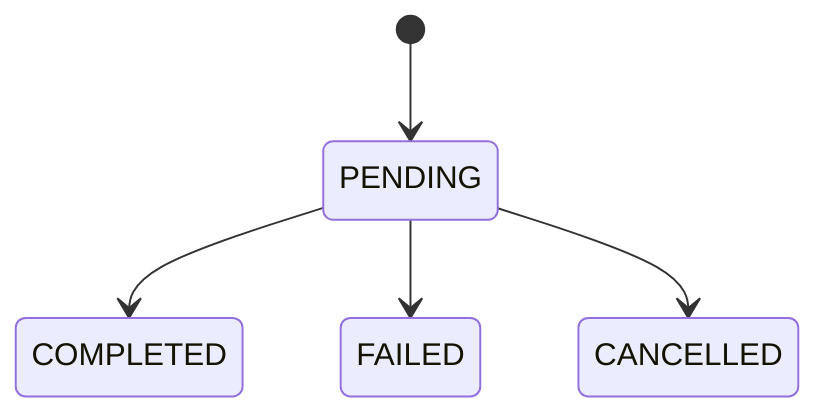
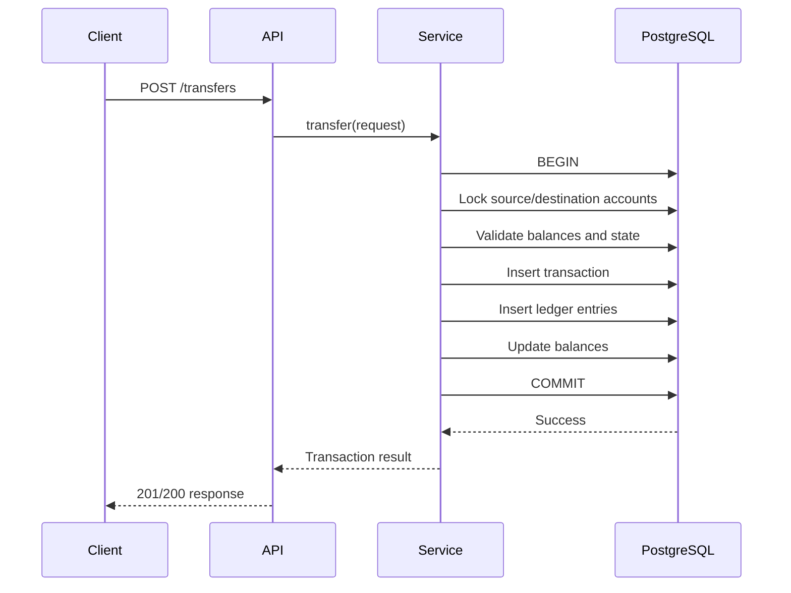

# 04- Transaction Modeling

## Overview

Transaction modeling is the core of a banking transaction database because financial operations must remain correct under retries, concurrency, failures, and partial system outages.

A banking transaction represents a **business-level financial operation**. It is different from a PostgreSQL database transaction:

| Concept | Meaning |
|---|---|
| Banking transaction | Business operation such as transfer, deposit, withdrawal, or refund |
| Database transaction | ACID unit of work used to persist the operation atomically |
| Ledger entry | Accounting movement produced by the business transaction |
| Account balance | Current-state projection derived from financial activity |

A useful mental model is:

```text
API Request
    ↓
Business Transaction
    ↓
PostgreSQL Transaction
    ├── Transaction record
    ├── Ledger entries
    └── Account balance changes
```

For a successful transfer:

```text
Account A
    DEBIT  100 USD
          │
          ▼
     Transaction T1
          │
          ▼
Account B
    CREDIT 100 USD
```

The database design must make it possible to answer:

- What financial operation happened?
- Which accounts were affected?
- How much money moved?
- In which currency?
- Who initiated it?
- Was it successful?
- Can the operation be safely retried?
- Can the resulting balance be reconstructed?
- Can the transaction be reconciled after a failure?
- Can the operation remain correct when multiple requests execute concurrently?

---

## Banking Transaction vs Database Transaction

These terms are frequently confused in interviews and production systems.

### Banking Transaction

A banking transaction is a domain object.

Examples:

```text
TRANSFER
DEPOSIT
WITHDRAWAL
REFUND
ADJUSTMENT
```

It can remain in a state such as:

```text
PENDING
COMPLETED
FAILED
CANCELLED
```

### Database Transaction

A PostgreSQL transaction provides atomicity:

```sql
BEGIN;

-- multiple related statements

COMMIT;
```

or:

```sql
ROLLBACK;
```

The two concepts are related but not interchangeable.

A business transaction can require several SQL statements executed inside one database transaction.

---

## Transaction Responsibilities

A transaction record should capture the business operation without attempting to become the complete accounting ledger.

Typical fields include:

| Field | Purpose |
|---|---|
| `id` | Internal database identity |
| `transaction_id` | Stable business identifier |
| `transaction_type` | Transfer, deposit, withdrawal, etc. |
| `status` | Current lifecycle state |
| `initiated_by_customer_id` | Initiating customer |
| `amount` | Business-level amount |
| `currency` | Transaction currency |
| `idempotency_key` | Retry protection |
| `created_at` | Creation time |
| `completed_at` | Completion time |

Ledger entries provide the account-level financial movements.

---

## Transaction Types

A practical initial set is:

```text
TRANSFER
DEPOSIT
WITHDRAWAL
REFUND
ADJUSTMENT
```

The transaction type describes the business operation.

It should not be used to encode accounting direction.

For example:

```text
TRANSFER
```

may result in:

```text
Account A → DEBIT
Account B → CREDIT
```

while:

```text
REFUND
```

could have a different accounting structure.

The ledger should describe the actual financial movement.

---

## Transaction Status

A simplified lifecycle is:

```text
PENDING
   │
   ├── COMPLETED
   ├── FAILED
   └── CANCELLED
```

Example:



The database should constrain valid status values:

```sql
CHECK (
    status IN (
        'PENDING',
        'COMPLETED',
        'FAILED',
        'CANCELLED'
    )
)
```

The application or service layer should control valid transitions.

---

## Status vs State History

The transaction row should normally store the current state:

```text
transactions.status
```

If historical transitions are required, use a separate table:

```text
transaction_state_history
```

Example:

```text
Transaction T1001

PENDING   10:01:02
COMPLETED 10:01:05
```

This prevents the current transaction row from becoming a substitute for historical audit data.

---

## Transaction Identifier

A transaction should have a stable identifier that can be exposed to clients.

Example:

```text
transaction_id = 9f8b8d0f-...
```

The database should enforce uniqueness:

```sql
transaction_id UUID NOT NULL UNIQUE
```

The identifier should remain unchanged across:

```text
API retries
support investigations
audit operations
event publication
reconciliation
```

---

## Transaction Amount

The transaction amount should use an exact numeric representation.

Example:

```sql
amount NUMERIC(19, 4) NOT NULL
CHECK (amount > 0)
```

The exact precision should be selected based on the supported currencies and financial requirements.

Avoid:

```sql
amount DOUBLE PRECISION
```

for authoritative financial values.

In Python:

```python
from decimal import Decimal

amount = Decimal("100.25")
```

Do not convert monetary values through binary floating-point arithmetic.

---

## Transaction Currency

Every transaction should have an explicit currency:

```text
amount   = 100.00
currency = USD
```

For a same-currency transfer:

```text
Source account      USD
Destination account USD
Transaction         USD
```

A cross-currency transfer is a different modeling problem because it requires explicit:

- Exchange rate.
- Rate timestamp.
- Rate source.
- Source amount.
- Destination amount.
- Fees or spread.
- Settlement details.

Do not silently assume that equal numeric amounts represent equal monetary value across currencies.

---

## Transfer Modeling

A basic transfer can be represented as:

```text
Transaction T1
    amount = 100 USD

Ledger:
    Account A → DEBIT  100 USD
    Account B → CREDIT 100 USD
```

The transaction identifies the business operation.

The ledger entries identify the accounting impact.

This separation is important because one business transaction may generate more than two accounting entries.

---

## Fees

Suppose a customer transfers:

```text
100 USD
```

and pays:

```text
5 USD
```

The ledger may contain:

```text
Customer account       DEBIT  105
Destination account   CREDIT 100
Fee revenue account    CREDIT   5
```

The ledger remains balanced:

```text
Total debits  = 105
Total credits = 105
```

The transaction model should not hide the fee by simply changing the transfer amount.

Explicit financial movements make reconciliation easier.

---

## Double-Entry Principle

For each posted transaction:

```text
SUM(debits) = SUM(credits)
```

This is the central accounting invariant.

For example:

```text
Transaction T1001

Debit:
    Account A      500

Credit:
    Account B      500
```

Balanced:

```text
500 = 500
```

A transaction should not be marked `COMPLETED` if its ledger representation is incomplete or unbalanced.

---

## Why a Separate Ledger Exists

Without a ledger, a system may only know:

```text
Account A balance = 900
```

but not:

```text
Why did it become 900?
```

With a ledger:

```text
Initial balance     1000
Transfer debit       100
Current balance       900
```

The ledger provides historical evidence.

The balance provides fast current-state access.

Therefore:

```text
Balance = current projection
Ledger  = financial history
```

---

## Transaction Atomicity

A transfer must not partially commit.

Incorrect:

```text
UPDATE account A
INSERT ledger A
-- process crashes
UPDATE account B
INSERT ledger B
```

This can leave the system inconsistent.

Instead:

```sql
BEGIN;

-- lock accounts
-- validate account state
-- update balances
-- insert transaction
-- insert ledger entries

COMMIT;
```

Any failure before commit causes the database transaction to roll back.

---

## Transfer Request Lifecycle

A typical backend flow:



External systems such as Kafka or payment providers should generally not be placed inside the database transaction.

---

## Concurrency Problem

Consider:

```text
Account balance = 100
```

Two requests arrive simultaneously:

```text
Request A → withdraw 80
Request B → withdraw 80
```

An unsafe implementation might perform:

```text
A reads 100
B reads 100

A decides 80 is available
B decides 80 is available

A writes 20
B writes 20
```

The system has incorrectly authorized 160 of withdrawals.

Transaction modeling therefore cannot be separated from concurrency control.

---

## Row-Level Locking

A common PostgreSQL strategy is:

```sql
SELECT
    id,
    balance,
    currency,
    status
FROM accounts
WHERE id = $1
FOR UPDATE;
```

The row is locked until the surrounding database transaction completes.

For a transfer involving two accounts, lock both accounts using deterministic ordering.

For example:

```sql
SELECT
    id,
    balance,
    currency,
    status
FROM accounts
WHERE id IN ($1, $2)
ORDER BY id
FOR UPDATE;
```

Deterministic ordering reduces deadlock risk.

---

## Atomic Conditional Updates

Some operations can be implemented with a conditional update:

```sql
UPDATE accounts
SET
    balance = balance - $1,
    updated_at = NOW()
WHERE id = $2
  AND status = 'ACTIVE'
  AND balance >= $1
RETURNING
    id,
    balance;
```

If no row is returned, the debit did not satisfy the conditions.

This can be efficient for simple single-account operations.

For a transfer, however, both account balances, transaction records, and ledger entries still need to be coordinated within the appropriate database transaction.

---

## Idempotency

Financial APIs must expect retries.

A client may submit:

```text
POST /transfers
Idempotency-Key: abc123
```

The request may succeed at the database level while the response is lost due to:

```text
network timeout
```

The client retries.

Without idempotency, the backend may execute the transfer twice.

The database should therefore enforce a uniqueness boundary such as:

```sql
CREATE UNIQUE INDEX transactions_customer_idempotency_key_idx
ON transactions (
    initiated_by_customer_id,
    idempotency_key
)
WHERE idempotency_key IS NOT NULL;
```

---

## Idempotency Key Semantics

An idempotency key identifies one logical client operation.

It should not mean:

```text
every request with this key is accepted
```

Instead:

```text
same key
+
same logical request
=
same operation
```

A reused key with materially different request parameters should be rejected.

For example:

```text
First request:
key = abc
amount = 100

Retry:
key = abc
amount = 500
```

should result in a conflict rather than creating or modifying a transaction.

---

## Idempotency and Concurrent Requests

Two identical requests may arrive at the same time:

```text
Request A → key = abc
Request B → key = abc
```

Application-level checks can race.

A database unique constraint provides the final serialization point.

The service should translate a uniqueness conflict into either:

```text
existing transaction response
```

or:

```text
idempotency conflict
```

depending on whether the request parameters match.

---

## Unknown Commit Outcome

A particularly difficult case occurs when:

```text
database COMMIT succeeds
        ↓
network connection fails
        ↓
application does not know whether commit succeeded
```

The client may retry.

This is another reason durable idempotency is essential.

The backend should be able to reconcile:

```text
idempotency key
        ↓
transaction record
        ↓
final business state
```

rather than blindly executing the operation again.

---

## Transaction Creation Order

A practical transfer flow is:

```text
BEGIN
  ↓
Acquire account locks
  ↓
Validate account state
  ↓
Validate currency compatibility
  ↓
Validate available balance
  ↓
Create transaction
  ↓
Create ledger entries
  ↓
Update balances
  ↓
Commit
```

The exact order can vary, but all state changes that must be atomic should belong to the same database transaction.

---

## Transaction Creation Example

```sql
INSERT INTO transactions (
    transaction_id,
    transaction_type,
    status,
    initiated_by_customer_id,
    amount,
    currency,
    idempotency_key,
    created_at
)
VALUES (
    $1,
    'TRANSFER',
    'COMPLETED',
    $2,
    $3,
    $4,
    $5,
    NOW()
)
RETURNING
    id,
    transaction_id,
    status;
```

In a real workflow, the transaction should only become `COMPLETED` after all required ledger and balance operations have succeeded.

---

## Ledger Entry Creation

For a same-currency transfer:

```sql
INSERT INTO ledger_entries (
    transaction_id,
    account_id,
    direction,
    amount,
    currency,
    created_at
)
VALUES
    ($1, $2, 'DEBIT', $3, $4, NOW()),
    ($1, $5, 'CREDIT', $3, $4, NOW());
```

The application should ensure the corresponding transaction is valid and the ledger is balanced before committing.

---

## Preventing Duplicate Ledger Entries

The transaction design should prevent accidental duplicate accounting movements.

A useful constraint can depend on the business model.

For a basic two-sided transfer, the application can enforce the expected number and structure of entries.

For a general ledger, however, a transaction may legitimately contain many entries.

Therefore, do not impose an artificial:

```text
UNIQUE(transaction_id)
```

on `ledger_entries`.

The relationship is intentionally:

```text
one transaction → many ledger entries
```

---

## Transaction State Transitions

Status changes should be explicit.

For example:

```text
PENDING → COMPLETED
PENDING → FAILED
PENDING → CANCELLED
```

Avoid unrestricted updates such as:

```sql
UPDATE transactions
SET status = $1
WHERE id = $2;
```

without validating whether the requested transition is allowed.

A conditional update can enforce part of the transition:

```sql
UPDATE transactions
SET
    status = 'COMPLETED',
    completed_at = NOW()
WHERE id = $1
  AND status = 'PENDING'
RETURNING id;
```

If no row is returned, another operation may already have changed the transaction state.

---

## Optimistic State Transitions

Conditional updates are useful for avoiding lost state transitions.

Example:

```text
Worker A:
PENDING → COMPLETED

Worker B:
PENDING → FAILED
```

Both workers should not successfully transition the same transaction.

A conditional update provides a database-level compare-and-set behavior:

```sql
WHERE status = 'PENDING'
```

Only one update can win.

---

## Failed Transactions

A failed transaction should preserve the fact that the operation was attempted.

Avoid deleting the transaction:

```sql
DELETE FROM transactions
WHERE id = $1;
```

Instead:

```text
status = FAILED
```

with appropriate failure metadata if required.

This supports:

- Operational debugging.
- Customer support.
- Retry decisions.
- Reconciliation.
- Audit requirements.

---

## Cancellation

Cancellation is different from deletion.

A transaction may be cancellable while still pending:

```text
PENDING → CANCELLED
```

Once a transaction has posted financial movements, cancellation may require a compensating transaction rather than simply changing its status.

This distinction is critical.

---

## Reversals and Corrections

Suppose a completed transaction was incorrect.

Do not normally rewrite its historical ledger entries.

Instead:

```text
Original transaction
        ↓
Compensating / reversal transaction
        ↓
Corrected financial position
```

Example:

```text
Original:
Account A DEBIT 100
Account B CREDIT 100

Reversal:
Account A CREDIT 100
Account B DEBIT 100
```

Both transactions remain visible.

---

## Refund Modeling

A refund should generally be represented as its own financial transaction.

Avoid simply changing:

```text
original transaction.amount
```

after the transaction has completed.

A refund provides a separate financial event:

```text
Original transaction
        ↓
Refund transaction
        ↓
Ledger entries
```

This preserves financial history.

---

## Transaction Metadata

Useful metadata may include:

```text
request_id
correlation_id
source
channel
external_reference
created_at
completed_at
```

Examples of `source`:

```text
API
MOBILE
ADMIN
BATCH
INTERNAL
```

Avoid storing excessive request metadata directly in the transaction table if it belongs to infrastructure observability rather than the financial domain.

---

## External References

External systems may provide identifiers:

```text
payment_provider_reference
bank_reference
settlement_reference
```

These should be represented explicitly when they are required for reconciliation.

Do not overload:

```text
transaction_id
```

to represent every external identifier.

A transaction can have multiple external references.

---

## Transaction and Kafka

A completed banking transaction may need to generate an event:

```text
Transaction completed
        ↓
Kafka event
```

Do not rely on:

```text
DB COMMIT
+
Kafka publish
```

as an atomic operation.

A process can crash between them.

A common solution is the transactional outbox pattern:

```text
PostgreSQL transaction
    ├── transaction
    ├── ledger entries
    ├── balance changes
    └── outbox event
             ↓
        background publisher
             ↓
            Kafka
```

This ensures the event intent is durably recorded with the financial operation.

---

## Transactional Outbox

A simplified outbox record might contain:

```text
event_id
aggregate_type
aggregate_id
event_type
payload
created_at
published_at
```

The outbox record is inserted in the same database transaction as the financial state.

A Celery worker or dedicated publisher can then publish it to Kafka.

This is especially useful when downstream systems require reliable notification of completed transactions.

---

## Redis and Transactions

Redis should not be the authoritative source for financial transaction state.

Avoid:

```text
Redis balance
     ↓
PostgreSQL eventually
```

for authoritative financial operations unless the system has a deliberately designed financial consistency model.

Redis can support:

- Rate limiting.
- Short-lived idempotency caching.
- Session state.
- Non-authoritative read models.

The source of truth should remain the transactional database.

---

## REST API Example

A transfer request might look like:

```http
POST /v1/transfers
Idempotency-Key: 8e0c6e1d-8c7a-4e37-9a0f-123456789abc
Content-Type: application/json
```

```json
{
  "source_account_id": 1001,
  "destination_account_id": 1002,
  "amount": "100.00",
  "currency": "USD"
}
```

The response should expose a stable business identifier:

```json
{
  "transaction_id": "7f8d7e5e-4f8f-4e4f-a6cb-4b7c1d6e7b11",
  "status": "COMPLETED",
  "amount": "100.00",
  "currency": "USD"
}
```

Use strings for JSON monetary values when necessary to avoid client-side floating-point ambiguity.

---

## Django Transaction Boundary

Django provides explicit transaction management:

```python
from django.db import transaction

with transaction.atomic():
    # Lock and validate the relevant accounts.
    # Create transaction and ledger records.
    # Update account balances.
    pass
```

The important point is not merely using `atomic()`.

The implementation must also define:

```text
what is locked
+
when it is locked
+
which invariants are checked
+
which writes belong to the transaction
```

---

## Django Row Locking

For a concurrency-sensitive operation:

```python
from django.db import transaction

with transaction.atomic():
    accounts = (
        Account.objects
        .select_for_update()
        .filter(id__in=[source_id, destination_id])
        .order_by("id")
    )

    accounts_by_id = {account.id: account for account in accounts}

    source = accounts_by_id[source_id]
    destination = accounts_by_id[destination_id]

    # Validate state and apply the business operation.
```

Deterministic ordering is useful when multiple transactions can lock overlapping account sets.

---

## FastAPI Service Layer

A FastAPI implementation should normally keep transaction orchestration in the service layer rather than inside the route handler.

Conceptually:

```text
FastAPI route
    ↓
TransferService
    ↓
Repository / SQL
    ↓
PostgreSQL
```

The route handles:

```text
HTTP concerns
```

while the service handles:

```text
financial workflow
```

and the database enforces:

```text
relational invariants
```

---

## Transaction Isolation

PostgreSQL isolation affects transaction behavior.

Common levels include:

| Isolation | Typical use |
|---|---|
| `READ COMMITTED` | Default and common OLTP workload |
| `REPEATABLE READ` | Stronger statement/transaction consistency |
| `SERIALIZABLE` | Strongest isolation, with possible serialization failures |

A banking system should not automatically choose `SERIALIZABLE` for every operation.

Isolation level should be selected based on the invariant and workload.

For many account operations:

```text
READ COMMITTED
+
row locks
+
atomic updates
+
constraints
```

may be sufficient.

---

## Serialization Failures

At higher isolation levels, PostgreSQL may abort a transaction because the operation cannot be serialized safely.

Applications may need to retry the **entire transaction**.

A retry strategy should distinguish errors such as:

```text
serialization failure
deadlock
unique constraint violation
business validation failure
```

Do not blindly retry every database error.

---

## Deadlocks

Deadlocks can occur when transactions acquire locks in different orders.

Example:

```text
Transaction A:
locks Account 1
waits for Account 2

Transaction B:
locks Account 2
waits for Account 1
```

Deterministic account locking order greatly reduces this risk.

If PostgreSQL detects a deadlock, one transaction is aborted.

The service should be prepared to retry appropriate idempotent operations.

---

## Transaction Timeouts

Financial operations should not remain open indefinitely.

Relevant PostgreSQL controls include:

```text
statement_timeout
lock_timeout
idle_in_transaction_session_timeout
```

They solve different problems.

For example:

- `statement_timeout` limits statement execution time.
- `lock_timeout` limits waiting for a lock.
- `idle_in_transaction_session_timeout` terminates sessions that remain idle inside an open transaction.

Long-running transactions can increase:

- Lock contention.
- MVCC retention.
- Vacuum pressure.
- Replication lag.
- Operational risk.

---

## Large Transactions

Avoid putting unrelated work inside a financial transaction.

Bad:

```text
BEGIN
    update account
    call external API
    send email
    publish Kafka message
    generate report
    COMMIT
```

Better:

```text
BEGIN
    update financial state
    insert outbox event
COMMIT

then:

outbox
    ↓
Kafka / worker
    ↓
external side effects
```

The database transaction should remain focused and short.

---

## External Payment Providers

Do not hold database locks while waiting for an external provider.

Avoid:

```text
BEGIN
    lock account
    call payment provider
    wait 10 seconds
    update database
COMMIT
```

Prefer a state-machine or durable workflow:

```text
Create transaction
    ↓
PENDING
    ↓
External operation
    ↓
Provider result
    ↓
Finalize transaction
```

The exact architecture depends on whether the external provider operation is reversible, idempotent, and authoritative.

---

## Transaction Reconciliation

Financial systems require reconciliation because distributed operations can fail in ambiguous ways.

Useful reconciliation relationships include:

```text
Transaction
    ↕
Ledger
    ↕
Account balance
    ↕
External reference
```

A reconciliation process can identify:

```text
unbalanced transactions
missing ledger entries
unexpected status
balance mismatches
missing external settlements
duplicate external references
```

Reconciliation is not merely an operational report; it is part of financial correctness.

---

## Balance Reconciliation

For an account:

```text
Expected balance
    =
opening balance
+
credits
-
debits
```

The exact accounting equation depends on the ledger model.

A reconciliation query may aggregate ledger activity:

```sql
SELECT
    account_id,
    SUM(
        CASE
            WHEN direction = 'CREDIT' THEN amount
            WHEN direction = 'DEBIT' THEN -amount
        END
    ) AS net_movement
FROM ledger_entries
GROUP BY account_id;
```

For a production system, the calculation must account for:

- Opening balances.
- Account type.
- Currency.
- Reversals.
- Adjustments.
- Cutoff timestamps.
- Ledger semantics.

---

## Transaction Indexing

Useful indexes depend on access patterns.

### Transaction Identifier

Already covered by:

```sql
UNIQUE (transaction_id)
```

### Idempotency

The partial unique index:

```sql
CREATE UNIQUE INDEX transactions_customer_idempotency_key_idx
ON transactions (
    initiated_by_customer_id,
    idempotency_key
)
WHERE idempotency_key IS NOT NULL;
```

### Customer Transactions

If customer transaction history is a common query:

```sql
CREATE INDEX transactions_customer_created_idx
ON transactions (
    initiated_by_customer_id,
    created_at DESC,
    id
);
```

### Pending Processing

For worker workloads:

```sql
CREATE INDEX transactions_pending_created_idx
ON transactions (
    created_at,
    id
)
WHERE status = 'PENDING';
```

Indexes should be validated with real query plans and production-like data distributions.

---

## Transaction History Pagination

Avoid deep offset pagination:

```sql
SELECT ...
FROM transactions
WHERE initiated_by_customer_id = $1
ORDER BY created_at DESC
OFFSET 500000
LIMIT 50;
```

Prefer keyset pagination:

```sql
SELECT
    id,
    transaction_id,
    status,
    amount,
    currency,
    created_at
FROM transactions
WHERE initiated_by_customer_id = $1
  AND (created_at, id) < ($2, $3)
ORDER BY created_at DESC, id DESC
LIMIT 50;
```

The composite index should match the access pattern.

---

## Security Considerations

Transaction APIs are high-value authorization targets.

Every operation should verify:

```text
authenticated principal
        ↓
customer authorization
        ↓
source account ownership
        ↓
destination account validity
        ↓
transaction permissions
```

Do not rely on:

```text
transaction_id
```

or:

```text
account_id
```

as proof of authorization.

All SQL values must be parameterized.

---

## SQL Injection

Avoid constructing transaction queries with string interpolation.

Incorrect:

```python
query = f"""
SELECT *
FROM accounts
WHERE id = {account_id}
"""
```

Use parameter binding through the database driver or ORM.

Django ORM and SQLAlchemy parameterize normal query values when used correctly.

Parameterization protects SQL values, but dynamic identifiers such as table or column names require a different safe design, typically using strict allowlists or database-driver identifier composition.

---

## Auditability

For high-value operations, audit information should make it possible to answer:

```text
Who initiated it?
When?
From which channel?
Which account?
Which transaction?
What was the result?
Which external reference was involved?
```

Do not depend exclusively on application logs.

Logs can be:

```text
rotated
lost
sampled
redacted
```

Critical financial state should remain in durable database records.

---

## High Availability

Transaction writes should normally use the PostgreSQL primary.

A typical architecture:

```text
                    ┌───────────────┐
                    │ PostgreSQL    │
                    │ Primary       │
                    └───────┬───────┘
                            │
                     Replication
                            │
                ┌───────────┴───────────┐
                │                       │
           Read Replica            Standby
```

Read replicas can support suitable reporting or historical queries.

Do not use a lagging replica for a read that must immediately reflect a just-committed transfer unless the application has a consistency strategy.

---

## Disaster Recovery

Transaction modeling should support database recovery without depending on application memory or caches.

Recovery mechanisms should include:

- Automated backups.
- WAL retention.
- Point-in-time recovery.
- Restore testing.
- Replication.
- Documented recovery procedures.

After recovery, reconciliation should verify:

```text
transactions
+
ledger entries
+
account balances
```

remain internally consistent.

---

## Monitoring

Important transaction metrics include:

### Business Metrics

- Transactions per second.
- Successful transactions.
- Failed transactions.
- Pending transaction count.
- Idempotency conflicts.
- Reversal volume.
- Reconciliation discrepancies.

### Database Metrics

- Transaction latency.
- Lock waits.
- Deadlocks.
- Serialization failures.
- Connection pool utilization.
- WAL generation.
- Replication lag.
- Slow queries.

### Operational Alerts

Alert on conditions such as:

```text
pending transactions continuously increasing
ledger imbalance detected
balance reconciliation failure
replication lag beyond threshold
deadlock rate increasing
database connection exhaustion
```

Monitoring should distinguish financial correctness failures from normal infrastructure noise.

---

## Common Mistakes

### Treating Banking and Database Transactions as the Same Thing

They represent different concepts.

A banking transaction can contain several SQL statements inside one database transaction.

---

### Updating Balance Without Ledger

This creates a financial state that cannot be properly explained or reconciled.

Use an atomic workflow that updates the balance and records the corresponding financial movement.

---

### Writing Ledger Rows Without Updating Balance

This produces the inverse inconsistency.

Both representations must have clearly defined consistency semantics.

---

### Using Floating Point

Avoid:

```python
float
```

and:

```sql
DOUBLE PRECISION
```

for authoritative monetary values.

---

### No Idempotency

A lost response followed by a client retry can create duplicate financial operations.

Use durable idempotency semantics and database uniqueness.

---

### Checking Idempotency Only in Python

This race is unsafe:

```text
SELECT key
→ not found
→ INSERT
```

Two concurrent requests can both pass the check.

Use a unique database constraint.

---

### Deleting Failed Transactions

Deleting a failed attempt removes useful operational history.

Preserve transaction state.

---

### Rewriting Completed Transactions

Do not mutate historical financial facts simply to correct an error.

Use compensating transactions where appropriate.

---

### Calling External Services Inside a Database Transaction

This increases lock duration and creates distributed failure modes.

Persist durable intent and perform external side effects outside the core financial transaction where the workflow permits it.

---

### Locking Accounts in Different Orders

Inconsistent lock ordering increases deadlock risk.

Use deterministic ordering for multi-account operations.

---

### Retrying Every Database Error

Some errors are permanent business failures.

Retry only errors known to be transient and ensure the entire operation is safe to retry.

---

### Assuming Commit Failure Means Rollback

A connection failure around commit can produce an unknown outcome.

The operation may have committed.

Use idempotency and reconciliation to resolve ambiguity.

---

## Production Transaction Checklist

### Modeling

- [ ] Banking transaction is distinct from database transaction.
- [ ] Transaction type is explicit.
- [ ] Transaction status is constrained.
- [ ] Business transaction ID is unique.
- [ ] Amount uses exact numeric representation.
- [ ] Currency is explicit.
- [ ] Ledger entries represent account-level financial movement.

### Financial Correctness

- [ ] Posted transactions have balanced ledger entries.
- [ ] Balance and ledger changes have defined consistency semantics.
- [ ] Historical ledger entries are append-oriented.
- [ ] Corrections use compensating transactions where appropriate.
- [ ] Refunds are represented as explicit financial operations.

### Concurrency

- [ ] Account locking strategy is defined.
- [ ] Multi-account locks use deterministic ordering.
- [ ] Conditional state transitions are used where appropriate.
- [ ] Deadlocks are handled.
- [ ] Serialization failures are handled when applicable.

### Reliability

- [ ] Idempotency keys are durable.
- [ ] Duplicate requests are prevented by database constraints.
- [ ] Unknown commit outcomes are handled.
- [ ] External side effects are not unnecessarily held inside database transactions.
- [ ] Reconciliation procedures exist.

### Security

- [ ] Account ownership is verified.
- [ ] Transaction authorization is explicit.
- [ ] SQL values are parameterized.
- [ ] Database roles use least privilege.
- [ ] Sensitive financial information is appropriately protected.

### Operations

- [ ] Transaction latency is monitored.
- [ ] Pending transaction backlog is monitored.
- [ ] Lock waits and deadlocks are monitored.
- [ ] Replication lag is monitored.
- [ ] Ledger/balance reconciliation is automated.
- [ ] Backup and restore procedures are tested.

---

## Senior Design Perspective

A senior transaction model is not simply:

```text
transactions(id, amount, status)
```

The real design is:

```text
             Business Transaction
                     │
        ┌────────────┼────────────┐
        ↓            ↓            ↓
     Status       Idempotency   Metadata
        │
        ↓
    Ledger Entries
        │
        ↓
    Account State
        │
        ↓
 Reconciliation
```

The critical invariants are:

```text
same logical request
        ↓
one financial operation

one completed operation
        ↓
balanced ledger

balance change
        ↕
corresponding financial movement

completed historical fact
        ↓
not destructively rewritten
```

The database provides the strongest local guarantees through:

```text
constraints
+
transactions
+
row locks
+
atomic updates
+
unique indexes
```

The application/service layer provides:

```text
authorization
+
workflow
+
state transitions
+
retry policy
+
external integration
```

The architecture around PostgreSQL provides:

```text
outbox
+
Kafka
+
Celery
+
reconciliation
+
observability
```

The most important engineering principle is to design for failure as a normal operating condition.

A robust transaction model assumes:

```text
requests retry
connections fail
workers crash
locks conflict
replicas lag
external providers timeout
responses are lost
processes restart
```

The schema and transaction workflow should make those failures recoverable without creating duplicate or untraceable financial state.

---

## Key Takeaways

- **A banking transaction is a business operation, while a PostgreSQL transaction is the atomic persistence mechanism used to implement it.**
- **Financial correctness depends on coordinated transaction records, balanced ledger entries, and account-balance updates protected by appropriate constraints and concurrency control.**
- **Idempotency must be durable and database-enforced because retries, concurrent requests, and unknown commit outcomes are normal distributed-system failure modes.**
- **Completed financial history should be preserved; corrections, refunds, and reversals should generally create new compensating financial events rather than rewriting historical records.**
- **Production transaction design extends beyond SQL to include authorization, reconciliation, outbox/Kafka integration, monitoring, high availability, recovery, and failure-aware workflow design.**