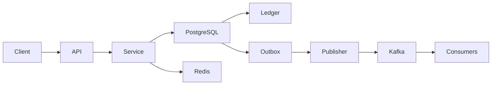

# 05- Transaction Queries

## Overview

Transaction queries are the operational SQL patterns used to create, inspect, update, reconcile, and process financial transactions safely.

In a banking system, transaction queries must do more than return correct rows. They must preserve financial invariants under:

- Concurrent requests.
- API retries.
- Worker retries.
- Partial failures.
- Database failover.
- Large transaction volumes.
- Long-running reporting queries.
- Event-driven processing.

The core relationship is:

```text
Transaction
    │
    ├── Status
    ├── Idempotency
    ├── Customer
    └── Financial amount
            │
            ▼
       Ledger Entries
            │
            ▼
       Account State
```

Typical transaction query categories are:

| Query category | Primary purpose |
|---|---|
| Create transaction | Record a financial operation |
| Read transaction | Return transaction details |
| List transactions | Customer/account history |
| Update status | Advance transaction lifecycle |
| Lock transaction | Prevent concurrent processing |
| Create ledger entries | Record accounting movements |
| Reconcile | Detect financial inconsistencies |
| Process pending work | Background transaction processing |
| Idempotency lookup | Safely handle retries |
| Reporting | Analyze transaction activity |

The most important principle is:

> A financial query should be designed around the business invariant it must preserve, not merely around the rows it needs to return.

---

## Transaction Query Model

A typical transaction schema contains:

```text
transactions
├── id
├── transaction_id
├── transaction_type
├── status
├── initiated_by_customer_id
├── amount
├── currency
├── idempotency_key
├── created_at
└── completed_at
```

Ledger data is separate:

```text
ledger_entries
├── id
├── transaction_id
├── account_id
├── direction
├── amount
├── currency
└── created_at
```

This separation allows transaction queries to answer two different questions:

```text
What business operation occurred?
        ↓
transactions

What financial movement occurred?
        ↓
ledger_entries
```

---

## Creating a Transaction

A transaction record can be created with `INSERT`.

```sql
INSERT INTO transactions (
    transaction_id,
    transaction_type,
    status,
    initiated_by_customer_id,
    amount,
    currency,
    idempotency_key,
    created_at
)
VALUES (
    $1,
    'TRANSFER',
    'PENDING',
    $2,
    $3,
    $4,
    $5,
    NOW()
)
RETURNING
    id,
    transaction_id,
    status,
    amount,
    currency,
    created_at;
```

`RETURNING` avoids an unnecessary follow-up query.

Instead of:

```text
INSERT
   ↓
SELECT transaction
```

the database returns the inserted row directly.

---

## Transaction Creation with Idempotency

A banking API should not rely on:

```sql
SELECT id
FROM transactions
WHERE initiated_by_customer_id = $1
  AND idempotency_key = $2;
```

followed by an unconditional insert.

Two concurrent requests can both observe no existing row.

The database should enforce uniqueness:

```sql
CREATE UNIQUE INDEX transactions_idempotency_idx
ON transactions (
    initiated_by_customer_id,
    idempotency_key
)
WHERE idempotency_key IS NOT NULL;
```

The unique constraint becomes the final concurrency boundary.

---

## Reading a Transaction by ID

For a transaction detail API:

```sql
SELECT
    transaction_id,
    transaction_type,
    status,
    amount,
    currency,
    created_at,
    completed_at
FROM transactions
WHERE transaction_id = $1;
```

If the transaction identifier is unique, PostgreSQL can normally use the corresponding unique index.

Keep the projection explicit.

Avoid:

```sql
SELECT *
```

for public API responses.

---

## Authorization-Aware Transaction Lookup

A transaction lookup should normally include the authorization boundary.

Unsafe:

```sql
SELECT *
FROM transactions
WHERE transaction_id = $1;
```

If transaction IDs are exposed incorrectly, this can become an object-level authorization vulnerability.

Prefer:

```sql
SELECT
    transaction_id,
    transaction_type,
    status,
    amount,
    currency,
    created_at
FROM transactions
WHERE transaction_id = $1
  AND initiated_by_customer_id = $2;
```

The application should also verify account-level authorization where transaction ownership is not equivalent to customer ownership.

---

## Transaction Details with Ledger Entries

A transaction detail endpoint may need its ledger entries.

```sql
SELECT
    t.transaction_id,
    t.transaction_type,
    t.status,
    t.amount,
    t.currency,
    t.created_at,
    l.account_id,
    l.direction,
    l.amount AS ledger_amount,
    l.currency AS ledger_currency
FROM transactions AS t
JOIN ledger_entries AS l
    ON l.transaction_id = t.id
WHERE t.transaction_id = $1
  AND t.initiated_by_customer_id = $2
ORDER BY l.id;
```

The result has a different grain:

```text
one row per ledger entry
```

not:

```text
one row per transaction
```

This distinction matters when aggregating or mapping results into API objects.

---

## Avoiding Accidental Multiplication

Suppose a transaction has:

```text
3 ledger entries
```

and another joined table has:

```text
4 related records
```

A direct join can produce:

```text
3 × 4 = 12 rows
```

This can corrupt aggregates.

When only existence is needed, use `EXISTS`.

When aggregating, pre-aggregate one-to-many relationships before joining when appropriate.

---

## Listing Customer Transactions

A common query:

```sql
SELECT
    transaction_id,
    transaction_type,
    status,
    amount,
    currency,
    created_at
FROM transactions
WHERE initiated_by_customer_id = $1
ORDER BY created_at DESC, id DESC
LIMIT 50;
```

The ordering should be deterministic.

If `created_at` is not unique, use a stable tie-breaker:

```text
created_at DESC
id DESC
```

---

## Keyset Pagination

For large transaction histories, prefer keyset pagination.

```sql
SELECT
    id,
    transaction_id,
    transaction_type,
    status,
    amount,
    currency,
    created_at
FROM transactions
WHERE initiated_by_customer_id = $1
  AND (created_at, id) < ($2, $3)
ORDER BY created_at DESC, id DESC
LIMIT 50;
```

An aligned index can support this access pattern:

```sql
CREATE INDEX transactions_customer_history_idx
ON transactions (
    initiated_by_customer_id,
    created_at DESC,
    id DESC
);
```

This avoids scanning and discarding increasingly large numbers of rows as the client moves deeper into history.

---

## Filtering Transaction History

Typical filters include:

```text
customer
status
transaction type
currency
date range
amount range
```

Example:

```sql
SELECT
    transaction_id,
    transaction_type,
    status,
    amount,
    currency,
    created_at
FROM transactions
WHERE initiated_by_customer_id = $1
  AND status = $2
  AND created_at >= $3
  AND created_at < $4
ORDER BY created_at DESC, id DESC
LIMIT 100;
```

Use a half-open timestamp range:

```text
[start, end)
```

This avoids ambiguity around adjacent time windows.

---

## Transaction Date Filtering

Prefer:

```sql
WHERE created_at >= $1
  AND created_at < $2
```

over:

```sql
WHERE DATE(created_at) = $1;
```

Applying `DATE()` to the column can prevent efficient use of a normal index on `created_at`.

The application should calculate the desired time boundaries.

---

## Filtering by Amount

For exact monetary values:

```sql
SELECT
    transaction_id,
    amount,
    currency,
    status
FROM transactions
WHERE initiated_by_customer_id = $1
  AND amount >= $2
  AND amount <= $3
ORDER BY created_at DESC, id DESC
LIMIT 100;
```

The application should use exact decimal representations rather than binary floating-point values.

---

## Finding a Transaction by Idempotency Key

A retrying client may need to locate an existing transaction:

```sql
SELECT
    transaction_id,
    status,
    amount,
    currency,
    created_at,
    completed_at
FROM transactions
WHERE initiated_by_customer_id = $1
  AND idempotency_key = $2;
```

The unique index makes this lookup efficient and guarantees that the same customer cannot have multiple transactions using the same non-null idempotency key.

---

## Validating Idempotency Requests

Finding the existing transaction is only part of the problem.

Suppose the first request was:

```text
key    = abc
amount = 100.00
```

and the retry is:

```text
key    = abc
amount = 500.00
```

The service must reject the second request rather than returning the first transaction as if both requests were equivalent.

A robust implementation compares the relevant immutable request attributes.

---

## Updating Transaction Status

A safe status transition should include the expected previous state.

```sql
UPDATE transactions
SET
    status = 'COMPLETED',
    completed_at = NOW()
WHERE transaction_id = $1
  AND status = 'PENDING'
RETURNING
    transaction_id,
    status,
    completed_at;
```

If zero rows are returned:

```text
transaction does not exist
OR
transaction is no longer PENDING
```

The service should determine the correct response.

---

## Why Conditional Updates Matter

Consider two workers:

```text
Worker A → PENDING → COMPLETED
Worker B → PENDING → FAILED
```

Without a condition, both may update the row.

With:

```sql
WHERE status = 'PENDING'
```

only one transition succeeds.

This is effectively a database-level compare-and-set operation.

---

## Preventing Invalid Transitions

Not every status change is valid.

Example:

```text
PENDING → COMPLETED     valid
PENDING → FAILED        valid
PENDING → CANCELLED     valid
COMPLETED → PENDING     invalid
COMPLETED → FAILED      usually invalid
```

The allowed state machine should exist in application logic and, where appropriate, be supported by database constraints.

Do not let arbitrary API input directly determine transaction status.

---

## Locking a Transaction for Processing

For workflows where one worker must exclusively process a transaction:

```sql
SELECT
    id,
    transaction_id,
    status,
    amount,
    currency
FROM transactions
WHERE id = $1
FOR UPDATE;
```

The lock is held until the surrounding PostgreSQL transaction ends.

Use this when the transaction state and related writes must be inspected and modified atomically.

---

## Processing Pending Transactions

A worker may need to claim pending work.

For queue-like processing, PostgreSQL supports:

```sql
SELECT
    id,
    transaction_id
FROM transactions
WHERE status = 'PENDING'
ORDER BY created_at, id
FOR UPDATE SKIP LOCKED
LIMIT 100;
```

This allows multiple workers to process different rows without waiting on rows already locked by another worker.

A typical flow is:

```text
Worker
  ↓
BEGIN
  ↓
SELECT ... FOR UPDATE SKIP LOCKED
  ↓
Claim/update rows
  ↓
COMMIT
  ↓
Process work
```

The exact claim model depends on whether work must remain locked during processing.

---

## `SKIP LOCKED` Considerations

`SKIP LOCKED` is useful for database-backed queues but is not a general-purpose concurrency solution.

Potential issues include:

- Temporarily skipped rows.
- Starvation of repeatedly locked rows.
- Ordering that is not globally strict under concurrency.
- Complex retry semantics.

Use it when throughput is more important than strict queue ordering.

---

## Atomic Balance Update

For a withdrawal or debit:

```sql
UPDATE accounts
SET
    balance = balance - $1,
    updated_at = NOW()
WHERE id = $2
  AND status = 'ACTIVE'
  AND balance >= $1
RETURNING
    id,
    balance;
```

This combines the validation and update into one database operation.

If zero rows are returned, the debit was not applied.

Possible reasons include:

```text
account does not exist
account inactive
insufficient balance
```

The service can perform a separate authorization/diagnostic lookup if it needs to distinguish these cases.

---

## Transfer Query Pattern

A same-currency transfer generally requires multiple statements inside one database transaction:

```text
BEGIN
    ↓
Lock source and destination accounts
    ↓
Validate account state/currency
    ↓
Validate balance
    ↓
Create transaction
    ↓
Create debit ledger entry
    ↓
Create credit ledger entry
    ↓
Update balances
    ↓
Create outbox event
    ↓
COMMIT
```

Example locking query:

```sql
SELECT
    id,
    balance,
    currency,
    status
FROM accounts
WHERE id IN ($1, $2)
ORDER BY id
FOR UPDATE;
```

The deterministic `ORDER BY` helps reduce deadlock risk when concurrent transfers involve overlapping account sets.

---

## Creating Ledger Entries

After validation:

```sql
INSERT INTO ledger_entries (
    transaction_id,
    account_id,
    direction,
    amount,
    currency,
    created_at
)
VALUES
    ($1, $2, 'DEBIT', $3, $4, NOW()),
    ($1, $5, 'CREDIT', $3, $4, NOW());
```

For a more complex transaction with fees:

```text
Customer account      DEBIT
Destination account   CREDIT
Fee account           CREDIT
```

The number of entries should follow the accounting model rather than an arbitrary two-row assumption.

---

## Checking Ledger Balance

For a transaction:

```sql
SELECT
    transaction_id,
    SUM(
        CASE
            WHEN direction = 'DEBIT' THEN amount
            WHEN direction = 'CREDIT' THEN -amount
        END
    ) AS net_amount
FROM ledger_entries
WHERE transaction_id = $1
GROUP BY transaction_id;
```

For a balanced transaction:

```text
net_amount = 0
```

The exact validation should also account for currency and the ledger's accounting semantics.

---

## Finding Unbalanced Transactions

A reconciliation query can identify suspicious transactions:

```sql
SELECT
    t.transaction_id,
    t.status,
    SUM(
        CASE
            WHEN l.direction = 'DEBIT' THEN l.amount
            WHEN l.direction = 'CREDIT' THEN -l.amount
        END
    ) AS net_amount
FROM transactions AS t
JOIN ledger_entries AS l
    ON l.transaction_id = t.id
WHERE t.status = 'COMPLETED'
GROUP BY
    t.id,
    t.transaction_id,
    t.status
HAVING
    SUM(
        CASE
            WHEN l.direction = 'DEBIT' THEN l.amount
            WHEN l.direction = 'CREDIT' THEN -l.amount
        END
    ) <> 0;
```

A production reconciliation job should also validate:

- Currency consistency.
- Expected account participation.
- Missing ledger entries.
- Duplicate entries.
- Balance projections.
- External settlement references.

---

## Finding Transactions Without Ledger Entries

Completed transactions without ledger entries are suspicious:

```sql
SELECT
    t.transaction_id,
    t.amount,
    t.currency,
    t.status
FROM transactions AS t
WHERE t.status = 'COMPLETED'
  AND NOT EXISTS (
      SELECT 1
      FROM ledger_entries AS l
      WHERE l.transaction_id = t.id
  );
```

`NOT EXISTS` is appropriate because the requirement is existence rather than returning ledger rows.

---

## Finding Ledger Entries Without Transactions

The foreign key should normally prevent this:

```text
ledger_entries.transaction_id
        ↓
transactions.id
```

If the relationship is properly constrained, orphaned ledger entries should not exist.

Constraints are preferable to relying exclusively on reconciliation queries.

---

## Transaction Counts

A basic count:

```sql
SELECT COUNT(*)
FROM transactions
WHERE initiated_by_customer_id = $1;
```

For existence, do not use `COUNT(*)` unnecessarily.

Use:

```sql
SELECT EXISTS (
    SELECT 1
    FROM transactions
    WHERE initiated_by_customer_id = $1
      AND status = 'PENDING'
);
```

The database can stop once existence is established.

---

## Aggregating Transactions by Status

```sql
SELECT
    status,
    COUNT(*) AS transaction_count,
    SUM(amount) AS total_amount
FROM transactions
WHERE created_at >= $1
  AND created_at < $2
GROUP BY status
ORDER BY status;
```

Remember that `SUM(amount)` can be `NULL` when there are no input rows for an aggregate group.

Do not automatically use `COALESCE()` without considering whether a missing result and a zero amount have the same business meaning.

---

## Daily Transaction Reporting

```sql
SELECT
    created_at::date AS transaction_date,
    COUNT(*) AS transaction_count,
    SUM(amount) AS total_amount
FROM transactions
WHERE created_at >= $1
  AND created_at < $2
  AND status = 'COMPLETED'
GROUP BY created_at::date
ORDER BY transaction_date;
```

This is appropriate for bounded reporting queries.

For very large datasets, repeated aggregation over the entire transaction table may require:

- Partitioning.
- Summary tables.
- Materialized views.
- Dedicated analytics infrastructure.

---

## Customer Transaction Summary

```sql
SELECT
    initiated_by_customer_id,
    COUNT(*) AS transaction_count,
    SUM(amount) AS total_amount
FROM transactions
WHERE status = 'COMPLETED'
  AND created_at >= $1
  AND created_at < $2
GROUP BY initiated_by_customer_id;
```

Do not use this query for real-time customer balance calculations.

A transaction summary and an account balance represent different concepts.

---

## Finding Recent Transactions

```sql
SELECT
    transaction_id,
    transaction_type,
    status,
    amount,
    currency,
    created_at
FROM transactions
WHERE initiated_by_customer_id = $1
ORDER BY created_at DESC, id DESC
LIMIT 20;
```

This is a common dashboard/API pattern and should have an index aligned with the customer and ordering fields.

---

## Finding Pending Transactions

```sql
SELECT
    transaction_id,
    transaction_type,
    amount,
    currency,
    created_at
FROM transactions
WHERE status = 'PENDING'
ORDER BY created_at, id
LIMIT 100;
```

For worker workloads, a partial index can be useful:

```sql
CREATE INDEX transactions_pending_idx
ON transactions (created_at, id)
WHERE status = 'PENDING';
```

The usefulness of the index depends on the workload and table distribution.

---

## Transaction Search by External Reference

If an external provider reference is unique:

```sql
SELECT
    transaction_id,
    status,
    amount,
    currency
FROM transactions
WHERE external_reference = $1;
```

The database should enforce uniqueness when the business invariant requires it.

Do not rely on application-level uniqueness checks alone.

---

## Transaction and Customer Queries

For customer-facing transaction history:

```sql
SELECT
    t.transaction_id,
    t.transaction_type,
    t.status,
    t.amount,
    t.currency,
    t.created_at
FROM transactions AS t
WHERE t.initiated_by_customer_id = $1
  AND t.created_at >= $2
  AND t.created_at < $3
ORDER BY t.created_at DESC, t.id DESC
LIMIT 50;
```

This query combines:

```text
authorization
+
filtering
+
time range
+
deterministic pagination
```

A production query should be designed around the complete access pattern rather than adding indexes for each individual predicate independently.

---

## Querying Account Transaction History

If transaction ownership is represented through ledger entries, account history can be queried from the ledger:

```sql
SELECT
    l.id,
    l.transaction_id,
    l.direction,
    l.amount,
    l.currency,
    l.created_at
FROM ledger_entries AS l
WHERE l.account_id = $1
ORDER BY l.created_at DESC, l.id DESC
LIMIT 50;
```

The important distinction is:

```text
customer transaction history
        ↓
business transactions

account financial history
        ↓
ledger entries
```

A single business transaction may appear multiple times in account-level ledger history.

---

## Transaction History with Running Balance

A ledger-based statement may use a window function:

```sql
SELECT
    id,
    transaction_id,
    direction,
    amount,
    created_at,
    SUM(
        CASE
            WHEN direction = 'CREDIT' THEN amount
            WHEN direction = 'DEBIT' THEN -amount
        END
    ) OVER (
        PARTITION BY account_id
        ORDER BY created_at, id
        ROWS BETWEEN UNBOUNDED PRECEDING AND CURRENT ROW
    ) AS running_movement
FROM ledger_entries
WHERE account_id = $1
ORDER BY created_at, id;
```

This calculates cumulative movement, not necessarily the authoritative account balance.

A statement may also need an opening balance:

```text
opening balance
+
ledger movements
=
statement balance
```

---

## Finding the Latest Transaction per Customer

For reporting or operational analysis:

```sql
SELECT
    customer_id,
    transaction_id,
    status,
    amount,
    created_at
FROM (
    SELECT
        initiated_by_customer_id AS customer_id,
        transaction_id,
        status,
        amount,
        created_at,
        ROW_NUMBER() OVER (
            PARTITION BY initiated_by_customer_id
            ORDER BY created_at DESC, id DESC
        ) AS row_number
    FROM transactions
) AS ranked
WHERE row_number = 1;
```

The `id` tie-breaker makes the ordering deterministic.

---

## Transaction Status History

If state history is stored separately:

```sql
SELECT
    status,
    changed_at,
    changed_by,
    reason
FROM transaction_state_history
WHERE transaction_id = $1
ORDER BY changed_at, id;
```

Do not reconstruct state history from application logs when durable audit history is required.

---

## Updating Transaction Failure State

A worker can safely transition a pending transaction:

```sql
UPDATE transactions
SET
    status = 'FAILED',
    failure_code = $2,
    failure_reason = $3,
    completed_at = NOW()
WHERE transaction_id = $1
  AND status = 'PENDING'
RETURNING
    transaction_id,
    status;
```

Sensitive provider responses should not automatically be copied into a database field.

Store only the information needed for operations, reconciliation, and audit requirements.

---

## Transaction Retry Queries

Retries should distinguish between:

```text
business retry
infrastructure retry
provider retry
database retry
```

A transaction marked:

```text
FAILED
```

does not automatically mean:

```text
safe to execute again
```

The service must determine whether the operation is retryable and whether an external side effect may already have occurred.

---

## Unknown Outcome Queries

If an external operation timed out, query the durable transaction state using:

```text
transaction_id
```

or:

```text
idempotency_key
```

before attempting another operation.

Example:

```sql
SELECT
    transaction_id,
    status,
    amount,
    currency,
    external_reference
FROM transactions
WHERE initiated_by_customer_id = $1
  AND idempotency_key = $2;
```

This is an important distributed-systems pattern:

```text
retry
    ↓
query durable state
    ↓
determine whether operation already happened
```

---

## Transaction Queries from Django

A customer history query:

```python
transactions = (
    Transaction.objects
    .filter(
        initiated_by_customer_id=customer_id,
        created_at__gte=start,
        created_at__lt=end,
    )
    .order_by("-created_at", "-id")[:50]
)
```

For concurrency-sensitive operations:

```python
with transaction.atomic():
    account = (
        Account.objects
        .select_for_update()
        .get(id=account_id)
    )

    # Validate and update financial state.
```

Django's ORM does not remove the need to reason about database locking and transaction boundaries.

---

## Transaction Queries from SQLAlchemy

A service can use an explicit transaction:

```python
with session.begin():
    account = (
        session.query(Account)
        .filter(Account.id == account_id)
        .with_for_update()
        .one()
    )

    # Validate and update financial state.
```

The same database principles apply:

```text
transaction boundary
+
locking
+
constraints
+
atomic writes
```

---

## API Query Patterns

A transaction service commonly exposes:

| API | Query pattern |
|---|---|
| `POST /transfers` | Atomic insert/update/ledger workflow |
| `GET /transactions/{id}` | Point lookup + authorization |
| `GET /transactions` | Filtered keyset list |
| `GET /accounts/{id}/transactions` | Ledger history |
| `POST /transactions/{id}/cancel` | Conditional state transition |
| Internal reconciliation | Aggregate/existence queries |

For REST and gRPC, the database access pattern should remain independent of transport where practical.

---

## N+1 Transaction Queries

An inefficient API can do:

```text
SELECT transactions
    ↓
for each transaction:
    SELECT customer
    SELECT account
    SELECT ledger
```

For 100 transactions:

```text
1 + 100 + 100 + 100 = 301 queries
```

Prefer:

```text
JOIN
select_related
prefetch_related
batch queries
```

depending on the relationship and response shape.

The goal is not a fixed query count; it is predictable database work.

---

## Query Performance

For important transaction queries, inspect the actual execution plan:

```sql
EXPLAIN (ANALYZE, BUFFERS)
SELECT
    transaction_id,
    status,
    amount,
    currency,
    created_at
FROM transactions
WHERE initiated_by_customer_id = $1
  AND created_at >= $2
  AND created_at < $3
ORDER BY created_at DESC, id DESC
LIMIT 50;
```

Inspect:

- Estimated vs actual rows.
- Index usage.
- Sort operations.
- Heap reads.
- Buffer hits.
- Execution time.
- Rows removed by filters.

Do not optimize based solely on the SQL text.

---

## Query Parameterization

Transaction queries must use parameter binding.

Correct:

```python
cursor.execute(
    """
    SELECT transaction_id, status
    FROM transactions
    WHERE transaction_id = %s
    """,
    [transaction_id],
)
```

Incorrect:

```python
query = f"""
SELECT transaction_id, status
FROM transactions
WHERE transaction_id = '{transaction_id}'
"""
```

Parameterization protects SQL values from injection.

Dynamic identifiers require separate handling, such as strict allowlists or driver-supported identifier composition.

---

## Multi-Tenancy and Authorization

If the banking system supports tenants or organizations, transaction queries must include the tenant boundary:

```sql
SELECT
    transaction_id,
    status,
    amount,
    currency
FROM transactions
WHERE tenant_id = $1
  AND transaction_id = $2;
```

Never assume that a globally unique transaction ID eliminates authorization requirements.

A unique identifier answers:

```text
Which row?
```

Authorization answers:

```text
Who may access it?
```

---

## Row-Level Security

PostgreSQL Row-Level Security can provide a database-level authorization boundary where appropriate.

For example, a transaction table may enforce tenant/customer visibility through policies.

However, RLS does not replace application authorization design.

Carefully consider:

- Table ownership.
- Roles with `BYPASSRLS`.
- Connection pooling.
- Session context.
- `SET LOCAL` for transaction-scoped context.
- Administrative access.
- Performance of policies.

Test RLS using realistic application roles rather than only a superuser or table owner.

---

## Transaction Query Architecture

A production banking service might use:



The responsibilities remain separated:

```text
PostgreSQL
    ↓
authoritative financial state

Redis
    ↓
non-authoritative acceleration/state where appropriate

Kafka
    ↓
durable asynchronous integration

Celery
    ↓
background processing

API
    ↓
authentication and request handling

Service layer
    ↓
business workflow
```

---

## Reporting vs Operational Queries

Do not assume the same query should serve both operational APIs and analytics.

Operational:

```text
customer transaction history
recent transactions
pending work
transaction detail
```

Analytics:

```text
monthly transaction volume
customer segmentation
transaction trends
reconciliation reports
```

Heavy analytical queries can compete with OLTP workloads.

Depending on scale, use:

- Read replicas.
- Materialized views.
- Summary tables.
- Partitioning.
- Dedicated analytics systems.

---

## Read Replicas

Transaction history may be read from a replica when slight replication lag is acceptable.

However:

```text
write transaction
    ↓
primary commit
    ↓
immediate read from replica
```

may return stale data.

For read-after-write requirements, use:

- Primary reads.
- Session consistency mechanisms.
- A suitable routing strategy.
- Explicit freshness requirements.

Do not blindly route every `SELECT` to replicas.

---

## Partitioning

At large transaction volumes, partitioning by time can help operational management.

Example:

```text
transactions
├── 2026-01
├── 2026-02
├── 2026-03
└── ...
```

Partitioning can improve:

- Data lifecycle management.
- Large historical data operations.
- Partition pruning.
- Maintenance.

It does not automatically make every transaction query faster.

Queries must contain predicates that allow useful partition pruning.

---

## Archiving

Financial history often has long retention requirements.

Do not simply delete old transactions because the OLTP table is becoming large.

Possible strategies include:

```text
primary transaction store
        ↓
partition lifecycle
        ↓
archive / analytical storage
```

The retention strategy must satisfy regulatory, audit, and business requirements.

---

## Monitoring Transaction Queries

Monitor high-value query classes separately.

Examples:

```text
transaction lookup latency
transaction history latency
transfer transaction latency
pending-worker query latency
reconciliation query duration
```

Also monitor:

```text
lock waits
deadlocks
rows scanned
buffer reads
replica lag
connection pool saturation
```

A query that takes 20 ms in development may behave very differently when:

```text
table size = millions/billions of rows
concurrency = high
data distribution = skewed
```

---

## Reliability Considerations

A production transaction query should be designed around failure behavior.

| Failure | Query-level response |
|---|---|
| Duplicate request | Idempotency constraint |
| Concurrent update | Lock or conditional update |
| Deadlock | Retry complete transaction |
| Serialization failure | Retry complete transaction |
| Lost response | Query durable transaction state |
| Worker crash | Durable pending state/outbox |
| Replica lag | Route consistency-sensitive reads appropriately |
| Database timeout | Fail safely and reconcile |
| Partial external failure | Persist state and reconcile |

The objective is not merely to make queries succeed.

The objective is to make failure recoverable.

---

## Common Mistakes

### Using `SELECT *`

Transaction tables often contain sensitive and operational fields.

Explicit projections provide:

- Better API control.
- Lower network transfer.
- Lower memory usage.
- Reduced accidental data exposure.

---

### Using `COUNT(*)` for Existence

Prefer:

```sql
EXISTS (...)
```

when only existence matters.

---

### Using `OFFSET` for Large Histories

Deep offsets require PostgreSQL to process and discard preceding rows.

Use keyset pagination for large transaction histories.

---

### Updating Status Without the Previous State

Unsafe:

```sql
UPDATE transactions
SET status = 'COMPLETED'
WHERE transaction_id = $1;
```

Prefer:

```sql
WHERE transaction_id = $1
  AND status = 'PENDING'
```

when `PENDING → COMPLETED` is the required transition.

---

### Checking Idempotency in Application Code Only

This race is unsafe:

```text
SELECT
if not found:
    INSERT
```

Use a database uniqueness constraint.

---

### Holding Locks During External Calls

Avoid:

```text
BEGIN
lock account
call payment provider
wait
COMMIT
```

Keep database transactions focused and short.

---

### Recomputing Balance from Every Transaction on Every Request

Historical ledger aggregation is useful for reconciliation and reporting, but not necessarily for every customer balance lookup.

Maintain an appropriate current-state projection.

---

### Assuming Two Ledger Rows Always Exist

Fees, taxes, transfers between currencies, settlements, and adjustments may require more than two entries.

Model the ledger according to accounting requirements.

---

### Ignoring Result Grain

A query joining:

```text
transaction
+
ledger
```

returns ledger-level rows.

A query joining several one-to-many relationships can multiply rows and corrupt aggregates.

---

### Running Heavy Reports on the Primary

Large aggregations can consume:

```text
CPU
memory
I/O
connections
```

and compete with financial operations.

Separate OLTP and analytical workloads where necessary.

---

## Interview Traps

### "Should Every Transaction Query Use `FOR UPDATE`?"

No.

Use row locks when the operation requires serialized access to mutable state.

A normal historical read usually does not require locking.

---

### "Is `SELECT ... FOR UPDATE` Enough to Prevent Double Spending?"

Not by itself.

The complete operation must define:

```text
transaction boundary
+
correct rows to lock
+
balance validation
+
atomic balance update
+
ledger writes
+
constraints
```

---

### "Is `UNIQUE(idempotency_key)` Enough?"

Only if the key is globally scoped.

If the business rule is:

```text
one key per customer
```

the uniqueness boundary should include the customer identifier.

---

### "Can Kafka Make the Transaction Atomic?"

Not with a normal PostgreSQL transaction.

Use a transactional outbox or another architecture designed to bridge database state and event publication.

---

### "Can a Read Replica Immediately Return a Newly Committed Transaction?"

Not necessarily.

Replication is asynchronous in common PostgreSQL deployments, so the replica may lag.

---

### "Should We Use SERIALIZABLE for All Banking Queries?"

Not automatically.

Stronger isolation can increase serialization failures and reduce throughput.

Use the weakest isolation level that correctly enforces the required invariants, combined with appropriate locking and constraints.

---

## Production Query Review Checklist

### Correctness

- [ ] Query result grain is understood.
- [ ] Financial invariants are explicit.
- [ ] Status transitions validate the previous state.
- [ ] Monetary values use exact types.
- [ ] Currency is explicit.
- [ ] Ledger relationships are validated.

### Concurrency

- [ ] Race conditions have been considered.
- [ ] Locks are used only where necessary.
- [ ] Multi-row locks use deterministic ordering.
- [ ] Deadlocks are handled.
- [ ] Serialization failures are handled where applicable.

### Reliability

- [ ] Idempotency is database-enforced.
- [ ] Unknown commit outcomes are considered.
- [ ] Worker retries are safe.
- [ ] External side effects are not unnecessarily inside DB transactions.
- [ ] Reconciliation queries exist.

### Performance

- [ ] Queries have bounded result sizes.
- [ ] Pagination is deterministic.
- [ ] Keyset pagination is used at scale where appropriate.
- [ ] Indexes match actual access patterns.
- [ ] `EXPLAIN (ANALYZE, BUFFERS)` has been reviewed for critical queries.
- [ ] Large reports are isolated from OLTP workloads.

### Security

- [ ] All values are parameterized.
- [ ] Authorization predicates are included where appropriate.
- [ ] Tenant boundaries are enforced.
- [ ] Sensitive columns are not unnecessarily returned.
- [ ] Database roles follow least privilege.

---

## Senior Decision Framework

When designing a transaction query, ask:

```text
1. What business invariant must this query preserve?
        ↓
2. What is the result grain?
        ↓
3. Is this read-only or state-changing?
        ↓
4. Can concurrent requests race?
        ↓
5. Which rows must be locked?
        ↓
6. Can a unique constraint enforce the invariant?
        ↓
7. Is the operation safely retryable?
        ↓
8. Does it need the primary or can it tolerate replica lag?
        ↓
9. What index supports the complete access pattern?
        ↓
10. How will the operation be reconciled after failure?
```

This is more valuable than memorizing isolated SQL patterns.

---

## Recommended Query Patterns

| Requirement | Preferred pattern |
|---|---|
| Transaction lookup | Unique indexed lookup |
| Customer history | Keyset pagination |
| Existence | `EXISTS` |
| Missing related data | `NOT EXISTS` |
| State transition | Conditional `UPDATE` |
| Concurrent financial update | Atomic update / row locking |
| Multi-account transfer | Ordered row locks + atomic transaction |
| Idempotency | Unique constraint/index |
| Worker queue | `FOR UPDATE SKIP LOCKED` where appropriate |
| Ledger validation | Aggregation |
| Latest transaction | `ROW_NUMBER()` or ordered lookup |
| Running statement movement | Window function |
| Historical correction | Compensating transaction |
| Event publication | Transactional outbox |
| Heavy analytics | Replica/materialized/analytics workload |

---

## Key Takeaways

- **Transaction queries must preserve financial invariants under concurrency, retries, failures, and partial system outages—not merely return the expected rows.**
- **Use database constraints, conditional updates, atomic transactions, and deterministic locking to make correctness enforceable rather than dependent only on application code.**
- **Use idempotency keys, keyset pagination, explicit projections, `EXISTS`, and access-pattern-aligned indexes for reliable and scalable transaction APIs.**
- **Treat ledger queries, balance updates, transaction status, reconciliation, and event publication as distinct concerns connected by explicit transactional boundaries.**
- **Senior-level transaction SQL design starts with the invariant and failure model, then chooses the query, lock strategy, index, retry behavior, and operational architecture needed to preserve it.**