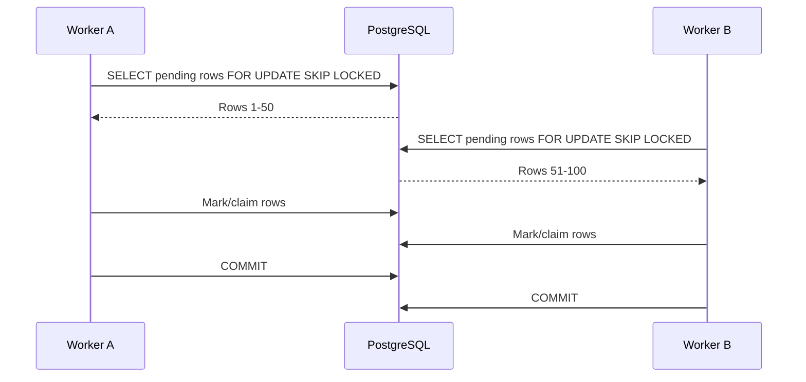

# 06- Concurrency Scenarios

## Overview

Concurrency is one of the most important correctness concerns in a banking transaction database.

A banking system can receive multiple operations against the same account at nearly the same time:

```text
                    ┌── Transfer A ──┐
                    │                │
Client 1 ── API ────┤                ├── PostgreSQL
                    │                │
Client 2 ── API ────┤                │
                    │                │
Client 3 ── Worker ─┘                │
```

Without explicit concurrency control, operations that are individually correct can produce incorrect financial state when executed concurrently.

Typical problems include:

- Double spending.
- Lost updates.
- Duplicate transactions.
- Invalid status transitions.
- Deadlocks.
- Race conditions around idempotency.
- Incorrect balance calculations.
- Overselling available funds.
- Duplicate worker processing.
- Inconsistent reconciliation state.

PostgreSQL provides several mechanisms for controlling concurrency:

| Mechanism | Primary purpose |
|---|---|
| Database transactions | Atomic unit of work |
| Row-level locks | Serialize access to specific rows |
| Conditional updates | Atomic compare-and-set behavior |
| Unique constraints | Enforce uniqueness under concurrency |
| Isolation levels | Control transaction visibility and serialization |
| `SKIP LOCKED` | Parallel queue-like processing |
| Advisory locks | Application-defined locking when appropriate |

The key principle is:

> Concurrency correctness should be enforced at the database boundary wherever the invariant depends on shared persistent state.

---

## Why Banking Systems Need Strong Concurrency Control

Consider an account:

```text
Balance = 1000
```

Two concurrent withdrawals arrive:

```text
Request A → withdraw 800
Request B → withdraw 800
```

An unsafe workflow is:

```text
A reads 1000
B reads 1000

A validates 800 <= 1000
B validates 800 <= 1000

A writes 200
B writes 200
```

The final balance may appear valid:

```text
200
```

but the system authorized:

```text
1600
```

of withdrawals against only:

```text
1000
```

of available funds.

The problem is not simply an incorrect SQL statement.

The problem is that the operation:

```text
read balance
+
validate
+
modify balance
```

was not treated as one concurrency-safe operation.

---

## Concurrency Mental Model

For every mutable financial operation, identify:

```text
Shared state
    ↓
Invariant
    ↓
Concurrent operations
    ↓
Race condition
    ↓
Database serialization mechanism
```

Example:

```text
Shared state:
account.balance

Invariant:
balance must not become negative

Concurrent operations:
multiple withdrawals

Race:
two requests read the same balance

Protection:
atomic conditional update or row lock
```

This reasoning is more important than memorizing `FOR UPDATE`.

---

## Scenario: Lost Update

A lost update occurs when two transactions read the same value and later overwrite each other's changes.

Initial:

```text
balance = 1000
```

Concurrent operations:

```text
Transaction A:
read 1000
set 900

Transaction B:
read 1000
set 800
```

Possible final result:

```text
800
```

The `100` debit from transaction A has effectively disappeared.

---

## Unsafe Read-Modify-Write

Avoid application logic such as:

```python
account = Account.objects.get(id=account_id)

if account.balance >= amount:
    account.balance -= amount
    account.save()
```

Under concurrency:

```text
SELECT
validate in Python
UPDATE
```

is not necessarily atomic.

The application has created a race between the read and write.

---

## Solution: Atomic Conditional Update

For a simple debit:

```sql
UPDATE accounts
SET
    balance = balance - $1,
    updated_at = NOW()
WHERE id = $2
  AND status = 'ACTIVE'
  AND balance >= $1
RETURNING
    id,
    balance;
```

The important property is:

```text
check balance
+
decrement balance
```

happen as one database operation.

If two withdrawals race, PostgreSQL serializes the row modifications.

Only operations that satisfy the current balance condition can succeed.

---

## Why the Atomic Update Works

Suppose:

```text
balance = 100
```

and two requests attempt:

```text
withdraw 80
withdraw 80
```

The first successful update changes:

```text
100 → 20
```

The second operation evaluates against the current row state and cannot satisfy:

```sql
balance >= 80
```

Therefore:

```text
Request A → success
Request B → rejected
```

This is often preferable to separately reading the balance and then updating it.

---

## Scenario: Row Locking

For more complex operations, lock the account row:

```sql
BEGIN;

SELECT
    id,
    balance,
    currency,
    status
FROM accounts
WHERE id = $1
FOR UPDATE;

-- validate business rules

UPDATE accounts
SET
    balance = balance - $2,
    updated_at = NOW()
WHERE id = $1;

COMMIT;
```

`FOR UPDATE` locks the selected row against conflicting updates until the transaction ends.

Other transactions attempting conflicting row locks or updates may wait.

---

## When to Use Row Locks

Use row-level locking when the workflow requires:

```text
read current state
+
perform multiple dependent validations
+
modify related state
```

Examples:

- Transfer involving several accounts.
- Complex balance validation.
- Account state transitions.
- Reservation workflows.
- Financial operations requiring multiple related writes.

For a simple conditional decrement, an atomic `UPDATE` may be simpler and more efficient.

---

## Scenario: Double Spending

Double spending is a direct consequence of concurrent balance validation.

Unsafe:

```text
SELECT balance
FROM accounts
WHERE id = 1001;
```

followed later by:

```sql
UPDATE accounts
SET balance = balance - $1
WHERE id = 1001;
```

The balance can change between these statements.

Safer approaches include:

```text
atomic conditional UPDATE
```

or:

```text
SELECT ... FOR UPDATE
+
UPDATE
```

inside one database transaction.

---

## Scenario: Concurrent Transfers

Consider:

```text
Account A = 1000
Account B = 500
```

Two transfers execute concurrently:

```text
A → B : 700
B → A : 400
```

Both operations touch the same two accounts.

A safe workflow is:

```text
BEGIN
    ↓
Lock both accounts
    ↓
Validate account state
    ↓
Validate currencies
    ↓
Validate balances
    ↓
Create transaction
    ↓
Create ledger entries
    ↓
Update balances
    ↓
COMMIT
```

---

## Deterministic Lock Ordering

Multi-row operations can deadlock when transactions acquire locks in different orders.

Unsafe:

```text
Transfer A → B
    locks A
    locks B

Transfer B → A
    locks B
    locks A
```

Possible result:

```text
Transaction 1 waits for B
Transaction 2 waits for A
```

Neither can proceed.

A common mitigation is to lock accounts in deterministic order:

```sql
SELECT
    id,
    balance,
    currency,
    status
FROM accounts
WHERE id IN ($1, $2)
ORDER BY id
FOR UPDATE;
```

Both transfers then acquire:

```text
lower account ID
        ↓
higher account ID
```

regardless of transfer direction.

---

## Why Lock Ordering Matters

Suppose:

```text
Transfer 1: 10 → 20
Transfer 2: 20 → 10
```

If both use:

```text
ORDER BY id
```

they attempt:

```text
10
20
```

in the same order.

The second transaction waits for the first rather than creating a circular dependency.

Deterministic lock ordering does not eliminate every deadlock, but it substantially reduces avoidable deadlocks.

---

## Scenario: Duplicate Idempotent Requests

A client sends:

```text
POST /transfers
Idempotency-Key: abc123
```

The server processes the request successfully, but the response is lost.

The client retries:

```text
POST /transfers
Idempotency-Key: abc123
```

Two requests can also arrive concurrently.

Unsafe:

```text
Request A → SELECT key → not found
Request B → SELECT key → not found
Request A → INSERT
Request B → INSERT
```

Application-level checks alone do not provide concurrency safety.

---

## Unique Constraint for Idempotency

Use a database uniqueness boundary:

```sql
CREATE UNIQUE INDEX transactions_idempotency_idx
ON transactions (
    initiated_by_customer_id,
    idempotency_key
)
WHERE idempotency_key IS NOT NULL;
```

Then:

```text
Request A → INSERT succeeds
Request B → unique constraint conflict
```

The service can retrieve the existing transaction and return the same logical result when the request parameters match.

---

## Scenario: Concurrent Status Updates

Suppose:

```text
Transaction T1 = PENDING
```

Two workers execute:

```text
Worker A → COMPLETED
Worker B → FAILED
```

Unsafe:

```sql
UPDATE transactions
SET status = 'COMPLETED'
WHERE transaction_id = $1;
```

and:

```sql
UPDATE transactions
SET status = 'FAILED'
WHERE transaction_id = $1;
```

Both may execute successfully.

---

## Conditional State Transition

Use the previous state as part of the update:

```sql
UPDATE transactions
SET
    status = 'COMPLETED',
    completed_at = NOW()
WHERE transaction_id = $1
  AND status = 'PENDING'
RETURNING
    transaction_id,
    status;
```

Only one worker can successfully transition:

```text
PENDING → COMPLETED
```

The second worker sees zero affected rows.

This is a database-level compare-and-set pattern.

---

## Scenario: Concurrent Cancellation

Suppose:

```text
Transaction = PENDING
```

A customer requests cancellation while a worker is completing it.

Two operations race:

```text
Customer → PENDING → CANCELLED
Worker   → PENDING → COMPLETED
```

Both operations should use conditional transitions.

For example:

```sql
UPDATE transactions
SET
    status = 'CANCELLED'
WHERE transaction_id = $1
  AND status = 'PENDING'
RETURNING transaction_id;
```

The winner establishes the new state.

The loser must re-read the transaction and determine the appropriate business response.

---

## Scenario: Concurrent Account Closure

An account should not necessarily be closed while a financial transaction is actively processing.

A simplified state transition might be:

```text
ACTIVE
  ↓
CLOSING
  ↓
CLOSED
```

A transaction workflow may require:

```sql
SELECT
    id,
    status,
    balance
FROM accounts
WHERE id = $1
FOR UPDATE;
```

Then:

```text
validate no prohibited pending operations
validate balance
transition account state
```

The exact rules depend on the banking domain.

---

## Scenario: Concurrent Deposit and Withdrawal

Suppose:

```text
Initial balance = 100
```

Concurrent operations:

```text
Deposit 50
Withdrawal 120
```

The correct outcome depends on serialization.

If deposit commits first:

```text
100 + 50 = 150
150 - 120 = 30
```

The withdrawal can succeed.

If withdrawal is evaluated first:

```text
100 - 120
```

it fails.

A concurrency-safe implementation must define which outcome is valid rather than relying on application scheduling.

---

## Scenario: Concurrent Transfers and Balance Invariants

A transfer has multiple effects:

```text
Source balance
Destination balance
Transaction record
Ledger entries
```

The operation should preserve:

```text
source debit
=
destination credit
```

for a simple same-currency transfer.

A database transaction should contain the writes that must succeed or fail together.

```sql
BEGIN;

-- lock accounts
-- validate
-- update balances
-- insert transaction
-- insert ledger entries
-- insert outbox event

COMMIT;
```

---

## Scenario: Duplicate Worker Processing

A Celery or Kubernetes worker may crash after acquiring work.

Another worker may attempt the same transaction.

For queue-like processing, PostgreSQL can support:

```sql
SELECT
    id,
    transaction_id
FROM transactions
WHERE status = 'PENDING'
ORDER BY created_at, id
FOR UPDATE SKIP LOCKED
LIMIT 100;
```

Multiple workers can then process different rows without waiting for rows already locked by another worker.

---

## `SKIP LOCKED` Workflow

A typical worker architecture is:



The exact transaction boundary depends on whether work is processed while the lock is held or explicitly claimed for later processing.

Holding locks while performing slow external work is usually undesirable.

---

## Scenario: Reservation Expiration

Suppose an account operation or financial reservation has:

```text
status = RESERVED
expires_at = ...
```

Multiple workers may attempt to expire it.

A safe conditional transition is:

```sql
UPDATE account_reservations
SET
    status = 'EXPIRED',
    expired_at = NOW()
WHERE id = $1
  AND status = 'RESERVED'
  AND expires_at <= NOW()
RETURNING id;
```

Only one worker successfully changes the reservation state.

---

## Scenario: Concurrent Coupon or Fee Allocation

Although this is not specific to banking, similar concurrency patterns appear in transaction-related allocations.

Suppose a limited resource has:

```text
remaining = 1
```

Two requests attempt to consume it.

Unsafe:

```text
SELECT remaining
UPDATE remaining
```

Prefer an atomic condition:

```sql
UPDATE resources
SET remaining = remaining - 1
WHERE id = $1
  AND remaining > 0
RETURNING remaining;
```

This general pattern applies to many inventory-like financial limits.

---

## Scenario: Advisory Locks

PostgreSQL advisory locks can represent application-defined resources.

For example:

```sql
SELECT pg_advisory_xact_lock($1);
```

The lock is held for the current transaction.

They can be useful when the concurrency key does not map cleanly to an existing database row.

Examples:

```text
logical settlement batch
external account reference
application-defined workflow key
```

However, advisory locks are cooperative.

They do not automatically protect a row from another transaction that ignores the advisory lock.

Prefer row locks or constraints when the invariant naturally maps to relational data.

---

## Row Locks vs Advisory Locks

| Mechanism | Best suited for |
|---|---|
| `FOR UPDATE` | Existing database rows |
| Conditional `UPDATE` | Atomic state/value transitions |
| Unique constraint | Uniqueness invariants |
| Advisory lock | Application-defined logical resources |
| `SKIP LOCKED` | Parallel queue-like processing |
| Serializable isolation | Complex transaction-level serialization requirements |

Choose the smallest mechanism that correctly protects the invariant.

---

## Scenario: Deadlock

A deadlock occurs when transactions form a circular wait.

```text
Transaction A
    │
    ├── locks Account 1
    └── waits for Account 2
                  ↑
                  │
Transaction B
    ├── locks Account 2
    └── waits for Account 1
```

PostgreSQL detects the deadlock and aborts one transaction.

The application must be prepared to retry appropriate operations.

---

## Deadlock Prevention

Use:

- Deterministic lock ordering.
- Short transactions.
- Consistent access patterns.
- Minimal lock scope.
- Appropriate indexes to reduce unnecessary locking duration.
- Avoidance of external calls while holding database locks.

Do not attempt to solve every deadlock by simply increasing timeouts.

A timeout can hide the underlying lock-ordering problem.

---

## Scenario: Serialization Failure

Under `SERIALIZABLE`, PostgreSQL may abort a transaction because concurrent operations cannot be serialized safely.

The application can receive a serialization failure such as:

```text
SQLSTATE 40001
```

The correct pattern is generally:

```text
retry the entire transaction
```

not:

```text
retry only the failed SQL statement
```

because the transaction's earlier reads and writes were part of the failed serialization attempt.

---

## Scenario: Deadlock Retry

A PostgreSQL deadlock can produce:

```text
SQLSTATE 40P01
```

A service can retry the complete transaction when the operation is designed to be safely retryable.

A retry should use:

```text
bounded attempts
+
backoff/jitter
+
idempotent operation semantics
```

Do not retry indefinitely.

---

## Retry Architecture

A robust transaction service might use:

```text
Request
   ↓
Begin transaction
   ↓
Execute financial operation
   ↓
Serialization/deadlock?
   ├── No → Commit
   └── Yes
         ↓
      Rollback
         ↓
   Backoff + retry
```

Business validation errors should normally not be retried.

---

## Scenario: Unknown Commit Outcome

One of the hardest concurrency/failure scenarios is:

```text
Application
    ↓
COMMIT
    ↓
database commits
    ↓
network failure
    ↓
application receives error/timeout
```

The application does not necessarily know whether the transaction committed.

It must not assume:

```text
error = rollback
```

Instead, use:

```text
idempotency key
+
transaction identifier
+
reconciliation
```

to determine the durable state.

---

## Scenario: Read-After-Write Consistency

A client performs:

```text
POST transfer
```

and immediately requests:

```text
GET transaction
```

If the GET is routed to a lagging read replica, it may not see the transaction immediately.

Architecture:

```text
POST
 ↓
Primary
 ↓
Commit
 ↓
Replica replication
 ↓
GET
```

The GET can temporarily observe stale state.

For read-after-write requirements, route appropriately or implement a consistency strategy.

---

## Scenario: Concurrent Reads

Not every concurrent read requires a lock.

Historical transaction queries such as:

```sql
SELECT
    transaction_id,
    amount,
    status
FROM transactions
WHERE transaction_id = $1;
```

usually do not need:

```sql
FOR UPDATE
```

Adding unnecessary locks can:

- Increase contention.
- Reduce throughput.
- Increase latency.
- Complicate deadlock behavior.

Lock mutable state only when the business operation requires serialization.

---

## Scenario: Long-Running Transactions

A transaction that remains open while doing expensive work can hold locks and maintain old snapshots.

Avoid:

```text
BEGIN
lock account
call external service
wait 30 seconds
generate report
COMMIT
```

Prefer:

```text
short database transaction
        ↓
durable state
        ↓
external/background work
        ↓
short finalization transaction
```

Long transactions can also contribute to:

- MVCC cleanup pressure.
- Table/index bloat.
- Replication lag.
- Connection pool exhaustion.

---

## Scenario: Connection Pooling

Django, FastAPI, SQLAlchemy, and other applications often use database connection pools.

Transaction-scoped state should remain inside the transaction.

For example:

```sql
BEGIN;

SET LOCAL app.customer_id = '...';

-- queries

COMMIT;
```

`SET LOCAL` limits the setting to the current transaction.

This is especially important when session state is used for authorization or RLS.

Do not assume a particular backend connection remains assigned to one application request indefinitely when pooling is involved.

---

## Scenario: Application-Level Locking

Avoid relying on:

```python
threading.Lock()
```

or:

```python
asyncio.Lock()
```

to protect database state in a distributed deployment.

For example:

```text
Kubernetes Pod A
    Python lock

Kubernetes Pod B
    Python lock
```

These are different process-local locks.

They cannot coordinate access across pods.

Use database concurrency controls or a distributed coordination mechanism designed for the invariant.

---

## Redis Locks

Redis-based distributed locks can be useful for some coordination problems, but they should not automatically replace database locking for financial invariants.

For authoritative account state:

```text
PostgreSQL
    ↓
source of truth
```

A Redis lock does not by itself make a database update atomic.

For financial correctness, prefer:

```text
database transaction
+
database constraints
+
appropriate row locking
```

when the invariant belongs to PostgreSQL state.

---

## Scenario: Multi-Service Concurrency

In a microservice architecture:

```text
Transfer Service
      ↓
Account Service
      ↓
PostgreSQL
```

the transaction boundary may not span every service.

Avoid pretending that:

```text
distributed services
=
one PostgreSQL transaction
```

Instead, use explicit workflow patterns:

```text
state machine
+
idempotency
+
outbox
+
events
+
reconciliation
```

Distributed consistency requires an architectural solution rather than simply adding more SQL locks.

---

## Scenario: Outbox Concurrency

Multiple workers may attempt to publish the same outbox event.

A queue-like query can use:

```sql
SELECT
    id,
    aggregate_id,
    event_type,
    payload
FROM outbox_events
WHERE published_at IS NULL
ORDER BY created_at, id
FOR UPDATE SKIP LOCKED
LIMIT 100;
```

The publisher should use a durable claim or state-transition strategy.

Kafka consumers should also be designed for duplicate delivery because at-least-once processing is common.

---

## Scenario: Duplicate Kafka Events

Even if the database operation is correctly serialized, an event can be delivered more than once.

Consumers should use an idempotency strategy such as:

```text
event_id
+
consumer-specific processing record
```

with a database uniqueness constraint where appropriate.

The financial transaction database should not assume that Kafka delivery occurs exactly once.

---

## Concurrency Testing

Concurrency bugs often disappear in sequential unit tests.

Tests should intentionally execute overlapping operations.

Example test scenario:

```text
Initial balance = 100

Run concurrently:
    withdrawal 80
    withdrawal 80

Expected:
    exactly one succeeds
    final balance = 20
```

Another test:

```text
Initial status = PENDING

Run concurrently:
    worker A → COMPLETED
    worker B → FAILED

Expected:
    exactly one transition succeeds
```

---

## Concurrency Test Matrix

| Scenario | Expected invariant |
|---|---|
| Two withdrawals | Cannot spend the same funds |
| Transfer A → B and B → A | No deadlock or incorrect balances |
| Duplicate idempotency key | One logical transaction |
| Two status workers | One valid terminal transition |
| Cancel vs complete | One state transition wins |
| Worker retry | No duplicate financial effect |
| Deadlock | Safe transaction retry |
| Serialization failure | Safe complete-transaction retry |
| Lost response | Retry resolves to existing state |
| Replica read | Consistency expectation is explicit |

---

## PostgreSQL Lock Inspection

When investigating production contention, inspect PostgreSQL activity and locks.

For example:

```sql
SELECT
    pid,
    usename,
    state,
    wait_event_type,
    wait_event,
    query_start,
    query
FROM pg_stat_activity
WHERE datname = current_database()
ORDER BY query_start;
```

Lock investigation can use PostgreSQL's lock catalog together with `pg_stat_activity`.

Look for:

```text
blocked sessions
long-running transactions
lock waits
idle in transaction sessions
```

---

## Query Performance and Concurrency

A slow query can become a concurrency problem.

Suppose a transaction holds a row lock while executing:

```text
slow query
    ↓
10 seconds
```

Then:

```text
100 concurrent requests
```

may queue behind the locked row.

Therefore, query optimization is also concurrency optimization.

Use:

```sql
EXPLAIN (ANALYZE, BUFFERS)
```

for critical queries and keep financial transactions focused.

---

## Lock Duration

The important metric is not merely:

```text
query execution time
```

but also:

```text
time lock is held
```

A transaction can contain several statements:

```text
statement A → 5 ms
statement B → 5 ms
statement C → 5 ms
```

yet remain open for:

```text
2 seconds
```

because of application-side processing between statements.

Keep CPU-heavy and external work outside the transaction whenever possible.

---

## Security Implications

Concurrency bugs can become security vulnerabilities.

Examples:

```text
race condition
    ↓
duplicate withdrawal
    ↓
financial loss
```

or:

```text
authorization check
    ↓
concurrent account state change
    ↓
operation against invalid state
```

Authorization and concurrency control should therefore be considered together.

A secure transaction operation should validate:

```text
identity
+
authorization
+
account state
+
financial invariant
+
concurrency boundary
```

---

## Monitoring Concurrency

Track:

- Transaction latency.
- Lock wait time.
- Deadlock count.
- Serialization failures.
- Connection pool saturation.
- Long-running transactions.
- Idle-in-transaction sessions.
- Pending worker backlog.
- Transaction retry count.
- Idempotency conflicts.
- Reconciliation discrepancies.

Useful operational questions include:

```text
Are transfers becoming slower?
Are account rows experiencing contention?
Are deadlocks increasing?
Are retries increasing?
Are workers competing for the same rows?
```

---

## Production Configuration Considerations

Relevant PostgreSQL settings include:

```text
statement_timeout
lock_timeout
idle_in_transaction_session_timeout
deadlock_timeout
```

These settings have different purposes.

Do not use aggressive global values without understanding workload behavior.

For example:

```text
lock_timeout
```

controls how long a statement waits for a lock, while:

```text
statement_timeout
```

limits statement execution time more broadly.

Timeouts are safety mechanisms, not replacements for correct transaction design.

---

## Concurrency Strategy Comparison

| Strategy | Strength | Limitation | Typical banking use |
|---|---|---|---|
| Atomic `UPDATE` | Simple and fast | Limited for complex workflows | Balance decrement |
| `FOR UPDATE` | Strong row serialization | Can increase contention | Transfers |
| Unique constraint | Excellent invariant enforcement | Only uniqueness | Idempotency |
| Conditional update | Atomic state transition | Requires explicit condition | Status changes |
| `SKIP LOCKED` | High worker throughput | Not strict ordering | Background queues |
| Serializable | Strong isolation | More retries/contention | Complex invariants |
| Advisory lock | Flexible logical key | Cooperative | Special coordination |

---

## Recommended Concurrency Pattern

For a simple account debit:

```text
Atomic conditional UPDATE
```

For a multi-account transfer:

```text
Short database transaction
+
deterministic row locks
+
balance validation
+
ledger writes
+
balance updates
+
outbox
```

For an idempotent API:

```text
Idempotency key
+
unique database constraint
+
existing-result lookup
```

For a worker queue:

```text
FOR UPDATE SKIP LOCKED
+
durable claim/state
+
idempotent processing
```

For serialization/deadlock failures:

```text
rollback
+
bounded retry
+
backoff
+
complete transaction retry
```

---

## Senior Concurrency Decision Framework

Before implementing a financial operation, ask:

```text
What persistent state can change concurrently?
        ↓
What invariant must always hold?
        ↓
Can a database constraint enforce it?
        ↓
Can an atomic UPDATE enforce it?
        ↓
Do multiple rows need coordinated locking?
        ↓
What lock order will every operation use?
        ↓
What happens when the transaction is aborted?
        ↓
Can the operation be safely retried?
        ↓
What happens if COMMIT outcome is unknown?
        ↓
How will the operation be reconciled?
```

This produces a much stronger design than simply asking:

```text
"Where should I put FOR UPDATE?"
```

---

## Production Checklist

### Financial Correctness

- [ ] Balance invariants are explicitly defined.
- [ ] Ledger and balance changes have clear consistency semantics.
- [ ] Duplicate financial effects are prevented.
- [ ] Completed operations are not silently overwritten.

### Database Concurrency

- [ ] Race conditions are identified.
- [ ] Atomic updates are used where appropriate.
- [ ] Row locks are used for multi-step mutable workflows.
- [ ] Multi-row locks follow deterministic ordering.
- [ ] Unique constraints enforce concurrency-sensitive uniqueness.
- [ ] Transaction boundaries are short and explicit.

### Retries

- [ ] Idempotency keys are durable.
- [ ] Deadlocks can be retried safely.
- [ ] Serialization failures can be retried safely.
- [ ] Retries use bounded backoff.
- [ ] Unknown commit outcomes are handled.

### Workers

- [ ] Queue-like processing uses appropriate locking.
- [ ] `SKIP LOCKED` is used only where its semantics are acceptable.
- [ ] Worker operations are idempotent.
- [ ] Failed work can be retried or reconciled.

### Operations

- [ ] Lock waits are monitored.
- [ ] Deadlocks are monitored.
- [ ] Long-running transactions are monitored.
- [ ] Connection pool saturation is monitored.
- [ ] Replica lag is monitored.
- [ ] Reconciliation detects financial inconsistencies.

---

## Key Takeaways

- **Concurrency control starts with identifying the shared state and invariant; then choose atomic updates, row locks, constraints, or isolation levels that directly protect that invariant.**
- **Use atomic conditional updates for simple balance/state changes and deterministic row locking for multi-row financial workflows such as transfers.**
- **Database uniqueness is essential for concurrency-safe idempotency; application-level read-before-write checks alone are race-prone.**
- **Deadlocks and serialization failures are expected failure modes in concurrent systems and should be handled with bounded retries of the complete transaction where appropriate.**
- **Production concurrency design must account for retries, unknown commit outcomes, worker crashes, replica lag, distributed services, monitoring, and reconciliation—not just SQL locking syntax.**