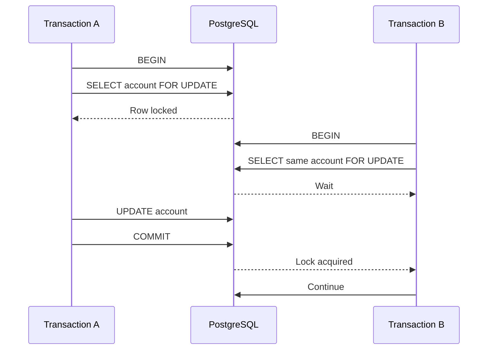
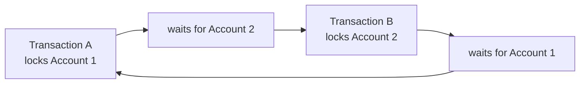

# 07- Locking Scenarios

## Overview

Locking is the database-level mechanism used to coordinate concurrent operations that access shared mutable state.

In a banking transaction database, locking is especially important because operations such as transfers, withdrawals, deposits, account closure, and transaction processing can target the same rows concurrently.

The objective is not to lock everything. The objective is to lock exactly the state required to preserve a business invariant.

A useful model is:

```text
Concurrent Requests
        ↓
Shared Database State
        ↓
Business Invariant
        ↓
Required Serialization
        ↓
Appropriate Locking Strategy
```

Typical PostgreSQL locking scenarios include:

| Scenario | Typical mechanism |
|---|---|
| Read and modify one account | `SELECT ... FOR UPDATE` |
| Atomic balance decrement | Conditional `UPDATE` |
| Multi-account transfer | Ordered row locks |
| Transaction state transition | Conditional `UPDATE` |
| Idempotency | Unique constraint |
| Worker queue | `FOR UPDATE SKIP LOCKED` |
| Logical application resource | Advisory lock |
| Schema changes | PostgreSQL DDL locking |
| Investigation | `pg_stat_activity` and lock catalog |

The central principle is:

> Lock the smallest set of rows for the shortest possible time while preserving the required invariant.

---

## What a Row Lock Does

Consider:

```sql
SELECT
    id,
    balance,
    status
FROM accounts
WHERE id = $1
FOR UPDATE;
```

The selected row is locked for update by the current transaction.

The lock remains until:

```text
COMMIT
```

or:

```text
ROLLBACK
```

Another transaction attempting a conflicting operation may wait.

The important distinction is that `FOR UPDATE` is a **database concurrency mechanism**, not an application-level mutex.

---

## Basic Lock Lifecycle



The second transaction does not obtain the conflicting lock until the first transaction releases it.

---

## Why Locks Are Required

Suppose:

```text
Account balance = 100
```

Two withdrawals execute:

```text
Request A → 80
Request B → 80
```

If both read the same balance before either writes:

```text
A reads 100
B reads 100
```

both may conclude:

```text
100 >= 80
```

A concurrency-safe design must serialize the relevant state change.

Two common approaches are:

```text
Atomic conditional UPDATE
```

or:

```text
SELECT ... FOR UPDATE
+
validation
+
UPDATE
```

---

## Atomic Update vs Row Lock

For a simple withdrawal:

```sql
UPDATE accounts
SET
    balance = balance - $1
WHERE id = $2
  AND status = 'ACTIVE'
  AND balance >= $1
RETURNING
    id,
    balance;
```

An explicit row lock may be unnecessary.

For a complex workflow:

```text
lock account
    ↓
inspect account state
    ↓
inspect pending operations
    ↓
validate multiple business rules
    ↓
create transaction
    ↓
create ledger entries
    ↓
update balance
```

`FOR UPDATE` is often more appropriate.

| Requirement | Preferred approach |
|---|---|
| Simple conditional decrement | Atomic `UPDATE` |
| Read current state then make several decisions | `FOR UPDATE` |
| Multiple accounts | Ordered row locks |
| State transition | Conditional `UPDATE` |
| Uniqueness | Unique constraint |
| Parallel worker processing | `SKIP LOCKED` |

---

## Scenario: Locking an Account Before Withdrawal

A complex withdrawal can use:

```sql
BEGIN;

SELECT
    id,
    balance,
    currency,
    status
FROM accounts
WHERE id = $1
FOR UPDATE;

-- Validate balance, status, currency, limits, etc.

UPDATE accounts
SET
    balance = balance - $2,
    updated_at = NOW()
WHERE id = $1;

COMMIT;
```

The validation and update operate against a stable locked account row.

This is useful when the decision depends on more than a single atomic predicate.

---

## Scenario: Concurrent Withdrawals

Initial state:

```text
balance = 1000
```

Two requests:

```text
A → withdraw 700
B → withdraw 700
```

With row locking:

```text
A locks account
B waits

A validates 1000 >= 700
A updates balance to 300
A commits

B acquires lock
B sees balance = 300
B rejects withdrawal
```

The second transaction does not validate against the stale value `1000`.

---

## Scenario: Concurrent Deposit and Withdrawal

Initial balance:

```text
100
```

Concurrent operations:

```text
Deposit 50
Withdrawal 120
```

With proper serialization, one operation observes the committed state produced by the other according to transaction timing and isolation semantics.

The system must define the business rule:

```text
If deposit commits first:
100 + 50 = 150
150 - 120 = 30
```

If the withdrawal is processed first:

```text
100 - 120
```

the withdrawal should fail if overdrafts are prohibited.

The important requirement is that neither operation should make an unsafe decision based on an outdated balance.

---

## Scenario: Transfer Between Two Accounts

A transfer touches at least:

```text
source account
destination account
transaction
ledger entries
```

The two account rows must be coordinated.

Example:

```sql
BEGIN;

SELECT
    id,
    balance,
    currency,
    status
FROM accounts
WHERE id IN ($1, $2)
ORDER BY id
FOR UPDATE;

-- Validate both accounts.

-- Insert transaction and ledger entries.
-- Update both balances.

COMMIT;
```

The transaction should perform all financial writes atomically.

---

## Deterministic Lock Ordering

Consider:

```text
Transfer A → B
Transfer B → A
```

If one operation locks:

```text
A → B
```

and another locks:

```text
B → A
```

a deadlock can occur.

Instead, lock by deterministic account identifier:

```sql
SELECT
    id,
    balance,
    currency,
    status
FROM accounts
WHERE id IN ($1, $2)
ORDER BY id
FOR UPDATE;
```

Both operations then attempt locks in the same order.

This is one of the most important practical locking patterns in financial systems.

---

## Why `ORDER BY` Matters

Suppose:

```text
Account IDs = 100 and 200
```

Both transactions use:

```text
ORDER BY id
```

The locking order becomes:

```text
100
↓
200
```

regardless of whether the transfer direction is:

```text
100 → 200
```

or:

```text
200 → 100
```

This removes a common source of circular lock dependencies.

---

## Scenario: Transaction Status Locking

Suppose:

```text
transaction.status = PENDING
```

Two workers attempt:

```text
Worker A → COMPLETED
Worker B → FAILED
```

A conditional transition can often avoid an explicit lock:

```sql
UPDATE transactions
SET
    status = 'COMPLETED',
    completed_at = NOW()
WHERE transaction_id = $1
  AND status = 'PENDING'
RETURNING
    transaction_id,
    status;
```

Only one worker can successfully transition the row from `PENDING`.

---

## Explicit Transaction Lock

If the worker needs to inspect multiple fields and perform a complex decision:

```sql
BEGIN;

SELECT
    id,
    status,
    amount,
    currency
FROM transactions
WHERE transaction_id = $1
FOR UPDATE;

-- Perform complex validation.

UPDATE transactions
SET
    status = 'COMPLETED',
    completed_at = NOW()
WHERE id = $2;

COMMIT;
```

Use this when the operation needs serialized access to the transaction row.

Do not add `FOR UPDATE` merely because the query is part of a transaction.

---

## Scenario: Cancellation vs Completion

Two operations may race:

```text
Customer:
PENDING → CANCELLED

Worker:
PENDING → COMPLETED
```

Use conditional transitions:

```sql
UPDATE transactions
SET
    status = 'CANCELLED'
WHERE transaction_id = $1
  AND status = 'PENDING'
RETURNING transaction_id;
```

and:

```sql
UPDATE transactions
SET
    status = 'COMPLETED',
    completed_at = NOW()
WHERE transaction_id = $1
  AND status = 'PENDING'
RETURNING transaction_id;
```

One operation wins.

The losing operation must re-read the state and return the appropriate business result.

---

## Scenario: Account Closure

Suppose an account can only close when:

```text
balance = 0
+
no prohibited pending operations
+
account is ACTIVE
```

A safe workflow may be:

```sql
BEGIN;

SELECT
    id,
    status,
    balance
FROM accounts
WHERE id = $1
FOR UPDATE;

-- Check pending operations.

UPDATE accounts
SET
    status = 'CLOSED',
    updated_at = NOW()
WHERE id = $1
  AND status = 'ACTIVE';

COMMIT;
```

The lock prevents a concurrent operation from modifying the same account between the validation and state transition.

---

## Scenario: Account Closure vs New Transaction

Consider:

```text
Request A → close account
Request B → create withdrawal
```

If both validate:

```text
account.status = ACTIVE
```

without serialization, both may proceed.

The design must establish a concurrency boundary around the account state.

Possible strategy:

```text
lock account
    ↓
check status
    ↓
check pending financial operations
    ↓
perform allowed operation
```

The exact business rule determines which operation wins.

---

## Scenario: Idempotency Does Not Usually Require Explicit Locks

For idempotency:

```text
customer_id + idempotency_key
```

prefer a unique database constraint:

```sql
CREATE UNIQUE INDEX transactions_idempotency_idx
ON transactions (
    initiated_by_customer_id,
    idempotency_key
)
WHERE idempotency_key IS NOT NULL;
```

This is better than manually locking a customer row merely to serialize idempotency checks.

A uniqueness invariant belongs naturally in a unique constraint.

---

## Scenario: Worker Queue

For database-backed work queues:

```sql
SELECT
    id,
    transaction_id
FROM transactions
WHERE status = 'PENDING'
ORDER BY created_at, id
FOR UPDATE SKIP LOCKED
LIMIT 100;
```

This allows concurrent workers to skip rows currently locked by other workers.

Example:

```text
Worker A → rows 1–100
Worker B → rows 101–200
Worker C → rows 201–300
```

assuming those rows are available and satisfy the query.

---

## Why `SKIP LOCKED` Exists

Without `SKIP LOCKED`:

```text
Worker A locks row 1
Worker B queries row 1
Worker B waits
```

With:

```sql
FOR UPDATE SKIP LOCKED
```

Worker B can skip row 1 and process another available row.

This increases throughput for queue-like workloads.

---

## `SKIP LOCKED` Is Not Strict Ordering

Suppose:

```text
row 1 = locked
row 2 = available
```

A worker using:

```sql
ORDER BY created_at
FOR UPDATE SKIP LOCKED
```

may process row 2 before row 1.

Therefore, do not use `SKIP LOCKED` when strict global ordering is a hard business requirement.

It is best suited to:

```text
work queues
background processing
batch workers
outbox publishers
```

where temporary ordering differences are acceptable.

---

## Claiming Work

A robust worker often needs to distinguish:

```text
available
claimed
processing
completed
failed
```

A simplistic pattern that selects rows and immediately commits without changing their state can allow another worker to select them again.

A durable claim might use:

```text
status
+
worker identifier
+
claimed_at
```

or another explicit lease mechanism.

The correct pattern depends on whether work is processed while holding the database lock or after a durable claim.

---

## Avoid Holding Locks During Slow Work

Bad:

```text
BEGIN
    SELECT ... FOR UPDATE
    call external API
    wait 20 seconds
    update transaction
COMMIT
```

The account or transaction lock may be held for the entire external call.

Prefer:

```text
short transaction
    ↓
persist state
    ↓
external work
    ↓
short finalization transaction
```

This reduces lock contention and makes failures easier to recover.

---

## Scenario: Outbox Publisher

An outbox publisher can use:

```sql
SELECT
    id,
    aggregate_id,
    event_type,
    payload
FROM outbox_events
WHERE published_at IS NULL
ORDER BY created_at, id
FOR UPDATE SKIP LOCKED
LIMIT 100;
```

The publisher should then have a durable strategy for claiming or marking events.

Kafka publication itself should not be assumed to be atomic with the PostgreSQL transaction.

---

## Scenario: Reconciliation Jobs

Reconciliation queries usually should not lock the entire transaction table.

For example:

```sql
SELECT
    t.transaction_id,
    t.status
FROM transactions AS t
WHERE t.created_at >= $1
  AND t.created_at < $2
  AND t.status = 'COMPLETED';
```

A reconciliation job should generally use bounded ranges and appropriate indexes.

If corrective operations are required, lock only the specific rows being corrected.

---

## Scenario: Row-Level Lock and Read Queries

A normal historical query:

```sql
SELECT
    transaction_id,
    amount,
    status
FROM transactions
WHERE transaction_id = $1;
```

does not normally need:

```sql
FOR UPDATE
```

Adding locks to read-only API endpoints can unnecessarily increase contention.

Use locks when another operation depends on exclusive access to the current state.

---

## Scenario: `FOR SHARE`

PostgreSQL also provides weaker row-locking modes such as:

```sql
FOR SHARE
```

These can be useful when a transaction needs to prevent certain concurrent modifications while not requiring an update lock.

However, financial application code should prefer the simplest lock mode that correctly represents the invariant.

Do not use stronger locks simply because they are familiar.

---

## Lock Compatibility

PostgreSQL has multiple table and row-level lock modes with different compatibility rules.

For everyday banking application code, the most important distinction is:

```text
FOR UPDATE
```

is intended for rows that the transaction may update.

The practical question is not:

```text
"What is the strongest lock?"
```

but:

```text
"What concurrent operation must this transaction prevent?"
```

---

## Scenario: Advisory Lock

Sometimes the resource being coordinated does not correspond cleanly to a row.

PostgreSQL advisory locks can represent an application-defined key:

```sql
SELECT pg_advisory_xact_lock($1);
```

The lock is transaction-scoped.

Possible uses include:

```text
logical settlement batch
application-defined workflow
external resource identifier
specialized coordination key
```

---

## Advisory Lock Limitations

Advisory locks are cooperative.

If one code path uses:

```sql
pg_advisory_xact_lock(...)
```

but another code path directly modifies the related database rows without taking the same advisory lock, the database does not automatically stop it.

Therefore:

```text
advisory lock
≠
automatic row protection
```

For relational invariants, row locks and constraints are usually preferable.

---

## Scenario: Distributed Application Instances

Suppose the banking service runs in Kubernetes:

```text
Pod A
Pod B
Pod C
```

A Python:

```python
threading.Lock()
```

exists only inside one process.

It cannot coordinate:

```text
Pod A ↔ Pod B
```

for database state.

Database-level concurrency control works across application instances because all instances coordinate through the same PostgreSQL state.

---

## Django Row Locking

Django exposes PostgreSQL row locks through:

```python
from django.db import transaction

with transaction.atomic():
    account = (
        Account.objects
        .select_for_update()
        .get(id=account_id)
    )

    if account.status != "ACTIVE":
        raise ValueError("Account is not active")

    if account.balance < amount:
        raise ValueError("Insufficient funds")

    account.balance -= amount
    account.save(update_fields=["balance", "updated_at"])
```

The important part is that:

```text
select_for_update()
```

must execute inside an appropriate database transaction.

---

## Django `select_for_update()` Considerations

`select_for_update()` does not magically make an entire business workflow safe.

You still need to reason about:

- Which rows are locked.
- Lock acquisition order.
- Transaction duration.
- Isolation level.
- Constraints.
- Retry behavior.
- External side effects.

A lock is one component of the concurrency design.

---

## SQLAlchemy Row Locking

With SQLAlchemy, a row-level lock can be expressed using:

```python
with session.begin():
    account = (
        session.query(Account)
        .filter(Account.id == account_id)
        .with_for_update()
        .one()
    )

    if account.balance < amount:
        raise ValueError("Insufficient funds")

    account.balance -= amount
```

The session transaction determines the lifetime of the lock.

---

## Locking and Isolation Levels

Lock behavior must be understood together with transaction isolation.

Common PostgreSQL isolation levels include:

| Isolation | Concurrency characteristic |
|---|---|
| `READ COMMITTED` | Default; each statement sees a current committed snapshot |
| `REPEATABLE READ` | Stable transaction snapshot with stronger serialization behavior |
| `SERIALIZABLE` | Strongest isolation; transactions may be aborted and retried |

Row locks and isolation levels solve related but different problems.

For many banking operations:

```text
READ COMMITTED
+
appropriate row locks
+
atomic updates
+
constraints
```

can provide the required correctness.

---

## Locking Under `READ COMMITTED`

At `READ COMMITTED`, statements generally operate on a statement-level snapshot.

For an `UPDATE`, PostgreSQL may wait for a conflicting concurrent update and then re-evaluate the relevant conditions against the updated row.

This is one reason conditional updates such as:

```sql
UPDATE accounts
SET balance = balance - $1
WHERE id = $2
  AND balance >= $1;
```

are powerful concurrency primitives.

---

## Scenario: Lock Timeout

A transaction may wait for a conflicting lock.

PostgreSQL supports:

```sql
SET LOCAL lock_timeout = '2s';
```

This limits how long statements in the transaction wait for locks.

This can protect services from indefinitely waiting on blocked database operations.

However, a timeout is not a substitute for correct lock ordering or transaction design.

---

## Scenario: Statement Timeout

A different control is:

```sql
SET LOCAL statement_timeout = '5s';
```

This limits statement execution time.

The distinction is important:

```text
lock_timeout
    ↓
waiting for a lock

statement_timeout
    ↓
overall statement execution
```

Do not treat them as interchangeable.

---

## Scenario: Idle in Transaction

A particularly dangerous pattern is:

```text
BEGIN
SELECT ... FOR UPDATE
application waits
user interaction
network call
process pauses
COMMIT
```

The transaction remains open while locks and snapshots remain active.

PostgreSQL provides:

```sql
idle_in_transaction_session_timeout
```

as a safety mechanism.

Applications should still design transaction boundaries correctly rather than depending solely on timeout configuration.

---

## Deadlocks

A deadlock occurs when transactions wait on one another in a cycle.



PostgreSQL detects deadlocks and aborts one transaction.

---

## Deadlock Prevention

Use:

- Deterministic lock ordering.
- Short transactions.
- Consistent access patterns.
- Minimal lock scope.
- Appropriate indexes.
- No unnecessary external calls inside transactions.

Example:

```text
Always lock account IDs in ascending order.
```

This is much more reliable than hoping requests arrive in a convenient order.

---

## Deadlock Handling

A PostgreSQL deadlock can produce:

```text
SQLSTATE 40P01
```

The service may retry the complete transaction.

Example strategy:

```text
attempt 1
   ↓
deadlock
   ↓
rollback
   ↓
backoff
   ↓
attempt 2
```

Use bounded retries and jitter.

Do not retry indefinitely.

---

## Serialization Failures

A serializable transaction can fail with:

```text
SQLSTATE 40001
```

The appropriate retry is normally:

```text
rollback
+
retry entire transaction
```

Do not retry only the statement that failed.

Earlier reads may have contributed to the serialization conflict.

---

## Unknown Commit Outcome

A critical failure case is:

```text
COMMIT
  ↓
database commits
  ↓
network failure
  ↓
application receives timeout
```

The application may not know whether the transaction committed.

Do not interpret every commit communication error as:

```text
definite rollback
```

Use:

```text
idempotency
+
transaction lookup
+
reconciliation
```

to establish the durable result.

---

## Lock Monitoring

When diagnosing lock contention, inspect active sessions:

```sql
SELECT
    pid,
    usename,
    state,
    wait_event_type,
    wait_event,
    query_start,
    query
FROM pg_stat_activity
WHERE datname = current_database()
ORDER BY query_start;
```

Look for:

```text
Lock
```

in:

```text
wait_event_type
```

and investigate long-running transactions.

---

## Finding Blocking Relationships

A useful investigation query is:

```sql
SELECT
    blocked.pid AS blocked_pid,
    blocked.query AS blocked_query,
    blocking.pid AS blocking_pid,
    blocking.query AS blocking_query
FROM pg_stat_activity AS blocked
JOIN pg_locks AS blocked_lock
    ON blocked_lock.pid = blocked.pid
JOIN pg_locks AS blocking_lock
    ON blocking_lock.locktype = blocked_lock.locktype
    AND blocking_lock.database IS NOT DISTINCT FROM blocked_lock.database
    AND blocking_lock.relation IS NOT DISTINCT FROM blocked_lock.relation
    AND blocking_lock.page IS NOT DISTINCT FROM blocked_lock.page
    AND blocking_lock.tuple IS NOT DISTINCT FROM blocked_lock.tuple
    AND blocking_lock.virtualxid IS NOT DISTINCT FROM blocked_lock.virtualxid
    AND blocking_lock.transactionid IS NOT DISTINCT FROM blocked_lock.transactionid
    AND blocking_lock.classid IS NOT DISTINCT FROM blocked_lock.classid
    AND blocking_lock.objid IS NOT DISTINCT FROM blocked_lock.objid
    AND blocking_lock.objsubid IS NOT DISTINCT FROM blocked_lock.objsubid
    AND blocking_lock.pid <> blocked_lock.pid
JOIN pg_stat_activity AS blocking
    ON blocking.pid = blocking_lock.pid
WHERE NOT blocked_lock.granted
  AND blocking_lock.granted;
```

For production diagnostics, prefer PostgreSQL's lock inspection facilities rather than guessing which query is responsible for contention.

---

## Lock Contention Metrics

Monitor:

```text
lock wait duration
blocked sessions
deadlocks
transaction duration
idle-in-transaction sessions
connection pool utilization
```

A growing lock-wait time can indicate:

```text
slow transaction
incorrect lock scope
missing index
hot row
deadlock pressure
excessive concurrency
```

---

## Hot Rows

A single account can become a hot row if it receives very high transaction volume.

For example:

```text
Account A
   ↑
1000 concurrent operations
```

All operations requiring:

```sql
FOR UPDATE
```

on that account serialize.

This is not necessarily a query optimization problem.

It may be a fundamental contention problem caused by the data model.

---

## Hot Account Design

If one account receives extreme transaction volume, possible architectural approaches include:

- Reduce unnecessary locking.
- Use atomic updates where sufficient.
- Queue operations.
- Partition workloads by account.
- Serialize account-specific work through a dedicated worker model.
- Reconsider whether the balance projection and ledger write path need the same synchronization strategy.

Do not solve a fundamentally hot-key workload simply by adding more application replicas.

More replicas can increase contention against the same database row.

---

## Lock Duration and Query Performance

Suppose:

```text
Transaction holds account lock
        ↓
runs slow query
        ↓
5 seconds
```

Other transactions targeting the account may wait for the entire five seconds.

Therefore:

```text
query performance
```

and:

```text
lock performance
```

are closely related.

Use:

```sql
EXPLAIN (ANALYZE, BUFFERS)
```

to investigate slow queries that execute inside critical transaction paths.

---

## Indexes and Locking

Indexes do not eliminate row-level lock contention.

However, an appropriate index can reduce the amount of work needed to locate rows.

For example:

```sql
SELECT
    id
FROM transactions
WHERE status = 'PENDING'
ORDER BY created_at, id
FOR UPDATE SKIP LOCKED
LIMIT 100;
```

A suitable index can reduce scanning work and help workers reach eligible rows more efficiently.

The actual plan should be verified with realistic data.

---

## Lock Scope

Bad:

```text
BEGIN
    lock customer
    perform unrelated queries
    generate report
    call external service
    update account
COMMIT
```

Better:

```text
BEGIN
    lock required account rows
    validate
    update financial state
    insert ledger/outbox records
COMMIT
```

The transaction should contain only the work that needs atomicity and serialization.

---

## Lock Granularity

Prefer:

```text
specific rows
```

over unnecessarily broad locking.

Avoid designing an operation that locks:

```text
entire customer population
```

when it only needs:

```text
one account
```

or:

```text
two accounts
```

Smaller lock scope improves concurrency.

---

## Security Implications

Incorrect locking can create security vulnerabilities.

Example:

```text
authorization check
      ↓
account state changes
      ↓
financial operation
```

If the authorization decision depends on mutable state, the concurrency model must ensure that the protected state cannot change unexpectedly between validation and the financial mutation.

Always combine:

```text
authorization
+
transaction boundary
+
appropriate locking
+
database constraints
```

---

## Distributed Locks vs Database Locks

A distributed application may be tempted to use Redis:

```text
Redis lock
    ↓
PostgreSQL update
```

This can coordinate application workflows, but it does not automatically make PostgreSQL state safe.

If the financial invariant is:

```text
balance must not become negative
```

the strongest enforcement should remain close to:

```text
PostgreSQL account state
```

using atomic updates, constraints, or row locks as appropriate.

---

## High Availability Considerations

Application replicas do not provide independent database state.

Multiple Django/FastAPI instances:

```text
Pod A ─┐
Pod B ─┼── PostgreSQL Primary
Pod C ─┘
```

all coordinate through PostgreSQL.

This is a major advantage of database-level locking over process-local synchronization.

During failover, in-flight transactions may be aborted.

The application must therefore support:

```text
rollback
+
retry where safe
+
idempotency
+
reconciliation
```

---

## Operational Best Practices

### Keep Transactions Short

Avoid:

```text
external API
email
Kafka publish
large computation
user interaction
```

inside a transaction that holds critical locks.

### Lock Consistently

Use the same lock acquisition order across all code paths.

### Prefer Constraints for Invariants

Use:

```text
UNIQUE
CHECK
FOREIGN KEY
```

where they naturally express the invariant.

### Prefer Atomic SQL for Simple State Changes

Do not use an explicit lock when a single conditional update is sufficient.

### Monitor Lock Contention

Track:

```text
wait time
deadlocks
long transactions
blocked sessions
```

---

## Common Mistakes

### Locking Every Read

Using:

```sql
FOR UPDATE
```

for every query unnecessarily serializes work.

Only lock when the business operation requires it.

---

### Locking After Reading Without a Transaction

This is unsafe:

```text
SELECT
application logic
SELECT ... FOR UPDATE
UPDATE
```

The initial read may already have observed stale state.

Put the relevant read and lock inside the same transaction.

---

### Locking Accounts in Transfer Direction

Do not use:

```text
source first
destination second
```

if transfers can happen in both directions.

Use deterministic ordering by a stable key.

---

### Holding Locks During External Calls

External latency is unpredictable.

Never make database lock duration depend unnecessarily on:

```text
HTTP
payment provider
Kafka
DNS
user action
```

---

### Using Python Locks in Kubernetes

Process-local locks do not coordinate across pods.

Use database-level or deliberately designed distributed coordination.

---

### Assuming `SKIP LOCKED` Guarantees Fairness

It intentionally skips locked rows.

A repeatedly locked row may be delayed.

Use it for throughput-oriented queue workloads, not strict fairness requirements.

---

### Using Advisory Locks for Relational Invariants

If the invariant is naturally represented by:

```text
row
constraint
unique key
```

prefer the database's relational mechanisms.

---

### Ignoring Hot Rows

A single heavily used account can become a serialization bottleneck even when every query is optimized.

The workload and architecture may need to change.

---

### Retrying Only the Failed Statement

For:

```text
40001
40P01
```

retry the complete transaction where the operation is safely retryable.

---

## Interview Traps

### "Does `FOR UPDATE` Lock the Entire Table?"

No.

It locks the selected rows, while PostgreSQL also takes the necessary table-level lock associated with the statement.

The practical application concern is row-level contention on the selected records.

---

### "Is `FOR UPDATE` Always Better Than an Atomic Update?"

No.

For a simple operation such as:

```text
debit if balance >= amount
```

an atomic conditional update can be simpler and more efficient.

---

### "Does a Database Lock Prevent Duplicate API Requests?"

Not necessarily.

Duplicate requests are better handled with durable idempotency semantics and a unique constraint.

---

### "Can More Kubernetes Pods Solve Lock Contention?"

Usually not.

If all pods contend for the same PostgreSQL row, more pods can increase the number of competing transactions.

---

### "Does `SKIP LOCKED` Guarantee FIFO?"

No.

It can skip locked rows, so strict global ordering is not guaranteed.

---

### "Does a Redis Lock Replace PostgreSQL Locking?"

Not automatically.

A Redis lock and PostgreSQL row lock protect different coordination mechanisms.

The authoritative financial invariant should remain enforceable by the database.

---

### "Does a Deadlock Mean PostgreSQL Is Broken?"

No.

Deadlocks can naturally arise from incompatible lock acquisition orders.

PostgreSQL detects them and aborts one transaction.

The application should avoid preventable deadlocks and safely retry appropriate operations.

---

## Production Locking Checklist

### Lock Selection

- [ ] The shared mutable state is explicitly identified.
- [ ] The business invariant is explicitly defined.
- [ ] A database constraint is used when it naturally expresses the invariant.
- [ ] Atomic updates are preferred for simple state changes.
- [ ] Row locks are used for multi-step mutable workflows.
- [ ] Advisory locks are used only for appropriate logical resources.

### Lock Ordering

- [ ] Multi-row operations use deterministic lock ordering.
- [ ] Transfer directions do not determine lock order.
- [ ] Different code paths follow compatible locking rules.

### Transaction Scope

- [ ] Transactions are short.
- [ ] External API calls are outside critical transactions where possible.
- [ ] Expensive computation is outside critical transactions where possible.
- [ ] Idle-in-transaction sessions are monitored.
- [ ] Lock duration is measured.

### Reliability

- [ ] Deadlocks are handled.
- [ ] Serialization failures are handled where applicable.
- [ ] Retries are bounded and use backoff.
- [ ] Retried financial operations are idempotent.
- [ ] Unknown commit outcomes can be reconciled.

### Worker Processing

- [ ] `SKIP LOCKED` is used only for suitable queue-like workloads.
- [ ] Work has a durable claim/state model.
- [ ] Worker processing is idempotent.
- [ ] Long-running work does not unnecessarily hold database locks.

### Operations

- [ ] Lock waits are monitored.
- [ ] Deadlocks are monitored.
- [ ] Long-running transactions are monitored.
- [ ] Hot rows are identified.
- [ ] Connection pool saturation is monitored.
- [ ] Critical locking queries are analyzed with realistic execution plans.

---

## Senior Locking Decision Framework

When reviewing a banking operation, ask:

```text
What state is shared?
        ↓
What invariant must hold?
        ↓
Can a constraint enforce it?
        ↓
Can one atomic SQL statement enforce it?
        ↓
If not, which rows must be serialized?
        ↓
What exact lock mode is required?
        ↓
What order are multiple rows locked?
        ↓
How long are those locks held?
        ↓
Can the operation deadlock?
        ↓
Can it be retried safely?
        ↓
What happens if COMMIT outcome is unknown?
        ↓
How will the result be reconciled?
```

A strong design often follows this hierarchy:

```text
Constraint
   ↓
Atomic statement
   ↓
Row lock
   ↓
Explicit transaction
   ↓
Advisory/distributed coordination
```

Use the simplest mechanism that correctly protects the invariant.

---

## Key Takeaways

- **Locking should protect a specific business invariant, not be added indiscriminately to every query; atomic updates and constraints are often better for simple cases.**
- **Use `SELECT ... FOR UPDATE` for multi-step workflows that must inspect and modify shared state, and acquire multiple account locks in deterministic order to reduce deadlocks.**
- **Keep critical transactions short and never unnecessarily hold financial row locks while waiting on external services, slow computation, or user-controlled operations.**
- **`SKIP LOCKED` is valuable for parallel worker queues but does not guarantee strict ordering or fairness; worker processing must also be durable and idempotent.**
- **Senior locking design combines database constraints, atomic SQL, row locks, transaction boundaries, retry handling, observability, and reconciliation rather than relying on a single locking mechanism.**