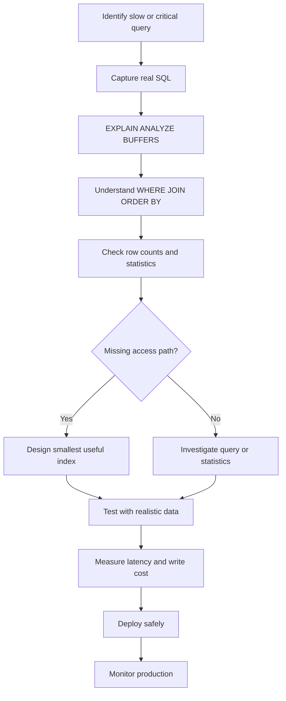

# 09- Indexing Strategy

## Overview

Indexing is one of the most important database design decisions in a banking transaction system because account lookups, transaction history, idempotency checks, reconciliation, and background processing all depend on predictable access paths.

An index is a data structure that PostgreSQL can use to locate rows without scanning the entire table.

For a banking database, indexing should be driven by actual access patterns:

```text
API / Worker / Report
        ↓
SQL access pattern
        ↓
WHERE / JOIN / ORDER BY
        ↓
Index strategy
        ↓
Execution plan
        ↓
Latency + throughput
```

Indexes improve reads, but they also introduce costs:

```text
more indexes
    ↓
more storage
    ↓
more INSERT/UPDATE/DELETE work
    ↓
more WAL and replication traffic
    ↓
more vacuum/maintenance work
```

The goal is therefore not to maximize the number of indexes.

> The goal is to create the smallest useful set of indexes that efficiently supports the system's important access patterns.

---

## Banking Access Patterns

The core banking database contains workloads such as:

- Find a customer.
- Find an account by account number.
- List a customer's accounts.
- Retrieve transaction history for an account.
- Retrieve transactions for a date range.
- Check an idempotency key.
- Find pending transactions for workers.
- Reconcile transactions against ledger entries.
- Query ledger entries for an account.
- Find transactions by external provider reference.
- Generate account statements.
- Process pending outbox events.

Each workload should be translated into a query pattern before choosing an index.

---

## Primary Key Indexes

A primary key automatically requires uniqueness, and PostgreSQL creates a unique B-tree index to enforce it.

Example:

```sql
CREATE TABLE accounts (
    id bigint GENERATED ALWAYS AS IDENTITY PRIMARY KEY,
    customer_id bigint NOT NULL,
    account_number text NOT NULL,
    balance numeric(20, 4) NOT NULL DEFAULT 0
);
```

The primary key provides an index suitable for:

```sql
SELECT *
FROM accounts
WHERE id = $1;
```

This is the most basic indexing pattern:

```text
exact lookup by unique identifier
        ↓
primary key index
```

Do not create another index on the same column merely because the application performs lookups by that primary key.

---

## Unique Indexes

Business identifiers often require uniqueness beyond the surrogate primary key.

For example:

```sql
CREATE UNIQUE INDEX accounts_account_number_uidx
ON accounts (account_number);
```

This supports:

```sql
SELECT
    id,
    customer_id,
    status
FROM accounts
WHERE account_number = $1;
```

The unique index provides both:

- Efficient lookup.
- Database-enforced uniqueness.

This is preferable to checking uniqueness only in application code.

---

## Idempotency Index

Idempotency is especially important for banking operations.

Suppose the API accepts:

```text
customer_id
idempotency_key
```

Create a unique constraint or unique index:

```sql
CREATE UNIQUE INDEX transactions_idempotency_uidx
ON transactions (
    initiated_by_customer_id,
    idempotency_key
)
WHERE idempotency_key IS NOT NULL;
```

The database then prevents concurrent requests from creating duplicate operations.

This is stronger than:

```python
if not transaction_exists(key):
    create_transaction()
```

because two application instances can execute that check concurrently.

---

## Foreign Key Indexes

A foreign key does not automatically create an index on the referencing column in PostgreSQL.

For example:

```sql
CREATE TABLE transactions (
    id bigint GENERATED ALWAYS AS IDENTITY PRIMARY KEY,
    account_id bigint NOT NULL REFERENCES accounts(id)
);
```

A useful index is often:

```sql
CREATE INDEX transactions_account_id_idx
ON transactions (account_id);
```

This supports:

```sql
SELECT *
FROM transactions
WHERE account_id = $1;
```

It can also improve joins:

```sql
SELECT
    a.id,
    t.id,
    t.amount
FROM accounts a
JOIN transactions t
    ON t.account_id = a.id
WHERE a.id = $1;
```

Whether an FK index is useful should still be evaluated against actual workload, but transaction-history access almost certainly makes this one valuable.

---

## Transaction History Index

A common banking query is:

```sql
SELECT
    id,
    transaction_id,
    amount,
    currency,
    status,
    created_at
FROM ledger_entries
WHERE account_id = $1
ORDER BY created_at DESC, id DESC
LIMIT 50;
```

A composite index aligned with the access pattern is appropriate:

```sql
CREATE INDEX ledger_entries_account_created_idx
ON ledger_entries (
    account_id,
    created_at DESC,
    id DESC
);
```

This supports both:

```text
WHERE account_id = ?
```

and:

```text
ORDER BY created_at DESC, id DESC
```

without requiring the database to independently sort a large set of rows.

---

## Composite Index Column Order

Column order matters.

Consider:

```sql
CREATE INDEX transactions_account_status_created_idx
ON transactions (
    account_id,
    status,
    created_at DESC
);
```

This is particularly useful for:

```sql
WHERE account_id = $1
  AND status = $2
ORDER BY created_at DESC
```

But it is not automatically equivalent to:

```sql
CREATE INDEX transactions_created_status_account_idx
ON transactions (
    created_at DESC,
    status,
    account_id
);
```

The correct ordering depends on the workload.

A useful rule is:

```text
common equality predicates
        ↓
useful filtering predicates
        ↓
ordering / range columns
```

But this is a design heuristic, not a universal formula. Validate with `EXPLAIN`.

---

## Keyset Pagination Index

Banking transaction history can grow to millions or billions of rows.

Avoid deep pagination such as:

```sql
SELECT ...
FROM ledger_entries
WHERE account_id = $1
ORDER BY created_at DESC, id DESC
OFFSET 500000
LIMIT 50;
```

Prefer keyset pagination:

```sql
SELECT
    id,
    transaction_id,
    amount,
    currency,
    created_at
FROM ledger_entries
WHERE account_id = $1
  AND (created_at, id) < ($2, $3)
ORDER BY created_at DESC, id DESC
LIMIT 50;
```

Use:

```sql
CREATE INDEX ledger_entries_account_created_idx
ON ledger_entries (
    account_id,
    created_at DESC,
    id DESC
);
```

The index supports the cursor boundary and ordering.

The `(created_at, id)` pair also provides deterministic pagination when multiple entries have the same timestamp.

---

## Why the Tie-Breaker Matters

This query is weaker:

```sql
ORDER BY created_at DESC
```

because multiple rows can have the same timestamp.

Use:

```sql
ORDER BY created_at DESC, id DESC
```

and use the same ordering in the cursor:

```sql
(created_at, id) < ($cursor_created_at, $cursor_id)
```

The ordering and cursor condition must describe the same total ordering.

---

## Account Listing Index

Suppose the API lists all accounts for a customer:

```sql
SELECT
    id,
    account_number,
    currency,
    status,
    balance
FROM accounts
WHERE customer_id = $1
ORDER BY id
LIMIT 50;
```

An appropriate index is:

```sql
CREATE INDEX accounts_customer_id_id_idx
ON accounts (
    customer_id,
    id
);
```

The index matches:

```text
customer filter
+
stable ordering
```

This becomes especially valuable when customers can have many accounts.

---

## Partial Indexes

Partial indexes index only rows satisfying a condition.

For example, workers may frequently process pending transactions:

```sql
CREATE INDEX transactions_pending_idx
ON transactions (
    created_at,
    id
)
WHERE status = 'PENDING';
```

This can be substantially smaller than indexing every transaction.

A matching query:

```sql
SELECT
    id,
    account_id,
    amount
FROM transactions
WHERE status = 'PENDING'
ORDER BY created_at, id
LIMIT 100;
```

can benefit from the partial index.

Partial indexes are particularly useful for operational states such as:

```text
PENDING
FAILED
ACTIVE
UNSETTLED
```

when those states represent a relatively small portion of the table.

---

## Worker Queue Index

A Celery or other background worker may claim pending work:

```sql
SELECT
    id
FROM transactions
WHERE status = 'PENDING'
ORDER BY created_at, id
FOR UPDATE SKIP LOCKED
LIMIT 100;
```

A useful index is:

```sql
CREATE INDEX transactions_pending_worker_idx
ON transactions (
    created_at,
    id
)
WHERE status = 'PENDING';
```

The worker architecture becomes:

```text
Celery workers
      │
      ├── SELECT pending rows
      │
      ├── FOR UPDATE SKIP LOCKED
      │
      ├── process
      │
      └── update status
```

The index reduces the amount of work required to locate pending records.

---

## External Reference Index

Banking integrations commonly have provider references:

```text
provider
external_transaction_id
```

If the application frequently reconciles using:

```sql
SELECT *
FROM transactions
WHERE provider = $1
  AND external_transaction_id = $2;
```

use:

```sql
CREATE UNIQUE INDEX transactions_provider_external_uidx
ON transactions (
    provider,
    external_transaction_id
);
```

If uniqueness is not guaranteed by the provider contract, use a normal composite index instead.

---

## Ledger Indexes

A ledger commonly needs several different access patterns.

### By Account

```sql
CREATE INDEX ledger_entries_account_created_idx
ON ledger_entries (
    account_id,
    created_at DESC,
    id DESC
);
```

### By Transaction

```sql
CREATE INDEX ledger_entries_transaction_idx
ON ledger_entries (
    transaction_id
);
```

This supports:

```sql
SELECT *
FROM ledger_entries
WHERE transaction_id = $1;
```

### By Account and Direction

If reports frequently filter by direction:

```sql
WHERE account_id = $1
  AND direction = 'DEBIT'
```

a composite index may be justified:

```sql
CREATE INDEX ledger_entries_account_direction_idx
ON ledger_entries (
    account_id,
    direction
);
```

Do not create this index merely because the column exists. Create it because the access pattern justifies it.

---

## Indexes for Reconciliation

A reconciliation workflow might compare:

```text
transaction
        ↓
ledger entries
        ↓
external provider record
```

Useful indexes could include:

```text
transactions(provider, external_transaction_id)
ledger_entries(transaction_id)
transactions(created_at, id)
```

The exact set depends on the reconciliation query.

For large reconciliation jobs, inspect the actual execution plan rather than assuming every join column needs an index.

---

## B-Tree Index

PostgreSQL's B-tree is the default index type and is appropriate for many banking workloads.

It supports common operations such as:

```text
=
<
<=
>
>=
BETWEEN
ORDER BY
```

Typical banking examples:

```sql
WHERE account_id = $1
```

```sql
WHERE created_at >= $1
  AND created_at < $2
```

```sql
ORDER BY created_at DESC
```

For ordinary transactional access patterns, start with B-tree unless the workload requires another index type.

---

## Index and Range Queries

Transaction history often uses time windows:

```sql
SELECT
    id,
    amount,
    created_at
FROM transactions
WHERE account_id = $1
  AND created_at >= $2
  AND created_at < $3
ORDER BY created_at DESC;
```

An index such as:

```sql
CREATE INDEX transactions_account_created_idx
ON transactions (
    account_id,
    created_at DESC
);
```

is aligned with this access pattern.

Use half-open intervals:

```text
[start, end)
```

to avoid timestamp boundary ambiguity when constructing adjacent reporting windows.

---

## Indexes and `NULL`

An index can contain `NULL` values.

For a nullable field:

```sql
external_transaction_id text
```

a query may be:

```sql
WHERE external_transaction_id = $1
```

If only non-null values matter, a partial index can reduce index size:

```sql
CREATE INDEX transactions_external_reference_idx
ON transactions (external_transaction_id)
WHERE external_transaction_id IS NOT NULL;
```

This is especially useful when most rows have no external reference.

---

## Expression Indexes

An expression index indexes the result of an expression.

Example:

```sql
CREATE INDEX customers_lower_email_idx
ON customers (lower(email));
```

This supports:

```sql
SELECT id
FROM customers
WHERE lower(email) = lower($1);
```

However, expression indexes have trade-offs:

- Additional storage.
- Additional write cost.
- More complex schema.
- Query must use a matching expression.

For authentication-related lookups, a better design may sometimes be a case-insensitive type or normalized column rather than repeatedly applying expressions.

Choose based on the domain and existing schema conventions.

---

## Covering Indexes and `INCLUDE`

PostgreSQL supports included columns:

```sql
CREATE INDEX accounts_customer_lookup_idx
ON accounts (
    customer_id,
    id
)
INCLUDE (
    status,
    currency
);
```

The indexed columns determine the search order.

Included columns are payload stored with the index and can sometimes enable index-only scans.

Do not add every selected column to an index.

Large indexes increase:

```text
storage
+
write amplification
+
cache pressure
+
maintenance cost
```

---

## Index-Only Scans

An index-only scan can sometimes satisfy a query using the index without fetching the table heap for every row.

For example:

```sql
SELECT
    id,
    status
FROM accounts
WHERE customer_id = $1;
```

An appropriate index may allow PostgreSQL to avoid some heap access.

Whether an index-only scan actually occurs depends on factors including PostgreSQL's visibility map and table state.

Therefore:

```text
INCLUDE
≠
guaranteed index-only scan
```

Always verify using:

```sql
EXPLAIN (ANALYZE, BUFFERS)
```

---

## Indexes and `EXPLAIN`

Never evaluate an index only by asking:

```text
"Does this column have an index?"
```

Evaluate the complete execution plan.

Example:

```sql
EXPLAIN (ANALYZE, BUFFERS)
SELECT
    id,
    amount,
    created_at
FROM ledger_entries
WHERE account_id = 1001
ORDER BY created_at DESC, id DESC
LIMIT 50;
```

Look for:

- Actual row counts.
- Estimated row counts.
- Index scan type.
- Sort operations.
- Buffer reads.
- Buffer hits.
- Execution time.
- Rows removed by filter.

---

## Index Scan vs Sequential Scan

An index does not guarantee an index scan.

PostgreSQL may choose:

```text
Seq Scan
```

when it estimates that scanning a large portion of the table is cheaper.

For example:

```sql
SELECT COUNT(*)
FROM transactions
WHERE status = 'COMPLETED';
```

If most rows are completed, a sequential scan may be more efficient than using an index.

This is correct optimizer behavior.

> An index is an available access path, not an instruction to PostgreSQL to use it.

---

## Selectivity

Selectivity describes how effectively a predicate narrows the result set.

Compare:

```sql
WHERE id = $1
```

with:

```sql
WHERE status = 'COMPLETED'
```

If 99% of rows are completed, a standalone index on `status` may provide limited benefit for many queries.

But:

```sql
WHERE status = 'PENDING'
```

may be highly selective if only 1% of rows are pending.

This is one reason partial indexes can be valuable.

---

## Statistics Matter

PostgreSQL's planner relies on statistics to estimate:

```text
number of rows
+
value distribution
+
selectivity
```

After substantial data changes, statistics need to remain current.

PostgreSQL normally maintains statistics through `ANALYZE` and autovacuum-related mechanisms.

For unusual distributions or correlated columns, extended statistics may be useful.

---

## Indexes and Correlated Predicates

Consider:

```sql
WHERE account_id = $1
  AND status = 'PENDING'
```

The planner must estimate the combined selectivity.

If:

```text
account_id
```

and:

```text
status
```

are correlated, independent column statistics may not fully describe the distribution.

PostgreSQL supports extended statistics for cases where multi-column relationships materially affect planning.

Do not immediately add indexes to compensate for every poor plan.

First determine whether the problem is:

```text
missing index
vs
bad statistics
vs
bad query
vs
data distribution
```

---

## Indexes and Joins

Suppose:

```sql
SELECT
    a.id,
    t.id,
    t.amount
FROM accounts a
JOIN transactions t
    ON t.account_id = a.id
WHERE a.customer_id = $1;
```

Potentially useful indexes include:

```text
accounts(customer_id)
transactions(account_id)
```

But the best plan depends on:

- Table sizes.
- Selectivity.
- Join algorithm.
- Statistics.
- Result cardinality.

An index on every join column is not automatically required.

---

## Indexes and `EXISTS`

A query such as:

```sql
SELECT
    a.id
FROM accounts a
WHERE EXISTS (
    SELECT 1
    FROM transactions t
    WHERE t.account_id = a.id
);
```

can benefit from:

```sql
CREATE INDEX transactions_account_id_idx
ON transactions (account_id);
```

The database needs an efficient way to determine whether a matching transaction exists.

PostgreSQL may transform this into a semi-join or choose another efficient plan.

---

## Indexes and Aggregation

Indexes can help reduce input for some aggregation queries.

For example:

```sql
SELECT
    account_id,
    COUNT(*)
FROM transactions
WHERE created_at >= $1
GROUP BY account_id;
```

An index beginning with:

```text
created_at
```

may help filter the time range.

But indexing every grouping column is not automatically beneficial.

The optimizer may still choose a sequential scan followed by hash aggregation if that is cheaper.

---

## Indexes and Sorting

An index can sometimes provide rows in the required order.

For example:

```sql
CREATE INDEX ledger_entries_account_created_idx
ON ledger_entries (
    account_id,
    created_at DESC,
    id DESC
);
```

can support:

```sql
WHERE account_id = $1
ORDER BY created_at DESC, id DESC
```

However, PostgreSQL may still perform a sort if it determines that another plan is cheaper.

Do not assume:

```text
matching ORDER BY
=
no Sort node
```

Verify the execution plan.

---

## Indexes and Updates

Indexes affect writes.

An insert into:

```text
transactions
```

may require updates to multiple indexes:

```text
transactions table
     │
     ├── primary key index
     ├── account index
     ├── status index
     ├── idempotency index
     └── external reference index
```

Every additional index can increase write work.

This matters in high-volume banking systems where transactions may be inserted continuously.

---

## HOT Updates

PostgreSQL can sometimes perform HOT (Heap-Only Tuple) updates when indexed columns do not need new index entries and other conditions are satisfied.

This can reduce index maintenance for certain updates.

Therefore, indexing frequently updated columns indiscriminately can increase write amplification.

For example, if:

```text
status
```

changes frequently and the table has several indexes involving `status`, each status transition can become more expensive.

Partial indexes can still be useful, but the write pattern must be considered.

---

## Over-Indexing

A table such as:

```text
transactions
```

can easily accumulate indexes for:

```text
account_id
customer_id
status
currency
amount
created_at
provider
external_id
created_at + status
account_id + created_at
account_id + status + created_at
```

This may appear comprehensive but can become expensive.

Every index has:

```text
storage cost
+
write cost
+
WAL cost
+
replication cost
+
backup cost
+
vacuum/maintenance cost
```

Index only the access patterns that justify those costs.

---

## Redundant Indexes

Consider:

```sql
CREATE INDEX idx_transactions_account
ON transactions (account_id);

CREATE INDEX idx_transactions_account_created
ON transactions (account_id, created_at);
```

The second index can often support equality lookups on:

```text
account_id
```

as well as account-plus-date queries.

The first index may therefore be redundant, depending on the workload.

Do not delete indexes solely from column-prefix reasoning, however. Verify actual workload, uniqueness requirements, index-only scan needs, size, and plan usage before removing one.

---

## Unused Indexes

PostgreSQL statistics views can help identify indexes with little usage.

For example:

```sql
SELECT
    schemaname,
    relname AS table_name,
    indexrelname AS index_name,
    idx_scan,
    pg_size_pretty(pg_relation_size(indexrelid)) AS index_size
FROM pg_stat_user_indexes
ORDER BY pg_relation_size(indexrelid) DESC;
```

An index with:

```text
idx_scan = 0
```

is not automatically safe to delete.

Possible explanations include:

- Statistics have not been collected for a representative period.
- The workload is seasonal.
- The index supports rare but critical operations.
- A deployment recently changed query patterns.
- The index is required for uniqueness or constraints.

Use workload evidence before removal.

---

## Index Size

Large indexes consume:

```text
disk
+
memory/cache
+
backup space
+
replication bandwidth
```

Inspect index sizes:

```sql
SELECT
    schemaname,
    relname AS table_name,
    indexrelname AS index_name,
    pg_size_pretty(pg_relation_size(indexrelid)) AS index_size
FROM pg_stat_user_indexes
ORDER BY pg_relation_size(indexrelid) DESC;
```

In high-volume systems, index growth should be monitored alongside table growth.

---

## Index Bloat and Maintenance

Indexes can accumulate dead space as tables change.

PostgreSQL's normal maintenance processes, including autovacuum, help manage dead tuples and visibility information.

Operationally monitor:

```text
table growth
index growth
vacuum activity
autovacuum lag
dead tuples
long-running transactions
```

Do not routinely rebuild indexes without evidence.

Maintenance operations should be driven by measured bloat and workload impact.

---

## Creating Indexes in Production

For a large production table, a normal:

```sql
CREATE INDEX
```

can acquire locks that interfere with writes.

PostgreSQL provides:

```sql
CREATE INDEX CONCURRENTLY
```

which is designed to reduce blocking of normal writes during index creation.

Example:

```sql
CREATE INDEX CONCURRENTLY ledger_entries_account_created_idx
ON ledger_entries (
    account_id,
    created_at DESC,
    id DESC
);
```

Important operational properties:

- It takes longer than a regular index build in many cases.
- It performs more work.
- It cannot run inside a transaction block.
- Failures can leave an invalid index that requires cleanup.
- Deployment tooling must support its transaction restrictions.

---

## Django Migrations

Django migrations can create indexes declaratively:

```python
from django.db import models


class LedgerEntry(models.Model):
    account = models.ForeignKey("Account", on_delete=models.PROTECT)
    created_at = models.DateTimeField()
    status = models.CharField(max_length=32)

    class Meta:
        indexes = [
            models.Index(
                fields=["account", "-created_at", "-id"],
                name="ledger_account_created_idx",
            ),
        ]
```

For large production tables, concurrent index creation requires migration-specific handling because PostgreSQL's `CREATE INDEX CONCURRENTLY` cannot execute inside a normal transaction.

Do not blindly generate indexes from every ORM filter.

Model the actual production query workload.

---

## FastAPI Query Patterns

FastAPI itself does not determine indexing strategy.

The service's SQL determines the required indexes.

For example:

```text
GET /accounts/{account_id}/transactions
```

may execute:

```sql
SELECT
    id,
    transaction_id,
    amount,
    currency,
    created_at
FROM ledger_entries
WHERE account_id = $1
  AND (created_at, id) < ($2, $3)
ORDER BY created_at DESC, id DESC
LIMIT $4;
```

The corresponding index:

```sql
CREATE INDEX ledger_entries_account_created_idx
ON ledger_entries (
    account_id,
    created_at DESC,
    id DESC
);
```

is derived from the query's:

```text
WHERE
+
cursor
+
ORDER BY
```

---

## API Query Design and Indexing

An API should not expose arbitrary database filtering without considering the resulting access paths.

For example, an endpoint allowing:

```text
?status=
?currency=
?provider=
?created_before=
?created_after=
?sort=
```

can produce a combinatorial number of query patterns.

Do not create an index for every possible combination.

Instead:

1. Identify the most important access patterns.
2. Measure frequency and latency.
3. Optimize the dominant patterns.
4. Keep less common queries bounded.
5. Reject or redesign pathological query combinations.

---

## Security Considerations

Indexes are not an authorization mechanism.

A query such as:

```sql
SELECT *
FROM accounts
WHERE id = $1;
```

still needs authorization:

```text
authenticated user
        ↓
authorized customer/account
        ↓
database query
```

For multi-tenant systems, indexes should support tenant-aware access patterns.

For example:

```sql
SELECT
    id,
    amount,
    created_at
FROM transactions
WHERE tenant_id = $1
  AND account_id = $2
ORDER BY created_at DESC, id DESC
LIMIT 50;
```

may require:

```sql
CREATE INDEX transactions_tenant_account_created_idx
ON transactions (
    tenant_id,
    account_id,
    created_at DESC,
    id DESC
);
```

The index improves performance; authorization must still be enforced independently.

---

## Row-Level Security

If PostgreSQL Row-Level Security is used, tenant filtering may be enforced at the database layer.

The query planner still needs efficient access paths for common RLS-constrained queries.

Review:

```text
RLS predicate
+
application WHERE clause
+
index strategy
```

together.

Security policy changes should be benchmarked because an RLS predicate can materially change query plans.

---

## Redis and Indexing

Redis should not be used simply because a PostgreSQL query is slow.

First determine whether:

```text
missing index
+
poor query
+
bad data access pattern
```

is the actual problem.

Redis can be appropriate for:

- Hot account metadata.
- Rate limits.
- Short-lived authorization/session state.
- Frequently accessed derived data.

But financial source-of-truth data should remain in the appropriate durable database.

Caching does not remove the need for correct database indexes.

---

## Kafka and Indexing

Kafka consumers may write large numbers of transaction or event records.

If consumers frequently process:

```text
pending events
```

or reconcile by:

```text
event_id
external_id
transaction_id
```

indexes should support those access patterns.

However, indexing every Kafka-derived field can significantly increase write cost.

High-throughput consumers should therefore use a deliberately small index set.

---

## Celery and Indexing

Celery workers commonly create database access patterns such as:

```text
find pending work
claim rows
process
update state
```

A partial index can be particularly effective:

```sql
CREATE INDEX transactions_pending_idx
ON transactions (created_at, id)
WHERE status = 'PENDING';
```

Combine this with:

```sql
FOR UPDATE SKIP LOCKED
```

when multiple workers process the same queue table.

The index and locking strategy should be designed together.

---

## Partitioning and Indexes

Transaction and ledger tables can become extremely large.

Time-based partitioning may be appropriate when:

```text
transaction volume is very high
+
data naturally has time boundaries
+
retention/archive policies are time-based
```

For example:

```text
transactions
├── 2026-01
├── 2026-02
├── 2026-03
└── ...
```

Partitioning changes the indexing design because indexes may exist on individual partitions or be managed through partitioned indexes.

Do not introduce partitioning solely because a table is large.

First establish:

```text
query workload
+
retention requirements
+
maintenance constraints
+
data growth
```

---

## Read Replicas

Indexes are also present on read replicas.

A read-heavy banking system may use:

```text
                    ┌── Primary
Application ────────┤
                    └── Read Replica
```

The same query may perform differently depending on:

- Replica hardware.
- Cache state.
- Statistics.
- Replication lag.
- Concurrent workload.

Index changes on the primary also affect replication and storage requirements on replicas.

---

## High Availability Considerations

Indexes are part of the database state and therefore participate in:

```text
replication
+
backup
+
restore
+
failover
```

An oversized index can increase:

- Storage requirements.
- Backup size.
- Restore duration.
- Replication bandwidth.
- Failover preparation time.

Index strategy should therefore be considered part of HA architecture rather than only query optimization.

---

## Disaster Recovery

A banking database must preserve the schema and indexes required for predictable production operation.

DR testing should verify:

```text
restore database
        ↓
validate schema
        ↓
validate indexes
        ↓
run representative queries
        ↓
verify execution plans
        ↓
measure recovery performance
```

A successful restore that technically brings the database online but produces unacceptable query performance is not a complete DR validation.

---

## AWS Considerations

For PostgreSQL deployed on AWS, such as Amazon RDS for PostgreSQL or Amazon Aurora PostgreSQL-Compatible Edition, index decisions still belong primarily to database workload design.

Consider:

- Storage growth.
- I/O utilization.
- Read/write workload.
- Replica count.
- Backup storage.
- Maintenance windows.
- Instance memory.
- Connection concurrency.

A larger database instance may hide poor indexing temporarily, but it does not replace correct access-path design.

---

## Cost Considerations

Every index has a financial cost.

Consider:

```text
index storage
+
additional I/O
+
write CPU
+
WAL generation
+
replication
+
backup
+
maintenance
```

An index that saves 500 ms on a critical endpoint receiving thousands of requests per minute may be highly valuable.

An index that saves a few milliseconds on a query executed once per week may not justify its cost.

Index decisions should therefore be tied to business-critical workload.

---

## Monitoring

Useful metrics include:

### Query Metrics

```text
p50 latency
p95 latency
p99 latency
calls
rows returned
```

### Database Metrics

```text
cache hit ratio
I/O latency
CPU
connections
locks
vacuum activity
dead tuples
```

### Index Metrics

```text
index size
index scans
index growth
write amplification
```

Use tools such as:

```sql
pg_stat_user_indexes
pg_stat_user_tables
```

and query-level monitoring such as `pg_stat_statements` where enabled.

---

## Indexing Workflow

A senior indexing workflow should look like:



Do not begin with:

```text
"Which index should I create?"
```

Begin with:

```text
"Which query is expensive, and why?"
```

---

## Practical Candidate Index Set

A reasonable starting point for a banking transaction database could include:

```sql
-- Customer lookup.
CREATE UNIQUE INDEX customers_email_uidx
ON customers (email);

-- Account lookup by business identifier.
CREATE UNIQUE INDEX accounts_account_number_uidx
ON accounts (account_number);

-- List accounts for a customer.
CREATE INDEX accounts_customer_id_id_idx
ON accounts (customer_id, id);

-- Transaction history by account.
CREATE INDEX transactions_account_created_idx
ON transactions (
    account_id,
    created_at DESC,
    id DESC
);

-- Ledger history by account.
CREATE INDEX ledger_entries_account_created_idx
ON ledger_entries (
    account_id,
    created_at DESC,
    id DESC
);

-- Ledger lookup by transaction.
CREATE INDEX ledger_entries_transaction_id_idx
ON ledger_entries (transaction_id);

-- Idempotency.
CREATE UNIQUE INDEX transactions_idempotency_uidx
ON transactions (
    initiated_by_customer_id,
    idempotency_key
)
WHERE idempotency_key IS NOT NULL;

-- Pending transaction worker.
CREATE INDEX transactions_pending_worker_idx
ON transactions (
    created_at,
    id
)
WHERE status = 'PENDING';
```

This is a starting point, not a universal production index set.

The final schema should be derived from the actual SQL workload.

---

## Common Mistakes

### Indexing Every Column

Why it happens:

```text
"Queries filter by this column, so it needs an index."
```

The result is excessive write and storage cost.

Prefer workload-driven indexing.

---

### Ignoring Column Order

These are not equivalent:

```sql
(account_id, created_at)
```

and:

```sql
(created_at, account_id)
```

Composite index order must match the access pattern.

---

### Creating Separate Single-Column Indexes for Every Predicate

For:

```sql
WHERE account_id = $1
  AND status = $2
ORDER BY created_at DESC
```

three independent indexes are not automatically better than one well-designed composite index.

Test the workload and inspect the plan.

---

### Assuming Every Index Will Be Used

PostgreSQL may correctly choose:

```text
Seq Scan
```

even when an index exists.

The optimizer chooses based on estimated cost.

---

### Ignoring Write Cost

A transaction table with ten indexes pays maintenance cost for each insert/update that affects those indexes.

Read performance must be balanced against write throughput.

---

### Using `OFFSET` With Huge Tables

Indexes do not magically make:

```sql
OFFSET 500000
```

cheap.

Keyset pagination is usually better for large transaction histories.

---

### Creating Indexes Without `EXPLAIN`

An index that looks correct theoretically may not improve the actual plan.

Use:

```sql
EXPLAIN (ANALYZE, BUFFERS)
```

before and after.

---

### Removing an Index Solely Because `idx_scan = 0`

Statistics may not cover the full workload.

An apparently unused index may also enforce uniqueness or support rare critical operations.

Investigate before deleting.

---

### Building a Large Index Unsafely

A regular index creation on a heavily used production table can create operational impact.

For suitable production migrations, consider:

```sql
CREATE INDEX CONCURRENTLY ...
```

and account for its transaction restrictions.

---

## Interview Traps

### "Does PostgreSQL Automatically Index Foreign Keys?"

No.

A referenced primary/unique key is indexed, but PostgreSQL does not automatically create an index on the referencing foreign-key column.

---

### "Does an Index Always Improve Performance?"

No.

Indexes can be slower than sequential scans for large result sets and add write/maintenance cost.

---

### "Does a Composite Index Replace All Single-Column Indexes?"

Not necessarily.

A composite index can support queries using its leading columns, but workload-specific ordering, uniqueness, selectivity, index-only requirements, and other access patterns may justify additional indexes.

---

### "Why Put `account_id` Before `created_at`?"

For a query such as:

```sql
WHERE account_id = $1
ORDER BY created_at DESC
```

putting `account_id` first groups the relevant account's rows in the index and then orders them by timestamp.

The exact ordering should be validated against the full workload.

---

### "Why Is Keyset Pagination Related to Indexing?"

Because keyset pagination relies on an index that supports:

```text
tenant/account filter
+
cursor predicate
+
deterministic ordering
```

Without an aligned access path, the database may still perform expensive filtering or sorting.

---

### "Why Not Use Redis Instead of Adding an Index?"

Because Redis solves a different problem.

First determine whether the source-of-truth PostgreSQL query is poorly indexed or poorly designed.

Use caching when the workload genuinely benefits from caching.

---

## Senior Engineering Checklist

Before adding an index:

- [ ] Identify the real production query.
- [ ] Measure query frequency.
- [ ] Measure latency and rows returned.
- [ ] Inspect `EXPLAIN (ANALYZE, BUFFERS)`.
- [ ] Check estimated vs actual row counts.
- [ ] Understand `WHERE`, `JOIN`, and `ORDER BY`.
- [ ] Consider composite column order.
- [ ] Consider keyset pagination.
- [ ] Consider partial indexing.
- [ ] Consider write amplification.
- [ ] Check for redundant indexes.
- [ ] Test against production-like data distribution.
- [ ] Consider replicas and backup/storage impact.
- [ ] Deploy safely.
- [ ] Monitor after deployment.

Before removing an index:

- [ ] Verify whether it enforces uniqueness.
- [ ] Check usage statistics over a representative period.
- [ ] Check production query history.
- [ ] Check whether another index can replace it.
- [ ] Estimate write/storage savings.
- [ ] Test the workload without it.
- [ ] Have a rollback plan.

---

## Senior Decision Framework

The most reliable indexing strategy is:

```text
Business requirement
        ↓
API / worker / report access pattern
        ↓
Actual SQL
        ↓
EXPLAIN ANALYZE
        ↓
Index design
        ↓
Benchmark
        ↓
Production deployment
        ↓
Monitor
        ↓
Revisit as workload changes
```

For a banking system, prioritize indexes around:

```text
customer/account lookup
transaction history
ledger history
idempotency
external reconciliation
pending work
authorization/tenant filtering
```

Then continuously evaluate whether those indexes still match production behavior.

Indexes are part of the application's architecture.

They influence:

```text
latency
+
throughput
+
write capacity
+
replication
+
storage
+
backup/restore
+
operational cost
```

A senior backend engineer should therefore treat indexing as a workload and lifecycle problem, not as a collection of `CREATE INDEX` statements.

## Key Takeaways

- **Design indexes from real access patterns, especially `WHERE`, `JOIN`, `ORDER BY`, pagination, idempotency, and worker queries.**
- **Composite index column order matters; align the index with filtering, cursor predicates, and deterministic ordering.**
- **Indexes improve reads but increase write, WAL, replication, storage, backup, and maintenance costs, so avoid over-indexing.**
- **Use `EXPLAIN (ANALYZE, BUFFERS)` and production-like data to validate an index; PostgreSQL may correctly choose a sequential scan even when an index exists.**
- **For banking systems, treat indexes as part of the reliability and operations architecture, including HA, replicas, migrations, monitoring, and DR.**