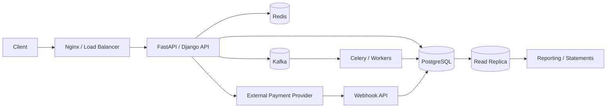
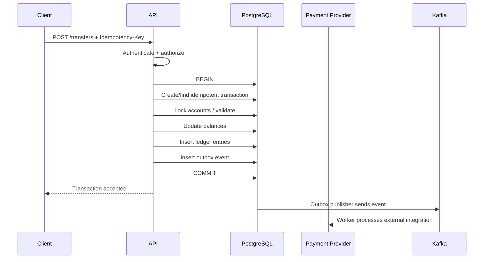
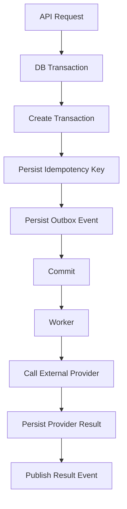
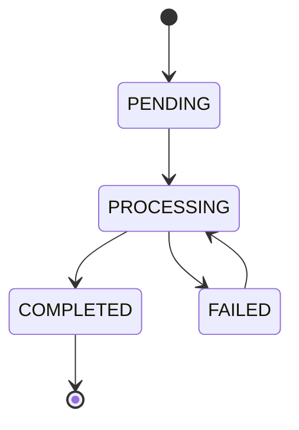
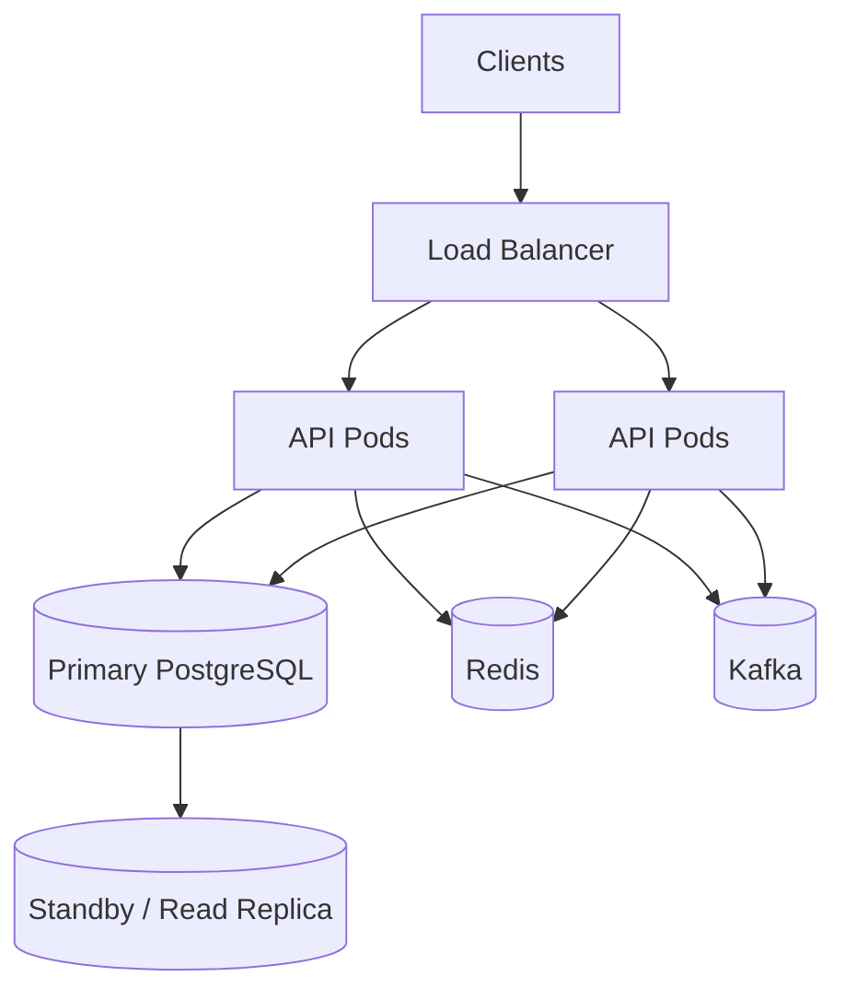

# 10- Backend Integration Patterns

## Overview

A banking transaction database rarely operates as an isolated PostgreSQL system. It sits behind APIs, background workers, authentication systems, payment providers, event pipelines, and reporting workloads.

A typical architecture is:



The most important integration principle is:

> PostgreSQL owns durable financial state; application services coordinate workflows around that state.

A backend integration should preserve:

- Atomic financial updates.
- Transaction boundaries.
- Idempotency.
- Authorization.
- Consistent error handling.
- Retry safety.
- Observability.
- Clear ownership of state.
- Controlled interaction with external systems.

---

## Backend and Database Responsibilities

A production banking system should separate responsibilities deliberately.

| Responsibility | PostgreSQL | Backend service |
|---|---|---|
| Account balance integrity | Yes | Coordinate |
| Foreign keys | Yes | — |
| Uniqueness | Yes | Validate for UX |
| Monetary persistence | Yes | Supply validated input |
| Transaction atomicity | Yes | Define boundary |
| Authentication | — | Yes |
| Authorization | Constraints/RLS where appropriate | Yes |
| External API calls | No | Yes |
| Kafka publishing | Outbox state | Yes |
| Redis caching | No | Yes |
| Business workflow orchestration | Limited | Yes |
| Audit persistence | Yes | Produce metadata |
| Idempotency constraint | Yes | Handle duplicate request |
| Retry orchestration | No | Yes |

Do not move database integrity rules entirely into Python.

For example:

```text
Python check:
    balance >= amount

Database invariant:
    UPDATE ... WHERE balance >= amount
```

The database must protect the invariant under concurrent requests.

---

## Request Lifecycle

A typical transfer request looks like:



The critical design decision is that the database transaction should not remain open while waiting for an external network call.

---

## API to PostgreSQL

REST and gRPC services typically translate application requests into parameterized SQL.

Example request:

```http
POST /v1/transfers
Idempotency-Key: 8f5e1d7a-...

Content-Type: application/json

{
  "source_account_id": 1001,
  "destination_account_id": 2001,
  "amount": "250.00",
  "currency": "USD"
}
```

The backend should:

1. Authenticate the caller.
2. Validate request structure.
3. Authorize the source account.
4. Start the database transaction.
5. Establish idempotency.
6. Validate and lock required state.
7. Update balances.
8. Insert transaction and ledger records.
9. Insert an outbox event.
10. Commit.
11. Return the durable transaction identifier.

The API should not treat the database transaction as an implementation detail. Its boundary directly affects correctness.

---

## Parameterized SQL

Always bind user-provided values.

Python example:

```python
cursor.execute(
    """
    SELECT id, status, balance
    FROM accounts
    WHERE id = %s
    """,
    [account_id],
)
```

Do not construct SQL with string interpolation:

```python
# Unsafe
query = f"SELECT * FROM accounts WHERE id = {account_id}"
```

Parameterized queries protect SQL values from injection.

They do not automatically make dynamic SQL identifiers safe. Table names, column names, and sort directions require separate validation or safe identifier composition.

---

## Django Integration

Django's ORM can manage transactions using:

```python
from django.db import transaction


@transaction.atomic
def create_transfer(...):
    ...
```

For critical row-level coordination:

```python
account = (
    Account.objects
    .select_for_update()
    .get(id=account_id)
)
```

The important principle is:

```text
atomic()
+
select_for_update()
+
database constraints
+
idempotency
```

rather than assuming that ORM methods automatically provide concurrency safety.

---

## FastAPI Integration

FastAPI commonly uses dependency injection for database sessions.

A transfer service should keep transaction boundaries explicit:

```python
def execute_transfer(session, request):
    with session.begin():
        source = (
            session.query(Account)
            .filter(Account.id == request.source_account_id)
            .with_for_update()
            .one()
        )

        destination = (
            session.query(Account)
            .filter(Account.id == request.destination_account_id)
            .with_for_update()
            .one()
        )

        # Validate and perform atomic financial changes.
```

The HTTP handler should primarily coordinate:

```text
request
→ validation
→ authorization
→ service
→ persistence
→ response
```

Avoid putting the entire financial workflow directly inside the route handler.

---

## Database Transaction Boundary

A financial operation should generally have a transaction boundary around all database changes that must commit together.

For a transfer:

```text
BEGIN
    ↓
create transaction
    ↓
update source account
    ↓
update destination account
    ↓
insert debit ledger entry
    ↓
insert credit ledger entry
    ↓
insert outbox event
    ↓
COMMIT
```

If any operation fails:

```text
ROLLBACK
```

This ensures that the database does not contain:

```text
source debited
destination not credited
```

or:

```text
ledger written
balance not updated
```

when those records are required to be atomic.

---

## Do Not Hold Transactions Across Network Calls

Avoid:

```python
with transaction.atomic():
    debit_account()

    payment_provider.charge()  # Bad boundary

    create_ledger_entry()
```

The external call can take seconds or fail unpredictably.

The database transaction remains open while:

```text
network latency
+
provider processing
+
timeouts
+
retries
```

occur.

This increases lock duration and database resource consumption.

Prefer:

```text
DB transaction
    ↓
durable state
    ↓
COMMIT
    ↓
external integration
```

with explicit state transitions and retry mechanisms.

---

## External Payment Provider Integration

Suppose the banking system integrates with an external payment provider.

Do not attempt:

```text
BEGIN
  update database
  call provider
  COMMIT
```

because PostgreSQL and the external provider do not share one atomic transaction.

Instead:



This is an eventual-consistency workflow with durable state transitions.

---

## Transactional Outbox

The transactional outbox pattern solves the problem:

```text
database commit succeeds
but
event publish fails
```

The transaction writes:

```sql
INSERT INTO outbox_events (
    event_type,
    aggregate_id,
    payload
)
VALUES (
    'TransferCreated',
    $1,
    $2
);
```

in the same transaction as the financial changes.

A publisher later reads the outbox:

```text
PostgreSQL
    ↓
outbox_events
    ↓
publisher
    ↓
Kafka
```

This prevents the application from depending on a distributed transaction between PostgreSQL and Kafka.

---

## Kafka Integration

Kafka should generally receive events after the corresponding database state is durable.

A common flow is:

```text
PostgreSQL transaction
        ↓
financial state + outbox event
        ↓
COMMIT
        ↓
outbox publisher
        ↓
Kafka
        ↓
consumers
```

Kafka consumers must assume duplicate delivery.

Therefore consumers should be idempotent.

For example:

```text
event_id = 12345
```

can be recorded in a durable consumer-side table or protected by another idempotency mechanism.

---

## Redis Integration

Redis is useful for non-authoritative or derived state such as:

- Rate limiting.
- Session state.
- Short-lived caches.
- Frequently accessed account metadata.
- Distributed coordination where appropriate.

Do not make Redis the sole source of truth for:

```text
account balance
ledger entries
financial transaction history
```

A cache invalidation flow may be:

```text
PostgreSQL commit
      ↓
event
      ↓
cache invalidation/update
      ↓
Redis
```

The database remains authoritative.

---

## Cache Consistency

A dangerous pattern is:

```text
UPDATE PostgreSQL
    ↓
UPDATE Redis
```

with no recovery mechanism.

If the process crashes between the two operations:

```text
PostgreSQL = new value
Redis = old value
```

A better architecture is to derive cache invalidation/update from durable events or use a cache-aside strategy where stale values have bounded impact.

Financial correctness should never depend on cache freshness.

---

## REST Integration

A REST API should expose durable identifiers and explicit states.

Example:

```json
{
  "transaction_id": "txn_01J...",
  "status": "PENDING",
  "amount": "250.00",
  "currency": "USD"
}
```

Avoid returning:

```text
"success": true
```

without a durable transaction identifier.

Clients may retry requests, network connections may fail, and asynchronous processing may continue after the HTTP response.

---

## Idempotent REST Requests

For mutation endpoints, support an idempotency key where duplicate requests are possible.

Example:

```http
POST /v1/transfers
Idempotency-Key: 7c9e...
```

The database should enforce uniqueness:

```sql
CREATE UNIQUE INDEX transactions_idempotency_uidx
ON transactions (
    initiated_by_customer_id,
    idempotency_key
)
WHERE idempotency_key IS NOT NULL;
```

The application can then safely distinguish:

```text
new request
vs
duplicate request
```

---

## Idempotency Response Strategy

A robust implementation stores enough information to reproduce the outcome of the original operation.

Conceptually:

```text
idempotency key
        ↓
existing transaction?
   ┌────┴────┐
  yes        no
   ↓          ↓
return      execute
stored      transaction
result          ↓
             store result
```

Do not simply respond:

```text
409 Conflict
```

for every duplicate if the API contract expects retries to return the original operation result.

The exact API behavior should be explicitly documented.

---

## gRPC Integration

gRPC services follow the same database principles as REST services.

For example:

```text
Transfer(request)
    ↓
authenticate
    ↓
authorize
    ↓
database transaction
    ↓
commit
    ↓
TransferResponse
```

gRPC does not provide distributed transaction semantics.

An RPC boundary between microservices should not be confused with a PostgreSQL transaction boundary.

---

## Microservice Database Ownership

A banking system may be split into services such as:

```text
Account Service
Transaction Service
Ledger Service
Payment Service
Notification Service
```

Avoid uncontrolled shared-table ownership.

A stronger model is:

```text
Service
    ↓
owns schema/data
    ↓
other services consume API/events
```

If multiple services directly mutate the same financial tables, ownership becomes unclear and schema changes become tightly coupled.

---

## Cross-Service Transactions

Avoid trying to make this atomic across services:

```text
Service A DB
    +
Service B DB
    +
Service C DB
```

Instead use:

```text
local transaction
+
durable event
+
idempotent consumer
+
state machine
+
compensation/reconciliation
```

For example:

```text
Transfer created
    ↓
PaymentRequested
    ↓
Payment processing
    ↓
PaymentSucceeded / PaymentFailed
    ↓
Transaction state transition
```

This is an application-level workflow rather than a single database transaction.

---

## Background Processing with Celery

Long-running work should generally execute asynchronously.

Examples:

- Statement generation.
- External payment processing.
- Reconciliation.
- Notifications.
- Outbox publishing.
- Large exports.

A Celery task should be idempotent:

```python
@app.task
def process_transaction(transaction_id):
    # Re-read durable state.
    # Check whether work has already completed.
    # Perform the next safe transition.
    ...
```

Do not rely on task delivery being exactly once.

---

## Worker Claiming

For database-backed work queues:

```sql
SELECT
    id
FROM transactions
WHERE status = 'PENDING'
ORDER BY created_at, id
FOR UPDATE SKIP LOCKED
LIMIT 100;
```

Multiple workers can process different rows concurrently.

The database transaction should atomically establish the worker's claim.

The worker should not hold database locks while making external calls.

---

## State Machines

Backend integrations become easier to reason about when transaction states are explicit.

Example:



A state transition should be conditional:

```sql
UPDATE transactions
SET status = 'PROCESSING',
    updated_at = now()
WHERE id = $1
  AND status = 'PENDING'
RETURNING id;
```

Only one concurrent worker should successfully transition the row.

---

## Webhook Integration

External providers often send webhooks.

Webhook flow:

```text
Provider
   ↓
Nginx / Load Balancer
   ↓
Webhook API
   ↓
Authenticate / verify signature
   ↓
Persist event
   ↓
Return quickly
   ↓
Background processing
```

Do not perform large financial workflows synchronously inside the webhook request when it can be avoided.

Persist the webhook event durably, acknowledge it appropriately, and process it asynchronously.

---

## Webhook Idempotency

Providers may retry webhooks.

Store the provider's event identifier:

```sql
CREATE UNIQUE INDEX provider_events_external_id_uidx
ON provider_events (provider, external_event_id);
```

Then:

```text
first delivery
    ↓
persist event
    ↓
process

duplicate delivery
    ↓
unique constraint
    ↓
recognize already received
```

This is essential because network failures can cause the provider to resend an event even after the original request was successfully processed.

---

## Error Mapping

Database errors should not leak raw PostgreSQL details to API clients.

Example mapping:

| Database/application condition | API response |
|---|---|
| Invalid request | `400 Bad Request` |
| Authentication failure | `401 Unauthorized` |
| Authorization failure | `403 Forbidden` |
| Resource not found | `404 Not Found` |
| Idempotency conflict | Contract-dependent |
| Insufficient funds | Domain-specific `4xx` |
| Serialization failure | Retry internally |
| Deadlock | Retry internally |
| Database unavailable | `5xx` |
| External provider unavailable | Usually `5xx` or durable `PENDING` state |

The application should log the underlying database error with correlation information while returning a safe client-facing response.

---

## Concurrency Error Handling

Transient PostgreSQL errors can include:

```text
40001 - serialization_failure
40P01 - deadlock_detected
```

A transaction retry should:

```text
rollback
    ↓
backoff
    ↓
rerun complete transaction
```

Do not retry only the final failed SQL statement.

The entire transaction must be repeated.

---

## Connection Pooling

API workers commonly use connection pools.

Architecture:

```text
Many API requests
       ↓
Application pool
       ↓
Limited PostgreSQL connections
       ↓
PostgreSQL
```

Too many database connections can reduce rather than improve performance.

Connection pool sizing should account for:

```text
API worker count
+
Celery worker count
+
other services
+
database capacity
```

The database is a shared constrained resource.

---

## PgBouncer

PgBouncer can reduce connection overhead by pooling PostgreSQL connections.

However, pooling mode matters.

Transaction pooling can make session-specific state unsafe across transactions.

Be cautious with:

```text
temporary tables
session variables
session-level prepared state
session-specific settings
```

When using request-specific database context, transaction-scoped configuration such as `SET LOCAL` is often safer.

---

## Nginx and Database Integration

Nginx should generally sit at the HTTP edge:

```text
Internet
   ↓
Nginx / Load Balancer
   ↓
FastAPI / Django
   ↓
PostgreSQL
```

Do not expose PostgreSQL directly to public clients.

The database should be reachable only from trusted application or administrative networks.

---

## Docker Integration

Local development can use Docker Compose:

```yaml
services:
  api:
    build: .
    depends_on:
      - postgres

  postgres:
    image: postgres:18
    environment:
      POSTGRES_DB: banking
      POSTGRES_USER: banking_app
      POSTGRES_PASSWORD: local-development-only
```

Production configuration should not reuse development credentials.

Secrets should be supplied through an appropriate secret-management mechanism.

---

## Kubernetes Integration

A Kubernetes deployment commonly looks like:

```text
Ingress
   ↓
Service
   ↓
API Pods
   ↓
Database
```

For managed PostgreSQL:

```text
Kubernetes
    ↓
Application
    ↓
AWS RDS / Aurora PostgreSQL
```

This is often preferable to running the primary production banking database as an ordinary application pod.

The database requires independent:

```text
backup
+
failover
+
storage
+
replication
+
maintenance
```

management.

---

## Configuration Management

Database configuration should come from environment or secret management rather than source code.

Example:

```python
import os

DATABASE_URL = os.environ["DATABASE_URL"]
```

Production deployments should use:

```text
AWS Secrets Manager
or
AWS Systems Manager Parameter Store
```

or an equivalent secret-management system.

Never commit:

```text
database passwords
API keys
provider credentials
private certificates
```

to Git.

---

## Observability

A backend integration should have a correlation path:

```text
request_id
    ↓
API logs
    ↓
transaction_id
    ↓
database records
    ↓
outbox event
    ↓
Kafka event
    ↓
worker logs
    ↓
provider request
```

Useful identifiers include:

```text
request_id
transaction_id
idempotency_key
event_id
provider_reference
```

Avoid logging sensitive financial information unnecessarily.

---

## Metrics

Monitor:

### API

```text
request rate
p50/p95/p99 latency
5xx rate
4xx rate
```

### PostgreSQL

```text
query latency
connections
locks
deadlocks
serialization failures
transaction duration
replication lag
```

### Workers

```text
queue depth
processing latency
retry rate
failure rate
```

### External Providers

```text
request latency
timeout rate
error rate
webhook delay
```

Correlating these metrics makes it possible to distinguish:

```text
database bottleneck
vs
application bottleneck
vs
provider bottleneck
```

---

## Security Boundaries

A banking integration should enforce security at multiple layers:

```text
Nginx / Load Balancer
        ↓
TLS
        ↓
Authentication
        ↓
Authorization
        ↓
Application validation
        ↓
Parameterized SQL
        ↓
Database permissions / RLS
        ↓
Encrypted storage
```

Defense in depth is important because no single layer should be trusted to prevent every class of failure.

---

## Database Roles

The application should use a database role with only the permissions it needs.

Avoid running the application as:

```text
postgres
```

or another administrative role.

Separate roles may be appropriate for:

```text
application
migration
read-only reporting
operations
```

The application should not have unnecessary capabilities such as arbitrary schema modification.

---

## Read vs Write Routing

A service can distinguish:

```text
write path
    ↓
primary

read-heavy path
    ↓
read replica
```

But financial workflows requiring read-after-write consistency should read from a consistency-safe source.

Do not route a just-created transaction to a replica and assume it is already visible.

---

## API Pagination

Transaction history endpoints should be bounded.

Prefer:

```text
GET /accounts/{id}/transactions?limit=50&cursor=...
```

over:

```text
GET /accounts/{id}/transactions
```

with an unlimited response.

Use keyset pagination for large datasets:

```sql
WHERE account_id = $1
  AND (created_at, id) < ($2, $3)
ORDER BY created_at DESC, id DESC
LIMIT 50;
```

This protects both the API and database from unbounded result sets.

---

## Batch Operations

For administrative or reconciliation workflows, process data in bounded batches.

Avoid:

```python
transactions = list(Transaction.objects.all())
```

for a table containing millions of records.

Prefer:

```text
keyset pagination
+
bounded batch size
+
checkpoint/progress
+
idempotent processing
```

The batch size should be tuned based on workload rather than using a universal number.

---

## Timeouts

Set appropriate timeouts at multiple layers:

```text
Nginx / Load Balancer
        ↓
API server
        ↓
database statement
        ↓
database lock wait
        ↓
external provider
```

A database operation waiting indefinitely can exhaust application connection pools.

Use:

```text
statement_timeout
lock_timeout
```

where appropriate.

For idle transactions, consider:

```text
idle_in_transaction_session_timeout
```

These settings solve different failure modes and should not be treated interchangeably.

---

## Deployment and Migrations

Database changes should be compatible with rolling deployments.

Prefer:

```text
expand
    ↓
deploy compatible application
    ↓
backfill
    ↓
switch application behavior
    ↓
contract
```

For example:

```text
old application
      ↓
new nullable column
      ↓
deploy code writing both
      ↓
backfill
      ↓
deploy code reading new column
      ↓
enforce constraint
```

Avoid migrations that require every application pod to stop simultaneously.

---

## CI/CD Database Checks

CI should validate:

- Migration correctness.
- Schema constraints.
- Index creation.
- Query behavior.
- Transaction semantics.
- Idempotency.
- Concurrency scenarios.
- Rollback behavior where applicable.

Production deployments should treat database migrations as first-class deployment artifacts.

---

## Testing Integration Patterns

Unit tests should validate service logic.

Integration tests should validate:

```text
Python
+
ORM/driver
+
PostgreSQL
```

Concurrency tests should validate:

```text
two withdrawals
two transfers
duplicate idempotency requests
concurrent state transitions
worker contention
deadlock/retry behavior
```

Use a real PostgreSQL environment for database concurrency behavior rather than relying entirely on mocks or SQLite.

---

## Failure Scenario: API Timeout

Consider:

```text
Client
  ↓
API
  ↓
PostgreSQL COMMIT
  ↓
network failure
  ↓
client sees timeout
```

The client may retry.

The retry must not create a duplicate financial operation.

This is why:

```text
idempotency key
+
durable transaction ID
+
database uniqueness
```

are essential.

---

## Failure Scenario: Database Commit Succeeds, Kafka Fails

Without an outbox:

```text
DB COMMIT ✓
Kafka publish ✗
```

The financial operation exists, but downstream consumers never receive the event.

With an outbox:

```text
DB transaction
    ├── financial state
    └── outbox event
          ↓
       COMMIT
          ↓
    publisher retry
          ↓
        Kafka
```

The event remains durable until successfully published.

---

## Failure Scenario: Provider Times Out

Suppose:

```text
API → Provider
```

times out.

The provider may have:

```text
processed the request
```

even though the API did not receive a response.

Therefore:

```text
timeout
≠
operation definitely failed
```

Use:

```text
provider idempotency
+
durable external reference
+
webhooks
+
reconciliation
```

to resolve ambiguous outcomes.

---

## Failure Scenario: Worker Crashes

Suppose a worker:

```text
claims transaction
    ↓
calls provider
    ↓
process crashes
```

The system must be able to determine whether the provider operation completed.

Do not rely exclusively on:

```text
in-memory worker state
```

Persist workflow state and use provider idempotency/reconciliation where available.

---

## High Availability

The production architecture should avoid making the API directly responsible for database availability.

A typical AWS-oriented architecture is:



The database layer should have:

```text
automated backups
+
replication
+
failover strategy
+
monitoring
+
tested recovery
```

Application retry behavior must also be compatible with database failover.

---

## Disaster Recovery

Backend integration design should account for:

```text
database outage
+
application outage
+
Kafka outage
+
Redis outage
+
provider outage
```

The system should distinguish which components are:

```text
source of truth
vs
recoverable derived state
```

For example:

| Component | Recovery role |
|---|---|
| PostgreSQL | Primary financial source of truth |
| Redis | Rebuildable cache |
| Kafka | Durable event stream, depending on retention/configuration |
| Outbox | Durable bridge from DB to events |
| Celery queue | Recoverable asynchronous work |
| Provider | External source requiring reconciliation |

---

## Cost Considerations

Every integration introduces operational cost.

Examples:

```text
more API replicas
→ more database connections

more indexes
→ more storage and write cost

more Kafka consumers
→ more infrastructure

more Redis capacity
→ more cache cost

more replicas
→ more database cost
```

Optimize the complete architecture rather than optimizing a single component in isolation.

---

## Common Mistakes

### Calling External Services Inside Database Transactions

This increases transaction duration and lock contention.

Use durable state + asynchronous processing instead.

---

### Assuming Kafka Is Exactly Once

Design consumers to tolerate duplicate delivery.

Use idempotent processing.

---

### Treating Redis as the Financial Source of Truth

Redis is normally a cache or coordination mechanism, not the authoritative ledger.

---

### Relying Only on Application-Level Idempotency

Two application instances can race.

Use database uniqueness to enforce the invariant.

---

### Using One Giant Transaction for a Workflow

A transaction should cover the database state that must change atomically.

It should not span:

```text
HTTP requests
+
Kafka processing
+
external APIs
+
long-running jobs
```

---

### Returning Before Durable State Exists

If the API returns:

```text
transfer successful
```

before durable state is committed, a process failure can produce an incorrect client response.

Persist the authoritative state first.

---

### Logging Sensitive Financial Data

Do not indiscriminately log:

```text
account numbers
balances
authentication secrets
provider credentials
full payment details
```

Use structured logs with carefully selected identifiers.

---

### Sharing Database Tables Across Services Without Ownership

This creates hidden coupling and makes migrations dangerous.

Define ownership boundaries explicitly.

---

## Interview Traps

### "Should the API Call Kafka Before Committing the Database Transaction?"

Usually no.

If Kafka succeeds and the database transaction later rolls back, consumers can observe an event for state that does not exist.

The transactional outbox pattern is a common solution.

---

### "Can PostgreSQL and an External Payment Provider Share One Transaction?"

Not through a normal PostgreSQL transaction.

They are separate systems.

Use idempotency, durable state, asynchronous processing, webhooks, and reconciliation.

---

### "Why Use an Outbox If Kafka Is Reliable?"

Kafka reliability does not solve the atomicity gap between:

```text
database commit
```

and:

```text
event publication
```

The outbox makes the event part of the database transaction.

---

### "Why Isn't Redis Suitable for Account Balances?"

Because Redis does not normally provide the same durable relational source-of-truth guarantees required for the banking ledger architecture.

It can cache derived information, but PostgreSQL should own the authoritative financial state in this design.

---

### "Why Do Workers Need Idempotency?"

Because workers can be retried, duplicated, interrupted, or restarted.

Exactly-once execution should not be assumed at the application level.

---

## Senior Integration Checklist

### Database

- [ ] PostgreSQL owns authoritative financial state.
- [ ] Transactions have explicit boundaries.
- [ ] Constraints enforce invariants.
- [ ] Queries are parameterized.
- [ ] Indexes support production access patterns.
- [ ] Isolation and locking match the business invariant.

### APIs

- [ ] Authentication is enforced.
- [ ] Authorization is enforced.
- [ ] Mutation endpoints support idempotency where required.
- [ ] Responses expose durable transaction identifiers.
- [ ] Pagination is bounded.
- [ ] Errors are mapped safely.

### External Services

- [ ] Network calls occur outside critical DB transactions.
- [ ] Provider idempotency is used where available.
- [ ] Provider references are persisted.
- [ ] Webhooks are authenticated and deduplicated.
- [ ] Ambiguous outcomes have reconciliation paths.

### Events

- [ ] Transactional outbox is used where database changes must generate events.
- [ ] Consumers are idempotent.
- [ ] Event identifiers are durable.
- [ ] Kafka outages do not corrupt financial state.

### Workers

- [ ] Work is bounded and retryable.
- [ ] Claims are concurrency-safe.
- [ ] `SKIP LOCKED` is used where appropriate.
- [ ] Workers do not hold DB locks during external calls.
- [ ] Failed work has a recovery path.

### Operations

- [ ] Correlation IDs exist.
- [ ] Transaction IDs are traceable.
- [ ] Database and worker metrics are monitored.
- [ ] Lock waits and deadlocks are monitored.
- [ ] Database failover is tested.
- [ ] Backups and restore procedures are tested.

---

## Senior Design Pattern

A robust banking backend typically follows this architecture:

```text
                    ┌───────────────┐
                    │ Client        │
                    └───────┬───────┘
                            ↓
                    ┌───────────────┐
                    │ API           │
                    │ Auth + AuthZ  │
                    └───────┬───────┘
                            ↓
                    ┌───────────────┐
                    │ Service Layer │
                    └───────┬───────┘
                            ↓
                 ┌──────────────────────┐
                 │ PostgreSQL Transaction│
                 │                      │
                 │ Financial state      │
                 │ Ledger entries       │
                 │ Idempotency          │
                 │ Outbox               │
                 └──────────┬───────────┘
                            ↓ COMMIT
                 ┌──────────────────────┐
                 │ Async Processing      │
                 │                      │
                 │ Kafka / Celery       │
                 │ External providers   │
                 │ Notifications        │
                 └──────────────────────┘
```

The architectural boundary is:

```text
PostgreSQL
    ↓
durable source of truth

Kafka / Celery
    ↓
asynchronous propagation

Redis
    ↓
cache / coordination

External providers
    ↓
untrusted external dependencies
```

This separation makes failure handling explicit.

---

## Key Takeaways

- **Keep authoritative financial state and atomic invariants in PostgreSQL; use application services to coordinate workflows around that state.**
- **Never hold critical database transactions open across external network calls; use durable state, transactional outbox, asynchronous workers, and explicit state machines instead.**
- **Design REST/gRPC, Kafka, Celery, Redis, and webhook integrations for retries, duplicates, timeouts, and ambiguous outcomes rather than assuming exactly-once behavior.**
- **Idempotency, database constraints, correlation identifiers, and reconciliation are essential integration primitives for reliable banking workflows.**
- **Treat database ownership, connection pooling, observability, HA/DR, migrations, and failure recovery as part of the backend integration design—not as operational afterthoughts.**