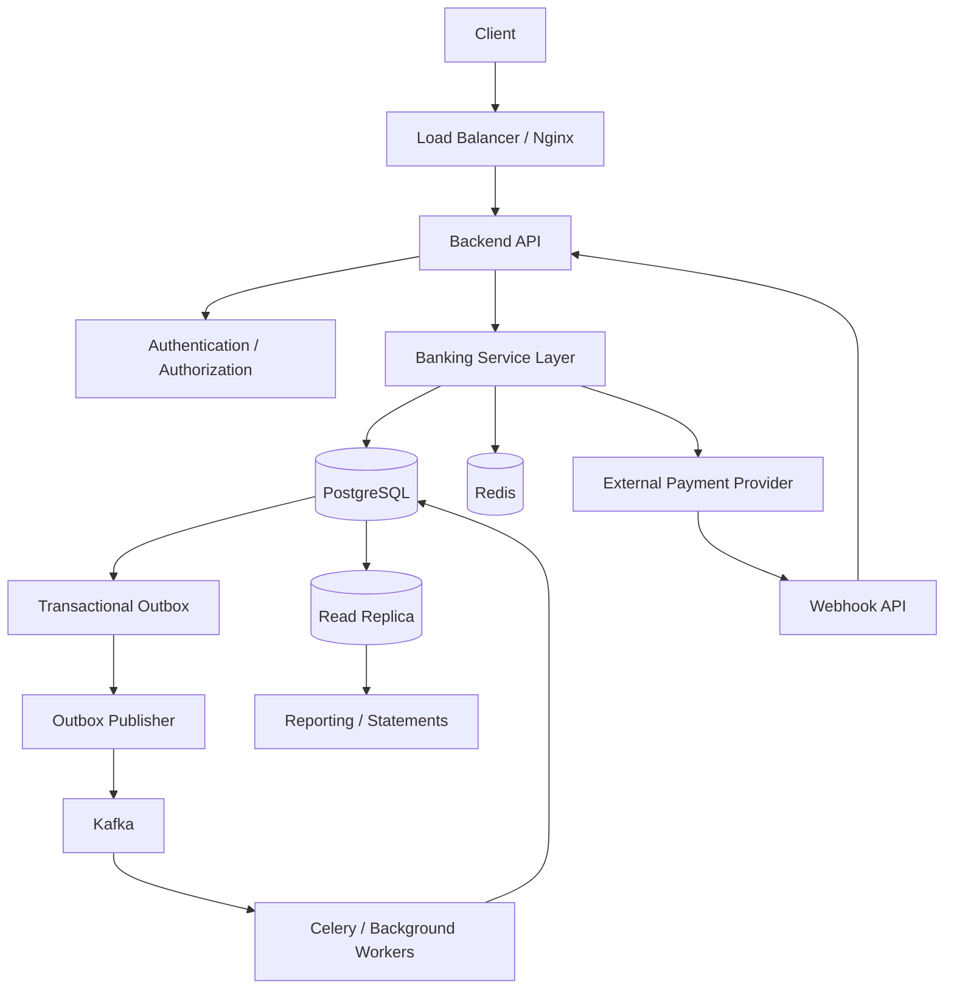
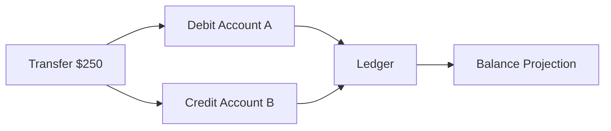

# README

## Overview

This project is a production-oriented **Banking Transaction Database** designed to strengthen SQL, PostgreSQL, backend integration, transaction management, concurrency control, and financial data modeling skills.

The project is intentionally structured around realistic banking workflows rather than isolated SQL exercises.

The core architecture is:

```text
Client
  ↓
REST / gRPC API
  ↓
Backend Service
  ↓
PostgreSQL
  ├── Customers
  ├── Accounts
  ├── Transactions
  ├── Ledger Entries
  ├── Idempotency
  ├── Audit / History
  └── Outbox
        ↓
   Kafka / Workers
        ↓
External Systems
```

The database is the authoritative source of truth for durable financial state.

Application services coordinate workflows, while PostgreSQL provides:

- Referential integrity.
- Transaction atomicity.
- Concurrency control.
- Financial state persistence.
- Uniqueness guarantees.
- Query execution.
- Durable outbox state.

The project progresses from schema design and CRUD through concurrency, isolation, indexing, and backend integration.

## Navigation

- [01- Requirements](./01-%20Requirements.md) — Banking system scope, compliance requirements, and data modeling goals
- [02- Schema Design](./02-%20Schema%20Design.md) — Account, customer, and transaction relational schema design
- [03- Accounts and Customers](./03-%20Accounts%20and%20Customers.md) — Account types, customer records, and relationship modeling
- [04- Transaction Modeling](./04-%20Transaction%20Modeling.md) — Financial transaction design and double-entry ledger patterns
- [05- Transaction Queries](./05-%20Transaction%20Queries.md) — Querying transaction history, balances, and ledger entries
- [06- Concurrency Scenarios](./06-%20Concurrency%20Scenarios.md) — Concurrent deposit, withdrawal, and transfer safety
- [07- Locking Scenarios](./07-%20Locking%20Scenarios.md) — Row-level locking strategies and deadlock prevention
- [08- Isolation Level Scenarios](./08-%20Isolation%20Level%20Scenarios.md) — Isolation level selection for financial correctness
- [09- Indexing Strategy](./09-%20Indexing%20Strategy.md) — Index design for transaction queries and account lookups
- [10- Backend Integration Patterns](./10-%20Backend%20Integration%20Patterns.md) — Django and FastAPI integration patterns for banking operations

---

## Project Goals

The project is intended to develop practical understanding of:

- Relational banking data modeling.
- PostgreSQL schema design.
- SQL query construction.
- Transaction boundaries.
- ACID behavior.
- Isolation levels.
- Row-level locking.
- Concurrent financial operations.
- Idempotency.
- Double-entry ledger modeling.
- Indexing strategy.
- Query optimization.
- REST and gRPC integration.
- Kafka and transactional outbox patterns.
- Redis integration.
- Celery/background processing.
- Production reliability.
- High availability and disaster recovery.
- Security and authorization.

The emphasis is on understanding **why a design works under concurrency and failure**, not merely memorizing SQL syntax.

---

## Project Architecture



The architecture separates responsibilities:

| Component | Primary responsibility |
|---|---|
| PostgreSQL | Authoritative financial state |
| Backend API | Request handling and orchestration |
| Redis | Cache, rate limiting, short-lived coordination |
| Kafka | Durable asynchronous event propagation |
| Celery | Background processing |
| External providers | External payment/integration systems |
| Read replica | Read-heavy workloads where consistency permits |
| Nginx / Load Balancer | HTTP traffic distribution and edge handling |

---

## Project Document Map

### Foundation and Data Model

| File | Focus |
|---|---|
| `01- Requirements.md` | Functional, non-functional, reliability, security, and acceptance requirements |
| `02- Schema Design.md` | Core banking relational schema and database integrity |
| `03- Accounts and Customers.md` | Customer/account modeling and account lifecycle |
| `04- Transaction Modeling.md` | Transaction, ledger, idempotency, and financial state modeling |

### SQL and Database Operations

| File | Focus |
|---|---|
| `05- Transaction Queries.md` | Transaction creation, retrieval, updates, reconciliation, and operational queries |
| `06- Concurrency Scenarios.md` | Concurrent withdrawals, transfers, state transitions, and race conditions |
| `07- Locking Scenarios.md` | `FOR UPDATE`, lock ordering, `SKIP LOCKED`, deadlocks, and lock management |
| `08- Isolation Level Scenarios.md` | `READ COMMITTED`, `REPEATABLE READ`, `SERIALIZABLE`, and practical isolation decisions |
| `09- Indexing Strategy.md` | Banking query patterns, composite indexes, partial indexes, pagination, and index operations |
| `10- Backend Integration Patterns.md` | Django/FastAPI, REST/gRPC, Redis, Kafka, Celery, outbox, webhooks, and external providers |

---

## Recommended Learning Sequence

Follow the documents in order:

```text
Requirements
    ↓
Schema Design
    ↓
Accounts and Customers
    ↓
Transaction Modeling
    ↓
Transaction Queries
    ↓
Concurrency
    ↓
Locking
    ↓
Isolation
    ↓
Indexing
    ↓
Backend Integration
```

The sequence is deliberate.

You should understand the data model before writing complex queries, and understand concurrency before deciding how transactions and locks should work.

---

## Domain Model

The core banking model revolves around:

```text
Customer
   │
   └── Account
          │
          ├── Transactions
          │
          └── Ledger Entries
```

A transaction represents a business-level financial operation.

A database transaction represents an atomic PostgreSQL execution boundary.

These are different concepts.

```text
Banking Transaction
    ↓
business operation

Database Transaction
    ↓
atomic persistence boundary
```

Keeping these concepts separate is essential when designing APIs and concurrency workflows.

---

## Double-Entry Ledger

The financial model follows the double-entry principle.

A transfer such as:

```text
Account A → Account B
$250
```

produces corresponding ledger entries:

```text
Account A
    DEBIT  $250

Account B
    CREDIT $250
```

The entries belong to one database transaction.

Conceptually:



This provides an auditable financial history and allows reconciliation between transaction records, ledger entries, and account balances.

---

## Data Integrity Principles

The database should enforce invariants wherever possible.

Examples include:

```text
PRIMARY KEY
FOREIGN KEY
UNIQUE
CHECK
NOT NULL
```

Application validation remains useful for user-facing errors, but it should not be the only protection for financial invariants.

For example:

```sql
UPDATE accounts
SET balance = balance - $1
WHERE id = $2
  AND balance >= $1
RETURNING id, balance;
```

The condition is evaluated atomically by PostgreSQL.

---

## Transaction Design

A typical transfer transaction is:

```text
BEGIN
    ↓
Validate / establish idempotency
    ↓
Lock required accounts
    ↓
Validate state
    ↓
Create transaction record
    ↓
Update balances
    ↓
Insert debit ledger entry
    ↓
Insert credit ledger entry
    ↓
Insert outbox event
    ↓
COMMIT
```

If a required operation fails:

```text
ROLLBACK
```

The financial state should not be partially committed.

---

## Concurrency Model

Banking systems are inherently concurrent.

Examples:

```text
Request A ── withdraw $500
Request B ── withdraw $500
Request C ── transfer $200
Request D ── close account
Worker E ── process pending transaction
```

These operations may target the same rows simultaneously.

The project therefore covers:

- Lost updates.
- Double spending.
- Row-level locks.
- Conditional updates.
- Lock ordering.
- Deadlocks.
- Serialization failures.
- Worker contention.
- Idempotency races.
- Account lifecycle races.

---

## Locking Strategy

Use the least expensive mechanism that correctly protects the invariant.

A common hierarchy is:

```text
Database constraint
        ↓
Atomic SQL statement
        ↓
Targeted row lock
        ↓
Appropriate transaction isolation
        ↓
SERIALIZABLE when justified
```

For multi-row operations, acquire locks in deterministic order.

For example:

```sql
SELECT
    id,
    balance
FROM accounts
WHERE id IN ($1, $2)
ORDER BY id
FOR UPDATE;
```

Deterministic ordering reduces deadlock risk.

---

## Isolation Strategy

PostgreSQL provides:

```text
READ COMMITTED
REPEATABLE READ
SERIALIZABLE
```

The project treats isolation as a business requirement rather than a setting that should automatically be maximized.

Typical starting points:

| Scenario | Typical approach |
|---|---|
| Atomic balance update | `READ COMMITTED` |
| Account validation + mutation | `READ COMMITTED` + `FOR UPDATE` |
| Multi-account transfer | `READ COMMITTED` + ordered locks |
| Consistent multi-query snapshot | `REPEATABLE READ` |
| Complex serializable invariant | `SERIALIZABLE` |
| Worker queue | `READ COMMITTED` + `SKIP LOCKED` |

Stronger isolation can introduce additional transaction aborts and retry requirements.

---

## Idempotency

Financial APIs must handle duplicate requests safely.

Example:

```http
POST /v1/transfers
Idempotency-Key: 7c9e...
```

The database can enforce uniqueness:

```sql
CREATE UNIQUE INDEX transactions_idempotency_uidx
ON transactions (
    initiated_by_customer_id,
    idempotency_key
)
WHERE idempotency_key IS NOT NULL;
```

This protects against races between multiple API instances.

The application should persist enough information to return the original operation outcome when an idempotent request is repeated.

---

## Error and Retry Model

Transient concurrency errors may include:

```text
40001 - serialization_failure
40P01 - deadlock_detected
```

The correct pattern is:

```text
Transaction fails
      ↓
ROLLBACK
      ↓
Backoff
      ↓
Retry complete transaction
```

Do not retry only the failed SQL statement.

The complete transaction must be rerun.

Business failures such as:

```text
insufficient funds
account closed
invalid currency
```

should not be blindly retried.

---

## Unknown Commit Outcome

A particularly important production scenario is:

```text
COMMIT sent
    ↓
database commits
    ↓
network failure
    ↓
application sees timeout/error
```

The application cannot automatically assume:

```text
transaction failed
```

The system therefore needs:

```text
idempotency
+
durable transaction identifiers
+
provider references
+
reconciliation
```

This is one of the most important reliability concepts in financial backend systems.

---

## Backend Integration

The backend service should separate:

```text
HTTP / gRPC transport
        ↓
authentication
        ↓
authorization
        ↓
service/domain logic
        ↓
database transaction
```

The API should not directly expose arbitrary SQL behavior.

A typical transfer endpoint is:

```text
POST /v1/transfers
        ↓
validate request
        ↓
authorize source account
        ↓
execute transactional service
        ↓
commit
        ↓
return transaction_id
```

The response should expose a durable identifier rather than only:

```json
{
  "success": true
}
```

---

## REST and gRPC

Both REST and gRPC can use the same service-layer transaction logic.

```text
REST Handler ──┐
               ├──> Transfer Service ──> PostgreSQL
gRPC Handler ──┘
```

This prevents transport-specific business logic from becoming duplicated.

The service layer should own:

- Transaction boundaries.
- Concurrency behavior.
- Idempotency.
- Financial validation.
- State transitions.

---

## Django Integration

Django provides transaction management and row locking through the ORM.

Example:

```python
from django.db import transaction


@transaction.atomic
def execute_transfer(source_id, destination_id, amount):
    source = (
        Account.objects
        .select_for_update()
        .get(id=source_id)
    )

    destination = (
        Account.objects
        .select_for_update()
        .get(id=destination_id)
    )

    # Validate and apply the transfer.
```

For high-value operations, the ORM-generated SQL should still be understood and inspected.

The ORM is an abstraction over PostgreSQL, not a replacement for database knowledge.

---

## FastAPI Integration

FastAPI commonly delegates database operations to a service layer.

```text
FastAPI route
    ↓
Pydantic validation
    ↓
authorization
    ↓
transfer service
    ↓
SQLAlchemy / PostgreSQL
```

The route should not contain extensive locking and financial logic.

This keeps the database behavior testable independently of HTTP.

---

## Transactional Outbox

A banking transaction may need to generate an event:

```text
TransferCompleted
```

The database transaction should persist both:

```text
financial state
+
outbox event
```

atomically.

```text
PostgreSQL transaction
        ├── update account
        ├── write ledger
        └── write outbox
                ↓
             COMMIT
                ↓
         outbox publisher
                ↓
              Kafka
```

This avoids the database/Kafka dual-write problem.

---

## Kafka Integration

Kafka should generally receive events from durable state rather than being treated as part of the PostgreSQL transaction.

Consumers should be idempotent because duplicate event processing can occur.

Typical architecture:

```text
PostgreSQL
    ↓
Outbox
    ↓
Publisher
    ↓
Kafka
    ↓
Consumers
```

The event should contain a stable identifier such as:

```text
event_id
transaction_id
aggregate_id
event_type
occurred_at
```

---

## Redis Integration

Redis can support:

- Rate limiting.
- Caching.
- Session data.
- Short-lived coordination.
- Derived account metadata.

It should not normally become the authoritative source for:

```text
balances
ledger entries
transaction history
```

A cache failure should not corrupt financial state.

---

## Celery and Background Workers

Use background workers for:

- Reconciliation.
- Statement generation.
- External payment processing.
- Outbox publishing.
- Notifications.
- Large exports.

Workers should be:

```text
idempotent
+
retryable
+
bounded
+
observable
```

Database-backed workers can use:

```sql
FOR UPDATE SKIP LOCKED
```

to process independent work concurrently.

---

## Webhooks

External providers may retry webhooks.

A webhook handler should:

```text
verify provider signature
        ↓
validate event
        ↓
persist event
        ↓
deduplicate
        ↓
return quickly
        ↓
process asynchronously
```

Provider event identifiers should be protected by a uniqueness constraint when appropriate.

---

## External Payment Providers

Never assume an external API call is atomic with PostgreSQL.

Avoid:

```text
BEGIN
    debit database
    call provider
    commit
```

Instead:

```text
persist durable state
        ↓
commit
        ↓
async provider call
        ↓
persist result
        ↓
reconcile ambiguous outcomes
```

Provider idempotency keys, webhooks, and reconciliation are critical when network failures make the outcome uncertain.

---

## Indexing Strategy

Indexes are designed around actual access patterns.

Important banking queries commonly require indexes for:

```text
account lookup
transaction history
ledger history
idempotency
external provider references
pending workers
reconciliation
tenant/account filtering
```

Example:

```sql
CREATE INDEX ledger_entries_account_created_idx
ON ledger_entries (
    account_id,
    created_at DESC,
    id DESC
);
```

This supports efficient keyset pagination:

```sql
SELECT
    id,
    transaction_id,
    amount,
    currency,
    created_at
FROM ledger_entries
WHERE account_id = $1
  AND (created_at, id) < ($2, $3)
ORDER BY created_at DESC, id DESC
LIMIT 50;
```

---

## Query Performance

Optimization should begin with the real query and execution plan.

Use:

```sql
EXPLAIN (ANALYZE, BUFFERS)
SELECT
    id,
    amount,
    created_at
FROM ledger_entries
WHERE account_id = $1
ORDER BY created_at DESC, id DESC
LIMIT 50;
```

Evaluate:

- Estimated vs actual rows.
- Scan type.
- Sort operations.
- Buffer reads.
- Buffer hits.
- Execution time.
- Rows filtered.
- Join strategy.

An index is an available access path, not a guarantee that PostgreSQL will use it.

---

## Pagination

Financial transaction history must be bounded.

Prefer:

```text
limit + cursor
```

over unrestricted queries or deep offsets.

Keyset pagination:

```sql
WHERE account_id = $1
  AND (created_at, id) < ($2, $3)
ORDER BY created_at DESC, id DESC
LIMIT 50;
```

The ordering must be deterministic.

The unique or tie-breaking component such as `id` prevents ambiguous page boundaries.

---

## Security

Security is enforced across multiple layers:

```text
TLS
 ↓
Authentication
 ↓
Authorization
 ↓
Input validation
 ↓
Parameterized SQL
 ↓
Database permissions / RLS
 ↓
Encrypted storage
```

Important principles include:

- Never construct SQL from untrusted strings.
- Do not expose account data without authorization.
- Enforce tenant boundaries.
- Use least-privileged database roles.
- Do not log sensitive financial information unnecessarily.
- Protect secrets through proper secret management.
- Treat Redis and Kafka as infrastructure dependencies, not authorization boundaries.

---

## Multi-Tenancy

If the database supports multiple tenants, queries should include the tenant boundary:

```sql
SELECT
    id,
    amount,
    created_at
FROM transactions
WHERE tenant_id = $1
  AND account_id = $2
ORDER BY created_at DESC, id DESC
LIMIT 50;
```

Indexes should reflect the actual access pattern:

```sql
CREATE INDEX transactions_tenant_account_created_idx
ON transactions (
    tenant_id,
    account_id,
    created_at DESC,
    id DESC
);
```

Authorization must still be enforced separately.

---

## Observability

A production transaction should be traceable across system boundaries.

Useful identifiers include:

```text
request_id
transaction_id
idempotency_key
event_id
provider_reference
```

A useful trace is:

```text
HTTP request
    ↓
transaction_id
    ↓
PostgreSQL transaction
    ↓
outbox event
    ↓
Kafka event
    ↓
Celery worker
    ↓
external provider
```

Monitor:

### API

```text
request rate
p95/p99 latency
4xx
5xx
```

### PostgreSQL

```text
query latency
connections
locks
deadlocks
serialization failures
long transactions
replication lag
```

### Workers

```text
queue depth
processing latency
retry rate
failure rate
```

### External providers

```text
latency
timeouts
errors
webhook delay
```

---

## High Availability

A production deployment should avoid making the application responsible for manually managing primary database failover.

A typical architecture is:

```text
                ┌── API Pod
Client → LB ────┼── API Pod
                └── API Pod
                     │
                     ↓
                PostgreSQL
                 Primary
                    │
                    ↓
               Standby/Replica
```

The database platform should provide appropriate:

- Replication.
- Backups.
- Failover.
- Monitoring.
- Storage durability.

Application retry behavior must account for failover and ambiguous transaction outcomes.

---

## Disaster Recovery

Recovery testing should validate more than whether the database starts.

A useful DR process is:

```text
Restore
   ↓
Validate schema
   ↓
Validate constraints
   ↓
Validate indexes
   ↓
Validate transaction state
   ↓
Validate outbox
   ↓
Run representative queries
   ↓
Validate application connectivity
```

Define and test:

```text
RPO
RTO
```

for the banking workload.

---

## AWS Deployment Considerations

A practical AWS architecture can use:

```text
Application Load Balancer
        ↓
ECS / EKS / EC2 application tier
        ↓
RDS PostgreSQL / Aurora PostgreSQL-Compatible
```

Supporting services may include:

```text
ElastiCache / Redis
Kafka-compatible messaging
Secrets Manager
CloudWatch
S3
```

The exact technology should depend on operational requirements and existing platform standards.

Managed PostgreSQL can simplify:

- Backups.
- Replication.
- Patching.
- Failover.
- Monitoring.

It does not remove the need for correct transaction and query design.

---

## CI/CD and Migrations

Database changes should support rolling deployments.

Prefer an expand/contract strategy:

```text
Add compatible schema
        ↓
Deploy compatible application
        ↓
Backfill
        ↓
Switch reads/writes
        ↓
Enforce final constraint
        ↓
Remove obsolete schema
```

For large production indexes, consider:

```sql
CREATE INDEX CONCURRENTLY ...
```

where appropriate.

Remember that concurrent index creation has transaction restrictions and can leave an invalid index after certain failures.

---

## Testing Strategy

The project should test at multiple levels.

### Unit Tests

Validate:

```text
service logic
validation
state transitions
error mapping
```

### Integration Tests

Validate:

```text
Python
+
ORM/driver
+
PostgreSQL
```

### Concurrency Tests

Validate:

```text
concurrent withdrawals
concurrent transfers
duplicate requests
state transition races
worker contention
deadlock handling
serialization retries
```

### Failure Tests

Validate:

```text
database timeout
provider timeout
Kafka failure
worker crash
network interruption
unknown commit outcome
```

For PostgreSQL-specific concurrency behavior, use PostgreSQL rather than relying entirely on SQLite or mocks.

---

## Production Anti-Patterns

Avoid:

```text
SELECT *
```

for API responses when only a small projection is needed.

Avoid:

```text
OFFSET 500000
```

for large transaction histories.

Avoid:

```text
check balance in Python
then update
```

without an atomic database invariant.

Avoid:

```text
database transaction
+
external HTTP call
```

in the same critical transaction.

Avoid:

```text
PostgreSQL
+
Kafka
```

as two independent writes without an outbox or equivalent reliability mechanism.

Avoid treating:

```text
Redis
```

as the financial source of truth.

Avoid running application queries with administrative database privileges.

---

## Production Review Checklist

Before considering a banking workflow production-ready:

### Data Integrity

- [ ] Primary keys exist.
- [ ] Foreign keys protect relationships.
- [ ] Uniqueness is enforced by the database.
- [ ] Financial invariants are protected.
- [ ] Monetary values use appropriate exact numeric representation.
- [ ] Ledger entries are durable and auditable.

### Transactions

- [ ] Transaction boundaries are explicit.
- [ ] Critical state changes commit atomically.
- [ ] Transactions are short.
- [ ] External calls do not unnecessarily hold DB locks.
- [ ] Retryable transaction failures are handled.

### Concurrency

- [ ] Lost updates are prevented.
- [ ] Double spending is prevented.
- [ ] Lock ordering is deterministic.
- [ ] Deadlocks are handled.
- [ ] Serialization failures are handled.
- [ ] Worker races are safe.

### API

- [ ] Authentication is enforced.
- [ ] Authorization is enforced.
- [ ] Idempotency is supported for appropriate mutations.
- [ ] Responses expose durable transaction identifiers.
- [ ] Pagination is bounded.
- [ ] Errors do not leak database internals.

### Performance

- [ ] Critical queries have appropriate indexes.
- [ ] Execution plans have been inspected.
- [ ] Large result sets are bounded.
- [ ] Keyset pagination is used where appropriate.
- [ ] N+1 queries are avoided.
- [ ] Index write costs are understood.

### Integration

- [ ] Outbox is used for critical DB-to-event publication.
- [ ] Kafka consumers are idempotent.
- [ ] Webhooks are deduplicated.
- [ ] External provider timeouts are handled.
- [ ] Reconciliation exists for ambiguous outcomes.
- [ ] Redis failure does not corrupt financial state.

### Operations

- [ ] Structured logs exist.
- [ ] Correlation IDs exist.
- [ ] Transaction IDs are traceable.
- [ ] Database latency is monitored.
- [ ] Lock waits are monitored.
- [ ] Deadlocks and serialization failures are monitored.
- [ ] Backups are tested.
- [ ] Failover is tested.
- [ ] Recovery procedures are documented.

---

## Senior Engineering Perspective

The project should ultimately demonstrate the ability to reason across the complete request lifecycle:

```text
Client
  ↓
API Gateway / Nginx
  ↓
Authentication
  ↓
Authorization
  ↓
Service Layer
  ↓
PostgreSQL Transaction
  ├── Constraints
  ├── Locks
  ├── Isolation
  ├── Balance Updates
  ├── Ledger Entries
  ├── Idempotency
  └── Outbox
        ↓
      COMMIT
        ↓
Kafka / Celery
        ↓
External Systems
        ↓
Reconciliation
```

The important senior-level questions are not:

```text
"Which SQL command should I use?"
```

They are:

```text
What invariant must hold?

Where should that invariant be enforced?

What happens when two requests execute concurrently?

What happens if the process crashes after COMMIT?

What happens if the external provider times out?

What happens if Kafka is unavailable?

What happens if the database fails over?

Can the operation be retried safely?

Can the financial state be reconciled?
```

A strong banking backend design answers these questions before production traffic exposes the failure modes.

---

## Project Completion Standard

The project is complete when the implementation can demonstrate:

```text
Correct schema
    ↓
Correct SQL
    ↓
Correct transaction boundaries
    ↓
Correct concurrency behavior
    ↓
Correct isolation decisions
    ↓
Correct indexes
    ↓
Correct backend integration
    ↓
Correct retry/idempotency behavior
    ↓
Correct observability
    ↓
Correct HA/DR strategy
```

The final implementation should be explainable from both perspectives:

### Database Perspective

```text
schema
→ constraints
→ query
→ plan
→ transaction
→ lock
→ isolation
→ commit
```

### Backend Perspective

```text
request
→ authorization
→ service
→ database
→ event
→ worker
→ external integration
→ reconciliation
```

Being able to connect these two perspectives is the primary engineering outcome of the project.

## Key Takeaways

- **PostgreSQL is the authoritative source of truth for financial state; constraints, transactions, locks, isolation, and indexes work together to protect it.**
- **Banking correctness depends on concurrency and failure handling as much as SQL correctness: idempotency, retries, unknown commit outcomes, and reconciliation are first-class requirements.**
- **Backend integrations should use explicit transaction boundaries, transactional outbox, idempotent consumers, bounded workers, and safe external-service workflows.**
- **Indexing and query design must be driven by real access patterns and validated with execution plans, realistic data, and production workload measurements.**
- **A senior banking backend design must explain not only the happy path, but also concurrent requests, crashes, timeouts, provider failures, database failover, observability, and disaster recovery.**