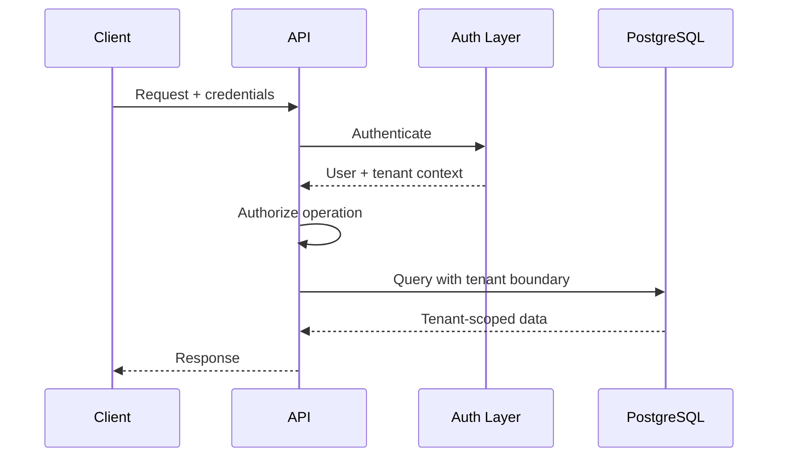
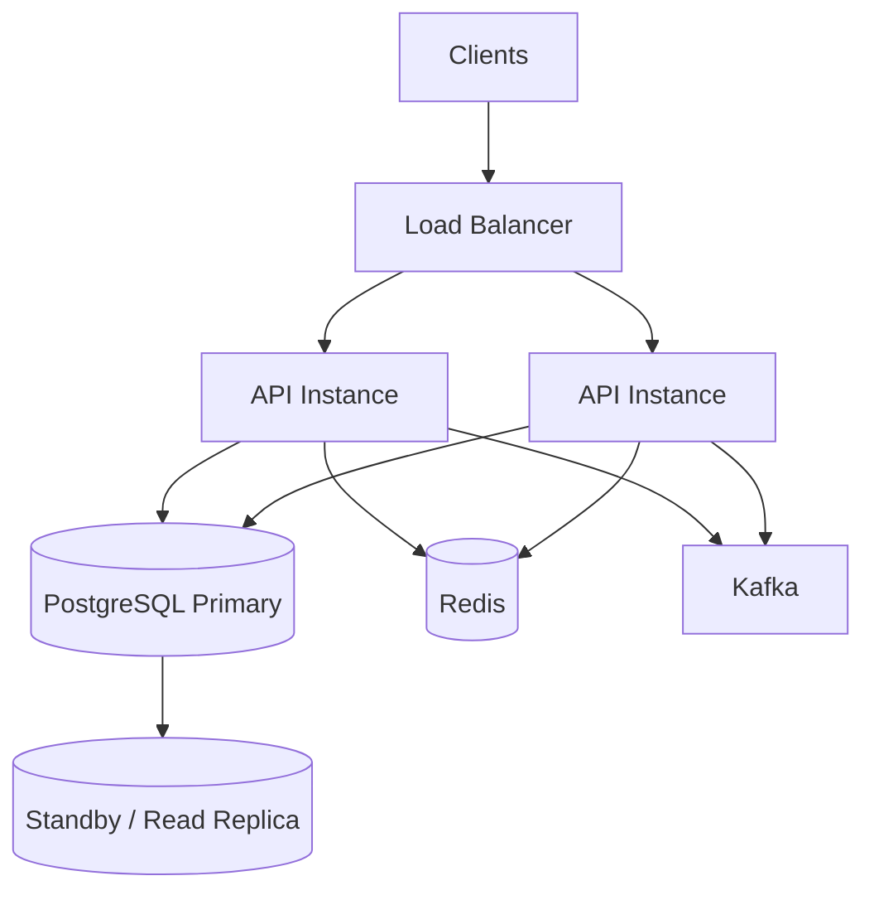

# 01- Requirements

## Overview

This project defines a production-oriented **Multi-Tenant SaaS Database** using PostgreSQL as the primary relational data store.

The central challenge is not simply storing data for multiple customers. The database must ensure that:

```text
Tenant A
    ↓
can access only Tenant A data

Tenant B
    ↓
can access only Tenant B data
```

while supporting:

- Strong tenant isolation.
- Shared infrastructure.
- User and organization management.
- Role-based access control.
- Subscription and billing data.
- Application-level authorization.
- PostgreSQL Row-Level Security where appropriate.
- High query performance.
- Safe migrations.
- Background processing.
- Auditing.
- Scalability.
- Backup and disaster recovery.

The project is designed to demonstrate how database design, SQL, PostgreSQL security, backend architecture, and multi-tenant application behavior fit together.

---

## Problem Statement

Build a SaaS database where multiple organizations use the same application and database infrastructure.

A simplified model is:

```text
                    SaaS Platform
                         │
          ┌──────────────┼──────────────┐
          ↓              ↓              ↓
      Tenant A        Tenant B        Tenant C
          │              │              │
       Users          Users          Users
          │              │              │
       Projects       Projects       Projects
          │              │              │
        Data           Data           Data
```

The application should provide logical isolation while avoiding unnecessary infrastructure duplication.

The database must make tenant boundaries explicit rather than relying solely on application conventions.

---

## Core Goals

The project should establish requirements for:

- Tenant lifecycle management.
- User membership.
- Role-based access control.
- Tenant-scoped application data.
- Cross-tenant isolation.
- Subscription and plan management.
- Usage tracking.
- Audit logging.
- Soft deletion where appropriate.
- Data retention.
- Query performance.
- Transactional consistency.
- Background processing.
- API integration.
- Security.
- Observability.
- High availability.
- Disaster recovery.

---

## Multi-Tenancy Model

The primary model for this project is:

```text
Shared application
        +
Shared PostgreSQL database
        +
Shared schema
        +
tenant_id on tenant-owned tables
```

Conceptually:

```text
organizations
     │
     ├── users / memberships
     ├── projects
     ├── subscriptions
     ├── usage
     ├── application data
     └── audit records
```

Each tenant-owned record must have a clear tenant association.

---

## Tenant Isolation Requirement

Every tenant-scoped query must enforce the tenant boundary.

Example:

```sql
SELECT
    id,
    name,
    status
FROM projects
WHERE tenant_id = $1
  AND id = $2;
```

The application must never rely on:

```sql
WHERE id = $1
```

alone when `id` is not globally sufficient to guarantee authorization.

A secure design should make tenant context part of the data-access contract.

---

## Tenant Context

Every authenticated request should establish:

```text
user
  ↓
membership
  ↓
tenant
  ↓
authorization
  ↓
database operations
```

A typical request flow is:



The tenant context must be derived from trusted authentication and authorization data rather than blindly trusting a client-provided tenant identifier.

---

## Tenant Entity

Each organization using the SaaS application should have a durable tenant record.

Typical attributes include:

```text
id
name
slug
status
created_at
updated_at
```

Possible lifecycle states:

```text
ACTIVE
SUSPENDED
DELETED
```

The exact state model should reflect product requirements.

Tenant identifiers should be stable and should not be reused after deletion.

---

## Tenant Lifecycle

The tenant lifecycle should support:

```text
creation
    ↓
active
    ↓
suspended
    ↓
reactivation
    ↓
deletion / retention
```

Suspension should normally prevent new application activity without destroying historical data.

Deletion requirements must distinguish between:

```text
logical deletion
+
retention period
+
permanent deletion
```

because legal, billing, audit, and compliance requirements may require data to remain available for a defined period.

---

## User Management

Users should be modeled separately from tenants.

A user may belong to multiple tenants:

```text
User A
 ├── Tenant 1 → ADMIN
 └── Tenant 2 → MEMBER
```

Therefore, avoid embedding a single:

```text
tenant_id
```

directly into the user entity if the product allows multi-tenant membership.

Use a membership relationship:

```text
users
  │
  └── memberships
          │
          └── tenants
```

---

## Membership Requirements

A membership should capture the relationship between a user and a tenant.

Typical attributes:

```text
id
tenant_id
user_id
role
status
created_at
updated_at
```

Requirements:

- A user cannot have duplicate active memberships for the same tenant.
- Membership must belong to exactly one tenant.
- Membership must reference an existing user.
- Membership status must be explicit.
- Role must be controlled.
- Tenant authorization must flow through membership.

A uniqueness constraint should enforce the core relationship:

```text
(tenant_id, user_id)
```

---

## Roles and Authorization

The initial authorization model should support roles such as:

| Role | Typical permissions |
|---|---|
| Owner | Full tenant administration |
| Admin | Tenant configuration and user management |
| Member | Normal application operations |
| Viewer | Read-only access |

Roles should not be treated as the only authorization mechanism.

A production authorization decision may depend on:

```text
user
+
tenant
+
role
+
resource
+
resource ownership
+
operation
```

---

## Tenant-Scoped Resources

Application resources should clearly indicate whether they are:

- Global.
- Tenant-scoped.
- User-scoped within a tenant.
- Related to another tenant-owned resource.

For example:

```text
organizations
    ↓
projects
    ↓
tasks
```

If `projects` belongs to a tenant, `tasks` should not be able to reference a project belonging to another tenant.

Cross-tenant references must be prevented by schema design or application/database constraints.

---

## Tenant-Scoped Foreign Keys

A common multi-tenant mistake is:

```text
tasks.project_id → projects.id
```

without considering the tenant boundary.

A stronger model can include tenant context:

```text
tasks
    tenant_id
    project_id
```

and enforce consistency where appropriate.

For example, the project can expose a composite unique key:

```sql
UNIQUE (tenant_id, id)
```

and the child can reference:

```text
(tenant_id, project_id)
```

This makes the tenant boundary part of the relational model rather than merely an application assumption.

---

## Row-Level Security

PostgreSQL Row-Level Security (RLS) may be used as a defense-in-depth mechanism.

Conceptually:

```text
Application
    ↓
tenant context
    ↓
PostgreSQL session/transaction context
    ↓
RLS policy
    ↓
tenant rows only
```

A policy can enforce that the current database context matches the row's tenant.

The exact RLS design should account for:

- Application roles.
- Table ownership.
- `BYPASSRLS`.
- `FORCE ROW LEVEL SECURITY`.
- Connection pooling.
- Background workers.
- Administrative operations.

RLS should not be treated as a substitute for application authorization.

---

## Connection Pooling and RLS

Connection pooling creates an important security requirement.

If tenant context is stored in session-level database state, one request can accidentally affect another request using the same connection.

Prefer transaction-scoped context where appropriate:

```sql
BEGIN;

SET LOCAL app.tenant_id = '...';

-- Tenant-scoped queries.

COMMIT;
```

The application must ensure that tenant context is established correctly for every transaction.

This is particularly important when using PgBouncer transaction pooling.

---

## Data Isolation Requirements

The design should prevent:

```text
Tenant A
    ↓
SELECT Tenant B rows

Tenant A
    ↓
UPDATE Tenant B rows

Tenant A
    ↓
DELETE Tenant B rows
```

Isolation should be enforced through multiple layers:

```text
API authorization
+
tenant-aware query patterns
+
database constraints
+
RLS where appropriate
```

Defense in depth is preferable to trusting one mechanism.

---

## Subscription Management

The SaaS platform should support tenant subscription state.

Typical entities include:

```text
plans
subscriptions
subscription_events
```

A subscription may contain:

```text
tenant_id
plan_id
status
provider
provider_subscription_id
current_period_start
current_period_end
created_at
updated_at
```

Possible states include:

```text
TRIALING
ACTIVE
PAST_DUE
CANCELLED
EXPIRED
```

The exact state machine should be defined explicitly.

---

## Billing Integration

External billing providers should not be treated as part of a PostgreSQL transaction.

A typical workflow is:

```text
API
 ↓
PostgreSQL
 ↓
durable subscription state
 ↓
outbox
 ↓
worker
 ↓
billing provider
 ↓
webhook
 ↓
PostgreSQL
```

Provider identifiers should be persisted and protected against duplicate webhook processing.

---

## Usage Tracking

A SaaS system may track usage such as:

```text
API requests
storage
active users
projects
background jobs
feature consumption
```

Usage requirements should distinguish between:

```text
current usage
historical usage
billing usage
analytics usage
```

High-frequency usage events may require aggregation rather than storing every request directly in the primary transactional table.

---

## Usage Aggregation

For high-volume usage:

```text
API requests
    ↓
event stream
    ↓
Kafka
    ↓
aggregation worker
    ↓
usage_daily
```

The transactional database should not necessarily become the raw event warehouse.

This separation prevents analytics and metering workloads from overwhelming OLTP queries.

---

## Audit Logging

Important tenant actions should be auditable.

Examples:

```text
user invited
role changed
project created
resource deleted
subscription changed
API credential rotated
security setting changed
```

An audit record should typically include:

```text
tenant_id
actor_user_id
action
resource_type
resource_id
metadata
created_at
request_id
```

Audit records should be append-oriented and protected from unauthorized modification.

---

## Soft Deletion

Some tenant-owned entities may require soft deletion:

```text
deleted_at
```

This can support:

- Recovery.
- Auditability.
- Retention policies.
- Business workflows.

Queries must consistently exclude deleted rows:

```sql
SELECT
    id,
    name
FROM projects
WHERE tenant_id = $1
  AND deleted_at IS NULL;
```

Partial indexes may help:

```sql
CREATE INDEX projects_tenant_active_idx
ON projects (tenant_id, id)
WHERE deleted_at IS NULL;
```

Soft deletion should not be applied indiscriminately. For immutable audit records or data subject to strict retention policies, a different lifecycle may be appropriate.

---

## Data Retention

The requirements should explicitly define retention for:

| Data | Example policy |
|---|---|
| Active application data | Retained while tenant is active |
| Deleted resources | Retained for recovery period |
| Audit records | Longer retention |
| Billing records | Provider/legal retention requirements |
| Usage data | Aggregated and retained according to product needs |
| Operational logs | Shorter retention |

Actual retention periods should be determined by product, legal, and compliance requirements.

---

## API Requirements

The API should support tenant-aware operations such as:

```text
POST   /v1/tenants
GET    /v1/tenants/{tenant_id}
GET    /v1/projects
POST   /v1/projects
GET    /v1/projects/{project_id}
PATCH  /v1/projects/{project_id}
DELETE /v1/projects/{project_id}
GET    /v1/members
POST   /v1/members
```

For most application endpoints, tenant identity should come from authenticated context rather than requiring clients to repeatedly supply an arbitrary tenant identifier.

---

## API Authorization

Every tenant-scoped request should pass through:

```text
Authentication
    ↓
Tenant membership
    ↓
Role/permission check
    ↓
Resource authorization
    ↓
Database query
```

Example:

```python
def authorize_project_access(user, project):
    membership = get_membership(
        user_id=user.id,
        tenant_id=project.tenant_id,
    )

    if membership is None:
        raise PermissionError("Access denied")
```

The database query itself should still remain tenant-aware.

---

## Pagination Requirements

Tenant-scoped list APIs must be bounded.

Avoid:

```text
GET /projects
```

returning every project.

Prefer:

```text
GET /projects?limit=50&cursor=...
```

Use keyset pagination for large datasets.

Example:

```sql
SELECT
    id,
    name,
    created_at
FROM projects
WHERE tenant_id = $1
  AND (created_at, id) < ($2, $3)
ORDER BY created_at DESC, id DESC
LIMIT 50;
```

The corresponding index should include the tenant boundary:

```sql
CREATE INDEX projects_tenant_created_idx
ON projects (
    tenant_id,
    created_at DESC,
    id DESC
);
```

---

## Search Requirements

Tenant-scoped search must never become global search accidentally.

Incorrect:

```sql
SELECT *
FROM projects
WHERE name ILIKE $1;
```

Safer:

```sql
SELECT *
FROM projects
WHERE tenant_id = $1
  AND name ILIKE $2;
```

Search indexes should be designed around the actual workload.

For PostgreSQL text search or trigram search, use the appropriate specialized index only when required by the query patterns.

---

## Indexing Requirements

Common multi-tenant access patterns should lead with tenant context when tenant filtering is fundamental.

Examples:

```text
(tenant_id, id)
(tenant_id, created_at, id)
(tenant_id, status, created_at)
(tenant_id, user_id)
```

The exact index should depend on:

```text
WHERE
+
JOIN
+
ORDER BY
+
pagination
+
data distribution
```

Do not automatically prepend `tenant_id` to every index without examining the workload.

---

## Tenant Size Variance

A major SaaS design consideration is tenant size distribution.

A platform may have:

```text
10,000 small tenants
+
10 medium tenants
+
1 extremely large tenant
```

A query plan that works well for small tenants may behave differently for a very large tenant.

Therefore, performance testing should include:

```text
small tenant
medium tenant
large tenant
worst-case tenant
```

Do not benchmark only average tenant sizes.

---

## Noisy Neighbor Protection

A large tenant can consume disproportionate shared resources.

Potential impact:

```text
large query
    ↓
CPU / I/O
    ↓
shared PostgreSQL resources
    ↓
other tenants experience latency
```

Mitigation can include:

- Query limits.
- Pagination.
- Statement timeouts.
- Rate limits.
- Background processing.
- Resource quotas.
- Workload isolation.
- Dedicated infrastructure for very large tenants.

Multi-tenancy is therefore both a security and capacity-planning problem.

---

## Tenant Quotas

Plans may define limits such as:

```text
max_users
max_projects
max_storage
max_API_requests
```

Do not rely solely on:

```python
if current_count < limit:
    create()
```

for concurrency-sensitive limits.

Where exact enforcement matters, use database constraints, atomic updates, locking, or transactional quota accounting.

---

## Transaction Requirements

Tenant-scoped mutations should be atomic where multiple records must change together.

For example:

```text
create project
+
create default configuration
+
write audit record
+
write outbox event
```

should be one database transaction if these operations must succeed or fail together.

---

## Cross-Tenant Transaction Requirements

A normal tenant operation should not modify data belonging to another tenant.

Cross-tenant operations should be rare and explicitly authorized.

Examples might include:

```text
platform administration
billing aggregation
system-wide reporting
tenant migration
```

These operations should use separate privileged workflows rather than accidentally bypassing tenant boundaries in ordinary application code.

---

## Platform Administration

Platform administrators may require cross-tenant access.

This introduces a separate security boundary:

```text
Tenant User
    ↓
Tenant-scoped permissions

Platform Admin
    ↓
Explicit platform-level permissions
```

Do not implement this simply by:

```text
WHERE tenant_id is optional
```

because accidentally omitting the filter can create catastrophic data exposure.

Privileged access should be explicit, auditable, and tightly controlled.

---

## Django Requirements

Django models should make tenant ownership explicit.

Example:

```python
class Project(models.Model):
    tenant = models.ForeignKey(
        "Tenant",
        on_delete=models.PROTECT,
    )
    name = models.CharField(max_length=255)
    created_at = models.DateTimeField(auto_now_add=True)
```

Application querysets should consistently scope data:

```python
Project.objects.filter(
    tenant=request.tenant,
    deleted_at__isnull=True,
)
```

A reusable tenant-aware data-access layer can reduce accidental unscoped queries.

---

## FastAPI Requirements

FastAPI can establish tenant context through dependencies:

```python
from fastapi import Depends


def get_current_tenant(
    user=Depends(get_current_user),
):
    # Resolve membership and tenant from trusted identity.
    return resolve_tenant_for_user(user)
```

Endpoints can then depend on the resolved tenant:

```python
@app.get("/projects")
def list_projects(
    tenant=Depends(get_current_tenant),
):
    return project_service.list_for_tenant(tenant.id)
```

The service layer should remain tenant-aware rather than assuming that every caller has already filtered correctly.

---

## SQLAlchemy Requirements

SQLAlchemy queries should include tenant predicates where required:

```python
stmt = (
    select(Project)
    .where(
        Project.tenant_id == tenant_id,
        Project.deleted_at.is_(None),
    )
    .order_by(Project.created_at.desc(), Project.id.desc())
    .limit(50)
)
```

Do not depend on developers remembering tenant filters in every query without architectural safeguards.

---

## Background Worker Requirements

Celery workers must preserve tenant context.

A task should carry enough information to identify the tenant safely:

```text
task
 ├── tenant_id
 └── resource_id
```

The worker should revalidate that:

```text
resource belongs to tenant
```

before modifying it.

Do not assume a task payload is trustworthy merely because it originated from the application.

---

## Kafka Requirements

Events should include tenant context when the event is tenant-scoped.

Example:

```json
{
  "event_id": "evt_123",
  "event_type": "project.created",
  "tenant_id": "tenant_456",
  "project_id": "project_789"
}
```

Consumers should preserve tenant boundaries when creating derived data.

Kafka topic partitioning may also consider tenant distribution where ordering or workload isolation requires it.

Do not automatically use `tenant_id` as the partition key without considering hot tenants and event ordering requirements.

---

## Redis Requirements

Redis keys should include tenant context when the data is tenant-scoped.

Example:

```text
tenant:{tenant_id}:project:{project_id}
```

This reduces accidental key collisions.

Authorization should not depend exclusively on the Redis key structure.

Redis should generally hold:

```text
cache
+
ephemeral state
+
rate limits
```

rather than being the authoritative tenant database.

---

## Cache Isolation

A dangerous cache pattern is:

```python
cache.set(f"project:{project_id}", project)
```

if `project_id` is not globally unique or the cache operation does not preserve tenant context.

Prefer tenant-aware keys where appropriate:

```python
key = f"tenant:{tenant_id}:project:{project_id}"
```

Cache invalidation should also carry tenant context.

---

## Security Requirements

The database and application should defend against:

- Cross-tenant reads.
- Cross-tenant updates.
- Cross-tenant deletes.
- ID enumeration.
- Broken object-level authorization.
- SQL injection.
- Cache key collisions.
- Event leakage.
- Background-task authorization failures.
- Privileged administrator misuse.

The system should assume that a client can deliberately manipulate:

```text
tenant_id
resource_id
cursor
filter
sort
```

and attempt to access another tenant.

---

## ID Enumeration

Sequential IDs can make resource discovery easier.

For example:

```text
/projects/1001
/projects/1002
/projects/1003
```

does not itself create a vulnerability if authorization is correct, but it can make enumeration easier.

Possible approaches include:

- UUID/ULID identifiers.
- Strong authorization.
- Tenant-aware queries.
- Rate limiting.

Identifier choice should not be treated as a replacement for authorization.

---

## SQL Injection

All user-provided values must be parameterized.

Example:

```sql
SELECT
    id,
    name
FROM projects
WHERE tenant_id = $1
  AND name = $2;
```

Do not construct:

```python
query = (
    "SELECT * FROM projects "
    f"WHERE tenant_id = '{tenant_id}' "
    f"AND name = '{name}'"
)
```

Parameterized SQL protects values, while dynamic SQL identifiers require separate allowlisting or safe identifier composition.

---

## Audit and Security Events

Security-sensitive operations should be auditable:

```text
role changed
membership removed
API key created
API key revoked
tenant suspended
tenant administrator changed
billing settings modified
```

Audit records should include:

```text
tenant_id
actor
action
resource
timestamp
request_id
```

Avoid storing secrets or unnecessary sensitive payloads in audit records.

---

## High Availability

A shared multi-tenant PostgreSQL deployment introduces a common failure domain.

A typical architecture is:



The database layer should provide:

- Automated backups.
- Replication.
- Failover.
- Monitoring.
- Tested recovery.

Tenant isolation must continue to hold after failover.

---

## Disaster Recovery

DR requirements must consider the entire shared database.

If one shared database contains all tenants:

```text
database failure
    ↓
potential impact to every tenant
```

Therefore define:

```text
RPO
RTO
backup frequency
retention
restore procedure
tenant recovery strategy
```

Test restore procedures with realistic multi-tenant data volumes.

---

## Tenant-Level Recovery

A shared database creates an additional challenge:

```text
How do we restore one tenant without restoring every tenant?
```

Possible strategies include:

- Logical export/import.
- Tenant-specific archival.
- Application-level reconstruction.
- Dedicated backup datasets.
- Separate databases for selected large tenants.

The project should document whether tenant-level recovery is required.

---

## Tenant Migration

Large tenants may eventually require infrastructure isolation.

A possible evolution is:

```text
Shared database
      ↓
Large tenant identified
      ↓
Tenant export
      ↓
Dedicated database
      ↓
Traffic migration
```

The data model should therefore avoid assumptions that make tenant migration impossible.

Tenant identifiers and resource ownership should remain explicit and stable.

---

## Scaling Strategy

The initial architecture can be:

```text
shared database
+
shared schema
```

As scale increases, possible strategies include:

```text
vertical scaling
        ↓
read replicas
        ↓
partitioning
        ↓
workload separation
        ↓
large-tenant isolation
```

Do not introduce database-per-tenant architecture prematurely.

The correct model depends on:

- Tenant count.
- Tenant size.
- Compliance requirements.
- Isolation requirements.
- Operational capacity.
- Cost.

---

## Cost Considerations

Shared infrastructure provides strong resource efficiency:

```text
many tenants
    ↓
shared compute
shared database
shared infrastructure
```

However, one large tenant can consume shared capacity.

Dedicated infrastructure provides stronger isolation but increases:

```text
deployment complexity
+
monitoring
+
backup management
+
operational cost
```

The project should explicitly document the trade-off.

---

## Observability Requirements

Metrics should be tenant-aware without exposing sensitive information.

Useful dimensions include:

```text
tenant_id
endpoint
operation
database query
status
latency
```

However, high-cardinality tenant identifiers should be handled carefully in metrics systems.

For very large tenant counts, tenant-specific identifiers may be better suited to logs or traces than metric labels.

---

## Query Monitoring

Monitor:

```text
p95/p99 API latency
database query latency
connection pool utilization
lock waits
deadlocks
replication lag
slow queries
worker queue depth
```

Investigate both:

```text
platform-wide performance
```

and:

```text
large-tenant behavior
```

because average metrics can hide noisy-neighbor problems.

---

## Rate Limiting

Tenant-level rate limits can protect shared infrastructure.

For example:

```text
Tenant A → 1,000 requests/minute
Tenant B → 1,000 requests/minute
```

Redis can implement distributed rate limiting.

Rate limiting should be applied before expensive database operations where possible.

---

## Testing Requirements

The test suite should explicitly validate tenant isolation.

At minimum:

```text
Tenant A user
    ↓
can access Tenant A resource

Tenant A user
    ↓
cannot access Tenant B resource
```

Test:

- `GET`
- `POST`
- `PATCH`
- `DELETE`
- Search.
- Pagination.
- Bulk operations.
- Background jobs.
- Webhooks.
- Kafka consumers.
- Redis cache access.
- Administrative operations.

---

## Concurrency Tests

Test concurrent tenant operations:

```text
same tenant
    +
different tenants
```

Verify that:

- Tenant boundaries remain intact.
- Unique constraints behave correctly.
- Quotas remain correct.
- Concurrent updates do not overwrite each other.
- Transactions remain atomic.

---

## Migration Testing

Every schema migration should be tested against:

```text
small tenant
large tenant
many tenants
production-like row counts
```

Large multi-tenant tables can make seemingly harmless migrations expensive.

Avoid long blocking migrations on heavily used tables.

---

## Acceptance Criteria

The project should be considered functionally complete when:

- [ ] Multiple tenants can coexist in the same database.
- [ ] Users can belong to multiple tenants where supported.
- [ ] Membership roles are enforced.
- [ ] Tenant-scoped resources have explicit ownership.
- [ ] Cross-tenant access is rejected.
- [ ] Tenant-scoped foreign-key relationships are protected.
- [ ] Pagination is bounded and deterministic.
- [ ] Critical queries have appropriate indexes.
- [ ] Soft deletion behavior is consistent where used.
- [ ] Audit events are persisted.
- [ ] Subscription state is modeled.
- [ ] Usage tracking is modeled appropriately.
- [ ] Background tasks preserve tenant context.
- [ ] Events preserve tenant context.
- [ ] Cache keys are tenant-aware where required.
- [ ] Idempotency is implemented for retryable mutations where required.
- [ ] Database transactions protect multi-record operations.
- [ ] RLS is evaluated as a defense-in-depth mechanism.
- [ ] Connection pooling does not leak tenant context.
- [ ] Security tests verify cross-tenant isolation.
- [ ] Backup and restore procedures are defined.
- [ ] HA and failover behavior is tested.

---

## Senior Design Questions

The completed project should be able to answer:

### Tenant Isolation

```text
How can Tenant A ever see Tenant B data?

Can the database prevent it?

Can the application accidentally bypass tenant filtering?

What happens if a developer forgets tenant_id in a query?
```

### Authorization

```text
Who determines the tenant?

Who determines the user's role?

Who authorizes resource access?

Can a tenant user become a platform administrator?
```

### Database Design

```text
Should tenant_id be part of every table?

Which foreign keys must include tenant context?

Which constraints enforce tenant boundaries?
```

### Performance

```text
What happens when one tenant has 100 million rows?

Which indexes support tenant-scoped pagination?

Can a large tenant become a noisy neighbor?
```

### Scaling

```text
When should the system move from shared schema to dedicated infrastructure?

Can one tenant be migrated independently?

How would tenant data be exported?
```

### Reliability

```text
What happens if PostgreSQL fails?

What happens if Redis fails?

What happens if Kafka is unavailable?

What happens if a background worker retries?
```

### Security

```text
What prevents cross-tenant access?

How is RLS configured?

How is tenant context propagated through connection pools?

How are privileged operations audited?
```

---

## Recommended Engineering Principles

The project should follow these principles:

```text
Tenant isolation is a security invariant.
        ↓
Tenant ownership is explicit in the schema.
        ↓
Authorization happens before data access.
        ↓
Database constraints enforce important relationships.
        ↓
Queries remain tenant-scoped.
        ↓
RLS can provide defense in depth.
        ↓
Indexes reflect tenant-aware access patterns.
        ↓
Background jobs preserve tenant context.
        ↓
Events preserve tenant context.
        ↓
Recovery and migration consider tenant boundaries.
```

The most important principle is:

> Multi-tenancy is not merely adding a `tenant_id` column. It is an end-to-end isolation model spanning identity, authorization, SQL, database constraints, caching, events, background processing, operations, and recovery.

## Key Takeaways

- **Tenant isolation is a security invariant that must be enforced across the API, service layer, PostgreSQL queries, constraints, caching, events, and background workers.**
- **A shared-schema PostgreSQL model can scale effectively when tenant ownership is explicit, tenant-aware indexes and queries are designed correctly, and large-tenant behavior is considered.**
- **RLS can provide valuable defense in depth, but it does not replace application authorization and requires careful handling of connection pooling, privileged roles, and tenant context.**
- **Every integration boundary—Redis, Kafka, Celery, webhooks, and external billing—must preserve tenant context and remain safe under retries, failures, and duplicate processing.**
- **Senior multi-tenant design must address noisy neighbors, tenant-level recovery, migration to dedicated infrastructure, HA/DR, observability, and the security consequences of shared infrastructure.**