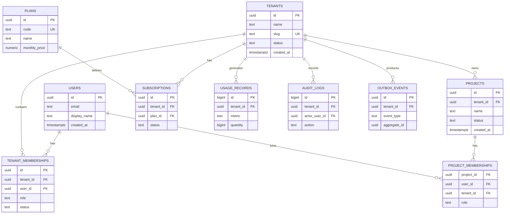

# 02- Tenant Data Model

## Overview

A multi-tenant SaaS database must make tenant ownership explicit at the data-model level.

The core design principle is:

```text
Tenant
  │
  ├── Users / Memberships
  ├── Projects
  ├── Resources
  ├── Subscriptions
  ├── Usage
  └── Audit Records
```

The database should make it difficult to accidentally create relationships such as:

```text
Tenant A → Tenant B Project
Tenant A User → Tenant B Resource
Tenant A Event → Tenant B Resource
```

A robust model combines:

- Explicit tenant ownership.
- Foreign keys.
- Composite uniqueness where required.
- Tenant-aware relationships.
- Appropriate constraints.
- Tenant-aware indexes.
- Application authorization.
- Optional PostgreSQL Row-Level Security.
- Clear lifecycle and deletion semantics.

The goal is not to put `tenant_id` on every table mechanically. The goal is to make ownership, isolation, relationships, and operational boundaries unambiguous.

---

## Multi-Tenant Data Model

A typical SaaS database can be organized around these domains:

```text
                         tenants
                            │
             ┌──────────────┼──────────────┐
             │              │              │
             ↓              ↓              ↓
       memberships       projects      subscriptions
             │              │
             ↓              ↓
           users          resources
                            │
                            ↓
                       audit events
```

A more complete model might contain:

```text
users
tenants
tenant_memberships
roles / permissions

projects
project_memberships
tasks

plans
subscriptions
subscription_events

usage_records
usage_daily

audit_logs
outbox_events
```

The exact domain tables depend on the SaaS product, but the tenant boundary should remain consistent.

---

## Tenant Ownership Categories

Not every table needs the same relationship to a tenant.

| Data category | Tenant relationship | Example |
|---|---|---|
| Global reference data | No tenant | Countries, system plans |
| Tenant root entity | Direct | Tenant |
| Tenant-owned resource | Direct | Project |
| Child of tenant resource | Direct or derived | Task |
| User identity | Usually global | User |
| Membership | Tenant + user | Tenant membership |
| Platform operational data | Usually global | Deployment metadata |
| Tenant audit data | Direct | Audit event |
| Tenant usage data | Direct | API usage |
| Cross-tenant platform data | Explicit privileged scope | Billing aggregation |

This distinction prevents unnecessary duplication while keeping ownership clear.

---

## Tenant Table

The tenant is the root entity for tenant-owned business data.

Example:

```sql
CREATE TABLE tenants (
    id UUID PRIMARY KEY,
    name TEXT NOT NULL,
    slug TEXT NOT NULL,
    status TEXT NOT NULL,
    created_at TIMESTAMPTZ NOT NULL DEFAULT now(),
    updated_at TIMESTAMPTZ NOT NULL DEFAULT now(),

    CONSTRAINT tenants_status_check
        CHECK (status IN ('ACTIVE', 'SUSPENDED', 'DELETED')),

    CONSTRAINT tenants_slug_unique
        UNIQUE (slug)
);
```

The tenant identifier should be:

- Stable.
- Non-reusable.
- Suitable for references from other tables.
- Independent from mutable display names.

A tenant name may change. The tenant ID should not.

---

## Tenant Identifier

A UUID is a reasonable default for externally visible tenant identifiers.

For example:

```text
tenant_id
---------
7d7f9d7e-...
```

Advantages include:

- Large identifier space.
- Reduced predictability compared with sequential IDs.
- Easy generation across distributed services.

However:

> An unpredictable identifier is not an authorization mechanism.

A UUID does not prevent cross-tenant access if authorization is broken.

---

## Tenant Slug

A slug can provide a human-readable identifier:

```text
acme
globex
example-corp
```

A slug may be useful for:

```text
/acme/projects
```

but should not replace the immutable tenant ID as the primary relational identifier.

If slugs are user-visible, define whether they are:

- Immutable.
- Changeable.
- Case-sensitive.
- Globally unique.
- Reserved-word protected.

---

## User Identity

Users should generally represent global identities rather than tenant-specific copies.

Example:

```sql
CREATE TABLE users (
    id UUID PRIMARY KEY,
    email TEXT NOT NULL,
    display_name TEXT NOT NULL,
    created_at TIMESTAMPTZ NOT NULL DEFAULT now()
);
```

A user can then belong to multiple tenants.

```text
User
 │
 ├── Membership → Tenant A → ADMIN
 │
 └── Membership → Tenant B → VIEWER
```

This model is preferable when the product allows users to operate across multiple organizations.

---

## User Email Uniqueness

Email uniqueness depends on product requirements.

Possible models include:

### Globally unique

```text
UNIQUE(email)
```

Useful when one identity corresponds to one account across the entire platform.

### Tenant-specific

```text
UNIQUE(tenant_id, email)
```

Useful when identities are intentionally tenant-specific.

However, if the system uses a global `users` table, tenant-specific email uniqueness belongs in the membership or tenant-user model rather than the global user table.

The identity model should be decided before implementing authentication and invitation flows.

---

## Tenant Membership

Membership represents:

```text
user + tenant + authorization
```

Example:

```sql
CREATE TABLE tenant_memberships (
    id UUID PRIMARY KEY,
    tenant_id UUID NOT NULL REFERENCES tenants(id),
    user_id UUID NOT NULL REFERENCES users(id),
    role TEXT NOT NULL,
    status TEXT NOT NULL,
    created_at TIMESTAMPTZ NOT NULL DEFAULT now(),
    updated_at TIMESTAMPTZ NOT NULL DEFAULT now(),

    CONSTRAINT tenant_memberships_unique
        UNIQUE (tenant_id, user_id),

    CONSTRAINT tenant_memberships_role_check
        CHECK (role IN ('OWNER', 'ADMIN', 'MEMBER', 'VIEWER')),

    CONSTRAINT tenant_memberships_status_check
        CHECK (status IN ('ACTIVE', 'INVITED', 'SUSPENDED', 'REMOVED'))
);
```

The uniqueness constraint prevents duplicate membership relationships.

---

## Membership as an Authorization Boundary

The membership should answer:

```text
Does this user belong to this tenant?
What role does the user have?
Is the membership active?
```

A typical authorization flow is:

```text
authenticated user
       ↓
tenant membership
       ↓
membership status
       ↓
role / permission
       ↓
resource authorization
```

Do not assume:

```text
user_id + tenant_id
```

is sufficient authorization for every operation.

A resource may have additional ownership or permission requirements.

---

## Roles

A simple role model can use:

```text
OWNER
ADMIN
MEMBER
VIEWER
```

For more complex systems, roles and permissions can be normalized:

```text
roles
permissions
role_permissions
tenant_memberships
```

This is useful when permissions evolve frequently.

Do not introduce a complex RBAC schema if four stable roles are sufficient for the product.

---

## Projects

Assume the SaaS application manages projects.

A project is directly owned by a tenant:

```sql
CREATE TABLE projects (
    id UUID PRIMARY KEY,
    tenant_id UUID NOT NULL REFERENCES tenants(id),
    name TEXT NOT NULL,
    status TEXT NOT NULL,
    created_at TIMESTAMPTZ NOT NULL DEFAULT now(),
    updated_at TIMESTAMPTZ NOT NULL DEFAULT now(),
    deleted_at TIMESTAMPTZ
);
```

The tenant relationship should be mandatory.

A nullable `tenant_id` would imply that a project can exist without a tenant, which should only be allowed if that is an explicit domain requirement.

---

## Tenant-Scoped Uniqueness

Suppose project names only need to be unique within a tenant.

The constraint should be:

```sql
UNIQUE (tenant_id, name)
```

not:

```sql
UNIQUE (name)
```

Example:

```text
Tenant A
    Project: Analytics

Tenant B
    Project: Analytics
```

This is valid when names are tenant-local.

For soft-deleted resources, a partial unique index may be more appropriate:

```sql
CREATE UNIQUE INDEX projects_tenant_name_active_uidx
ON projects (tenant_id, name)
WHERE deleted_at IS NULL;
```

This permits a new active project to reuse a name after the previous project has been soft-deleted.

---

## Tenant-Scoped Foreign Keys

Consider:

```text
projects
---------
id
tenant_id

tasks
---------
id
project_id
tenant_id
```

A foreign key only on:

```text
project_id → projects.id
```

does not itself guarantee that:

```text
tasks.tenant_id = projects.tenant_id
```

If the child stores `tenant_id`, the relationship can be strengthened with a composite key.

Example:

```sql
ALTER TABLE projects
ADD CONSTRAINT projects_tenant_id_id_unique
UNIQUE (tenant_id, id);

ALTER TABLE tasks
ADD CONSTRAINT tasks_project_tenant_fk
FOREIGN KEY (tenant_id, project_id)
REFERENCES projects (tenant_id, id);
```

Now PostgreSQL enforces the tenant relationship.

This is particularly valuable when cross-tenant references would represent a security or integrity violation.

---

## Direct vs Derived Tenant Ownership

There are two common approaches for child resources.

### Direct ownership

```text
tasks
 ├── tenant_id
 └── project_id
```

### Derived ownership

```text
tasks
 └── project_id → projects → tenant_id
```

Direct ownership provides simpler tenant filtering:

```sql
WHERE tenant_id = $1
```

but duplicates tenant information.

Derived ownership avoids duplication but often requires joins.

For security-sensitive multi-tenant systems, explicitly storing `tenant_id` on frequently queried tenant-owned tables is often useful, provided consistency is enforced.

---

## Tenant Consistency

If a table contains both:

```text
tenant_id
parent_id
```

the schema should prevent mismatches where practical.

Bad state:

```text
tasks.tenant_id = Tenant A
tasks.project_id = Project owned by Tenant B
```

Possible defenses include:

1. Composite foreign keys.
2. Triggers for complex invariants.
3. Application validation.
4. RLS policies.
5. Carefully designed service-layer access.

Prefer declarative foreign-key constraints when they can express the invariant.

---

## Many-to-Many Relationships

Consider project membership:

```text
users
   │
   │
   ↓
project_memberships
   ↑
   │
projects
```

A membership table may contain:

```sql
CREATE TABLE project_memberships (
    project_id UUID NOT NULL,
    user_id UUID NOT NULL,
    tenant_id UUID NOT NULL,
    role TEXT NOT NULL,

    PRIMARY KEY (project_id, user_id)
);
```

However, if both project and membership are tenant-scoped, the relationship should enforce tenant consistency.

For example:

```sql
UNIQUE (tenant_id, project_id)
```

on `projects` can support a composite foreign key from `project_memberships`.

---

## Cross-Tenant Relationships

Cross-tenant relationships should be explicitly classified.

Examples that may legitimately cross tenants:

```text
platform billing
system-wide analytics
platform support tooling
```

Examples that normally should not:

```text
Tenant A project → Tenant B task
Tenant A membership → Tenant B project
Tenant A API credential → Tenant B resource
```

Do not allow arbitrary cross-tenant foreign keys simply because PostgreSQL permits them.

---

## Global Reference Data

Some tables should not contain `tenant_id`.

Examples:

```text
countries
currencies
system_plans
feature_definitions
```

For example:

```sql
CREATE TABLE plans (
    id UUID PRIMARY KEY,
    code TEXT NOT NULL UNIQUE,
    name TEXT NOT NULL,
    monthly_price NUMERIC(12, 2) NOT NULL
);
```

A tenant's subscription references the global plan.

```text
tenant
  ↓
subscription
  ↓
global plan
```

This avoids duplicating the same reference data for every tenant.

---

## Subscription Model

A subscription belongs to a tenant.

Example:

```sql
CREATE TABLE subscriptions (
    id UUID PRIMARY KEY,
    tenant_id UUID NOT NULL REFERENCES tenants(id),
    plan_id UUID NOT NULL REFERENCES plans(id),
    status TEXT NOT NULL,
    provider TEXT,
    provider_subscription_id TEXT,
    current_period_start TIMESTAMPTZ,
    current_period_end TIMESTAMPTZ,
    created_at TIMESTAMPTZ NOT NULL DEFAULT now(),
    updated_at TIMESTAMPTZ NOT NULL DEFAULT now()
);
```

If only one active subscription is allowed per tenant, enforce that requirement with a database constraint or partial unique index.

Example:

```sql
CREATE UNIQUE INDEX subscriptions_one_active_per_tenant_uidx
ON subscriptions (tenant_id)
WHERE status IN ('TRIALING', 'ACTIVE', 'PAST_DUE');
```

The exact definition of "active" should match the billing state machine.

---

## Usage Model

Usage data should explicitly identify the tenant.

Example:

```sql
CREATE TABLE usage_records (
    id BIGINT GENERATED ALWAYS AS IDENTITY PRIMARY KEY,
    tenant_id UUID NOT NULL REFERENCES tenants(id),
    metric TEXT NOT NULL,
    quantity BIGINT NOT NULL,
    recorded_at TIMESTAMPTZ NOT NULL DEFAULT now()
);
```

For high-volume usage, consider an aggregated model:

```text
usage_events
     ↓
aggregation
     ↓
usage_daily
```

rather than continuously querying billions of raw usage rows for billing.

---

## Audit Model

Tenant audit data should preserve tenant ownership.

Example:

```sql
CREATE TABLE audit_logs (
    id BIGINT GENERATED ALWAYS AS IDENTITY PRIMARY KEY,
    tenant_id UUID NOT NULL REFERENCES tenants(id),
    actor_user_id UUID REFERENCES users(id),
    action TEXT NOT NULL,
    resource_type TEXT NOT NULL,
    resource_id UUID,
    request_id UUID,
    metadata JSONB NOT NULL DEFAULT '{}'::jsonb,
    created_at TIMESTAMPTZ NOT NULL DEFAULT now()
);
```

The audit record should identify:

```text
who
+
which tenant
+
what action
+
which resource
+
when
+
request correlation
```

Audit logs should normally be append-oriented.

---

## Outbox Events

Tenant-scoped events should preserve tenant identity.

Example:

```sql
CREATE TABLE outbox_events (
    id UUID PRIMARY KEY,
    tenant_id UUID REFERENCES tenants(id),
    event_type TEXT NOT NULL,
    aggregate_type TEXT NOT NULL,
    aggregate_id UUID,
    payload JSONB NOT NULL,
    created_at TIMESTAMPTZ NOT NULL DEFAULT now(),
    published_at TIMESTAMPTZ
);
```

A transaction can then atomically create:

```text
business data
+
outbox event
```

A worker publishes the event to Kafka after the transaction commits.

For platform-wide events, `tenant_id` may legitimately be null, but this should be an explicit semantic distinction rather than an accidental omission.

---

## Tenant Data Model

A simplified ER model:



---

## Tenant-Aware Indexing

The data model should anticipate tenant-scoped access patterns.

Common indexes include:

```sql
CREATE INDEX projects_tenant_created_idx
ON projects (tenant_id, created_at DESC, id DESC);

CREATE INDEX memberships_tenant_user_idx
ON tenant_memberships (tenant_id, user_id);

CREATE INDEX audit_logs_tenant_created_idx
ON audit_logs (tenant_id, created_at DESC, id DESC);

CREATE INDEX usage_records_tenant_recorded_idx
ON usage_records (tenant_id, recorded_at DESC);
```

The exact indexes should be based on actual queries.

Do not create every possible combination merely because `tenant_id` exists.

---

## Composite Key Ordering

Tenant-aware indexes usually benefit from putting the tenant boundary first when queries consistently contain:

```sql
WHERE tenant_id = $1
```

For example:

```sql
CREATE INDEX projects_tenant_status_created_idx
ON projects (
    tenant_id,
    status,
    created_at DESC,
    id DESC
);
```

This can support:

```sql
WHERE tenant_id = $1
  AND status = $2
ORDER BY created_at DESC, id DESC
LIMIT 50;
```

Index order must still be evaluated against the actual workload.

---

## Soft Deletion

If tenant-owned data uses:

```text
deleted_at
```

the data model should define whether uniqueness applies to:

```text
all historical rows
```

or:

```text
active rows only
```

For active-only uniqueness:

```sql
CREATE UNIQUE INDEX projects_tenant_name_active_uidx
ON projects (tenant_id, name)
WHERE deleted_at IS NULL;
```

Queries should consistently apply the same lifecycle semantics.

---

## Delete Strategy

Tenant deletion is significantly more complex than deleting one row.

Possible strategies include:

```text
Tenant marked DELETED
        ↓
retention period
        ↓
background cleanup
        ↓
permanent deletion
```

Foreign keys should use deliberate delete actions.

For example:

```text
tenant → projects
```

might use:

```text
ON DELETE CASCADE
```

if tenant deletion is guaranteed to delete the entire project tree.

Other data, especially billing or audit records, may require:

```text
ON DELETE RESTRICT
```

or an archival strategy.

Never select `CASCADE` merely because it makes migrations easier.

---

## Tenant Deletion at Scale

Deleting millions of tenant-owned rows in one transaction can create:

- Large WAL volume.
- Long-running transactions.
- Lock contention.
- Replica lag.
- Vacuum pressure.
- Large rollback cost.

For large tenants, prefer controlled batch deletion or archival workflows.

Example conceptual flow:

```text
mark tenant deleted
      ↓
disable application access
      ↓
enqueue cleanup
      ↓
batch-delete/archive child data
      ↓
verify completion
      ↓
delete tenant root
```

The cleanup process should be restartable and idempotent.

---

## Data Integrity Constraints

The schema should enforce important invariants.

Examples:

```text
tenant must exist
membership must reference valid user
membership must reference valid tenant
project must belong to valid tenant
project name unique within tenant
subscription belongs to valid tenant
audit event belongs to valid tenant
```

Prefer:

```text
PRIMARY KEY
FOREIGN KEY
UNIQUE
CHECK
NOT NULL
```

over application-only validation whenever the rule can be safely expressed in the database.

---

## Tenant Boundary and NULL

Tenant-owned tables should normally use:

```sql
tenant_id UUID NOT NULL
```

Avoid:

```sql
tenant_id UUID
```

unless the table genuinely supports tenant-independent rows.

Nullable tenant IDs create ambiguity:

```text
Does NULL mean global?
Unknown?
Not assigned?
System-owned?
Bug?
```

If global and tenant-specific records coexist, model that distinction intentionally.

---

## Row-Level Security Data Model

RLS policies typically depend on a tenant identifier stored on rows.

Conceptually:

```text
projects.tenant_id
        =
current request tenant
```

A policy can then restrict access to matching rows.

However, the schema should not assume that RLS alone solves:

```text
authorization
privileged operations
background workers
tenant context
cross-service access
```

RLS is a database enforcement layer, not a complete authorization architecture.

---

## Django Model Design

A Django model should expose tenant ownership explicitly:

```python
class Project(models.Model):
    tenant = models.ForeignKey(
        Tenant,
        on_delete=models.PROTECT,
        related_name="projects",
    )
    name = models.CharField(max_length=255)
    status = models.CharField(max_length=32)
    created_at = models.DateTimeField(auto_now_add=True)
    deleted_at = models.DateTimeField(null=True, blank=True)

    class Meta:
        constraints = [
            models.UniqueConstraint(
                fields=["tenant", "name"],
                condition=models.Q(deleted_at__isnull=True),
                name="projects_tenant_name_active_uniq",
            ),
        ]
        indexes = [
            models.Index(
                fields=["tenant", "-created_at", "-id"],
                name="projects_tenant_created_idx",
            ),
        ]
```

The ORM model should reflect the database's tenant invariants rather than hiding them.

---

## FastAPI Data Flow

A typical request should follow:

```text
HTTP request
    ↓
Nginx / Load Balancer
    ↓
FastAPI
    ↓
Authentication
    ↓
Tenant membership resolution
    ↓
Authorization
    ↓
Tenant-aware service
    ↓
PostgreSQL
```

The tenant ID should come from trusted server-side context.

A client-supplied tenant ID may be used as a selector only after verifying that the authenticated user is authorized for that tenant.

---

## Microservices Considerations

If the SaaS application evolves into microservices:

```text
Identity Service
       ↓
Tenant Service
       ↓
Project Service
       ↓
Billing Service
       ↓
Usage Service
```

Each service must define ownership explicitly.

Avoid allowing every service direct unrestricted access to every tenant table.

A stronger architecture is:

```text
Service owns data
       ↓
API / event contract
       ↓
Other services
```

Cross-service access should preserve tenant context and authorization semantics.

---

## Tenant Context in Events

An event should carry tenant context when it represents tenant-owned activity.

Example:

```json
{
  "event_id": "evt_01J...",
  "event_type": "project.created",
  "tenant_id": "tenant_01J...",
  "aggregate_type": "project",
  "aggregate_id": "project_01J...",
  "occurred_at": "2026-09-05T10:15:00Z"
}
```

Consumers should not infer tenant identity from an unrelated resource lookup if it can be carried explicitly and validated.

---

## Tenant Context in Redis

Tenant-scoped cache keys should make ownership clear.

Example:

```text
tenant:{tenant_id}:project:{project_id}
```

For tenant-level collections:

```text
tenant:{tenant_id}:projects:list:{hash}
```

Cache keys are not authorization boundaries.

Every cache read should still be associated with a properly authorized request context.

---

## Tenant Context in Celery

A background task should carry explicit tenant context:

```python
@app.task
def rebuild_project_index(tenant_id: str, project_id: str):
    project = load_project(
        tenant_id=tenant_id,
        project_id=project_id,
    )

    if project is None:
        return

    rebuild_index(project)
```

The worker should verify ownership rather than assuming that task arguments are trusted.

---

## Data Access Pattern

A tenant-aware repository/service API should make tenant context difficult to omit.

For example:

```python
def get_project(*, tenant_id: UUID, project_id: UUID) -> Project | None:
    return (
        Project.objects
        .filter(
            tenant_id=tenant_id,
            id=project_id,
            deleted_at__isnull=True,
        )
        .first()
    )
```

This is safer than exposing a generic:

```python
get_project(project_id)
```

throughout the application when the operation is inherently tenant-scoped.

---

## Tenant Isolation Testing

The test suite should explicitly test:

```text
Tenant A user
    ↓
Tenant A project → allowed

Tenant A user
    ↓
Tenant B project → denied
```

Test both direct and indirect access.

Examples:

```text
GET /projects/{id}
GET /tasks/{id}
PATCH /projects/{id}
DELETE /projects/{id}
search
bulk updates
exports
background tasks
webhooks
cache access
Kafka consumers
```

Also test cases where:

```text
Tenant A project ID
+
Tenant B tenant ID
```

are deliberately combined.

The database should reject inconsistent relationships wherever the schema can enforce them.

---

## Performance Considerations

Multi-tenant schemas can have highly uneven data distributions.

For example:

```text
Tenant A → 100 rows
Tenant B → 10,000 rows
Tenant C → 100,000,000 rows
```

A good schema must support both:

```text
small tenant queries
```

and:

```text
large tenant queries
```

Consider:

- Tenant-leading indexes.
- Keyset pagination.
- Partial indexes.
- Partitioning for genuinely large datasets.
- Query limits.
- Statement timeouts.
- Background processing.
- Read replicas where appropriate.

---

## Large-Tenant Isolation

If a tenant becomes significantly larger than the rest of the platform, options include:

```text
shared schema
    ↓
partitioned tables
    ↓
dedicated database
    ↓
dedicated infrastructure
```

The model should make tenant migration possible.

Stable tenant IDs and explicit ownership make export/import workflows much easier.

---

## Security Considerations

The data model should protect against:

- Cross-tenant foreign keys.
- Missing tenant predicates.
- Broken object-level authorization.
- Incorrect cache keys.
- Unauthorized platform administration.
- Event leakage.
- Background task misuse.
- Tenant enumeration.
- SQL injection.

The highest-risk mistake is assuming:

```text
"Every developer will remember WHERE tenant_id = ..."
```

Security-critical isolation should have multiple enforcement layers.

---

## Operational Considerations

Production operations should be able to answer:

```text
How many tenants exist?

Which tenants are active?

Which tenants are largest?

Which tenant is generating the most traffic?

Which tenant consumes the most storage?

Which tenant causes slow queries?

Can one tenant be exported?

Can one tenant be deleted safely?

Can one tenant be migrated?
```

Tenant-level operational visibility is important for both capacity planning and incident response.

---

## High Availability and Disaster Recovery

A shared database means a database failure can affect many tenants simultaneously.

The architecture should provide:

```text
PostgreSQL primary
       ↓
standby / replica
       ↓
automated failover
       ↓
backups
       ↓
tested restore
```

Tenant isolation must remain correct after:

- Failover.
- Restore.
- Replication.
- Migration.
- Data import.
- Tenant movement between databases.

---

## Backup and Restore

A full database backup protects the platform, but may not provide convenient tenant-level recovery.

If tenant-level recovery is a requirement, consider:

```text
logical tenant export
+
tenant-aware archival
+
tested restore process
```

The recovery process should verify:

```text
tenant relationships
foreign keys
membership
subscriptions
audit records
tenant-owned resources
```

---

## Cost Considerations

A shared-schema design is usually operationally efficient:

```text
many tenants
    ↓
one PostgreSQL deployment
```

It reduces:

- Infrastructure duplication.
- Database management overhead.
- Backup complexity.
- Monitoring overhead.

The trade-off is weaker physical isolation and a larger shared blast radius.

Dedicated databases can be introduced selectively for:

```text
very large tenants
regulated workloads
special isolation requirements
```

---

## Common Data Modeling Mistakes

### Missing Tenant Ownership

```text
projects(id, name)
```

instead of:

```text
projects(id, tenant_id, name)
```

If project ownership is inherently tenant-specific, the relationship should be explicit.

### Global Uniqueness by Accident

Incorrect:

```sql
UNIQUE (name)
```

when names only need to be unique per tenant.

Prefer:

```sql
UNIQUE (tenant_id, name)
```

### Inconsistent Child Ownership

Allowing:

```text
task.tenant_id = A
task.project_id = project belonging to B
```

creates a dangerous integrity gap.

Use composite foreign keys where appropriate.

### Nullable Tenant IDs Everywhere

Nullable ownership often hides ambiguous semantics.

Use `NOT NULL` unless global records are intentionally supported.

### Trusting Tenant IDs from Clients

A request containing:

```json
{
  "tenant_id": "tenant-b"
}
```

does not mean the caller is authorized for Tenant B.

Resolve and validate tenant context server-side.

### Treating UUIDs as Authorization

Random IDs reduce predictability but do not replace authorization.

### Using RLS Without Understanding Pooling

Session-level tenant state can leak between requests if connections are reused incorrectly.

Tenant context must be managed carefully with connection pooling.

### Duplicating Tenant Data Unnecessarily

Do not copy the tenant record into every domain table merely to "make it safer."

Store tenant ownership where it improves:

- Integrity.
- Query performance.
- Security enforcement.
- Operational clarity.

### Overusing Cascading Deletes

Large cascades can create huge transactions and operational problems.

Deletion strategy must consider data volume and retention requirements.

---

## Production Checklist

### Schema

- [ ] Tenant entity has a stable identifier.
- [ ] Tenant-owned resources have explicit ownership.
- [ ] Tenant membership is modeled separately from global user identity where required.
- [ ] Tenant-local uniqueness uses composite constraints.
- [ ] Cross-tenant relationships are prevented.
- [ ] Important invariants use database constraints.
- [ ] Global reference data is not unnecessarily tenant duplicated.

### Security

- [ ] Tenant authorization is explicit.
- [ ] Client-provided tenant IDs are validated.
- [ ] Cross-tenant access tests exist.
- [ ] RLS is evaluated where useful.
- [ ] Privileged operations are explicit and audited.
- [ ] Cache and event boundaries preserve tenant context.

### Performance

- [ ] Common tenant queries have appropriate indexes.
- [ ] Pagination is bounded.
- [ ] Keyset pagination is used for large lists where appropriate.
- [ ] Large-tenant workloads are tested.
- [ ] Noisy-neighbor behavior is monitored.

### Reliability

- [ ] Tenant deletion is restartable.
- [ ] Background jobs are idempotent.
- [ ] Outbox events preserve tenant context.
- [ ] Backup and restore are tested.
- [ ] Tenant migration/export is understood.

---

## Interview Perspective

A senior engineer should be able to explain why this:

```text
tenant_id on every table
```

is not automatically a complete multi-tenant design.

The deeper answer is:

```text
tenant ownership
+
relational integrity
+
authorization
+
RLS
+
indexes
+
transactions
+
cache isolation
+
event propagation
+
background jobs
+
observability
+
recovery
```

A strong design also recognizes that denormalizing `tenant_id` onto child tables can improve query performance and security enforcement, but creates a consistency invariant that should be enforced rather than merely assumed.

The important design question is not:

> "Where should I put `tenant_id`?"

It is:

> "How does tenant ownership remain correct across every path by which data can be created, queried, modified, deleted, cached, published, processed, restored, and migrated?"

## Key Takeaways

- **Tenant ownership should be explicit in the relational model, with foreign keys and composite constraints used to prevent invalid cross-tenant relationships.**
- **Global users and tenant memberships should be separated when users can belong to multiple tenants; authorization then derives from membership, role, and resource permissions.**
- **Tenant-aware indexes, uniqueness constraints, pagination, and data-access patterns are essential for both correctness and performance.**
- **RLS, application authorization, cache isolation, event metadata, and background-task validation should work together as defense in depth rather than being treated as independent concerns.**
- **A production tenant model must support uneven tenant sizes, deletion and retention, tenant-level recovery, noisy-neighbor mitigation, and eventual migration to dedicated infrastructure.**