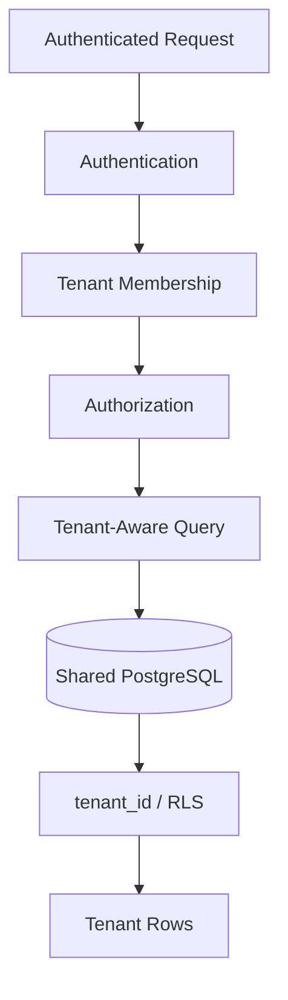
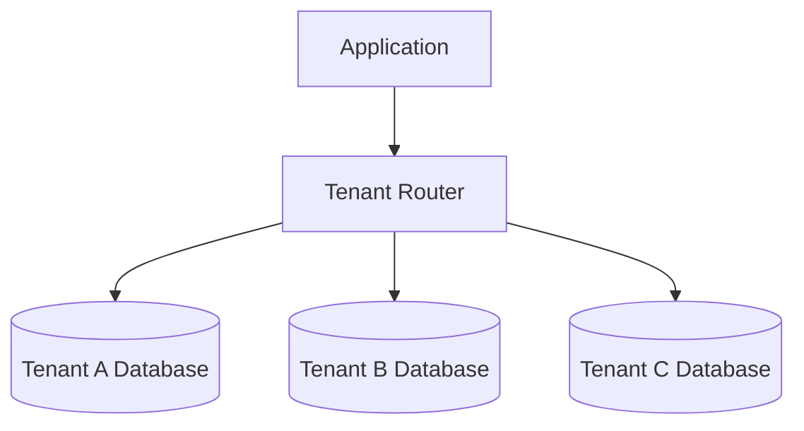
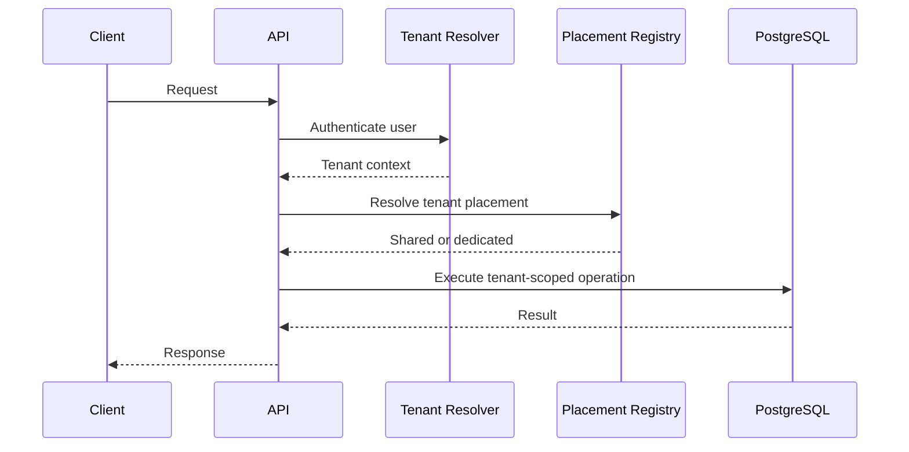

# 03- Tenant Isolation Strategies

## Overview

Tenant isolation is the core security property of a multi-tenant SaaS database.

In a shared PostgreSQL database, multiple tenants may use the same tables:

```text
                    PostgreSQL
                        │
          ┌─────────────┼─────────────┐
          ↓             ↓             ↓
       Tenant A      Tenant B      Tenant C
          │             │             │
       projects      projects      projects
       users         users         users
       data          data          data
```

The database must ensure that a request authorized for Tenant A cannot read or modify Tenant B data.

There is no single universally correct isolation strategy. Common approaches range from application-enforced `tenant_id` filtering to physically separate databases.

The correct choice depends on:

- Security requirements.
- Tenant count.
- Tenant size.
- Compliance requirements.
- Operational complexity.
- Performance characteristics.
- Disaster recovery requirements.
- Cost.
- Expected future scale.

---

## Isolation Strategy Spectrum

The major SaaS isolation models are:

| Strategy | Physical isolation | Operational complexity | Typical use |
|---|---|---:|---|
| Shared schema | Low | Low | Most SaaS applications |
| Shared database, separate schemas | Medium | Medium | Stronger logical separation |
| Database per tenant | High | High | Regulated or large tenants |
| Hybrid | Variable | High | Large-scale SaaS platforms |

A useful progression is:

```text
Shared Schema
     ↓
Separate Schema
     ↓
Database per Tenant
     ↓
Hybrid / Tiered Isolation
```

Higher isolation generally increases operational cost.

---

## Shared Schema Isolation

In a shared-schema model:

```text
tenants
projects
users
subscriptions
audit_logs
```

all tenants share the same tables.

Tenant-owned tables contain:

```text
tenant_id
```

Example:

```sql
SELECT
    id,
    name,
    status
FROM projects
WHERE tenant_id = $1
ORDER BY created_at DESC, id DESC;
```

The tenant boundary is enforced through the query predicate.

---

## Shared Schema Data Flow



The important property is that tenant context follows the request all the way to the database.

---

## Advantages of Shared Schema

Shared schema is attractive because it provides:

- Lowest infrastructure cost.
- Simple deployment.
- Easy schema migrations.
- Efficient connection pooling.
- Simple backup management.
- Easy cross-tenant platform reporting.
- High infrastructure utilization.
- Straightforward onboarding.

For thousands or millions of relatively small tenants, this is often the most practical starting point.

---

## Limitations of Shared Schema

The main risks are:

- Cross-tenant query mistakes.
- Larger shared blast radius.
- Noisy neighbors.
- More complex tenant-level recovery.
- Shared indexes and tables.
- Shared database resource contention.

The most dangerous failure is an authorization bug that returns rows without a tenant boundary.

---

## Application-Enforced Isolation

The simplest shared-schema approach is:

```text
Application
    ↓
tenant-aware query
    ↓
PostgreSQL
```

Example:

```python
projects = (
    Project.objects
    .filter(
        tenant_id=request.tenant.id,
        deleted_at__isnull=True,
    )
)
```

The application is responsible for ensuring every tenant-scoped query includes the correct tenant.

---

## Advantages

Application-level isolation is:

- Easy to understand.
- Easy to implement.
- Compatible with Django and SQLAlchemy.
- Efficient.
- Flexible.
- Easy to test.

It also works naturally with service-layer authorization.

---

## Limitations

The major limitation is human error.

A developer may accidentally write:

```python
Project.objects.get(id=project_id)
```

instead of:

```python
Project.objects.get(
    id=project_id,
    tenant_id=tenant_id,
)
```

The first query may return another tenant's resource if authorization is not enforced elsewhere.

---

## Making Application Isolation Safer

Use tenant-aware repository/service interfaces.

Prefer:

```python
project = project_repository.get(
    tenant_id=tenant_id,
    project_id=project_id,
)
```

over:

```python
project = project_repository.get(project_id)
```

For tenant-owned resources, tenant context should be part of the data-access contract.

---

## PostgreSQL Row-Level Security

PostgreSQL Row-Level Security (RLS) moves part of the isolation enforcement into the database.

Conceptually:

```text
Application
     ↓
authenticated tenant context
     ↓
PostgreSQL
     ↓
RLS policy
     ↓
tenant-specific rows
```

Example:

```sql
ALTER TABLE projects ENABLE ROW LEVEL SECURITY;

CREATE POLICY projects_tenant_isolation
ON projects
USING (
    tenant_id = current_setting('app.tenant_id')::uuid
);
```

The application establishes the tenant context before executing tenant-scoped queries.

---

## RLS With Transaction-Scoped Context

A safer pattern with connection pooling is:

```sql
BEGIN;

SET LOCAL app.tenant_id = '7d7f9d7e-0000-0000-0000-000000000001';

SELECT id, name
FROM projects;

COMMIT;
```

`SET LOCAL` limits the setting to the current transaction.

This is important when connections are reused across requests.

---

## RLS Security Model

RLS behavior depends on PostgreSQL roles and table ownership.

Important considerations include:

- Table owners normally bypass RLS unless `FORCE ROW LEVEL SECURITY` is used.
- Superusers and roles with `BYPASSRLS` bypass RLS.
- Application roles should not receive unnecessary privileges.
- Privileged administrative operations should be explicit.
- Policies should cover both reads and writes where required.

RLS should therefore be designed as part of the database privilege model, not simply enabled on tables.

---

## RLS Advantages

RLS provides:

- Database-level row filtering.
- Defense against missing application predicates.
- Centralized tenant isolation policies.
- Strong protection for direct SQL access through appropriately restricted roles.
- A useful security boundary for shared-schema SaaS.

It is particularly valuable when multiple application components access the same database.

---

## RLS Limitations

RLS introduces additional complexity:

- Policy debugging.
- Role management.
- Connection-pool context management.
- Administrative bypass concerns.
- Migration complexity.
- Background worker behavior.
- Testing requirements.

A poorly configured RLS implementation can create either:

```text
unexpected authorization failures
```

or:

```text
unexpected data exposure
```

---

## RLS and Application Authorization

RLS should not replace application authorization.

Consider:

```text
Tenant A user
    ↓
Can access Tenant A
```

RLS may enforce the tenant boundary.

But the application still needs to determine:

```text
Can this user edit the project?

Can this user delete the project?

Can this user change billing?

Can this user manage members?
```

Tenant isolation and authorization are related but distinct concerns.

---

## Write Isolation

Read policies alone are insufficient.

For mutations, the database must also prevent:

```sql
UPDATE projects
SET name = 'changed'
WHERE id = $1;
```

from modifying another tenant's resource.

A robust policy design considers:

```text
SELECT
INSERT
UPDATE
DELETE
```

as separate operations.

For example, PostgreSQL policies can distinguish:

```text
USING
WITH CHECK
```

so existing rows and newly written rows are both validated appropriately.

---

## INSERT Tenant Isolation

An application should never blindly accept:

```json
{
  "tenant_id": "tenant-b"
}
```

from an untrusted client.

Instead:

```text
authenticated user
        ↓
authorized membership
        ↓
trusted tenant context
        ↓
INSERT tenant-owned row
```

The tenant association should normally be derived server-side.

---

## UPDATE Tenant Isolation

An update should include the tenant boundary:

```sql
UPDATE projects
SET name = $3,
    updated_at = now()
WHERE tenant_id = $1
  AND id = $2;
```

Then verify the affected row count.

A zero-row update may mean:

```text
resource does not exist
OR
resource does not belong to this tenant
```

Returning the same externally visible result can reduce resource enumeration.

---

## DELETE Tenant Isolation

Similarly:

```sql
DELETE FROM projects
WHERE tenant_id = $1
  AND id = $2;
```

For soft deletion:

```sql
UPDATE projects
SET deleted_at = now()
WHERE tenant_id = $1
  AND id = $2
  AND deleted_at IS NULL;
```

The tenant predicate remains part of the mutation.

---

## Separate Schema Per Tenant

Another strategy is:

```text
database
 ├── tenant_a schema
 ├── tenant_b schema
 └── tenant_c schema
```

For example:

```text
tenant_a.projects
tenant_b.projects
tenant_c.projects
```

The database itself separates tenant namespaces.

---

## Advantages

Separate schemas can provide stronger logical isolation than a shared schema.

Potential benefits include:

- Reduced accidental cross-tenant table access.
- Tenant-specific database objects.
- More explicit ownership boundaries.
- Some flexibility for tenant-specific extensions.

This model can be useful when tenant isolation requirements are stronger than simple row filtering.

---

## Limitations

Operational complexity grows quickly.

For `10,000` tenants:

```text
10,000 schemas
×
many tables
×
indexes
×
migrations
```

Schema migrations become an orchestration problem.

A migration must potentially be applied to every tenant schema.

Connection and metadata overhead may also increase.

---

## Database Per Tenant

In this model:

```text
Tenant A → Database A
Tenant B → Database B
Tenant C → Database C
```

Each tenant has a separate PostgreSQL database or database deployment.

Conceptually:



The database itself provides strong physical/logical separation.

---

## Advantages of Database Per Tenant

This model provides:

- Strong isolation.
- Independent backups.
- Independent restoration.
- Independent scaling.
- Tenant-specific maintenance.
- Reduced noisy-neighbor impact.
- Easier tenant migration.
- Stronger compliance boundaries.

It can be appropriate for:

- Large enterprise customers.
- Strict regulatory requirements.
- Dedicated infrastructure contracts.
- High-value tenants.
- Customers requiring independent recovery.

---

## Limitations

The operational cost is substantial.

You must manage:

```text
databases
credentials
connections
backups
replicas
monitoring
migrations
failover
upgrades
provisioning
deprovisioning
```

If every tenant has an independent database cluster, infrastructure cost can become prohibitive.

---

## Separate Database vs Separate Database Cluster

These are not equivalent.

### Separate databases

```text
PostgreSQL instance
 ├── tenant_a
 ├── tenant_b
 └── tenant_c
```

### Separate clusters

```text
PostgreSQL cluster A → Tenant A
PostgreSQL cluster B → Tenant B
PostgreSQL cluster C → Tenant C
```

Separate clusters provide stronger resource and failure isolation but significantly increase operational complexity.

---

## Hybrid Isolation

Large SaaS platforms often use a hybrid model.

Example:

```text
                    SaaS Platform
                         │
             ┌───────────┴───────────┐
             ↓                       ↓
       Shared Tenants          Dedicated Tenants
             │                       │
      Shared PostgreSQL       Dedicated PostgreSQL
```

For example:

```text
99% of tenants → shared schema
1% enterprise tenants → dedicated database
```

This can provide a practical balance between:

```text
cost
+
operational simplicity
+
strong isolation
```

---

## Tenant Placement

A hybrid system needs a tenant-placement model.

Example:

```sql
CREATE TABLE tenant_placements (
    tenant_id UUID PRIMARY KEY REFERENCES tenants(id),
    isolation_mode TEXT NOT NULL,
    database_key TEXT,
    created_at TIMESTAMPTZ NOT NULL DEFAULT now(),

    CONSTRAINT tenant_placements_mode_check
        CHECK (
            isolation_mode IN (
                'SHARED',
                'DEDICATED'
            )
        )
);
```

The application can resolve:

```text
tenant
   ↓
placement
   ↓
database connection
```

---

## Tenant Routing

A request may follow:



Tenant routing must happen before database access.

---

## Tenant Placement Changes

Moving a tenant from:

```text
SHARED
```

to:

```text
DEDICATED
```

is a data migration problem.

A safe workflow may be:

```text
identify tenant
    ↓
prepare destination
    ↓
copy data
    ↓
validate
    ↓
capture changes
    ↓
short cutover
    ↓
update placement
    ↓
verify
```

The application should be able to tolerate a placement change without changing the tenant's identity.

---

## Tenant Isolation Comparison

| Concern | Shared Schema | Separate Schema | Database Per Tenant | Hybrid |
|---|---|---|---|---|
| Isolation | Logical | Stronger logical | Strong | Configurable |
| Cost | Low | Medium | High | Medium |
| Migrations | Simple | Complex | Complex | Complex |
| Tenant recovery | Difficult | Easier | Easy | Configurable |
| Noisy neighbors | High risk | Medium | Low | Configurable |
| Scaling large tenants | Harder | Moderate | Easier | Strong |
| Cross-tenant reporting | Easy | Moderate | Harder | Harder |
| Operational overhead | Low | Medium | High | High |
| Best for | General SaaS | Specialized SaaS | Enterprise | Large SaaS |

---

## Choosing an Isolation Strategy

A practical decision framework is:

```text
Are tenants relatively small?
        │
       Yes
        ↓
Shared schema
        │
        ↓
Is stronger logical enforcement required?
        │
       Yes
        ↓
Shared schema + RLS
```

For stronger infrastructure isolation:

```text
Does the tenant require dedicated infrastructure?
        │
       Yes
        ↓
Dedicated database
```

For mixed workloads:

```text
Shared tenants
+
dedicated large/regulatory tenants
=
hybrid model
```

---

## Security Boundary Matrix

| Layer | Responsibility |
|---|---|
| Authentication | Identify user |
| Membership | Establish tenant relationship |
| Authorization | Determine allowed operation |
| Application | Pass trusted tenant context |
| SQL | Scope queries |
| Constraints | Protect relational integrity |
| RLS | Enforce row boundary |
| Redis | Isolate cache keys |
| Kafka | Preserve tenant context |
| Celery | Validate tenant/resource ownership |
| Database placement | Provide physical isolation where required |

Security should be layered rather than concentrated in one component.

---

## Tenant-Aware Foreign Keys

Isolation is not only about queries.

Consider:

```text
Tenant A
 └── Project A

Tenant B
 └── Task B
```

The database should prevent:

```text
Task B → Project A
```

where both records carry tenant ownership.

A composite foreign key can enforce this:

```sql
CREATE TABLE projects (
    id UUID PRIMARY KEY,
    tenant_id UUID NOT NULL REFERENCES tenants(id),
    name TEXT NOT NULL,
    UNIQUE (tenant_id, id)
);

CREATE TABLE tasks (
    id UUID PRIMARY KEY,
    tenant_id UUID NOT NULL REFERENCES tenants(id),
    project_id UUID NOT NULL,

    CONSTRAINT tasks_project_tenant_fk
        FOREIGN KEY (tenant_id, project_id)
        REFERENCES projects (tenant_id, id)
);
```

This converts tenant consistency from an application assumption into a database invariant.

---

## Tenant-Aware Unique Constraints

Tenant-local uniqueness should be explicit.

Example:

```sql
CREATE UNIQUE INDEX projects_tenant_name_uidx
ON projects (tenant_id, name);
```

This allows:

```text
Tenant A → Analytics
Tenant B → Analytics
```

while preventing:

```text
Tenant A → Analytics
Tenant A → Analytics
```

---

## Indexing for Isolation

Tenant isolation also affects performance.

For:

```sql
SELECT *
FROM projects
WHERE tenant_id = $1
  AND status = $2
ORDER BY created_at DESC, id DESC
LIMIT 50;
```

an appropriate index might be:

```sql
CREATE INDEX projects_tenant_status_created_idx
ON projects (
    tenant_id,
    status,
    created_at DESC,
    id DESC
);
```

The tenant predicate should be considered part of the access pattern.

---

## RLS and Indexes

RLS does not eliminate the need for appropriate indexes.

A policy such as:

```text
tenant_id = current tenant
```

still results in tenant filtering.

Large shared tables need indexes that support common tenant-scoped queries.

Monitor:

```sql
EXPLAIN (ANALYZE, BUFFERS)
SELECT ...
```

to verify actual execution behavior.

---

## Noisy Neighbor Problem

In shared infrastructure:

```text
Large Tenant
     ↓
large query
     ↓
CPU / I/O / memory
     ↓
shared PostgreSQL
     ↓
other tenants slow down
```

Isolation strategy therefore affects reliability as well as security.

Mitigations include:

- Rate limiting.
- Query limits.
- Keyset pagination.
- Statement timeouts.
- Background processing.
- Per-tenant quotas.
- Workload separation.
- Dedicated databases for exceptional tenants.

---

## Tenant Quotas

Quotas can protect shared resources:

```text
API requests
storage
users
projects
jobs
database-heavy operations
```

For concurrency-sensitive quotas, avoid:

```python
if usage < limit:
    create_resource()
```

without transactional enforcement.

Two concurrent requests can both observe available capacity.

Use:

- Atomic updates.
- Constraints.
- Locks.
- Transactional accounting.

where exact enforcement matters.

---

## Background Jobs

Celery workers must preserve tenant isolation.

Example:

```python
@app.task
def process_project(tenant_id: str, project_id: str):
    project = (
        Project.objects
        .filter(
            tenant_id=tenant_id,
            id=project_id,
            deleted_at__isnull=True,
        )
        .first()
    )

    if project is None:
        return

    process(project)
```

Never assume that a worker task payload is automatically trustworthy.

---

## Kafka Isolation

Tenant-scoped events should carry tenant identity:

```json
{
  "event_id": "evt_123",
  "tenant_id": "tenant_456",
  "event_type": "project.created",
  "aggregate_id": "project_789"
}
```

Consumers should validate:

```text
tenant_id
+
aggregate ownership
```

before creating or modifying derived data.

Partitioning by tenant can help preserve per-tenant ordering, but it can also create hot partitions for very large tenants. Partition strategy must therefore be workload-driven.

---

## Redis Isolation

Tenant-aware cache keys reduce accidental collisions:

```text
tenant:{tenant_id}:project:{project_id}
```

However:

```text
cache key ≠ authorization
```

A user must still be authorized before retrieving tenant data.

Distributed locks should also consider tenant and resource identity where appropriate.

---

## Microservice Isolation

In a microservice architecture, isolation must cross service boundaries.

Example:

```text
API Gateway
     ↓
Identity Service
     ↓
Project Service
     ↓
Billing Service
     ↓
Usage Service
```

Every service should understand the tenant context relevant to its own data.

Avoid a model where:

```text
every service
    ↓
direct access to every tenant table
```

because it weakens ownership boundaries.

---

## Tenant Context Propagation

A typical request context may contain:

```text
user_id
tenant_id
roles
request_id
trace_id
```

This context may flow through:

```text
Nginx
  ↓
FastAPI / Django
  ↓
service layer
  ↓
PostgreSQL
  ↓
Celery / Kafka
```

Only trusted fields should be used for authorization.

---

## Cross-Tenant Administrative Operations

Platform administrators may legitimately need cross-tenant access.

This should use an explicit privileged path:

```text
Platform Admin
      ↓
Platform Authorization
      ↓
Privileged Service
      ↓
Explicit tenant selection
      ↓
Audited database operation
```

Do not implement administrative access by simply making:

```text
tenant_id optional
```

in ordinary repository methods.

That pattern makes accidental data exposure much easier.

---

## Tenant Isolation and Transactions

Transactions should preserve the tenant boundary.

Example:

```sql
BEGIN;

UPDATE projects
SET status = 'ARCHIVED'
WHERE tenant_id = $1
  AND id = $2;

INSERT INTO audit_logs (
    tenant_id,
    action,
    resource_type,
    resource_id
)
VALUES (
    $1,
    'project.archived',
    'project',
    $2
);

COMMIT;
```

All related operations remain tenant-scoped.

---

## Tenant Isolation and Concurrency

Isolation must remain correct under concurrent requests.

Consider:

```text
Request A → Tenant A
Request B → Tenant B
       ↓
shared connection pool
       ↓
PostgreSQL
```

The system must never allow tenant context from Request A to affect Request B.

This is one reason transaction-scoped database context is important when using RLS.

---

## Connection Pooling

With Django, FastAPI, SQLAlchemy, or PgBouncer:

```text
Request
  ↓
connection pool
  ↓
reused PostgreSQL connection
```

The application must reset or scope tenant-specific session state correctly.

Session state that survives a request can become a security issue.

Prefer transaction-scoped context for RLS-based tenant identification where appropriate.

---

## Testing Tenant Isolation

Isolation tests should be explicit.

At minimum:

```text
Tenant A user
    ↓
Tenant A resource → allowed

Tenant A user
    ↓
Tenant B resource → denied
```

Test:

- Direct reads.
- Updates.
- Deletes.
- Bulk operations.
- Search.
- Pagination.
- Aggregations.
- Exports.
- Background jobs.
- Kafka consumers.
- Webhooks.
- Cache reads.
- Administrative operations.

---

## Negative Testing

Security testing should deliberately attempt:

```text
Tenant A + Tenant B resource ID
Tenant A + Tenant B tenant ID
missing tenant filter
invalid tenant context
expired membership
suspended membership
deleted tenant
privileged role
```

The objective is to prove that isolation fails closed.

---

## RLS Testing

If RLS is used, test database behavior independently of the application.

For example:

```text
restricted application role
       ↓
SET LOCAL app.tenant_id
       ↓
SELECT
       ↓
only matching tenant rows
```

Also test:

```text
INSERT wrong tenant
UPDATE into another tenant
DELETE another tenant
```

The database should reject unauthorized operations.

---

## Performance Testing

Benchmark different tenant sizes:

| Tenant profile | Example data volume |
|---|---:|
| Small | 1,000 rows |
| Medium | 1,000,000 rows |
| Large | 100,000,000 rows |
| Very large | Workload-specific |

Test:

```text
point lookups
list queries
search
aggregation
bulk updates
exports
background jobs
```

Average tenant size is not enough to validate a multi-tenant architecture.

---

## High Availability

Isolation strategy affects HA design.

### Shared Schema

```text
one database failure
    ↓
many/all tenants affected
```

### Dedicated Database

```text
Tenant A database failure
    ↓
Tenant A affected
```

The latter reduces the blast radius but increases operational complexity.

A hybrid architecture can provide dedicated failure domains for high-value tenants.

---

## Disaster Recovery

Shared-schema systems have a large recovery domain:

```text
one backup
    ↓
all tenants
```

Tenant-level recovery is therefore more difficult.

Database-per-tenant architectures simplify independent restore.

For shared databases, consider whether the platform requires:

```text
full database recovery
```

or:

```text
individual tenant recovery
```

The latter may require logical export/import or dedicated archival mechanisms.

---

## Migration Strategy

Schema migrations differ significantly by isolation model.

| Model | Migration approach |
|---|---|
| Shared schema | One schema migration |
| Separate schemas | Repeat migration across schemas |
| Database per tenant | Coordinate migrations across databases |
| Hybrid | Support multiple migration paths |

A hybrid platform must ensure the same logical schema version is supported across both shared and dedicated environments during rolling deployments.

---

## Zero-Downtime Migration

For large shared tables, prefer:

```text
expand
  ↓
deploy compatible application
  ↓
backfill
  ↓
validate
  ↓
switch behavior
  ↓
contract
```

Avoid migrations that require long blocking locks across heavily used tenant tables.

---

## Tenant Migration Between Isolation Modes

A tenant migration should preserve:

```text
tenant_id
resource IDs
foreign keys
audit history
subscriptions
usage
event identity
```

Changing tenant placement should not require changing business identity.

This greatly simplifies:

- Data migration.
- Cache invalidation.
- Event processing.
- External references.
- Audit continuity.

---

## Monitoring

Monitor isolation-related signals such as:

```text
RLS policy errors
authorization failures
database query latency
tenant-specific query latency
connection pool usage
lock waits
replication lag
large tenant growth
cache hit rate
worker failures
Kafka consumer errors
```

Also monitor tenant-level resource consumption without creating unmanageable metric cardinality.

---

## Security Incident Response

A suspected cross-tenant data exposure should be treated as a high-severity incident.

Useful investigation data includes:

```text
request_id
trace_id
tenant_id
user_id
endpoint
resource_id
query timing
audit event
service
deployment version
```

The system should make it possible to determine:

```text
which tenant
which user
which resource
which operation
which service
which deployment
```

were involved.

---

## Cost Considerations

Isolation strategies have different cost profiles.

```text
Shared schema
    ↓
lowest infrastructure cost

Separate schema
    ↓
moderate operational cost

Database per tenant
    ↓
high operational cost

Hybrid
    ↓
optimized for selected tenant classes
```

The most expensive architecture is not always the one with the most databases. Operational complexity, engineering time, monitoring, migration tooling, and incident handling also contribute significantly to total cost.

---

## Common Mistakes

### Treating `tenant_id` as Sufficient

Adding:

```text
tenant_id
```

does not automatically guarantee isolation.

You still need:

```text
authorization
+
query scoping
+
constraints
+
testing
+
possibly RLS
```

### Trusting Client Tenant IDs

Never assume:

```json
{
  "tenant_id": "tenant-a"
}
```

means the caller belongs to Tenant A.

### Relying Only on RLS

RLS is powerful but does not determine:

```text
business permissions
```

or:

```text
platform-level authorization
```

### Using Session State Carelessly

Tenant context stored in reusable database sessions can leak between requests if connection handling is incorrect.

### Forgetting Background Workers

A secure HTTP API can still leak data through an unscoped Celery task.

### Forgetting Caches

A cache key such as:

```text
project:123
```

can collide if identifiers are tenant-local.

### Forgetting Events

Kafka events without tenant context can make downstream authorization and data ownership ambiguous.

### Assuming UUIDs Solve Isolation

Unpredictable identifiers reduce enumeration risk but do not enforce authorization.

### Over-Isolating Too Early

Database-per-tenant may create unnecessary operational complexity for a product with thousands of small tenants.

### Ignoring Large Tenants

A shared architecture that works for small tenants can fail when one tenant becomes orders of magnitude larger.

---

## Production Decision Framework

Use the following reasoning:

```text
Start with business and security requirements
                ↓
Determine required isolation boundary
                ↓
Estimate tenant count and size distribution
                ↓
Evaluate compliance requirements
                ↓
Evaluate tenant-level recovery requirements
                ↓
Choose shared / separate schema / dedicated DB
                ↓
Add defense-in-depth controls
                ↓
Load test with realistic tenant distributions
                ↓
Define migration path
```

A strong default for many SaaS products is:

```text
Shared PostgreSQL schema
+
explicit tenant_id
+
tenant-aware constraints
+
application authorization
+
RLS where appropriate
+
tenant-aware indexes
+
tenant-aware background/event/cache processing
```

Then introduce dedicated infrastructure for tenants that genuinely require it.

---

## Senior Engineering Perspective

The most important architectural distinction is:

```text
Isolation mechanism
```

versus:

```text
Isolation guarantee
```

A shared schema with:

```text
tenant_id
+
RLS
+
constraints
+
authorization
+
tests
```

can provide a strong logical isolation guarantee.

A database-per-tenant architecture provides stronger physical separation, but it does not automatically prevent application bugs, incorrect credentials, or cross-tenant routing mistakes.

Therefore, the senior-level design question is not:

> "Which isolation strategy is safest?"

It is:

> "Which isolation boundary satisfies the required security, operational, performance, recovery, and cost constraints while remaining maintainable at the expected tenant scale?"

## Key Takeaways

- **Shared-schema multi-tenancy is often the best default, but `tenant_id` alone is not an isolation guarantee; authorization, constraints, tenant-aware queries, testing, and potentially RLS must work together.**
- **RLS provides database-level defense in depth, but it requires careful role, policy, transaction-context, and connection-pooling design and does not replace application authorization.**
- **Separate schemas and database-per-tenant models provide stronger isolation but introduce substantial migration, provisioning, monitoring, backup, and operational complexity.**
- **Hybrid isolation is a powerful scaling strategy: keep ordinary tenants on shared infrastructure while moving large, regulated, or high-value tenants to dedicated databases.**
- **A senior multi-tenant architecture must preserve tenant identity across SQL, transactions, Redis, Kafka, Celery, microservices, migrations, failover, and disaster recovery—not just during HTTP request processing.**