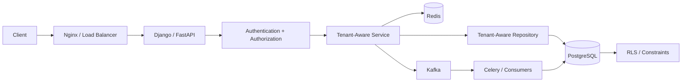

# 04- Query Patterns

## Overview

Multi-tenant SQL queries must solve two problems simultaneously:

1. Return the correct business result.
2. Enforce the tenant boundary.

A query can be logically correct and still be a security vulnerability if it omits tenant scoping.

For a shared-schema PostgreSQL database, the fundamental pattern is:

```sql
WHERE tenant_id = $1
```

But production query design goes beyond adding one predicate. Tenant-aware queries must account for:

- Joins.
- Aggregations.
- Subqueries.
- `EXISTS`.
- Pagination.
- Sorting.
- Updates and deletes.
- Bulk operations.
- Soft deletion.
- Authorization.
- Row-Level Security.
- Indexes.
- Concurrency.
- Background workers.
- Reporting.
- Large tenants.

The goal is to make tenant isolation a property of the entire query pattern rather than an afterthought.

---

## Tenant-Aware Query Mental Model

A useful mental model is:

```text
Request
   ↓
Authenticated User
   ↓
Tenant Membership
   ↓
Tenant Context
   ↓
Authorization
   ↓
Tenant-Scoped SQL
   ↓
PostgreSQL
   ↓
Tenant-Scoped Result
```

For a tenant-owned resource:

```text
tenant_id
    ↓
WHERE / JOIN / EXISTS / UPDATE / DELETE
    ↓
correct tenant rows
```

The tenant boundary should be preserved through every relational operation.

---

## Basic Tenant-Scoped Query

A simple list query:

```sql
SELECT
    id,
    name,
    status,
    created_at
FROM projects
WHERE tenant_id = $1
  AND deleted_at IS NULL
ORDER BY created_at DESC, id DESC
LIMIT 50;
```

The important characteristics are:

- Tenant filtering is explicit.
- Soft-deleted rows are excluded.
- Results are bounded.
- Ordering is deterministic.

---

## Point Lookup

A tenant-scoped resource lookup should include both:

```text
tenant_id
+
resource_id
```

Example:

```sql
SELECT
    id,
    name,
    status,
    created_at
FROM projects
WHERE tenant_id = $1
  AND id = $2
  AND deleted_at IS NULL;
```

This is preferable to:

```sql
SELECT *
FROM projects
WHERE id = $1;
```

when the resource is tenant-owned.

---

## Why the Tenant Predicate Matters

Suppose:

```text
Tenant A → project 100
Tenant B → project 200
```

A query:

```sql
SELECT *
FROM projects
WHERE id = $1;
```

may return the correct row for normal requests.

But authorization becomes dependent on code elsewhere.

The safer access pattern is:

```sql
SELECT *
FROM projects
WHERE tenant_id = $1
  AND id = $2;
```

Now the data-access operation itself expresses the security boundary.

---

## INSERT Queries

For tenant-owned data, the application should derive `tenant_id` from trusted context.

Example:

```sql
INSERT INTO projects (
    id,
    tenant_id,
    name,
    status
)
VALUES (
    $1,
    $2,
    $3,
    'ACTIVE'
)
RETURNING id, tenant_id, name, status;
```

Do not trust a client to establish ownership merely because it supplied a valid tenant ID.

The application should first establish:

```text
authenticated user
    ↓
membership
    ↓
authorized tenant
    ↓
INSERT
```

---

## UPDATE Queries

A tenant-aware update should scope the target row:

```sql
UPDATE projects
SET
    name = $3,
    updated_at = now()
WHERE tenant_id = $1
  AND id = $2
  AND deleted_at IS NULL
RETURNING id, name, status, updated_at;
```

This prevents an update from accidentally modifying another tenant's resource.

Checking the number of affected rows can also distinguish:

```text
not found
```

from:

```text
not accessible in this tenant
```

without revealing unnecessary information to the caller.

---

## DELETE Queries

Hard deletion:

```sql
DELETE FROM projects
WHERE tenant_id = $1
  AND id = $2;
```

Soft deletion:

```sql
UPDATE projects
SET deleted_at = now()
WHERE tenant_id = $1
  AND id = $2
  AND deleted_at IS NULL;
```

For large production systems, soft deletion is often preferable for recoverable business resources, but it should not be used automatically for every table.

---

## Tenant-Scoped Joins

Consider:

```text
tenants
  ↓
projects
  ↓
tasks
```

A typical query:

```sql
SELECT
    p.id AS project_id,
    p.name AS project_name,
    t.id AS task_id,
    t.title
FROM projects AS p
JOIN tasks AS t
  ON t.project_id = p.id
WHERE p.tenant_id = $1
  AND p.deleted_at IS NULL;
```

If the relationship guarantees that every task belongs to its project's tenant, filtering the root tenant may be sufficient.

If both tables explicitly store `tenant_id`, the query can also make the boundary explicit:

```sql
SELECT
    p.id AS project_id,
    p.name AS project_name,
    t.id AS task_id,
    t.title
FROM projects AS p
JOIN tasks AS t
  ON t.project_id = p.id
 AND t.tenant_id = p.tenant_id
WHERE p.tenant_id = $1
  AND p.deleted_at IS NULL;
```

The latter can make tenant consistency more visible and may protect against malformed data.

---

## Filtering in `ON` vs `WHERE`

For inner joins, predicates can often be moved between `ON` and `WHERE` without changing the result.

For outer joins, they are not equivalent.

Consider:

```sql
SELECT
    p.id,
    p.name,
    t.id AS task_id
FROM projects AS p
LEFT JOIN tasks AS t
  ON t.project_id = p.id
 AND t.tenant_id = $1
WHERE p.tenant_id = $1;
```

This preserves projects even when no matching tenant-scoped task exists.

Moving the task condition into `WHERE` can effectively turn the outer join into a filtering operation.

Tenant predicates should therefore be placed according to the intended join semantics.

---

## Joining Tenant Membership

A common authorization query is:

```sql
SELECT
    p.id,
    p.name
FROM projects AS p
JOIN tenant_memberships AS m
  ON m.tenant_id = p.tenant_id
WHERE m.tenant_id = $1
  AND m.user_id = $2
  AND m.status = 'ACTIVE'
  AND p.deleted_at IS NULL;
```

This combines:

```text
membership authorization
+
tenant resource access
```

The membership relationship should be backed by an appropriate uniqueness constraint such as:

```text
UNIQUE (tenant_id, user_id)
```

---

## `EXISTS` for Authorization

When only existence matters, `EXISTS` is often clearer than a join.

```sql
SELECT
    p.id,
    p.name
FROM projects AS p
WHERE p.tenant_id = $1
  AND p.deleted_at IS NULL
  AND EXISTS (
      SELECT 1
      FROM tenant_memberships AS m
      WHERE m.tenant_id = p.tenant_id
        AND m.user_id = $2
        AND m.status = 'ACTIVE'
  );
```

This expresses:

> Return the project only if the user has an active membership in the same tenant.

The PostgreSQL planner may implement this using a semi-join, so do not assume `EXISTS` is always faster than a join.

---

## `NOT EXISTS` for Tenant-Safe Exclusion

Example:

```sql
SELECT
    p.id,
    p.name
FROM projects AS p
WHERE p.tenant_id = $1
  AND NOT EXISTS (
      SELECT 1
      FROM project_memberships AS pm
      WHERE pm.tenant_id = p.tenant_id
        AND pm.project_id = p.id
        AND pm.user_id = $2
  );
```

`NOT EXISTS` is generally preferable to `NOT IN` when nullable values could otherwise create unexpected three-valued logic behavior.

---

## Avoiding Cross-Tenant `IN` Queries

Potentially dangerous:

```sql
SELECT *
FROM projects
WHERE id IN ($1, $2, $3);
```

Safer:

```sql
SELECT *
FROM projects
WHERE tenant_id = $1
  AND id = ANY($2::uuid[]);
```

The tenant boundary remains explicit.

For very large ID collections, consider passing IDs through:

- `unnest()`.
- `VALUES`.
- Temporary tables.
- Staging tables.

rather than generating enormous SQL statements.

---

## Filtering Related Resources

Suppose:

```text
projects
tasks
```

and the API asks:

```text
GET /projects/{project_id}/tasks
```

Use:

```sql
SELECT
    id,
    title,
    status,
    created_at
FROM tasks
WHERE tenant_id = $1
  AND project_id = $2
  AND deleted_at IS NULL
ORDER BY created_at DESC, id DESC
LIMIT 50;
```

Both the tenant and parent resource are scoped.

---

## Aggregation Queries

Tenant boundaries must be applied before aggregation when the aggregation represents tenant-owned data.

Example:

```sql
SELECT
    status,
    COUNT(*) AS project_count
FROM projects
WHERE tenant_id = $1
  AND deleted_at IS NULL
GROUP BY status
ORDER BY status;
```

This produces statistics for one tenant.

A dangerous query is:

```sql
SELECT
    status,
    COUNT(*) AS project_count
FROM projects
GROUP BY status;
```

when the API is intended to return tenant-specific statistics.

---

## Tenant-Scoped Aggregation Across Joins

Consider:

```text
tenant
  ↓
projects
  ↓
tasks
```

A query might calculate task counts:

```sql
SELECT
    p.id,
    p.name,
    COUNT(t.id) AS task_count
FROM projects AS p
LEFT JOIN tasks AS t
  ON t.project_id = p.id
 AND t.tenant_id = p.tenant_id
WHERE p.tenant_id = $1
  AND p.deleted_at IS NULL
GROUP BY p.id, p.name
ORDER BY p.id;
```

The tenant boundary is preserved in both:

```text
project filtering
+
task relationship
```

---

## Avoiding Aggregation Double Counting

Consider a tenant with:

```text
projects
tasks
members
```

Joining both one-to-many relationships can multiply rows.

For example:

```text
1 project
3 tasks
4 members

3 × 4 = 12 joined rows
```

A naive:

```sql
COUNT(t.id)
```

may therefore produce incorrect results.

Possible solutions include:

- Pre-aggregation.
- Separate correlated aggregates.
- `COUNT(DISTINCT ...)` where semantically correct.
- Separate queries.
- Materialized views for expensive reporting.

Example:

```sql
WITH task_counts AS (
    SELECT
        tenant_id,
        project_id,
        COUNT(*) AS task_count
    FROM tasks
    WHERE tenant_id = $1
    GROUP BY tenant_id, project_id
)
SELECT
    p.id,
    p.name,
    COALESCE(tc.task_count, 0) AS task_count
FROM projects AS p
LEFT JOIN task_counts AS tc
  ON tc.tenant_id = p.tenant_id
 AND tc.project_id = p.id
WHERE p.tenant_id = $1
  AND p.deleted_at IS NULL;
```

---

## Latest Row Per Tenant Resource

Suppose each project has status history.

To retrieve the latest status:

```sql
WITH ranked AS (
    SELECT
        project_id,
        tenant_id,
        status,
        changed_at,
        ROW_NUMBER() OVER (
            PARTITION BY tenant_id, project_id
            ORDER BY changed_at DESC, id DESC
        ) AS rn
    FROM project_status_history
    WHERE tenant_id = $1
)
SELECT
    project_id,
    status,
    changed_at
FROM ranked
WHERE rn = 1;
```

Including `tenant_id` in the partition makes the ownership boundary explicit.

The ordering must be deterministic.

---

## Top-N Per Tenant

For a platform-wide administrative report:

```sql
WITH ranked AS (
    SELECT
        tenant_id,
        id,
        name,
        created_at,
        ROW_NUMBER() OVER (
            PARTITION BY tenant_id
            ORDER BY created_at DESC, id DESC
        ) AS rn
    FROM projects
    WHERE deleted_at IS NULL
)
SELECT
    tenant_id,
    id,
    name,
    created_at
FROM ranked
WHERE rn <= 10;
```

This is useful when the operation intentionally spans tenants.

For ordinary tenant-facing APIs, prefer filtering to the current tenant rather than performing a global query and filtering later.

---

## Keyset Pagination

Offset pagination:

```sql
SELECT
    id,
    name,
    created_at
FROM projects
WHERE tenant_id = $1
ORDER BY created_at DESC, id DESC
LIMIT 50
OFFSET 50000;
```

becomes increasingly expensive as the offset grows.

Prefer keyset pagination:

```sql
SELECT
    id,
    name,
    created_at
FROM projects
WHERE tenant_id = $1
  AND (created_at, id) < ($2, $3)
ORDER BY created_at DESC, id DESC
LIMIT 50;
```

The cursor contains the last row from the previous page.

---

## Keyset Index

The query should be supported by an index aligned with the tenant filter and ordering:

```sql
CREATE INDEX projects_tenant_created_idx
ON projects (
    tenant_id,
    created_at DESC,
    id DESC
);
```

For soft-deleted data:

```sql
CREATE INDEX projects_tenant_created_active_idx
ON projects (
    tenant_id,
    created_at DESC,
    id DESC
)
WHERE deleted_at IS NULL;
```

The index should reflect the actual query predicate.

---

## Tenant-Scoped Search

Simple search:

```sql
SELECT
    id,
    name
FROM projects
WHERE tenant_id = $1
  AND deleted_at IS NULL
  AND name ILIKE $2
ORDER BY name, id
LIMIT 50;
```

For large-scale PostgreSQL text search, consider specialized indexing such as trigram or full-text search based on the actual search semantics.

Do not create a global search index and assume the tenant predicate will automatically make the workload efficient.

---

## Dynamic Sorting

User-selected sorting requires special care.

Do not parameterize SQL identifiers as values:

```sql
ORDER BY $2
```

This does not dynamically substitute a column identifier.

Instead, map API values to an allowlisted SQL expression.

Example application logic:

```python
SORT_COLUMNS = {
    "created": "created_at",
    "name": "name",
    "status": "status",
}

sort_column = SORT_COLUMNS.get(requested_sort)

if sort_column is None:
    raise ValueError("Unsupported sort field")
```

Then compose only trusted identifiers.

The tenant predicate must remain independent of the sorting choice.

---

## Bulk Updates

A tenant-scoped bulk update:

```sql
UPDATE projects
SET
    status = 'ARCHIVED',
    updated_at = now()
WHERE tenant_id = $1
  AND status = 'ACTIVE'
  AND deleted_at IS NULL;
```

Bulk operations are powerful but can affect many rows.

Consider:

- Lock duration.
- WAL generation.
- Replica lag.
- Transaction size.
- Trigger execution.
- Application timeouts.

For very large datasets, batch processing may be safer.

---

## Bulk Deletes

Avoid:

```sql
DELETE FROM projects
WHERE tenant_id = $1;
```

for a very large tenant inside one transaction unless the operational consequences are understood.

Large deletes can create:

```text
large WAL
+
long locks
+
vacuum pressure
+
replica lag
+
large rollback cost
```

Use controlled batches or archival workflows when appropriate.

---

## Batch Processing With Keyset Pagination

A worker can process tenant-owned data in batches:

```sql
SELECT
    id
FROM projects
WHERE tenant_id = $1
  AND id > $2
  AND deleted_at IS NULL
ORDER BY id
LIMIT 500;
```

The worker advances the cursor after successful processing.

This avoids repeatedly scanning increasingly large offsets.

---

## `FOR UPDATE` and Tenant Isolation

When locking a tenant-owned row:

```sql
SELECT
    id,
    status
FROM projects
WHERE tenant_id = $1
  AND id = $2
FOR UPDATE;
```

The tenant predicate remains essential.

Locking the wrong row does not become safe merely because it is locked.

---

## Atomic Tenant-Scoped Updates

For state transitions:

```sql
UPDATE projects
SET
    status = 'ARCHIVED',
    updated_at = now()
WHERE tenant_id = $1
  AND id = $2
  AND status = 'ACTIVE'
RETURNING id, status;
```

This combines:

```text
tenant isolation
+
authorization boundary
+
state validation
+
atomic mutation
```

The affected-row count tells the application whether the transition occurred.

---

## Optimistic Concurrency

Suppose a project has a version:

```text
version = 7
```

The update can require that version:

```sql
UPDATE projects
SET
    name = $4,
    version = version + 1,
    updated_at = now()
WHERE tenant_id = $1
  AND id = $2
  AND version = $3
RETURNING id, name, version;
```

A zero-row result indicates that:

```text
resource changed
OR
resource does not belong to tenant
OR
resource does not exist
```

The application can map this to an appropriate API response without exposing unnecessary details.

---

## Tenant-Scoped Upsert

Suppose project names are unique within a tenant:

```sql
CREATE UNIQUE INDEX projects_tenant_name_uidx
ON projects (tenant_id, name);
```

Then:

```sql
INSERT INTO projects (
    id,
    tenant_id,
    name,
    status
)
VALUES (
    $1,
    $2,
    $3,
    'ACTIVE'
)
ON CONFLICT (tenant_id, name)
DO UPDATE
SET
    status = EXCLUDED.status,
    updated_at = now()
RETURNING id, tenant_id, name, status;
```

The unique constraint defines the conflict boundary.

This is much safer than implementing uniqueness only with a preceding application query.

---

## Idempotency

Tenant-scoped idempotency keys should include tenant identity in the uniqueness boundary when keys are not globally unique.

Example:

```sql
CREATE TABLE idempotency_keys (
    tenant_id UUID NOT NULL REFERENCES tenants(id),
    key TEXT NOT NULL,
    response JSONB,
    created_at TIMESTAMPTZ NOT NULL DEFAULT now(),

    PRIMARY KEY (tenant_id, key)
);
```

Then:

```text
Tenant A + request-key-123
```

is independent from:

```text
Tenant B + request-key-123
```

This is an important consideration for multi-tenant APIs.

---

## Tenant-Scoped Existence Checks

Use `EXISTS` when the API needs only a boolean:

```sql
SELECT EXISTS (
    SELECT 1
    FROM projects
    WHERE tenant_id = $1
      AND id = $2
      AND deleted_at IS NULL
);
```

Avoid:

```sql
SELECT COUNT(*)
FROM projects
WHERE tenant_id = $1
  AND id = $2;
```

when only existence is required.

---

## Tenant-Scoped Counts

If the actual count is required:

```sql
SELECT COUNT(*)
FROM projects
WHERE tenant_id = $1
  AND deleted_at IS NULL;
```

For expensive counts over very large datasets, consider whether the product really needs an exact real-time value.

Alternatives include:

- Cached counts.
- Periodic aggregation.
- Materialized views.
- Precomputed counters.

Do not replace an exact count with an approximate value unless the product semantics allow it.

---

## Tenant-Scoped Reporting

Tenant reporting queries should explicitly define their scope.

Example:

```sql
SELECT
    DATE_TRUNC('day', created_at) AS day,
    COUNT(*) AS project_count
FROM projects
WHERE tenant_id = $1
  AND created_at >= $2
  AND created_at < $3
GROUP BY DATE_TRUNC('day', created_at)
ORDER BY day;
```

Use half-open time ranges:

```text
[start, end)
```

to avoid boundary duplication between adjacent reporting windows.

---

## Platform-Wide Reporting

Some operations intentionally cross tenant boundaries.

For example:

```sql
SELECT
    tenant_id,
    COUNT(*) AS project_count
FROM projects
WHERE deleted_at IS NULL
GROUP BY tenant_id;
```

This should be treated as a privileged platform operation, not reused casually by tenant-facing APIs.

Cross-tenant queries should have:

- Explicit authorization.
- Restricted database roles where appropriate.
- Auditing.
- Clear service ownership.

---

## Tenant-Scoped Views

A normal view can centralize commonly used query logic:

```sql
CREATE VIEW active_projects AS
SELECT
    id,
    tenant_id,
    name,
    status,
    created_at
FROM projects
WHERE deleted_at IS NULL;
```

However, the view itself does not automatically establish the current tenant.

Consumers still need:

```sql
WHERE tenant_id = $1
```

unless tenant isolation is separately enforced through RLS or another mechanism.

---

## Tenant-Aware RLS

If RLS is enabled:

```sql
ALTER TABLE projects ENABLE ROW LEVEL SECURITY;

CREATE POLICY projects_tenant_policy
ON projects
USING (
    tenant_id = current_setting('app.tenant_id')::uuid
)
WITH CHECK (
    tenant_id = current_setting('app.tenant_id')::uuid
);
```

Application queries can remain:

```sql
SELECT
    id,
    name,
    status
FROM projects
WHERE deleted_at IS NULL;
```

The database policy restricts the visible rows.

Even with RLS, explicit tenant predicates can still be valuable for:

- Query clarity.
- Index usage.
- Defense in depth.
- Code readability.
- Service-level intent.

---

## RLS and Administrative Queries

A privileged role may bypass RLS depending on its PostgreSQL privileges.

Therefore, administrative operations should not accidentally execute through the same assumptions as normal tenant traffic.

Use explicit administrative paths and audit them.

The database role used by the normal application should have the minimum privileges required.

---

## Django Query Patterns

A reusable tenant-scoped manager or repository can establish a consistent access pattern.

Example:

```python
def list_projects(*, tenant_id, limit=50):
    return (
        Project.objects
        .filter(
            tenant_id=tenant_id,
            deleted_at__isnull=True,
        )
        .order_by("-created_at", "-id")[:limit]
    )
```

For object retrieval:

```python
def get_project(*, tenant_id, project_id):
    return (
        Project.objects
        .filter(
            tenant_id=tenant_id,
            id=project_id,
            deleted_at__isnull=True,
        )
        .first()
    )
```

The repository interface makes tenant scope explicit.

---

## Django `Exists`

Django supports `Exists` for existence-based filtering:

```python
from django.db.models import Exists, OuterRef

active_membership = TenantMembership.objects.filter(
    tenant_id=OuterRef("tenant_id"),
    user_id=user_id,
    status="ACTIVE",
)

projects = (
    Project.objects
    .filter(
        tenant_id=tenant_id,
        deleted_at__isnull=True,
    )
    .annotate(
        has_membership=Exists(active_membership),
    )
)
```

Keep the tenant scope explicit rather than assuming the ORM relationship automatically provides authorization.

---

## FastAPI Query Pattern

A typical endpoint flow:

```python
@app.get("/projects")
def list_projects(
    tenant=Depends(get_current_tenant),
):
    return project_service.list(
        tenant_id=tenant.id,
    )
```

The service layer then executes:

```text
tenant_id
    ↓
repository
    ↓
PostgreSQL
```

The endpoint should not rely on a client-provided tenant ID as the sole authorization mechanism.

---

## SQLAlchemy Query Pattern

Example:

```python
stmt = (
    select(Project)
    .where(
        Project.tenant_id == tenant_id,
        Project.deleted_at.is_(None),
    )
    .order_by(
        Project.created_at.desc(),
        Project.id.desc(),
    )
    .limit(50)
)
```

The tenant ID should be passed explicitly through the service/repository boundary.

---

## N+1 Queries in Multi-Tenant Applications

A tenant-aware application can still suffer from N+1 queries.

Bad pattern:

```text
GET projects
    ↓
query projects
    ↓
for each project:
    query owner
    query task count
```

For 100 projects:

```text
1 + 100 + 100 ...
```

queries can be generated.

Prefer:

- Joins.
- `select_related`.
- `prefetch_related`.
- Aggregation.
- Batch loading.

Tenant scoping must remain intact in those optimized queries.

---

## API Projection

Avoid:

```sql
SELECT *
FROM projects
WHERE tenant_id = $1;
```

Prefer explicit columns:

```sql
SELECT
    id,
    name,
    status,
    created_at
FROM projects
WHERE tenant_id = $1
  AND deleted_at IS NULL;
```

Benefits include:

- Smaller network payloads.
- Less database I/O.
- Better API contracts.
- Lower serialization cost.
- Reduced accidental exposure of internal columns.

---

## Security Considerations

Tenant-aware SQL should protect against:

### Cross-Tenant Reads

```text
Tenant A → Tenant B row
```

### Cross-Tenant Updates

```text
Tenant A → UPDATE Tenant B
```

### Cross-Tenant Deletes

```text
Tenant A → DELETE Tenant B
```

### Cross-Tenant Aggregation

```text
Tenant A API → statistics containing Tenant B
```

### Cross-Tenant Search

```text
Tenant A search → Tenant B records
```

### Cache Leakage

```text
Tenant A request → Tenant B cached response
```

### Event Leakage

```text
Tenant A consumer → Tenant B event data
```

---

## Parameterization

Tenant IDs and user-provided values must be parameterized.

Example:

```sql
SELECT
    id,
    name
FROM projects
WHERE tenant_id = $1
  AND name = $2;
```

Parameterization protects values from SQL injection.

It does not make dynamic SQL identifiers safe.

For dynamic:

```text
ORDER BY
table names
column names
```

use strict allowlists or safe identifier composition.

---

## Query Performance

Tenant predicates affect execution plans.

Always verify important queries with:

```sql
EXPLAIN (ANALYZE, BUFFERS)
SELECT
    id,
    name
FROM projects
WHERE tenant_id = $1
  AND deleted_at IS NULL
ORDER BY created_at DESC, id DESC
LIMIT 50;
```

Inspect:

- Estimated rows.
- Actual rows.
- Index scans.
- Sequential scans.
- Sort operations.
- Buffer reads.
- Execution time.

Do not assume a tenant predicate automatically means an index will be used.

---

## Tenant Data Distribution

Consider:

```text
Tenant A → 100 rows
Tenant B → 100,000 rows
Tenant C → 100,000,000 rows
```

A query may behave very differently depending on the tenant.

Benchmark:

```text
small tenant
medium tenant
large tenant
```

and test production-like data distributions.

---

## Parameter-Sensitive Plans

A shared table can have highly skewed tenant sizes.

One tenant may match:

```text
10 rows
```

while another matches:

```text
100 million rows
```

A query plan that is efficient for one tenant may not be ideal for another.

Monitor real production plans and latency rather than relying solely on one benchmark tenant.

---

## Connection Pooling

Tenant context must be handled carefully when using:

```text
Django
FastAPI
SQLAlchemy
PgBouncer
```

A PostgreSQL connection is reusable.

Therefore:

```text
Request A → Tenant A
Request B → Tenant B
```

must never allow tenant-specific session state from Request A to remain active for Request B.

Transaction-scoped context is preferable when using session settings for RLS.

---

## Background Query Patterns

Celery workers should query using explicit tenant context:

```sql
SELECT
    id,
    status
FROM projects
WHERE tenant_id = $1
  AND id = $2;
```

Do not assume:

```text
task.project_id
```

is globally authorized.

The worker should validate tenant ownership before processing.

---

## Kafka Consumer Query Patterns

A consumer may receive:

```json
{
  "tenant_id": "tenant-123",
  "project_id": "project-456"
}
```

The database query should preserve both:

```text
tenant_id
+
resource identity
```

Example:

```sql
UPDATE projects
SET status = $3,
    updated_at = now()
WHERE tenant_id = $1
  AND id = $2;
```

This prevents an event with an incorrect resource identifier from accidentally modifying another tenant's data.

---

## Redis Query Boundary

Redis is not SQL, but the same isolation principle applies.

Prefer:

```text
tenant:{tenant_id}:project:{project_id}
```

over:

```text
project:{project_id}
```

when project identifiers are not globally unique.

Database isolation must remain authoritative even when Redis is used as a cache.

---

## Common Mistakes

### Missing Tenant Predicate

```sql
SELECT *
FROM projects
WHERE id = $1;
```

**Problem:** authorization depends entirely on another layer.

**Fix:**

```sql
WHERE tenant_id = $1
  AND id = $2
```

### Tenant Predicate Only on SELECT

Developers may scope reads but forget:

```text
UPDATE
DELETE
INSERT
bulk operations
```

Isolation must cover the complete CRUD lifecycle.

### Filtering After the Query

Dangerous:

```python
projects = Project.objects.all()
projects = [p for p in projects if p.tenant_id == tenant_id]
```

The database has already returned potentially unauthorized data.

Filter in SQL.

### Unscoped Joins

A root tenant filter may not protect malformed child relationships.

Where both tables carry tenant identity, consider enforcing and querying:

```text
parent.tenant_id = child.tenant_id
```

### Global Uniqueness

Using:

```sql
UNIQUE(name)
```

when uniqueness is tenant-local incorrectly prevents different tenants from using the same name.

### Unsafe Dynamic SQL

Do not interpolate user-controlled sort fields or table names directly into SQL.

### Unbounded Tenant Queries

A single tenant can have millions of rows.

Always consider:

```text
LIMIT
pagination
date ranges
batching
```

### `COUNT(*)` for Existence

Use `EXISTS` when the application needs only a boolean.

### `OFFSET` at Scale

Deep offsets can become increasingly expensive.

Prefer keyset pagination for large tenant datasets.

### Forgetting Soft-Delete Semantics

If deleted resources must be hidden, consistently apply:

```sql
deleted_at IS NULL
```

or centralize the behavior through carefully designed repository/query abstractions.

### Trusting Client Tenant IDs

A client can send:

```text
tenant_id = another tenant
```

The server must validate membership and authorization.

---

## Production Query Review Checklist

Before approving a tenant-scoped query, ask:

### Correctness

- [ ] Is the result grain correct?
- [ ] Are joins producing duplicate rows?
- [ ] Are NULL semantics correct?
- [ ] Are aggregation results correct?

### Isolation

- [ ] Is tenant ownership explicit?
- [ ] Is the tenant boundary present?
- [ ] Are related tables scoped correctly?
- [ ] Can a cross-tenant resource ID be supplied?
- [ ] Does the mutation enforce the tenant boundary?

### Security

- [ ] Is authorization performed?
- [ ] Are values parameterized?
- [ ] Are dynamic identifiers allowlisted?
- [ ] Is privileged cross-tenant access explicit and audited?

### Performance

- [ ] Is the query bounded?
- [ ] Is pagination appropriate?
- [ ] Is the index aligned with the access pattern?
- [ ] Has `EXPLAIN (ANALYZE, BUFFERS)` been reviewed?
- [ ] Has large-tenant behavior been tested?

### Operations

- [ ] Is the transaction appropriately sized?
- [ ] Could the query create lock contention?
- [ ] Could it generate significant WAL?
- [ ] Could it cause replica lag?
- [ ] Is it safe to retry?

---

## Senior Query Design Framework

For every tenant-scoped query, reason in this order:

```text
1. What is the business result?
        ↓
2. What is the result grain?
        ↓
3. What owns the data?
        ↓
4. Where is tenant context established?
        ↓
5. Which tables participate?
        ↓
6. Can joins multiply rows?
        ↓
7. Is EXISTS more appropriate?
        ↓
8. Is the query bounded?
        ↓
9. Which index supports it?
        ↓
10. What happens for the largest tenant?
        ↓
11. What happens under concurrency?
        ↓
12. What happens during retries/failure?
```

This prevents security, correctness, and performance from being considered independently.

---

## Query Pattern Decision Matrix

| Requirement | Preferred pattern |
|---|---|
| Get one tenant resource | `WHERE tenant_id = ? AND id = ?` |
| Tenant list | Tenant filter + deterministic pagination |
| Large tenant list | Keyset pagination |
| Check existence | `EXISTS` |
| Exclude related rows | `NOT EXISTS` |
| Tenant aggregation | Tenant filter before `GROUP BY` |
| Latest row per resource | `ROW_NUMBER()` |
| Top-N per tenant | Window function + tenant partition |
| Tenant-local uniqueness | Composite `UNIQUE` |
| Tenant-safe upsert | `ON CONFLICT` on tenant-aware key |
| Atomic state transition | Tenant filter + expected state |
| Concurrent mutation | Conditional update or row lock |
| Bulk processing | Bounded batches |
| Cross-tenant reporting | Explicit privileged query |
| Strong DB enforcement | PostgreSQL RLS |
| Background processing | Explicit tenant context |
| Tenant-aware caching | Tenant-inclusive cache keys |

---

## Recommended Architecture

A production SaaS application should make tenant scope visible throughout the stack:



The critical invariant is:

```text
tenant context
    ↓
must survive every boundary
```

not merely:

```text
HTTP request
    ↓
SQL query
```

---

## Production Principles

A mature multi-tenant query layer should follow these principles:

- Make tenant scope explicit in data-access APIs.
- Use database constraints to enforce tenant consistency.
- Use RLS when database-level defense in depth is valuable.
- Keep queries bounded.
- Prefer keyset pagination for large datasets.
- Use `EXISTS` when existence is the actual requirement.
- Pre-aggregate before joining multiple one-to-many relationships.
- Use composite indexes aligned with tenant-aware access patterns.
- Test with highly uneven tenant sizes.
- Preserve tenant context in Celery, Kafka, Redis, and microservices.
- Treat cross-tenant queries as privileged operations.
- Verify important queries using real execution plans.
- Keep authorization separate from identifier secrecy.
- Design mutations for safe retries and concurrency.

## Key Takeaways

- **A tenant-aware query must preserve the tenant boundary through reads, joins, aggregations, subqueries, updates, deletes, pagination, and background processing—not just simple `SELECT` statements.**
- **Tenant filtering should be combined with database constraints, appropriate indexes, authorization, and optionally PostgreSQL RLS to create defense in depth.**
- **Query correctness still matters inside a tenant: join cardinality, aggregation double-counting, deterministic ordering, NULL semantics, and pagination can all produce incorrect results without violating tenant isolation.**
- **Performance must be evaluated against real tenant-size distributions; keyset pagination, tenant-aware indexes, bounded queries, and batch processing become increasingly important for large tenants.**
- **Senior multi-tenant query design treats tenant context as an end-to-end invariant spanning Django/FastAPI, PostgreSQL, Redis, Kafka, Celery, microservices, transactions, retries, and privileged operations.**