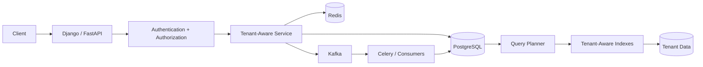

# 05- Indexing Strategy

## Overview

Indexing is one of the most important performance concerns in a shared-schema multi-tenant PostgreSQL database.

A multi-tenant workload typically has a dominant access pattern:

```text
WHERE tenant_id = ?
```

This changes how indexes should be designed.

A good index must support the actual combination of:

```text
tenant filtering
+
resource lookup
+
status filtering
+
JOIN conditions
+
ORDER BY
+
pagination
```

The goal is not to create an index on every `tenant_id` column. The goal is to create a small, intentional set of indexes that efficiently supports the application's real query patterns while controlling write amplification, storage, vacuum overhead, and operational complexity.

---

## Why Indexing Is Different in Multi-Tenant Systems

Consider a shared `projects` table:

```text
Tenant A →       100 rows
Tenant B →     5,000 rows
Tenant C → 50,000,000 rows
```

A query such as:

```sql
SELECT
    id,
    name,
    created_at
FROM projects
WHERE tenant_id = $1
ORDER BY created_at DESC, id DESC
LIMIT 50;
```

must efficiently locate rows belonging to one tenant and return them in the required order.

A suitable index is:

```sql
CREATE INDEX projects_tenant_created_idx
ON projects (
    tenant_id,
    created_at DESC,
    id DESC
);
```

The index supports both:

```text
tenant filtering
```

and:

```text
deterministic ordering
```

This becomes particularly important when one tenant is much larger than another.

---

## Indexing Goals

A production multi-tenant indexing strategy should optimize for:

- Tenant-scoped point lookups.
- Tenant-scoped lists.
- Keyset pagination.
- Tenant-local uniqueness.
- Authorization queries.
- Joins between tenant-owned tables.
- Status filtering.
- Time-range queries.
- Soft-deleted data.
- Background workers.
- Audit and usage queries.
- Common reporting queries.

At the same time, avoid:

- Redundant indexes.
- Excessive composite indexes.
- Indexes that do not match real queries.
- Indexes created only because a column "looks important."
- Excessive write amplification.

---

## PostgreSQL Index Fundamentals

An index is an additional data structure that provides an alternative access path to a table.

Without a useful index:

```text
Query
  ↓
Sequential Scan
  ↓
inspect many table rows
```

With an appropriate index:

```text
Query
  ↓
Index Scan
  ↓
relevant rows
  ↓
table access if required
```

The PostgreSQL planner chooses the access path based on:

- Estimated cost.
- Table statistics.
- Selectivity.
- Available indexes.
- Ordering requirements.
- Expected row count.
- Query predicates.

Creating an index does not guarantee that PostgreSQL will use it.

---

## B-Tree as the Default

For typical SaaS queries, PostgreSQL B-tree indexes are the default choice.

They work well for:

```text
=
<
<=
>
>=
BETWEEN
ORDER BY
```

Example:

```sql
CREATE INDEX projects_tenant_id_idx
ON projects (tenant_id);
```

B-tree indexes are suitable for most:

- Tenant lookups.
- Composite indexes.
- Sorting.
- Keyset pagination.
- Timestamp ranges.
- Unique constraints.

Other index types such as GIN, GiST, BRIN, and hash indexes have specialized use cases.

---

## Primary Keys and Tenant Isolation

A primary key such as:

```sql
PRIMARY KEY (id)
```

provides efficient global resource lookup.

However, it does not replace tenant scoping.

Prefer:

```sql
SELECT
    id,
    name
FROM projects
WHERE tenant_id = $1
  AND id = $2;
```

Even if `id` is globally unique, the tenant predicate remains valuable for:

- Authorization.
- Defense in depth.
- RLS interaction.
- Consistent repository patterns.
- Preventing accidental cross-tenant access.

The primary key and tenant boundary solve different problems.

---

## Tenant-First Indexes

A common index is:

```sql
CREATE INDEX projects_tenant_idx
ON projects (tenant_id);
```

This is useful when queries primarily filter by tenant.

However, a more specific access pattern may need a composite index:

```sql
CREATE INDEX projects_tenant_status_idx
ON projects (
    tenant_id,
    status
);
```

for:

```sql
SELECT
    id,
    name
FROM projects
WHERE tenant_id = $1
  AND status = $2;
```

The index should be derived from the query workload rather than from the table definition.

---

## Composite Index Column Order

Column order matters.

Consider:

```sql
CREATE INDEX projects_tenant_status_created_idx
ON projects (
    tenant_id,
    status,
    created_at DESC
);
```

This is well aligned with:

```sql
WHERE tenant_id = $1
  AND status = $2
ORDER BY created_at DESC;
```

But it is not automatically the best index for:

```sql
WHERE status = $1
```

or:

```sql
ORDER BY created_at DESC
```

without tenant filtering.

The leftmost portion of a B-tree index matters significantly.

---

## Tenant + Primary Key Lookup

If the application frequently performs:

```sql
SELECT
    id,
    name,
    status
FROM projects
WHERE tenant_id = $1
  AND id = $2;
```

a composite index:

```sql
CREATE INDEX projects_tenant_id_id_idx
ON projects (tenant_id, id);
```

may be unnecessary when `id` is already globally unique and indexed.

This is an important optimization principle:

> Do not create a tenant-prefixed index merely because a query contains `tenant_id`; evaluate whether an existing primary key or unique index already provides an efficient access path.

The composite index becomes more valuable when the key is tenant-local or when it supports another query pattern.

---

## Tenant-Local Identifiers

If identifiers are unique only within a tenant:

```text
Tenant A → external_id = 100
Tenant B → external_id = 100
```

then:

```sql
CREATE UNIQUE INDEX projects_tenant_external_uidx
ON projects (tenant_id, external_id);
```

supports:

```sql
SELECT
    id,
    name
FROM projects
WHERE tenant_id = $1
  AND external_id = $2;
```

The uniqueness boundary and lookup boundary are aligned.

---

## Tenant-Scoped Uniqueness

Suppose project names are unique within a tenant:

```sql
CREATE UNIQUE INDEX projects_tenant_name_uidx
ON projects (tenant_id, name);
```

This enforces:

```text
Tenant A → Analytics
Tenant A → Analytics   ← rejected

Tenant B → Analytics   ← allowed
```

Database-enforced uniqueness is preferable to:

```text
SELECT first
IF not found:
    INSERT
```

because concurrent requests can race.

---

## Soft Delete and Partial Indexes

Suppose active projects are defined by:

```text
deleted_at IS NULL
```

A partial index can target only active rows:

```sql
CREATE INDEX projects_tenant_created_active_idx
ON projects (
    tenant_id,
    created_at DESC,
    id DESC
)
WHERE deleted_at IS NULL;
```

This can reduce index size when a significant percentage of rows are deleted.

For tenant-local active names:

```sql
CREATE UNIQUE INDEX projects_tenant_name_active_uidx
ON projects (tenant_id, name)
WHERE deleted_at IS NULL;
```

Partial indexes are especially useful when the application repeatedly queries a stable subset of a large table.

---

## Keyset Pagination Index

A common SaaS API query is:

```sql
SELECT
    id,
    name,
    created_at
FROM projects
WHERE tenant_id = $1
  AND deleted_at IS NULL
  AND (created_at, id) < ($2, $3)
ORDER BY created_at DESC, id DESC
LIMIT 50;
```

A matching index is:

```sql
CREATE INDEX projects_tenant_created_active_idx
ON projects (
    tenant_id,
    created_at DESC,
    id DESC
)
WHERE deleted_at IS NULL;
```

This is a strong multi-tenant pagination pattern.

---

## Why the Tie-Breaker Matters

Using:

```sql
ORDER BY created_at DESC
```

alone can produce unstable pagination when multiple rows share the same timestamp.

Prefer:

```sql
ORDER BY created_at DESC, id DESC
```

and use the same ordering in the cursor:

```sql
(created_at, id) < ($cursor_created_at, $cursor_id)
```

The `id` provides a deterministic tie-breaker.

---

## Status + Time Queries

Consider:

```sql
SELECT
    id,
    name,
    created_at
FROM projects
WHERE tenant_id = $1
  AND status = 'ACTIVE'
  AND created_at >= $2
  AND created_at < $3
ORDER BY created_at DESC, id DESC
LIMIT 100;
```

A possible index is:

```sql
CREATE INDEX projects_tenant_status_created_idx
ON projects (
    tenant_id,
    status,
    created_at DESC,
    id DESC
);
```

The best column order depends on:

- Equality predicates.
- Range predicates.
- Ordering.
- Data distribution.
- Query frequency.

---

## Authorization Queries

Membership lookup is usually frequent:

```sql
SELECT
    role,
    status
FROM tenant_memberships
WHERE tenant_id = $1
  AND user_id = $2;
```

The relationship should have an appropriate unique constraint:

```sql
CREATE UNIQUE INDEX tenant_memberships_tenant_user_uidx
ON tenant_memberships (tenant_id, user_id);
```

This simultaneously provides:

```text
integrity
+
fast authorization lookup
```

A unique constraint is therefore often both a correctness mechanism and a performance mechanism.

---

## Project Membership Queries

For:

```sql
SELECT 1
FROM project_memberships
WHERE tenant_id = $1
  AND project_id = $2
  AND user_id = $3;
```

a suitable index might be:

```sql
CREATE INDEX project_memberships_tenant_project_user_idx
ON project_memberships (
    tenant_id,
    project_id,
    user_id
);
```

If the exact relationship is unique, a unique constraint may be more appropriate.

Choose the key order based on the dominant query patterns.

---

## Foreign Key Indexing

PostgreSQL does not automatically create an index on the referencing side of every foreign key.

For a tenant-owned relationship:

```text
projects
    ↓
tasks
```

queries may commonly use:

```sql
WHERE tenant_id = $1
  AND project_id = $2
```

An index such as:

```sql
CREATE INDEX tasks_tenant_project_idx
ON tasks (tenant_id, project_id);
```

can support these operations.

This can also improve the performance of deletes or updates involving referenced parent rows because PostgreSQL may need to check referencing rows.

---

## Join Indexes

Consider:

```sql
SELECT
    p.id,
    p.name,
    t.id,
    t.title
FROM projects AS p
JOIN tasks AS t
  ON t.tenant_id = p.tenant_id
 AND t.project_id = p.id
WHERE p.tenant_id = $1;
```

Useful indexes may include:

```text
projects:
(tenant_id, ...)

tasks:
(tenant_id, project_id, ...)
```

The exact design depends on:

- Join direction.
- Cardinality.
- Additional filters.
- Result ordering.

Do not index every foreign key combination automatically.

---

## `EXISTS` Indexes

For:

```sql
SELECT EXISTS (
    SELECT 1
    FROM tenant_memberships
    WHERE tenant_id = $1
      AND user_id = $2
      AND status = 'ACTIVE'
);
```

an index beginning with:

```text
tenant_id, user_id
```

is usually more relevant than an index only on:

```text
status
```

If active membership is the dominant state, a partial index may be useful:

```sql
CREATE INDEX tenant_memberships_active_lookup_idx
ON tenant_memberships (tenant_id, user_id)
WHERE status = 'ACTIVE';
```

Use this only if workload and data distribution justify it.

---

## Partial Indexes for Queue Workers

Suppose Celery workers process tenant-scoped jobs:

```sql
SELECT
    id,
    tenant_id,
    payload
FROM background_jobs
WHERE status = 'PENDING'
ORDER BY created_at
FOR UPDATE SKIP LOCKED
LIMIT 100;
```

A partial index can reduce the indexed data:

```sql
CREATE INDEX background_jobs_pending_idx
ON background_jobs (created_at, id)
WHERE status = 'PENDING';
```

If the worker is also tenant-scoped:

```sql
CREATE INDEX background_jobs_tenant_pending_idx
ON background_jobs (
    tenant_id,
    created_at,
    id
)
WHERE status = 'PENDING';
```

The correct choice depends on whether workers process globally or per tenant.

---

## Indexing Audit Logs

Typical query:

```sql
SELECT
    id,
    actor_user_id,
    action,
    resource_type,
    resource_id,
    created_at
FROM audit_logs
WHERE tenant_id = $1
  AND created_at >= $2
  AND created_at < $3
ORDER BY created_at DESC, id DESC
LIMIT 100;
```

A suitable index:

```sql
CREATE INDEX audit_logs_tenant_created_idx
ON audit_logs (
    tenant_id,
    created_at DESC,
    id DESC
);
```

Audit tables can become very large, so retention and partitioning strategies may eventually become more important than adding more indexes.

---

## Indexing Usage Data

Typical query:

```sql
SELECT
    metric,
    SUM(quantity)
FROM usage_records
WHERE tenant_id = $1
  AND recorded_at >= $2
  AND recorded_at < $3
GROUP BY metric;
```

A candidate index is:

```sql
CREATE INDEX usage_records_tenant_recorded_idx
ON usage_records (
    tenant_id,
    recorded_at
);
```

For extremely high-volume usage data, consider:

```text
partitioning
+
daily aggregation
+
archival
```

rather than relying entirely on increasingly large indexes.

---

## Expression Indexes

Sometimes tenant queries use expressions.

Example:

```sql
SELECT
    id,
    email
FROM users
WHERE lower(email) = lower($1);
```

A matching expression index can be:

```sql
CREATE INDEX users_lower_email_idx
ON users (lower(email));
```

If email uniqueness is tenant-specific:

```sql
CREATE UNIQUE INDEX memberships_tenant_email_lower_uidx
ON tenant_memberships (tenant_id, lower(email));
```

Expression indexes are powerful but should be introduced only for stable, high-value access patterns.

---

## PostgreSQL `citext` vs Expression Index

Case-insensitive identifiers can be modeled using:

```text
citext
```

or:

```text
lower(column)
```

with an expression index.

The choice should be consistent with:

- Data semantics.
- Existing schema.
- ORM support.
- Migration strategy.
- Uniqueness requirements.

Do not use an expression index merely to compensate for an unclear data model.

---

## Covering Indexes

PostgreSQL supports `INCLUDE` columns.

Example:

```sql
CREATE INDEX projects_tenant_created_covering_idx
ON projects (
    tenant_id,
    created_at DESC,
    id DESC
)
INCLUDE (
    name,
    status
);
```

This can allow index-only scans when PostgreSQL's visibility requirements are satisfied.

However:

- Included columns increase index size.
- Index-only scans are workload- and visibility-dependent.
- More indexes increase write cost.

Use covering indexes only when measurements justify them.

---

## Index-Only Scans

An index-only scan can avoid fetching heap pages when:

```text
required columns are available in the index
+
visibility map permits it
```

For a frequently executed API query, this can reduce heap I/O.

However, do not assume:

```text
INCLUDE → always index-only
```

PostgreSQL still needs to consider tuple visibility and planner cost.

---

## Selectivity

Selectivity describes how effectively a predicate narrows the candidate rows.

For example:

```text
tenant_id = common tenant
```

may match millions of rows.

While:

```text
tenant_id = small tenant
AND project_id = specific ID
```

may match one row.

A tenant ID is not necessarily highly selective.

This matters when deciding whether:

```text
tenant_id
```

alone is sufficient or whether a composite index better represents the access pattern.

---

## Large vs Small Tenants

Tenant size distribution is critical.

Consider:

```text
9,999 tenants → < 10,000 rows each
1 tenant      → 500,000,000 rows
```

An index that works well for the majority may behave differently for the large tenant.

Performance testing should include:

```text
small tenant
medium tenant
large tenant
```

and, where appropriate:

```text
worst-case tenant
```

---

## Query Planner Behavior

PostgreSQL chooses plans based on estimated cost.

For example:

```text
small tenant
    ↓
Index Scan

large tenant
    ↓
Sequential Scan
```

The sequential scan may be the correct plan for a large tenant if the query needs a substantial portion of the table.

An index is not inherently better than a sequential scan.

The goal is:

> Efficient execution for the actual workload, not maximum index usage.

---

## Statistics

PostgreSQL relies on statistics to estimate:

```text
row counts
value distributions
selectivity
```

After substantial data changes, stale statistics can produce poor plans.

Use:

```sql
ANALYZE projects;
```

or rely on PostgreSQL's autovacuum/analyze mechanisms where configured appropriately.

For heavily skewed tenant data, inspect whether default statistics are sufficient.

Extended statistics may help when correlated columns produce poor cardinality estimates.

---

## Extended Statistics

Suppose:

```text
tenant_id
+
status
```

are strongly correlated.

The planner may misestimate:

```sql
WHERE tenant_id = $1
  AND status = $2
```

if it assumes independence.

PostgreSQL supports extended statistics for some multi-column dependencies and distinct-count relationships.

Example:

```sql
CREATE STATISTICS projects_tenant_status_stats
    (dependencies, ndistinct)
ON tenant_id, status
FROM projects;

ANALYZE projects;
```

Use this when execution plans demonstrate a real estimation problem rather than as a default configuration.

---

## `EXPLAIN` for Tenant Queries

Always inspect important queries:

```sql
EXPLAIN (ANALYZE, BUFFERS)
SELECT
    id,
    name,
    created_at
FROM projects
WHERE tenant_id = $1
  AND deleted_at IS NULL
ORDER BY created_at DESC, id DESC
LIMIT 50;
```

Look for:

- Index Scan.
- Index Only Scan.
- Sequential Scan.
- Sort.
- Estimated rows.
- Actual rows.
- Buffer reads.
- Execution time.

The objective is to understand the plan, not simply to see the word `Index`.

---

## Measuring Index Usage

PostgreSQL statistics can help identify index activity.

Example:

```sql
SELECT
    schemaname,
    relname,
    indexrelname,
    idx_scan,
    pg_size_pretty(pg_relation_size(indexrelid)) AS index_size
FROM pg_stat_user_indexes
ORDER BY pg_relation_size(indexrelid) DESC;
```

An index with low usage may be a candidate for review.

However:

```text
idx_scan = 0
```

does not automatically prove an index is unnecessary.

Consider:

- Measurement period.
- Rare but critical queries.
- Constraint enforcement.
- Failover/maintenance workloads.
- Recent deployment changes.
- Prepared-query behavior.
- Future workload changes.

---

## Redundant Indexes

Suppose a table has:

```sql
CREATE INDEX projects_tenant_idx
ON projects (tenant_id);

CREATE INDEX projects_tenant_created_idx
ON projects (tenant_id, created_at DESC);
```

The second index may support some workloads that the first cannot.

If no query benefits specifically from the single-column index, it may be redundant.

Index consolidation reduces:

```text
storage
+
write amplification
+
vacuum work
+
backup size
```

Do not remove an index without validating its usage and constraint role.

---

## Over-Indexing

Each index introduces cost during:

```text
INSERT
UPDATE
DELETE
VACUUM
REINDEX
backup
replication
```

For a high-write tenant table, five unnecessary indexes can be more harmful than one missing index.

A useful principle is:

> Optimize for the workload, not for the number of indexes.

---

## Under-Indexing

Typical symptoms include:

```text
slow tenant list APIs
slow authorization checks
slow joins
slow audit queries
deep pagination
high CPU
high buffer reads
```

Common causes:

- Missing tenant-leading composite index.
- Missing foreign-key index.
- Missing ordering columns.
- Missing partial index for a hot subset.
- Incorrect column order.

Use execution plans before changing indexes.

---

## Index and Write Amplification

Suppose a table has:

```text
1 primary key
+
8 secondary indexes
```

An insert may need to update multiple index structures.

Therefore:

```text
more indexes
    ↓
more write work
    ↓
more WAL
    ↓
more storage
    ↓
more replication traffic
```

High-write tables such as:

```text
usage_events
audit_logs
outbox_events
job queues
```

require especially careful indexing.

---

## HOT Updates

PostgreSQL can sometimes perform HOT updates when indexed columns do not need new index entries.

Updating an indexed column can prevent that optimization.

Therefore, unnecessary indexes can increase update overhead.

This is another reason to avoid indexing every frequently changing column.

---

## Index Bloat

Indexes can grow and become less efficient due to workload patterns and page usage.

Monitor:

```text
index size
dead tuples
vacuum behavior
write workload
```

Do not automatically rebuild indexes as routine maintenance.

Use PostgreSQL's normal maintenance mechanisms and investigate actual bloat before taking disruptive action.

---

## Creating Indexes in Production

For large production tables, consider:

```sql
CREATE INDEX CONCURRENTLY projects_tenant_created_idx
ON projects (
    tenant_id,
    created_at DESC,
    id DESC
);
```

`CREATE INDEX CONCURRENTLY` reduces blocking of normal writes compared with a regular index build.

However, it:

- Takes longer.
- Uses more work.
- Cannot run inside a transaction block.
- Requires operational planning.
- Can leave an invalid index after failure that may need cleanup.

Django migrations must account for the transaction behavior of concurrent index operations.

---

## Dropping Indexes Safely

Similarly:

```sql
DROP INDEX CONCURRENTLY IF EXISTS projects_old_idx;
```

is useful for production cleanup.

Before removing an index:

1. Check usage statistics.
2. Search application queries.
3. Check whether it backs a constraint.
4. Verify replacement indexes.
5. Monitor after removal.

Never remove production indexes solely because they appear unused over a short observation period.

---

## Multi-Tenant RLS and Indexing

RLS may automatically restrict rows:

```text
tenant_id = current tenant
```

but indexes are still important.

Example:

```sql
CREATE INDEX projects_tenant_created_idx
ON projects (
    tenant_id,
    created_at DESC,
    id DESC
);
```

The index can support tenant-aware access patterns even when the tenant restriction originates from an RLS policy.

RLS provides isolation; indexes provide efficient access paths.

They solve different problems.

---

## Partitioning vs Indexing

Partitioning should not be used simply because a table is large.

Possible partitioning dimensions include:

```text
time
tenant
tenant class
```

Partitioning by tenant can become problematic with a large number of tenants:

```text
100,000 tenants
    ↓
100,000 partitions
```

This creates substantial operational and metadata overhead.

For many SaaS workloads, partitioning by time or another bounded dimension is easier to operate.

---

## Tenant-Based Partitioning

Tenant partitioning can make sense when:

```text
tenant count is manageable
+
tenant sizes are large
+
isolation or lifecycle requirements justify it
```

It may help with:

- Large-tenant movement.
- Tenant-specific maintenance.
- Archival.
- Query pruning.

But it should not be treated as a default multi-tenancy technique.

---

## Indexes and Read Replicas

Indexes must exist on replicas as part of the replicated database state.

A read replica can reduce primary workload:

```text
API
 ├── writes → Primary
 └── reads  → Replica
```

But replica reads can be stale.

Tenant-sensitive operations that require read-after-write consistency may need to remain on the primary.

Indexing does not solve replica consistency.

---

## Read-After-Write Example

Suppose:

```text
Tenant A creates Project X
```

Then immediately:

```text
GET /projects
```

If the request goes to a lagging replica, Project X may not yet appear.

This is a consistency problem, not an indexing problem.

The architecture may route the request to the primary for a short consistency window or use another explicit consistency strategy.

---

## Background Worker Indexes

Workers frequently use patterns such as:

```sql
SELECT
    id,
    tenant_id
FROM background_jobs
WHERE status = 'PENDING'
ORDER BY created_at, id
FOR UPDATE SKIP LOCKED
LIMIT 100;
```

A partial index:

```sql
CREATE INDEX background_jobs_pending_idx
ON background_jobs (created_at, id)
WHERE status = 'PENDING';
```

can reduce the search space.

If jobs are processed per tenant, a tenant-aware variant may be appropriate.

---

## Redis and Database Indexing

Redis may absorb repeated hot lookups:

```text
API
 ↓
Redis
 ↓ cache miss
PostgreSQL
```

Caching does not eliminate the need for correct database indexes.

A cache miss should still execute an efficient tenant-scoped query.

Do not use Redis to hide an inefficient database access pattern indefinitely.

---

## Django Indexing

Django can express composite and conditional indexes:

```python
class Project(models.Model):
    tenant = models.ForeignKey(
        Tenant,
        on_delete=models.PROTECT,
    )
    name = models.CharField(max_length=255)
    status = models.CharField(max_length=32)
    created_at = models.DateTimeField(auto_now_add=True)
    deleted_at = models.DateTimeField(null=True, blank=True)

    class Meta:
        constraints = [
            models.UniqueConstraint(
                fields=["tenant", "name"],
                condition=models.Q(deleted_at__isnull=True),
                name="projects_tenant_name_active_uniq",
            ),
        ]
        indexes = [
            models.Index(
                fields=["tenant", "-created_at", "-id"],
                name="projects_tenant_created_idx",
            ),
        ]
```

Index definitions should remain synchronized with real query patterns.

---

## Django Query Inspection

Use Django's query tooling to inspect SQL:

```python
queryset = (
    Project.objects
    .filter(
        tenant_id=tenant_id,
        deleted_at__isnull=True,
    )
    .order_by("-created_at", "-id")[:50]
)

print(queryset.query)
```

For production optimization, inspect the resulting SQL using PostgreSQL's:

```sql
EXPLAIN (ANALYZE, BUFFERS)
```

rather than relying only on ORM abstractions.

---

## SQLAlchemy Indexing

SQLAlchemy can define composite indexes:

```python
from sqlalchemy import Index

Index(
    "projects_tenant_created_idx",
    Project.tenant_id,
    Project.created_at.desc(),
    Project.id.desc(),
)
```

The same database principles apply regardless of ORM:

```text
query pattern
    ↓
access path
    ↓
index
```

The ORM does not remove the need for database-level performance analysis.

---

## FastAPI Architecture

FastAPI itself does not determine indexing strategy.

A typical flow is:

```text
FastAPI
   ↓
service
   ↓
repository
   ↓
SQLAlchemy / psycopg
   ↓
PostgreSQL
```

The repository should expose tenant-aware operations:

```python
def list_projects(
    tenant_id,
    cursor_created_at,
    cursor_id,
    limit,
):
    ...
```

The underlying SQL should align with the corresponding composite index.

---

## Security Considerations

Indexing is primarily a performance mechanism, but it affects security indirectly.

Poor indexing can cause:

```text
slow authorization queries
```

which may lead teams to introduce unsafe shortcuts.

Indexes should support:

- Membership lookups.
- Tenant-scoped resource checks.
- Existence checks.
- Authorization predicates.
- Audit retrieval.

However:

> An index does not enforce authorization.

Only constraints, permissions, RLS, and application authorization can provide the corresponding security guarantees.

---

## Cost Considerations

Indexes consume:

```text
disk
memory
CPU
WAL
replication bandwidth
backup storage
maintenance time
```

In AWS environments, index growth can indirectly increase:

- Database storage requirements.
- Provisioned I/O requirements.
- Backup storage.
- Replica workload.
- Maintenance windows.

Index design should therefore be treated as a cost-management concern as well as a latency concern.

---

## High Availability Considerations

For a primary/standby PostgreSQL architecture:

```text
Primary
  ↓ WAL
Standby
```

Index changes generate WAL and must be replicated.

Large index creation can therefore affect:

```text
replication lag
+
I/O
+
CPU
```

Schedule major index operations carefully and monitor replicas during the operation.

---

## Disaster Recovery

Indexes are normally reconstructed as part of database recovery rather than treated as independent business data.

However, index definitions are part of the schema and should therefore be:

- Version controlled.
- Managed through migrations.
- Tested.
- Reproducible.

A restored database should have the same required indexing strategy as production.

---

## Monitoring

Monitor at least:

```text
query latency
index usage
index size
database I/O
buffer reads
CPU
WAL generation
replication lag
vacuum activity
lock waits
```

Useful PostgreSQL views include:

```text
pg_stat_user_indexes
pg_stat_user_tables
pg_stat_statements
```

where available and appropriately configured.

The most valuable workflow is:

```text
slow query
    ↓
EXPLAIN (ANALYZE, BUFFERS)
    ↓
identify access pattern
    ↓
design candidate index
    ↓
benchmark
    ↓
deploy
    ↓
monitor
```

---

## Production Index Review Workflow

When a tenant query is slow:

### Identify the exact query

Do not optimize a generic ORM operation.

Capture the actual SQL and parameters representative of the workload.

### Measure the execution plan

Use:

```sql
EXPLAIN (ANALYZE, BUFFERS)
...
```

### Identify the bottleneck

Determine whether the issue is:

```text
scan
sort
join
aggregation
poor estimates
I/O
lock waiting
network transfer
```

### Design the smallest useful index

Consider:

```text
tenant_id
+
equality predicates
+
range predicate
+
ORDER BY
```

### Test with realistic data

Include:

```text
small tenant
large tenant
high concurrency
production-like distribution
```

### Deploy safely

Use appropriate migration and index-build strategies.

### Verify production behavior

Compare:

```text
latency
CPU
I/O
WAL
replica lag
```

before and after the change.

---

## Common Mistakes

### Indexing Every `tenant_id`

Creating:

```sql
CREATE INDEX ON every_table (tenant_id);
```

is not automatically correct.

Some queries may require:

```text
tenant_id + status
tenant_id + created_at
tenant_id + foreign_key
```

while some tables may already have a suitable unique or primary-key access path.

### Ignoring Column Order

These are not equivalent:

```text
(tenant_id, status, created_at)
```

and:

```text
(status, tenant_id, created_at)
```

Choose based on actual predicates and ordering.

### Creating `(tenant_id, id)` Everywhere

If `id` is globally unique and already the primary key, the composite index may add little value.

Measure before creating it.

### Indexing Low-Value Columns

An index on:

```text
status
```

may be ineffective if:

```text
95% of rows = ACTIVE
```

A partial index or different composite strategy may be better.

### Forgetting Soft-Delete Predicates

If every query uses:

```text
deleted_at IS NULL
```

a partial index may provide a significantly smaller and more relevant access path.

### Ignoring Large Tenants

Testing only a 1,000-row tenant does not validate a system with a 100-million-row tenant.

### Assuming Index Usage Is Always Good

A sequential scan can be faster when a query needs a large percentage of a table.

### Adding Covering Indexes Too Early

`INCLUDE` columns increase index size and write cost.

Use them after measurement.

### Removing Indexes Too Quickly

An index with low `idx_scan` may still be required for a rare but important operation or constraint.

### Using Indexes to Hide Poor Query Design

An index cannot fix:

```text
N+1 queries
unbounded result sets
incorrect joins
large unnecessary aggregations
deep OFFSET pagination
```

Fix the query pattern first.

### Ignoring Write Cost

Every additional index affects write-heavy tenant tables.

### Treating Partitioning as an Index Replacement

Partitioning and indexing solve different problems.

### Assuming RLS Removes Index Requirements

RLS enforces visibility; indexes provide efficient access.

---

## Production Checklist

### Query Design

- [ ] Tenant predicates are explicit.
- [ ] Query result size is bounded.
- [ ] Keyset pagination is used where appropriate.
- [ ] Ordering is deterministic.
- [ ] Join cardinality is understood.
- [ ] Authorization queries are efficient.

### Index Design

- [ ] Indexes are based on actual query patterns.
- [ ] Composite column order is deliberate.
- [ ] Tenant-leading indexes are used where appropriate.
- [ ] Tenant-local uniqueness is enforced by constraints.
- [ ] Foreign-key access patterns are indexed where needed.
- [ ] Partial indexes are considered for stable hot subsets.
- [ ] Covering indexes are justified by measurements.
- [ ] Redundant indexes are periodically reviewed.

### Multi-Tenant Performance

- [ ] Small tenants are tested.
- [ ] Large tenants are tested.
- [ ] Data skew is represented.
- [ ] Noisy-neighbor behavior is understood.
- [ ] Query plans are checked for representative tenants.

### Operations

- [ ] Index migrations are safe for production.
- [ ] Large index builds are monitored.
- [ ] Replica lag is monitored during index operations.
- [ ] Index size is monitored.
- [ ] Index usage is monitored.
- [ ] Backup and restore include schema-managed indexes.

---

## Senior Decision Framework

For every candidate index, ask:

```text
What exact query does this support?
        ↓
What is the tenant boundary?
        ↓
What predicates are equality predicates?
        ↓
What predicates are range predicates?
        ↓
What ORDER BY must be supported?
        ↓
Can an existing index already support it?
        ↓
Would a partial index reduce unnecessary entries?
        ↓
Would INCLUDE improve a proven hot query?
        ↓
How selective is the tenant?
        ↓
What happens for the largest tenant?
        ↓
What is the write cost?
        ↓
What is the storage cost?
        ↓
How will the index be deployed safely?
```

The answer should produce a deliberate index rather than an automatic one.

---

## Recommended Index Set

For a representative SaaS schema, a starting point might include:

```text
tenants
  └── UNIQUE(slug)

tenant_memberships
  └── UNIQUE(tenant_id, user_id)

projects
  ├── PRIMARY KEY(id)
  ├── UNIQUE(tenant_id, name) where active
  └── (tenant_id, created_at DESC, id DESC) where active

project_memberships
  └── relationship-specific composite index

tasks
  └── (tenant_id, project_id, created_at DESC, id DESC)

subscriptions
  └── tenant-specific active subscription constraint/index

audit_logs
  └── (tenant_id, created_at DESC, id DESC)

usage_records
  └── (tenant_id, recorded_at)

outbox_events
  └── workload-specific pending-event index
```

This is a candidate starting point, not a universal index template.

The final set should be derived from real application queries and measured workload.

---

## Example Production Query

Suppose the API implements:

```text
GET /projects?limit=50&cursor=...
```

The SQL is:

```sql
SELECT
    id,
    name,
    status,
    created_at
FROM projects
WHERE tenant_id = $1
  AND deleted_at IS NULL
  AND (created_at, id) < ($2, $3)
ORDER BY created_at DESC, id DESC
LIMIT 50;
```

The index is:

```sql
CREATE INDEX projects_tenant_created_active_idx
ON projects (
    tenant_id,
    created_at DESC,
    id DESC
)
WHERE deleted_at IS NULL;
```

The complete design is:

```text
Tenant context
      ↓
tenant_id predicate
      ↓
soft-delete predicate
      ↓
keyset cursor
      ↓
deterministic ORDER BY
      ↓
tenant-aware partial index
      ↓
bounded result
```

This is the level at which multi-tenant indexing should be designed: from API access pattern through SQL to physical database access path.

---

## Architecture Perspective

Indexing sits within the larger application architecture:



The correct sequence is:

```text
business access pattern
        ↓
tenant-aware query
        ↓
execution plan
        ↓
index design
        ↓
production measurement
```

not:

```text
create indexes first
        ↓
hope queries become fast
```

## Key Takeaways

- **Multi-tenant indexes should be designed from real tenant-scoped query patterns, with tenant filtering, equality predicates, ranges, ordering, and pagination considered together.**
- **Composite index column order matters, and `tenant_id` should not automatically be prefixed onto every index; existing primary keys, unique constraints, and workload-specific indexes may already provide the required access path.**
- **Partial indexes, tenant-local unique constraints, keyset-pagination indexes, and carefully selected covering indexes are powerful tools for large SaaS workloads, but each adds storage and write overhead.**
- **Tenant-size skew must be part of performance testing because PostgreSQL may correctly choose different plans for small and very large tenants; index usage itself is not the optimization goal.**
- **A production indexing strategy requires continuous measurement with execution plans, statistics, index usage, storage, write amplification, WAL, replication lag, and real tenant workloads.**