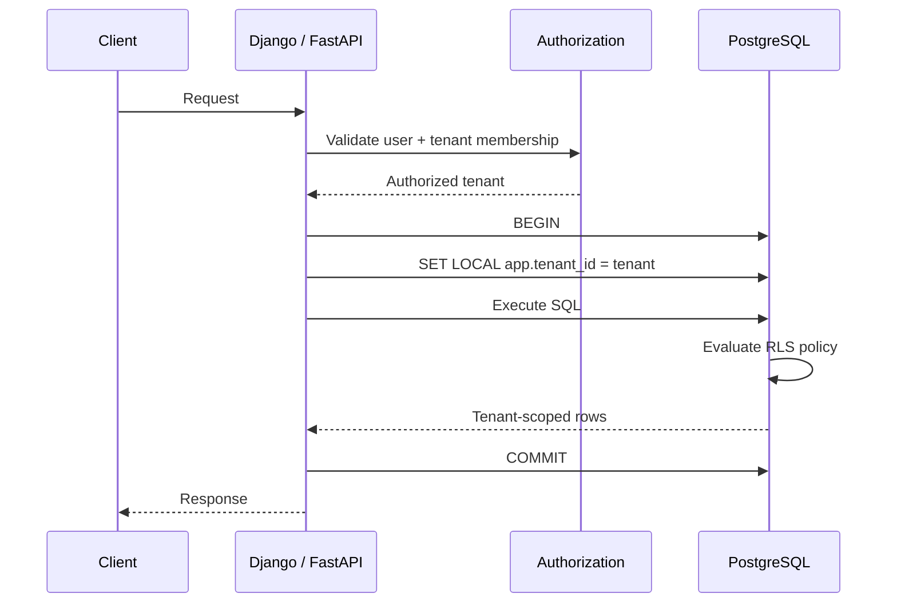
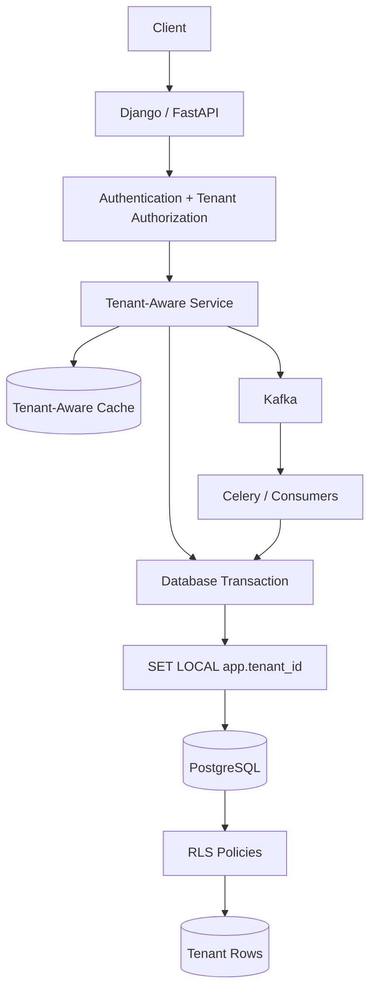

# 06- Row Level Security

## Overview

PostgreSQL Row-Level Security (RLS) provides database-enforced rules that determine which rows a database role can access or modify.

For a multi-tenant SaaS system, RLS can enforce a fundamental invariant:

```text
A tenant can access only rows belonging to that tenant.
```

Without RLS, tenant isolation typically depends on every application query correctly including:

```sql
WHERE tenant_id = $1
```

That pattern is necessary but vulnerable to developer mistakes:

```text
forgotten WHERE clause
incorrect JOIN
unscoped UPDATE
unscoped DELETE
new background worker
new reporting query
raw SQL
```

RLS moves part of the isolation boundary into PostgreSQL:

```text
Application authorization
        +
Tenant-aware queries
        +
PostgreSQL RLS
        +
Database constraints
```

RLS should generally be treated as **defense in depth**, not as a replacement for application authorization, correct query design, or least-privilege database roles.

---

## Multi-Tenant Isolation Problem

A shared-schema SaaS database commonly looks like:

```text
PostgreSQL
│
├── Tenant A
│   ├── projects
│   ├── users
│   └── invoices
│
├── Tenant B
│   ├── projects
│   ├── users
│   └── invoices
│
└── Tenant C
    ├── projects
    ├── users
    └── invoices
```

Rows are separated logically:

```sql
projects
---------
id
tenant_id
name
status
```

The database contains data from multiple customers in the same physical table.

The isolation requirement is:

```text
Tenant A request
    ↓
only Tenant A rows

Tenant B request
    ↓
only Tenant B rows
```

RLS can make PostgreSQL enforce this boundary independently of individual application queries.

---

## What RLS Provides

RLS policies can control:

- Which rows are visible to `SELECT`.
- Which existing rows can be modified by `UPDATE`.
- Which existing rows can be deleted by `DELETE`.
- Which new rows can be inserted through `WITH CHECK`.
- Which rows can be modified through `UPDATE`.
- Which users or database roles the policy applies to.

A simplified model is:

```text
SQL statement
     ↓
PostgreSQL permission checks
     ↓
RLS policy evaluation
     ↓
eligible rows
     ↓
query execution
```

RLS is therefore enforced inside the database rather than only in application code.

---

## Enabling RLS

Example:

```sql
ALTER TABLE projects ENABLE ROW LEVEL SECURITY;
```

This enables RLS for the table.

A policy can then define tenant visibility:

```sql
CREATE POLICY projects_tenant_select
ON projects
FOR SELECT
USING (
    tenant_id = current_setting('app.tenant_id')::uuid
);
```

Now the database can restrict rows according to the tenant context supplied to the PostgreSQL session.

---

## `USING` vs `WITH CHECK`

These two clauses solve different problems.

| Clause | Purpose |
|---|---|
| `USING` | Determines which existing rows are visible/eligible |
| `WITH CHECK` | Determines whether new row values are allowed |

For a tenant-owned table:

```sql
CREATE POLICY projects_tenant_policy
ON projects
USING (
    tenant_id = current_setting('app.tenant_id')::uuid
)
WITH CHECK (
    tenant_id = current_setting('app.tenant_id')::uuid
);
```

Conceptually:

```text
USING
  ↓
Can this row be accessed?

WITH CHECK
  ↓
Can this resulting/new row belong to this tenant?
```

This distinction is critical for `INSERT` and `UPDATE`.

---

## SELECT Isolation

Suppose the database contains:

```text
Tenant A → Project 1
Tenant B → Project 2
```

The application executes:

```sql
SELECT
    id,
    name
FROM projects;
```

With an appropriate RLS policy, PostgreSQL evaluates the policy and exposes only rows permitted for the current tenant context.

The application does not need to add the tenant predicate for RLS to enforce visibility.

However, explicit tenant predicates can still be useful for query intent and performance.

---

## INSERT Isolation

Consider:

```sql
INSERT INTO projects (
    tenant_id,
    name
)
VALUES (
    $1,
    $2
);
```

A `WITH CHECK` policy can prevent a tenant from inserting a row belonging to another tenant.

For example:

```sql
CREATE POLICY projects_tenant_insert
ON projects
FOR INSERT
WITH CHECK (
    tenant_id = current_setting('app.tenant_id')::uuid
);
```

The database validates the proposed row.

This prevents:

```text
Current tenant = A
INSERT tenant_id = B
```

from succeeding under the policy.

---

## UPDATE Isolation

For:

```sql
UPDATE projects
SET name = $1
WHERE id = $2;
```

RLS can control both:

```text
which existing rows can be targeted
+
what the resulting row is allowed to contain
```

Example:

```sql
CREATE POLICY projects_tenant_update
ON projects
FOR UPDATE
USING (
    tenant_id = current_setting('app.tenant_id')::uuid
)
WITH CHECK (
    tenant_id = current_setting('app.tenant_id')::uuid
);
```

The `WITH CHECK` condition is particularly important if `tenant_id` itself can be updated.

---

## DELETE Isolation

A delete policy can restrict which rows may be deleted:

```sql
CREATE POLICY projects_tenant_delete
ON projects
FOR DELETE
USING (
    tenant_id = current_setting('app.tenant_id')::uuid
);
```

Then:

```sql
DELETE FROM projects
WHERE id = $1;
```

can delete only rows permitted by the policy.

---

## Complete Tenant Policy

A common pattern is:

```sql
ALTER TABLE projects ENABLE ROW LEVEL SECURITY;

CREATE POLICY projects_tenant_access
ON projects
USING (
    tenant_id = current_setting('app.tenant_id')::uuid
)
WITH CHECK (
    tenant_id = current_setting('app.tenant_id')::uuid
);
```

The exact policy should be designed according to the required commands and database roles rather than copied mechanically across every table.

---

## Tenant Context

RLS needs some trusted representation of the current tenant.

A PostgreSQL custom setting can be used:

```sql
SET LOCAL app.tenant_id = '11111111-1111-1111-1111-111111111111';
```

Then the policy reads:

```sql
current_setting('app.tenant_id')::uuid
```

`SET LOCAL` is transaction-scoped.

That is particularly useful in pooled application environments.

---

## Why `SET LOCAL` Matters

A PostgreSQL connection may be reused:

```text
Request A
  ↓
Connection 1
  ↓
Tenant A

Connection returned to pool

Request B
  ↓
Connection 1
  ↓
Tenant B
```

If tenant state is stored as persistent session state and not reset correctly, Request B could inherit Tenant A's context.

This is a severe isolation risk.

Using:

```sql
SET LOCAL
```

inside a transaction limits the setting to the current transaction.

---

## Request Lifecycle With RLS

A production request can follow:



The important property is:

```text
authenticated tenant
        ↓
transaction context
        ↓
RLS evaluation
        ↓
database result
```

---

## Establishing Tenant Context Safely

The application should derive tenant context from trusted authorization state.

Example:

```python
from django.db import connection, transaction

def execute_for_tenant(tenant_id, operation):
    with transaction.atomic():
        with connection.cursor() as cursor:
            cursor.execute(
                "SET LOCAL app.tenant_id = %s",
                [str(tenant_id)],
            )
        return operation()
```

The tenant ID should come from:

```text
authenticated user
+
validated membership
+
authorized tenant selection
```

not directly from an untrusted request body.

---

## FastAPI Pattern

A typical FastAPI architecture is:

```text
Request
  ↓
Authentication dependency
  ↓
Tenant membership validation
  ↓
Service
  ↓
Transaction
  ↓
SET LOCAL app.tenant_id
  ↓
SQLAlchemy / psycopg
  ↓
PostgreSQL RLS
```

The database connection should execute the tenant context and business queries within the same transaction.

---

## SQLAlchemy Example

Conceptually:

```python
from sqlalchemy import text

with session.begin():
    session.execute(
        text("SET LOCAL app.tenant_id = :tenant_id"),
        {"tenant_id": str(tenant_id)},
    )

    result = session.execute(
        text("""
            SELECT id, name, status
            FROM projects
            WHERE deleted_at IS NULL
            ORDER BY created_at DESC, id DESC
            LIMIT 50
        """)
    )
```

The SQL does not need to repeat the tenant predicate for RLS enforcement, although explicit predicates may still be useful.

---

## Django and Transaction Boundaries

Django applications should establish tenant context inside the transaction that performs the queries.

Conceptually:

```python
from django.db import connection, transaction

with transaction.atomic():
    with connection.cursor() as cursor:
        cursor.execute(
            "SET LOCAL app.tenant_id = %s",
            [str(tenant_id)],
        )

    projects = list(
        Project.objects
        .filter(deleted_at__isnull=True)
        .order_by("-created_at", "-id")[:50]
    )
```

The critical property is that the RLS context and application query execute on the same database transaction/connection.

---

## Connection Pooling

Connection pooling is one of the most important operational considerations.

Typical architecture:

```text
Kubernetes Pods
      ↓
Application connection pools
      ↓
PgBouncer
      ↓
PostgreSQL
```

With transaction pooling, a connection may be assigned to different requests over time.

Therefore tenant state should not depend on persistent session settings.

Prefer:

```sql
SET LOCAL app.tenant_id = ...;
```

inside a transaction.

Avoid designs that assume a particular physical connection remains associated with one tenant.

---

## PgBouncer Considerations

Transaction pooling means:

```text
transaction begins
    ↓
connection assigned
    ↓
transaction executes
    ↓
connection returned
```

Session-level state may not have the lifecycle expected by the application.

RLS designs using PostgreSQL session context should therefore explicitly account for the pooler's transaction behavior.

`SET LOCAL` is generally much easier to reason about than persistent session state in this environment.

---

## Fail-Closed Tenant Context

A policy such as:

```sql
tenant_id = current_setting('app.tenant_id')::uuid
```

can fail if the setting does not exist.

That is preferable to silently treating an unset tenant as unrestricted access.

An alternative:

```sql
current_setting('app.tenant_id', true)
```

returns `NULL` if the setting is missing.

The policy can then deliberately fail closed:

```sql
tenant_id = NULLIF(
    current_setting('app.tenant_id', true),
    ''
)::uuid
```

The exact expression should be tested carefully against the application's connection lifecycle.

The important principle is:

> Missing tenant context must never mean "all tenants."

---

## RLS and Application Authorization

RLS does not replace application authorization.

Consider:

```text
User belongs to Tenant A
```

This does not necessarily mean:

```text
User can access every resource in Tenant A
```

There may be:

```text
tenant membership role
project membership
resource permissions
billing permissions
administrative roles
```

A robust architecture separates:

```text
Application authorization
    ↓
Is the user allowed to perform this operation?

RLS
    ↓
Can this database role access these rows?
```

---

## Tenant Isolation vs Authorization

These are different concepts.

| Concern | Example |
|---|---|
| Authentication | Who is the user? |
| Tenant selection | Which tenant is the request operating in? |
| Membership | Does the user belong to the tenant? |
| Authorization | Can the user perform this action? |
| RLS | Which database rows are accessible? |
| Constraints | Which states/data relationships are valid? |

Do not try to encode all business authorization logic into RLS.

---

## RLS and Explicit Tenant Predicates

With RLS enabled, this query:

```sql
SELECT
    id,
    name
FROM projects
WHERE deleted_at IS NULL;
```

may already be tenant-safe.

However, this can still be useful:

```sql
SELECT
    id,
    name
FROM projects
WHERE tenant_id = $1
  AND deleted_at IS NULL;
```

Advantages include:

- Explicit query intent.
- Better readability.
- Easier reasoning outside RLS.
- Potentially improved planner selectivity.
- Easier testing of repository code.

The trade-off is duplicated tenant logic.

A mature system should choose a consistent convention.

---

## RLS and Indexes

RLS does not eliminate the need for indexes.

A typical index remains useful:

```sql
CREATE INDEX projects_tenant_created_active_idx
ON projects (
    tenant_id,
    created_at DESC,
    id DESC
)
WHERE deleted_at IS NULL;
```

RLS controls:

```text
which rows are permitted
```

Indexes control:

```text
how efficiently eligible rows can be located
```

These concerns are complementary.

---

## RLS and Query Planner

RLS policies become part of query execution semantics.

Complex policies can therefore affect:

- Query plans.
- Predicate evaluation.
- Join behavior.
- Query latency.
- Index usefulness.

Avoid unnecessarily complicated RLS expressions.

Keep tenant policies simple where possible:

```sql
tenant_id = current_setting('app.tenant_id')::uuid
```

Complex authorization rules may belong in application authorization or carefully designed database functions.

---

## RLS and Joins

Consider:

```sql
SELECT
    p.id,
    p.name,
    t.title
FROM projects AS p
JOIN tasks AS t
  ON t.project_id = p.id;
```

If both tables have appropriate RLS policies, PostgreSQL applies those policies independently according to the table and operation.

However, RLS does not repair incorrect relationships.

You should still enforce tenant consistency at the schema level where appropriate.

For example:

```text
project.tenant_id
=
task.tenant_id
```

can be enforced through composite foreign-key design.

---

## Composite Foreign Keys for Tenant Consistency

Suppose:

```text
projects:
    id
    tenant_id

tasks:
    project_id
    tenant_id
```

A tenant-aware foreign key can enforce:

```sql
FOREIGN KEY (tenant_id, project_id)
REFERENCES projects (tenant_id, id)
```

This prevents:

```text
Tenant A task
    ↓
Tenant B project
```

from becoming a valid relationship.

This is stronger than relying solely on RLS.

---

## RLS and Unique Constraints

Suppose names are unique per tenant:

```sql
CREATE UNIQUE INDEX projects_tenant_name_uidx
ON projects (tenant_id, name);
```

RLS controls access.

The unique constraint controls:

```text
data integrity
```

These mechanisms should be used together.

---

## RLS and INSERT Defaults

Avoid allowing clients to arbitrarily choose ownership.

For example, the application may derive:

```text
tenant_id
```

from the authenticated tenant context.

The database policy then validates it.

This creates:

```text
trusted application context
+
database validation
```

rather than:

```text
client-provided tenant ID
+
hope that authorization is correct
```

---

## Preventing Tenant Switching

If users can update a resource:

```sql
UPDATE projects
SET tenant_id = $1
WHERE id = $2;
```

a strong `WITH CHECK` policy prevents changing the resulting row to another tenant.

For example:

```sql
CREATE POLICY projects_tenant_update
ON projects
FOR UPDATE
USING (
    tenant_id = current_setting('app.tenant_id')::uuid
)
WITH CHECK (
    tenant_id = current_setting('app.tenant_id')::uuid
);
```

In many schemas, it is even better to make `tenant_id` immutable at the application and schema design levels.

---

## Tenant ID Immutability

If moving a row between tenants is not a supported business operation, avoid allowing:

```sql
UPDATE projects
SET tenant_id = ...
```

at all.

Possible approaches include:

- Application-level immutability.
- Restricted database privileges.
- Separate administrative migration workflow.
- Triggers where justified.
- RLS `WITH CHECK`.

Tenant ownership is usually foundational identity data and should not be casually mutable.

---

## RLS and Superusers

RLS is not an absolute restriction for every PostgreSQL role.

Superusers bypass RLS.

Roles with the `BYPASSRLS` attribute also bypass RLS.

Table owners normally bypass RLS unless the table has been configured with:

```sql
ALTER TABLE projects FORCE ROW LEVEL SECURITY;
```

Therefore:

```text
RLS policy
≠
every possible PostgreSQL role is restricted
```

Database role design matters.

---

## `FORCE ROW LEVEL SECURITY`

A table owner can normally bypass its own table's RLS policies.

To force the owner through RLS:

```sql
ALTER TABLE projects FORCE ROW LEVEL SECURITY;
```

This should be used intentionally.

It can be useful when strong enforcement is required even for the owning role, but operational and administrative workflows must then be designed accordingly.

---

## Database Roles

A production architecture should distinguish roles where appropriate:

```text
migration/admin role
        ↓
schema changes

application role
        ↓
normal application traffic

read-only/reporting role
        ↓
controlled reporting
```

Do not run normal SaaS traffic using a highly privileged PostgreSQL role.

Least privilege is an important part of the RLS threat model.

---

## Administrative Cross-Tenant Access

Platform administrators may legitimately need:

```text
all tenants
```

for:

- Support.
- Billing.
- Compliance.
- Operations.
- Reporting.

Do not silently bypass RLS from ordinary application code.

Prefer explicit administrative paths with:

- Separate authorization.
- Restricted roles.
- Auditing.
- Clear operational procedures.

---

## Cross-Tenant Reporting

A platform report might intentionally execute:

```sql
SELECT
    tenant_id,
    COUNT(*) AS project_count
FROM projects
GROUP BY tenant_id;
```

This is fundamentally different from:

```text
tenant-facing application request
```

Cross-tenant reporting should be treated as privileged access.

Where possible, use a separate reporting architecture or controlled database role rather than weakening normal tenant isolation.

---

## RLS and Background Workers

Celery workers introduce another tenant-context boundary.

A job may contain:

```json
{
  "tenant_id": "11111111-1111-1111-1111-111111111111",
  "project_id": "22222222-2222-2222-2222-222222222222"
}
```

The worker should establish the tenant context before accessing tenant data:

```text
Kafka / Celery message
        ↓
validate tenant context
        ↓
BEGIN
        ↓
SET LOCAL app.tenant_id
        ↓
database work
        ↓
COMMIT
```

Never assume the worker process itself is permanently associated with one tenant.

---

## RLS and Kafka

Kafka events should carry sufficient context for downstream processing where required:

```json
{
  "event_type": "project.created",
  "tenant_id": "tenant-123",
  "project_id": "project-456"
}
```

A consumer can then establish the corresponding database context.

This is especially important when:

```text
one worker process
    ↓
processes events for many tenants
```

---

## RLS and Redis

Redis does not enforce PostgreSQL RLS.

Therefore cache keys must preserve tenant identity where appropriate:

```text
tenant:{tenant_id}:project:{project_id}
```

rather than relying solely on:

```text
project:{project_id}
```

A secure architecture treats:

```text
PostgreSQL
Redis
Kafka
application memory
```

as separate data-isolation boundaries.

---

## RLS and Transactions

Tenant context should normally be established at the beginning of the transaction:

```sql
BEGIN;

SET LOCAL app.tenant_id = '11111111-1111-1111-1111-111111111111';

SELECT ...;
UPDATE ...;

COMMIT;
```

This gives the transaction a clearly defined security context.

Avoid changing tenant context in the middle of a transaction unless the operation is explicitly designed to cross tenant boundaries.

---

## Transactions With Multiple Tenants

A normal tenant request should generally operate within one tenant context.

Avoid:

```text
BEGIN
  SET LOCAL tenant A
  query A
  SET LOCAL tenant B
  query B
COMMIT
```

unless the operation is explicitly privileged and designed as a cross-tenant workflow.

This makes auditing, reasoning, and authorization substantially harder.

---

## RLS and Transactions With External APIs

Do not hold a database transaction open while waiting for:

```text
Stripe
external REST API
gRPC service
AWS API
Kafka acknowledgment
```

Prefer:

```text
DB transaction
    ↓
commit local state
    ↓
outbox
    ↓
background worker
    ↓
external system
```

Tenant context remains associated with the database operation while external workflows are handled separately.

---

## RLS and Outbox Events

An outbox row should normally carry tenant identity:

```text
outbox_events
--------------
id
tenant_id
event_type
aggregate_id
payload
created_at
published_at
```

This allows downstream consumers to retain tenant context.

A publisher should not accidentally mix:

```text
Tenant A event
```

with:

```text
Tenant B processing context
```

---

## Testing RLS

RLS must be tested as a security boundary.

At minimum test:

```text
Tenant A SELECT → A rows
Tenant A SELECT → no B rows

Tenant A INSERT → A row
Tenant A INSERT → B row rejected

Tenant A UPDATE → A row
Tenant A UPDATE → B row inaccessible

Tenant A DELETE → A row
Tenant A DELETE → B row inaccessible

No tenant context → denied / empty according to policy design
```

---

## Cross-Tenant Security Tests

A strong test suite should intentionally attempt:

```text
GET Tenant B resource using Tenant A context
PUT Tenant B resource using Tenant A context
DELETE Tenant B resource using Tenant A context
INSERT Tenant B-owned row using Tenant A context
UPDATE tenant_id from A to B
```

These should fail safely.

Security tests should be executed against the real PostgreSQL behavior rather than mocked RLS logic.

---

## Testing With Multiple Database Roles

RLS behavior depends on PostgreSQL roles.

Test with the same role configuration used by production application traffic.

Do not run all tests as a superuser and conclude that RLS is working.

A privileged role can bypass the policies being tested.

---

## Migration Strategy

RLS changes should be deployed carefully.

A typical rollout may be:

```text
Create / validate tenant_id
        ↓
Backfill tenant ownership
        ↓
Add constraints/indexes
        ↓
Create policies
        ↓
Test application role
        ↓
Enable RLS
        ↓
Monitor
```

Avoid enabling RLS on a production table before all rows have valid tenant ownership.

---

## Enabling RLS Safely

Before:

```sql
ALTER TABLE projects ENABLE ROW LEVEL SECURITY;
```

verify:

```sql
SELECT COUNT(*)
FROM projects
WHERE tenant_id IS NULL;
```

If tenant ownership is mandatory, eventually enforce:

```sql
ALTER TABLE projects
ALTER COLUMN tenant_id SET NOT NULL;
```

The exact migration order depends on existing data and deployment requirements.

---

## RLS and Schema Migrations

Migration roles often need elevated privileges.

Do not assume the migration role should behave exactly like the application role.

Separate:

```text
schema administration
```

from:

```text
application data access
```

This makes deployment automation and runtime security easier to reason about.

---

## RLS Performance

RLS adds policy evaluation to queries.

For a simple policy:

```sql
tenant_id = current_setting('app.tenant_id')::uuid
```

the overhead can be manageable, especially with appropriate indexes.

Performance can degrade when policies contain:

- Complex subqueries.
- Expensive functions.
- Many joins.
- Repeated authorization lookups.
- Poorly indexed policy predicates.

Keep frequently evaluated policies simple.

---

## Measuring RLS Queries

Use:

```sql
EXPLAIN (ANALYZE, BUFFERS)
SELECT
    id,
    name
FROM projects
WHERE tenant_id = $1
  AND deleted_at IS NULL
ORDER BY created_at DESC, id DESC
LIMIT 50;
```

Compare:

```text
without RLS
```

and:

```text
with RLS
```

in a representative environment.

Measure:

- Execution time.
- Planning time.
- Buffer reads.
- Rows removed.
- Index usage.
- CPU utilization.

---

## RLS and Large Tenants

RLS does not automatically solve noisy-neighbor problems.

A tenant with:

```text
500 million rows
```

can still consume substantial:

```text
CPU
I/O
locks
connections
memory
WAL
```

RLS provides isolation of access, not resource isolation.

Large SaaS systems may additionally need:

- Rate limiting.
- Per-tenant quotas.
- Workload scheduling.
- Partitioning.
- Dedicated workers.
- Dedicated databases for large tenants.

---

## RLS and Noisy Neighbors

Consider:

```text
Tenant A → normal API traffic
Tenant B → massive export
Tenant C → bulk update
```

RLS ensures that each tenant sees permitted rows, but does not prevent Tenant B from consuming database resources.

Application-level controls may include:

```text
request limits
query limits
export jobs
Celery queues
tenant quotas
connection controls
```

---

## RLS and Read Replicas

RLS policies exist on the database schema and therefore apply on replicas according to the replica's role and query architecture.

However, application consistency still matters.

A newly created tenant resource may not immediately appear on a lagging replica.

RLS does not provide read-after-write consistency.

---

## RLS and High Availability

A PostgreSQL primary/standby architecture can replicate:

```text
tables
indexes
constraints
policies
```

through the database's normal replication mechanisms.

Operationally verify that:

- Schema changes are replicated.
- Application roles exist as expected.
- Connection configuration is consistent.
- Failover preserves the expected security model.

Test RLS after failover, not only against the primary.

---

## Disaster Recovery

RLS policies are part of the database schema and should be version controlled through migrations.

A disaster-recovery test should verify:

```text
restore database
    ↓
restore roles/privileges as required
    ↓
apply schema
    ↓
enable RLS
    ↓
configure tenant context
    ↓
execute tenant isolation tests
```

A database restore is not complete from a security perspective until the access-control model is validated.

---

## Security Considerations

### Do Not Trust the Client

Never use:

```text
request.body.tenant_id
```

as the sole basis for RLS context.

### Do Not Use a Superuser for Application Traffic

Superusers bypass RLS.

### Protect Tenant Context

The application must control who can establish:

```text
app.tenant_id
```

and which database role can set or influence relevant session state.

### Use Least Privilege

The application role should have only the required privileges.

### Audit Privileged Access

Cross-tenant administrative access should be explicitly logged.

### Test Failure Paths

Missing or malformed tenant context should fail closed.

---

## Common Mistakes

### Treating RLS as a Complete Authorization System

RLS does not know all business permissions.

**Fix:** keep application authorization and RLS responsibilities distinct.

### Using Session-Level Tenant State With Pooling

Persistent:

```sql
SET app.tenant_id = ...
```

can create connection-state hazards.

**Fix:** prefer transaction-scoped:

```sql
SET LOCAL app.tenant_id = ...
```

### Forgetting `WITH CHECK`

A policy with only:

```sql
USING (...)
```

may not express the intended restriction on inserted or updated row values.

**Fix:** explicitly design `WITH CHECK`.

### Running Tests as Superuser

RLS may be bypassed.

**Fix:** test using the real application role.

### Forgetting Table Owners Can Bypass RLS

The table owner normally bypasses RLS unless forced.

**Fix:** understand role ownership and use `FORCE ROW LEVEL SECURITY` when required.

### Assuming RLS Prevents Noisy Neighbors

It does not.

**Fix:** add workload and resource controls.

### Assuming RLS Fixes Cross-Tenant Relationships

It does not repair bad foreign-key relationships.

**Fix:** enforce tenant consistency with constraints.

### Forgetting Background Workers

Celery and Kafka consumers also access tenant data.

**Fix:** propagate and establish tenant context explicitly.

### Relying on Redis for Isolation

Redis has no PostgreSQL RLS.

**Fix:** use tenant-aware cache keys.

### Making Policies Too Complex

Expensive policy expressions can hurt every query.

**Fix:** keep RLS policies simple and measure execution plans.

---

## Interview Traps

### "Does RLS replace application authorization?"

No.

RLS is primarily a database row-access enforcement mechanism. Application authorization determines whether a user is allowed to perform a business operation.

### "Does RLS guarantee that every PostgreSQL role is isolated?"

No.

Superusers and roles with `BYPASSRLS` bypass RLS. Table owners normally bypass it unless `FORCE ROW LEVEL SECURITY` applies.

### "Is RLS enough for multi-tenancy?"

Not by itself.

A production system should combine:

```text
authorization
+
RLS
+
constraints
+
indexes
+
tenant-aware application design
+
least privilege
```

### "Why use `SET LOCAL`?"

It scopes tenant context to the current transaction, which is much safer for pooled connections than relying on persistent session state.

### "Does RLS solve performance isolation?"

No.

It restricts rows, but does not prevent a large tenant from consuming disproportionate database resources.

---

## Production Checklist

### Schema

- [ ] Tenant-owned tables have a clear `tenant_id`.
- [ ] Tenant ownership is mandatory where appropriate.
- [ ] Cross-tenant relationships are prevented with constraints.
- [ ] Tenant-local uniqueness uses composite constraints/indexes.

### RLS

- [ ] RLS is enabled on tenant-owned tables.
- [ ] `USING` policies are defined correctly.
- [ ] `WITH CHECK` policies are defined where required.
- [ ] Missing tenant context fails closed.
- [ ] Policy complexity is intentionally limited.

### Roles

- [ ] Application traffic does not use a superuser.
- [ ] `BYPASSRLS` is restricted.
- [ ] Table ownership is understood.
- [ ] Administrative roles are separated where appropriate.
- [ ] Privileged access is audited.

### Application

- [ ] Tenant context comes from trusted authorization state.
- [ ] `SET LOCAL` is used appropriately.
- [ ] Tenant context and business queries share the intended transaction.
- [ ] Connection pooling behavior is tested.
- [ ] Celery workers propagate tenant context.
- [ ] Kafka consumers preserve tenant context.

### Performance

- [ ] Tenant-aware indexes exist.
- [ ] RLS queries are measured with realistic data.
- [ ] Large-tenant behavior is tested.
- [ ] Noisy-neighbor controls exist where required.
- [ ] Replica behavior is understood.

### Security Testing

- [ ] Cross-tenant SELECT is tested.
- [ ] Cross-tenant INSERT is tested.
- [ ] Cross-tenant UPDATE is tested.
- [ ] Cross-tenant DELETE is tested.
- [ ] Tenant switching is tested.
- [ ] Missing tenant context is tested.
- [ ] Tests run under production-like database roles.

---

## Recommended Architecture

A strong shared-schema SaaS architecture can use:



The security model becomes:

```text
User
  ↓
Authentication
  ↓
Tenant membership
  ↓
Application authorization
  ↓
Tenant context
  ↓
PostgreSQL transaction
  ↓
RLS
  ↓
Constraints
  ↓
Tenant data
```

Each layer solves a different problem.

---

## Defense-in-Depth Model

A mature multi-tenant database should not depend on a single control.

| Layer | Primary responsibility |
|---|---|
| Authentication | Identify caller |
| Application authorization | Validate business permissions |
| Tenant context | Identify current tenant |
| RLS | Enforce row visibility/access |
| Foreign keys | Enforce relationships |
| Composite constraints | Enforce tenant consistency |
| Unique constraints | Enforce tenant-local invariants |
| Indexes | Efficient tenant-scoped access |
| Database roles | Limit database capabilities |
| Redis keys | Prevent cache namespace collisions |
| Kafka metadata | Preserve tenant context across events |
| Audit logs | Record privileged operations |

The strongest systems make cross-tenant access difficult to perform accidentally at multiple layers.

## Key Takeaways

- **PostgreSQL RLS provides database-enforced row isolation, making it a strong defense-in-depth mechanism for shared-schema multi-tenant SaaS systems.**
- **`USING` controls access to existing rows while `WITH CHECK` controls whether inserted or updated rows satisfy the tenant policy; both must be designed deliberately.**
- **Establish tenant context from trusted authorization state and prefer transaction-scoped `SET LOCAL` in pooled environments so tenant state cannot leak between requests.**
- **RLS does not replace application authorization, database constraints, least-privilege roles, tenant-aware indexes, or resource controls for noisy neighbors.**
- **Production RLS must be tested under realistic PostgreSQL roles and workloads, including cross-tenant attacks, background workers, pooling, failover, migrations, and large-tenant performance.**