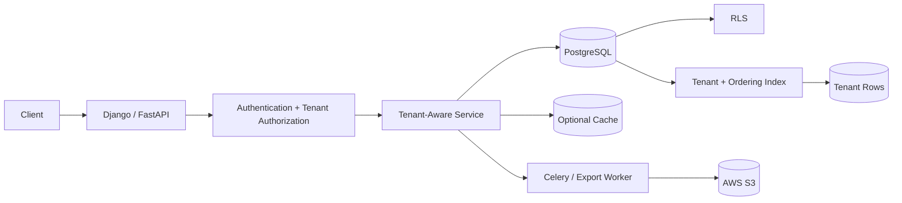

# 07- Pagination

## Overview

Pagination limits how much data an API retrieves and returns in a single request.

In a multi-tenant SaaS database, pagination must solve more than result-size control. It must also preserve:

- Tenant isolation.
- Deterministic ordering.
- Stable navigation.
- Predictable database work.
- Reasonable latency for both small and very large tenants.
- Safe behavior under concurrent inserts, updates, and deletes.

The two primary database pagination strategies are:

| Strategy | Typical SQL | Best use |
|---|---|---|
| Offset pagination | `LIMIT ... OFFSET ...` | Small datasets, simple admin/reporting screens |
| Keyset pagination | Cursor predicate + `LIMIT` | Large production APIs and high-volume tenants |

For a multi-tenant SaaS system, **keyset pagination should generally be the default for large or frequently accessed tenant-scoped collections**.

---

## Why Pagination Matters in Multi-Tenant SaaS

A shared database can contain:

```text
Tenant A → 2,000 rows
Tenant B → 50,000 rows
Tenant C → 100,000,000 rows
```

A query that works well for Tenant A can become expensive for Tenant C.

Without pagination:

```sql
SELECT *
FROM projects
WHERE tenant_id = $1;
```

the database may need to:

- Find many rows.
- Read large amounts of data.
- Transfer a large response.
- Serialize a large JSON payload.
- Consume application memory.
- Hold database resources longer.

Pagination establishes a bounded result size:

```sql
SELECT
    id,
    name,
    status,
    created_at
FROM projects
WHERE tenant_id = $1
ORDER BY created_at DESC, id DESC
LIMIT 50;
```

The result is bounded, but the pagination strategy determines how efficiently later pages are reached.

---

## Pagination Requirements

A production pagination design should define:

- Maximum page size.
- Default page size.
- Stable ordering.
- Cursor or offset semantics.
- Tenant scope.
- Filtering behavior.
- Sorting behavior.
- Response metadata.
- Cursor encoding.
- Cursor expiration, if required.
- Behavior when records are inserted or deleted.
- Behavior when the requested cursor is invalid.

A useful API contract is:

```text
GET /projects?limit=50
GET /projects?limit=50&cursor=...
```

with a response such as:

```json
{
  "items": [
    {
      "id": "project-123",
      "name": "Analytics",
      "status": "ACTIVE"
    }
  ],
  "next_cursor": "..."
}
```

---

## Offset Pagination

Offset pagination uses:

```sql
LIMIT
OFFSET
```

Example:

```sql
SELECT
    id,
    name,
    created_at
FROM projects
WHERE tenant_id = $1
ORDER BY created_at DESC, id DESC
LIMIT 50
OFFSET 1000;
```

The client requests:

```text
page 1 → OFFSET 0
page 2 → OFFSET 50
page 3 → OFFSET 100
...
```

---

## How OFFSET Works

Conceptually:

```text
ORDERED RESULT
────────────────────────────
row 1
row 2
...
row 1000      ← skip
row 1001      ← return
row 1002
...
```

The database cannot generally jump to "row 1001" simply because the query contains:

```sql
OFFSET 1000
```

It still has to identify the preceding rows according to the query's execution plan.

As the offset grows, the amount of discarded work can grow.

---

## Advantages of OFFSET

Offset pagination is useful because it is:

- Simple.
- Easy to implement.
- Easy to understand.
- Compatible with page-number UIs.
- Convenient for small datasets.
- Convenient for internal tools and low-volume administration.

Example:

```text
?page=3&page_size=50
```

can be straightforward for a back-office UI.

---

## Limitations of OFFSET

Large offsets can become increasingly expensive:

```sql
OFFSET 1000000
```

The database may need to process a large number of rows before returning the requested page.

Other problems include unstable pagination when rows are inserted or deleted between requests.

For high-volume SaaS APIs, these characteristics make OFFSET a poor default.

---

## Offset Performance

Consider:

```sql
SELECT
    id,
    name
FROM projects
WHERE tenant_id = $1
ORDER BY created_at DESC, id DESC
LIMIT 50
OFFSET 500000;
```

Even with a useful index, PostgreSQL may need to walk past a large number of index entries before producing the requested rows.

A matching index can improve the operation:

```sql
CREATE INDEX projects_tenant_created_idx
ON projects (
    tenant_id,
    created_at DESC,
    id DESC
);
```

but it does not eliminate the fundamental cost of large offsets.

---

## Keyset Pagination

Keyset pagination uses the values of the last row from the previous page as the next-page boundary.

For:

```sql
ORDER BY created_at DESC, id DESC
```

the next page can use:

```sql
WHERE (created_at, id) < ($cursor_created_at, $cursor_id)
```

Example:

```sql
SELECT
    id,
    name,
    status,
    created_at
FROM projects
WHERE tenant_id = $1
  AND (created_at, id) < ($2, $3)
ORDER BY created_at DESC, id DESC
LIMIT 50;
```

Instead of:

```text
skip 500,000 rows
```

the database can seek directly to the relevant part of the ordered index.

---

## Keyset Data Flow

```text
First request
    ↓
tenant_id
    ↓
ORDER BY created_at DESC, id DESC
    ↓
first 50 rows
    ↓
last row's (created_at, id)
    ↓
cursor

Next request
    ↓
decode cursor
    ↓
WHERE (created_at, id) < cursor
    ↓
same ORDER BY
    ↓
next 50 rows
```

This creates a natural continuation point.

---

## Index for Keyset Pagination

For:

```sql
WHERE tenant_id = $1
ORDER BY created_at DESC, id DESC
LIMIT 50;
```

use:

```sql
CREATE INDEX projects_tenant_created_idx
ON projects (
    tenant_id,
    created_at DESC,
    id DESC
);
```

For soft-deleted records:

```sql
CREATE INDEX projects_tenant_created_active_idx
ON projects (
    tenant_id,
    created_at DESC,
    id DESC
)
WHERE deleted_at IS NULL;
```

The query and index should be designed together.

---

## Deterministic Ordering

Pagination requires deterministic ordering.

Avoid:

```sql
ORDER BY created_at DESC;
```

if multiple records can share the same timestamp.

Prefer:

```sql
ORDER BY created_at DESC, id DESC;
```

The ordering should define a total ordering for the rows being paginated.

This is why a unique tie-breaker such as `id` is commonly included.

---

## Why Timestamp Alone Is Dangerous

Suppose:

```text
Project A → created_at = 10:00
Project B → created_at = 10:00
Project C → created_at = 09:59
```

If pagination uses only:

```sql
ORDER BY created_at DESC
```

the database has no deterministic order between A and B.

A page boundary can therefore become ambiguous.

Using:

```sql
ORDER BY created_at DESC, id DESC
```

provides deterministic ordering assuming `id` is unique.

---

## Tuple Comparison

PostgreSQL supports row-value comparisons:

```sql
(created_at, id) < ($1, $2)
```

for the descending ordering:

```sql
ORDER BY created_at DESC, id DESC
```

The comparison represents the continuation boundary.

An equivalent logical expression is:

```sql
created_at < $1
OR (
    created_at = $1
    AND id < $2
)
```

The tuple form is generally cleaner and directly represents the composite cursor.

---

## First Page

The first request has no cursor:

```sql
SELECT
    id,
    name,
    status,
    created_at
FROM projects
WHERE tenant_id = $1
ORDER BY created_at DESC, id DESC
LIMIT 50;
```

The application then extracts:

```text
last.created_at
last.id
```

and encodes them into the cursor.

---

## Subsequent Page

The next request supplies the cursor:

```sql
SELECT
    id,
    name,
    status,
    created_at
FROM projects
WHERE tenant_id = $1
  AND (created_at, id) < ($2, $3)
ORDER BY created_at DESC, id DESC
LIMIT 50;
```

The same:

```text
tenant
+
ordering
+
index
```

are used for every page.

---

## Cursor Design

A cursor should contain enough information to reconstruct the pagination boundary.

For example:

```json
{
  "created_at": "2026-09-05T12:34:56.123456Z",
  "id": "2f3d..."
}
```

The application can encode this as:

```text
base64url(payload)
```

For security-sensitive APIs, signing the cursor can prevent clients from modifying cursor contents without detection.

A cursor is not inherently secret, but it should not expose unnecessary internal information.

---

## Cursor Signing

A signed cursor can contain:

```text
ordering fields
tenant context if useful
filter version
expiration timestamp
signature
```

Conceptually:

```text
cursor payload
      ↓
HMAC/signature
      ↓
encoded cursor
```

The server verifies the cursor before using it.

Do not trust arbitrary cursor values simply because they were supplied by a client.

---

## Do Not Put Authorization in the Cursor

A cursor may include tenant context as a consistency check, but authorization must still be evaluated independently.

Never treat:

```text
cursor.tenant_id
```

as proof that the caller is authorized for that tenant.

The trusted tenant context comes from:

```text
authentication
+
authorization
```

and, where applicable, PostgreSQL RLS.

---

## Tenant-Scoped Pagination

Every paginated tenant-owned query should have an explicit tenant boundary or rely on a correctly configured RLS policy.

Typical query:

```sql
SELECT
    id,
    name,
    created_at
FROM projects
WHERE tenant_id = $1
  AND deleted_at IS NULL
  AND (created_at, id) < ($2, $3)
ORDER BY created_at DESC, id DESC
LIMIT 50;
```

The index:

```sql
CREATE INDEX projects_tenant_created_active_idx
ON projects (
    tenant_id,
    created_at DESC,
    id DESC
)
WHERE deleted_at IS NULL;
```

This combines:

```text
tenant isolation
+
soft-delete filtering
+
keyset pagination
```

---

## Page Size Limits

Never allow an unrestricted client-controlled page size.

Avoid:

```text
?limit=100000000
```

Prefer:

```text
default = 50
maximum = 100
```

For example:

```python
DEFAULT_PAGE_SIZE = 50
MAX_PAGE_SIZE = 100

limit = min(requested_limit or DEFAULT_PAGE_SIZE, MAX_PAGE_SIZE)
```

The exact limits should be based on payload size, query cost, latency targets, and endpoint behavior.

---

## Page Size Is a Resource Control

A page size affects:

```text
database work
+
network transfer
+
JSON serialization
+
application memory
+
client processing
```

Therefore:

```text
pagination
=
correctness
+
performance
+
resource control
```

It is not merely a UI feature.

---

## Pagination With Filters

Filters must remain stable across pages.

Example:

```sql
SELECT
    id,
    name,
    created_at
FROM projects
WHERE tenant_id = $1
  AND status = $2
  AND (created_at, id) < ($3, $4)
ORDER BY created_at DESC, id DESC
LIMIT 50;
```

The cursor represents the ordering boundary for the same filter set.

A cursor generated for:

```text
status=ACTIVE
```

should not silently be reused for:

```text
status=ARCHIVED
```

---

## Cursor and Filter Validation

A robust cursor can include a filter fingerprint:

```json
{
  "created_at": "...",
  "id": "...",
  "filters_hash": "..."
}
```

The API can reject a cursor if the client changes the filter set.

This avoids confusing behavior where a cursor from one result set is applied to another.

---

## Pagination With Dynamic Sorting

Dynamic sorting complicates keyset pagination.

For example:

```text
sort=created_at
sort=name
sort=updated_at
```

each ordering requires a compatible cursor and index strategy.

Do not blindly concatenate:

```text
ORDER BY {client_input}
```

into SQL.

Use an allowlist:

```python
SORT_FIELDS = {
    "created_at": "created_at",
    "updated_at": "updated_at",
    "name": "name",
}
```

Then construct SQL using trusted identifiers.

Pagination and dynamic sorting should be designed as one API feature rather than independently.

---

## Sorting by Name

Suppose the API supports:

```sql
ORDER BY name ASC, id ASC
```

A corresponding index might be:

```sql
CREATE INDEX projects_tenant_name_idx
ON projects (
    tenant_id,
    name ASC,
    id ASC
);
```

The keyset condition becomes:

```sql
WHERE tenant_id = $1
  AND (name, id) > ($2, $3)
ORDER BY name ASC, id ASC
LIMIT 50;
```

The direction of the tuple comparison must match the ordering.

---

## NULL Ordering

If a sort column can be NULL:

```sql
ORDER BY updated_at DESC NULLS LAST, id DESC;
```

cursor design becomes more complicated because NULL participates in PostgreSQL's ordering semantics.

A senior-level pagination design should explicitly define:

```text
NULLS FIRST
or
NULLS LAST
```

and encode the necessary cursor state.

For simpler pagination, use a non-null ordering column where appropriate.

---

## Pagination With Joins

Consider:

```sql
SELECT
    p.id,
    p.name,
    COUNT(t.id) AS task_count
FROM projects AS p
LEFT JOIN tasks AS t
  ON t.project_id = p.id
WHERE p.tenant_id = $1
GROUP BY p.id, p.name
ORDER BY p.created_at DESC, p.id DESC
LIMIT 50;
```

Pagination should be applied at the intended result grain.

Do not accidentally paginate joined child rows before producing the project-level result.

Understand:

```text
source grain
→ join grain
→ aggregation grain
→ pagination grain
```

---

## Pagination Before Expensive Expansion

If the API needs projects and then related tasks, a common pattern is:

```text
1. Fetch 50 project IDs.
2. Fetch related tasks for those 50 projects.
3. Assemble the response.
```

This can be better than:

```text
join every task
→ produce huge intermediate result
→ paginate
```

The correct design depends on the query and required result shape.

---

## Avoiding N+1 During Pagination

Pagination does not eliminate N+1.

Bad pattern:

```text
fetch 50 projects
    ↓
query tasks for project 1
query tasks for project 2
...
query tasks for project 50
```

This produces:

```text
1 + 50 queries
```

Prefer:

```sql
SELECT
    id,
    project_id,
    title
FROM tasks
WHERE tenant_id = $1
  AND project_id = ANY($2);
```

or an ORM equivalent.

---

## Django Pagination

A keyset query can be implemented using Django ORM expressions.

For example:

```python
from django.db.models import Q

projects = (
    Project.objects
    .filter(
        tenant_id=tenant_id,
        deleted_at__isnull=True,
    )
    .filter(
        Q(created_at__lt=cursor_created_at)
        | Q(
            created_at=cursor_created_at,
            id__lt=cursor_id,
        )
    )
    .order_by("-created_at", "-id")[:50]
)
```

The exact implementation should match the database ordering and cursor representation.

---

## FastAPI API Contract

A production endpoint might expose:

```text
GET /v1/projects?limit=50
GET /v1/projects?limit=50&cursor=<opaque-cursor>
```

Response:

```json
{
  "items": [
    {
      "id": "2f3d",
      "name": "Analytics",
      "status": "ACTIVE",
      "created_at": "2026-09-05T12:34:56Z"
    }
  ],
  "next_cursor": "eyJjcmVhdGVkX2F0Ijoi..."} 
```

The cursor should be treated as an opaque value by clients.

---

## REST API Semantics

A good pagination contract should define:

| Concern | Recommended approach |
|---|---|
| Default limit | Small bounded value |
| Maximum limit | Explicit server-side cap |
| Cursor | Opaque |
| Ordering | Stable and deterministic |
| Tenant | Derived from trusted context |
| Invalid cursor | Return clear client error |
| Empty page | Return empty `items` |
| Last page | `next_cursor = null` |
| Sorting | Explicit allowlist |
| Filtering | Cursor tied to the result definition |

---

## gRPC Pagination

gRPC APIs commonly use:

```protobuf
message ListProjectsRequest {
  string tenant_id = 1;
  int32 page_size = 2;
  string page_token = 3;
}

message ListProjectsResponse {
  repeated Project projects = 1;
  string next_page_token = 2;
}
```

The page token is conceptually equivalent to an opaque cursor.

The server should still enforce:

```text
authorization
+
tenant context
+
maximum page size
+
stable ordering
```

---

## Pagination and Concurrent Inserts

Suppose page 1 returns:

```text
A
B
C
```

Then a new row:

```text
X
```

is inserted at the beginning.

With offset pagination, page 2 may shift because the row positions changed.

Keyset pagination is generally more stable because it continues from:

```text
C
```

rather than from:

```text
OFFSET 3
```

This does not mean keyset pagination provides a fixed snapshot.

New rows can still appear before the cursor and therefore not appear in the current traversal.

---

## Concurrent Deletes

Suppose:

```text
Page 1:
A
B
C
```

Then B is deleted.

Offset pagination may skip or duplicate rows depending on where the deletion occurred.

Keyset pagination continues from the ordering boundary and is less sensitive to positional shifts.

It still cannot guarantee an immutable dataset unless the application explicitly uses snapshot semantics.

---

## Snapshot Consistency

Normal API pagination usually executes each page as a separate transaction.

Therefore:

```text
Page 1 → transaction A
Page 2 → transaction B
Page 3 → transaction C
```

The pages do not automatically represent one consistent database snapshot.

If the business requirement is:

```text
all pages must represent exactly one point-in-time dataset
```

ordinary API pagination is not sufficient.

Alternatives may include:

- Export jobs.
- Materialized snapshots.
- Temporary/durable staging.
- Versioned datasets.
- Explicit snapshot mechanisms where operationally appropriate.

Holding a long database transaction open across user requests is generally a poor design.

---

## Pagination and Deletes

Keyset pagination works well with mutable datasets, but records can disappear between pages.

For example:

```text
Page 1 cursor = C
```

then:

```text
D is deleted
```

before page 2.

Page 2 simply returns the next currently visible rows after C.

This is normally acceptable for interactive APIs.

If exact traversal is required, design a snapshot/export mechanism instead.

---

## Pagination and Updates

If the ordering column changes between page requests, rows can move relative to the cursor.

For example:

```text
ORDER BY updated_at DESC
```

and then:

```text
updated_at changes
```

can cause a row to move into an already visited portion of the ordering.

For feeds where traversal stability matters, prefer an ordering key with suitable immutability characteristics, such as:

```text
created_at + id
```

when business semantics permit.

---

## Pagination and Soft Deletes

For:

```sql
WHERE deleted_at IS NULL
```

a partial index is often useful:

```sql
CREATE INDEX projects_tenant_created_active_idx
ON projects (
    tenant_id,
    created_at DESC,
    id DESC
)
WHERE deleted_at IS NULL;
```

The query must use predicates compatible with the partial-index condition.

---

## Pagination and RLS

With RLS enabled:

```sql
SELECT
    id,
    name,
    created_at
FROM projects
ORDER BY created_at DESC, id DESC
LIMIT 50;
```

RLS can restrict the visible rows.

However, the application should still establish the correct tenant context before executing the transaction.

A typical flow is:

```text
request
  ↓
authenticate
  ↓
authorize tenant
  ↓
BEGIN
  ↓
SET LOCAL app.tenant_id
  ↓
paginated query
  ↓
RLS
  ↓
response
  ↓
COMMIT
```

RLS provides database-level isolation; pagination provides bounded traversal.

---

## Pagination and Indexes

Pagination performance is strongly dependent on indexing.

For:

```sql
WHERE tenant_id = $1
  AND status = $2
ORDER BY created_at DESC, id DESC
LIMIT 50;
```

a candidate index is:

```sql
CREATE INDEX projects_tenant_status_created_idx
ON projects (
    tenant_id,
    status,
    created_at DESC,
    id DESC
);
```

For:

```text
tenant
+
soft delete
+
created_at ordering
```

a partial index can be better.

Always verify with:

```sql
EXPLAIN (ANALYZE, BUFFERS)
```

---

## Pagination and Query Plans

Inspect:

```sql
EXPLAIN (ANALYZE, BUFFERS)
SELECT
    id,
    name,
    created_at
FROM projects
WHERE tenant_id = $1
  AND (created_at, id) < ($2, $3)
ORDER BY created_at DESC, id DESC
LIMIT 50;
```

A healthy plan for a well-indexed workload may use an index scan and avoid large sorts.

Do not assume that a matching index guarantees the same plan for every tenant size.

---

## Large-Tenant Testing

Test pagination with:

```text
10 rows
10,000 rows
10,000,000 rows
100,000,000 rows
```

where practical.

Also test tenant skew:

```text
small tenant
medium tenant
large tenant
```

Measure:

- P50 latency.
- P95 latency.
- P99 latency.
- Rows examined.
- Buffer reads.
- CPU.
- Network response size.
- Database load.

---

## Deep Pagination Comparison

| Characteristic | OFFSET | Keyset |
|---|---:|---:|
| Simple implementation | Excellent | Good |
| Page numbers | Excellent | Poor |
| Deep pagination | Poor | Excellent |
| Large tenant performance | Can degrade | Generally stable |
| Stable under inserts/deletes | Weak | Better |
| Arbitrary jump to page | Easy | Difficult |
| Cursor complexity | None | Required |
| Dynamic sorting | Easy | More complex |
| API feeds | Acceptable | Preferred |
| Internal admin tools | Often suitable | Sometimes unnecessary |

---

## When OFFSET Is Appropriate

Use OFFSET when:

- Dataset is small.
- Maximum page depth is bounded.
- Users need page numbers.
- Exact page navigation is important.
- Query frequency is low.
- It is an internal administrative tool.
- Performance has been measured and is acceptable.

Example:

```text
Admin dashboard
10,000 total records
maximum 20 pages
```

Offset may be perfectly reasonable.

---

## When Keyset Is Preferred

Use keyset pagination when:

- Tables are large.
- Tenants can have millions of rows.
- APIs are frequently called.
- Users usually navigate sequentially.
- Feeds are ordered by time or another stable key.
- Deep pagination is possible.
- Predictable query cost matters.

For a production SaaS collection API, this is often the better default.

---

## Cursor-Based Pagination With Multiple Filters

A production cursor can encode:

```json
{
  "version": 1,
  "created_at": "2026-09-05T12:34:56.123456Z",
  "id": "2f3d...",
  "sort": "created_at_desc",
  "filters_hash": "..."
}
```

The API can then:

1. Validate the cursor signature.
2. Validate cursor version.
3. Validate filter compatibility.
4. Derive tenant context independently.
5. Execute the query.
6. Generate the next cursor.

This makes cursor behavior explicit and evolvable.

---

## Cursor Versioning

Pagination contracts can outlive database implementations.

If the ordering strategy changes:

```text
version 1 → created_at + id
version 2 → updated_at + id
```

old cursors may no longer be valid.

Include a version in opaque cursors:

```json
{
  "version": 1,
  "created_at": "...",
  "id": "..."
}
```

Then reject unsupported versions cleanly rather than interpreting them incorrectly.

---

## Pagination for Exports

Do not use interactive API pagination to implement large exports such as:

```text
10 million invoices
```

A better architecture is:

```text
API request
    ↓
create export job
    ↓
Celery / worker
    ↓
batched keyset reads
    ↓
write CSV / Parquet
    ↓
S3
    ↓
download link
```

This avoids holding a user request open for a long database operation.

---

## Batch Processing With Keyset Pagination

Workers can process large datasets in bounded batches:

```sql
SELECT
    id,
    tenant_id
FROM usage_records
WHERE tenant_id = $1
  AND (recorded_at, id) > ($2, $3)
ORDER BY recorded_at ASC, id ASC
LIMIT 1000;
```

After successful processing:

```text
last_recorded_at
+
last_id
```

becomes the next checkpoint.

For restartable jobs, persist the checkpoint durably rather than relying only on process memory.

---

## Keyset Pagination vs Batch Processing

These concepts are related but not identical.

| Concern | API pagination | Batch processing |
|---|---|---|
| Client-facing | Yes | Usually no |
| Cursor | Opaque | Often explicit checkpoint |
| Batch size | Small | Often larger |
| Failure recovery | Request-level | Checkpoint/retry |
| Consistency | Usually eventual traversal | Explicit processing semantics |
| Storage | Response | Worker output/state |

Both benefit from bounded database work.

---

## Redis and Pagination

Redis can cache:

```text
popular tenant resources
```

but do not use a cache as a substitute for correct database pagination.

For tenant-aware cache keys:

```text
tenant:{tenant_id}:projects:{cursor}
```

may be possible, but caching arbitrary cursor pages can produce high cardinality and poor invalidation behavior.

For many SaaS systems, database keyset pagination plus efficient indexes is simpler and more reliable.

---

## Kafka and Pagination

Kafka consumers do not use database pagination semantics directly.

However, a consumer that periodically scans PostgreSQL may use keyset batching:

```text
last processed ID
        ↓
WHERE id > checkpoint
        ↓
ORDER BY id
        ↓
LIMIT batch_size
```

This can be useful for:

- Backfills.
- Reconciliation.
- Event generation.
- Migration jobs.

The checkpoint must be designed around the data's mutation semantics.

---

## Pagination and Idempotency

For background jobs:

```text
read batch
  ↓
process
  ↓
persist progress
```

failure can occur between processing and checkpoint persistence.

Therefore processing should be designed for:

```text
retries
+
idempotency
```

Pagination itself does not guarantee exactly-once processing.

---

## Common Mistakes

### Using OFFSET for Deep API Pagination

Why it happens:

```text
OFFSET is easy to implement
```

Why it fails:

```text
large offset
    ↓
large amount of discarded work
```

Use keyset pagination for large sequential traversals.

### Ordering by a Non-Unique Column

Avoid:

```sql
ORDER BY created_at DESC
```

alone.

Prefer:

```sql
ORDER BY created_at DESC, id DESC
```

### Missing Tenant Scope

A pagination query must preserve tenant isolation.

Do not allow a cursor to bypass the tenant boundary.

### Allowing Arbitrary Page Size

Never trust:

```text
?limit=99999999
```

Enforce a server-side maximum.

### Reusing a Cursor With Different Filters

A cursor belongs to a specific ordered result set.

Validate filter/sort compatibility.

### Exposing Cursor Internals

Do not make clients depend on cursor structure.

Treat cursors as opaque.

### Assuming Keyset Gives Snapshot Consistency

It does not.

Separate API requests normally execute under separate database snapshots.

### Paginating Joined Child Rows

Understand result grain before applying pagination.

### Performing N+1 Queries Per Page

Fetching 50 parent rows and then executing 50 child queries defeats the benefits of pagination.

### Using Pagination for Large Exports

Use asynchronous batch processing instead.

### Using Mutable Ordering Carelessly

Sorting by frequently changing values such as:

```text
updated_at
```

can cause records to move between pages.

### Ignoring Large-Tenant Testing

A query that performs well for a small tenant may fail under extreme tenant skew.

---

## Security Checklist

- [ ] Tenant context comes from trusted authorization.
- [ ] RLS is enabled where appropriate.
- [ ] Cursors cannot bypass tenant scope.
- [ ] Cursor values are validated.
- [ ] Cursor signatures are used when tamper resistance is required.
- [ ] Page size has a server-side maximum.
- [ ] Dynamic sort fields use an allowlist.
- [ ] SQL values are parameterized.
- [ ] Sensitive data is not unnecessarily encoded into cursors.
- [ ] Cross-tenant pagination attempts are tested.

---

## Performance Checklist

- [ ] Keyset pagination is used for large collections.
- [ ] Ordering is deterministic.
- [ ] Composite indexes match tenant and ordering predicates.
- [ ] Partial indexes are considered for stable subsets.
- [ ] `EXPLAIN (ANALYZE, BUFFERS)` has been checked.
- [ ] Large tenants have been tested.
- [ ] Page sizes are bounded.
- [ ] N+1 queries are avoided.
- [ ] Large exports use background jobs.
- [ ] Database and API latency are monitored.

---

## Production Monitoring

Monitor pagination endpoints using:

```text
endpoint
tenant class
page size
cursor vs offset
query latency
database execution time
rows returned
buffer reads
CPU
error rate
```

Useful metrics include:

```text
p50 latency
p95 latency
p99 latency
database query duration
request payload size
```

For multi-tenant systems, aggregate metrics by tenant class rather than exposing individual tenant identifiers in general-purpose dashboards.

This helps detect:

```text
large-tenant degradation
noisy neighbors
abnormal page sizes
expensive filters
```

without unnecessarily increasing sensitive telemetry.

---

## Production Architecture

A typical SaaS pagination flow is:



Interactive requests should remain bounded:

```text
HTTP request
    ↓
bounded database query
    ↓
bounded response
```

Large operations should move to:

```text
background job
    ↓
batched keyset reads
    ↓
durable output
```

---

## Senior Decision Framework

When designing pagination, ask:

```text
How large can a tenant become?
        ↓
How deep can users paginate?
        ↓
Do users need page numbers?
        ↓
What is the stable business ordering?
        ↓
Is the ordering deterministic?
        ↓
Can a unique tie-breaker be added?
        ↓
What index supports tenant + ordering?
        ↓
Are filters stable across pages?
        ↓
Can ordering columns change?
        ↓
What happens under concurrent inserts/deletes?
        ↓
Is snapshot consistency required?
        ↓
Could the request become an export?
        ↓
Should processing move to Celery?
```

The correct strategy follows from these requirements.

---

## Recommended Default

For a shared-schema SaaS application:

```text
Small internal dataset
    → OFFSET is acceptable

Large tenant-scoped API
    → KEYSET

High-volume feed
    → KEYSET

Audit history
    → KEYSET

Usage records
    → KEYSET / batch checkpoint

Large export
    → asynchronous worker + keyset batches

Administrative page-number UI
    → OFFSET when bounded and measured
```

A practical default for production tenant APIs is:

```text
tenant_id
+
deterministic ordering
+
keyset cursor
+
bounded page size
+
matching composite index
+
RLS / authorization
```

## Key Takeaways

- **Keyset pagination is generally the preferred strategy for large multi-tenant SaaS APIs because it avoids the growing discarded work associated with deep `OFFSET` values.**
- **Every paginated query needs deterministic ordering, typically using a stable business column plus a unique tie-breaker such as `id`; the index should match that tenant-scoped ordering.**
- **Cursors must be treated as opaque, validated against their filters and ordering, and never treated as proof of tenant authorization; tenant context must come from trusted authentication and authorization.**
- **Keyset pagination improves traversal stability but does not provide snapshot consistency across separate API requests; exact point-in-time traversal requires a different architecture.**
- **Interactive pagination, background batch processing, and large exports are different workloads; use bounded API queries for the first and asynchronous keyset-based processing for the latter.**