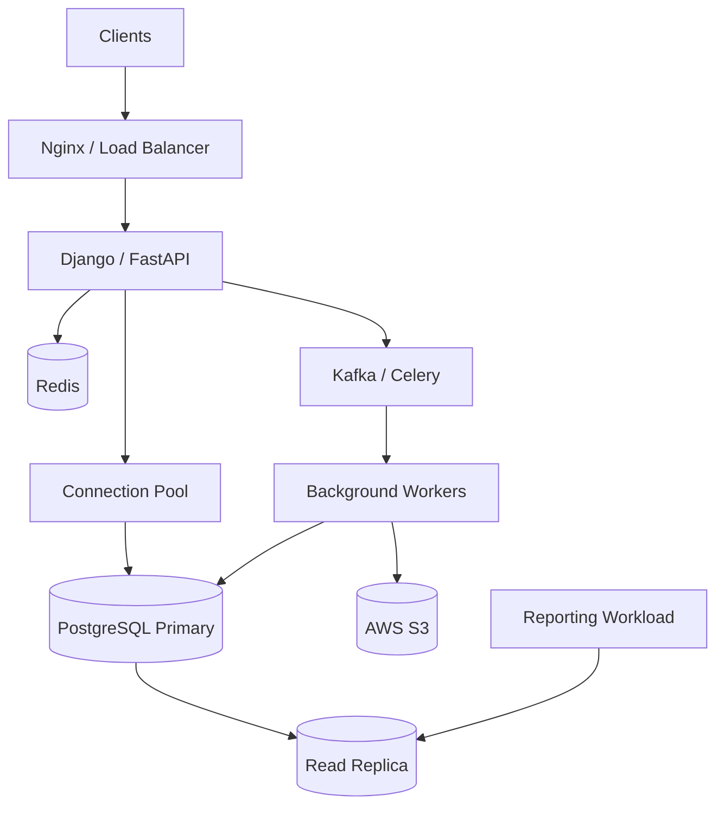
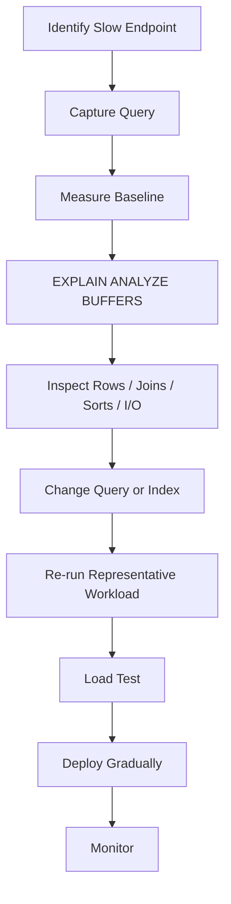

# 08- Performance Considerations

## Overview

Performance in a multi-tenant SaaS database is not only about making individual SQL queries fast. The database must remain predictable as:

- The number of tenants grows.
- Individual tenants become much larger than the average.
- Traffic becomes uneven across tenants.
- Background jobs compete with interactive requests.
- RLS policies add row-access filtering.
- Indexes and constraints increase write costs.
- Reporting and exports introduce large scans.

A shared-schema PostgreSQL architecture commonly looks like:

```text
                 SaaS Application
                       |
          +------------+------------+
          |                         |
    Interactive APIs          Background Workers
          |                         |
          +------------+------------+
                       |
                Connection Pool
                       |
                    PostgreSQL
                       |
        +--------------+--------------+
        |              |              |
      Tenant A       Tenant B       Tenant C
      10K rows       1M rows        100M rows
```

The most important performance principle is:

> **Design for the largest tenant and the busiest workload, not the average tenant.**

---

## Performance Model

A useful way to reason about request performance is:

```text
Request latency
    =
application processing
+
connection acquisition
+
query planning
+
database execution
+
lock waiting
+
network transfer
+
serialization
```

For a database-heavy API:

```text
API
 ↓
connection pool
 ↓
PostgreSQL
 ↓
RLS
 ↓
index scan
 ↓
joins / aggregation
 ↓
result
 ↓
API serialization
```

Optimizing only SQL execution time can therefore miss:

- Connection pool saturation.
- Lock contention.
- Network transfer.
- Large JSON responses.
- Application-side processing.
- Replica lag.
- Background job contention.

---

## Tenant Size Distribution

Multi-tenant systems rarely have uniform data distribution.

A realistic system may contain:

| Tenant class | Relative size | Typical concern |
|---|---:|---|
| Small | Thousands of rows | Low query cost |
| Medium | Millions of rows | Index quality |
| Large | Tens of millions | Query planning and I/O |
| Enterprise | Hundreds of millions+ | Partitioning, workload isolation |

Average row count is therefore a poor performance metric.

For example:

```text
Average tenant = 500,000 rows
Largest tenant = 200,000,000 rows
```

A query benchmark using only the average tenant can produce misleading results.

---

## Noisy Neighbors

A noisy neighbor is a tenant whose workload consumes disproportionate resources.

Example:

```text
Tenant A → normal CRUD
Tenant B → 50 concurrent exports
Tenant C → bulk update
Tenant D → normal traffic
```

The database sees:

```text
CPU
I/O
locks
buffer cache pressure
WAL
connections
temporary files
```

RLS does not prevent this resource contention.

Tenant isolation therefore has two separate dimensions:

```text
Data isolation
    ↓
RLS / authorization

Resource isolation
    ↓
rate limits / queues / quotas / workload separation
```

---

## Performance Architecture

A production SaaS architecture can separate workloads:



The goal is to prevent expensive workloads from competing directly with latency-sensitive requests.

---

## Query Design Principles

Most database performance problems should first be addressed through query design.

Prefer:

```sql
SELECT
    id,
    name,
    status,
    created_at
FROM projects
WHERE tenant_id = $1
  AND deleted_at IS NULL
ORDER BY created_at DESC, id DESC
LIMIT 50;
```

over:

```sql
SELECT *
FROM projects;
```

The first query:

- Restricts tenant scope.
- Filters inactive rows.
- Selects only required columns.
- Uses bounded pagination.
- Has deterministic ordering.

---

## Select Only Required Columns

Avoid:

```sql
SELECT *
FROM projects
WHERE tenant_id = $1;
```

Prefer:

```sql
SELECT
    id,
    name,
    status,
    created_at
FROM projects
WHERE tenant_id = $1;
```

Returning unnecessary columns increases:

- Database I/O.
- Memory usage.
- Network transfer.
- Serialization cost.
- API response size.

This matters especially when rows contain:

```text
JSON
TEXT
BYTEA
large metadata
```

---

## Unbounded Queries

Avoid:

```sql
SELECT *
FROM audit_logs
WHERE tenant_id = $1;
```

Use bounded pagination:

```sql
SELECT
    id,
    action,
    created_at
FROM audit_logs
WHERE tenant_id = $1
  AND (created_at, id) < ($2, $3)
ORDER BY created_at DESC, id DESC
LIMIT 100;
```

For very large datasets, keyset pagination usually provides more predictable performance than deep `OFFSET`.

---

## Pagination Strategy

For large tenant datasets:

```text
OFFSET
    ↓
process preceding rows
    ↓
discard them
    ↓
return page
```

Keyset pagination instead uses:

```text
last cursor
    ↓
seek into ordered index
    ↓
return next rows
```

Example:

```sql
SELECT
    id,
    name,
    created_at
FROM projects
WHERE tenant_id = $1
  AND (created_at, id) < ($2, $3)
ORDER BY created_at DESC, id DESC
LIMIT 50;
```

Supporting index:

```sql
CREATE INDEX projects_tenant_created_idx
ON projects (
    tenant_id,
    created_at DESC,
    id DESC
);
```

---

## Tenant-Aware Indexing

Indexes should reflect actual access patterns.

For:

```sql
WHERE tenant_id = $1
ORDER BY created_at DESC, id DESC
```

use:

```sql
CREATE INDEX projects_tenant_created_idx
ON projects (
    tenant_id,
    created_at DESC,
    id DESC
);
```

The leading tenant column is important because tenant filtering is a dominant access pattern in a shared-schema design.

---

## Composite Index Column Order

Suppose the query is:

```sql
WHERE tenant_id = $1
  AND status = $2
ORDER BY created_at DESC, id DESC
```

A candidate index is:

```sql
CREATE INDEX projects_tenant_status_created_idx
ON projects (
    tenant_id,
    status,
    created_at DESC,
    id DESC
);
```

The ordering should follow the workload rather than a generic rule such as "put the most selective column first."

Consider:

- Equality predicates.
- Range predicates.
- Sort order.
- Pagination.
- Join conditions.
- Query frequency.
- Data distribution.

---

## Partial Indexes

For stable subsets such as active rows:

```sql
CREATE INDEX projects_active_tenant_created_idx
ON projects (
    tenant_id,
    created_at DESC,
    id DESC
)
WHERE deleted_at IS NULL;
```

This can reduce index size and write overhead compared with indexing all rows.

Use partial indexes when the predicate is stable and frequently used.

---

## Indexes Are Not Free

Every additional index creates costs:

```text
INSERT
UPDATE
DELETE
    ↓
index maintenance
    ↓
WAL
    ↓
replication
    ↓
storage
    ↓
vacuum / maintenance
```

An index can improve read latency while increasing write latency.

Therefore:

> **Index for measured access patterns, not for every column.**

---

## Index-Only Scans

A well-designed query may be able to retrieve required columns from the index without fetching heap tuples.

For example:

```sql
CREATE INDEX projects_tenant_created_covering_idx
ON projects (
    tenant_id,
    created_at DESC,
    id DESC
)
INCLUDE (
    name,
    status
);
```

This can help read-heavy endpoints.

However, index-only scans depend on PostgreSQL's visibility map and workload characteristics. `INCLUDE` should not be used indiscriminately because larger indexes consume more storage and increase write costs.

---

## RLS Performance

RLS introduces policy evaluation into query execution.

A simple policy:

```sql
tenant_id = current_setting('app.tenant_id')::uuid
```

is generally easier to reason about than a policy containing multiple joins and complex authorization logic.

Avoid policies that repeatedly execute expensive subqueries for every row.

Prefer:

```text
simple tenant predicate
+
appropriate index
```

over:

```text
complex policy
+
multiple authorization joins
+
expensive functions
```

when the business requirements allow it.

---

## RLS and Explicit Tenant Predicates

Even with RLS:

```sql
SELECT
    id,
    name
FROM projects
WHERE deleted_at IS NULL;
```

an explicit tenant predicate can make query intent clearer:

```sql
SELECT
    id,
    name
FROM projects
WHERE tenant_id = $1
  AND deleted_at IS NULL;
```

RLS remains the enforcement boundary, while the explicit predicate can help the query communicate its expected scope and may improve optimization opportunities.

The exact benefit should be measured with realistic execution plans.

---

## Connection Pooling

Database performance can collapse if connection management is poor.

A typical architecture is:

```text
Kubernetes Pods
      ↓
Application pools
      ↓
PgBouncer
      ↓
PostgreSQL
```

Too many application connections can cause:

```text
CPU contention
memory pressure
context switching
lock contention
```

More connections do not automatically produce more throughput.

Connection limits should be designed from:

```text
database capacity
+
query concurrency
+
number of application instances
+
background workers
```

---

## Pool Size Across Kubernetes

Suppose:

```text
20 pods
```

and each pod has:

```text
20 PostgreSQL connections
```

Potential maximum:

```text
20 × 20 = 400 connections
```

before considering workers or other services.

A pool that is reasonable for one pod can become dangerous when multiplied across a cluster.

Always calculate connection capacity globally.

---

## PgBouncer

PgBouncer can reduce the number of actual PostgreSQL backend connections.

A transaction-pooling architecture can be particularly useful for high-concurrency APIs.

However, applications using RLS context should establish tenant state transaction-locally:

```sql
SET LOCAL app.tenant_id = $1;
```

rather than relying on persistent connection state.

---

## Query Planning

PostgreSQL chooses an execution plan based on:

```text
query
+
statistics
+
available indexes
+
estimated costs
+
configuration
```

A query that is fast for one tenant may behave differently for another because data distributions differ.

For example:

```text
Tenant A → 1,000 active projects
Tenant B → 50,000,000 active projects
```

The planner's cost assumptions matter.

---

## EXPLAIN

Use:

```sql
EXPLAIN
SELECT
    id,
    name
FROM projects
WHERE tenant_id = $1
ORDER BY created_at DESC, id DESC
LIMIT 50;
```

For measured execution:

```sql
EXPLAIN (ANALYZE, BUFFERS)
SELECT
    id,
    name
FROM projects
WHERE tenant_id = $1
ORDER BY created_at DESC, id DESC
LIMIT 50;
```

Look for:

- Estimated vs actual rows.
- Sequential scans.
- Index scans.
- Sort operations.
- Hash operations.
- Nested loops.
- Buffer reads.
- Temporary files.
- Rows removed by filters.
- Execution time.

---

## Estimated vs Actual Rows

A major warning sign is:

```text
estimated rows = 10
actual rows    = 10,000,000
```

Large estimation errors can lead to poor plans.

Potential causes include:

- Stale statistics.
- Data skew.
- Correlated columns.
- Rapidly changing data.
- Inadequate statistics targets.
- Complex predicates.

---

## Statistics

PostgreSQL uses statistics to estimate query costs.

After significant data changes, normal autovacuum/analyze behavior should keep statistics reasonably current.

For important workloads, inspect:

```sql
ANALYZE projects;
```

Do not blindly run manual `ANALYZE` as a universal fix.

For correlated columns, PostgreSQL extended statistics can sometimes improve estimates.

---

## Data Skew

Multi-tenant databases naturally create skew:

```text
tenant_id = A → 10 rows
tenant_id = B → 100 rows
tenant_id = C → 100,000,000 rows
```

A query plan optimized for average cardinality may not be ideal for the largest tenant.

Benchmark using representative tenants rather than only synthetic uniform data.

---

## Query Optimization Workflow

Use a repeatable process:



Avoid optimizing based solely on intuition.

---

## Join Performance

Multi-tenant queries frequently join:

```text
tenant
projects
users
subscriptions
invoices
audit logs
```

Ensure joins preserve tenant scope and have appropriate indexes.

Example:

```sql
SELECT
    p.id,
    p.name,
    COUNT(t.id) AS task_count
FROM projects AS p
LEFT JOIN tasks AS t
  ON t.project_id = p.id
 AND t.tenant_id = p.tenant_id
WHERE p.tenant_id = $1
GROUP BY p.id, p.name
ORDER BY p.created_at DESC, p.id DESC
LIMIT 50;
```

The query should be evaluated for both:

```text
correctness
+
execution cost
```

---

## Avoiding Join Explosion

Suppose:

```text
1 project
100 tasks
50 comments
```

Joining both child tables can produce:

```text
100 × 50 = 5,000 intermediate combinations
```

before aggregation.

This can cause severe performance problems.

Possible approaches include:

- Pre-aggregate child data.
- Use separate queries.
- Use correlated subqueries where appropriate.
- Aggregate each relationship independently.
- Return paginated child collections separately.

Understand result grain before optimizing the query.

---

## EXISTS for Existence Checks

If the application only needs to know whether a related row exists:

Avoid:

```sql
SELECT COUNT(*)
FROM project_members
WHERE tenant_id = $1
  AND project_id = $2
  AND user_id = $3;
```

when a count is not needed.

Prefer:

```sql
SELECT EXISTS (
    SELECT 1
    FROM project_members
    WHERE tenant_id = $1
      AND project_id = $2
      AND user_id = $3
);
```

PostgreSQL can use a semi-join or another efficient plan.

`EXISTS` is not universally faster, so measure the actual workload.

---

## Aggregation Performance

Large tenant reports can be expensive:

```sql
SELECT
    status,
    COUNT(*)
FROM projects
WHERE tenant_id = $1
GROUP BY status;
```

For frequently requested reports, consider:

- Pre-aggregated tables.
- Materialized views.
- Cached summaries.
- Asynchronous reporting.
- Dedicated reporting databases.

Do not move every aggregate into Redis simply because PostgreSQL is doing work.

---

## OLTP vs Reporting Workloads

Interactive APIs and reporting workloads have different performance characteristics.

| Workload | Typical behavior | Recommended approach |
|---|---|---|
| CRUD | Small, indexed queries | Primary database |
| List APIs | Bounded reads | Keyset + indexes |
| Audit history | Large sequential reads | Keyset + archival |
| Dashboards | Aggregations | Cached/pre-aggregated |
| Exports | Large scans | Background workers |
| Analytics | Heavy scans | Reporting system / warehouse |

Trying to make one PostgreSQL workload serve every purpose can create contention.

---

## Background Jobs

Celery workers can consume substantial database capacity.

Examples:

```text
invoice generation
exports
email processing
reconciliation
backfills
data cleanup
```

Do not allow unlimited workers to run database-heavy tasks concurrently.

Use:

```text
worker concurrency limits
+
task queues
+
batching
+
rate limiting
```

---

## Batch Processing

Avoid processing millions of rows in one transaction:

```sql
UPDATE usage_records
SET processed = true
WHERE tenant_id = $1;
```

For large workloads, process bounded batches.

Keyset-based batching:

```sql
SELECT
    id
FROM usage_records
WHERE tenant_id = $1
  AND id > $2
ORDER BY id
LIMIT 1000;
```

Persist progress where restartability matters.

---

## `SKIP LOCKED` for Work Queues

For database-backed job queues:

```sql
SELECT
    id
FROM jobs
WHERE status = 'PENDING'
ORDER BY id
FOR UPDATE SKIP LOCKED
LIMIT 100;
```

This allows concurrent workers to claim different rows without waiting on rows already locked by another worker.

Use it intentionally for queue-like workloads.

It is not a general replacement for transaction design.

---

## Large Deletes

Avoid deleting millions of rows in one transaction:

```sql
DELETE FROM audit_logs
WHERE tenant_id = $1;
```

Potential consequences include:

```text
large WAL volume
long locks
vacuum pressure
replica lag
large rollback cost
```

Prefer bounded batches or partition lifecycle operations where appropriate.

---

## Partitioning

Partitioning can become useful when a table grows very large.

Possible partition dimensions include:

```text
time
tenant
tenant class
```

Time-based partitioning is often easier operationally for append-heavy data:

```text
audit_logs_2026_01
audit_logs_2026_02
audit_logs_2026_03
```

Tenant-based partitioning can become problematic if the tenant count is very high.

Avoid creating one PostgreSQL partition per small tenant without a strong operational reason.

---

## When to Consider Partitioning

Consider partitioning when there is a clear operational or performance benefit such as:

- Very large tables.
- Time-based retention.
- Efficient archival.
- Partition pruning.
- Lifecycle management.
- Manageable maintenance boundaries.

Partitioning should not be introduced merely because a table is "large."

---

## Large Tenant Isolation

At some scale, shared-schema PostgreSQL may no longer be appropriate for every tenant.

A possible architecture is:

```text
Small tenants
    ↓
Shared PostgreSQL

Large tenants
    ↓
Dedicated database / cluster
```

This creates a hybrid tenancy model.

Potential benefits:

- Resource isolation.
- Independent scaling.
- Tenant-specific maintenance.
- Reduced noisy-neighbor risk.

Costs include:

- Routing complexity.
- More operational overhead.
- More migrations.
- More backups.
- More monitoring.
- More connection management.

---

## Hybrid Multi-Tenancy

A mature SaaS architecture may use:

```text
Tier 1 → shared schema
Tier 2 → dedicated schema
Tier 3 → dedicated database
```

Tenant placement can be based on:

```text
data volume
traffic
compliance
performance requirements
contractual requirements
```

This should be a deliberate architectural decision rather than an emergency response to database saturation.

---

## Redis Caching

Redis can reduce repeated database reads:

```text
API
 ↓
Redis
 ↓ cache miss
PostgreSQL
```

Tenant-aware cache keys should include tenant identity when the cached data is tenant-specific:

```text
tenant:{tenant_id}:project:{project_id}
```

Avoid:

```text
project:{project_id}
```

if IDs are not globally unique or the cache object contains tenant-specific authorization state.

Caching should not become the primary tenant-isolation mechanism.

---

## Cache Invalidation

Caching introduces a second source of state.

When tenant data changes:

```text
PostgreSQL update
    ↓
cache invalidation/update
```

Potential approaches include:

- Explicit invalidation.
- TTL.
- Write-through caching.
- Event-driven invalidation.

For correctness-sensitive data, PostgreSQL remains the source of truth.

---

## Kafka and Database Load

Kafka can move asynchronous workloads away from request paths:

```text
API
 ↓
PostgreSQL + Outbox
 ↓
Kafka
 ↓
Consumer
 ↓
Async processing
```

This prevents external work from extending database transactions.

However, consumers can still overwhelm PostgreSQL if concurrency is unrestricted.

Control:

```text
consumer concurrency
+
batch size
+
database pool size
+
retry rate
```

---

## API-Level Resource Controls

For multi-tenant SaaS systems, useful controls include:

```text
maximum page size
request rate limits
per-tenant quotas
export limits
concurrent-job limits
background-worker limits
```

For example:

```text
standard tenant
    → 100 API requests/sec

large export
    → asynchronous job

heavy analytics
    → reporting workload
```

The exact limits should come from capacity planning and product requirements.

---

## Timeouts

Every database-heavy request should have bounded execution.

Important PostgreSQL settings include:

```sql
SET LOCAL statement_timeout = '5s';
SET LOCAL lock_timeout = '1s';
```

These solve different problems:

| Setting | Purpose |
|---|---|
| `statement_timeout` | Limits statement execution time |
| `lock_timeout` | Limits waiting for locks |
| `idle_in_transaction_session_timeout` | Terminates sessions idle inside transactions |

Choose values according to endpoint requirements rather than applying one global timeout blindly.

---

## Long Transactions

Long transactions can cause:

- Old row versions to remain visible.
- Vacuum delays.
- Table/index bloat.
- Lock retention.
- Replica effects.
- Large rollback costs.

Keep interactive transactions short.

Prefer:

```text
BEGIN
  validate
  modify
  commit
```

over:

```text
BEGIN
  database work
  external API
  network retry
  long computation
  commit
```

---

## Read Replicas

Read replicas can offload read traffic:

```text
Writes
  ↓
Primary

Reads
  ↓
Replica
```

However:

```text
replica lag
```

means recently committed data may not be immediately visible.

Do not send read-after-write operations to replicas unless the consistency model allows it.

---

## Read Routing

A practical backend can classify queries:

```text
write
    → primary

read-after-write
    → primary

eventual-consistency read
    → replica

heavy reporting
    → reporting system
```

The routing decision should be based on business consistency requirements, not simply "all SELECTs go to replicas."

---

## High Availability

A production PostgreSQL deployment should account for:

```text
primary failure
replica promotion
connection failover
application retry
DNS / endpoint changes
```

Performance monitoring should continue after failover because the promoted replica may have different:

- Cache state.
- Connection load.
- Storage characteristics.
- Replication history.
- Query workload.

---

## Disaster Recovery

Performance planning should include recovery behavior.

After restoring or rebuilding a database:

```text
database restore
    ↓
indexes available
    ↓
statistics refreshed
    ↓
application traffic
```

A restored database may have different cache warmth and statistics behavior.

Benchmark recovery scenarios where performance during recovery is operationally important.

---

## Monitoring

Monitor both application and database layers.

### Application Metrics

Track:

```text
request latency
p50
p95
p99
error rate
request rate
response size
```

### PostgreSQL Metrics

Track:

```text
CPU
memory
IOPS
IO latency
connections
locks
deadlocks
cache hit ratio
WAL generation
replication lag
transaction age
temporary files
query latency
```

### Tenant-Level Signals

Where privacy and cardinality considerations permit, track aggregated tenant classes:

```text
small
medium
large
enterprise
```

This helps identify workload skew without turning every metric label into a high-cardinality tenant identifier.

---

## Slow Query Monitoring

Use PostgreSQL query statistics where available, such as `pg_stat_statements`.

Look for:

```text
high total execution time
high mean latency
high execution count
high shared buffer reads
```

A query with:

```text
1 ms × 1,000,000 executions
```

may matter more than:

```text
5 seconds × 10 executions
```

Optimize based on total workload impact, not only the slowest individual query.

---

## Connection Monitoring

Watch:

```sql
SELECT
    state,
    COUNT(*)
FROM pg_stat_activity
GROUP BY state;
```

Also inspect:

```text
active connections
idle connections
idle in transaction
waiting sessions
long-running queries
```

A database can be healthy at low traffic and fail under connection saturation even when individual queries remain fast.

---

## Lock Monitoring

Performance degradation can come from waiting rather than execution.

Typical chain:

```text
Transaction A
    ↓
holds lock

Transaction B
    ↓
waits

Transaction C
    ↓
waits behind B
```

Measure:

```text
lock wait duration
blocking sessions
deadlocks
long-running transactions
```

Reducing lock duration can be more valuable than optimizing SQL CPU time.

---

## Application Query Patterns

Django and SQLAlchemy applications should avoid accidental query multiplication.

Django example:

```python
projects = (
    Project.objects
    .filter(tenant_id=tenant_id)
    .select_related("owner")
    .prefetch_related("members")
    .order_by("-created_at", "-id")[:50]
)
```

The ORM should be treated as a SQL generation layer whose resulting queries still require inspection.

Use query logging and database plans to validate behavior.

---

## Python Serialization Cost

A fast SQL query can still produce a slow endpoint.

Example:

```text
PostgreSQL → 20 ms
Python ORM/model processing → 30 ms
JSON serialization → 80 ms
network → 20 ms
```

Total:

```text
150 ms
```

Therefore measure:

```text
database time
+
application time
+
serialization time
```

Do not assume every performance problem is SQL execution.

---

## Security and Performance

Security controls can affect performance.

Examples:

```text
RLS policies
authorization joins
audit logging
encryption
tenant-aware filtering
```

The goal is not to remove security controls for speed.

Instead:

```text
secure design
+
simple policies
+
appropriate indexes
+
measured execution
```

should be used together.

---

## Cost Considerations

Database performance directly affects AWS cost.

Poor query design can increase:

```text
CPU utilization
storage I/O
IOPS
replica requirements
instance size
backup volume
network transfer
```

A single missing index can therefore become a recurring infrastructure cost.

Conversely, unnecessary indexes also increase:

```text
storage
WAL
write amplification
maintenance
```

Performance optimization should consider both latency and total cost.

---

## Performance Testing

A production-oriented test environment should include realistic:

```text
tenant counts
tenant size distribution
request concurrency
background jobs
database statistics
indexes
RLS policies
```

Test scenarios such as:

```text
small tenant under normal traffic
large tenant under normal traffic
large tenant during export
many small tenants concurrently
background jobs + API traffic
database failover
replica lag
```

---

## Load Testing

A useful load test should model tenant skew.

Avoid:

```text
1,000 virtual users
all using the same tenant size
```

Prefer:

```text
70% small tenants
20% medium tenants
8% large tenants
2% enterprise tenants
```

with workloads approximating production behavior.

The exact distribution should come from real usage patterns.

---

## Benchmarking Before and After

A useful performance change should have:

```text
baseline
    ↓
hypothesis
    ↓
change
    ↓
benchmark
    ↓
load test
    ↓
production rollout
    ↓
monitor
```

Capture:

```text
query latency
database CPU
I/O
buffer reads
lock waits
application latency
```

This prevents "optimization" that improves one query while degrading the overall system.

---

## Common Mistakes

### Benchmarking Only the Average Tenant

The largest tenant often determines architectural limits.

**Fix:** benchmark tenant-size extremes and realistic skew.

### Assuming RLS Solves Resource Isolation

RLS restricts rows, not CPU or I/O.

**Fix:** use quotas, queues, rate limits, and workload isolation.

### Adding Indexes Without Measuring

More indexes increase write cost and storage.

**Fix:** create indexes from access patterns and verify plans.

### Using OFFSET for Deep Pagination

Large offsets can produce increasing database work.

**Fix:** use keyset pagination for large sequential collections.

### Running Huge Background Jobs Concurrently

Unlimited Celery/Kafka concurrency can overwhelm PostgreSQL.

**Fix:** control worker concurrency and database pool capacity.

### Running Large Deletes in One Transaction

This can produce large WAL, bloat, lock duration, and replica lag.

**Fix:** batch deletes or use partition lifecycle operations.

### Sending Every Read to a Replica

Replica lag can break read-after-write behavior.

**Fix:** classify reads by consistency requirements.

### Optimizing SQL but Ignoring Serialization

The database may be fast while Python spends most of the request time processing results.

**Fix:** measure the entire request path.

### Creating One Partition Per Tenant

Large tenant counts can create operational complexity.

**Fix:** partition only when the workload provides a clear benefit.

### Using Redis as the Source of Truth

Cache inconsistency can produce incorrect tenant data.

**Fix:** PostgreSQL remains authoritative for transactional state.

---

## Production Performance Checklist

### Query Design

- [ ] Queries return only required columns.
- [ ] Queries are bounded.
- [ ] Large collections use keyset pagination where appropriate.
- [ ] Ordering is deterministic.
- [ ] N+1 patterns are eliminated.
- [ ] Join cardinality is understood.
- [ ] Large aggregations have an intentional architecture.

### Indexing

- [ ] Tenant-aware indexes support common access paths.
- [ ] Composite index order matches actual predicates and ordering.
- [ ] Partial indexes are used where justified.
- [ ] Redundant indexes are periodically reviewed.
- [ ] Index size and write amplification are monitored.
- [ ] Execution plans are validated with realistic data.

### RLS

- [ ] RLS policies are simple.
- [ ] Tenant context is transaction-scoped.
- [ ] Application roles do not bypass RLS unintentionally.
- [ ] RLS queries are benchmarked.
- [ ] Cross-tenant access tests exist.

### Workload Isolation

- [ ] API traffic is separated from heavy background workloads.
- [ ] Export jobs are asynchronous.
- [ ] Celery/Kafka concurrency is bounded.
- [ ] Per-tenant quotas exist where necessary.
- [ ] Large tenants have an escalation strategy.

### Operations

- [ ] Connection pool sizes are calculated across all pods.
- [ ] Query timeouts are configured.
- [ ] Lock waits are monitored.
- [ ] Slow queries are tracked.
- [ ] Replica lag is monitored.
- [ ] PostgreSQL capacity is regularly reviewed.

### Reliability

- [ ] Failover has been tested.
- [ ] Recovery performance has been tested.
- [ ] Backups are regularly validated.
- [ ] Large transactions are avoided.
- [ ] Background jobs are restartable and idempotent.

---

## Senior Performance Decision Framework

When a tenant-scoped endpoint becomes slow, investigate in this order:

```text
Is the endpoint doing too much work?
        ↓
Is the result bounded?
        ↓
Is the tenant predicate correct?
        ↓
Is RLS adding expensive policy evaluation?
        ↓
Is the query using the intended index?
        ↓
Are estimated and actual rows reasonable?
        ↓
Are joins multiplying rows?
        ↓
Are sorts / hashes spilling to disk?
        ↓
Are sessions waiting on locks?
        ↓
Is the connection pool saturated?
        ↓
Is PostgreSQL CPU / I/O saturated?
        ↓
Is application serialization expensive?
        ↓
Is another tenant causing resource contention?
        ↓
Should this workload move to a worker / replica / reporting system?
        ↓
Has the tenant outgrown the shared architecture?
```

This approach prevents prematurely scaling the database when the real problem is an inefficient query or workload design.

---

## Recommended Performance Architecture

For a mature multi-tenant SaaS system:

```text
                    ┌─────────────────────┐
                    │      Clients        │
                    └──────────┬──────────┘
                               │
                               ▼
                    ┌─────────────────────┐
                    │ Nginx / Load Balancer│
                    └──────────┬──────────┘
                               │
                               ▼
                    ┌─────────────────────┐
                    │ Django / FastAPI    │
                    └──────┬───────┬──────┘
                           │       │
                ┌──────────┘       └──────────┐
                ▼                             ▼
       ┌────────────────┐            ┌────────────────┐
       │ Redis Cache    │            │ Kafka / Celery │
       └────────────────┘            └───────┬────────┘
                                             │
                                             ▼
                                    ┌────────────────┐
                                    │ Worker Pool    │
                                    └───────┬────────┘
                                            │
                                            ▼
                                     ┌──────────────┐
                                     │ PostgreSQL   │
                                     │ Primary      │
                                     └──────┬───────┘
                                            │
                              ┌─────────────┴─────────────┐
                              ▼                           ▼
                       Read Replica               AWS S3 / Reports
```

The database remains the transactional source of truth while different workloads are deliberately separated.

## Key Takeaways

- **Multi-tenant database performance must be designed around tenant-size skew and noisy-neighbor behavior rather than average tenant size.**
- **Query shape, deterministic keyset pagination, tenant-aware indexes, simple RLS policies, and bounded result sets are the primary foundations of predictable PostgreSQL performance.**
- **Database capacity is shared across API requests, Celery/Kafka workers, reporting, and exports; workload isolation and connection-pool control are therefore as important as SQL optimization.**
- **Performance diagnosis should use real execution evidence such as `EXPLAIN (ANALYZE, BUFFERS)`, query statistics, lock waits, connection usage, tenant distribution, and application latency rather than intuition alone.**
- **At sufficient scale, optimization may evolve into architectural isolation: replicas, asynchronous processing, reporting systems, quotas, partitioning, or dedicated databases for exceptionally large tenants.**